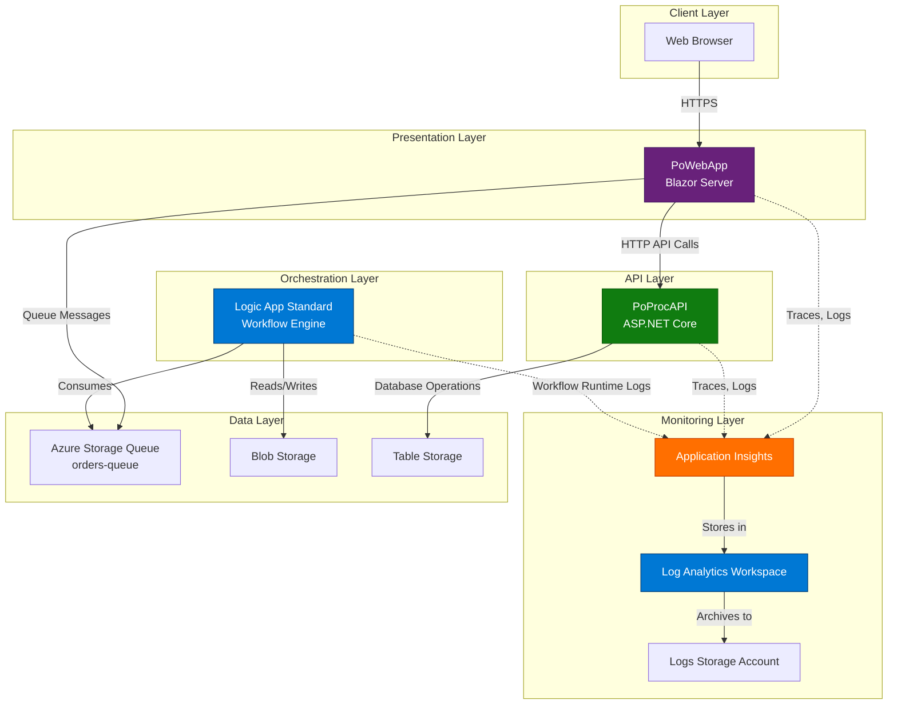
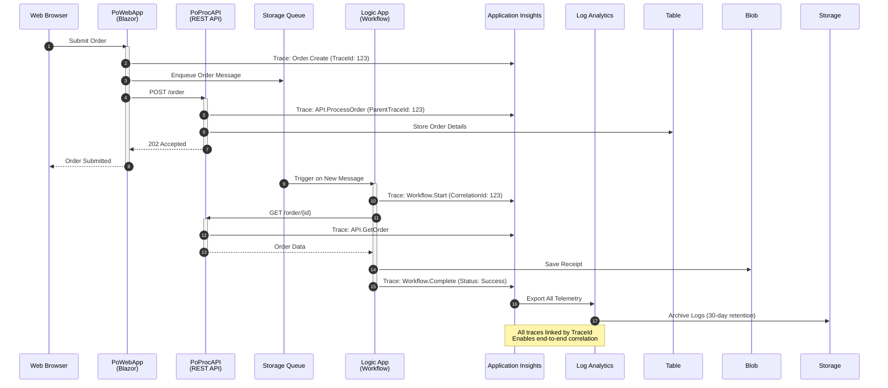

# Azure Logic Apps Monitoring Solution

[](https://opensource.org/licenses/MIT)
[](https://azure.microsoft.com/en-us/products/logic-apps/)
[](https://opentelemetry.io/)

A comprehensive, production-ready open-source solution demonstrating Azure Monitor best practices for Logic Apps Standard, ASP.NET Core applications, and enterprise workflow orchestration using **OpenTelemetry**, **Application Insights**, and **Log Analytics**.

## 📋 Project Overview

This project provides a reference implementation for enterprise-grade observability in Azure Logic Apps environments. It showcases distributed tracing, structured logging, custom instrumentation, and advanced monitoring patterns that go beyond default Azure Monitor capabilities.

**Key Highlights:**
- **Distributed Tracing**: End-to-end request correlation across Logic Apps, Web Apps, and APIs using OpenTelemetry
- **Structured Logging**: Contextual logs with trace correlation for efficient troubleshooting
- **Custom Instrumentation**: Business-level telemetry with semantic conventions
- **Infrastructure as Code**: Fully automated deployment using Bicep and Azure Developer CLI
- **Production-Ready**: Includes health checks, diagnostic settings, and monitoring best practices

---

## 👥 Target Audience

| Role | Responsibilities | How to Leverage This Solution | Benefits |
|------|-----------------|-------------------------------|----------|
| **Cloud Solution Architect** | Design cloud architectures, define monitoring strategies, ensure compliance | Use as reference architecture for Logic Apps observability; customize Bicep templates for enterprise requirements | Accelerated design phase; proven patterns; reduced risk |
| **DevOps Engineer** | Automate deployments, maintain CI/CD pipelines, monitor infrastructure health | Deploy using `azd` CLI; integrate monitoring into pipelines; configure alerts | Simplified deployment; repeatable infrastructure; automated monitoring |
| **Application Developer** | Build business logic, implement APIs, troubleshoot application issues | Study distributed tracing examples in DistributedTracingExample.cs; use structured logging patterns | Faster debugging; improved code quality; better telemetry |
| **Site Reliability Engineer (SRE)** | Ensure system reliability, manage incidents, optimize performance | Leverage KQL queries; configure alerts; analyze trace data in Application Insights | Reduced MTTR; proactive issue detection; better incident response |
| **Platform Engineer** | Standardize infrastructure, maintain reusable templates, enforce governance | Extend Bicep modules for multi-region deployments; enforce diagnostic settings across subscriptions | Consistent infrastructure; reduced technical debt; governance enforcement |
| **Security Engineer** | Monitor access patterns, detect anomalies, ensure compliance | Audit diagnostic logs; track authentication events; monitor Azure RBAC changes | Enhanced security posture; compliance visibility; threat detection |

---

## ✨ Features

### Design Principles

This solution is built on three core design principles:

1. **Observability by Design**: Telemetry is embedded at every layer—infrastructure, application, and business logic.
2. **Automation First**: Full infrastructure-as-code with repeatable, idempotent deployments.
3. **Enterprise-Ready**: Production-grade patterns including error handling, retries, and comprehensive diagnostics.

### Feature Overview

| Feature | Purpose | Benefit |
|---------|---------|---------|
| **OpenTelemetry Integration** | Standards-based distributed tracing across services | Vendor-agnostic instrumentation; future-proof architecture |
| **Application Insights Workspace Mode** | Centralized telemetry storage in Log Analytics | Unified query experience; cost optimization; advanced analytics |
| **Custom Activity Sources** | Business-specific trace spans (Orders, Messaging, Database) | Domain-level observability; better troubleshooting |
| **Semantic Conventions** | Standardized tag naming for telemetry attributes | Consistent queries; easier correlation; improved searchability |
| **Structured Logging Extensions** | Contextual logging with automatic trace correlation | Faster root cause analysis; rich log context |
| **Diagnostic Settings** | Automated log and metric collection for all Azure resources | Complete visibility; compliance; long-term retention |
| **Health Checks** | Application-level health endpoints for monitoring | Proactive failure detection; automated recovery |
| **Auto-Scaling Configuration** | Elastic scale limits for App Service Plans and Logic Apps | Cost optimization; performance under load |
| **Managed Identity Authentication** | Password-less authentication to Azure Storage and services | Enhanced security; reduced credential management |

### Comparison with Default Azure Monitor

| Aspect | This Solution | Default Azure Monitor |
|--------|---------------|----------------------|
| **Trace Correlation** | End-to-end distributed tracing with custom spans | Basic HTTP request tracking only |
| **Custom Instrumentation** | Business-level telemetry (order processing, payment flows) | Infrastructure metrics only |
| **Logging Strategy** | Structured logs with semantic tags and trace IDs | Unstructured text logs |
| **Deployment Automation** | Full IaC with Bicep; one-command deployment (`azd up`) | Manual portal configuration |
| **Cost Management** | Optimized sampling, retention policies, linked storage | Default settings (higher cost) |
| **Query Capabilities** | Pre-built KQL queries for common scenarios | Generic queries only |
| **OpenTelemetry Support** | Native OpenTelemetry SDK with Azure Monitor exporter | Legacy Application Insights SDK |
| **Multi-Service Tracing** | Automatic trace propagation across Logic Apps, Web Apps, APIs | Limited to single-service visibility |

### Diagnostic Settings

Diagnostic Settings are the foundation of Azure Monitor, enabling automated collection of **logs** and **metrics** from Azure resources. This solution configures comprehensive diagnostic settings across all resources, sending telemetry to both **Log Analytics** (for querying) and **Storage Accounts** (for long-term retention).

#### Diagnostic Settings Collection

| Metric Category | Metrics Description | Log Category | Logs Description | Monitoring Improvement |
|-----------------|---------------------|--------------|------------------|------------------------|
| **AllMetrics** | CPU, memory, request count, response time | **WorkflowRuntime** | Workflow execution events (start, success, failure) | Real-time performance dashboards; capacity planning |
| **HTTP Metrics** | Request throughput, status codes, latency percentiles | **FunctionExecutionLogs** | Function invocation details, duration, bindings | Identify slow requests; optimize workflows |
| **Storage Metrics** | Queue depth, blob operations, table transactions | **AppServiceHTTPLogs** | HTTP request/response details for web apps | Track storage dependencies; detect bottlenecks |
| **Application Insights Metrics** | Custom metrics (order count, payment success rate) | **AppServiceConsoleLogs** | Application stdout/stderr output | Business-level KPIs; custom alerting |
| **Availability Metrics** | Uptime percentage, health check results | **AllLogs** | Complete audit trail (access, security, operations) | Proactive failure detection; compliance reporting |

**Example: Logic App Diagnostic Setting Configuration**

```bicep
resource wfDiag 'Microsoft.Insights/diagnosticSettings@2021-05-01-preview' = {
  name: '${workflowEngine.name}-diag'
  scope: workflowEngine
  properties: {
    workspaceId: workspaceId
    storageAccountId: storageAccountId
    logs: [
      {
        category: 'WorkflowRuntime'
        enabled: true
      }
    ]
    metrics: [
      {
        categoryGroup: 'allMetrics'
        enabled: true
      }
    ]
  }
}
```

**Why This Matters:**
- **Complete Visibility**: Every Azure resource sends logs and metrics to a centralized workspace
- **Troubleshooting**: Quickly correlate issues across Logic Apps, Storage, App Services
- **Compliance**: Meet audit requirements with long-term log retention in Storage
- **Cost Optimization**: Configure retention policies to balance cost and compliance

---

## 🏗️ Architecture


```mermaid
graph TB
    subgraph "Client Layer"
        USER[Web Browser]
    end

    subgraph "Monitoring Layer"
        LAWS[Log Analytics Workspace]
        AI[Application Insights]
        STORAGE[Logs Storage Account]
    end

    subgraph "Presentation Layer"
        WEBAPP[PoWebApp<br/>Blazor Server]
    end

    subgraph "API Layer"
        API[PoProcAPI<br/>ASP.NET Core]
    end

    subgraph "Orchestration Layer"
        LOGICAPP[Logic App Standard<br/>Workflow Engine]
    end

    subgraph "Data Layer"
        QUEUE[Azure Storage Queue<br/>orders-queue]
        BLOB[Blob Storage]
        TABLE[Table Storage]
    end

    USER -->|HTTPS| WEBAPP
    WEBAPP -->|HTTP API Calls| API
    WEBAPP -->|Queue Messages| QUEUE
    API -->|Database Operations| TABLE
    LOGICAPP -->|Consumes| QUEUE
    LOGICAPP -->|Reads/Writes| BLOB

    WEBAPP -.->|Traces, Logs| AI
    API -.->|Traces, Logs| AI
    LOGICAPP -.->|Workflow Runtime Logs| AI
    AI -->|Stores in| LAWS
    LAWS -->|Archives to| STORAGE

    style LAWS fill:#0078D4,stroke:#003B73,color:#fff
    style AI fill:#FF6F00,stroke:#C43E00,color:#fff
    style WEBAPP fill:#68217A,stroke:#3E145F,color:#fff
    style API fill:#107C10,stroke:#0B5A0B,color:#fff
    style LOGICAPP fill:#0078D4,stroke:#003B73,color:#fff
```

---

## 🔄 Data Flow


```mermaid
sequenceDiagram
    autonumber
    participant User as Web Browser
    participant WebApp as PoWebApp<br/>(Blazor)
    participant API as PoProcAPI<br/>(REST API)
    participant Queue as Storage Queue
    participant LogicApp as Logic App<br/>(Workflow)
    participant AI as Application Insights
    participant LAW as Log Analytics

    User->>WebApp: Submit Order
    activate WebApp
    WebApp->>AI: Trace: Order.Create (TraceId: 123)
    WebApp->>Queue: Enqueue Order Message
    WebApp->>API: POST /order
    activate API
    API->>AI: Trace: API.ProcessOrder (ParentTraceId: 123)
    API->>Table: Store Order Details
    API-->>WebApp: 202 Accepted
    deactivate API
    WebApp-->>User: Order Submitted
    deactivate WebApp

    Queue->>LogicApp: Trigger on New Message
    activate LogicApp
    LogicApp->>AI: Trace: Workflow.Start (CorrelationId: 123)
    LogicApp->>API: GET /order/{id}
    activate API
    API->>AI: Trace: API.GetOrder
    API-->>LogicApp: Order Data
    deactivate API
    LogicApp->>Blob: Save Receipt
    LogicApp->>AI: Trace: Workflow.Complete (Status: Success)
    deactivate LogicApp

    AI->>LAW: Export All Telemetry
    LAW->>Storage: Archive Logs (30-day retention)

    Note over AI,LAW: All traces linked by TraceId<br/>Enables end-to-end correlation
```

---

## 📦 Prerequisites

### Required Tools

| Tool | Version | Purpose | Installation Link |
|------|---------|---------|------------------|
| **Azure Developer CLI** | Latest | Deploy infrastructure and applications | [Install azd](https://learn.microsoft.com/azure/developer/azure-developer-cli/install-azd) |
| **.NET SDK** | 9.0+ | Build ASP.NET Core applications | [Download .NET](https://dotnet.microsoft.com/download) |
| **Azure CLI** | 2.50+ | Manage Azure resources | [Install Azure CLI](https://learn.microsoft.com/cli/azure/install-azure-cli) |
| **Visual Studio Code** | Latest | Code editor (optional) | [Download VS Code](https://code.visualstudio.com/) |
| **Git** | Latest | Clone repository | [Download Git](https://git-scm.com/) |

### Azure Subscription Requirements

- **Active Azure Subscription** with at least **Contributor** access
- **Resource Provider Registrations**:
  - `Microsoft.Web` (App Service, Logic Apps)
  - `Microsoft.Storage` (Storage Accounts)
  - `Microsoft.Insights` (Application Insights, Log Analytics)
  - `Microsoft.OperationalInsights` (Log Analytics Workspaces)

### RBAC Roles

| Role | Description | Documentation Link |
|------|-------------|-------------------|
| **Contributor** | Full management of Azure resources (required for deployment) | [Contributor role](https://learn.microsoft.com/azure/role-based-access-control/built-in-roles#contributor) |
| **Storage Blob Data Owner** | Manage blob containers and data (assigned to managed identities) | [Storage Blob Data Owner](https://learn.microsoft.com/azure/role-based-access-control/built-in-roles#storage-blob-data-owner) |
| **Storage Queue Data Contributor** | Send messages to queues (assigned to web app) | [Storage Queue Data Contributor](https://learn.microsoft.com/azure/role-based-access-control/built-in-roles#storage-queue-data-contributor) |
| **Monitoring Contributor** | Manage monitoring resources and diagnostic settings | [Monitoring Contributor](https://learn.microsoft.com/azure/role-based-access-control/built-in-roles#monitoring-contributor) |
| **Application Insights Component Contributor** | Manage Application Insights resources | [App Insights Contributor](https://learn.microsoft.com/azure/role-based-access-control/built-in-roles#application-insights-component-contributor) |

---

## 🚀 Installation & Deployment

### Step 1: Clone the Repository

```bash
git clone https://github.com/yourusername/Azure-LogicApps-Monitoring.git
cd Azure-LogicApps-Monitoring
```

### Step 2: Authenticate with Azure

```bash
azd auth login
```

This opens a browser window for Azure authentication. Select your subscription when prompted.

### Step 3: Initialize the Environment

```bash
azd env new
```

When prompted, enter:
- **Environment Name**: `dev` (or any name like `prod`, `staging`)
- **Azure Subscription**: Select your subscription from the list
- **Azure Location**: Choose a region (e.g., `eastus2`, `westus2`)

### Step 4: Deploy Infrastructure and Applications

```bash
azd up
```

This command:
1. ✅ Provisions Azure resources using Bicep templates (Log Analytics, App Insights, Storage, App Services, Logic Apps)
2. ✅ Builds .NET applications (`PoWebApp`, `PoProcAPI`)
3. ✅ Deploys applications to Azure App Service
4. ✅ Configures diagnostic settings and RBAC roles

**Expected Output:**

```
SUCCESS: Your application was provisioned and deployed to Azure in 8 minutes 34 seconds.

Resources:
  - Application Insights: eshop-orders-abc123-appinsights
  - Log Analytics Workspace: eshop-orders-abc123-law
  - Web App: eshop-orders-abc123-po-webapp
  - API App: eshop-orders-abc123-poproc-api
  - Logic App: eshop-orders-abc123-logicapp

Endpoints:
  - Web App: https://eshop-orders-abc123-po-webapp.azurewebsites.net
  - API: https://eshop-orders-abc123-poproc-api.azurewebsites.net
```

### Step 5: Verify Deployment

Navigate to the Web App URL in your browser. You should see the Blazor application.

### Step 6: Access Application Insights

```bash
azd monitor --overview
```

This opens the Azure Portal to the Application Insights overview page.

---

## 📊 Usage Examples

### Example 1: Query Failed Logic App Workflow Runs

**Scenario**: Identify all failed workflow executions in the last 24 hours.

**Kusto Query**:

```kql
requests
| where timestamp > ago(24h)
| where cloud_RoleName == "eshop-orders-logicapp"
| where success == false
| extend WorkflowName = tostring(customDimensions["WorkflowName"])
| extend RunId = tostring(customDimensions["WorkflowRunId"])
| extend ErrorMessage = tostring(customDimensions["ErrorMessage"])
| project timestamp, WorkflowName, RunId, resultCode, ErrorMessage, duration
| order by timestamp desc
```

**Sample Output**:

| timestamp | WorkflowName | RunId | resultCode | ErrorMessage | duration |
|-----------|-------------|-------|-----------|--------------|----------|
| 2025-01-15 14:32:45 | ProcessOrder | 08d9a1b2-... | 500 | Storage account unavailable | 5234 |
| 2025-01-15 13:18:22 | SendNotification | 7fa23c1d-... | 400 | Invalid email address | 1245 |

**Visualization**: Create a **Time Chart** showing failure count over time.

**Reference**: [Monitor Logic Apps with Application Insights](https://learn.microsoft.com/azure/logic-apps/monitor-logic-apps-log-analytics)

---

### Example 2: Trace End-to-End Request Flow

**Scenario**: Follow a single order from web submission through API processing to Logic App completion.

**Kusto Query**:

```kql
let traceId = "4bf92f3577b34da6a3ce929d0e0e4736"; // Replace with actual TraceId
union requests, dependencies, traces
| where operation_Id == traceId
| extend ComponentType = case(
    itemType == "request", "Request",
    itemType == "dependency", "Dependency",
    itemType == "trace", "Log",
    "Other"
)
| project timestamp, ComponentType, cloud_RoleName, name, duration, resultCode, message
| order by timestamp asc
```

**Sample Output**:

| timestamp | ComponentType | cloud_RoleName | name | duration | resultCode |
|-----------|--------------|----------------|------|----------|-----------|
| 2025-01-15 10:00:00 | Request | PoWebApp | POST Orders/Submit | 234 | 200 |
| 2025-01-15 10:00:01 | Dependency | PoWebApp | Azure Queue Send | 12 | 204 |
| 2025-01-15 10:00:02 | Dependency | PoWebApp | HTTP POST /order | 189 | 202 |
| 2025-01-15 10:00:05 | Request | PoProcAPI | POST /order | 156 | 200 |
| 2025-01-15 10:00:12 | Request | LogicApp | ProcessOrder | 4521 | 200 |

**Visualization**: Create an **Application Map** to visualize service dependencies.

**Reference**: [Distributed Tracing in Application Insights](https://learn.microsoft.com/azure/azure-monitor/app/distributed-tracing)

---

### Example 3: Analyze API Performance Percentiles

**Scenario**: Determine API response time percentiles to identify performance bottlenecks.

**Kusto Query**:

```kql
requests
| where timestamp > ago(7d)
| where cloud_RoleName == "PoProcAPI"
| summarize 
    p50 = percentile(duration, 50),
    p90 = percentile(duration, 90),
    p95 = percentile(duration, 95),
    p99 = percentile(duration, 99),
    count = count()
    by name
| order by p99 desc
```

**Sample Output**:

| name | p50 | p90 | p95 | p99 | count |
|------|-----|-----|-----|-----|-------|
| POST /order | 145 | 234 | 312 | 567 | 12,456 |
| GET /order/{id} | 78 | 123 | 156 | 289 | 34,782 |

**Visualization**: Create a **Bar Chart** showing p99 latency by endpoint.

**Reference**: [Performance Monitoring in Application Insights](https://learn.microsoft.com/azure/azure-monitor/app/performance-counters)

---

### Example 4: Monitor Queue Depth Over Time

**Scenario**: Track Azure Storage Queue message count to detect processing backlogs.

**Kusto Query**:

```kql
AzureMetrics
| where ResourceProvider == "MICROSOFT.STORAGE"
| where MetricName == "QueueMessageCount"
| where Resource contains "orders-queue"
| summarize AvgQueueDepth = avg(Average) by bin(TimeGenerated, 5m)
| render timechart
```

**Sample Output** (Chart):

```
Queue Depth Over Time
│
400 ┤     ╭──╮
300 ┤   ╭─╯  ╰─╮
200 ┤ ╭─╯      ╰──╮
100 ┤─╯           ╰───
  0 └────────────────────
    00:00  06:00  12:00  18:00
```

**Reference**: [Monitor Azure Storage with Azure Monitor](https://learn.microsoft.com/azure/storage/common/monitor-storage)

---

### Example 5: Alert on High Error Rate

**Scenario**: Create an alert rule when API error rate exceeds 5% over 5 minutes.

**Kusto Query**:

```kql
requests
| where timestamp > ago(5m)
| where cloud_RoleName == "PoProcAPI"
| summarize 
    TotalRequests = count(),
    FailedRequests = countif(success == false)
| extend ErrorRate = (FailedRequests * 100.0) / TotalRequests
| where ErrorRate > 5
```

**Alert Configuration**:
- **Signal**: Custom log search (above query)
- **Threshold**: Error rate > 5%
- **Evaluation Frequency**: Every 5 minutes
- **Action**: Send email to on-call team

**Reference**: [Create Log Alerts in Azure Monitor](https://learn.microsoft.com/azure/azure-monitor/alerts/alerts-create-log-alert-rule)

---

## 📚 Key Implementation Files

### Distributed Tracing

- DiagnosticsConfig.cs - Activity sources and semantic conventions
- DistributedTracingExample.cs - Complete tracing examples
- StructuredLogging.cs - Structured logging extensions

### Infrastructure as Code

- main.bicep - Main deployment template
- app-insights.bicep - Application Insights configuration
- logic-app.bicep - Logic App Standard deployment

### Application Configuration

- Program.cs - OpenTelemetry setup for Blazor app
- Program.cs - OpenTelemetry setup for API

---

## 🧪 Local Development

### Run the Web App Locally

```bash
cd src/PoWebApp
dotnet run
```

Navigate to `https://localhost:5001` in your browser.

### Run the API Locally

```bash
cd src/PoProcAPI
dotnet run
```

API will be available at `https://localhost:7001`.

### Configure Local Application Insights

Create `appsettings.Development.json`:

```json
{
  "APPLICATIONINSIGHTS_CONNECTION_STRING": "InstrumentationKey=your-key-here;..."
}
```

---

## 🛠️ Troubleshooting

### Issue: Deployment Fails with "InvalidTemplate" Error

**Solution**: Ensure you have the latest version of Azure CLI and Bicep:

```bash
az bicep upgrade
az upgrade
```

### Issue: Application Insights Not Receiving Telemetry

**Solution**: Verify the connection string in App Service Configuration:

```bash
az webapp config appsettings list --name <app-name> --resource-group <rg-name>
```

Ensure `APPLICATIONINSIGHTS_CONNECTION_STRING` is set correctly.

### Issue: Logic App Not Triggering on Queue Messages

**Solution**: Check RBAC permissions for the Logic App managed identity:

```bash
az role assignment list --assignee <managed-identity-principal-id> --scope <storage-account-id>
```

Ensure **Storage Queue Data Contributor** role is assigned.

---

## 🤝 Contributing

Contributions are welcome! Please follow these guidelines:

1. **Fork** the repository
2. **Create** a feature branch (`git checkout -b feature/amazing-feature`)
3. **Commit** your changes (`git commit -m 'Add amazing feature'`)
4. **Push** to the branch (`git push origin feature/amazing-feature`)
5. **Open** a Pull Request

Please ensure your code follows the existing style and includes appropriate tests.

---

## 📄 License

This project is licensed under the **MIT License**. See the LICENSE.md file for details.

```
MIT License

Copyright (c) 2025 Azure Logic Apps Monitoring Contributors

Permission is hereby granted, free of charge, to any person obtaining a copy
of this software and associated documentation files (the "Software"), to deal
in the Software without restriction, including without limitation the rights
to use, copy, modify, merge, publish, distribute, sublicense, and/or sell
copies of the Software, and to permit persons to whom the Software is
furnished to do so, subject to the following conditions:

The above copyright notice and this permission notice shall be included in all
copies or substantial portions of the Software.

THE SOFTWARE IS PROVIDED "AS IS", WITHOUT WARRANTY OF ANY KIND, EXPRESS OR
IMPLIED, INCLUDING BUT NOT LIMITED TO THE WARRANTIES OF MERCHANTABILITY,
FITNESS FOR A PARTICULAR PURPOSE AND NONINFRINGEMENT. IN NO EVENT SHALL THE
AUTHORS OR COPYRIGHT HOLDERS BE LIABLE FOR ANY CLAIM, DAMAGES OR OTHER
LIABILITY, WHETHER IN AN ACTION OF CONTRACT, TORT OR OTHERWISE, ARISING FROM,
OUT OF OR IN CONNECTION WITH THE SOFTWARE OR THE USE OR OTHER DEALINGS IN THE
SOFTWARE.
```

---

## 📖 References

### Microsoft Documentation

- [Monitor Logic Apps with Application Insights](https://learn.microsoft.com/azure/logic-apps/monitor-logic-apps-log-analytics)
- [Application Insights Overview](https://learn.microsoft.com/azure/azure-monitor/app/app-insights-overview)
- [OpenTelemetry in .NET](https://learn.microsoft.com/dotnet/core/diagnostics/observability-with-otel)
- [Azure Monitor Logs Overview](https://learn.microsoft.com/azure/azure-monitor/logs/data-platform-logs)
- [Kusto Query Language (KQL) Reference](https://learn.microsoft.com/azure/data-explorer/kusto/query/)
- [Bicep Documentation](https://learn.microsoft.com/azure/azure-resource-manager/bicep/)

### GitHub Best Practices

- [GitHub README Best Practices](https://github.com/jehna/readme-best-practices)
- [Open Source Guide](https://opensource.guide/)
- [Semantic Versioning](https://semver.org/)

### OpenTelemetry

- [OpenTelemetry .NET](https://github.com/open-telemetry/opentelemetry-dotnet)
- [OpenTelemetry Semantic Conventions](https://opentelemetry.io/docs/specs/semconv/)

---

## 📞 Support

For questions or issues:

- **GitHub Issues**: [Open an issue](https://github.com/yourusername/Azure-LogicApps-Monitoring/issues)
- **Microsoft Q&A**: [Azure Logic Apps Questions](https://learn.microsoft.com/answers/tags/133/azure-logic-apps)
- **Stack Overflow**: Tag your question with `azure-logic-apps` and `azure-monitor`

---

## 🎯 Roadmap

- [ ] Add Azure DevOps CI/CD pipeline templates
- [ ] Implement custom Application Insights availability tests
- [ ] Add Terraform alternative to Bicep templates
- [ ] Create Grafana dashboard templates
- [ ] Add unit and integration tests
- [ ] Multi-region deployment support

---

**Built with ❤️ by the Azure community**

Similar code found with 3 license types