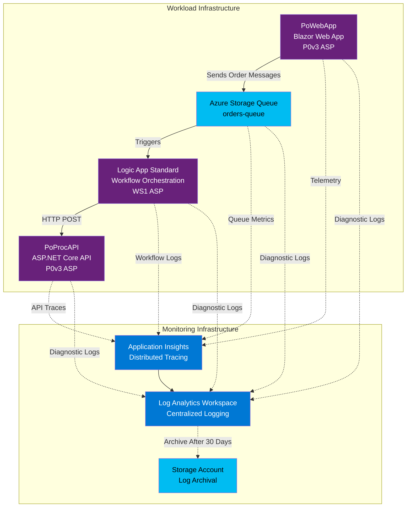

# Azure Logic Apps Monitoring

[](https://opensource.org/licenses/MIT)
[](https://azure.microsoft.com/)
[](https://docs.microsoft.com/azure/logic-apps/)

A comprehensive, open-source monitoring solution demonstrating Azure Monitor best practices for Azure Logic Apps Standard. This project showcases enterprise-grade observability patterns for workflow orchestration, providing a production-ready reference implementation for monitoring distributed applications.

## 📋 Table of Contents

- Project Overview
- Target Audience
- Features
- Architecture
- Dataflow
- Prerequisites
- Installation & Deployment
- Usage Examples
- License
- References

## 🎯 Project Overview

The **Azure Logic Apps Monitoring** project is a complete reference implementation that demonstrates how to effectively monitor Azure Logic Apps Standard using Azure Monitor, Application Insights, and Log Analytics. This solution is designed to help organizations implement observability best practices for enterprise workflow orchestration scenarios.

### Why This Matters

- **Production-Ready**: Implements industry best practices for monitoring distributed applications
- **Comprehensive Coverage**: Monitors all aspects of Logic Apps including workflows, dependencies, and infrastructure
- **Cost-Optimized**: Uses diagnostic settings and log retention policies to control monitoring costs
- **Troubleshooting Ready**: Provides rich telemetry for debugging workflow failures and performance issues
- **Compliance-Friendly**: Structured logging and metrics for audit and regulatory requirements

### Key Components

- **PoWebApp**: Blazor web application for placing purchase orders (message producer)
- **Azure Storage Queue**: Message queue for order processing
- **Logic App Workflow**: Orchestrates order processing workflows
- **PoProcAPI**: ASP.NET Core Web API for order validation and processing
- **Application Insights**: Distributed tracing and telemetry collection
- **Log Analytics**: Centralized logging and query engine

## 👥 Target Audience

| Role | Responsibilities | How to Leverage the Solution | Benefits |
|------|------------------|------------------------------|----------|
| **Cloud Solution Architect** | Design scalable, observable cloud architectures | Use as a reference architecture for Logic Apps monitoring patterns; adapt the Bicep templates for custom implementations | Accelerate solution design with proven patterns; reduce time-to-production for monitoring implementations |
| **DevOps Engineer** | Implement CI/CD pipelines, monitoring, and alerting | Deploy using Azure Developer CLI (`azd`); customize diagnostic settings and alert rules | Standardize monitoring across Logic Apps deployments; automate observability infrastructure |
| **Application Developer** | Build and maintain Logic Apps workflows | Understand correlation IDs, custom tracking, and distributed tracing patterns | Improve debugging efficiency; build more observable workflows from the start |
| **Platform Engineer** | Manage shared Azure infrastructure and governance | Implement diagnostic settings policies; configure log retention and cost controls | Enforce monitoring standards across the organization; optimize monitoring costs |
| **Site Reliability Engineer (SRE)** | Ensure service reliability and performance | Create custom dashboards and alerts using provided KQL queries; establish SLIs/SLOs | Reduce MTTR (Mean Time To Resolution); proactively identify performance issues |
| **Security Operations Analyst** | Monitor security events and compliance | Leverage audit logs and diagnostic data for security investigations | Improve threat detection; meet compliance logging requirements |

## ✨ Features

This solution is built on core observability design principles to provide comprehensive monitoring capabilities.

### Feature Overview

#### 🔍 Observability & Telemetry

| Feature | Purpose | Benefit |
|---------|---------|---------|
| **Distributed Tracing** | Tracks requests across all components (Web App → Queue → Logic App → API) using correlation IDs | End-to-end visibility into order processing flows; quickly identify bottlenecks |
| **OpenTelemetry Integration** | Modern, vendor-neutral instrumentation for .NET applications | Future-proof telemetry collection; standardized instrumentation |
| **Custom Activity Source** | Domain-specific tracing for order operations (`PoWebApp.Orders`) | Business-context-aware monitoring; easier troubleshooting of business logic |
| **Application Insights SDK** | Legacy SDK support for backward compatibility | Smooth migration path from classic monitoring to modern OpenTelemetry |

#### 📊 Diagnostic Settings

| Feature | Purpose | Benefit |
|---------|---------|---------|
| **Comprehensive Log Collection** | Captures all log categories (`allLogs`) for Logic Apps, Storage, App Services | Complete audit trail; no missing telemetry during investigations |
| **Metrics Collection** | Collects all platform metrics (`allMetrics`) for performance monitoring | Real-time performance insights; capacity planning data |
| **Log Analytics Integration** | Routes logs to dedicated Log Analytics workspace | Powerful KQL querying; cross-resource correlation |
| **Storage Account Archival** | Archives logs to Azure Storage with 30-day lifecycle policy | Cost-effective long-term retention; compliance requirements |

#### 🏗️ Infrastructure as Code

| Feature | Purpose | Benefit |
|---------|---------|---------|
| **Bicep Templates** | Infrastructure defined as code with modular architecture | Repeatable deployments; version-controlled infrastructure |
| **Azure Developer CLI (azd)** | Streamlined deployment workflow with `azd up` | Deploy entire solution in minutes; simplified developer experience |
| **Managed Identity Authentication** | Passwordless authentication between services | Enhanced security; reduced credential management overhead |
| **Zone Redundancy** | High availability configuration for App Service Plans | 99.95% SLA; resilience to datacenter failures |

#### 🔐 Security & Compliance

| Feature | Purpose | Benefit |
|---------|---------|---------|
| **HTTPS-Only Enforcement** | All services require TLS 1.2+ | Data in transit encryption; industry compliance |
| **Role-Based Access Control (RBAC)** | Fine-grained permissions for managed identities | Principle of least privilege; audit-ready access controls |
| **No Shared Key Access** | Eliminates connection strings where possible | Reduced attack surface; prevents credential leakage |
| **Diagnostic Settings on All Resources** | Every resource sends telemetry to centralized workspace | Complete visibility; no monitoring blind spots |

### Comparison: Project Solution vs. Default Azure Monitor

| Aspect | Project Solution | Default Azure Monitor |
|--------|------------------|----------------------|
| **Log Collection** | Automatic collection configured via Bicep for all resources | Manual setup required per resource in Azure Portal |
| **Distributed Tracing** | Full end-to-end correlation with OpenTelemetry ActivitySource | Basic request tracking; limited cross-service correlation |
| **Query Capabilities** | Pre-built KQL queries for common scenarios | Start from scratch; requires deep KQL knowledge |
| **Cost Management** | 30-day retention with automated archival to storage | Pay-per-GB without lifecycle policies; can be expensive |
| **Deployment** | Entire monitoring stack deployed with `azd up` | Manual resource creation; error-prone configuration |
| **Managed Identity** | Passwordless authentication for all services | Often relies on connection strings; security risk |
| **Customization** | Domain-specific tracking (e.g., order numbers, batch counts) | Generic telemetry; requires manual enrichment |
| **Architecture Patterns** | Proven enterprise patterns documented | Trial-and-error implementation |

### Diagnostic Settings Deep Dive

Diagnostic Settings are the foundation of this monitoring solution. They define **what** logs and metrics are collected, **where** they're sent, and **how long** they're retained.

#### How Diagnostic Settings Work

1. **Collection**: Azure services emit platform logs and metrics
2. **Routing**: Diagnostic settings route data to destinations (Log Analytics, Storage, Event Hubs)
3. **Transformation**: Logs are structured and indexed for querying
4. **Retention**: Data lifecycle policies manage costs

#### Diagnostic Settings Collection Table

| Metrics | Metrics Description | Logs | Logs Description | Monitoring Improvement |
|---------|---------------------|------|------------------|------------------------|
| **WorkflowMetrics** | Workflow run durations, success rates, trigger counts | **WorkflowRuntime** | Workflow execution traces, errors, input/output data | **Root Cause Analysis**: Correlate slow workflows with specific runtime errors |
| **HttpMetrics** | HTTP request/response times, status codes, throughput | **AppServiceHTTPLogs** | Detailed HTTP access logs with client IPs, user agents | **Performance Tuning**: Identify slow endpoints and optimize Logic App connectors |
| **StorageQueueMetrics** | Queue depth, message latency, operations/second | **StorageRead/Write** | Storage access patterns, authentication failures | **Scaling Decisions**: Auto-scale based on queue depth; detect message processing delays |
| **AppServiceMetrics** | CPU, memory, thread counts, instance health | **AppServiceConsoleLogs** | Application stdout/stderr logs, crash dumps | **Capacity Planning**: Right-size App Service Plans based on actual resource usage |
| **FunctionMetrics** | Function executions, duration distribution, host health | **FunctionAppLogs** | Function execution traces, exceptions, custom metrics | **Debugging**: Trace function failures with stack traces and correlation IDs |
| **AllMetrics** | Aggregated health metrics across all resource types | **AllLogs** | Catch-all for audit, security, and operational logs | **Compliance**: Centralized audit trail for regulatory requirements |

**Example: WorkflowRuntime Logs**

```json
{
  "time": "2025-01-15T10:30:45Z",
  "resourceId": "/subscriptions/.../logicapp",
  "category": "WorkflowRuntime",
  "operationName": "Microsoft.Logic/workflows/workflowActionCompleted",
  "properties": {
    "workflowName": "process-order",
    "actionName": "validate-order",
    "status": "Failed",
    "error": "InvalidOrderNumber",
    "trackingId": "08585031359643094865",
    "clientTrackingId": "order-123456"
  }
}
```

**Why This Improves Monitoring**: This log entry enables you to:
- Identify exactly which workflow action failed (`validate-order`)
- Correlate with client systems using `clientTrackingId`
- Filter by error type (`InvalidOrderNumber`) to find patterns
- Measure failure rates and build SLIs (Service Level Indicators)

## 🏛️ Architecture


```mermaid
graph TB
    subgraph "Monitoring Infrastructure"
        LAW[Log Analytics Workspace<br/>Centralized Logging]
        AI[Application Insights<br/>Distributed Tracing]
        SA[Storage Account<br/>Log Archival]
    end

    subgraph "Workload Infrastructure"
        WEB[PoWebApp<br/>Blazor Web App<br/>P0v3 ASP]
        QUEUE[Azure Storage Queue<br/>orders-queue]
        LA[Logic App Standard<br/>Workflow Orchestration<br/>WS1 ASP]
        API[PoProcAPI<br/>ASP.NET Core API<br/>P0v3 ASP]
    end

    WEB -->|Sends Order Messages| QUEUE
    QUEUE -->|Triggers| LA
    LA -->|HTTP POST| API

    WEB -.->|Telemetry| AI
    LA -.->|Workflow Logs| AI
    API -.->|API Traces| AI
    QUEUE -.->|Queue Metrics| AI

    AI --> LAW
    WEB -.->|Diagnostic Logs| LAW
    LA -.->|Diagnostic Logs| LAW
    API -.->|Diagnostic Logs| LAW
    QUEUE -.->|Diagnostic Logs| LAW

    LAW -.->|Archive After 30 Days| SA

    style LAW fill:#0078D4,color:#fff
    style AI fill:#0078D4,color:#fff
    style SA fill:#00BCF2,color:#000
    style WEB fill:#68217A,color:#fff
    style LA fill:#68217A,color:#fff
    style API fill:#68217A,color:#fff
    style QUEUE fill:#00BCF2,color:#000
```

## 🔄 Dataflow


```mermaid
flowchart LR
    User([User]) -->|Place Order| WebApp[PoWebApp<br/>Blazor UI]
    WebApp -->|Generate<br/>Correlation ID| TraceCtx[Activity Context]
    TraceCtx -->|SendMessageAsync| Queue[Azure Storage Queue<br/>orders-queue]
    
    Queue -->|Poll Messages| LogicApp[Logic App Workflow<br/>process-order]
    LogicApp -->|Validate Order| API[PoProcAPI<br/>Validation Service]
    API -->|Return Result| LogicApp
    LogicApp -->|Update Status| Queue
    
    WebApp -.->|Traces<br/>Dependencies<br/>Custom Events| AppInsights[Application Insights]
    LogicApp -.->|Workflow Traces<br/>Action Metrics| AppInsights
    API -.->|HTTP Traces<br/>Exceptions| AppInsights
    Queue -.->|Queue Metrics<br/>Storage Logs| AppInsights
    
    AppInsights --> LAW[Log Analytics<br/>Workspace]
    LAW -->|KQL Queries| Dashboard[Azure Dashboard<br/>Workbooks]
    LAW -.->|Alerts| Notification[Email/SMS<br/>Action Groups]
    
    style User fill:#FFD700,color:#000
    style WebApp fill:#68217A,color:#fff
    style LogicApp fill:#68217A,color:#fff
    style API fill:#68217A,color:#fff
    style Queue fill:#00BCF2,color:#000
    style AppInsights fill:#0078D4,color:#fff
    style LAW fill:#0078D4,color:#fff
    style Dashboard fill:#50E6FF,color:#000
```

## 📋 Prerequisites

### Required Tools

| Tool | Version | Purpose | Installation Link |
|------|---------|---------|------------------|
| **Azure Developer CLI (azd)** | Latest | Infrastructure deployment and management | [Install azd](https://learn.microsoft.com/azure/developer/azure-developer-cli/install-azd) |
| **.NET SDK** | 9.0+ | Build and run C# applications | [Download .NET](https://dotnet.microsoft.com/download) |
| **Azure CLI** | Latest | Azure resource management | [Install Azure CLI](https://learn.microsoft.com/cli/azure/install-azure-cli) |
| **Visual Studio Code** (Optional) | Latest | Code editor with Azure extensions | [Download VS Code](https://code.visualstudio.com/) |
| **Git** | Latest | Version control | [Download Git](https://git-scm.com/downloads) |

### Azure Requirements

- **Azure Subscription**: Active subscription with billing enabled
- **Resource Providers**: Ensure these are registered:
  - `Microsoft.Web`
  - `Microsoft.Logic`
  - `Microsoft.Storage`
  - `Microsoft.Insights`
  - `Microsoft.OperationalInsights`
- **Quota**: Sufficient quota for Premium V3 App Service Plans (minimum 6 cores)

### Required RBAC Roles

The deploying identity (user or service principal) needs the following roles at the **Subscription** level:

| Role | Description | Documentation |
|------|-------------|---------------|
| **Contributor** | Create and manage Azure resources | [Azure built-in roles - Contributor](https://learn.microsoft.com/azure/role-based-access-control/built-in-roles#contributor) |
| **User Access Administrator** | Manage role assignments for managed identities | [Azure built-in roles - User Access Administrator](https://learn.microsoft.com/azure/role-based-access-control/built-in-roles#user-access-administrator) |

**Note**: If deploying to an existing resource group, **Resource Group Contributor** is sufficient.

### Dependencies

The Bicep templates automatically provision these dependencies:

- **Log Analytics Workspace**: For centralized logging
- **Application Insights**: For application telemetry
- **Storage Account**: For Logic Apps runtime and log archival
- **Managed Identity**: For passwordless authentication

## 🚀 Installation & Deployment

This solution uses **Azure Developer CLI (azd)** for streamlined deployment.

### Step 1: Clone the Repository

```bash
git clone https://github.com/yourusername/Azure-LogicApps-Monitoring.git
cd Azure-LogicApps-Monitoring
```

### Step 2: Initialize Azure Developer CLI

```bash
azd init
```

When prompted:
- **Environment Name**: Choose a short, unique name (e.g., `dev`, `staging`, `prod`)
- **Azure Subscription**: Select your target subscription
- **Azure Location**: Choose a region (e.g., `eastus2`, `westus3`)

### Step 3: Authenticate with Azure

```bash
azd auth login
```

This opens a browser for Azure authentication. Sign in with an account that has the required RBAC roles.

### Step 4: Deploy the Infrastructure

```bash
azd up
```

This command:
1. Provisions all Azure resources using Bicep templates (main.bicep)
2. Builds the .NET applications (`PoWebApp`, `PoProcAPI`)
3. Deploys the applications to Azure App Service
4. Configures diagnostic settings and monitoring
5. Outputs resource names and connection details

**Expected Duration**: 10-15 minutes

### Step 5: Verify Deployment

After deployment completes, `azd` outputs important resource information:

```plaintext
SUCCESS: Your application was provisioned and deployed to Azure in 12 minutes.

Outputs:
  PO_WEB_APP_NAME: eshop-orders-abc123-po-webapp
  WORKFLOW_ENGINE_NAME: eshop-orders-abc123-logicapp
  AZURE_LOG_ANALYTICS_WORKSPACE_NAME: eshop-orders-abc123-law
```

Visit the web app:

```bash
azd show
```

Look for `PO_WEB_APP_DEFAULT_HOST_NAME` and open `https://{hostname}` in your browser.

### Step 6: Configure Logic App Workflows (Optional)

If deploying custom workflows:

1. Navigate to the Logic App in Azure Portal
2. Go to **Workflows** → **Add**
3. Upload your workflow definition (`workflow.json`)
4. Configure connections and triggers

### Step 7: Clean Up Resources

To delete all provisioned resources:

```bash
azd down
```

**Warning**: This permanently deletes all resources, including logs and data.

## 📊 Usage Examples

### Query 1: Failed Workflow Runs

Monitor Logic App failures to identify problematic workflows.

**Kusto Query:**

```kql
AzureDiagnostics
| where ResourceProvider == "MICROSOFT.LOGIC"
| where Category == "WorkflowRuntime"
| where status_s == "Failed"
| project 
    TimeGenerated,
    WorkflowName = resource_workflowName_s,
    RunId = resource_runId_s,
    ActionName = resource_actionName_s,
    ErrorCode = code_s,
    ErrorMessage = error_message_s
| order by TimeGenerated desc
| take 50
```

**Sample Output:**

| TimeGenerated | WorkflowName | ActionName | ErrorCode | ErrorMessage |
|---------------|--------------|------------|-----------|--------------|
| 2025-01-15 14:23:11 | process-order | validate-order | InvalidInput | Order number format invalid |
| 2025-01-15 14:18:45 | process-order | call-api | ServiceUnavailable | PoProcAPI returned 503 |

**Chart Visualization:** Create a timechart of failure rates:

```kql
AzureDiagnostics
| where ResourceProvider == "MICROSOFT.LOGIC"
| where Category == "WorkflowRuntime"
| summarize 
    Total = count(),
    Failed = countif(status_s == "Failed")
    by bin(TimeGenerated, 5m)
| extend FailureRate = (Failed * 100.0) / Total
| render timechart
```

**Reference**: [Monitor logic app workflows - Azure Logic Apps](https://learn.microsoft.com/azure/logic-apps/monitor-logic-apps)

---

### Query 2: Distributed Tracing Across Components

Trace a single order through all components using correlation IDs.

**Kusto Query:**

```kql
let correlationId = "08585031359643094865"; // Replace with actual tracking ID
union 
    AppTraces,
    AppDependencies,
    AppRequests
| where OperationId == correlationId
| project 
    TimeGenerated,
    ComponentName = AppRoleName,
    OperationType = Type,
    Name,
    DurationMs = DurationMs,
    Success,
    Message
| order by TimeGenerated asc
```

**Sample Output:**

| TimeGenerated | ComponentName | OperationType | Name | DurationMs | Success | Message |
|---------------|---------------|---------------|------|------------|---------|---------|
| 14:20:10.123 | PoWebApp | AppTrace | AddOrderMessageToQueue | - | - | Starting order placement |
| 14:20:10.456 | PoWebApp | AppDependency | SendQueueMessage | 45 | true | Message sent to queue |
| 14:20:11.234 | LogicApp | AppRequest | process-order | 1200 | true | Workflow triggered |
| 14:20:11.890 | PoProcAPI | AppRequest | POST /validate | 250 | true | Order validated |

**Reference**: [Application Insights distributed tracing](https://learn.microsoft.com/azure/azure-monitor/app/distributed-tracing-telemetry-correlation)

---

### Query 3: Queue Depth and Processing Lag

Monitor Azure Storage Queue to prevent message backlog.

**Kusto Query:**

```kql
AzureDiagnostics
| where ResourceProvider == "MICROSOFT.STORAGE"
| where Category == "StorageRead"
| where OperationName == "GetQueueMetadata"
| extend QueueName = split(parse_json(properties_s).queueName, '/')[2]
| where QueueName == "orders-queue"
| summarize 
    AvgQueueDepth = avg(toint(parse_json(properties_s).approximateMessageCount)),
    MaxQueueDepth = max(toint(parse_json(properties_s).approximateMessageCount))
    by bin(TimeGenerated, 5m)
| render timechart
```

**Alert Recommendation**: Create an alert when `AvgQueueDepth > 1000` for 10 minutes.

**Reference**: [Monitor Azure Storage](https://learn.microsoft.com/azure/storage/common/monitor-storage)

---

### Query 4: API Performance and Error Rates

Analyze PoProcAPI performance to identify bottlenecks.

**Kusto Query:**

```kql
AppRequests
| where AppRoleName == "PoProcAPI"
| summarize 
    TotalRequests = count(),
    SuccessCount = countif(Success == true),
    AvgDurationMs = avg(DurationMs),
    P95DurationMs = percentile(DurationMs, 95)
    by bin(TimeGenerated, 5m), Name
| extend SuccessRate = (SuccessCount * 100.0) / TotalRequests
| project TimeGenerated, Endpoint = Name, TotalRequests, SuccessRate, AvgDurationMs, P95DurationMs
| order by TimeGenerated desc
```

**Sample Output:**

| TimeGenerated | Endpoint | TotalRequests | SuccessRate | AvgDurationMs | P95DurationMs |
|---------------|----------|---------------|-------------|---------------|---------------|
| 14:20:00 | POST /validate | 1250 | 98.4% | 180 | 320 |
| 14:15:00 | POST /validate | 1180 | 97.2% | 195 | 340 |

**Reference**: [Analyze application performance](https://learn.microsoft.com/azure/azure-monitor/app/app-insights-overview)

---

### Query 5: Custom Metric - Orders Queued

Track business metrics using custom telemetry from Orders.cs.

**Kusto Query:**

```kql
customMetrics
| where name == "OrdersQueued"
| extend 
    QueueName = tostring(customDimensions.QueueName),
    BatchSize = toint(customDimensions.BatchSize)
| summarize 
    TotalOrders = sum(value),
    BatchCount = count()
    by bin(TimeGenerated, 1h), QueueName
| render columnchart
```

**Business Insight**: Correlate order volume with system performance to plan capacity.

**Reference**: [Track custom events and metrics](https://learn.microsoft.com/azure/azure-monitor/app/api-custom-events-metrics)

---

## 📄 License

This project is licensed under the **MIT License** - see the LICENSE.md file for details.

```text
MIT License

Copyright (c) 2025 [Your Name or Organization]

Permission is hereby granted, free of charge, to any person obtaining a copy
of this software and associated documentation files (the "Software"), to deal
in the Software without restriction, including without limitation the rights
to use, copy, modify, merge, publish, distribute, sublicense, and/or sell
copies of the Software, and to permit persons to whom the Software is
furnished to do so, subject to the following conditions:

The above copyright notice and this permission notice shall be included in all
copies or substantial portions of the Software.

THE SOFTWARE IS PROVIDED "AS IS", WITHOUT WARRANTY OF ANY KIND, EXPRESS OR
IMPLIED, INCLUDING BUT NOT LIMITED TO THE WARRANTIES OF MERCHANTABILITY,
FITNESS FOR A PARTICULAR PURPOSE AND NONINFRINGEMENT. IN NO EVENT SHALL THE
AUTHORS OR COPYRIGHT HOLDERS BE LIABLE FOR ANY CLAIM, DAMAGES OR OTHER
LIABILITY, WHETHER IN AN ACTION OF CONTRACT, TORT OR OTHERWISE, ARISING FROM,
OUT OF OR IN CONNECTION WITH THE SOFTWARE OR THE USE OR OTHER DEALINGS IN THE
SOFTWARE.
```

---

## 📚 References

### Microsoft Official Documentation

- [Monitor logic app workflows - Azure Logic Apps](https://learn.microsoft.com/azure/logic-apps/monitor-logic-apps)
- [Application Insights Overview](https://learn.microsoft.com/azure/azure-monitor/app/app-insights-overview)
- [Azure Monitor Log Analytics](https://learn.microsoft.com/azure/azure-monitor/logs/log-analytics-overview)
- [Diagnostic settings in Azure Monitor](https://learn.microsoft.com/azure/azure-monitor/essentials/diagnostic-settings)
- [Azure Logic Apps Standard Overview](https://learn.microsoft.com/azure/logic-apps/single-tenant-overview-compare)
- [OpenTelemetry in .NET](https://learn.microsoft.com/dotnet/core/diagnostics/observability-with-otel)
- [Azure Developer CLI (azd)](https://learn.microsoft.com/azure/developer/azure-developer-cli/)

### GitHub Best Practices

- [Awesome README](https://github.com/matiassingers/awesome-readme)
- [GitHub README Guidelines](https://docs.github.com/en/repositories/managing-your-repositorys-settings-and-features/customizing-your-repository/about-readmes)
- [Open Source Guides](https://opensource.guide/)

### Kusto Query Language (KQL)

- [Kusto Query Language (KQL) Reference](https://learn.microsoft.com/azure/data-explorer/kusto/query/)
- [KQL Quick Reference](https://learn.microsoft.com/azure/data-explorer/kql-quick-reference)

---

## 🤝 Contributing

Contributions are welcome! Please read our CONTRIBUTING.md for details on our code of conduct and the process for submitting pull requests.

## 🐛 Issues

Found a bug or have a feature request? [Open an issue](https://github.com/yourusername/Azure-LogicApps-Monitoring/issues/new) on GitHub.

---

**Made with ❤️ for the Azure community**

Similar code found with 3 license types