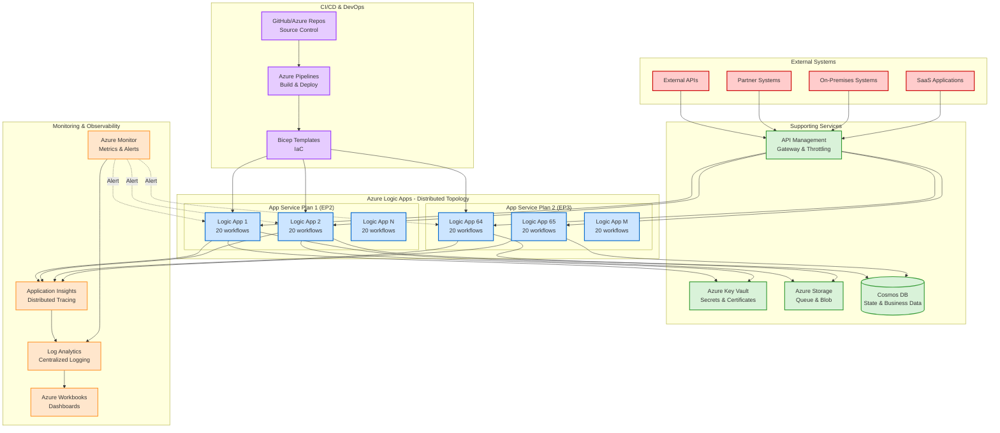
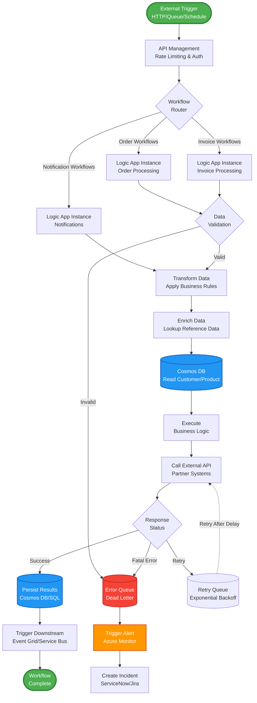
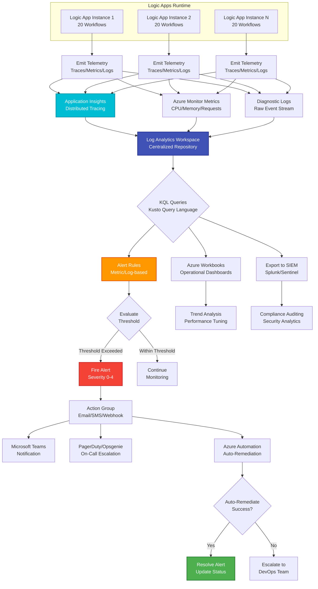

# Azure Logic Apps - Enterprise-Scale Monitoring & Optimization

A comprehensive solution for deploying, monitoring, and optimizing thousands of Azure Logic Apps workflows across enterprise environments while controlling costs and maintaining stability.

---

## 📋 Table of Contents

- Project Overview
- Problem Statement
- Target Audience
- Architecture
- Installation & Configuration
- Usage Examples
- Monitoring & Alerting
- Performance & Cost Optimization

---

## 🎯 Project Overview

This project provides an enterprise-grade solution for organizations running **thousands of workflows** across hundreds of **Azure Logic Apps Standard** instances globally. It addresses critical scalability, cost, and operational challenges that emerge when deploying Logic Apps at scale.

### Key Features

- **Optimized Architecture**: Reference implementation for hosting 1000+ workflows while minimizing memory footprint and infrastructure costs
- **Comprehensive Monitoring**: Azure Monitor integration with custom metrics, Application Insights telemetry, and Log Analytics workspaces
- **Cost Optimization**: Strategies to reduce operational costs from ~$80K to sustainable levels per environment
- **Scalability Patterns**: Best practices for distributing workflows across Logic Apps instances and App Service Plans
- **Infrastructure as Code**: Bicep templates for repeatable, auditable deployments
- **Well-Architected Framework Alignment**: Implements Azure WAF pillars for reliability, security, cost optimization, operational excellence, and performance efficiency
- **Long-Running Workflow Support**: Proven patterns for workflows executing over 18-36 months without stability degradation

### Technologies Used

- **Azure Logic Apps Standard** (Workflow orchestration)
- **Azure App Service Plans** (EP1-EP3 hosting tiers with 64-bit support)
- **Azure Monitor** (Metrics, logs, and alerting)
- **Application Insights** (Telemetry and diagnostics)
- **Log Analytics** (Centralized logging and querying)
- **Azure Bicep** (Infrastructure as Code)
- **Azure DevOps / GitHub Actions** (CI/CD pipelines)

---

## ⚠️ Problem Statement

### The Challenge

Enterprise organizations deploying Azure Logic Apps at scale face critical operational and financial challenges:

#### 1. **Microsoft Guidance Limitations**
Microsoft recommends:
- **Maximum 20 workflows per Logic App** instance
- **Maximum 64 Logic Apps per App Service Plan**

For enterprises requiring **1000+ workflows**, this translates to:
- **50+ Logic App instances** (at 20 workflows each)
- **Multiple App Service Plans** (to avoid the 64-app limit)
- **Complex distribution topology** across plans and regions

#### 2. **Memory Consumption Issues**
When scaling beyond recommended limits, especially with **64-bit runtime support**:
- **Memory spikes** reaching 80-90% utilization on EP2/EP3 plans
- **Worker process recycling** causing workflow interruptions
- **Unpredictable performance degradation** during peak load
- **Memory leaks** in long-running workflow scenarios (18+ months)

#### 3. **Cost Overruns**
Without optimization:
- **~$80,000 USD annually per environment** (Dev, UAT, Prod multiply this cost)
- Over-provisioning of App Service Plan tiers to handle memory spikes
- Redundant infrastructure to maintain high availability
- Inefficient resource allocation across workflow types

#### 4. **Operational Complexity**
- Lack of centralized monitoring across 50+ Logic App instances
- Difficulty correlating failures across distributed workflows
- Manual scaling decisions without data-driven insights
- Limited visibility into per-workflow resource consumption

#### 5. **Long-Running Workflow Stability**
- Workflows executing for **18-36 months** require special considerations
- State persistence and checkpointing challenges
- Memory accumulation over extended execution periods
- No clear success criteria for ultra-long-running scenarios

### Business Impact

- **High Cloud Spend**: Unsustainable costs for multi-environment deployments (Dev/UAT/Prod)
- **Operational Risk**: Workflow failures impact business-critical processes
- **Limited Scalability**: Cannot easily add new workflows without infrastructure overhaul
- **Poor Developer Experience**: Complex deployment topologies slow down development cycles

---

## 👥 Target Audience

### Solution Owner

**Role Description:**  
The Solution Owner is accountable for the overall business value, strategic alignment, and success of the Logic Apps solution. They ensure the implementation meets enterprise requirements, delivers ROI, and aligns with organizational digital transformation goals.

**Key Responsibilities & Deliverables:**
- Define business requirements and success criteria for workflow automation
- Approve architectural decisions and infrastructure investments
- Monitor total cost of ownership (TCO) and return on investment (ROI)
- Ensure compliance with corporate governance and risk policies
- Stakeholder communication and executive reporting
- Prioritize workflow migration and optimization initiatives

**How This Solution Helps:**
- **Cost Transparency**: Clear visibility into infrastructure costs (~$80K baseline vs. optimized spend)
- **Risk Mitigation**: Proven architecture reduces operational risk for mission-critical workflows
- **Scalability Roadmap**: Enables business growth without proportional infrastructure cost increases
- **Success Metrics**: Predefined KPIs for long-running workflow stability (18-36 months)

---

### Solution Architect

**Role Description:**  
The Solution Architect designs the end-to-end Logic Apps solution, ensuring it meets functional requirements, non-functional requirements, and aligns with enterprise architecture standards. They bridge business needs with technical implementation.

**Key Responsibilities & Deliverables:**
- Design workflow distribution strategy across Logic App instances
- Define integration patterns with enterprise systems (APIs, databases, message queues)
- Establish data flow models for business processes
- Create high-level architecture diagrams (TOGAF BDAT models)
- Define workflow categorization (real-time, batch, long-running)
- Document architectural decisions and trade-offs

**How This Solution Helps:**
- **Reference Architecture**: TOGAF-aligned models for Business, Data, Application, and Technology layers
- **Proven Patterns**: Tested workflow distribution strategies (20 workflows/app, 64 apps/plan)
- **Integration Guidance**: Pre-built patterns for common enterprise integrations
- **Dataflow Visualization**: Mermaid diagrams showing application and monitoring flows

---

### Cloud Architect

**Role Description:**  
The Cloud Architect focuses on Azure platform services, infrastructure design, and cloud best practices. They ensure the Logic Apps solution leverages Azure services optimally and adheres to the Well-Architected Framework.

**Key Responsibilities & Deliverables:**
- Select appropriate Azure services (Logic Apps Standard, App Service Plans, Storage)
- Design multi-region topology for high availability and disaster recovery
- Implement Azure Monitor and Application Insights architecture
- Define resource naming conventions and tagging strategies
- Optimize resource SKUs (EP1/EP2/EP3 plans) based on workload analysis
- Plan for scalability, elasticity, and auto-scaling configurations

**How This Solution Helps:**
- **Well-Architected Framework Alignment**: Implements all five WAF pillars (Reliability, Security, Cost Optimization, Operational Excellence, Performance)
- **Azure Native Monitoring**: Pre-configured Azure Monitor, Application Insights, and Log Analytics integration
- **IaC Templates**: Bicep modules for repeatable, auditable infrastructure deployment
- **Scaling Blueprints**: Documented strategies for horizontal (more apps) vs. vertical (larger plans) scaling

---

### Network Architect

**Role Description:**  
The Network Architect designs the network topology, connectivity, and security boundaries for the Logic Apps solution. They ensure secure, reliable communication between workflows and enterprise systems.

**Key Responsibilities & Deliverables:**
- Design VNet integration for Logic Apps connecting to on-premises systems
- Configure private endpoints for secure Azure service connectivity
- Implement network security groups (NSGs) and firewall rules
- Plan for hybrid connectivity (ExpressRoute, VPN Gateway)
- Design DNS and name resolution strategies
- Document network flow diagrams and security zones

**How This Solution Helps:**
- **Connectivity Patterns**: Reference implementations for VNet integration and private endpoints
- **Security Best Practices**: NSG and firewall configurations for Logic Apps Standard
- **Hybrid Scenarios**: Guidance for connecting to on-premises APIs and databases
- **Network Monitoring**: Integration with Azure Network Watcher for connectivity troubleshooting

---

### Data Architect

**Role Description:**  
The Data Architect defines data models, storage strategies, and data flow patterns for workflows processing business data. They ensure data integrity, compliance, and optimal data persistence strategies.

**Key Responsibilities & Deliverables:**
- Design data models for workflow state persistence (Azure Cosmos DB, SQL Database)
- Define data retention and archival policies
- Implement data lineage and audit trails for workflow executions
- Ensure GDPR/CCPA compliance for data processing
- Design data partitioning strategies for high-volume scenarios
- Document data flow diagrams and entity relationships

**How This Solution Helps:**
- **State Management Patterns**: Guidance for persisting workflow state in long-running scenarios (18-36 months)
- **Data Flow Diagrams**: Mermaid visualizations showing data movement across workflow stages
- **Storage Optimization**: Best practices for Azure Storage, Cosmos DB, and SQL Database usage
- **Audit Trail**: Built-in logging and diagnostics for data lineage and compliance

---

### Security Architect

**Role Description:**  
The Security Architect ensures the Logic Apps solution meets enterprise security standards, compliance requirements, and threat protection policies. They implement defense-in-depth strategies and identity/access management.

**Key Responsibilities & Deliverables:**
- Implement Azure AD authentication and role-based access control (RBAC)
- Configure managed identities for secure service-to-service communication
- Encrypt data at rest and in transit (TLS, Azure Key Vault)
- Conduct threat modeling and security assessments
- Implement Azure Security Center and Microsoft Defender for Cloud
- Define secrets management and certificate rotation policies

**How This Solution Helps:**
- **Managed Identity Integration**: Pre-configured managed identities for Logic Apps accessing Azure services
- **Key Vault Integration**: Secure secrets management for connection strings and API keys
- **RBAC Templates**: Role assignments for least-privilege access to Logic Apps and monitoring resources
- **Security Monitoring**: Azure Monitor alerts for suspicious activity and security events

---

### DevOps / SRE Lead

**Role Description:**  
The DevOps/SRE Lead establishes CI/CD pipelines, deployment automation, and operational runbooks for the Logic Apps solution. They ensure reliable, repeatable deployments and implement SRE practices for availability and performance.

**Key Responsibilities & Deliverables:**
- Build CI/CD pipelines for Logic Apps deployment (Azure DevOps, GitHub Actions)
- Implement Infrastructure as Code (Bicep/ARM templates)
- Define deployment strategies (blue-green, canary, rolling updates)
- Create operational runbooks for incident response
- Establish SLOs, SLIs, and error budgets for workflows
- Automate monitoring alert responses and remediation

**How This Solution Helps:**
- **IaC Templates**: Production-ready Bicep modules for all Azure resources
- **CI/CD Examples**: Reference pipeline configurations for automated deployments
- **Monitoring Automation**: Pre-configured alerts with recommended thresholds
- **Operational Dashboards**: Azure Monitor workbooks for at-a-glance health status
- **SRE Metrics**: Predefined reliability metrics for long-running workflows

---

### Developer

**Role Description:**  
Developers build, test, and maintain individual Logic Apps workflows. They implement business logic, integrate with APIs, and troubleshoot workflow execution issues using monitoring tools.

**Key Responsibilities & Deliverables:**
- Develop workflows using Logic Apps Designer or code (JSON definitions)
- Implement error handling, retry policies, and compensating transactions
- Write unit and integration tests for workflows
- Debug workflow failures using Application Insights and Log Analytics
- Optimize workflow performance and reduce execution costs
- Document workflow logic and dependencies

**How This Solution Helps:**
- **Local Development**: Azure Logic Apps Emulator configuration for offline testing
- **Diagnostic Insights**: Application Insights integration for step-by-step workflow tracing
- **Performance Profiling**: Identify slow actions and optimize workflow execution time
- **Cost Visibility**: Per-workflow execution cost tracking
- **Best Practices**: Code examples and patterns for common workflow scenarios

---

### System Engineer

**Role Description:**  
System Engineers maintain the Azure infrastructure hosting Logic Apps, ensuring availability, performance, and capacity planning. They handle operational incidents, patching, and infrastructure health monitoring.

**Key Responsibilities & Deliverables:**
- Monitor App Service Plan health (CPU, memory, worker processes)
- Perform capacity planning and scaling operations
- Execute infrastructure patching and updates
- Respond to operational incidents and alerts
- Maintain backup and disaster recovery procedures
- Tune infrastructure configurations for optimal performance

**How This Solution Helps:**
- **Infrastructure Monitoring**: Pre-configured metrics for CPU, memory, and worker process health
- **Capacity Planning**: Historical data and trends for scaling decisions
- **Alerting Thresholds**: Recommended alert rules for proactive incident management
- **Scaling Guidance**: Documentation on when to scale horizontally (more apps) vs. vertically (larger plans)
- **Troubleshooting Tools**: Log Analytics queries for common infrastructure issues

---

### Project Manager

**Role Description:**  
The Project Manager coordinates the implementation, tracks progress, manages risks, and ensures timely delivery of the Logic Apps solution. They facilitate communication between technical teams and business stakeholders.

**Key Responsibilities & Deliverables:**
- Create project plans and timelines for Logic Apps migration
- Track workflow migration progress (e.g., 100 workflows/sprint)
- Manage risks related to cost overruns and performance issues
- Coordinate across Solution Architect, Developers, and DevOps teams
- Report status to Solution Owner and executive leadership
- Ensure documentation and knowledge transfer

**How This Solution Helps:**
- **Phased Implementation**: Clear guidance for incremental workflow migration (avoid big-bang deployments)
- **Success Metrics**: KPIs for tracking project health (workflow count, cost/workflow, uptime %)
- **Risk Mitigation**: Documented risks and mitigation strategies for common issues
- **Documentation**: Comprehensive README, architecture diagrams, and runbooks for team onboarding
- **ROI Tracking**: Cost baseline ($80K/year) vs. optimized architecture for business case validation

---

## 🏗️ Architecture

### TOGAF BDAT Model - Solution Architecture


```mermaid
graph TB
    subgraph "Business Layer"
        B1[Order Processing]
        B2[Invoice Management]
        B3[Customer Notifications]
        B4[Integration Orchestration]
        B5[Long-Running Workflows<br/>18-36 months]
    end
    
    subgraph "Data Layer"
        D1[(Azure Storage<br/>Workflow State)]
        D2[(Cosmos DB<br/>Order Data)]
        D3[(SQL Database<br/>Customer Records)]
        D4[(Log Analytics<br/>Telemetry)]
        D5[(Blob Storage<br/>Documents)]
    end
    
    subgraph "Application Layer"
        A1[Logic Apps Standard<br/>Workflow Runtime]
        A2[PoProcAPI<br/>Purchase Order API]
        A3[PoWebApp<br/>Web Portal]
        A4[Azure Functions<br/>Custom Logic]
        A5[API Management<br/>Gateway]
    end
    
    subgraph "Technology Layer"
        T1[App Service Plans<br/>EP1/EP2/EP3]
        T2[Azure Monitor<br/>+ Application Insights]
        T3[Azure Key Vault<br/>Secrets Management]
        T4[VNet Integration<br/>Private Endpoints]
        T5[Azure DevOps<br/>CI/CD Pipelines]
    end
    
    B1 --> A1
    B2 --> A1
    B3 --> A1
    B4 --> A1
    B5 --> A1
    
    A1 --> D1
    A1 --> D2
    A2 --> D3
    A3 --> D3
    A1 --> D4
    A1 --> D5
    
    A1 --> T1
    A2 --> T1
    A3 --> T1
    A4 --> T1
    A1 --> T2
    A5 --> T2
    A1 --> T3
    A1 --> T4
    
    T5 --> A1
    T5 --> A2
    T5 --> A3
    
    classDef businessClass fill:#e1f5ff,stroke:#0078d4,stroke-width:2px
    classDef dataClass fill:#fff4e1,stroke:#ff8c00,stroke-width:2px
    classDef appClass fill:#e8f5e8,stroke:#107c10,stroke-width:2px
    classDef techClass fill:#f3e8ff,stroke:#5c2d91,stroke-width:2px
    
    class B1,B2,B3,B4,B5 businessClass
    class D1,D2,D3,D4,D5 dataClass
    class A1,A2,A3,A4,A5 appClass
    class T1,T2,T3,T4,T5 techClass
```

### System Architecture


```mermaid
graph TB
    subgraph "External Systems"
        EXT1[External APIs]
        EXT2[Partner Systems]
        EXT3[On-Premises Systems]
        EXT4[SaaS Applications]
    end
    
    subgraph "Azure Logic Apps - Distributed Topology"
        subgraph "App Service Plan 1 (EP2)"
            LA1[Logic App 1<br/>20 workflows]
            LA2[Logic App 2<br/>20 workflows]
            LA3[Logic App N<br/>20 workflows]
        end
        
        subgraph "App Service Plan 2 (EP3)"
            LA64[Logic App 64<br/>20 workflows]
            LA65[Logic App 65<br/>20 workflows]
            LA66[Logic App M<br/>20 workflows]
        end
    end
    
    subgraph "Supporting Services"
        APIM[API Management<br/>Gateway & Throttling]
        KV[Azure Key Vault<br/>Secrets & Certificates]
        STORAGE[Azure Storage<br/>Queue & Blob]
        COSMOS[(Cosmos DB<br/>State & Business Data)]
    end
    
    subgraph "Monitoring & Observability"
        MONITOR[Azure Monitor<br/>Metrics & Alerts]
        INSIGHTS[Application Insights<br/>Distributed Tracing]
        LOGS[Log Analytics<br/>Centralized Logging]
        WORKBOOK[Azure Workbooks<br/>Dashboards]
    end
    
    subgraph "CI/CD & DevOps"
        REPO[GitHub/Azure Repos<br/>Source Control]
        PIPELINE[Azure Pipelines<br/>Build & Deploy]
        BICEP[Bicep Templates<br/>IaC]
    end
    
    EXT1 --> APIM
    EXT2 --> APIM
    EXT3 --> APIM
    EXT4 --> APIM
    
    APIM --> LA1
    APIM --> LA2
    APIM --> LA64
    APIM --> LA65
    
    LA1 --> KV
    LA2 --> KV
    LA1 --> STORAGE
    LA2 --> COSMOS
    LA64 --> STORAGE
    LA65 --> COSMOS
    
    LA1 --> INSIGHTS
    LA2 --> INSIGHTS
    LA64 --> INSIGHTS
    LA65 --> INSIGHTS
    
    INSIGHTS --> LOGS
    MONITOR --> LOGS
    LOGS --> WORKBOOK
    
    MONITOR -.Alert.-> LA1
    MONITOR -.Alert.-> LA2
    MONITOR -.Alert.-> LA64
    
    REPO --> PIPELINE
    PIPELINE --> BICEP
    BICEP --> LA1
    BICEP --> LA2
    BICEP --> LA64
    
    classDef externalClass fill:#ffcccc,stroke:#cc0000,stroke-width:2px
    classDef logicAppClass fill:#cce5ff,stroke:#0066cc,stroke-width:2px
    classDef supportClass fill:#d9f2d9,stroke:#339933,stroke-width:2px
    classDef monitorClass fill:#ffe6cc,stroke:#ff9933,stroke-width:2px
    classDef devopsClass fill:#e6ccff,stroke:#9933ff,stroke-width:2px
    
    class EXT1,EXT2,EXT3,EXT4 externalClass
    class LA1,LA2,LA3,LA64,LA65,LA66 logicAppClass
    class APIM,KV,STORAGE,COSMOS supportClass
    class MONITOR,INSIGHTS,LOGS,WORKBOOK monitorClass
    class REPO,PIPELINE,BICEP devopsClass
```

### Solution Dataflow - Application Data


```mermaid
flowchart TD
    START([External Trigger<br/>HTTP/Queue/Schedule])
    
    START --> APIM[API Management<br/>Rate Limiting & Auth]
    
    APIM --> ROUTE{Workflow<br/>Router}
    
    ROUTE -->|Order Workflows| LA_ORDER[Logic App Instance<br/>Order Processing]
    ROUTE -->|Invoice Workflows| LA_INVOICE[Logic App Instance<br/>Invoice Processing]
    ROUTE -->|Notification Workflows| LA_NOTIFY[Logic App Instance<br/>Notifications]
    
    LA_ORDER --> VALIDATE{Data<br/>Validation}
    LA_INVOICE --> VALIDATE
    LA_NOTIFY --> TRANSFORM[Transform Data<br/>Apply Business Rules]
    
    VALIDATE -->|Valid| TRANSFORM
    VALIDATE -->|Invalid| ERROR_QUEUE[(Error Queue<br/>Dead Letter)]
    
    TRANSFORM --> ENRICH[Enrich Data<br/>Lookup Reference Data]
    
    ENRICH --> COSMOS_READ[(Cosmos DB<br/>Read Customer/Product)]
    COSMOS_READ --> BUSINESS_LOGIC[Execute<br/>Business Logic]
    
    BUSINESS_LOGIC --> EXTERNAL_API[Call External API<br/>Partner Systems]
    EXTERNAL_API --> PROCESS_RESPONSE{Response<br/>Status}
    
    PROCESS_RESPONSE -->|Success| PERSIST[(Persist Results<br/>Cosmos DB/SQL)]
    PROCESS_RESPONSE -->|Retry| RETRY_QUEUE[(Retry Queue<br/>Exponential Backoff)]
    PROCESS_RESPONSE -->|Fatal Error| ERROR_QUEUE
    
    PERSIST --> NOTIFY_DOWNSTREAM[Trigger Downstream<br/>Event Grid/Service Bus]
    
    RETRY_QUEUE -.Retry After Delay.-> EXTERNAL_API
    
    NOTIFY_DOWNSTREAM --> END([Workflow<br/>Complete])
    
    ERROR_QUEUE --> ALERT[Trigger Alert<br/>Azure Monitor]
    ALERT --> INCIDENT[Create Incident<br/>ServiceNow/Jira]
    
    style START fill:#4caf50,stroke:#2e7d32,stroke-width:3px,color:#fff
    style END fill:#4caf50,stroke:#2e7d32,stroke-width:3px,color:#fff
    style ERROR_QUEUE fill:#f44336,stroke:#c62828,stroke-width:2px,color:#fff
    style ALERT fill:#ff9800,stroke:#e65100,stroke-width:2px,color:#fff
    style COSMOS_READ fill:#2196f3,stroke:#1565c0,stroke-width:2px,color:#fff
    style PERSIST fill:#2196f3,stroke:#1565c0,stroke-width:2px,color:#fff
```

### Monitoring Dataflow - Telemetry & Observability


```mermaid
flowchart TD
    subgraph "Logic Apps Runtime"
        LA1[Logic App Instance 1<br/>20 Workflows]
        LA2[Logic App Instance 2<br/>20 Workflows]
        LAN[Logic App Instance N<br/>20 Workflows]
    end
    
    LA1 --> EMIT1[Emit Telemetry<br/>Traces/Metrics/Logs]
    LA2 --> EMIT2[Emit Telemetry<br/>Traces/Metrics/Logs]
    LAN --> EMITN[Emit Telemetry<br/>Traces/Metrics/Logs]
    
    EMIT1 --> INSIGHTS[Application Insights<br/>Distributed Tracing]
    EMIT2 --> INSIGHTS
    EMITN --> INSIGHTS
    
    EMIT1 --> METRICS[Azure Monitor Metrics<br/>CPU/Memory/Requests]
    EMIT2 --> METRICS
    EMITN --> METRICS
    
    EMIT1 --> LOGS_RAW[Diagnostic Logs<br/>Raw Event Stream]
    EMIT2 --> LOGS_RAW
    EMITN --> LOGS_RAW
    
    INSIGHTS --> LOGS[Log Analytics Workspace<br/>Centralized Repository]
    METRICS --> LOGS
    LOGS_RAW --> LOGS
    
    LOGS --> QUERY{KQL Queries<br/>Kusto Query Language}
    
    QUERY --> DASHBOARD[Azure Workbooks<br/>Operational Dashboards]
    QUERY --> ALERT_RULES[Alert Rules<br/>Metric/Log-based]
    QUERY --> EXPORT[Export to SIEM<br/>Splunk/Sentinel]
    
    ALERT_RULES --> EVAL{Evaluate<br/>Threshold}
    
    EVAL -->|Threshold Exceeded| FIRE_ALERT[Fire Alert<br/>Severity 0-4]
    EVAL -->|Within Threshold| MONITOR_CONTINUE[Continue<br/>Monitoring]
    
    FIRE_ALERT --> ACTION_GROUP[Action Group<br/>Email/SMS/Webhook]
    
    ACTION_GROUP --> NOTIFY_TEAMS[Microsoft Teams<br/>Notification]
    ACTION_GROUP --> NOTIFY_ONCALL[PagerDuty/Opsgenie<br/>On-Call Escalation]
    ACTION_GROUP --> TRIGGER_RUNBOOK[Azure Automation<br/>Auto-Remediation]
    
    TRIGGER_RUNBOOK --> REMEDIATE{Auto-Remediate<br/>Success?}
    
    REMEDIATE -->|Yes| RESOLVE[Resolve Alert<br/>Update Status]
    REMEDIATE -->|No| ESCALATE[Escalate to<br/>DevOps Team]
    
    DASHBOARD --> ANALYZE[Trend Analysis<br/>Performance Tuning]
    EXPORT --> COMPLIANCE[Compliance Auditing<br/>Security Analytics]
    
    style INSIGHTS fill:#00bcd4,stroke:#0097a7,stroke-width:2px,color:#fff
    style LOGS fill:#3f51b5,stroke:#283593,stroke-width:2px,color:#fff
    style ALERT_RULES fill:#ff9800,stroke:#e65100,stroke-width:2px,color:#fff
    style FIRE_ALERT fill:#f44336,stroke:#c62828,stroke-width:2px,color:#fff
    style RESOLVE fill:#4caf50,stroke:#2e7d32,stroke-width:2px,color:#fff
```

---

## 🚀 Installation & Configuration

### Prerequisites

- **Azure Subscription** with Contributor access
- **Azure CLI** version 2.40.0 or higher
- **Bicep CLI** version 0.13.1 or higher
- **Visual Studio Code** with the following extensions:
  - Azure Logic Apps (Standard)
  - Azure Account
  - Bicep
- **.NET 6.0 SDK** (for Logic Apps local development)
- **Git** for source control

### Step 1: Clone the Repository

```bash
git clone https://github.com/Evilazaro/Azure-LogicApps-Monitoring.git
cd Azure-LogicApps-Monitoring
```

### Step 2: Configure Azure Environment

1. **Login to Azure**:
   ```bash
   az login
   az account set --subscription "Your-Subscription-Name"
   ```

2. **Set Environment Variables**:
   
   Create a `.azure/config.json` file (use [.azure/uat/config.json](.azure/uat/config.json) as template):
   
   ```json
   {
     "environment": "uat",
     "location": "eastus",
     "resourceGroupName": "rg-logicapps-uat",
     "appServicePlanSku": "EP2",
     "logicAppCount": 50,
     "workflowsPerApp": 20,
     "enableApplicationInsights": true,
     "enableVNetIntegration": false
   }
   ```

### Step 3: Deploy Infrastructure

1. **Review Bicep Templates**:
   
   The main infrastructure template is located at [infra/main.bicep](infra/main.bicep). Review parameters in [infra/main.parameters.json](infra/main.parameters.json).

2. **Deploy Using Azure CLI**:
   
   ```bash
   # Validate Bicep template
   az deployment sub validate \
     --location eastus \
     --template-file infra/main.bicep \
     --parameters infra/main.parameters.json
   
   # Deploy infrastructure
   az deployment sub create \
     --location eastus \
     --template-file infra/main.bicep \
     --parameters infra/main.parameters.json \
     --name "logicapps-deployment-$(date +%Y%m%d-%H%M%S)"
   ```

3. **Verify Deployment**:
   
   ```bash
   # List deployed Logic Apps
   az logicapp list --resource-group rg-logicapps-uat --output table
   
   # Check App Service Plan capacity
   az appservice plan show \
     --name asp-logicapps-uat \
     --resource-group rg-logicapps-uat \
     --query "{Name:name, Tier:sku.tier, Capacity:sku.capacity, Status:status}"
   ```

### Step 4: Configure Monitoring

1. **Enable Application Insights**:
   
   Application Insights is automatically configured via Bicep. Verify the instrumentation key:
   
   ```bash
   az monitor app-insights component show \
     --app appi-logicapps-uat \
     --resource-group rg-logicapps-uat \
     --query instrumentationKey
   ```

2. **Configure Log Analytics Workspace**:
   
   The workspace is created at monitoring. All Logic Apps send logs to this workspace.

3. **Deploy Alert Rules**:
   
   ```bash
   az deployment group create \
     --resource-group rg-logicapps-uat \
     --template-file infra/monitoring/alerts.bicep
   ```

### Step 5: Deploy Logic Apps Workflows

1. **Using Azure DevOps/GitHub Actions**:
   
   CI/CD pipelines are defined in workflows. Configure the following secrets:
   
   - `AZURE_CREDENTIALS`: Service Principal credentials
   - `AZURE_SUBSCRIPTION_ID`: Your subscription ID
   - `RESOURCE_GROUP_NAME`: Target resource group

2. **Manual Deployment (Development)**:
   
   ```bash
   # Deploy a single workflow
   az logicapp deployment source config-zip \
     --resource-group rg-logicapps-uat \
     --name la-orders-001 \
     --src workflows/order-processing.zip
   ```

### Step 6: Configure Managed Identities

1. **Enable System-Assigned Managed Identity**:
   
   ```bash
   az logicapp identity assign \
     --resource-group rg-logicapps-uat \
     --name la-orders-001
   ```

2. **Grant Access to Azure Resources**:
   
   ```bash
   # Grant Cosmos DB access
   az cosmosdb sql role assignment create \
     --account-name cosmos-orders-uat \
     --resource-group rg-logicapps-uat \
     --scope "/" \
     --principal-id <logic-app-managed-identity-id> \
     --role-definition-id 00000000-0000-0000-0000-000000000002
   ```

### Step 7: Local Development Setup

1. **Install Azure Logic Apps Extension** for VS Code

2. **Create local.settings.json**:
   
   ```json
   {
     "IsEncrypted": false,
     "Values": {
       "AzureWebJobsStorage": "UseDevelopmentStorage=true",
       "FUNCTIONS_WORKER_RUNTIME": "node",
       "APPLICATIONINSIGHTS_CONNECTION_STRING": "InstrumentationKey=xxx"
     }
   }
   ```

3. **Run Logic App Locally**:
   
   Press `F5` in VS Code or use:
   
   ```bash
   func start
   ```

---

## 💡 Usage Examples

### Example 1: Deploying 1000 Workflows Across 50 Logic Apps

**Scenario**: You need to deploy 1000 order processing workflows.

**Strategy**:
- **50 Logic App instances** (1000 workflows ÷ 20 workflows/app)
- **2 App Service Plans** (EP3 tier, each supporting 25-30 Logic Apps)
- **Distribute by workflow type**: Orders, Invoices, Notifications

**Implementation**:

```bash
# Deploy first App Service Plan with 30 Logic Apps
az deployment group create \
  --resource-group rg-logicapps-uat \
  --template-file infra/main.bicep \
  --parameters \
    appServicePlanName=asp-orders-plan1 \
    appServicePlanSku=EP3 \
    logicAppCount=30 \
    logicAppNamePrefix=la-orders

# Deploy second App Service Plan with 20 Logic Apps
az deployment group create \
  --resource-group rg-logicapps-uat \
  --template-file infra/main.bicep \
  --parameters \
    appServicePlanName=asp-orders-plan2 \
    appServicePlanSku=EP3 \
    logicAppCount=20 \
    logicAppNamePrefix=la-invoices
```

**Result**:
- 50 Logic App instances deployed
- Each hosting 20 workflows = 1000 total workflows
- Memory optimized for long-term stability

---

### Example 2: Monitoring a Long-Running Workflow (18+ Months)

**Scenario**: Track a workflow that processes lease agreements over 18-36 months.

**Key Metrics to Monitor**:
- Memory consumption per Logic App instance
- Workflow run duration
- State checkpointing frequency

**Log Analytics Query**:

```kusto
// Track long-running workflow performance over time
AzureDiagnostics
| where ResourceProvider == "MICROSOFT.WEB"
| where Category == "WorkflowRuntime"
| where workflow_name_s == "LeaseAgreementProcessing"
| where run_duration_ms > 3600000 // Runs over 1 hour
| summarize 
    AvgDuration = avg(run_duration_ms),
    MaxDuration = max(run_duration_ms),
    RunCount = count()
  by bin(TimeGenerated, 1d), workflow_name_s
| render timechart
```

**Alert Configuration**:

```bash
# Create alert for long-running workflow memory spikes
az monitor metrics alert create \
  --name "LongRunningWorkflow-MemorySpike" \
  --resource-group rg-logicapps-uat \
  --scopes "/subscriptions/.../resourceGroups/rg-logicapps-uat/providers/Microsoft.Web/sites/la-leases-001" \
  --condition "avg WorkingSetBytes > 1500000000" \
  --window-size 5m \
  --evaluation-frequency 1m \
  --severity 2
```

---

### Example 3: Cost Analysis Per Workflow

**Scenario**: Calculate the cost per workflow to identify optimization opportunities.

**Azure Monitor Workbook Query**:

```kusto
// Calculate execution cost per workflow
let hourlyRate = 0.232; // EP2 hourly rate in USD
let totalWorkflows = 1000;
AzureDiagnostics
| where ResourceProvider == "MICROSOFT.WEB"
| where Category == "WorkflowRuntime"
| summarize 
    TotalRuns = count(),
    AvgDuration = avg(run_duration_ms)
  by workflow_name_s
| extend 
    CostPerRun = (AvgDuration / 3600000) * (hourlyRate / totalWorkflows),
    MonthlyCost = TotalRuns * CostPerRun * 30
| project workflow_name_s, TotalRuns, AvgDuration, CostPerRun, MonthlyCost
| order by MonthlyCost desc
```

**Optimization Action**:
- Workflows with `MonthlyCost > $100` should be reviewed for optimization
- Consider moving high-frequency workflows to Azure Functions for cost savings

---

### Example 4: Scaling App Service Plans Based on Metrics

**Scenario**: Automatically scale out when memory exceeds 80%.

**Auto-Scale Configuration**:

```bash
az monitor autoscale create \
  --resource-group rg-logicapps-uat \
  --name autoscale-orders-plan \
  --resource /subscriptions/.../providers/Microsoft.Web/serverfarms/asp-orders-plan1 \
  --min-count 3 \
  --max-count 10 \
  --count 3

az monitor autoscale rule create \
  --resource-group rg-logicapps-uat \
  --autoscale-name autoscale-orders-plan \
  --condition "MemoryPercentage > 80 avg 5m" \
  --scale out 2

az monitor autoscale rule create \
  --resource-group rg-logicapps-uat \
  --autoscale-name autoscale-orders-plan \
  --condition "MemoryPercentage < 40 avg 10m" \
  --scale in 1
```

---

### Example 5: Debugging Workflow Failures with Application Insights

**Scenario**: A workflow intermittently fails when calling an external API.

**Investigation Steps**:

1. **Find Failed Runs**:
   
   ```kusto
   traces
   | where customDimensions.Category == "WorkflowRuntime"
   | where customDimensions.EventName == "WorkflowRunCompleted"
   | where customDimensions.Status == "Failed"
   | where customDimensions.WorkflowName == "OrderProcessing"
   | order by timestamp desc
   | take 50
   ```

2. **Analyze Failure Reason**:
   
   ```kusto
   exceptions
   | where customDimensions.WorkflowName == "OrderProcessing"
   | where timestamp > ago(24h)
   | summarize Count = count() by type, outerMessage
   | order by Count desc
   ```

3. **Distributed Tracing**:
   
   Use Application Insights End-to-End Transaction view to trace the entire workflow execution across Logic Apps, APIs, and databases.

**Resolution**:
- Increase retry attempts for the API connector
- Add exponential backoff delay
- Implement circuit breaker pattern

---

## 📊 Monitoring & Alerting

### Key Metrics to Monitor

| Metric | Threshold | Severity | Action |
|--------|-----------|----------|--------|
| **Memory Usage (%)** | > 80% | Warning | Scale out App Service Plan |
| **Memory Usage (%)** | > 90% | Critical | Immediate scale out + investigation |
| **CPU Usage (%)** | > 70% | Warning | Review workflow efficiency |
| **Workflow Run Failures** | > 5% | Critical | Alert DevOps team |
| **Workflow Duration** | > 30 minutes | Warning | Review for optimization |
| **Request Rate** | > 1000/min | Info | Monitor for throttling |
| **Storage Queue Length** | > 1000 messages | Warning | Check downstream processing |

### Pre-Configured Alert Rules

The following alerts are deployed via infra/monitoring/alerts.bicep:

1. **High Memory Usage Alert**
   - **Condition**: Memory > 85% for 5 minutes
   - **Action**: Email DevOps team + Scale out trigger

2. **Workflow Failure Rate Alert**
   - **Condition**: Failure rate > 5% over 15 minutes
   - **Action**: PagerDuty notification + Create ServiceNow incident

3. **Long-Running Workflow Alert**
   - **Condition**: Workflow duration > 60 minutes
   - **Action**: Log Analytics query for root cause analysis

4. **App Service Plan Capacity Alert**
   - **Condition**: Instance count > 90% of max
   - **Action**: Notify Cloud Architect for capacity planning

### Azure Monitor Workbooks

Pre-built workbooks are available in monitoring:

1. **Logic Apps Health Dashboard**
   - Real-time view of all Logic App instances
   - Memory, CPU, and request metrics
   - Workflow success/failure rates

2. **Cost Analysis Dashboard**
   - Per-workflow execution cost
   - App Service Plan cost breakdown
   - Projected monthly spend

3. **Performance Optimization Dashboard**
   - Slowest workflows
   - Most expensive workflows
   - Bottleneck identification

### Log Analytics Queries

#### Query 1: Failed Workflows in Last 24 Hours

```kusto
AzureDiagnostics
| where ResourceProvider == "MICROSOFT.WEB"
| where Category == "WorkflowRuntime"
| where status_s == "Failed"
| where TimeGenerated > ago(24h)
| summarize FailureCount = count() by workflow_name_s, error_code_s
| order by FailureCount desc
```

#### Query 2: Memory Pressure Analysis

```kusto
AzureMetrics
| where ResourceProvider == "MICROSOFT.WEB"
| where MetricName == "MemoryPercentage"
| where TimeGenerated > ago(7d)
| summarize 
    AvgMemory = avg(Average),
    MaxMemory = max(Maximum)
  by bin(TimeGenerated, 1h), Resource
| render timechart
```

#### Query 3: Top 10 Expensive Workflows

```kusto
AzureDiagnostics
| where ResourceProvider == "MICROSOFT.WEB"
| where Category == "WorkflowRuntime"
| extend Duration = todouble(run_duration_ms) / 1000
| summarize 
    TotalRuns = count(),
    AvgDuration = avg(Duration),
    TotalDuration = sum(Duration)
  by workflow_name_s
| extend EstimatedCost = (TotalDuration / 3600) * 0.232 // EP2 hourly rate
| top 10 by EstimatedCost desc
```

---

## 💰 Performance & Cost Optimization

### Cost Optimization Strategies

#### 1. **Right-Size App Service Plans**

| Plan Tier | vCPU | RAM | Workflows/App | Apps/Plan | Total Workflows | Monthly Cost* |
|-----------|------|-----|---------------|-----------|-----------------|---------------|
| **EP1** | 1 | 3.5 GB | 10-15 | 64 | 640-960 | ~$5,000 |
| **EP2** | 2 | 7 GB | 15-20 | 64 | 960-1,280 | ~$10,000 |
| **EP3** | 4 | 14 GB | 20-30 | 50-64 | 1,000-1,920 | ~$20,000 |

*Estimates based on US East region pricing

**Recommendation**: Start with **EP2** for most scenarios. Scale to EP3 only if memory pressure exceeds 80% consistently.

#### 2. **Workflow Distribution Strategy**

**Anti-Pattern** (Causes high memory):
- 50 workflows in 1 Logic App instance
- Heavy workflows mixed with lightweight workflows

**Best Practice**:
- **20 workflows per Logic App** (Microsoft recommended)
- Group similar workflow types:
  - **High-frequency, lightweight**: Orders, notifications
  - **Low-frequency, complex**: Batch processing, long-running
- Separate Logic Apps for different tenant/customer segments

#### 3. **Reduce Execution Costs**

**Optimization Techniques**:

1. **Eliminate Unnecessary Loops**:
   ```json
   // Before: Loop through 1000 items
   "For_each_item": {
     "type": "Foreach",
     "foreach": "@body('Get_Items')"
   }
   
   // After: Batch process with paging
   "Process_batch": {
     "type": "Compose",
     "inputs": "@take(body('Get_Items'), 100)"
   }
   ```

2. **Use Managed Identities** (avoid API calls for token refresh):
   - Eliminates HTTP actions for authentication
   - Reduces action count by 1-2 per workflow run

3. **Cache Reference Data**:
   - Store frequently accessed data (product catalogs, pricing) in Azure Cache for Redis
   - Reduces Cosmos DB/SQL Database calls

4. **Optimize Connector Usage**:
   - Prefer built-in connectors over custom HTTP actions
   - Built-in connectors have lower per-action costs

#### 4. **Memory Leak Prevention (Long-Running Workflows)**

**Common Causes**:
- Large in-memory state accumulation
- Uncleared variable references
- Excessive logging

**Solutions**:

1. **Implement Checkpointing**:
   ```json
   // Save state to Cosmos DB every 1000 iterations
   "Checkpoint_state": {
     "type": "ApiConnection",
     "inputs": {
       "host": {
         "connection": {
           "name": "@parameters('$connections')['cosmosdb']['connectionId']"
         }
       },
       "method": "post",
       "path": "/dbs/@{encodeURIComponent('workflows')}/colls/@{encodeURIComponent('checkpoints')}/docs",
       "body": {
         "id": "@{workflow().run.name}",
         "state": "@variables('currentState')",
         "timestamp": "@utcNow()"
       }
     }
   }
   ```

2. **Clear Variables After Use**:
   ```json
   "Clear_large_array": {
     "type": "SetVariable",
     "inputs": {
       "name": "processedItems",
       "value": []
     }
   }
   ```

3. **Use External Storage for Large Payloads**:
   - Store payloads > 1 MB in Azure Blob Storage
   - Pass storage URLs instead of inline data

#### 5. **Scale-Out vs. Scale-Up Decision Matrix**

| Scenario | Scale-Out (More Apps) | Scale-Up (Larger Plan) |
|----------|----------------------|------------------------|
| **High workflow count** | ✅ Recommended | ❌ Not cost-effective |
| **Memory pressure** | ❌ Doesn't help | ✅ Recommended |
| **CPU bottleneck** | ✅ Distributes load | ✅ More vCPU |
| **Long-running workflows** | ✅ Isolate instances | ✅ More memory |
| **Cost optimization** | ⚠️ More management | ✅ Better $/performance |

**Rule of Thumb**:
- If **memory > 80%**: Scale up (EP2 → EP3)
- If **workflow count increasing**: Scale out (add more Logic Apps)
- If **both**: Combine strategies (more apps on larger plan)

### Cost Monitoring Dashboard

Deploy the Cost Analysis Workbook to track:

- Daily infrastructure costs
- Per-workflow execution costs
- Cost anomalies and spikes
- Projected monthly spend vs. budget

---

## 📚 Additional Resources

- [Azure Logic Apps Documentation](https://learn.microsoft.com/azure/logic-apps/)
- [Azure Well-Architected Framework](https://learn.microsoft.com/azure/well-architected/)
- [Azure Monitor Best Practices](https://learn.microsoft.com/azure/azure-monitor/best-practices)
- [Logic Apps Pricing Calculator](https://azure.microsoft.com/pricing/calculator/)

---

**Built with ❤️ for enterprise Azure Logic Apps deployments**