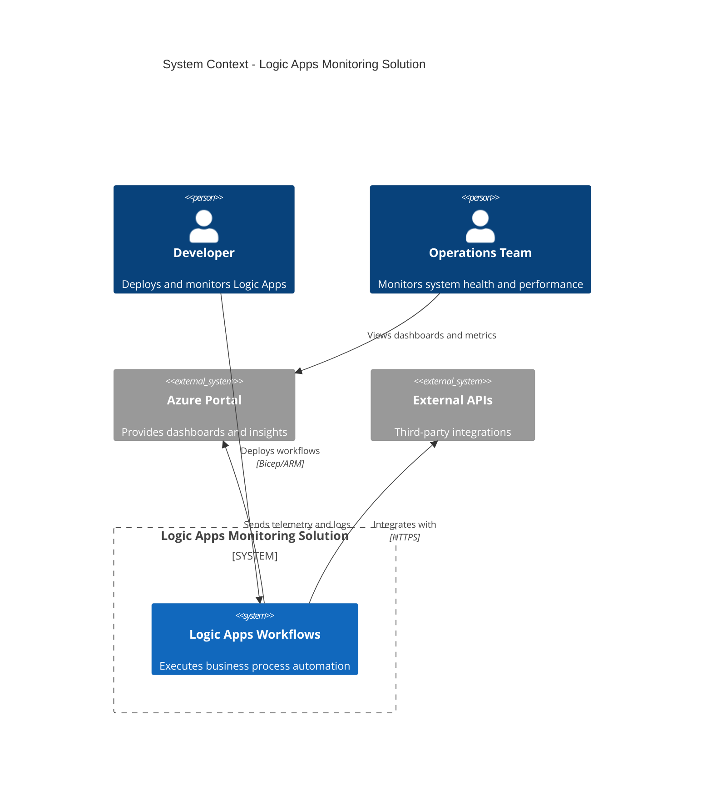
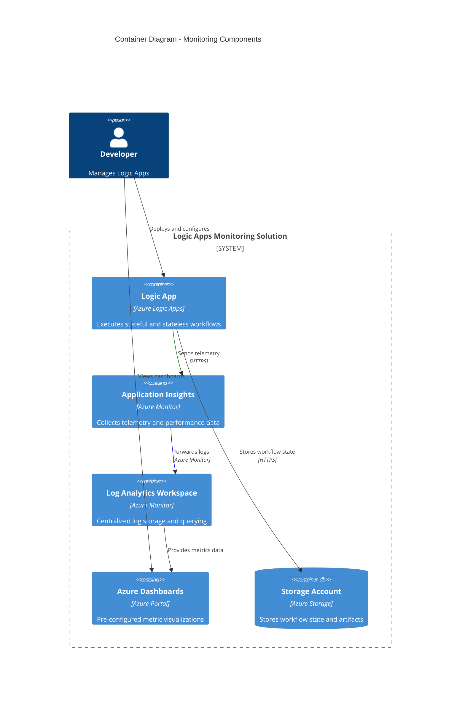
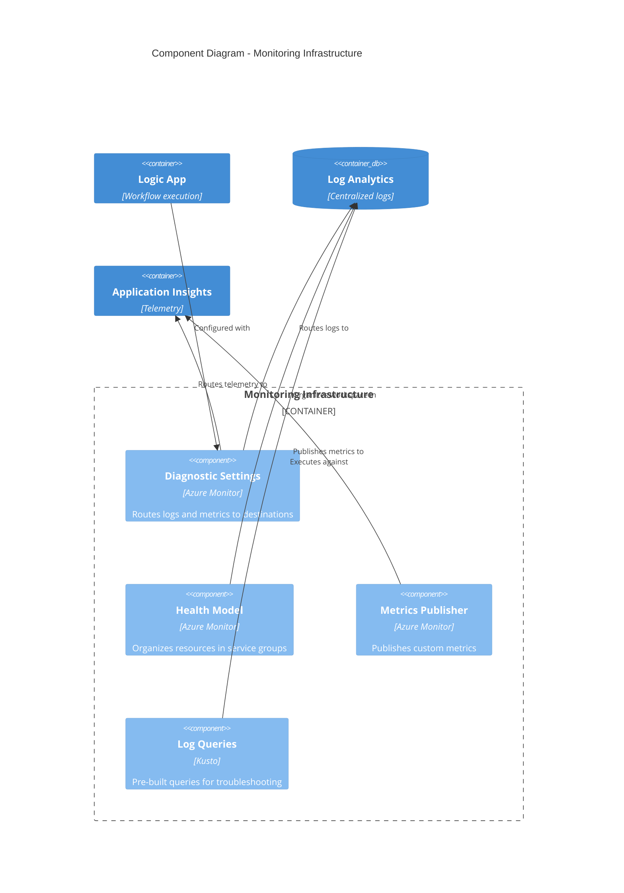
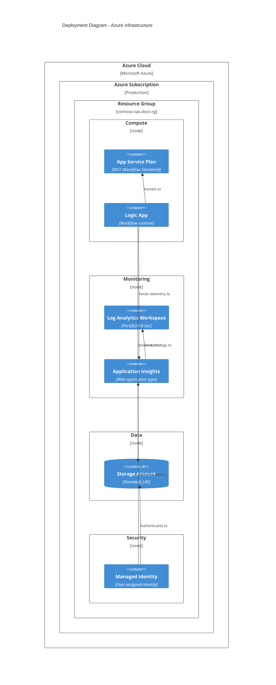

# Azure Logic Apps Monitoring

A comprehensive monitoring and observability solution for **Azure Logic Apps** and **Workflows**, demonstrating best practices for implementing Azure Monitor capabilities. This project provides Infrastructure as Code (IaC) templates and pre-configured dashboards to help developers and cloud architects establish robust monitoring for their Logic Apps deployments.

---

## Badges


---

## Features

### Comprehensive Monitoring

Enterprise-grade observability features that provide full visibility into Logic App operations and performance.

| Feature | Description |
|---------|-------------|
| **Diagnostic Settings** | Automated configuration of diagnostic logs for all Logic App resources |
| **Workflow Runtime Logging** | Capture detailed execution traces for all workflow runs |
| **Centralized Log Analytics** | Single workspace for aggregating logs across all monitoring components |
| **Application Insights Integration** | Deep telemetry collection for performance and dependency tracking |

### Metrics & Telemetry

Real-time metrics and performance indicators for proactive monitoring and troubleshooting.

| Feature | Description |
|---------|-------------|
| **Pre-configured Dashboards** | Azure Portal dashboards for App Service Plan and Logic App workflows |
| **Workflow Metrics** | Track actions, triggers, runs, completion rates, and failure rates |
| **Performance Monitoring** | CPU, memory, data transfer, and HTTP queue length metrics |
| **Custom Visualizations** | Time-series charts with 24-hour rolling windows |

### Security & Compliance

Security-first design with managed identities and role-based access control (RBAC).

| Feature | Description |
|---------|-------------|
| **Managed Identity Support** | User-assigned managed identity for secure resource access |
| **RBAC Role Assignments** | Granular permissions for Storage Account, Application Insights, and monitoring resources |
| **Secure Configuration** | HTTPS-only traffic enforcement and secure connection strings |

### Infrastructure as Code

Modern IaC practices using Azure Bicep for repeatable, version-controlled deployments.

| Feature | Description |
|---------|-------------|
| **Modular Bicep Templates** | Organized templates for monitoring, data, and workload components |
| **Azure Developer CLI Ready** | Simplified deployment with `azd` commands |
| **Parameterized Deployments** | Environment-specific configurations via parameter files |
| **Health Model Integration** | Azure Monitor Health Model for service group organization |

---

## Prerequisites

Before deploying this solution, ensure you have the following:

- **Azure Subscription**: An active Azure subscription with appropriate permissions
- **Azure CLI**: Version 2.50.0 or later ([Install Azure CLI](https://learn.microsoft.com/cli/azure/install-azure-cli))
- **Azure Developer CLI (azd)**: Version 1.5.0 or later ([Install azd](https://learn.microsoft.com/azure/developer/azure-developer-cli/install-azd))
- **Permissions**: Contributor or Owner role on the target subscription
- **Resource Providers**: Ensure the following are registered:
  - `Microsoft.Web`
  - `Microsoft.OperationalInsights`
  - `Microsoft.Insights`
  - `Microsoft.Storage`
  - `Microsoft.ManagedIdentity`

---

## Installation & Setup

### Step 1: Clone the Repository

```bash
git clone https://github.com/your-org/Azure-LogicApps-Monitoring.git
cd Azure-LogicApps-Monitoring
```

### Step 2: Authenticate with Azure

```bash
azd auth login
```

### Step 3: Initialize the Environment

```bash
azd init
```

When prompted, provide your preferred environment name (e.g., `dev`, `prod`).

### Step 4: Set the Azure Location

```bash
azd env set AZURE_LOCATION eastus2
```

Replace `eastus2` with your preferred Azure region.

### Step 5: Deploy the Solution

```bash
azd up
```

This command provisions all Azure resources defined in the Bicep templates, including:

- Resource Group
- Storage Account
- Log Analytics Workspace
- Application Insights
- App Service Plan
- Logic App
- Azure Portal Dashboards
- Diagnostic Settings
- RBAC role assignments

The deployment typically takes 3-5 minutes to complete.

---

## Usage Examples

### Deploy the Logic App

After running `azd up`, the Logic App is automatically deployed. To verify:

```bash
az logicapp list --resource-group contoso-tax-docs-rg --output table
```

### View Logs in Log Analytics

Navigate to the Azure Portal and access Log Analytics Workspace:

```bash
# Get the workspace ID
az monitor log-analytics workspace show \
  --resource-group contoso-tax-docs-rg \
  --workspace-name <workspace-name> \
  --query customerId \
  --output tsv
```

Run a sample query in Log Analytics:

```kusto
AzureDiagnostics
| where ResourceProvider == "MICROSOFT.WEB"
| where Category == "WorkflowRuntime"
| project TimeGenerated, OperationName, ResultType, ResultDescription
| order by TimeGenerated desc
| take 50
```

### Access Dashboards

The solution creates two pre-configured dashboards:

1. **App Service Plan Dashboard**: Monitors CPU, memory, data transfer, and HTTP queue length
2. **Logic App Workflows Dashboard**: Tracks workflow runs, triggers, actions, and failure rates

To view dashboards in the Azure Portal:

```bash
az portal dashboard list --resource-group contoso-tax-docs-rg --output table
```

### Query Metrics

Retrieve workflow failure rate metrics using Azure CLI:

```bash
az monitor metrics list \
  --resource <logic-app-resource-id> \
  --metric WorkflowRunsFailureRate \
  --aggregation Total \
  --interval PT1H \
  --output table
```

### Update Diagnostic Settings

Modify retention policies or add custom log categories:

```bash
az monitor diagnostic-settings update \
  --resource <logic-app-resource-id> \
  --name <diagnostic-setting-name> \
  --logs '[{"category":"WorkflowRuntime","enabled":true,"retentionPolicy":{"days":90,"enabled":true}}]'
```

---

## Architecture

### System Context Diagram


```mermaid
C4Context
    title System Context - Logic Apps Monitoring Solution
    
    Person(dev, "Developer", "Deploys and monitors Logic Apps")
    Person(ops, "Operations Team", "Monitors system health and performance")
    
    System_Boundary(solution, "Logic Apps Monitoring Solution") {
        System(logicApp, "Logic Apps Workflows", "Executes business process automation")
    }
    
    System_Ext(azure, "Azure Portal", "Provides dashboards and insights")
    System_Ext(external, "External APIs", "Third-party integrations")
    
    Rel(dev, logicApp, "Deploys workflows", "Bicep/ARM")
    Rel(ops, azure, "Views dashboards and metrics")
    Rel(logicApp, azure, "Sends telemetry and logs")
    Rel(logicApp, external, "Integrates with", "HTTPS")
    
    UpdateLayoutConfig($c4ShapeInRow="2", $c4BoundaryInRow="1")
```

### Container Diagram


```mermaid
C4Container
    title Container Diagram - Monitoring Components
    
    Person(dev, "Developer", "Manages Logic Apps")
    
    System_Boundary(monitoring, "Logic Apps Monitoring Solution") {
        Container(logicApp, "Logic App", "Azure Logic Apps", "Executes stateful and stateless workflows")
        Container(appInsights, "Application Insights", "Azure Monitor", "Collects telemetry and performance data")
        Container(logAnalytics, "Log Analytics Workspace", "Azure Monitor", "Centralized log storage and querying")
        Container(dashboard, "Azure Dashboards", "Azure Portal", "Pre-configured metric visualizations")
        ContainerDb(storage, "Storage Account", "Azure Storage", "Stores workflow state and artifacts")
    }
    
    Rel(dev, logicApp, "Deploys and configures")
    Rel(logicApp, appInsights, "Sends telemetry", "HTTPS")
    Rel(logicApp, storage, "Stores workflow state", "HTTPS")
    Rel(appInsights, logAnalytics, "Forwards logs", "Azure Monitor")
    Rel(logAnalytics, dashboard, "Provides metrics data")
    Rel(dev, dashboard, "Views dashboards")
    
    UpdateLayoutConfig($c4ShapeInRow="3", $c4BoundaryInRow="1")
    
    UpdateRelStyle(logicApp, appInsights, $lineColor="green")
    UpdateRelStyle(appInsights, logAnalytics, $lineColor="blue")
```

### Component Diagram


```mermaid
C4Component
    title Component Diagram - Monitoring Infrastructure
    
    Container_Boundary(monitoring, "Monitoring Infrastructure") {
        Component(diagnosticSettings, "Diagnostic Settings", "Azure Monitor", "Routes logs and metrics to destinations")
        Component(healthModel, "Health Model", "Azure Monitor", "Organizes resources in service groups")
        Component(metrics, "Metrics Publisher", "Azure Monitor", "Publishes custom metrics")
        Component(queries, "Log Queries", "Kusto", "Pre-built queries for troubleshooting")
    }
    
    Container(logicApp, "Logic App", "Workflow execution")
    ContainerDb(logAnalytics, "Log Analytics", "Centralized logs")
    Container(appInsights, "Application Insights", "Telemetry")
    
    Rel(logicApp, diagnosticSettings, "Configured with")
    Rel(diagnosticSettings, logAnalytics, "Routes logs to")
    Rel(diagnosticSettings, appInsights, "Routes telemetry to")
    Rel(metrics, appInsights, "Publishes metrics to")
    Rel(queries, logAnalytics, "Executes against")
    Rel(healthModel, logAnalytics, "Organizes workspace in")
    
    UpdateLayoutConfig($c4ShapeInRow="2", $c4BoundaryInRow="1")
```

### Deployment Diagram


```mermaid
C4Deployment
    title Deployment Diagram - Azure Infrastructure
    
    Deployment_Node(azure, "Azure Cloud", "Microsoft Azure") {
        Deployment_Node(sub, "Azure Subscription", "Production") {
            Deployment_Node(rg, "Resource Group", "contoso-tax-docs-rg") {
                Deployment_Node(compute, "Compute") {
                    Container(asp, "App Service Plan", "WS1 (Workflow Standard)")
                    Container(logicApp, "Logic App", "Workflow runtime")
                }
                Deployment_Node(monitor, "Monitoring") {
                    Container(law, "Log Analytics Workspace", "PerGB2018 tier")
                    Container(appInsights, "Application Insights", "Web application type")
                }
                Deployment_Node(data, "Data") {
                    ContainerDb(storage, "Storage Account", "Standard_LRS")
                }
                Deployment_Node(security, "Security") {
                    Container(mi, "Managed Identity", "User-assigned identity")
                }
            }
        }
    }
    
    Rel(logicApp, asp, "Hosted on")
    Rel(logicApp, appInsights, "Sends telemetry to")
    Rel(logicApp, storage, "Stores state in")
    Rel(appInsights, law, "Forwards logs to")
    Rel(mi, storage, "Authenticates to")
    Rel(mi, appInsights, "Authenticates to")
    
    UpdateLayoutConfig($c4ShapeInRow="2", $c4BoundaryInRow="1")
```

### Key Components

| Component | Description | Purpose | Key Features |
|-----------|-------------|---------|--------------|
| **Logic App** | Azure Logic Apps (Standard) | Workflow execution engine | Stateful and stateless workflows, built-in connectors, hybrid connectivity |
| **Application Insights** | Azure Monitor telemetry service | Collects performance and usage data | Distributed tracing, dependency tracking, live metrics, smart detection |
| **Log Analytics Workspace** | Centralized logging platform | Aggregates and queries logs | Kusto Query Language (KQL), retention policies, data export, workbooks |
| **Azure Dashboard** | Portal-based visualization | Displays metrics and charts | Pre-configured tiles, time-range filters, shared dashboards |
| **Managed Identity** | Azure AD identity for resources | Secure authentication without credentials | RBAC integration, automatic credential rotation, cross-resource access |
| **Storage Account** | Azure Blob/File/Queue/Table storage | Stores workflow state and artifacts | High availability, geo-redundancy options, encryption at rest |
| **Diagnostic Settings** | Azure Monitor configuration | Routes logs and metrics to destinations | Category-based filtering, multiple destinations, retention policies |
| **Health Model** | Azure Monitor service grouping | Organizes resources hierarchically | Tenant-level organization, service group hierarchy, health tracking |

### Deployed RBAC Roles

| Role Name | Role Description | Documentation Link |
|-----------|------------------|-------------------|
| **Storage Account Contributor** | Full management of storage accounts | [Learn more](https://learn.microsoft.com/azure/role-based-access-control/built-in-roles#storage-account-contributor) |
| **Storage Blob Data Owner** | Full access to blob containers and data | [Learn more](https://learn.microsoft.com/azure/role-based-access-control/built-in-roles#storage-blob-data-owner) |
| **Storage Queue Data Contributor** | Read, write, and delete queue messages | [Learn more](https://learn.microsoft.com/azure/role-based-access-control/built-in-roles#storage-queue-data-contributor) |
| **Storage Table Data Contributor** | Read, write, and delete table entities | [Learn more](https://learn.microsoft.com/azure/role-based-access-control/built-in-roles#storage-table-data-contributor) |
| **Storage File Data Privileged Contributor** | Full access to file shares via SMB | [Learn more](https://learn.microsoft.com/azure/role-based-access-control/built-in-roles#storage-file-data-privileged-contributor) |
| **Storage File Data SMB MI Admin** | Managed identity access to file shares | [Learn more](https://learn.microsoft.com/azure/role-based-access-control/built-in-roles#storage-file-data-smb-share-contributor) |
| **Monitoring Metrics Publisher** | Publish metrics to Azure Monitor | [Learn more](https://learn.microsoft.com/azure/role-based-access-control/built-in-roles#monitoring-metrics-publisher) |

---

## File Structure

```
Azure-LogicApps-Monitoring/
├── .azure/
│   ├── .gitignore
│   ├── config.json
│   └── dev/
│       ├── .env
│       └── config.json
├── infra/
│   ├── main.bicep
│   └── main.parameters.json
├── src/
│   ├── logic-app.bicep
│   ├── monitoring/
│   │   ├── app-insights.bicep
│   │   ├── azure-monitor-health-model.bicep
│   │   ├── log-analytics-workspace.bicep
│   │   └── main.bicep
│   └── shared/
│       ├── main.bicep
│       └── data/
│           └── main.bicep
├── .gitignore
├── azure.yaml
├── CODE_OF_CONDUCT.md
├── CONTRIBUTING.md
├── LICENSE.md
├── README.md
└── SECURITY.md
```

### Key Files Explained

| File | Name | Path | Description |
|------|------|------|-------------|
| **Main Entry Point** | main.bicep | main.bicep | Subscription-level deployment orchestrating all modules and resource groups |
| **Parameters File** | main.parameters.json | main.parameters.json | Environment-specific configuration values (location, resource names) |
| **Logic App Template** | logic-app.bicep | logic-app.bicep | Defines Logic App, App Service Plan, dashboards, and diagnostic settings |
| **Monitoring Module** | main.bicep | main.bicep | Orchestrates deployment of Log Analytics, Application Insights, and Health Model |
| **Application Insights** | app-insights.bicep | app-insights.bicep | Configures Application Insights with diagnostic settings and RBAC |
| **Log Analytics** | log-analytics-workspace.bicep | log-analytics-workspace.bicep | Creates Log Analytics Workspace with 30-day retention |
| **Health Model** | azure-monitor-health-model.bicep | azure-monitor-health-model.bicep | Defines Azure Monitor Health Model service groups |
| **Shared Resources** | main.bicep | main.bicep | Creates managed identity and orchestrates data and monitoring modules |
| **Data Storage** | main.bicep | main.bicep | Provisions Storage Account with RBAC role assignments |
| **Azure Developer CLI** | azure.yaml | azure.yaml | Defines project metadata for azd commands |

---

## Additional Resources

- **Azure Logic Apps Documentation**: [https://learn.microsoft.com/azure/logic-apps/](https://learn.microsoft.com/azure/logic-apps/)
- **Azure Monitor Documentation**: [https://learn.microsoft.com/azure/azure-monitor/](https://learn.microsoft.com/azure/azure-monitor/)
- **Application Insights**: [https://learn.microsoft.com/azure/azure-monitor/app/app-insights-overview](https://learn.microsoft.com/azure/azure-monitor/app/app-insights-overview)
- **Log Analytics Workspaces**: [https://learn.microsoft.com/azure/azure-monitor/logs/log-analytics-workspace-overview](https://learn.microsoft.com/azure/azure-monitor/logs/log-analytics-workspace-overview)
- **Azure Bicep Documentation**: [https://learn.microsoft.com/azure/azure-resource-manager/bicep/](https://learn.microsoft.com/azure/azure-resource-manager/bicep/)
- **Azure Developer CLI (azd)**: [https://learn.microsoft.com/azure/developer/azure-developer-cli/](https://learn.microsoft.com/azure/developer/azure-developer-cli/)
- **Kusto Query Language (KQL)**: [https://learn.microsoft.com/azure/data-explorer/kusto/query/](https://learn.microsoft.com/azure/data-explorer/kusto/query/)
- **Azure Monitor Best Practices**: [https://learn.microsoft.com/azure/azure-monitor/best-practices](https://learn.microsoft.com/azure/azure-monitor/best-practices)

---

## Support

### Getting Help

If you encounter issues or have questions:

- **GitHub Issues**: [Open an issue](https://github.com/your-org/Azure-LogicApps-Monitoring/issues) for bug reports or feature requests
- **GitHub Discussions**: [Start a discussion](https://github.com/your-org/Azure-LogicApps-Monitoring/discussions) for questions and community support
- **Azure Support**: Contact [Azure Support](https://azure.microsoft.com/support/) for Azure-specific technical issues

### Contributing

We welcome contributions! Please see CONTRIBUTING.md for guidelines on:

- Code of Conduct
- How to submit pull requests
- Development environment setup
- Testing requirements

### Security

If you discover a security vulnerability, please review our Security Policy and report it responsibly.

---

## License

This project is licensed under the MIT License. See LICENSE.md for details.