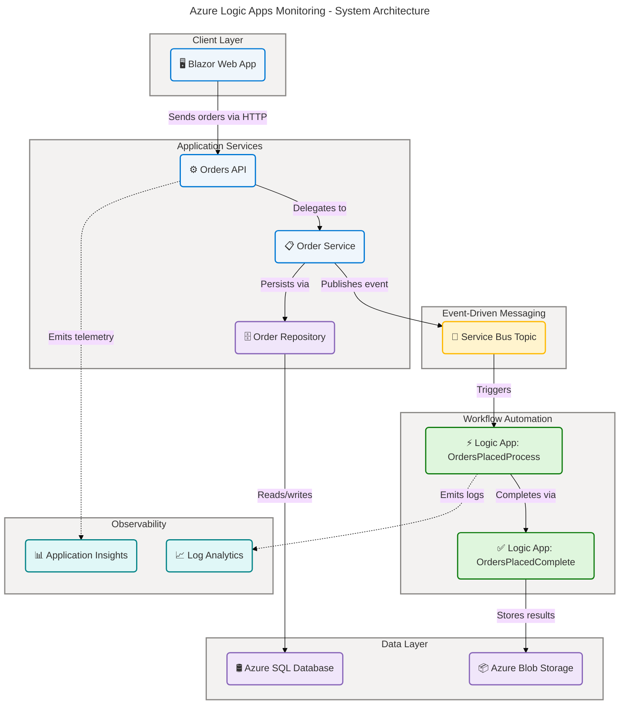

# Azure Logic Apps Monitoring

[](LICENSE)
[](https://dotnet.microsoft.com/)
[](https://azure.microsoft.com/)

## Overview

Azure Logic Apps Monitoring is a distributed microservices solution built with **.NET Aspire** that demonstrates end-to-end order management with **Azure Logic Apps Standard** workflow automation. The application integrates a RESTful Orders API, a Blazor Server frontend, and event-driven Logic Apps workflows orchestrated through **Azure Service Bus** messaging. All components are deployed to **Azure Container Apps** with full observability via **OpenTelemetry** and **Application Insights**.

### Key Highlights

- **Distributed orchestration** with .NET Aspire managing service dependencies, health checks, and configuration
- **Event-driven architecture** using Azure Service Bus topics for decoupled order processing
- **Workflow automation** with Logic Apps Standard processing order events from Service Bus
- **Full observability stack** including distributed tracing, metrics, and structured logging
- **Infrastructure as Code** with Bicep modules and Azure Developer CLI (`azd`) lifecycle management

> [!NOTE]
> This project targets **.NET 10.0** and requires the .NET 10 SDK. See the [Requirements](#requirements) section for all prerequisites.

## Table of Contents

- [Overview](#overview)
- [Architecture](#architecture)
- [Features](#features)
- [Requirements](#requirements)
- [Quick Start](#quick-start)
- [Deployment](#deployment)
- [Usage](#usage)
- [Configuration](#configuration)
- [Project Structure](#project-structure)
- [Testing](#testing)
- [Contributing](#contributing)
- [License](#license)

## Architecture

The solution follows a **distributed microservices architecture** orchestrated by .NET Aspire with event-driven messaging through Azure Service Bus and workflow automation via Logic Apps Standard.


```mermaid
---
title: "Azure Logic Apps Monitoring - System Architecture"
config:
  theme: base
  look: classic
  layout: dagre
  themeVariables:
    fontSize: '16px'
  flowchart:
    htmlLabels: true
---
flowchart TB
    accTitle: Azure Logic Apps Monitoring Architecture
    accDescr: Distributed microservices architecture showing the Blazor frontend, Orders API, Azure Service Bus messaging, Logic Apps workflow processing, and data storage components.

    %% ═══════════════════════════════════════════════════════════════════════════
    %% AZURE / FLUENT ARCHITECTURE PATTERN v1.1
    %% (Semantic + Structural + Font + Accessibility Governance)
    %% ═══════════════════════════════════════════════════════════════════════════
    %% PHASE 1 - FLUENT UI: All styling uses approved Fluent UI palette only
    %% PHASE 2 - GROUPS: Every subgraph has semantic color via style directive
    %% PHASE 3 - COMPONENTS: Every node has semantic classDef + icon prefix
    %% PHASE 4 - ACCESSIBILITY: accTitle/accDescr present, WCAG AA contrast
    %% PHASE 5 - STANDARD: Governance block present, classDefs centralized
    %% ═══════════════════════════════════════════════════════════════════════════

    subgraph Clients["Client Layer"]
        A("🖥️ Blazor Web App"):::core
    end

    subgraph Services["Application Services"]
        B("⚙️ Orders API"):::core
        C("📋 Order Service"):::core
        D("🗄️ Order Repository"):::data
    end

    subgraph Messaging["Event-Driven Messaging"]
        E("📨 Service Bus Topic"):::warning
    end

    subgraph Workflows["Workflow Automation"]
        F("⚡ Logic App: OrdersPlacedProcess"):::success
        G("✅ Logic App: OrdersPlacedComplete"):::success
    end

    subgraph DataStores["Data Layer"]
        H("🛢️ Azure SQL Database"):::data
        I("📦 Azure Blob Storage"):::data
    end

    subgraph Observability["Observability"]
        J("📊 Application Insights"):::external
        K("📈 Log Analytics"):::external
    end

    A -->|"Sends orders via HTTP"| B
    B -->|"Delegates to"| C
    C -->|"Persists via"| D
    D -->|"Reads/writes"| H
    C -->|"Publishes event"| E
    E -->|"Triggers"| F
    F -->|"Completes via"| G
    G -->|"Stores results"| I
    B -.->|"Emits telemetry"| J
    F -.->|"Emits logs"| K

    %% Centralized classDefs
    classDef core fill:#EFF6FC,stroke:#0078D4,stroke-width:2px,color:#323130
    classDef success fill:#DFF6DD,stroke:#107C10,stroke-width:2px,color:#323130
    classDef warning fill:#FFF4CE,stroke:#FFB900,stroke-width:2px,color:#323130
    classDef data fill:#F0E6FA,stroke:#8764B8,stroke-width:2px,color:#323130
    classDef external fill:#E0F7F7,stroke:#038387,stroke-width:2px,color:#323130

    %% Subgraph styling (6 subgraphs = 6 style directives)
    style Clients fill:#F3F2F1,stroke:#8A8886,stroke-width:2px,color:#323130
    style Services fill:#F3F2F1,stroke:#8A8886,stroke-width:2px,color:#323130
    style Messaging fill:#F3F2F1,stroke:#8A8886,stroke-width:2px,color:#323130
    style Workflows fill:#F3F2F1,stroke:#8A8886,stroke-width:2px,color:#323130
    style DataStores fill:#F3F2F1,stroke:#8A8886,stroke-width:2px,color:#323130
    style Observability fill:#F3F2F1,stroke:#8A8886,stroke-width:2px,color:#323130
```

### Architecture Decisions

| Decision           | Choice                       | Rationale                                                          |
| ------------------ | ---------------------------- | ------------------------------------------------------------------ |
| 🏗️ Orchestration   | .NET Aspire                  | Unified service dependencies, health checks, and configuration     |
| 📨 Messaging       | Azure Service Bus            | Enterprise-grade pub/sub with topic-based routing                  |
| ⚡ Workflow Engine | Logic Apps Standard          | Low-code workflow automation with Service Bus triggers             |
| 🗄️ Data Store      | Azure SQL Database           | Relational storage with Entity Framework Core and retry resilience |
| 🖥️ Frontend        | Blazor Server                | Interactive server-side rendering with SignalR and Fluent UI       |
| 📊 Observability   | OpenTelemetry + App Insights | Distributed tracing, metrics, and logging across all services      |

## Features

The solution provides a comprehensive set of capabilities for order management and workflow automation.

| Feature                    | Description                                                                                      |
| -------------------------- | ------------------------------------------------------------------------------------------------ |
| 📋 Order Management        | Full CRUD API for placing, retrieving, and deleting orders with validation                       |
| 🖥️ Blazor Web UI           | Interactive frontend with Microsoft Fluent UI components and real-time updates via SignalR       |
| 📨 Event-Driven Processing | Orders published to Azure Service Bus topics for decoupled downstream processing                 |
| ⚡ Workflow Automation     | Azure Logic Apps Standard workflows triggered by Service Bus messages                            |
| 🔄 Service Discovery       | Automatic service-to-service communication via .NET Aspire service discovery                     |
| 🛡️ Resilience Patterns     | Retry (3x exponential backoff), circuit breaker, and timeout policies on all HTTP clients        |
| 📊 Distributed Tracing     | End-to-end request tracing across API, database, and Service Bus with OpenTelemetry              |
| 📈 Custom Metrics          | Application-specific metrics emitted by the Order Service for monitoring dashboards              |
| 🏥 Health Checks           | Kubernetes-compatible `/health` and `/alive` endpoints including database and Service Bus probes |
| 🔐 Managed Identity        | Passwordless authentication to Azure SQL, Service Bus, and Blob Storage via managed identity     |
| 🏗️ Infrastructure as Code  | Complete Bicep modules for VNet, Container Apps, SQL, Service Bus, Logic Apps, and monitoring    |
| 🚀 Azure Developer CLI     | Full `azd` lifecycle with hooks for provisioning, deployment, and workflow configuration         |

**Overview**
These capabilities matter because they provide a **production-ready foundation** for enterprise order management, eliminating the need to build distributed messaging, observability, and resilience patterns from scratch. Teams adopting this solution gain immediate access to **battle-tested Azure integration patterns**.

The features work together through .NET Aspire orchestration, which manages service dependencies and health checks, while Azure Service Bus decouples order processing into event-driven workflows. OpenTelemetry instrumentation provides end-to-end visibility across all services, and resilience policies protect against transient failures in distributed communication.

## Requirements

The following tools and services are required to build, run, and deploy this solution.

| Requirement                    | Version             | Purpose                                            |
| ------------------------------ | ------------------- | -------------------------------------------------- |
| 🔧 .NET SDK                    | `10.0.100`          | Build and run all .NET projects                    |
| 📦 .NET Aspire Workload        | Latest              | Orchestrate distributed application                |
| ⚙️ Azure Functions Core Tools  | Latest              | Run Logic Apps workflows locally                   |
| ☁️ Azure Developer CLI (`azd`) | Latest              | Provision and deploy to Azure                      |
| 🗄️ SQL Server or Azure SQL     | Any supported       | Store order data via Entity Framework Core         |
| 📨 Azure Service Bus           | Standard or Premium | Topic-based messaging for order events             |
| 🖥️ Node.js                     | LTS                 | Required by Azure Functions runtime for Logic Apps |

**Overview**
These prerequisites ensure a consistent development and deployment experience across all team members. The .NET 10 SDK and Aspire workload are essential for building the distributed application, while `azd` automates the full Azure provisioning and deployment lifecycle.

All runtime dependencies are managed through NuGet packages restored automatically during build. For local development, the .NET Aspire orchestrator uses built-in emulators for Service Bus and SQL Server, reducing the need for Azure subscriptions during initial development and testing.

> [!TIP]
> Run `dotnet workload install aspire` to install the .NET Aspire workload required for the orchestration host.

## Quick Start

### 1. Clone the Repository

```bash
git clone https://github.com/Evilazaro/Azure-LogicApps-Monitoring.git
cd Azure-LogicApps-Monitoring
```

Expected output:

```text
Cloning into 'Azure-LogicApps-Monitoring'...
remote: Enumerating objects: done.
Receiving objects: 100%, done.
```

### 2. Restore Dependencies

```bash
dotnet restore app.sln
```

Expected output:

```text
  Determining projects to restore...
  Restored app.AppHost/app.AppHost.csproj
  Restored app.ServiceDefaults/app.ServiceDefaults.csproj
  Restored src/eShop.Orders.API/eShop.Orders.API.csproj
  Restored src/eShop.Web.App/eShop.Web.App.csproj
```

### 3. Run Locally with .NET Aspire

```bash
dotnet run --project app.AppHost/app.AppHost.csproj
```

Expected output:

```text
info: Aspire.Hosting.DistributedApplication[0]
      Distributed application started.
      Dashboard: https://localhost:15178
      orders-api: https://localhost:7xxx
      web-app: https://localhost:7xxx
```

The Aspire dashboard opens at the URL shown in the terminal, providing a unified view of all services, logs, and traces.

**Overview**
The quick start runs the full distributed application locally using the .NET Aspire host. In development mode, the application uses local emulators for Azure Service Bus and SQL Server when Azure environment variables are not configured. The Aspire dashboard provides real-time telemetry for all registered services.

## Deployment

Deploy the complete solution to Azure using the Azure Developer CLI (`azd`).

**Overview**
The deployment uses Azure Developer CLI with Bicep infrastructure templates organized into shared (networking, identity, monitoring) and workload (services, messaging, logic apps) modules. The `azd` lifecycle hooks automate build validation, SQL managed identity configuration, and Logic Apps workflow deployment. The entire flow is **idempotent** and safe to run multiple times.

Deployment follows a **hook-driven lifecycle** defined in `azure.yaml`: preprovision validates the build and runs tests, postprovision configures SQL managed identity access and stores user secrets, and predeploy deploys Logic Apps workflow definitions via zip deployment.

### 1. Authenticate with Azure

```bash
azd auth login
```

Expected output:

```text
Logged in to Azure.
```

### 2. Create an Environment

```bash
azd env new my-env
```

Expected output:

```text
New environment my-env created.
```

Set the required Azure location for provisioning:

```bash
azd env set AZURE_LOCATION westus3
```

### 3. Provision and Deploy (Combined)

```bash
azd up
```

Expected output:

```text
Packaging services (azd package)
Provisioning Azure resources (azd provision)
Deploying services (azd deploy)

SUCCESS: Your application was provisioned and deployed to Azure.
```

> [!IMPORTANT]
> The `azd up` command executes lifecycle hooks defined in `azure.yaml` including pre-provision validation, post-provision SQL managed identity configuration, and pre-deploy Logic Apps workflow deployment.

### 4. Provision and Deploy (Individual Steps)

Alternatively, run provisioning and deployment as separate steps:

```bash
azd provision
```

Expected output:

```text
Provisioning Azure resources (azd provision)
SUCCESS: Your application was provisioned in Azure.
```

```bash
azd deploy
```

Expected output:

```text
Deploying services (azd deploy)
SUCCESS: Your application was deployed to Azure.
```

### Lifecycle Hooks

The `azure.yaml` configuration defines hooks that execute automatically during the `azd` lifecycle:

| Hook              | Phase                 | Actions                                                                                                    |
| ----------------- | --------------------- | ---------------------------------------------------------------------------------------------------------- |
| `preprovision`    | Before infrastructure | Cleans build artifacts, restores NuGet packages, builds in Debug, runs unit tests, validates prerequisites |
| `postprovision`   | After infrastructure  | Authenticates to ACR, configures SQL managed identity with `db_owner` role, stores .NET user secrets       |
| `predeploy`       | Before app deployment | Deploys Logic Apps workflows via zip deployment, resolves connection placeholders, updates app settings    |
| `postinfradelete` | After teardown        | Cleans up secrets and local configuration artifacts                                                        |

### Logic Apps Workflow Deployment

The `predeploy` hook runs `hooks/deploy-workflow.ps1` which automates Logic Apps workflow deployment:

1. Discovers workflow directories containing `workflow.json` under `workflows/`
2. Resolves `${VARIABLE}` placeholders in `connections.json`, `parameters.json`, and `workflow.json`
3. Fetches Service Bus and Blob Storage connection runtime URLs from Azure
4. Creates a zip deployment package with all workflow artifacts
5. Updates Logic App application settings and deploys via Azure CLI

### Infrastructure Provisioned

The deployment creates the following Azure resources through Bicep modules:

- **Azure Container Apps Environment** with VNet integration
- **Azure Container Registry** for container images
- **Azure SQL Database** with managed identity access
- **Azure Service Bus** namespace with `ordersplaced` topic and subscription
- **Azure Logic Apps Standard** (App Service Plan) with workflow deployment
- **Application Insights** and **Log Analytics Workspace** for observability
- **User Assigned Managed Identity** for service-to-service authentication
- **Storage Accounts** for Logic Apps and application state

### Teardown

Remove all provisioned Azure resources:

```bash
azd down
```

Expected output:

```text
Deleting all resources and deployments...
SUCCESS: Your application was removed from Azure.
```

## Usage

**Overview**
The Orders API exposes RESTful endpoints at `/api/orders` with full Swagger/OpenAPI documentation available at `/swagger`. When an order is placed, the Order Service publishes an event to the Azure Service Bus `ordersplaced` topic, which triggers the Logic Apps workflow for downstream processing. The Blazor Web App provides an interactive UI for managing orders, while the Aspire dashboard offers real-time distributed tracing and health monitoring.

The end-to-end order flow works as follows: the client places an order through the API or Web App, the Order Service persists it to Azure SQL and publishes a message to the Service Bus `ordersplaced` topic, the `OrdersPlacedProcess` Logic App workflow triggers on the message and processes it, and the `OrdersPlacedCompleteProcess` workflow stores the completed result to Azure Blob Storage.

### API Documentation

The Orders API provides interactive Swagger/OpenAPI documentation:

```text
https://localhost:7xxx/swagger
```

The Swagger UI lists all available endpoints, request/response schemas, and allows testing directly from the browser.

### Place an Order

```bash
curl -X POST https://localhost:7xxx/api/orders \
  -H "Content-Type: application/json" \
  -d '{
    "customerId": "customer-001",
    "date": "2025-01-15",
    "deliveryAddress": "123 Main St",
    "total": 99.99,
    "products": [
      { "name": "Widget", "price": 49.99, "quantity": 2 }
    ]
  }'
```

Expected output:

```json
{
  "id": "generated-guid",
  "customerId": "customer-001",
  "date": "2025-01-15",
  "deliveryAddress": "123 Main St",
  "total": 99.99,
  "products": [{ "name": "Widget", "price": 49.99, "quantity": 2 }]
}
```

### Place Orders in Batch

```bash
curl -X POST https://localhost:7xxx/api/orders/batch \
  -H "Content-Type: application/json" \
  -d '[
    { "customerId": "c-001", "date": "2025-01-15", "deliveryAddress": "1 Main St", "total": 50.00, "products": [{ "name": "A", "price": 50.00, "quantity": 1 }] },
    { "customerId": "c-002", "date": "2025-01-16", "deliveryAddress": "2 Oak Ave", "total": 75.00, "products": [{ "name": "B", "price": 75.00, "quantity": 1 }] }
  ]'
```

Expected output:

```json
[
  { "id": "guid-1", "customerId": "c-001", "total": 50.0 },
  { "id": "guid-2", "customerId": "c-002", "total": 75.0 }
]
```

### Retrieve All Orders

```bash
curl https://localhost:7xxx/api/orders
```

Expected output:

```json
[
  {
    "id": "generated-guid",
    "customerId": "customer-001",
    "date": "2025-01-15",
    "total": 99.99,
    "products": [{ "name": "Widget", "price": 49.99, "quantity": 2 }]
  }
]
```

### Retrieve a Single Order

```bash
curl https://localhost:7xxx/api/orders/{id}
```

Expected output:

```json
{
  "id": "order-guid",
  "customerId": "customer-001",
  "date": "2025-01-15",
  "deliveryAddress": "123 Main St",
  "total": 99.99,
  "products": [{ "name": "Widget", "price": 49.99, "quantity": 2 }]
}
```

### Delete an Order

```bash
curl -X DELETE https://localhost:7xxx/api/orders/{id}
```

Expected output:

```text
HTTP/1.1 204 No Content
```

### Generate Sample Orders

Use the provided script to populate test data:

```powershell
./hooks/Generate-Orders.ps1 -OrderCount 100
```

Expected output:

```text
Generating sample orders...
Order generation complete: 100 orders written to infra/data/ordersBatch.json
```

The script supports configurable parameters including `-OrderCount` (1–10,000), `-MinProducts`, and `-MaxProducts` for controlling generated data.

### Health Check Endpoints

The API exposes Kubernetes-compatible health probes:

| Endpoint  | Purpose                                                    |
| --------- | ---------------------------------------------------------- |
| `/health` | Readiness probe — checks database and Service Bus          |
| `/alive`  | Liveness probe — confirms the application process is alive |

```bash
curl https://localhost:7xxx/health
```

Expected output:

```json
{
  "status": "Healthy",
  "entries": {
    "db": { "status": "Healthy" },
    "servicebus": { "status": "Healthy" }
  }
}
```

### Aspire Dashboard

When running locally with `dotnet run --project app.AppHost`, the .NET Aspire dashboard is available at the URL printed in the terminal output (typically `https://localhost:15178`). The dashboard provides:

- **Resources** — Live status of all registered services (`orders-api`, `web-app`)
- **Traces** — Distributed tracing across API calls, database queries, and Service Bus operations
- **Metrics** — Application-level and runtime performance metrics
- **Structured Logs** — Aggregated structured logs from all services

### Web Application

The Blazor Server frontend is accessible at the `web-app` URL shown in the Aspire dashboard output. The Web App uses Microsoft Fluent UI components and connects to the Orders API via service discovery with built-in retry, timeout, and circuit breaker resilience policies.

## Configuration

**Overview**
Configuration management is critical in distributed systems where multiple services must coordinate credentials, endpoints, and feature flags. This layered approach ensures **secrets never appear in source control** while supporting both local emulators and production Azure services.

The .NET Aspire host automatically injects connection strings and service endpoints through its resource reference system. In local mode, emulators are configured automatically. For Azure deployment, **managed identity** provides **passwordless authentication** to all services, and `azd` environment variables drive infrastructure provisioning parameters.

### Environment Variables

The application uses a layered configuration approach with environment variables, user secrets, and Aspire service defaults.

| Setting                  | Environment Variable                    | Default     | Description                                              |
| ------------------------ | --------------------------------------- | ----------- | -------------------------------------------------------- |
| 📊 App Insights          | `APPLICATIONINSIGHTS_CONNECTION_STRING` | None        | Azure Monitor telemetry connection string                |
| 📨 Service Bus Host      | `MESSAGING_HOST`                        | `localhost` | Service Bus namespace FQDN or `localhost` for emulator   |
| 🗄️ SQL Connection        | `ConnectionStrings:OrderDb`             | None        | Azure SQL or local SQL Server connection string          |
| ☁️ Azure Tenant          | `AZURE_TENANT_ID`                       | None        | Azure AD tenant for local development authentication     |
| 🔑 Azure Client          | `AZURE_CLIENT_ID`                       | None        | Managed identity client ID for local development         |
| 📊 OTLP Endpoint         | `OTEL_EXPORTER_OTLP_ENDPOINT`           | None        | OpenTelemetry collector endpoint for distributed tracing |
| 📍 Azure Location        | `AZURE_LOCATION`                        | None        | Azure region for resource provisioning via `azd`         |
| 🏷️ Environment Name      | `AZURE_ENV_NAME`                        | None        | `azd` environment name for resource naming               |
| 🗄️ SQL Server Name       | `AZURE_SQL_SERVER_NAME`                 | None        | Azure SQL logical server name for managed identity setup |
| 🗄️ SQL Database Name     | `AZURE_SQL_DATABASE_NAME`               | None        | Azure SQL database name used by postprovision hook       |
| 🔑 Managed Identity Name | `MANAGED_IDENTITY_NAME`                 | None        | User assigned managed identity name for RBAC             |
| 🔑 Managed Identity ID   | `MANAGED_IDENTITY_CLIENT_ID`            | None        | Client ID for the managed identity                       |
| 📨 Service Bus FQDN      | `MESSAGING_SERVICEBUSHOSTNAME`          | None        | Fully qualified Service Bus namespace hostname           |
| ⚡ Logic App Name        | `LOGIC_APP_NAME`                        | None        | Azure Logic Apps Standard app name for workflow deploy   |
| 📦 Container Registry    | `AZURE_CONTAINER_REGISTRY_ENDPOINT`     | None        | ACR login server endpoint for container image push       |

### Local Development with User Secrets

For local development, the `postprovision` hook automatically configures .NET user secrets for three projects:

```bash
dotnet user-secrets set "Azure:TenantId" "<your-tenant-id>" --project app.AppHost/app.AppHost.csproj
dotnet user-secrets set "Azure:ClientId" "<your-client-id>" --project app.AppHost/app.AppHost.csproj
dotnet user-secrets set "Azure:ResourceGroup" "<your-rg>" --project app.AppHost/app.AppHost.csproj
```

The following projects receive user secrets during postprovision:

| Project                                        | Secrets Configured                                                      |
| ---------------------------------------------- | ----------------------------------------------------------------------- |
| `app.AppHost/app.AppHost.csproj`               | Azure tenant, client ID, resource group, SQL, Service Bus, App Insights |
| `src/eShop.Orders.API/eShop.Orders.API.csproj` | Azure tenant, client ID, SQL connection, Service Bus, App Insights      |
| `src/eShop.Web.App/eShop.Web.App.csproj`       | Azure tenant, client ID, App Insights connection string                 |

### Azure Deployment Configuration

Set deployment-specific values using `azd env set`:

```bash
azd env set AZURE_LOCATION westus3
azd env set AZURE_ENV_NAME my-environment
```

These values are passed as parameters to the Bicep infrastructure templates during `azd provision`.

### Aspire Host Configuration

The Aspire host in `app.AppHost/appsettings.json` controls orchestration behavior:

```json
{
  "Logging": {
    "LogLevel": {
      "Default": "Information",
      "Microsoft.AspNetCore": "Warning",
      "Aspire.Hosting.Dcp": "Warning"
    }
  },
  "Azure": {
    "AllowResourceGroupCreation": false
  }
}
```

The `Azure:AllowResourceGroupCreation` setting **must** be `false` when deploying into an existing resource group managed by `azd`. Setting it to `true` allows Aspire to create a new resource group automatically.

### Local vs Azure Mode

The Aspire host detects the execution context and configures services accordingly:

| Setting           | Local Development                         | Azure Deployment                               |
| ----------------- | ----------------------------------------- | ---------------------------------------------- |
| Service Bus       | Built-in emulator (no Azure subscription) | Azure Service Bus via managed identity         |
| SQL Database      | Local SQL Server or emulator              | Azure SQL with managed identity authentication |
| App Insights      | User secrets connection string (optional) | Injected by Container Apps infrastructure      |
| Service Discovery | Localhost ports via Aspire dashboard      | Container Apps internal DNS                    |
| Authentication    | `AZURE_TENANT_ID` + `AZURE_CLIENT_ID`     | User assigned managed identity (automatic)     |

> [!WARNING]
> Never commit connection strings or secrets to source control. Use `dotnet user-secrets` for local development and Azure Key Vault or `azd` environment variables for production.

## Project Structure

```text
├── app.AppHost/                    # .NET Aspire orchestration host
│   ├── AppHost.cs                  # Service registration and Azure resource config
│   └── infra/                      # Container Apps manifest templates
├── app.ServiceDefaults/            # Shared Aspire service configuration
│   ├── Extensions.cs               # OpenTelemetry, health checks, resilience
│   └── CommonTypes.cs              # Shared domain models (Order, OrderProduct)
├── src/
│   ├── eShop.Orders.API/           # RESTful Orders Web API
│   │   ├── Controllers/            # OrdersController (CRUD endpoints)
│   │   ├── Services/               # OrderService (business logic, tracing)
│   │   ├── Repositories/           # OrderRepository (EF Core data access)
│   │   ├── Handlers/               # Service Bus message publishers
│   │   ├── HealthChecks/           # DB and Service Bus health probes
│   │   └── Data/                   # OrderDbContext, entity mappings
│   ├── eShop.Web.App/              # Blazor Server frontend
│   │   ├── Components/             # Razor components and pages
│   │   └── Shared/                 # Layout and navigation
│   └── tests/                      # Test projects for all services
│       ├── app.AppHost.Tests/
│       ├── app.ServiceDefaults.Tests/
│       ├── eShop.Orders.API.Tests/
│       └── eShop.Web.App.Tests/
├── workflows/
│   └── OrdersManagement/           # Logic Apps Standard workflows
│       └── OrdersManagementLogicApp/
│           ├── OrdersPlacedProcess/        # Service Bus trigger workflow
│           └── OrdersPlacedCompleteProcess/ # Completion workflow
├── infra/                          # Bicep infrastructure modules
│   ├── main.bicep                  # Root deployment orchestration
│   ├── shared/                     # VNet, identity, monitoring, data
│   └── workload/                   # Container Apps, Service Bus, Logic Apps
├── hooks/                          # azd lifecycle scripts
│   ├── preprovision.ps1            # Pre-deployment validation
│   ├── postprovision.ps1           # Post-deployment SQL config
│   └── deploy-workflow.ps1         # Logic Apps workflow deployment
└── azure.yaml                      # Azure Developer CLI configuration
```

## Testing

The solution includes test projects for each service:

```bash
dotnet test app.sln
```

Expected output:

```text
  Determining projects to restore...
  All projects are up-to-date for restore.
Test run for app.AppHost.Tests
Test run for app.ServiceDefaults.Tests
Test run for eShop.Orders.API.Tests
Test run for eShop.Web.App.Tests

Passed!  - Total: X, Passed: X, Failed: 0
```

Test projects are located under `src/tests/` with dedicated test projects for the AppHost, ServiceDefaults, Orders API, and Web App.

## Contributing

Contributions are welcome. Please follow these guidelines:

**Overview**
Contributions help improve the solution for the broader Azure and .NET community. Whether fixing bugs, adding features, or improving documentation, every contribution is valued and reviewed promptly.

The project follows standard .NET development practices with C# coding conventions enforced through the SDK configuration. All contributions **must** include appropriate tests and pass the existing test suite before submission.

### Steps

1. Fork the repository
2. Create a feature branch from `main`
3. Make changes following the existing code style and patterns
4. Add or update tests for any new functionality
5. Run `dotnet test app.sln` to verify all tests pass
6. Submit a pull request with a clear description of the changes

## License

This project is licensed under the **MIT License**. See the [LICENSE](LICENSE) file for details.

Copyright (c) 2025 Evilázaro Alves
