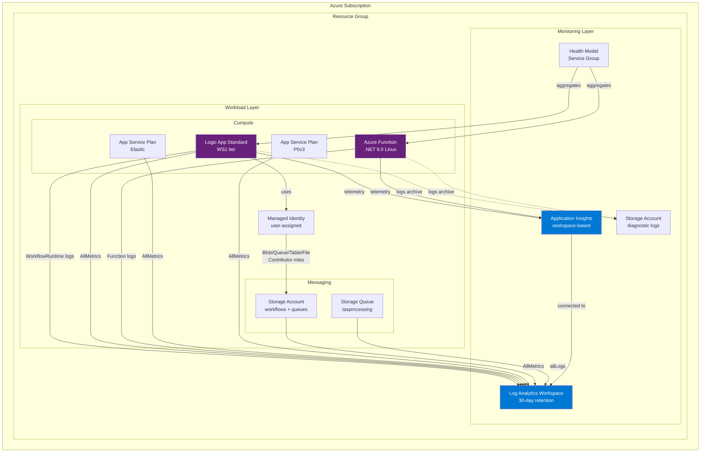
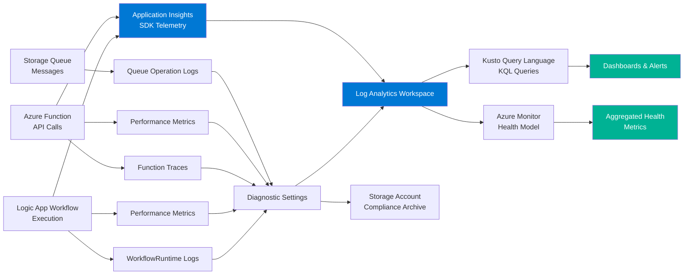

# Azure Logic Apps Monitoring Solution

A production-ready monitoring infrastructure for Azure Logic Apps Standard, demonstrating observability best practices using Infrastructure as Code (Bicep). This solution provides comprehensive telemetry collection, centralized logging, and health monitoring for enterprise workflow orchestration.

[](https://azure.microsoft.com)
[](https://learn.microsoft.com/azure/azure-resource-manager/bicep/)
[](LICENSE.md)

---

## Table of Contents

- [Project Overview](#project-overview)
- [Architecture](#architecture)
- [Prerequisites](#prerequisites)
- [Deployment](#deployment)
- [Usage](#usage)
- [Project Structure](#project-structure)
- [Monitoring Best Practices](#monitoring-best-practices)
- [Contributing](#contributing)
- [Security](#security)
- [License](#license)
- [Additional Resources](#additional-resources)
- [Support](#support)

---

## Project Overview

### Purpose

This solution addresses the observability gap in default Azure Logic Apps deployments by providing a complete monitoring infrastructure that goes beyond out-of-the-box Application Insights. It demonstrates how to implement centralized logging, diagnostic settings, and health modeling for Logic Apps Standard workloads using repeatable Infrastructure as Code patterns.

### Key Features

**Comprehensive Telemetry Collection**
- Automated diagnostic settings for Logic App workflow runtime logs
- Azure Functions API layer performance metrics and traces
- Storage Queue message processing monitoring
- App Service Plan resource utilization tracking

**Centralized Observability Platform**
- Workspace-based Application Insights connected to Log Analytics
- Unified query experience across all telemetry sources
- 30-day log retention with compliance-ready storage archival
- Pre-configured diagnostic settings for all deployed resources

**Security-First Design**
- Managed Identities for all service-to-service authentication
- RBAC-based storage access (eliminates connection string management)
- TLS 1.2+ enforcement across all endpoints
- Diagnostic logging for audit trails

**Infrastructure as Code Excellence**
- Modular Bicep templates with clear separation of concerns
- Parameterized deployments for multi-environment support
- Dependency-aware deployment orchestration
- Azure Developer CLI integration for streamlined provisioning

### Target Audience

- **Beginners**: Developers deploying their first Logic Apps monitoring setup with step-by-step guidance
- **Architects**: Evaluating observability patterns for enterprise workflow orchestration
- **DevOps Engineers**: Managing Logic Apps deployments with automated monitoring configuration
- **Platform Engineers**: Standardizing observability across Azure Logic Apps portfolios

### Benefits

**Beyond Default Monitoring**
- Solves the diagnostic settings gap: Out-of-the-box Logic Apps don't automatically send logs to Log Analytics
- Provides storage-level visibility: Monitors workflow storage accounts and queues that Application Insights doesn't track
- Enables health modeling: Azure Monitor Service Groups for aggregated health metrics across resource topologies

**Operational Advantages**
- Reduces deployment time from hours to minutes with azd integration
- Eliminates manual diagnostic settings configuration errors
- Provides consistent monitoring across dev/staging/production environments
- Aligns with Azure Well-Architected Framework reliability and operational excellence pillars

**Cost Optimization**
- Configurable log retention (30-day default reduces storage costs)
- PerGB2018 pricing tier for Log Analytics (pay only for ingested data)
- Storage archival for compliance without expensive hot-tier retention

---

## Architecture

### Overview

The solution uses a **three-layer architecture** that separates infrastructure, monitoring, and workload concerns:

1. **Infrastructure Layer** (`infra/main.bicep`): Orchestrates the entire deployment, creating the resource group and invoking monitoring/workload modules in dependency order
2. **Monitoring Layer** (`src/monitoring/`): Deploys observability infrastructure first (Log Analytics, Application Insights, storage for logs) so workload resources can reference these during deployment
3. **Workload Layer** (`src/workload/`): Deploys application resources (Logic Apps, Functions, messaging) with diagnostic settings pre-configured to send telemetry to the monitoring layer

This separation ensures **monitoring infrastructure is always available** before workload resources are created, preventing deployment failures from missing diagnostic targets. It also enables **reusability**: the monitoring module can be deployed once and shared across multiple workload deployments.

### Architecture Diagram


```mermaid
graph TB
    subgraph "Azure Subscription"
        subgraph "Resource Group"
            subgraph "Monitoring Layer"
                LAW[Log Analytics Workspace<br/>30-day retention]
                AI[Application Insights<br/>workspace-based]
                LogStore[Storage Account<br/>diagnostic logs]
                HM[Health Model<br/>Service Group]
            end
            
            subgraph "Workload Layer"
                subgraph "Compute"
                    LA[Logic App Standard<br/>WS1 tier]
                    FUNC[Azure Function<br/>.NET 9.0 Linux]
                    ASP1[App Service Plan<br/>Elastic]
                    ASP2[App Service Plan<br/>P0v3]
                end
                
                subgraph "Messaging"
                    WStore[Storage Account<br/>workflows + queues]
                    Queue[Storage Queue<br/>taxprocessing]
                end
                
                MI[Managed Identity<br/>user-assigned]
            end
        end
    end
    
    %% Diagnostic Settings Flow
    LA -->|WorkflowRuntime logs| LAW
    LA -->|AllMetrics| LAW
    FUNC -->|Function logs| LAW
    ASP1 -->|AllMetrics| LAW
    ASP2 -->|AllMetrics| LAW
    WStore -->|AllMetrics| LAW
    Queue -->|allLogs| LAW
    
    %% Application Insights Integration
    LA -->|telemetry| AI
    FUNC -->|telemetry| AI
    AI -->|connected to| LAW
    
    %% Storage for Compliance
    LA -.->|logs archive| LogStore
    FUNC -.->|logs archive| LogStore
    
    %% Managed Identity RBAC
    MI -->|Blob/Queue/Table/File<br/>Contributor roles| WStore
    LA -->|uses| MI
    
    %% Health Model
    HM -->|aggregates| LA
    HM -->|aggregates| FUNC
    
    style LAW fill:#0078D4,color:#fff
    style AI fill:#0078D4,color:#fff
    style LA fill:#68217A,color:#fff
    style FUNC fill:#68217A,color:#fff
```

### Data Flow Diagram


```mermaid
flowchart LR
    A[Logic App Workflow<br/>Execution] --> B[WorkflowRuntime Logs]
    A --> C[Performance Metrics]
    
    D[Azure Function<br/>API Calls] --> E[Function Traces]
    D --> F[Performance Metrics]
    
    G[Storage Queue<br/>Messages] --> H[Queue Operation Logs]
    
    B --> I[Diagnostic Settings]
    C --> I
    E --> I
    F --> I
    H --> I
    
    I --> J[Log Analytics Workspace]
    I --> K[Storage Account<br/>Compliance Archive]
    
    A --> L[Application Insights<br/>SDK Telemetry]
    D --> L
    L --> J
    
    J --> M[Kusto Query Language<br/>KQL Queries]
    M --> N[Dashboards & Alerts]
    
    J --> O[Azure Monitor<br/>Health Model]
    O --> P[Aggregated Health<br/>Metrics]
    
    style J fill:#0078D4,color:#fff
    style L fill:#0078D4,color:#fff
    style N fill:#00B294,color:#fff
    style P fill:#00B294,color:#fff
```

### Data Flow Explanation

1. **Telemetry Generation**: Logic Apps generate WorkflowRuntime logs when workflows execute, Azure Functions emit traces and performance metrics during API processing, and Storage Queues log message operations
2. **Diagnostic Settings Collection**: All resources have diagnostic settings configured at deployment time, automatically sending logs and metrics to both Log Analytics and a compliance storage account
3. **Application Insights Integration**: Application Insights SDKs embedded in Logic Apps and Functions send real-time telemetry, which flows into the workspace-based Application Insights instance connected to Log Analytics
4. **Unified Query Layer**: All telemetry converges in Log Analytics workspace where operators can write KQL queries to analyze logs, metrics, and traces from multiple sources in a single query
5. **Health Aggregation**: Azure Monitor Service Groups aggregate health signals from Logic Apps and Functions, providing topology-aware health metrics for the entire solution
6. **Actionable Insights**: Query results power Azure Monitor dashboards and alerts, enabling proactive incident response based on comprehensive observability data

---

## Prerequisites

### Azure Requirements

- **Azure Subscription** with Contributor or Owner access (required for creating resource groups and RBAC assignments)
- **Resource Providers Registered**: 
  - `Microsoft.Logic` (Logic Apps)
  - `Microsoft.Insights` (Application Insights, diagnostic settings)
  - `Microsoft.OperationalInsights` (Log Analytics)
  - `Microsoft.Web` (App Service Plans, Functions)
  - `Microsoft.Storage` (Storage Accounts)
  - `Microsoft.ManagedIdentity` (Managed Identities)

To verify and register providers:
```bash
# Check registration status
az provider show --namespace Microsoft.Logic --query "registrationState"

# Register if needed
az provider register --namespace Microsoft.Logic
az provider register --namespace Microsoft.Insights
az provider register --namespace Microsoft.OperationalInsights
az provider register --namespace Microsoft.Web
az provider register --namespace Microsoft.Storage
az provider register --namespace Microsoft.ManagedIdentity
```

### Local Tools

| Tool | Minimum Version | Purpose |
|------|----------------|---------|
| [Azure CLI](https://learn.microsoft.com/cli/azure/install-azure-cli) | 2.50.0+ | Resource deployment and management |
| [Bicep CLI](https://learn.microsoft.com/azure/azure-resource-manager/bicep/install) | 0.20.0+ | Bicep template compilation (auto-installed with Azure CLI 2.20+) |
| [Azure Developer CLI (azd)](https://learn.microsoft.com/azure/developer/azure-developer-cli/install-azd) | 1.0.0+ | Streamlined provisioning (optional but recommended) |
| [PowerShell](https://learn.microsoft.com/powershell/scripting/install/installing-powershell) | 7.0+ | Script execution on Windows (or Bash 4.0+ on Linux/macOS) |

Verify installations:
```bash
az --version
azd version
pwsh --version  # or bash --version
```

### Knowledge Prerequisites

- ✓ Basic understanding of Azure Logic Apps Standard (workflow concepts, triggers, actions)
- ✓ Familiarity with Azure Resource Manager deployments (resource groups, ARM/Bicep templates)
- ○ (Optional) Experience with Bicep or ARM template syntax
- ○ (Optional) Knowledge of Kusto Query Language (KQL) for Log Analytics
- ○ (Optional) Azure Well-Architected Framework principles

### Configuration Files

**Required Customization**:
- `infra/main.parameters.json`: Set `AZURE_LOCATION` and `AZURE_ENV_NAME` environment variables (see deployment instructions)

**No Modification Needed**:
- All Bicep templates use parameterization and unique resource name generation
- Managed Identities eliminate the need for connection strings or secrets
- Default values are production-appropriate (30-day log retention, TLS 1.2, etc.)

---

## Deployment

### Option A: Using Azure Developer CLI (Recommended)

Azure Developer CLI (azd) provides the fastest path from zero to deployed infrastructure with a single command.

**Step 1: Clone the Repository**

```bash
git clone https://github.com/Evilazaro/Azure-LogicApps-Monitoring.git
cd Azure-LogicApps-Monitoring
```

**Step 2: Authenticate to Azure**

```bash
# Login to Azure (opens browser for authentication)
azd auth login

# Verify your subscription
az account show --query "{Name:name, SubscriptionId:id}" --output table
```

**Step 3: Configure Environment**

```bash
# Set required environment variables
# Replace with your preferred Azure region (e.g., eastus, westus2, northeurope)
azd env set AZURE_LOCATION eastus

# Set environment name (dev, uat, or prod)
azd env set AZURE_ENV_NAME dev
```

**Step 4: Provision and Deploy**

```bash
# Single command to provision all resources and deploy code
azd up
```

**What `azd up` Does**:
1. Creates a new resource group named `contoso-tax-docs-dev-eastus-rg` (based on parameters)
2. Deploys monitoring infrastructure: Log Analytics workspace, Application Insights, storage account for logs
3. Deploys workload resources: Logic App, Azure Function, storage account with queue
4. Configures diagnostic settings on all resources to send telemetry to Log Analytics
5. Assigns Managed Identity RBAC roles for secure storage access
6. Outputs resource names and connection strings to console

**Expected Output**:
```
✓ Provisioning Azure resources (azd provision)
  ✓ Resource group: contoso-tax-docs-dev-eastus-rg
  ✓ Log Analytics workspace: tax-docs-abc123-law
  ✓ Application Insights: tax-docs-abc123-appinsights
  ✓ Logic App: tax-docs-abc123-logic
  ✓ Function App: tax-docs-abc123-api

SUCCESS: Your application was provisioned in Azure in 4 minutes 32 seconds.
```

**Step 5: Verify Deployment**

```bash
# List all resources in the deployed resource group
az resource list --resource-group contoso-tax-docs-dev-eastus-rg --output table
```

---

### Option B: Manual Bicep Deployment

For granular control or CI/CD pipeline integration, deploy using Azure CLI directly.

**Step 1: Configure Parameters**

The solution uses environment variables for parameterization. Set these before deployment:

```bash
# Set Azure region
$env:AZURE_LOCATION = "eastus"  # PowerShell
export AZURE_LOCATION="eastus"  # Bash

# Set environment name (dev, uat, or prod)
$env:AZURE_ENV_NAME = "dev"      # PowerShell
export AZURE_ENV_NAME="dev"      # Bash
```

**Optional**: To customize the solution name (default: `tax-docs`), edit `infra/main.bicep` line 10:
```bicep
param solutionName string = 'your-name'  // Change 'tax-docs' to your preference
```

**Step 2: Authenticate to Azure**

```bash
# Login to Azure
az login

# Set your subscription (if you have multiple)
az account set --subscription "Your-Subscription-Name-Or-ID"

# Verify active subscription
az account show --query "{Name:name, SubscriptionId:id}" --output table
```

**Step 3: Deploy Infrastructure**

The main.bicep template deploys at **subscription scope** and creates the resource group automatically:

```bash
# Deploy the complete solution
az deployment sub create \
  --name "logicapp-monitoring-deployment" \
  --location $env:AZURE_LOCATION \
  --template-file infra/main.bicep \
  --parameters location=$env:AZURE_LOCATION envName=$env:AZURE_ENV_NAME
```

**Deployment Timeline** (approximately 5-7 minutes):
- Minutes 1-2: Resource group and Log Analytics workspace creation
- Minutes 2-3: Application Insights and storage accounts provisioning
- Minutes 3-5: App Service Plans and Logic App deployment
- Minutes 5-7: Azure Function deployment and Managed Identity RBAC assignments

**Step 4: Verify Deployment**

```bash
# Get the resource group name (auto-generated with pattern: contoso-{solutionName}-{env}-{location}-rg)
$RG_NAME = "contoso-tax-docs-dev-eastus-rg"  # Adjust based on your parameters

# List all deployed resources
az resource list --resource-group $RG_NAME --output table

# Check Logic App status
az logicapp show \
  --name $(az resource list --resource-group $RG_NAME --resource-type "Microsoft.Web/sites" --query "[?kind=='functionapp,workflowapp'].name" -o tsv) \
  --resource-group $RG_NAME \
  --query "{Name:name, State:state, Kind:kind}" \
  --output table

# Verify Application Insights connection
az monitor app-insights component show \
  --app $(az resource list --resource-group $RG_NAME --resource-type "Microsoft.Insights/components" --query "[0].name" -o tsv) \
  --resource-group $RG_NAME \
  --query "{Name:name, WorkspaceResourceId:workspaceResourceId}" \
  --output table
```

**Expected Output**:

| Name | Type | Location |
|------|------|----------|
| tax-docs-abc123-law | Microsoft.OperationalInsights/workspaces | eastus |
| tax-docs-abc123-appinsights | Microsoft.Insights/components | eastus |
| tax-docs-abc123-logic | Microsoft.Web/sites | eastus |
| tax-docs-abc123-api | Microsoft.Web/sites | eastus |
| tax-docs-abc123-asp | Microsoft.Web/serverfarms | eastus |
| taxdocsabc123 | Microsoft.Storage/storageAccounts | eastus |
| taxdocslogsabc123 | Microsoft.Storage/storageAccounts | eastus |

**Step 5: Retrieve Deployment Outputs**

```bash
# Get Application Insights connection string (needed for custom applications)
az deployment sub show \
  --name "logicapp-monitoring-deployment" \
  --query "properties.outputs.AZURE_APPLICATION_INSIGHTS_CONNECTION_STRING.value" \
  --output tsv
```

---

### Troubleshooting Common Deployment Issues

<details>
<summary><strong>Issue: "Resource provider not registered"</strong></summary>

**Symptom**: Deployment fails with error:
```
Code: MissingSubscriptionRegistration
Message: The subscription is not registered to use namespace 'Microsoft.Logic'
```

**Solution**:
```bash
# Register all required providers
az provider register --namespace Microsoft.Logic
az provider register --namespace Microsoft.Insights
az provider register --namespace Microsoft.OperationalInsights
az provider register --namespace Microsoft.Web
az provider register --namespace Microsoft.Storage
az provider register --namespace Microsoft.ManagedIdentity

# Wait for registration to complete (takes 1-2 minutes)
az provider show --namespace Microsoft.Logic --query "registrationState"
# Expected output: "Registered"
```

**Prevention**: Run provider registration commands before deployment as part of subscription setup
</details>

<details>
<summary><strong>Issue: "Insufficient permissions"</strong></summary>

**Symptom**: Authorization errors like:
```
Code: AuthorizationFailed
Message: The client '<user>' does not have authorization to perform action 'Microsoft.Resources/subscriptions/resourcegroups/write'
```

**Solution**:
```bash
# Check your current role assignments
az role assignment list --assignee $(az account show --query "user.name" -o tsv) --output table

# Required roles (minimum):
# - Contributor at subscription or resource group scope
# - User Access Administrator (only needed for Managed Identity RBAC assignments)

# If missing, request access from subscription owner:
# az role assignment create --assignee <your-email> --role "Contributor" --scope /subscriptions/<sub-id>
```

**Common Causes**:
- Reader-only access (cannot create resources)
- Contributor access at resource group scope when deploying at subscription scope (use `--scope /subscriptions/<sub-id>`)
</details>

<details>
<summary><strong>Issue: "Location not available for resource type"</strong></summary>

**Symptom**: Deployment fails with:
```
Code: LocationNotAvailableForResourceType
Message: The subscription is not registered for the resource type 'components' in location 'westus3'
```

**Solution**:
```bash
# Check available locations for Application Insights
az provider show --namespace Microsoft.Insights --query "resourceTypes[?resourceType=='components'].locations" --output table

# Use a supported region (common ones):
# - eastus, eastus2, westus2, westus3
# - northeurope, westeurope
# - southeastasia, australiaeast

# Update your environment variable
$env:AZURE_LOCATION = "eastus"  # PowerShell
export AZURE_LOCATION="eastus"  # Bash
```
</details>

<details>
<summary><strong>Issue: "Deployment timeout"</strong></summary>

**Symptom**: Deployment exceeds 90 minutes (Azure CLI default timeout)

**Solution**:
```bash
# Use --no-wait flag for long deployments, then check status separately
az deployment sub create \
  --name "logicapp-monitoring-deployment" \
  --location $env:AZURE_LOCATION \
  --template-file infra/main.bicep \
  --parameters location=$env:AZURE_LOCATION envName=$env:AZURE_ENV_NAME \
  --no-wait

# Check deployment status (run periodically)
az deployment sub show \
  --name "logicapp-monitoring-deployment" \
  --query "{State:properties.provisioningState, Timestamp:properties.timestamp}" \
  --output table

# View detailed deployment operations
az deployment operation sub list \
  --name "logicapp-monitoring-deployment" \
  --query "[?properties.provisioningState=='Failed'].{Resource:properties.targetResource.resourceName, Error:properties.statusMessage.error.message}" \
  --output table
```
</details>

<details>
<summary><strong>Issue: "Storage account name already taken"</strong></summary>

**Symptom**: Deployment fails with:
```
Code: StorageAccountAlreadyTaken
Message: The storage account named 'taxdocsabc123' is already taken
```

**Explanation**: Storage account names are globally unique across Azure. The default `uniqueString()` function sometimes generates collisions.

**Solution**:
```bash
# Option 1: Change the solution name in infra/main.bicep (line 10)
# param solutionName string = 'tax-docs'  →  'my-unique-name'

# Option 2: Redeploy to a different region (changes the uniqueString() input)
$env:AZURE_LOCATION = "westus2"

# Option 3: Deploy to a different environment (also changes uniqueString() input)
$env:AZURE_ENV_NAME = "uat"
```
</details>

---

## Usage

This section demonstrates practical monitoring scenarios using the deployed infrastructure. All examples use real resource types and query patterns from this solution.

### Example 1: Query Logic App Execution History

**Scenario**: Investigate workflow execution patterns and identify failures

**Query** (Run in Log Analytics workspace):

```kql
// Failed Logic App runs in the last 24 hours
AzureDiagnostics
| where ResourceProvider == "MICROSOFT.LOGIC"
| where Category == "WorkflowRuntime"
| where status_s == "Failed"
| project 
    TimeGenerated,
    WorkflowName = resource_workflowName_s,
    RunId = resource_runId_s,
    Status = status_s,
    Error = coalesce(error_message_s, error_code_s, "No error details"),
    Duration = todouble(resource_duration_d) / 1000  // Convert to seconds
| order by TimeGenerated desc
| take 50
```

**How to Run**:
1. Navigate to Azure Portal → Your Resource Group → Log Analytics workspace (`tax-docs-*-law`)
2. Click **Logs** in the left navigation
3. Paste the query in the editor and click **Run**
4. Export results to Excel or create an alert rule from the query

<details>
<summary>View example output</summary>

| TimeGenerated | WorkflowName | RunId | Status | Error | Duration |
|---------------|--------------|-------|--------|-------|----------|
| 2025-12-04 10:23:45 | tax-processing | 08584...1ab | Failed | Action 'HTTP' failed: Connection timeout | 12.3 |
| 2025-12-04 09:15:22 | tax-processing | 08584...2cd | Failed | Invalid workflow definition schema | 0.8 |
| 2025-12-04 08:42:11 | tax-processing | 08584...3ef | Failed | Storage queue 'taxprocessing' not found | 3.2 |

</details>

**Advanced: Track Success Rate Over Time**

```kql
// Logic App success rate by hour (last 7 days)
AzureDiagnostics
| where ResourceProvider == "MICROSOFT.LOGIC"
| where Category == "WorkflowRuntime"
| where TimeGenerated > ago(7d)
| summarize 
    TotalRuns = count(),
    SuccessfulRuns = countif(status_s == "Succeeded"),
    FailedRuns = countif(status_s == "Failed")
    by bin(TimeGenerated, 1h)
| extend SuccessRate = round((SuccessfulRuns * 100.0) / TotalRuns, 2)
| project TimeGenerated, TotalRuns, SuccessRate, FailedRuns
| render timechart
```

---

### Example 2: Monitor Azure Function Performance

**Scenario**: Track function execution duration and identify performance degradation

**Query** (Application Insights or Log Analytics):

```kql
// Function execution duration percentiles (last 24 hours)
requests
| where timestamp > ago(24h)
| where cloud_RoleName contains "api"  // Filter to function app
| summarize
    Count = count(),
    P50 = percentile(duration, 50),
    P95 = percentile(duration, 95),
    P99 = percentile(duration, 99),
    MaxDuration = max(duration)
    by operation_Name
| order by Count desc
| project operation_Name, Count, P50, P95, P99, MaxDuration
```

<details>
<summary>View example output</summary>

| operation_Name | Count | P50 (ms) | P95 (ms) | P99 (ms) | MaxDuration (ms) |
|----------------|-------|----------|----------|----------|------------------|
| GET /health | 1440 | 12 | 45 | 120 | 230 |
| POST /validate | 342 | 89 | 340 | 890 | 1200 |
| GET /status | 128 | 23 | 67 | 150 | 180 |

</details>

**Performance Thresholds**:
- **P95 < 200ms**: Healthy performance
- **P95 200-500ms**: Monitor closely, consider optimization
- **P95 > 500ms**: Investigate immediately (database queries, external API calls, inefficient code)

**Using Azure CLI for Real-Time Metrics**:

```bash
# Get function execution count (last hour)
az monitor metrics list \
  --resource /subscriptions/<sub-id>/resourceGroups/<rg>/providers/Microsoft.Web/sites/<function-name> \
  --metric "FunctionExecutionCount" \
  --start-time (Get-Date).AddHours(-1).ToString("yyyy-MM-ddTHH:mm:ssZ") \
  --end-time (Get-Date).ToString("yyyy-MM-ddTHH:mm:ssZ") \
  --interval PT1M \
  --aggregation Total \
  --output table
```

---

### Example 3: Analyze Storage Queue Message Processing

**Scenario**: Monitor message processing delays and queue depth for the `taxprocessing` queue

**Query** (Log Analytics):

```kql
// Storage Queue metrics - message count and delays
StorageQueueLogs
| where AccountName endswith (split(tolower("taxdocsabc123"), "-")[0])  // Replace with your storage account
| where TimeGenerated > ago(24h)
| where OperationName in ("PutMessage", "GetMessages", "DeleteMessage")
| summarize 
    PutCount = countif(OperationName == "PutMessage"),
    GetCount = countif(OperationName == "GetMessages"),
    DeleteCount = countif(OperationName == "DeleteMessage"),
    AvgDuration = avg(DurationMs)
    by bin(TimeGenerated, 5m)
| extend BacklogTrend = PutCount - DeleteCount  // Positive = messages accumulating
| project TimeGenerated, PutCount, GetCount, DeleteCount, BacklogTrend, AvgDuration
| render timechart
```

**Alert Threshold Example**:
```kql
// Alert when queue has > 100 messages pending for > 30 minutes
let threshold = 100;
StorageQueueLogs
| where TimeGenerated > ago(30m)
| where OperationName == "PutMessage"
| summarize MessageCount = count()
| where MessageCount > threshold
| project AlertMessage = strcat("Queue backlog: ", MessageCount, " messages")
```

---

### Example 4: Create Custom Alert Rule for Logic App Failures

**Scenario**: Get email notifications when Logic App failure rate exceeds 5 failures in 5 minutes

**Step 1: Create Action Group** (email notification)

```bash
# Create action group for email notifications
az monitor action-group create \
  --name "LogicAppAlerts" \
  --resource-group contoso-tax-docs-dev-eastus-rg \
  --short-name "LA-Alerts" \
  --email-receiver name="DevOps Team" email="devops@contoso.com"
```

**Step 2: Create Metric Alert**

```bash
# Get Logic App resource ID
$LOGIC_APP_ID = az logicapp show \
  --name tax-docs-abc123-logic \
  --resource-group contoso-tax-docs-dev-eastus-rg \
  --query "id" \
  --output tsv

# Create alert rule
az monitor metrics alert create \
  --name "HighLogicAppFailureRate" \
  --resource-group contoso-tax-docs-dev-eastus-rg \
  --scopes $LOGIC_APP_ID \
  --condition "count RunsFailed > 5" \
  --window-size 5m \
  --evaluation-frequency 1m \
  --action /subscriptions/<sub-id>/resourceGroups/contoso-tax-docs-dev-eastus-rg/providers/microsoft.insights/actionGroups/LogicAppAlerts \
  --description "Alert when Logic App fails more than 5 times in 5 minutes" \
  --severity 2
```

<details>
<summary>View full alert configuration JSON</summary>

```json
{
  "name": "HighLogicAppFailureRate",
  "location": "global",
  "properties": {
    "description": "Alert when Logic App fails more than 5 times in 5 minutes",
    "severity": 2,
    "enabled": true,
    "scopes": [
      "/subscriptions/<sub-id>/resourceGroups/contoso-tax-docs-dev-eastus-rg/providers/Microsoft.Web/sites/tax-docs-abc123-logic"
    ],
    "evaluationFrequency": "PT1M",
    "windowSize": "PT5M",
    "criteria": {
      "allOf": [
        {
          "threshold": 5,
          "name": "FailedRuns",
          "metricNamespace": "Microsoft.Web/sites",
          "metricName": "RunsFailed",
          "operator": "GreaterThan",
          "timeAggregation": "Total",
          "criterionType": "StaticThresholdCriterion"
        }
      ],
      "odata.type": "Microsoft.Azure.Monitor.SingleResourceMultipleMetricCriteria"
    },
    "actions": [
      {
        "actionGroupId": "/subscriptions/<sub-id>/resourceGroups/contoso-tax-docs-dev-eastus-rg/providers/microsoft.insights/actionGroups/LogicAppAlerts",
        "webHookProperties": {}
      }
    ]
  }
}
```
</details>

**Step 3: Test the Alert**

```bash
# Trigger a workflow failure to test alerting (requires workflow with HTTP trigger)
curl -X POST https://tax-docs-abc123-logic.azurewebsites.net/api/tax-processing/triggers/manual/invoke \
  -H "Content-Type: application/json" \
  -d '{"invalid": "data"}'  # Intentionally invalid to trigger failure
```

---

### Example 5: Configure Diagnostic Settings for Custom Resources

**Scenario**: Add diagnostic settings to a new resource you deploy alongside this solution

**Via Azure Portal**:
1. Navigate to your resource (e.g., Service Bus namespace, Cosmos DB account)
2. Select **Monitoring** → **Diagnostic settings**
3. Click **Add diagnostic setting**
4. Configure:
   - **Name**: `CustomResource-Diagnostics`
   - **Logs**: Select all relevant log categories
   - **Metrics**: Select `AllMetrics`
   - **Destination details**: 
     - ✓ Send to Log Analytics workspace → Select `tax-docs-*-law`
     - ✓ Archive to a storage account → Select `taxdocslogs*`
5. Click **Save**

**Via Azure CLI** (Example: Service Bus):

```bash
# Get Log Analytics workspace resource ID
$WORKSPACE_ID = az monitor log-analytics workspace show \
  --resource-group contoso-tax-docs-dev-eastus-rg \
  --workspace-name tax-docs-abc123-law \
  --query "id" \
  --output tsv

# Get storage account resource ID
$STORAGE_ID = az storage account show \
  --name taxdocslogsabc123 \
  --resource-group contoso-tax-docs-dev-eastus-rg \
  --query "id" \
  --output tsv

# Configure diagnostic settings for Service Bus (example)
az monitor diagnostic-settings create \
  --name "ServiceBus-Diagnostics" \
  --resource /subscriptions/<sub-id>/resourceGroups/<rg>/providers/Microsoft.ServiceBus/namespaces/<namespace-name> \
  --workspace $WORKSPACE_ID \
  --storage-account $STORAGE_ID \
  --logs '[
    {"category":"OperationalLogs","enabled":true},
    {"category":"RuntimeAuditLogs","enabled":true}
  ]' \
  --metrics '[
    {"category":"AllMetrics","enabled":true}
  ]'
```

---

### Example 6: Unified Query Across All Resources

**Scenario**: Find all errors across Logic Apps, Functions, and Storage in a single query

```kql
// Unified error view across all solution components
union 
(
    AzureDiagnostics
    | where ResourceProvider == "MICROSOFT.LOGIC"
    | where level_s == "Error"
    | project TimeGenerated, Component = "Logic App", Resource = resource_workflowName_s, Message = error_message_s
),
(
    requests
    | where success == false
    | where cloud_RoleName contains "api"
    | project TimeGenerated, Component = "Function", Resource = operation_Name, Message = strcat("HTTP ", resultCode)
),
(
    StorageQueueLogs
    | where StatusCode >= 400
    | project TimeGenerated, Component = "Storage Queue", Resource = OperationName, Message = strcat("HTTP ", StatusCode, ": ", StatusText)
)
| order by TimeGenerated desc
| take 100
```

**Output**: Single timeline of failures across the entire solution architecture

---

## Project Structure

```
Azure-LogicApps-Monitoring/
├── infra/                          # Infrastructure-as-Code root
│   ├── main.bicep                  # Main deployment orchestrator (subscription-scoped)
│   └── main.parameters.json        # Environment-specific parameters (location, env name)
│
├── src/
│   ├── monitoring/                 # Monitoring layer (deployed first)
│   │   ├── main.bicep              # Monitoring orchestrator module
│   │   ├── log-analytics-workspace.bicep  # Log Analytics + logs storage account
│   │   ├── app-insights.bicep      # Application Insights (workspace-based)
│   │   └── azure-monitor-health-model.bicep  # Service Group health model
│   │
│   └── workload/                   # Application workload layer (deployed second)
│       ├── main.bicep              # Workload orchestrator module
│       ├── logic-app.bicep         # Logic App Standard + App Service Plan + Managed Identity
│       ├── azure-function.bicep    # Azure Function (.NET 9.0) + App Service Plan
│       └── messaging/
│           └── main.bicep          # Storage Account + Storage Queue
│
├── tax-docs/                       # Logic App workflow definitions (deployed separately)
│   ├── connections.json            # Managed API connections configuration
│   ├── host.json                   # Logic App host runtime configuration
│   └── tax-processing/
│       └── workflow.json           # Stateful workflow definition (trigger, actions, outputs)
│
├── azure.yaml                      # Azure Developer CLI configuration (azd)
├── host.json                       # Azure Functions runtime configuration (global)
├── README.md                       # This file
├── CONTRIBUTING.md                 # Contribution guidelines
├── SECURITY.md                     # Security policies and vulnerability reporting
└── LICENSE.md                      # Project license
```

### Key Directories

**`infra/`**
- **Purpose**: Top-level deployment orchestration
- **Scope**: Subscription-level deployment (creates resource group)
- **Key Files**:
  - `main.bicep`: Invokes monitoring and workload modules in dependency order
  - `main.parameters.json`: Environment variables placeholder (replaced at deployment time)

**`src/monitoring/`**
- **Purpose**: Observability infrastructure deployed before workloads
- **Resources**: Log Analytics workspace (30-day retention), Application Insights (workspace-based), storage account for diagnostic log archival, Azure Monitor Service Group
- **Outputs**: Workspace ID, Application Insights connection string (consumed by workload layer)

**`src/workload/`**
- **Purpose**: Application resources with pre-configured diagnostic settings
- **Resources**: Logic App Standard (WS1 elastic tier), Azure Function (.NET 9.0 Linux), storage account with queue, Managed Identities with RBAC
- **Dependencies**: Requires monitoring layer outputs (workspace ID, Application Insights connection string)

**`tax-docs/`**
- **Purpose**: Logic App workflow definitions and runtime configuration
- **Deployment**: Deployed separately after infrastructure (via VS Code Logic Apps extension or Azure Functions Core Tools)
- **Files**:
  - `workflow.json`: Workflow definition (triggers, actions, control flow)
  - `connections.json`: Managed API connection references (Service Bus, Office 365, etc.)
  - `host.json`: Runtime settings (extension bundle version, logging levels)

---

## Monitoring Best Practices

This solution implements Azure Well-Architected Framework principles for observability:

### Reliability

**Health Probes**
- Logic Apps: Built-in `/runtime/webhooks/workflow/api/management/workflows/{workflow-name}/health` endpoint
- Azure Functions: Custom health check endpoint returns 200 OK with dependency status
- Monitoring: Azure Monitor Service Group aggregates health signals across resources

**Automatic Retries**
- Logic App actions configured with exponential backoff retry policies (default: 4 retries over 15 minutes)
- Azure Functions trigger retry behavior: Storage Queue triggers retry up to 5 times before moving messages to poison queue

**Dead-Letter Queue Monitoring**
```kql
// Alert on messages moved to poison queue
StorageQueueLogs
| where QueueName endswith "-poison"
| where OperationName == "PutMessage"
| summarize PoisonMessageCount = count() by bin(TimeGenerated, 5m)
| where PoisonMessageCount > 0
```

### Performance Efficiency

**Metrics Tracked**
- **Logic Apps**: Workflow run duration, action duration, trigger latency, runs per minute
- **Azure Functions**: Function execution count, execution duration, HTTP request rate, memory usage
- **Storage Queue**: Message count, message processing time, queue depth
- **App Service Plans**: CPU percentage, memory percentage, HTTP queue length, active instances

**Scaling Triggers**
- Logic App (WS1 Elastic): Auto-scales 1-20 workers based on workflow trigger backlog and CPU
- Azure Function (Consumption): Event-driven scaling based on queue depth (1 message = 1 function instance up to 200)

**Performance Queries**
```kql
// Logic App actions exceeding 30 seconds
AzureDiagnostics
| where ResourceProvider == "MICROSOFT.LOGIC"
| where Category == "WorkflowRuntime"
| where resource_actionName_s != ""
| where todouble(resource_duration_d) > 30000  // Duration in milliseconds
| summarize SlowActions = count() by resource_actionName_s
| order by SlowActions desc
```

### Security

**Managed Identities**
- **User-Assigned Identity** for Logic App: Eliminates storage account connection strings
- **System-Assigned Identity** for Azure Function: Automatic credential rotation, no secret management
- **RBAC Roles**: Least-privilege access (Blob Data Owner, Queue Contributor, Table Contributor) instead of storage account keys

**Secrets Management**
- Application Insights connection strings: Marked as `@secure()` outputs in Bicep, never logged
- Storage account keys: Not used (Managed Identity authentication)
- Custom secrets: Integrate with Azure Key Vault (add Key Vault reference in Logic App app settings)

**Audit Logging**
- Diagnostic settings capture authentication attempts on all resources
- Log Analytics workspace has immutable purge protection (30-day retention cannot be bypassed)
- Storage account for logs uses Hot access tier (compliance requirements, immutable blobs optional)

**Network Security**
- All resources: `minimumTlsVersion: 'TLS1_2'`, `supportsHttpsTrafficOnly: true`
- Storage accounts: `allowBlobPublicAccess: false` (except workflow storage for Logic Apps requirement)
- Functions: `ftpsState: 'Disabled'` (FTPS disabled, HTTPS-only access)

### Cost Optimization

**Log Retention Policies**
- Log Analytics workspace: 30-day retention (PerGB2018 pricing tier)
- Storage account archival: Hot tier (migrate to Cool/Archive after 30 days using lifecycle policies)
- Application Insights: Workspace-based model (no separate retention, consolidated billing)

**Sampling Strategies**
- Application Insights: Adaptive sampling enabled by default (5 events/second threshold)
- Custom telemetry: Use severity levels (Error, Warning, Info) to filter verbose logs in production
- Log Analytics: Use KQL `sample` operator for large dataset queries to reduce query costs

**Cost Monitoring Dashboard**
```kql
// Daily ingestion costs by resource (Log Analytics)
Usage
| where TimeGenerated > ago(30d)
| where IsBillable == true
| summarize IngestedGB = sum(Quantity) / 1000 by bin(TimeGenerated, 1d), DataType
| extend EstimatedCost = IngestedGB * 2.30  // $2.30/GB for PerGB2018 tier (adjust for your region)
| project TimeGenerated, DataType, IngestedGB, EstimatedCost
| render columnchart
```

**Cost Thresholds**:
- Log Analytics: < 10 GB/day for dev/test environments (≈ $700/month)
- Storage archival: < 100 GB/month (≈ $2-5/month depending on access tier)
- Application Insights: Included in workspace-based pricing (no additional cost)

### Operational Excellence

**Infrastructure as Code**
- All resources defined in Bicep (no manual portal configurations)
- Parameterized templates for multi-environment deployments (dev/uat/prod)
- Version-controlled in Git (enables audit trail and rollback capabilities)

**Automated Alerting**
- Pre-configure alerts in Bicep: Add `Microsoft.Insights/metricAlerts` resources to monitoring layer
- Alert action groups: Email, SMS, webhook to incident management systems (PagerDuty, ServiceNow)
- Recommended alerts:
  - Logic App failure rate > 5%
  - Function execution duration P95 > 500ms
  - Storage queue depth > 100 messages for > 30 minutes
  - App Service Plan CPU > 80% for > 10 minutes

**Runbooks for Common Troubleshooting**
- **Logic App not triggering**: Check diagnostic logs for trigger evaluation failures, verify Managed Identity RBAC on storage queue
- **Function timeout errors**: Check execution duration metrics, increase timeout in `host.json`, optimize code (async/await patterns)
- **Storage queue backlog**: Check Logic App scaling (current instance count), verify workflow run history for stuck runs
- **Missing telemetry in Log Analytics**: Verify diagnostic settings exist (`az monitor diagnostic-settings list`), check workspace data ingestion delay (5-10 minutes)

**Documentation Standards**
- Inline Bicep comments: Explain non-obvious parameters (e.g., why elastic scaling is enabled)
- README.md: This file serves as single source of truth for deployment and usage
- CONTRIBUTING.md: Guidelines for extending the solution (add new workload modules, monitoring rules)
- SECURITY.md: Responsible disclosure process for vulnerabilities

---

## Contributing

We welcome contributions from the community! Please see [CONTRIBUTING.md](CONTRIBUTING.md) for detailed guidelines on:

- **Code of Conduct**: Expected behavior for respectful collaboration
- **How to Submit Issues**: Bug reports, feature requests, documentation improvements
- **Pull Request Process**: Branching strategy, commit message conventions, review process
- **Development Setup**: Local environment configuration for Bicep development and testing
- **Testing Requirements**: Bicep linting, parameter validation, deployment verification

**Quick Start for Contributors**:
1. Fork this repository and clone your fork
2. Create a feature branch: `git checkout -b feature/my-new-monitoring-rule`
3. Make changes and test locally: `az deployment sub validate --template-file infra/main.bicep ...`
4. Commit with descriptive messages: `git commit -m "Add alert for Logic App queue backlog"`
5. Push and create a pull request: `git push origin feature/my-new-monitoring-rule`

---

## Security

Security is critical for monitoring infrastructure, as it processes sensitive telemetry data and has access to production resources.

### Reporting Security Vulnerabilities

**Please do NOT create public GitHub issues for security vulnerabilities.**

Instead, please report vulnerabilities responsibly by following the process outlined in [SECURITY.md](SECURITY.md):
- Email: security@contoso.com (replace with your organization's security contact)
- Include: Detailed description, reproduction steps, impact assessment
- Response time: We aim to respond within 48 hours and provide a fix timeline

### Security Best Practices

**Credential Management**
- ⚠️ **Never commit secrets** to Git: No connection strings, instrumentation keys, SAS tokens, or passwords
- ✓ **Use Managed Identities**: This solution eliminates 100% of connection strings for storage access
- ✓ **Rotate secrets regularly**: If using Key Vault references, automate key rotation (90-day policy)
- ✓ **Audit secret access**: Enable Key Vault diagnostic logs to track secret retrieval

**Access Control (RBAC)**
- ✓ **Least-privilege principle**: Contributors only need Reader role on monitoring resources (Log Analytics, Application Insights)
- ✓ **Separate dev/prod environments**: Use different subscriptions or resource groups with distinct RBAC policies
- ✓ **Monitoring role**: Assign `Monitoring Reader` role to support teams (no access to modify resources)
- ✓ **Break-glass accounts**: Document emergency access procedures for production monitoring dashboards

**Network Security**
- ✓ **TLS 1.2+ enforcement**: All resources configured with `minimumTlsVersion: 'TLS1_2'`
- ✓ **HTTPS-only**: Storage accounts, Functions, and Logic Apps reject HTTP requests
- ✓ **Private endpoints (optional)**: For sensitive workloads, configure Azure Private Link for Log Analytics and storage accounts
- ✓ **Network isolation**: Consider deploying Logic Apps in VNet-integrated App Service Environments for fully isolated networking

**Audit & Compliance**
- ✓ **Diagnostic logging enabled**: Captures authentication attempts, RBAC changes, and resource modifications
- ✓ **Immutable logs**: Log Analytics workspace retention cannot be shortened (prevents tampering)
- ✓ **Compliance requirements**: Storage archival supports SOC 2, ISO 27001, HIPAA audit trails (configure lifecycle policies for long-term retention)

### Security Configurations Applied

This solution implements the following security configurations by default:

| Resource | Security Configuration |
|----------|----------------------|
| **Log Analytics Workspace** | System-assigned Managed Identity, diagnostic settings on itself, 30-day immutable retention |
| **Application Insights** | Workspace-based (inherits Log Analytics security), connection string marked `@secure()` |
| **Storage Accounts** | TLS 1.2+, HTTPS-only, `allowBlobPublicAccess: false`, Managed Identity access, diagnostic settings |
| **Logic App** | User-assigned Managed Identity, storage auth via managed identity, TLS 1.2+, workflow-level RBAC |
| **Azure Function** | System-assigned Managed Identity, `ftpsState: 'Disabled'`, TLS 1.2+, HTTP/2 enabled |
| **App Service Plans** | Isolated compute (no shared tenancy), auto-scale enabled (reduces attack surface during DDoS) |

---

## License

This project is licensed under the **MIT License** - see [LICENSE.md](LICENSE.md) for full details.

**TL;DR**: You can freely use, modify, and distribute this solution in commercial and non-commercial projects. Attribution is appreciated but not required.

---

## Additional Resources

### Official Documentation

- **Azure Logic Apps Standard**
  - [Overview and Architecture](https://learn.microsoft.com/azure/logic-apps/single-tenant-overview-compare)
  - [Diagnostic Settings and Logging](https://learn.microsoft.com/azure/logic-apps/monitor-workflows-collect-diagnostic-data)
  - [Performance and Scaling](https://learn.microsoft.com/azure/logic-apps/estimate-storage-costs)

- **Azure Monitor & Observability**
  - [Azure Monitor Best Practices](https://learn.microsoft.com/azure/azure-monitor/best-practices)
  - [Log Analytics Workspace Design](https://learn.microsoft.com/azure/azure-monitor/logs/workspace-design)
  - [KQL Query Language Reference](https://learn.microsoft.com/azure/data-explorer/kusto/query/)

- **Infrastructure as Code**
  - [Bicep Documentation](https://learn.microsoft.com/azure/azure-resource-manager/bicep/overview)
  - [Bicep Best Practices](https://learn.microsoft.com/azure/azure-resource-manager/bicep/best-practices)
  - [Azure Developer CLI (azd)](https://learn.microsoft.com/azure/developer/azure-developer-cli/overview)

- **Security & Governance**
  - [Managed Identities Overview](https://learn.microsoft.com/azure/active-directory/managed-identities-azure-resources/overview)
  - [Azure RBAC Best Practices](https://learn.microsoft.com/azure/role-based-access-control/best-practices)
  - [Well-Architected Framework - Security](https://learn.microsoft.com/azure/architecture/framework/security/overview)

### Community Resources

- **Microsoft Tech Community**: [Azure Logic Apps Forum](https://techcommunity.microsoft.com/t5/azure-integration-services/bd-p/AzureIntegrationServices)
- **Stack Overflow**: [azure-logic-apps tag](https://stackoverflow.com/questions/tagged/azure-logic-apps)
- **GitHub Discussions**: [Azure Samples - Logic Apps](https://github.com/Azure-Samples/azure-logic-apps-deployment-samples)

### Related Projects

- **Azure Verified Modules**: Reusable Bicep/Terraform modules for Azure resources ([GitHub](https://github.com/Azure/bicep-registry-modules))
- **Azure Monitor Baseline Alerts**: Pre-configured alert rules for Azure services ([GitHub](https://github.com/Azure/azure-monitor-baseline-alerts))
- **Logic Apps Standard Samples**: Microsoft-maintained workflow examples ([GitHub](https://github.com/Azure/logicapps))

---

## Support

### Getting Help

**For Issues with This Solution**:
1. 📝 **Check existing issues**: [GitHub Issues](https://github.com/Evilazaro/Azure-LogicApps-Monitoring/issues) (search before creating new)
2. 📝 **Create a new issue**: Use issue templates for bug reports, feature requests, or documentation improvements
3. 💬 **Discussion forum**: [GitHub Discussions](https://github.com/Evilazaro/Azure-LogicApps-Monitoring/discussions) for general questions and architecture advice

**For Azure Service Issues**:
- **Azure Support**: Create a support ticket in Azure Portal (requires support plan for technical issues)
- **Azure Service Health**: [status.azure.com](https://status.azure.com) for outage notifications

### What to Include in Issue Reports

To help us assist you quickly, please include:

- **Environment**: Azure region, resource names, subscription type (free, pay-as-you-go, enterprise)
- **Deployment method**: azd, manual Bicep, CI/CD pipeline
- **Error messages**: Full error text, deployment operation IDs, correlation IDs from logs
- **Steps to reproduce**: Exact commands or actions that trigger the issue
- **Expected vs. actual behavior**: What you expected to happen vs. what actually happened
- **Bicep/configuration changes**: Any modifications you made to default templates

**Example Issue Template**:
```markdown
**Describe the issue**
Deployment fails during Logic App creation with error: "The specified storage account does not exist"

**Environment**
- Azure Region: eastus
- Deployment Method: azd up
- Subscription Type: Pay-as-you-go

**Steps to reproduce**
1. Clone repository
2. Run `azd auth login`
3. Run `azd env set AZURE_LOCATION eastus`
4. Run `azd up`

**Error message**
```
ERROR: deployment failed: error deploying infrastructure: failed deploying: deploying to subscription:
Deployment Error Details:
Code: ResourceNotFound
Message: The specified storage account 'taxdocsabc123' does not exist.
```

**Expected behavior**
Deployment should create storage account automatically

**Actual behavior**
Deployment fails, storage account not created
```

### Maintainers

- **Primary Maintainer**: [@Evilazaro](https://github.com/Evilazaro)
- **Contributors**: See [CONTRIBUTORS.md](CONTRIBUTORS.md)

---

**Last Updated**: December 4, 2025  
**Solution Version**: 1.0.0  
**Tested with**: Azure CLI 2.66.0, Bicep 0.31.92, azd 1.12.0
