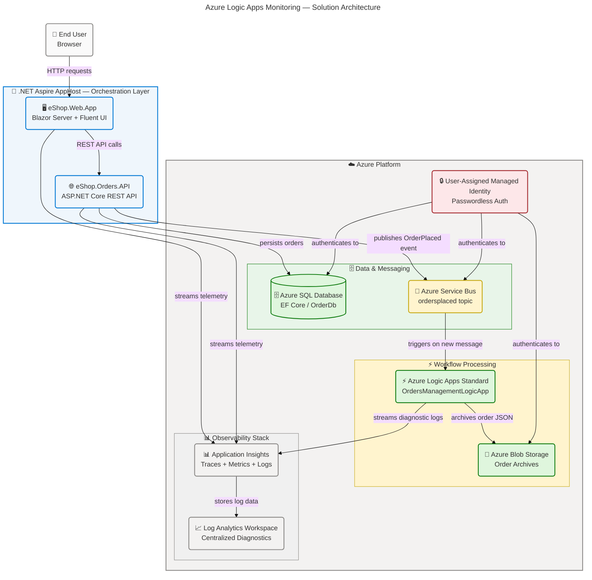

# Azure Logic Apps Monitoring

[](https://github.com/Evilazaro/Azure-LogicApps-Monitoring/actions/workflows/ci-dotnet.yml)
[](https://github.com/Evilazaro/Azure-LogicApps-Monitoring/actions/workflows/azure-dev.yml)
[](./LICENSE)
[](https://dotnet.microsoft.com/download/dotnet/10.0)
[](https://azure.microsoft.com/products/container-apps)

Cloud-native order management solution built on .NET Aspire v13, Azure Container Apps, and Azure Logic Apps Standard — demonstrating event-driven microservices with end-to-end OpenTelemetry observability, **zero-credential security**, and **full Infrastructure as Code** for production-grade Azure deployments.

## Table of Contents

- [Overview](#overview)
- [Features](#features)
- [Deployment](#deployment)
- [Requirements](#requirements)
- [Usage](#usage)
- [Configuration](#configuration)
- [Architecture](#architecture)
- [Contributing](#contributing)
- [License](#license)

## Overview

The **Azure Logic Apps Monitoring** solution is a cloud-native reference implementation of an event-driven order management platform for engineering teams and cloud architects who need to build, deploy, and monitor distributed applications on Azure. The solution combines .NET Aspire orchestration with Azure Container Apps, Azure SQL, Azure Service Bus, and Azure Logic Apps Standard to deliver a fully observable, serverless-ready order processing system with **no stored credentials**. It is structured as an Azure Developer CLI (`azd`) template, enabling one-command provisioning and deployment of the complete infrastructure.

Three independently deployable application units — a Blazor Server web front end (`eShop.Web.App`), an ASP.NET Core REST API (`eShop.Orders.API`), and an Azure Logic Apps Standard workflow (`OrdersManagementLogicApp`) — are wired together through .NET Aspire service discovery and Azure Service Bus event-driven messaging. **The entire infrastructure layer is declared in Bicep** with parameterized environments supporting `dev`, `test`, `staging`, and `prod` deployments from a single codebase.

> [!NOTE]
> This repository is an `azd` template. **A single `azd up` command provisions all Azure resources and deploys all services automatically, including SQL managed identity configuration.**

| 🏷️ Attribute          | 📋 Value                                                       |
| --------------------- | -------------------------------------------------------------- |
| 🖥️ Platform           | .NET Aspire v13, Azure Container Apps (Consumption)            |
| 💻 Language / Runtime | C# on .NET 10                                                  |
| ⚡ Workflow Engine    | Azure Logic Apps Standard (WorkflowStandard WS1)               |
| 🗄️ Data Store         | Azure SQL Database, General Purpose Gen5 2 vCores              |
| 📨 Messaging          | Azure Service Bus Standard — `ordersplaced` topic              |
| 📄 IaC Toolchain      | Azure Developer CLI (`azd`) + Azure Bicep                      |
| 📊 Observability      | OpenTelemetry → Application Insights + Log Analytics Workspace |
| 🛡️ Security           | User-Assigned Managed Identity + Entra ID-only auth            |

## Features

**Overview**

Azure Logic Apps Monitoring delivers a complete order-processing capability across three independently deployable application units, each contributing distinct business value. The solution was designed for teams that need a proven, production-ready reference for building event-driven microservices on Azure with built-in end-to-end observability and **zero stored credentials from the first deployment**.

> [!TIP]
> All features are fully operational from a single `azd up` command. Local development using the .NET Aspire dashboard automatically runs the Service Bus emulator and a SQL Server container — **no manual Azure resource setup is required during development**.

| ✨ Feature                   | 📋 Description                                                                                                                          | 📊 Status |
| ---------------------------- | --------------------------------------------------------------------------------------------------------------------------------------- | --------- |
| 🛒 Order Management REST API | ASP.NET Core API with `POST`, paginated `GET`, and `DELETE` endpoints for orders backed by Azure SQL via EF Core with retry-on-failure  | ✅ Stable |
| 🖥️ Blazor Server Web UI      | Microsoft Fluent UI–based web app for placing single and batch orders, listing all orders, and viewing order details                    | ✅ Stable |
| 📨 Event-Driven Messaging    | Orders published to the Azure Service Bus `ordersplaced` topic on placement; Logic App subscribes for downstream async processing       | ✅ Stable |
| ⚡ Logic Apps Workflow       | Azure Logic Apps Standard orchestrates post-order processing including blob archival to Azure Blob Storage                              | ✅ Stable |
| 📊 Distributed Observability | OpenTelemetry traces, metrics, and logs exported from all services to Application Insights and Log Analytics Workspace                  | ✅ Stable |
| 🛡️ Zero-Credential Security  | User-Assigned Managed Identity with Entra ID-only SQL auth — **no connection string secrets stored in source code or environment vars** | ✅ Stable |
| 🔁 Resilience Patterns       | HTTP retry, circuit breakers, and EF Core retry-on-failure **configured globally through the shared `app.ServiceDefaults` library**     | ✅ Stable |
| 🏗️ Infrastructure as Code    | Complete Azure environment provisioned via Bicep and `azd` with parameterized `dev`, `test`, `staging`, and `prod` environments         | ✅ Stable |
| 🔄 CI/CD Pipelines           | GitHub Actions workflows for CI (build, test, CodeQL security scan) and CD (provision + deploy) with **OIDC federated credentials**     | ✅ Stable |

## Deployment

**Overview**

Deployment uses Azure Developer CLI (`azd`) with Bicep templates to provision and deploy all resources to Azure Container Apps in a single command. **Post-provision lifecycle hooks (`hooks/postprovision.ps1`) automatically configure SQL managed identity, container registry authentication, and .NET user secrets for all projects.** Environments are parameterized — **use distinct `azd` environment names for `dev`, `test`, `staging`, and `prod`**.

> [!WARNING]
> **Ensure your Azure account has `Contributor` and `Role Based Access Control Administrator` permissions on the target subscription before running `azd up`.** The deployment uses Managed Identity RBAC assignments that require these roles.

> [!TIP]
> For local development without Azure, run **`dotnet run --project app.AppHost`** to start all services with the .NET Aspire dashboard. The Service Bus emulator and SQL Server container are started automatically by Aspire.

**Step 1 — Authenticate**

```bash
azd auth login
azd env new dev
azd up
```

**Step 2 - Create an Environment**

```bash
azd env new dev
```

**Step 3 - Provision and Deploy**

```bash
azd env up -e dev
```

**Expected Output:**

```text
Provisioning Azure resources (this may take 10–15 minutes)...
  (✓) Done: Resource group: rg-orders-dev-eastus2
  (✓) Done: Log Analytics Workspace
  (✓) Done: Application Insights
  (✓) Done: Azure SQL Server + Database
  (✓) Done: Azure Service Bus (ordersplaced topic)
  (✓) Done: Azure Container Apps Environment
  (✓) Done: Azure Logic Apps Standard
  (✓) Done: eShop.Orders.API — https://orders-api.<env>.azurecontainerapps.io
  (✓) Done: eShop.Web.App   — https://web-app.<env>.azurecontainerapps.io

Deployment complete. Open the web app URL above to get started.
```

**Step 4 — Teardown when done (optional):**

```bash
azd down --purge
```

**Expected Output:**

```text
  (✓) Done: Application resources deleted
  (✓) Done: Resource group removed
```

> [!IMPORTANT]
> The CI/CD pipeline in `.github/workflows/azure-dev.yml` automates this entire flow using OIDC federated credentials. **Set the `AZURE_CLIENT_ID`, `AZURE_TENANT_ID`, and `AZURE_SUBSCRIPTION_ID` repository variables and configure federated credentials using `hooks/configure-federated-credential.ps1` to enable automated deployments.**

## Requirements

**Overview**

Azure Logic Apps Monitoring targets .NET 10 and requires the Azure Developer CLI for cloud provisioning. The local development environment uses .NET Aspire to orchestrate all services — including a Service Bus emulator and SQL Server container — so **only Docker Desktop is required** alongside the CLI tools. All tooling is cross-platform and supported on Windows, macOS, and Linux.

> [!TIP]
> Run **`.\hooks\check-dev-workstation.ps1`** to automatically validate all required tools on your workstation before beginning. The script reports each requirement's status and provides install links for anything missing.

> [!IMPORTANT]
> **Docker Desktop must be running when you launch the .NET Aspire AppHost locally.** Aspire manages the Service Bus emulator and SQL Server containers automatically, but Docker must be available as the container runtime.

| 🛠️ Requirement         | 📋 Version | 🔗 Reference                                                                   | 🔍 Purpose                              |
| ---------------------- | ---------- | ------------------------------------------------------------------------------ | --------------------------------------- |
| ☁️ .NET SDK            | ≥ 10.0.100 | https://dotnet.microsoft.com/download/dotnet/10.0                              | Build and run all projects              |
| 🔧 Azure Developer CLI | ≥ 1.11.0   | https://learn.microsoft.com/azure/developer/azure-developer-cli/install-azd    | Provision, deploy, and manage lifecycle |
| 🌐 Azure CLI           | ≥ 2.60.0   | https://learn.microsoft.com/cli/azure/install-azure-cli                        | Azure resource management and auth      |
| 📦 Bicep CLI           | ≥ 0.30.0   | https://learn.microsoft.com/azure/azure-resource-manager/bicep/install         | Compile and validate Bicep templates    |
| 🐳 Docker Desktop      | ≥ 4.0      | https://www.docker.com/products/docker-desktop                                 | Container runtime for local services    |
| ⚡ PowerShell          | ≥ 7.0      | https://learn.microsoft.com/powershell/scripting/install/installing-powershell | Lifecycle hook scripts                  |
| 🔑 Azure Subscription  | Active     | https://azure.microsoft.com/free                                               | Target for resource provisioning        |

## Usage

**Overview**

The primary interface for day-to-day usage is the Blazor Server web application, which provides a Fluent UI dashboard for placing individual or batch orders, listing all orders with details, and generating orders at scale for testing. The REST API is also directly accessible via Swagger UI and `curl` — useful for API consumers and automated testing.

**Place a single order via the API:**

```bash
curl -X POST https://localhost:7001/api/orders \
  -H "Content-Type: application/json" \
  -d '{
    "id": "ORD-001",
    "customerId": "CUST-001",
    "deliveryAddress": "123 Main Street, Seattle, WA 98101",
    "total": 59.99,
    "products": [
      { "id": "PROD-001", "name": "Widget", "quantity": 2, "price": 29.99 }
    ]
  }'
```

**Expected Output:**

```json
{
  "id": "ORD-001",
  "customerId": "CUST-001",
  "date": "2026-04-14T00:00:00Z",
  "deliveryAddress": "123 Main Street, Seattle, WA 98101",
  "total": 59.99
}
```

**Retrieve all orders with pagination:**

```bash
curl "https://localhost:7001/api/orders?pageNumber=1&pageSize=20"
```

**Expected Output:**

```json
{
  "orders": [{ "id": "ORD-001", "customerId": "CUST-001", "total": 59.99 }],
  "totalCount": 1,
  "pageNumber": 1,
  "pageSize": 20
}
```

**Generate a batch of sample orders for load testing:**

```powershell
.\hooks\Generate-Orders.ps1 -Count 50 -ApiBaseUrl https://localhost:7001
```

**Expected Output:**

```text
Generating 50 orders...
[50/50] Orders submitted successfully.
```

**Run the test suite:**

```bash
dotnet test
```

**Expected Output:**

```text
Passed! - Failed: 0, Passed: N, Skipped: 0, Total: N
```

**Browse the Swagger UI** (local development): navigate to `https://localhost:7001/swagger` to explore all API endpoints interactively.

**Open the .NET Aspire dashboard** (local development): run `dotnet run --project app.AppHost` and navigate to `https://localhost:15888` to view service health, traces, and logs.

## Configuration

**Overview**

Configuration follows the ASP.NET Core hierarchical model: `appsettings.json` contains safe defaults, `appsettings.Development.json` overrides for local development, and per-project user secrets hold Azure credentials for local Azure connectivity. All sensitive configuration is injected at runtime via .NET Aspire service binding or Entra ID Managed Identity — **no secrets are stored in source control.** The `hooks/postprovision.ps1` script populates all user secrets automatically after `azd provision`.

| ⚙️ Parameter                               | 📋 Description                                          | 🔍 Default             | ❓ Required |
| ------------------------------------------ | ------------------------------------------------------- | ---------------------- | ----------- |
| 📁 `Azure:TenantId`                        | Azure AD tenant ID for local development authentication | —                      | Dev only    |
| 🔑 `Azure:ClientId`                        | Service principal client ID for local dev               | —                      | Dev only    |
| 🌍 `Azure:ResourceGroup`                   | Target Azure resource group name                        | —                      | Azure only  |
| ☁️ `Azure:AllowResourceGroupCreation`      | Allow `azd` to auto-create the resource group           | `false`                | No          |
| 📨 `Azure:ServiceBus:HostName`             | Service Bus namespace hostname                          | `localhost` (emulator) | Azure only  |
| 📨 `Azure:ServiceBus:TopicName`            | Service Bus topic for published order events            | `ordersplaced`         | No          |
| 🗄️ `ConnectionStrings:OrderDb`             | SQL Server connection string (injected by Aspire)       | —                      | Yes         |
| 📊 `APPLICATIONINSIGHTS_CONNECTION_STRING` | Application Insights telemetry connection string        | —                      | Azure only  |
| ⚙️ `HttpClient:OrdersAPIService:Timeout`   | Total HTTP client timeout for Orders API calls          | `00:02:00`             | No          |

**Sample user secrets structure** (populated by `hooks/postprovision.ps1`):

```json
{
  "Azure:TenantId": "<tenant-id>",
  "Azure:ClientId": "<client-id>",
  "Azure:ResourceGroup": "<resource-group-name>",
  "ConnectionStrings:OrderDb": "Server=<sql-host>;Database=OrderDb;Authentication=Active Directory Default;"
}
```

> [!NOTE]
> User secrets are set per-project via `dotnet user-secrets set`. **Run `.\hooks\postprovision.ps1` after running `azd provision`** to configure all project secrets automatically instead of setting them manually.

## Architecture

**Overview**

The solution implements a three-tier event-driven microservices architecture orchestrated by .NET Aspire. The Blazor Server web front end communicates synchronously with the Orders API, which persists orders to Azure SQL and publishes events to Azure Service Bus. An Azure Logic Apps Standard workflow subscribes downstream to archive and process orders asynchronously. All services export OpenTelemetry telemetry to Application Insights, and the entire environment is deployed to Azure Container Apps via Bicep and `azd`. **A User-Assigned Managed Identity provides passwordless authentication for all service-to-service communication.**


```mermaid
---
title: "Azure Logic Apps Monitoring — Solution Architecture"
config:
  theme: base
  look: classic
  layout: dagre
  flowchart:
    htmlLabels: true
---
flowchart TB
    accTitle: Azure Logic Apps Monitoring Solution Architecture
    accDescr: Three-tier event-driven architecture with Blazor Server frontend and ASP.NET Core Orders API backed by Azure SQL, publishing events to Azure Service Bus which triggers an Azure Logic Apps Standard workflow for async processing, with OpenTelemetry telemetry flowing to Application Insights and Log Analytics.

    %% ═══════════════════════════════════════════════════════════════════════════
    %% AZURE / FLUENT ARCHITECTURE PATTERN v2.0
    %% (Semantic + Structural + Font + Accessibility Governance)
    %% ═══════════════════════════════════════════════════════════════════════════
    %% PHASE 1 - FLUENT UI: All styling uses approved Fluent UI palette only
    %% PHASE 2 - GROUPS: Every subgraph has semantic color via style directive
    %% PHASE 3 - COMPONENTS: Every node has semantic classDef + icon prefix
    %% PHASE 4 - ACCESSIBILITY: accTitle/accDescr present, WCAG AA contrast
    %% PHASE 5 - STANDARD: Governance block present, classDefs centralized
    %% ═══════════════════════════════════════════════════════════════════════════

    User("👤 End User<br/>Browser"):::neutral

    subgraph aspire["🔷 .NET Aspire AppHost — Orchestration Layer"]
        direction TB
        WebApp("🖥️ eShop.Web.App<br/>Blazor Server + Fluent UI"):::core
        OrdersAPI("🌐 eShop.Orders.API<br/>ASP.NET Core REST API"):::core
    end

    subgraph azure["☁️ Azure Platform"]
        direction TB
        subgraph data["🗄️ Data & Messaging"]
            direction TB
            SqlDb[("🗄️ Azure SQL Database<br/>EF Core / OrderDb")]:::data
            ServiceBus("📨 Azure Service Bus<br/>ordersplaced topic"):::messaging
        end
        subgraph workflow["⚡ Workflow Processing"]
            direction TB
            LogicApp("⚡ Azure Logic Apps Standard<br/>OrdersManagementLogicApp"):::success
            BlobStorage("💾 Azure Blob Storage<br/>Order Archives"):::data
        end
        subgraph observability["📊 Observability Stack"]
            direction TB
            AppInsights("📊 Application Insights<br/>Traces + Metrics + Logs"):::monitoring
            LogAnalytics("📈 Log Analytics Workspace<br/>Centralized Diagnostics"):::monitoring
        end
        UAMI("🔒 User-Assigned Managed Identity<br/>Passwordless Auth"):::security
    end

    User -->|"HTTP requests"| WebApp
    WebApp -->|"REST API calls"| OrdersAPI
    OrdersAPI -->|"persists orders"| SqlDb
    OrdersAPI -->|"publishes OrderPlaced event"| ServiceBus
    ServiceBus -->|"triggers on new message"| LogicApp
    LogicApp -->|"archives order JSON"| BlobStorage
    WebApp -->|"streams telemetry"| AppInsights
    OrdersAPI -->|"streams telemetry"| AppInsights
    LogicApp -->|"streams diagnostic logs"| AppInsights
    AppInsights -->|"stores log data"| LogAnalytics
    UAMI -->|"authenticates to"| SqlDb
    UAMI -->|"authenticates to"| ServiceBus
    UAMI -->|"authenticates to"| BlobStorage

    style aspire fill:#EFF6FC,stroke:#0078D4,stroke-width:2px,color:#323130
    style azure fill:#F3F2F1,stroke:#8A8886,stroke-width:2px,color:#323130
    style data fill:#E8F5E9,stroke:#107C10,stroke-width:1px,color:#323130
    style workflow fill:#FFF4CE,stroke:#C7A914,stroke-width:1px,color:#323130
    style observability fill:#F0F0F0,stroke:#8A8886,stroke-width:1px,color:#323130

    %% Centralized semantic classDefs (Phase 5 compliant)
    classDef core fill:#EFF6FC,stroke:#0078D4,stroke-width:2px,color:#323130
    classDef success fill:#DFF6DD,stroke:#107C10,stroke-width:2px,color:#323130
    classDef data fill:#DFF6DD,stroke:#107C10,stroke-width:2px,color:#323130
    classDef messaging fill:#FFF4CE,stroke:#C7A914,stroke-width:2px,color:#323130
    classDef monitoring fill:#F3F2F1,stroke:#8A8886,stroke-width:2px,color:#323130
    classDef security fill:#FDE7E9,stroke:#A4262C,stroke-width:2px,color:#323130
    classDef neutral fill:#FAFAFA,stroke:#8A8886,stroke-width:2px,color:#323130
```

**Component Roles:**

| 🏗️ Component                  | 📋 Responsibility                                            | 📁 Source                     |
| ----------------------------- | ------------------------------------------------------------ | ----------------------------- |
| 🔷 `.NET Aspire AppHost`      | Orchestrates all services for local and cloud deployment     | `app.AppHost/AppHost.cs`      |
| 🌐 `eShop.Orders.API`         | REST API for order CRUD operations and Service Bus publisher | `src/eShop.Orders.API/`       |
| 🖥️ `eShop.Web.App`            | Blazor Server frontend with Fluent UI and typed HTTP client  | `src/eShop.Web.App/`          |
| ⚡ `OrdersManagementLogicApp` | Logic Apps Standard for async downstream order processing    | `workflows/OrdersManagement/` |
| 🔧 `app.ServiceDefaults`      | Shared OpenTelemetry, health checks, and resilience library  | `app.ServiceDefaults/`        |
| 📄 Infrastructure (Bicep)     | Full Azure environment declared as parameterized IaC         | `infra/`                      |

## Contributing

**Overview**

Contributions to Azure Logic Apps Monitoring are welcome. The project follows standard GitHub Flow — fork the repository, create a feature branch, implement changes, and submit a pull request targeting `main`. **All pull requests must pass the full CI pipeline (build, test, and CodeQL security scan) before merging.** The pre-provisioning script validates workstation prerequisites before any infrastructure changes are attempted.

> [!IMPORTANT]
> **Run `.\hooks\preprovision.ps1 -ValidateOnly` before making infrastructure changes** to ensure your environment meets all prerequisites. **Infrastructure Bicep changes require `Contributor` and `Role Based Access Control Administrator` roles** on your Azure subscription.

1. Fork the repository on GitHub.
2. Clone your fork: `git clone https://github.com/<your-username>/Azure-LogicApps-Monitoring.git`
3. Create a feature branch: `git checkout -b feature/your-feature-name`
4. Make changes and validate: `dotnet build` and `dotnet test`
5. Push and open a pull request targeting `main`.

> [!NOTE]
> The project enforces code formatting via `.editorconfig`. **Run `dotnet format` before committing** to ensure the formatting check in CI passes. The CI pipeline runs on Ubuntu, Windows, and macOS — **ensure your changes are cross-platform compatible**.

## License

[MIT License](./LICENSE) — Created by **Evilazaro Alves | Principal Cloud Solution Architect | Cloud Platforms and AI Apps | Microsoft**.
