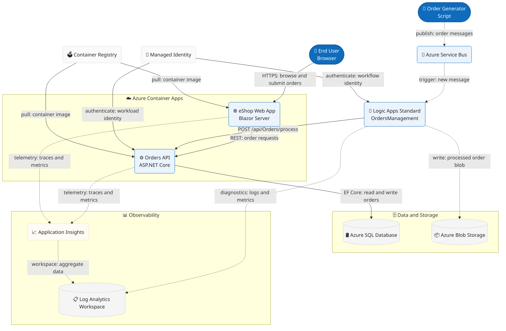

# Azure Logic Apps Monitoring

[](https://github.com/Evilazaro/Azure-LogicApps-Monitoring/actions/workflows/azure-dev.yml)
[](https://github.com/Evilazaro/Azure-LogicApps-Monitoring/actions/workflows/ci-dotnet.yml)
[](LICENSE)
[](https://dotnet.microsoft.com/download/dotnet/10.0)

**Azure Logic Apps Monitoring** is a reference implementation that demonstrates end-to-end order processing with full observability using Azure Logic Apps Standard, .NET Aspire, and Azure Application Insights. The solution orchestrates an e-commerce order workflow, from browser submission through automated processing, while capturing distributed traces, metrics, and logs across all components.

The solution addresses the challenge of monitoring and troubleshooting distributed workflows in Azure. Without centralized observability, diagnosing failures across Logic Apps, microservices, messaging, and databases requires navigating multiple disconnected tools. This repository solves that problem by wiring Application Insights and Log Analytics into every layer of the stack, enabling engineers to trace a single order from browser submission through Service Bus into Logic Apps and the SQL database—all in one place.

The technology stack centers on **.NET 10** with ASP.NET Core and Blazor Server for the application tier, Azure Logic Apps Standard for workflow automation, .NET Aspire for local orchestration and cloud deployment to Azure Container Apps, and Bicep for Infrastructure as Code. OpenTelemetry provides vendor-neutral distributed tracing that feeds into Application Insights and a shared Log Analytics workspace.

## Table of Contents

- [Features](#features)
- [Architecture](#architecture)
- [Technologies Used](#technologies-used)
- [Quick Start](#quick-start)
- [Configuration](#configuration)
- [Deployment](#deployment)
- [Usage](#usage)
- [Contributing](#contributing)
- [License](#license)

## Features

- 🛒 **Blazor Server frontend** for placing, viewing, and managing e-commerce orders with Microsoft Fluent UI components
- ⚙️ **ASP.NET Core REST API** (`eShop.Orders.API`) with full CRUD endpoints and OpenAPI documentation
- 🔀 **Azure Logic Apps Standard workflows** for asynchronous order processing (`OrdersPlacedProcess`) and completion sweeping (`OrdersPlacedCompleteProcess`)
- 📨 **Azure Service Bus** integration for reliable, decoupled message delivery between order sources and Logic Apps workflows
- 🛢️ **Azure SQL Database** persistence via Entity Framework Core with retry-on-failure and command-timeout policies
- 📦 **Azure Blob Storage** archiving of successfully processed and erroneously processed orders in separate containers
- 📈 **Application Insights** telemetry with OpenTelemetry distributed tracing across all microservices
- 📋 **Log Analytics Workspace** for centralized, KQL-queryable log and metrics aggregation
- 🔑 **User-assigned Managed Identity** for credential-free authentication across all Azure service connections
- ☁️ **One-command deployment** to Azure Container Apps using Azure Developer CLI (`azd up`)
- 🧪 **Order generator script** (`hooks/Generate-Orders.ps1`) for simulating high-volume order scenarios with randomized test data
- 🔒 **Virtual network isolation** with private endpoints for data services and subnet-level workload separation
- 🚀 **GitHub Actions CI/CD** with OIDC federated credentials, CodeQL security scanning, and cross-platform test coverage

## Architecture

The system has two primary actors: an **End User** who interacts through a browser, and an **Order Generator Script** that simulates bulk order publishing to Azure Service Bus. The End User submits and views orders through the Blazor Web App, which calls the Orders API, which persists data to Azure SQL Database. Concurrently, the Order Generator publishes messages to Azure Service Bus, which triggers the Logic Apps Standard `OrdersPlacedProcess` workflow. That workflow calls the Orders API to process each order and archives the result—success or error—to Azure Blob Storage. The `OrdersPlacedCompleteProcess` workflow runs on a recurrence trigger to sweep the success archive. All application components emit telemetry to Application Insights, which forwards workspace-based data to a shared Log Analytics Workspace. A User-assigned Managed Identity provides credential-free authentication for the Orders API and all Logic Apps service connections.


```mermaid
---
config:
  primaryColor: "#0f6cbd"
  primaryTextColor: "#FFFFFF"
  primaryBorderColor: "#0f548c"
  secondaryColor: "#ebf3fc"
  secondaryTextColor: "#242424"
  secondaryBorderColor: "#0f6cbd"
  tertiaryColor: "#f5f5f5"
  tertiaryTextColor: "#424242"
  tertiaryBorderColor: "#d1d1d1"
  noteBkgColor: "#fefbf4"
  noteTextColor: "#242424"
  noteBorderColor: "#f9e2ae"
  lineColor: "#616161"
  background: "#FFFFFF"
  edgeLabelBackground: "#FFFFFF"
  clusterBkg: "#fafafa"
  clusterBorder: "#e0e0e0"
  titleColor: "#242424"
  errorBkgColor: "#fdf3f4"
  errorTextColor: "#b10e1c"
  fontFamily: "'Segoe UI', Verdana, sans-serif"
  fontSize: 16px
  description: "High-level architecture diagram showing actors, primary flows, and major components."
---
flowchart TB

%% ── Actors ──────────────────────────────────────────────────────────────────
Browser(["👤 End User<br/>Browser"])
OrderGen(["🔧 Order Generator<br/>Script"])

%% ── Application Layer – Azure Container Apps ─────────────────────────────────
subgraph ContainerApps ["☁️ Azure Container Apps"]
    direction TB
    WebApp("🌐 eShop Web App<br/>Blazor Server")
    OrdersAPI("⚙️ Orders API<br/>ASP.NET Core")
end

%% ── Workflow and Messaging Layer ─────────────────────────────────────────────
ServiceBus("📨 Azure Service Bus")
LogicApp("🔀 Logic Apps Standard<br/>OrdersManagement")

%% ── Data and Storage Layer ───────────────────────────────────────────────────
subgraph DataLayer ["🗄️ Data and Storage"]
    direction TB
    SqlDB[("🛢️ Azure SQL Database")]
    BlobStorage[("📦 Azure Blob Storage")]
end

%% ── Observability Layer ──────────────────────────────────────────────────────
subgraph ObsLayer ["📊 Observability"]
    direction TB
    AppInsights("📈 Application Insights")
    LogAnalytics[("📋 Log Analytics Workspace")]
end

%% ── Infrastructure ───────────────────────────────────────────────────────────
Identity("🔑 Managed Identity")
ACR("🗳️ Container Registry")

%% ── User Interaction Flow ────────────────────────────────────────────────────
Browser -->|"HTTPS: browse and submit orders"| WebApp
WebApp -->|"REST: order requests"| OrdersAPI
OrdersAPI -->|"EF Core: read and write orders"| SqlDB

%% ── Async Order Processing Flow ──────────────────────────────────────────────
OrderGen -.->|"publish: order messages"| ServiceBus
ServiceBus -.->|"trigger: new message"| LogicApp
LogicApp -->|"POST /api/Orders/process"| OrdersAPI
LogicApp -.->|"write: processed order blob"| BlobStorage

%% ── Authentication ───────────────────────────────────────────────────────────
Identity -->|"authenticate: workload identity"| OrdersAPI
Identity -->|"authenticate: workflow identity"| LogicApp

%% ── Container Delivery ───────────────────────────────────────────────────────
ACR -->|"pull: container image"| WebApp
ACR -->|"pull: container image"| OrdersAPI

%% ── Observability Flows ──────────────────────────────────────────────────────
OrdersAPI -.->|"telemetry: traces and metrics"| AppInsights
WebApp -.->|"telemetry: traces and metrics"| AppInsights
LogicApp -.->|"diagnostics: logs and metrics"| LogAnalytics
AppInsights -.->|"workspace: aggregate data"| LogAnalytics

%% ── Class Definitions ────────────────────────────────────────────────────────
classDef actor fill:#0f6cbd,stroke:#0f548c,color:#FFFFFF
classDef service fill:#ebf3fc,stroke:#0f6cbd,color:#242424
classDef datastore fill:#f5f5f5,stroke:#d1d1d1,color:#242424
classDef monitoring fill:#fefbf4,stroke:#f9e2ae,color:#242424
classDef infra fill:#fafafa,stroke:#e0e0e0,color:#242424

class Browser,OrderGen actor
class WebApp,OrdersAPI,LogicApp,ServiceBus service
class SqlDB,BlobStorage datastore
class AppInsights monitoring
class LogAnalytics datastore
class Identity,ACR infra
```

## Technologies Used

| Technology                  | Type          | Purpose                                                               |
| --------------------------- | ------------- | --------------------------------------------------------------------- |
| .NET 10                     | Runtime       | Application execution platform for all services                       |
| ASP.NET Core                | Framework     | REST API server with routing, middleware, and health checks           |
| Blazor Server               | Framework     | Interactive server-side-rendered order management UI                  |
| .NET Aspire                 | Orchestration | Local development orchestration and cloud deployment wiring           |
| Entity Framework Core       | ORM           | Azure SQL Database access with retry-on-failure and timeout policies  |
| Microsoft Fluent UI         | UI Library    | Fluent Design System components for the Blazor frontend               |
| Azure Logic Apps Standard   | Service       | Asynchronous order processing and completion sweep workflows          |
| Azure Service Bus           | Service       | Decoupled messaging between order sources and Logic Apps workflows    |
| Azure SQL Database          | Database      | Persistent relational storage for order records                       |
| Azure Blob Storage          | Storage       | Archive of successfully and erroneously processed orders              |
| Azure Container Apps        | Hosting       | Serverless container hosting for microservices                        |
| Azure Container Registry    | Registry      | Private container image repository                                    |
| Application Insights        | Monitoring    | Application-level telemetry, tracing, and performance monitoring      |
| Log Analytics Workspace     | Monitoring    | Centralized log aggregation and KQL-queryable data store              |
| Bicep                       | IaC           | Declarative Azure infrastructure provisioning                         |
| Azure Developer CLI (`azd`) | Tooling       | Single-command provisioning and deployment automation                 |
| GitHub Actions              | CI/CD         | Automated build, test, CodeQL security scanning, and deployment       |
| OpenTelemetry               | Observability | Vendor-neutral distributed tracing instrumentation                    |
| PowerShell 7                | Scripting     | Pre/post-provision lifecycle hooks and workstation validation tooling |

## Quick Start

### Prerequisites

| Prerequisite                                                                                       | Minimum Version | Purpose                                      |
| -------------------------------------------------------------------------------------------------- | --------------- | -------------------------------------------- |
| [.NET SDK](https://dotnet.microsoft.com/download/dotnet/10.0)                                      | 10.0.100        | Build and run all .NET projects              |
| [Azure Developer CLI](https://learn.microsoft.com/azure/developer/azure-developer-cli/install-azd) | 1.11.0          | Provision and deploy to Azure                |
| [Azure CLI](https://learn.microsoft.com/cli/azure/install-azure-cli)                               | 2.60.0          | Azure resource management and authentication |
| [Docker Desktop](https://www.docker.com/products/docker-desktop/)                                  | Latest          | Container build for local development        |
| [PowerShell](https://learn.microsoft.com/powershell/scripting/install/installing-powershell)       | 7.0             | Lifecycle hook scripts                       |

> [!NOTE]
> Run `hooks/check-dev-workstation.ps1` to validate all prerequisites before starting. The script checks tool versions and Azure authentication status without making any changes to your environment.

### Installation

1. Clone the repository and navigate to the root directory:

   ```bash
   git clone https://github.com/Evilazaro/Azure-LogicApps-Monitoring.git
   cd Azure-LogicApps-Monitoring
   ```

2. Authenticate with Azure using the Azure Developer CLI:

   ```bash
   azd auth login
   ```

3. Create a new `azd` environment:

   ```bash
   azd env new dev
   ```

4. Set the target Azure region:

   ```bash
   azd env set AZURE_LOCATION eastus2
   ```

5. Provision all Azure infrastructure and deploy all services in one step:

   ```bash
   azd up
   ```

> [!TIP]
> Run `hooks/check-dev-workstation.ps1 -Verbose` for detailed prerequisite diagnostics before executing `azd up`.

### Minimal Working Example

After `azd up` completes, the post-provision script (`hooks/postprovision.ps1`) configures all user secrets automatically. Run the full solution locally using .NET Aspire:

```bash
dotnet run --project app.AppHost/app.AppHost.csproj
```

The .NET Aspire dashboard opens at `https://localhost:15888`. Select the `web-app` resource to open the eShop frontend, where you can place and view orders interactively.

## Configuration

Manage all environment-specific values through `azd` environment variables (set with `azd env set <OPTION> <VALUE>`) and .NET user secrets (configured automatically by `hooks/postprovision.ps1`).

| Option                      | Default   | Description                                                                               |
| --------------------------- | --------- | ----------------------------------------------------------------------------------------- |
| `AZURE_LOCATION`            | `eastus2` | Azure region for all provisioned resources                                                |
| `AZURE_ENV_NAME`            | `dev`     | Environment name appended to all resource names                                           |
| `DEPLOY_HEALTH_MODEL`       | `true`    | Deploy Azure Monitor Health Model (set to `false` when using a service principal)         |
| `DEPLOYER_PRINCIPAL_TYPE`   | `User`    | Set to `ServicePrincipal` when deploying from CI/CD pipelines                             |
| `Azure:TenantId`            | _(none)_  | Azure AD tenant ID; configured as a user secret for local development                     |
| `Azure:ClientId`            | _(none)_  | Service principal client ID; configured as a user secret for local development            |
| `Azure:ResourceGroup`       | _(none)_  | Existing resource group name; required when `Azure:AllowResourceGroupCreation` is `false` |
| `Azure:ServiceBus:HostName` | _(none)_  | Fully-qualified Service Bus namespace hostname (set automatically post-provision)         |
| `ConnectionStrings:OrderDb` | _(none)_  | SQL Server connection string (set automatically post-provision via user secrets)          |

> [!IMPORTANT]
> Set `DEPLOYER_PRINCIPAL_TYPE` to `ServicePrincipal` when running from GitHub Actions. Leaving it as `User` in a pipeline causes the Azure Monitor Health Model deployment to fail because it requires tenant-level permissions that a service principal does not have by default.

Example: configure a staging environment with the Health Model disabled:

```bash
azd env set AZURE_ENV_NAME staging
azd env set AZURE_LOCATION westus2
azd env set DEPLOY_HEALTH_MODEL false
azd env set DEPLOYER_PRINCIPAL_TYPE ServicePrincipal
```

> [!NOTE]
> For detailed information about the Azure SQL Database schema and Entity Framework Core migration steps, see [MIGRATION_GUIDE.md](src/eShop.Orders.API/MIGRATION_GUIDE.md).

## Deployment

### Deploy to Azure with Azure Developer CLI

1. Validate all prerequisites on your workstation:

   ```powershell
   .\hooks\check-dev-workstation.ps1
   ```

2. Authenticate the Azure Developer CLI and Azure CLI:

   ```bash
   azd auth login
   az login
   ```

3. Create and configure the target environment:

   ```bash
   azd env new <environment-name>
   azd env set AZURE_LOCATION <azure-region>
   azd env set DEPLOYER_PRINCIPAL_TYPE User
   ```

4. Provision all Azure infrastructure (networking, identity, monitoring, SQL, Service Bus, Container Apps, Logic Apps):

   ```bash
   azd provision
   ```

5. Deploy all application services to Azure Container Apps:

   ```bash
   azd deploy
   ```

6. Verify deployment by navigating to the Container Apps URL printed at the end of `azd deploy` output.

### Set Up CI/CD with GitHub Actions

1. Configure a federated credential for OIDC authentication:

   ```powershell
   .\hooks\configure-federated-credential.ps1
   ```

2. Set the following GitHub repository variables in **Settings → Secrets and variables → Actions**:

   ```
   AZURE_CLIENT_ID        — Application registration client ID
   AZURE_TENANT_ID        — Azure AD tenant ID
   AZURE_SUBSCRIPTION_ID  — Target Azure subscription ID
   ```

3. Push to the `main` branch to trigger the `azure-dev.yml` workflow, which provisions infrastructure, configures the SQL managed identity user, and deploys the application automatically.

> [!WARNING]
> The GitHub Actions workflow uses OIDC federated credentials. Do not store Azure credentials as encrypted GitHub Secrets. Configure federated identity credentials as documented in `hooks/configure-federated-credential.ps1` to avoid storing long-lived secrets.

## Usage

### Place an Order via the REST API

Send a `POST` request to create a new order:

```bash
curl -X POST https://<orders-api-url>/api/Orders \
  -H "Content-Type: application/json" \
  -d '{
    "id": "ORD-001",
    "customerId": "CUST-42",
    "deliveryAddress": "123 Main St, Seattle, WA 98101, USA",
    "products": [
      {
        "name": "Wireless Headphones",
        "quantity": 1,
        "unitPrice": 149.99
      }
    ]
  }'
```

Expected response (`201 Created`):

```json
{
  "id": "ORD-001",
  "customerId": "CUST-42",
  "date": "2026-04-28T00:00:00Z",
  "deliveryAddress": "123 Main St, Seattle, WA 98101, USA",
  "products": [
    {
      "name": "Wireless Headphones",
      "quantity": 1,
      "unitPrice": 149.99
    }
  ],
  "totalAmount": 149.99
}
```

### Retrieve All Orders

```bash
curl https://<orders-api-url>/api/Orders \
  -H "Accept: application/json"
```

### Generate Bulk Test Orders

Use the provided PowerShell script to generate a JSON batch of randomized test orders for load testing or demonstration:

```powershell
.\hooks\Generate-Orders.ps1 -OrderCount 100 -MinProducts 1 -MaxProducts 4
```

The script writes the generated orders to `infra/data/ordersBatch.json`, which is compatible with the Azure Logic Apps workflow trigger format. Use the generated file to simulate Service Bus messages and exercise the `OrdersPlacedProcess` workflow end-to-end.

> [!TIP]
> Use `-WhatIf` to preview the generated order count and output path without writing any data to disk: `.\hooks\Generate-Orders.ps1 -OrderCount 10 -WhatIf`

### Monitor Workflows in Application Insights

After deploying and processing orders, query telemetry in Application Insights using KQL to analyze order-processing performance:

```kql
requests
| where cloud_RoleName == "orders-api"
| summarize requestCount = count(), avgDurationMs = avg(duration) by name
| order by requestCount desc
```

To inspect Logic Apps workflow run history and failures, query the Log Analytics Workspace:

```kql
AzureDiagnostics
| where ResourceType == "WORKFLOWS/RUNS"
| where status_s == "Failed"
| project TimeGenerated, workflowName_s, status_s, error_message_s
| order by TimeGenerated desc
```

## Contributing

Contributions are welcome. To report a bug or request a feature, open an issue in the [GitHub repository](https://github.com/Evilazaro/Azure-LogicApps-Monitoring/issues) with a clear description of the problem and any relevant context such as error messages, environment details, and reproduction steps.

To submit a code change:

1. Fork the repository and create a branch from `main` using a descriptive name (for example, `feature/order-retry-policy`).
2. Make your changes, add or update tests, and verify that all existing tests pass:

   ```bash
   dotnet test
   ```

3. Ensure code formatting compliance is maintained against the `.editorconfig` rules before opening a pull request.
4. Open a pull request against the `main` branch with a clear title and description explaining what the change does and why it is needed.

All pull requests are validated by the CI pipeline (build, cross-platform test, and CodeQL security scan) before they are eligible for merge.

## License

This project is licensed under the **MIT License**. See the [LICENSE](LICENSE) file for full terms.

Created by Evilazaro Alves | Principal Cloud Solution Architect | Cloud Platforms and AI Apps | Microsoft.
