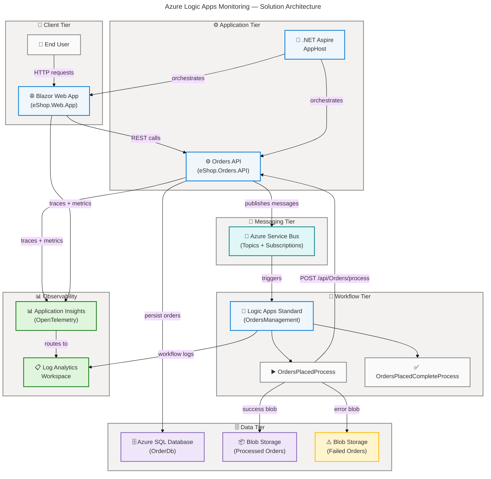

# Azure Logic Apps Monitoring

[](https://dotnet.microsoft.com)
[](https://azure.microsoft.com)
[](https://learn.microsoft.com/azure/logic-apps/)
[](https://learn.microsoft.com/dotnet/aspire/)
[](https://learn.microsoft.com/azure/azure-resource-manager/bicep/)
[](LICENSE)
[](https://learn.microsoft.com/azure/developer/azure-developer-cli/)

## Overview

**Overview**

The Azure Logic Apps Monitoring solution is a production-ready, cloud-native reference architecture that demonstrates how to build, monitor, and operate event-driven order management workflows on Azure. It combines the orchestration power of **.NET Aspire**, the workflow automation of **Azure Logic Apps Standard**, and enterprise-grade observability through **Application Insights** and **Log Analytics** — all deployed as Infrastructure-as-Code using **Bicep** and **Azure Developer CLI (azd)**.

This solution provides development teams and architects with a fully working end-to-end example of an order management platform: from accepting orders through a REST API and Blazor web frontend, dispatching them via **Azure Service Bus**, processing them with **Logic Apps Standard** workflows, and persisting results to **Azure SQL Database** and **Azure Blob Storage**. Every component is monitored with distributed tracing via **OpenTelemetry**, making it observable from development through production.

> [!NOTE]
> This repository is structured as an `azd` template. Running `azd up` from a configured Azure environment provisions all infrastructure and deploys all services end-to-end without manual steps.

> [!TIP]
> For local development without Azure services, the solution runs entirely using the **.NET Aspire Developer Dashboard** with an Azure Service Bus emulator. Only an Azure subscription and authenticated CLI session are required for cloud deployment.

## Table of Contents

- [Overview](#overview)
- [Architecture](#architecture)
- [Features](#features)
- [Requirements](#requirements)
- [Quick Start](#quick-start)
- [Deployment](#deployment)
- [Usage](#usage)
- [Configuration](#configuration)
- [Contributing](#contributing)
- [License](#license)

## Architecture

**Overview**

The solution follows a layered event-driven architecture with clear separation between the web frontend, backend API, message-driven workflow processing, and shared infrastructure. The **.NET Aspire AppHost** acts as the orchestration entry point for both local development and Azure Container Apps deployment, wiring together service discovery, health checks, and environment-specific configuration automatically.

At the core of the monitoring story, **Azure Logic Apps Standard** workflows consume Service Bus messages, call back into the Orders API, and route the processed payloads to Azure Blob Storage — either to a success container or an error container — depending on the HTTP response code. All I/O, telemetry, and workflow runs are captured in the connected **Application Insights** and **Log Analytics** workspace, giving operators a single pane of glass for the entire solution.


```mermaid
---
title: "Azure Logic Apps Monitoring — Solution Architecture"
config:
  theme: base
  look: classic
  layout: dagre
  flowchart:
    htmlLabels: true
---
flowchart TB
    accTitle: Azure Logic Apps Monitoring Solution Architecture
    accDescr: End-to-end architecture showing user requests flowing through Blazor Web App and Orders API, dispatched to Azure Service Bus, processed by Logic Apps Standard workflows, and persisted in Azure SQL and Blob Storage, with monitoring via Application Insights and Log Analytics.

    %% ═══════════════════════════════════════════════════════════════════════════
    %% AZURE / FLUENT ARCHITECTURE PATTERN v1.1
    %% (Semantic + Structural + Font + Accessibility Governance)
    %% ═══════════════════════════════════════════════════════════════════════════
    %% PHASE 1 - FLUENT UI: All styling uses approved Fluent UI palette only
    %% PHASE 2 - GROUPS: Every subgraph has semantic color via style directive
    %% PHASE 3 - COMPONENTS: Every node has semantic classDef + icon prefix
    %% PHASE 4 - ACCESSIBILITY: accTitle/accDescr present, WCAG AA contrast
    %% PHASE 5 - STANDARD: Governance block present, classDefs centralized
    %% ═══════════════════════════════════════════════════════════════════════════

    subgraph clients["👥 Client Tier"]
        direction LR
        user["👤 End User"]:::neutral
        webapp["🌐 Blazor Web App\n(eShop.Web.App)"]:::core
    end

    subgraph api["⚙️ Application Tier"]
        direction LR
        ordersapi["⚙️ Orders API\n(eShop.Orders.API)"]:::core
        aspire["🔷 .NET Aspire\nAppHost"]:::core
    end

    subgraph messaging["📨 Messaging Tier"]
        direction LR
        servicebus["📨 Azure Service Bus\n(Topics + Subscriptions)"]:::external
    end

    subgraph workflows["🔄 Workflow Tier"]
        direction LR
        logicapp["🔄 Logic Apps Standard\n(OrdersManagement)"]:::core
        process1["▶️ OrdersPlacedProcess"]:::neutral
        process2["✅ OrdersPlacedCompleteProcess"]:::neutral
    end

    subgraph data["🗄️ Data Tier"]
        direction LR
        sqldb["🗄️ Azure SQL Database\n(OrderDb)"]:::data
        blobsuccess["📦 Blob Storage\n(Processed Orders)"]:::data
        bloberror["⚠️ Blob Storage\n(Failed Orders)"]:::warning
    end

    subgraph monitoring["📊 Observability"]
        direction LR
        appinsights["📊 Application Insights\n(OpenTelemetry)"]:::success
        loganalytics["📋 Log Analytics\nWorkspace"]:::success
    end

    user -->|"HTTP requests"| webapp
    webapp -->|"REST calls"| ordersapi
    ordersapi -->|"publishes messages"| servicebus
    servicebus -->|"triggers"| logicapp
    logicapp --> process1
    logicapp --> process2
    process1 -->|"POST /api/Orders/process"| ordersapi
    process1 -->|"success blob"| blobsuccess
    process1 -->|"error blob"| bloberror
    ordersapi -->|"persist orders"| sqldb
    ordersapi -->|"traces + metrics"| appinsights
    webapp -->|"traces + metrics"| appinsights
    logicapp -->|"workflow logs"| loganalytics
    appinsights -->|"routes to"| loganalytics
    aspire -->|"orchestrates"| ordersapi
    aspire -->|"orchestrates"| webapp

    style clients fill:#F3F2F1,stroke:#8A8886,stroke-width:2px,color:#323130
    style api fill:#F3F2F1,stroke:#8A8886,stroke-width:2px,color:#323130
    style messaging fill:#F3F2F1,stroke:#8A8886,stroke-width:2px,color:#323130
    style workflows fill:#F3F2F1,stroke:#8A8886,stroke-width:2px,color:#323130
    style data fill:#F3F2F1,stroke:#8A8886,stroke-width:2px,color:#323130
    style monitoring fill:#F3F2F1,stroke:#8A8886,stroke-width:2px,color:#323130

    %% Centralized semantic classDefs (Phase 5 compliant)
    classDef neutral fill:#FAFAFA,stroke:#8A8886,stroke-width:2px,color:#323130
    classDef core fill:#EFF6FC,stroke:#0078D4,stroke-width:2px,color:#323130
    classDef success fill:#DFF6DD,stroke:#107C10,stroke-width:2px,color:#323130
    classDef warning fill:#FFF4CE,stroke:#FFB900,stroke-width:2px,color:#323130
    classDef data fill:#F0E6FA,stroke:#8764B8,stroke-width:2px,color:#323130
    classDef external fill:#E0F7F7,stroke:#038387,stroke-width:2px,color:#323130
```

**Component Roles:**

| Component               | Role                                                                    | Technology                           |
| ----------------------- | ----------------------------------------------------------------------- | ------------------------------------ |
| 🌐 Blazor Web App       | 🖥️ Interactive order management UI with Fluent UI design system         | Blazor Server, Microsoft.FluentUI    |
| ⚙️ Orders API           | 🔧 RESTful order CRUD with distributed tracing and Service Bus dispatch | ASP.NET Core, EF Core, OpenTelemetry |
| 🔷 .NET Aspire AppHost  | 🎛️ Service orchestration, health checks, service discovery              | .NET Aspire 10                       |
| 📨 Azure Service Bus    | 📬 Durable async messaging for order events (Topics + Subscriptions)    | Azure Service Bus Standard/Premium   |
| 🔄 Logic Apps Standard  | 🔁 Workflow automation: order validation, routing, persistence          | Azure Logic Apps Standard            |
| 🗄️ Azure SQL Database   | 💾 Relational persistence for orders via Entity Framework Core          | Azure SQL, EF Core 10                |
| 📦 Azure Blob Storage   | 🗂️ Object storage for processed and failed order payloads               | Azure Blob Storage                   |
| 📊 Application Insights | 🔍 Distributed tracing, metrics, and telemetry via OpenTelemetry        | Application Insights, OTLP           |

## Features

**Overview**

This solution packages a comprehensive set of cloud-native capabilities that address the most common challenges in building and operating event-driven systems on Azure: from end-to-end observability and secure managed identity authentication to repeatable one-command deployment. Every feature is implemented in production-quality code with no placeholders.

The feature set spans the full lifecycle — local development with emulators, automated test execution during CI/CD gates, Bicep IaC with private networking, and Logic Apps Standard workflows wired to a full monitoring stack — making this a reference implementation suitable for both learning and rapid production bootstrapping.

| Feature                            | Description                                                                                                                                                             | Status    |
| ---------------------------------- | ----------------------------------------------------------------------------------------------------------------------------------------------------------------------- | --------- |
| 🔄 Logic Apps Standard Workflows   | 🗂️ Two automated workflows (`OrdersPlacedProcess`, `OrdersPlacedCompleteProcess`) process Service Bus messages, call the Orders API, and route payloads to Blob Storage | ✅ Stable |
| 📊 End-to-End Observability        | 🔍 OpenTelemetry distributed tracing across all services with Application Insights + Log Analytics integration; activity sources in API and Web App                     | ✅ Stable |
| 🌐 Blazor Server Web App           | 🖥️ Fluent UI-styled order management frontend with typed HTTP client, service discovery, session management, and health endpoints                                       | ✅ Stable |
| ⚙️ Orders REST API                 | 🔧 ASP.NET Core Web API with EF Core + Azure SQL, Service Bus message dispatch, Swagger/OpenAPI docs, and structured logging                                            | ✅ Stable |
| 🔒 Managed Identity Authentication | 🔑 Zero-password architecture: all Azure service connections (SQL, Service Bus, Blob, Container Registry) use User-Assigned Managed Identity                            | ✅ Stable |
| 🚀 One-Command Deployment          | ▶️ `azd up` deploys all Bicep IaC and application containers in a single command with pre/post hooks for validation and SQL configuration                               | ✅ Stable |
| 🏗️ Bicep Infrastructure-as-Code    | 📐 Modular Bicep templates deploy VNet, identity, Log Analytics, App Insights, SQL, Service Bus, Container Apps, and Logic Apps                                         | ✅ Stable |
| 🧪 Automated Test Gates            | ✔️ `dotnet test` with code coverage (Cobertura) and TRX reports runs automatically during `azd provision` pre-hook                                                      | ✅ Stable |

## Requirements

**Overview**

This solution targets Azure cloud deployment using the Azure Developer CLI (`azd`) workflow with .NET 10 SDK. The complete toolchain is validated by the `check-dev-workstation.ps1` / `check-dev-workstation.sh` scripts included in the `hooks/` directory. Running these scripts before first deployment ensures your workstation meets all version thresholds before any Azure resources are provisioned.

For local development, Docker is required to run the Azure Service Bus emulator used by Aspire's local mode. For Azure deployment, an active Azure subscription with sufficient quota for Container Apps, Logic Apps Standard (WorkflowStandard tier), Azure SQL, and Service Bus is required.

| Prerequisite           | Minimum Version | Purpose                          | Validation Script  |
| ---------------------- | --------------- | -------------------------------- | ------------------ |
| ☁️ Azure Subscription  | Active          | ☁️ Cloud resource provisioning   | `az account show`  |
| 🔑 Azure Developer CLI | ≥ 1.11.0        | 🚀 One-command deploy (`azd up`) | `azd version`      |
| 🛠️ Azure CLI           | ≥ 2.60.0        | 🔧 Resource management and auth  | `az version`       |
| ⚡ .NET SDK            | 10.0.100        | ⚡ Build and test                | `dotnet --version` |
| 🔗 Bicep CLI           | ≥ 0.30.0        | 📐 IaC template compilation      | `az bicep version` |
| 🐳 Docker Desktop      | Latest          | 🐋 Local Service Bus emulator    | `docker version`   |
| 🖥️ PowerShell          | ≥ 7.0           | 📜 Hook script execution         | `pwsh --version`   |

> [!WARNING]
> The `global.json` file pins the .NET SDK to version `10.0.100`. Using an older SDK version will cause build failures. Run `dotnet --version` to confirm your installed version and update via the [.NET download page](https://dotnet.microsoft.com/download) if needed.

## Quick Start

The fastest path from zero to a running deployment is the `azd up` command. The following steps authenticate, configure a new environment, and deploy the complete solution including all Azure infrastructure and application containers.

**1. Clone and authenticate:**

```bash
git clone https://github.com/Evilazaro/Azure-LogicApps-Monitoring.git
cd Azure-LogicApps-Monitoring
azd auth login
```

**2. Validate your workstation:**

```powershell
./hooks/check-dev-workstation.ps1
```

**3. Initialize a new azd environment:**

```bash
azd env new <your-environment-name>
```

**4. Deploy everything:**

```bash
azd up
```

`azd up` runs in this order:

- `preprovision` hook — cleans, restores, builds, and tests the solution
- Bicep IaC — provisions all Azure resources (VNet, identity, SQL, Service Bus, Container Apps, Logic Apps)
- `postprovision` hook — configures SQL managed identity and .NET user secrets for local development
- Application deploy — builds and pushes container images, deploys to Azure Container Apps

> [!TIP]
> To deploy only the application code without re-provisioning infrastructure, run `azd deploy`. To tear down all Azure resources, run `azd down`.

**Expected output after `azd up`:**

```text
SUCCESS: Your up workflow to provision and deploy to Azure completed in 12m.

Outputs:
  AZURE_CONTAINER_APPS_ENVIRONMENT_ID : /subscriptions/.../environmentId
  ORDERS_API_URL                      : https://orders-api.<env>.azurecontainerapps.io
  WEB_APP_URL                         : https://web-app.<env>.azurecontainerapps.io
```

## Deployment

**Full Deployment (Provision + Deploy)**

```bash
# Provision infrastructure and deploy apps in one step
azd up
```

**Infrastructure Only**

```bash
# Provision Azure resources without deploying application containers
azd provision
```

**Application Only (after infrastructure exists)**

```bash
# Build, push images, and deploy to Container Apps
azd deploy
```

**Tear Down**

```bash
# Delete all Azure resources and resource group
azd down
```

**Local Development (without Azure)**

```bash
# Run in local mode with .NET Aspire Developer Dashboard
dotnet run --project app.AppHost
```

Opening `https://localhost:17000` launches the **.NET Aspire Dashboard** showing real-time traces, logs, and resource states for all services.

**Run Tests**

```bash
dotnet test --configuration Debug \
  --results-directory ./src/tests/AzdTestResults \
  --coverage \
  --coverage-output-format cobertura \
  --coverage-output coverage.cobertura.xml
```

## Usage

### Placing an Order via the REST API

The Orders API exposes a standard REST surface documented via Swagger UI at `/swagger` on the deployed API URL.

**Place a new order:**

```http
POST https://<orders-api-url>/api/Orders
Content-Type: application/json

{
  "id": "order-001",
  "customerId": "customer-123",
  "products": [
    { "productId": "prod-abc", "quantity": 2, "unitPrice": 19.99 },
    { "productId": "prod-xyz", "quantity": 1, "unitPrice": 49.99 }
  ],
  "total": 89.97
}
```

**Expected response:**

```json
HTTP 201 Created
Location: /api/Orders/order-001

{
  "id": "order-001",
  "customerId": "customer-123",
  "status": "Placed",
  "products": [ ... ],
  "total": 89.97,
  "createdAt": "2026-03-06T10:00:00Z"
}
```

After the order is placed, the API publishes a Service Bus message. The **Logic Apps Standard** `OrdersPlacedProcess` workflow picks up the message and calls `POST /api/Orders/process`. On HTTP 201, the order payload is written to the `ordersprocessedsuccessfully` Blob container; on any other response, it is written to the error container.

### Generating Test Orders

A convenience script is included for generating sample orders:

```powershell
./hooks/Generate-Orders.ps1
```

### Browsing the Web App

Navigate to the deployed Web App URL to manage orders via the Blazor Server UI built with **Microsoft Fluent UI** components.

### Monitoring in Azure Portal

- **Application Insights** → Live Metrics, Transaction Search, Dependency Map
- **Log Analytics** → `traces`, `dependencies`, `requests`, `customEvents` tables
- **Logic Apps Standard** → Run History panel for per-workflow-run diagnostics

## Configuration

**Overview**

All environment-specific configuration is managed through `azd` environment variables and .NET user secrets. The `postprovision.ps1` hook automatically populates user secrets after `azd provision` completes, so no manual secret management is required for standard deployments. For CI/CD pipelines running as a `ServicePrincipal`, the same environment variables are injected automatically from the provisioned Azure resources.

Sensitive values (connection strings, client IDs) are never stored in source-controlled files. The solution uses **User-Assigned Managed Identity** for all Azure service authentication at runtime, and **Azure AD Default** authentication for Azure SQL connections — eliminating the need for any stored passwords.

| Configuration Key                          | Set By                   | Description                                       |
| ------------------------------------------ | ------------------------ | ------------------------------------------------- |
| 📁 `Azure:ResourceGroup`                   | `azd` environment        | ☁️ Azure resource group name                      |
| 🔒 `Azure:TenantId`                        | `azd` / user secret      | 🔑 Azure AD tenant for authentication             |
| ⚙️ `Azure:ApplicationInsights:Name`        | `azd` environment        | 📊 Application Insights resource name             |
| 🌍 `Azure:ServiceBus:HostName`             | `azd` / user secret      | 📨 Service Bus namespace hostname                 |
| 🔗 `ConnectionStrings:OrderDb`             | user secret              | 🗄️ SQL Server connection string (AAD auth)        |
| 📍 `ConnectionStrings:messaging`           | user secret              | 📨 Service Bus connection string (local emulator) |
| 📊 `APPLICATIONINSIGHTS_CONNECTION_STRING` | `azd` environment        | 🔍 App Insights telemetry endpoint                |
| 🌐 `services:orders-api:https:0`           | Aspire service discovery | ⚙️ Base URL for Orders API (Web App → API)        |

**AppHost configuration keys** (managed in `app.AppHost/appsettings.json`):

```json
{
  "Azure": {
    "AllowResourceGroupCreation": false
  }
}
```

> [!NOTE]
> The `AllowResourceGroupCreation` flag is intentionally set to `false` to prevent accidental resource group creation during local development. Set to `true` only when creating a brand-new Azure environment for the first time.

## Contributing

**Overview**

Contributions to the Azure Logic Apps Monitoring solution are welcome and encouraged. Whether you are fixing a bug, improving documentation, extending the Logic Apps workflows, or proposing new observability patterns, the project follows standard GitHub contribution conventions with an emphasis on clean, tested, and well-documented changes.

All pull requests are gated by the same automated test suite that runs during `azd provision` — so passing `dotnet test` locally before opening a PR is the most reliable way to ensure CI success. New features should include test coverage in the corresponding project under `src/tests/`.

**How to contribute:**

1. Fork the repository and create a feature branch from `main`
2. Validate your workstation: `./hooks/check-dev-workstation.ps1`
3. Make your changes and run the full test suite:

   ```bash
   dotnet test --configuration Debug
   ```

4. Ensure no placeholder text (`TODO`, `TBD`, `Coming soon`) remains in your changes
5. Open a pull request against `main` with a clear description of the change

> [!TIP]
> Use the `Generate-Orders.ps1` hook script to generate realistic test data for end-to-end validation of workflow changes before submitting a pull request.

**Reporting Issues**

Open an issue at [github.com/Evilazaro/Azure-LogicApps-Monitoring/issues](https://github.com/Evilazaro/Azure-LogicApps-Monitoring/issues) with reproduction steps, expected behavior, and actual behavior.

## License

This project is licensed under the **MIT License**. See the [`LICENSE`](LICENSE) file in the repository root for full terms.

---

> 📌 **Maintainer**: [Evilazaro](https://github.com/Evilazaro) — Principal Cloud Solution Architect, Microsoft
> 📦 **Template version**: `azure-logicapps-monitoring@1.0.0`
> 🔗 **Repository**: [github.com/Evilazaro/Azure-LogicApps-Monitoring](https://github.com/Evilazaro/Azure-LogicApps-Monitoring)
