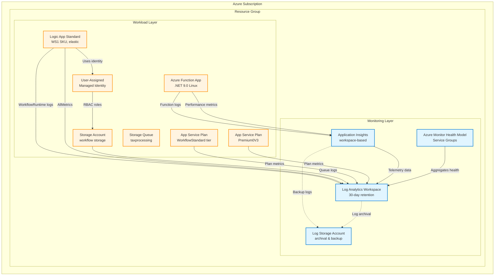
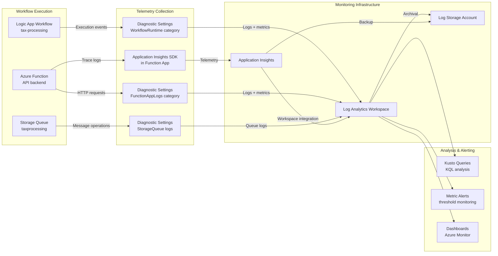

# Azure Logic Apps Monitoring Solution

[](LICENSE.md)
[](https://azure.microsoft.com)

A production-ready Infrastructure-as-Code (IaC) solution demonstrating Azure Monitor best practices for **Logic Apps Standard**. This project provides a comprehensive monitoring foundation with Log Analytics, Application Insights, diagnostic settings, and health models—all deployed through modular Bicep templates.

**Target Audience**: Beginners deploying their first Logic App monitoring setup • Experienced architects evaluating observability patterns • DevOps engineers standardizing Logic Apps monitoring • Platform engineers building reusable IaC modules

---

## Table of Contents

- [Project Overview](#project-overview)
- [Architecture](#architecture)
- [Prerequisites](#prerequisites)
- [Deployment](#deployment)
  - [Option A: Using Azure Developer CLI (Recommended)](#option-a-using-azure-developer-cli-recommended)
  - [Option B: Manual Bicep Deployment](#option-b-manual-bicep-deployment)
- [Usage Examples](#usage-examples)
- [Project Structure](#project-structure)
- [Monitoring Best Practices](#monitoring-best-practices)
- [Contributing](#contributing)
- [Security](#security)
- [Additional Resources](#additional-resources)
- [Support](#support)

---

## Project Overview

### Purpose

Default Azure monitoring provides basic metrics, but lacks comprehensive observability for enterprise workflow orchestration. This solution fills critical gaps by:

- **Centralizing telemetry** from Logic Apps, Azure Functions, and messaging services into a unified Log Analytics workspace
- **Automating diagnostic settings** so all workload resources send logs/metrics to monitoring infrastructure immediately upon deployment
- **Providing workspace-based Application Insights** for correlation between Logic App workflows and supporting API calls
- **Implementing health models** using Azure Monitor Service Groups for aggregated health views across workflow ecosystems

### Key Features

- **Modular Bicep Architecture**: Reusable templates with clear separation between monitoring infrastructure and workload resources  
- **Automatic Diagnostic Settings**: All resources pre-configured to send logs/metrics to Log Analytics and archival storage  
- **Managed Identity Security**: No connection strings or credentials in configuration—all service-to-service authentication uses Azure RBAC  
- **Elastic Logic App Deployment**: Workflow Standard tier (WS1 SKU) with auto-scaling up to 20 workers  
- **Azure Functions Integration**: .NET 9.0 Function App with Application Insights correlation for API backend monitoring  
- **Storage Queue Observability**: Queue service diagnostic logs for message processing visibility  
- **30-Day Log Retention**: Configurable retention with immediate purge for compliance/cost optimization  

### Benefits

**Compared to default Azure monitoring**, this solution provides:

| Capability | Default Monitoring | This Solution |
|------------|-------------------|---------------|
| **Unified Log Query** | Separate portals for each resource | Single Log Analytics workspace with KQL queries across all services |
| **Diagnostic Settings** | Manual configuration per resource | Automatically configured during deployment via Bicep |
| **Application Insights Integration** | Requires manual workspace linking | Pre-configured workspace-based integration with correlation IDs |
| **Managed Identity Auth** | Requires connection string management | All resources use Managed Identity with RBAC assignments |
| **Health Aggregation** | Manual dashboard creation | Azure Monitor Service Groups for tenant-level health models |
| **IaC Repeatability** | Portal-based setup (manual, error-prone) | Fully automated Bicep deployment with parameterization |

**Well-Architected Framework Alignment**:
- **Reliability**: Diagnostic logs capture all failures for root cause analysis
- **Security**: Zero secrets in configuration, least-privilege RBAC roles
- **Cost Optimization**: 30-day retention with configurable policies
- **Operational Excellence**: Infrastructure-as-Code for consistent deployments

---

## Architecture

### Architecture Overview

The solution uses a **three-tier deployment model** to ensure monitoring infrastructure exists before workload resources:

1. **Infrastructure Layer** (`infra/main.bicep`): Orchestrates subscription-level deployment, creates resource group, coordinates module deployments with dependency management
2. **Monitoring Layer** (`src/monitoring/main.bicep`): Deploys Log Analytics Workspace, Application Insights, storage for log archival, and health models
3. **Workload Layer** (`src/workload/main.bicep`): Deploys Logic Apps, Azure Functions, and messaging resources with automatic diagnostic settings integration

**Why this structure matters**:
- Monitoring components must deploy first because workload resources reference their IDs in diagnostic settings
- Modular Bicep design allows reusing monitoring infrastructure across multiple workload deployments
- Parameter flow from monitoring → workload ensures proper linkage (workspace IDs, connection strings)

### Architecture Diagram


```mermaid
graph TB
    subgraph "Azure Subscription"
        subgraph "Resource Group"
            subgraph "Monitoring Layer"
                LAW[Log Analytics Workspace<br/>30-day retention]
                AI[Application Insights<br/>workspace-based]
                LS[Log Storage Account<br/>archival & backup]
                HM[Azure Monitor Health Model<br/>Service Groups]
            end
            
            subgraph "Workload Layer"
                LA[Logic App Standard<br/>WS1 SKU, elastic]
                ASP1[App Service Plan<br/>WorkflowStandard tier]
                MI[User-Assigned<br/>Managed Identity]
                
                FA[Azure Function App<br/>.NET 9.0 Linux]
                ASP2[App Service Plan<br/>Premium0V3]
                
                SA[Storage Account<br/>workflow storage]
                Q[Storage Queue<br/>taxprocessing]
            end
        end
    end
    
    %% Data flow arrows
    LA -->|WorkflowRuntime logs| LAW
    LA -->|AllMetrics| LAW
    FA -->|Function logs| AI
    FA -->|Performance metrics| AI
    SA -->|Queue logs| LAW
    ASP1 -->|Plan metrics| LAW
    ASP2 -->|Plan metrics| LAW
    
    AI -->|Telemetry data| LAW
    AI -.->|Backup logs| LS
    LAW -.->|Log archival| LS
    
    MI -->|RBAC roles| SA
    LA -->|Uses identity| MI
    
    HM -->|Aggregates health| LAW
    
    classDef monitoring fill:#e1f5ff,stroke:#0078d4,stroke-width:2px
    classDef workload fill:#fff4e1,stroke:#ff8c00,stroke-width:2px
    
    class LAW,AI,LS,HM monitoring
    class LA,FA,SA,Q,ASP1,ASP2,MI workload
```

### Data Flow Diagram


```mermaid
flowchart LR
    subgraph "Workflow Execution"
        WF[Logic App Workflow<br/>tax-processing]
        FN[Azure Function<br/>API backend]
        SQ[Storage Queue<br/>taxprocessing]
    end
    
    subgraph "Telemetry Collection"
        DS1[Diagnostic Settings<br/>WorkflowRuntime category]
        DS2[Diagnostic Settings<br/>FunctionAppLogs category]
        DS3[Diagnostic Settings<br/>StorageQueue logs]
        AISDK[Application Insights SDK<br/>in Function App]
    end
    
    subgraph "Monitoring Infrastructure"
        LAW[Log Analytics Workspace]
        AI[Application Insights]
        SA[Log Storage Account]
    end
    
    subgraph "Analysis & Alerting"
        KQL[Kusto Queries<br/>KQL analysis]
        ALT[Metric Alerts<br/>threshold monitoring]
        DB[Dashboards<br/>Azure Monitor]
    end
    
    WF -->|Execution events| DS1
    FN -->|Trace logs| AISDK
    FN -->|HTTP requests| DS2
    SQ -->|Message operations| DS3
    
    DS1 -->|Logs + metrics| LAW
    DS2 -->|Logs + metrics| LAW
    DS3 -->|Queue logs| LAW
    AISDK -->|Telemetry| AI
    
    AI -->|Workspace integration| LAW
    LAW -->|Archival| SA
    AI -->|Backup| SA
    
    LAW --> KQL
    LAW --> ALT
    LAW --> DB
```

### Data Flow Walkthrough

1. **Logic App Execution**: When a workflow runs, Logic Apps Standard runtime emits `WorkflowRuntime` logs (run started/completed/failed events, action execution details)
2. **Diagnostic Settings Capture**: Pre-configured diagnostic settings on the Logic App resource automatically send logs and `AllMetrics` to Log Analytics workspace
3. **Function App Telemetry**: Azure Function executions send trace logs and HTTP request telemetry through Application Insights SDK to workspace-based Application Insights instance
4. **Storage Queue Monitoring**: Queue operations (enqueue, dequeue, peek) generate `StorageQueue` logs captured by diagnostic settings on the Storage Account's queue service
5. **Workspace Aggregation**: All telemetry converges in Log Analytics workspace where cross-service correlation queries can join Logic App runs with Function calls and queue operations
6. **Log Archival**: Log Analytics workspace and Application Insights both write backup copies of logs to dedicated storage account for long-term retention and compliance
7. **Alert Evaluation**: Azure Monitor continuously evaluates metric alert rules (e.g., failed runs > threshold) against workspace data and triggers action groups
8. **Health Model Aggregation**: Azure Monitor Service Groups aggregate health signals from all resources into tenant-level health dashboard

---

## Prerequisites

### Azure Requirements

- **Azure Subscription** with Contributor or Owner role (required for creating resources and assigning RBAC roles)
- **Resource Providers Registered**:
  - `Microsoft.Logic` (Logic Apps)
  - `Microsoft.Insights` (Application Insights, diagnostic settings)
  - `Microsoft.OperationalInsights` (Log Analytics)
  - `Microsoft.Web` (App Service Plans, Function Apps)
  - `Microsoft.Storage` (Storage Accounts)
  - `Microsoft.ManagedIdentity` (User-Assigned Managed Identities)

**Check registration status**:
```powershell
# PowerShell
az provider show --namespace Microsoft.Logic --query "registrationState"
```

### Local Tools

| Tool | Minimum Version | Purpose |
|------|----------------|---------|
| **Azure CLI** | 2.50 or higher | Deploy Bicep templates, manage resources |
| **Bicep CLI** | 0.20 or higher | Bicep syntax validation (installed with Azure CLI) |
| **Azure Developer CLI (azd)** | Latest | (Optional) Simplified deployment workflow |
| **PowerShell** | 7.0 or higher | Command execution on Windows |

**Install Azure CLI**:
```powershell
# Windows (PowerShell)
winget install Microsoft.AzureCLI

# Verify installation
az --version
```

**Install Azure Developer CLI** (optional but recommended):
```powershell
# Windows (PowerShell)
winget install Microsoft.Azd

# Verify installation
azd version
```

### Knowledge Prerequisites

- **Required**:
- Basic understanding of Azure Logic Apps Standard (workflows, triggers, actions)
- Familiarity with Azure Resource Manager deployments and resource groups
- Ability to run Azure CLI commands in PowerShell or Bash

○ **Optional** (helpful but not required):
- Experience with Bicep/ARM template syntax
- Knowledge of Kusto Query Language (KQL) for Log Analytics queries
- Well-Architected Framework for Azure principles

### Configuration Files

**Files requiring customization before deployment**:

1. **`infra/main.parameters.json`**: Environment-specific parameters
   - `location`: Azure region (e.g., `eastus`, `westeurope`)
   - `envName`: Environment name (`dev`, `uat`, `prod`)

2. **Environment variables** (if using Azure Developer CLI):
   - `AZURE_LOCATION`: Azure region for deployment
   - `AZURE_ENV_NAME`: Environment name

---

## Deployment

### Option A: Using Azure Developer CLI (Recommended)

Azure Developer CLI (`azd`) simplifies deployment by automating resource provisioning and configuration.

**Prerequisites**: Azure Developer CLI installed (see [Prerequisites](#prerequisites))

**Step 1: Clone Repository**

```powershell
# Clone the repository
git clone https://github.com/Evilazaro/Azure-LogicApps-Monitoring.git
cd Azure-LogicApps-Monitoring
```

**Step 2: Authenticate to Azure**

```powershell
# Login to Azure (opens browser for authentication)
azd auth login

# Verify authentication
az account show --query "{Subscription:name, ID:id, Tenant:tenantId}" --output table
```

**Step 3: Provision and Deploy**

```powershell
# Initialize environment (prompts for location and environment name)
azd env new

# Provision all Azure resources and deploy solution
azd up
```

**What `azd up` does**:
1. Creates resource group named `contoso-tax-docs-{envName}-{location}-rg`
2. Deploys monitoring infrastructure (Log Analytics, Application Insights, log storage)
3. Deploys workload resources (Logic App, Function App, Storage Account with queue)
4. Configures diagnostic settings on all resources
5. Assigns Managed Identity RBAC roles for Logic App → Storage Account access
6. Outputs resource names and connection information

**Expected output** (example):
```
SUCCESS: Resource group 'contoso-tax-docs-dev-eastus-rg' created
SUCCESS: Log Analytics Workspace 'tax-docs-abc123-law' deployed
SUCCESS: Application Insights 'tax-docs-abc123-appinsights' deployed
SUCCESS: Logic App 'tax-docs-abc123-logicapp' deployed
Deployment complete. Resources available in Azure Portal.
```

**Step 4: Verify Deployment**

```powershell
# List deployed resources
az resource list --resource-group contoso-tax-docs-dev-eastus-rg --output table
```

---

### Option B: Manual Bicep Deployment

For environments without Azure Developer CLI or when more control is needed.

#### Step 1: Configure Parameters

Edit `infra/main.parameters.json`:

```json
{
  "$schema": "https://schema.management.azure.com/schemas/2015-01-01/deploymentParameters.json#",
  "contentVersion": "1.0.0.0",
  "parameters": {
    "location": {
      "value": "eastus"  // Your Azure region: eastus, westus2, westeurope, etc.
    },
    "envName": {
      "value": "dev"  // Environment: dev, uat, or prod
    },
    "solutionName": {
      "value": "tax-docs"  // Base name for resources (3-20 characters)
    }
  }
}
```

**Parameter descriptions**:
- **`location`** (required): Azure region where all resources deploy
- **`envName`** (required): Environment name for resource naming and tagging
- **`solutionName`** (optional): Defaults to `tax-docs`, customize for your use case

#### Step 2: Authenticate to Azure

```powershell
# Login to Azure
az login

# Set default subscription (if you have multiple)
az account set --subscription "<subscription-name-or-id>"

# Verify active subscription
az account show --output table
```

#### Step 3: Deploy Infrastructure

```powershell
# Deploy at subscription scope (creates resource group + all resources)
az deployment sub create `
  --location eastus `
  --template-file infra/main.bicep `
  --parameters infra/main.parameters.json `
  --name "logicapp-monitoring-deployment-$(Get-Date -Format 'yyyyMMddHHmmss')"
```

**Why subscription scope?** The main template creates the resource group as part of deployment, requiring subscription-level permissions.

**Deployment time**: 5-10 minutes for all resources

#### Step 4: Monitor Deployment Progress

```powershell
# Watch deployment status (updates every 5 seconds)
az deployment sub show `
  --name logicapp-monitoring-deployment-20251204123045 `
  --query "{Status:properties.provisioningState, Progress:properties.timestamp}" `
  --output table
```

#### Step 5: Verify Deployment

```powershell
# Get resource group name from deployment outputs
$rgName = az deployment sub show `
  --name logicapp-monitoring-deployment-20251204123045 `
  --query "properties.outputs.RESOURCE_GROUP_NAME.value" `
  --output tsv

# List all deployed resources
az resource list --resource-group $rgName --output table

# Check Logic App status
$logicAppName = az deployment sub show `
  --name logicapp-monitoring-deployment-20251204123045 `
  --query "properties.outputs.LOGIC_APP_NAME.value" `
  --output tsv

az logicapp show `
  --name $logicAppName `
  --resource-group $rgName `
  --query "{Name:name, State:state, HealthState:healthState, Kind:kind}" `
  --output table
```

**Expected output**:
```
Name                          State     HealthState    Kind
----------------------------  --------  -------------  ---------------------
tax-docs-abc123-logicapp      Running   Healthy        functionapp,workflowapp
```

#### Step 6: Verify Monitoring Configuration

```powershell
# Get Application Insights details
$appInsightsName = az deployment sub show `
  --name logicapp-monitoring-deployment-20251204123045 `
  --query "properties.outputs.AZURE_APPLICATION_INSIGHTS_NAME.value" `
  --output tsv

az monitor app-insights component show `
  --app $appInsightsName `
  --resource-group $rgName `
  --query "{Name:name, WorkspaceID:workspaceResourceId, PublicNetworkAccess:publicNetworkAccessForIngestion}" `
  --output table

# Verify diagnostic settings on Logic App
az monitor diagnostic-settings list `
  --resource "/subscriptions/<sub-id>/resourceGroups/$rgName/providers/Microsoft.Web/sites/$logicAppName" `
  --query "value[].{Name:name, WorkspaceID:workspaceId, Categories:logs[].category}" `
  --output table
```

---

### Troubleshooting Common Deployment Issues

<details>
<summary><strong>Issue: "Resource provider not registered"</strong></summary>

**Symptom**: Deployment fails with error `The subscription is not registered to use namespace 'Microsoft.Logic'`

**Solution**:
```powershell
# Register required providers
az provider register --namespace Microsoft.Logic
az provider register --namespace Microsoft.Insights
az provider register --namespace Microsoft.OperationalInsights
az provider register --namespace Microsoft.Web
az provider register --namespace Microsoft.Storage
az provider register --namespace Microsoft.ManagedIdentity

# Wait for registration to complete (can take 2-5 minutes)
az provider show --namespace Microsoft.Logic --query "registrationState" --output tsv
# Output should be: Registered
```
</details>

<details>
<summary><strong>Issue: "Insufficient permissions"</strong></summary>

**Symptom**: `Authorization failed` or `403 Forbidden` errors during deployment

**Solution**:
```powershell
# Check your current role assignments
az role assignment list --assignee user@company.com --output table

# Required: Contributor role at subscription or resource group level
# If missing, contact subscription owner to grant access:
az role assignment create `
  --role "Contributor" `
  --assignee user@company.com `
  --scope "/subscriptions/<subscription-id>"
```

**Note**: Deploying Managed Identities and RBAC role assignments requires subscription-level Contributor role.
</details>

<details>
<summary><strong>Issue: "Deployment timeout"</strong></summary>

**Symptom**: Deployment exceeds Azure timeout limits (typically 1 hour)

**Solution**:
```powershell
# Use --no-wait flag to run deployment asynchronously
az deployment sub create `
  --location eastus `
  --template-file infra/main.bicep `
  --parameters infra/main.parameters.json `
  --name "logicapp-monitoring-deployment" `
  --no-wait

# Check deployment status periodically
az deployment sub show `
  --name logicapp-monitoring-deployment `
  --query "properties.provisioningState" `
  --output tsv
```

**If deployment stalls**: Check for resource locks or policy restrictions in your subscription.
</details>

<details>
<summary><strong>Issue: "Unique resource name conflict"</strong></summary>

**Symptom**: Error `Storage account name 'taxdocslogs...' is already taken`

**Solution**: Resource names include `uniqueString()` based on resource group ID, but conflicts can occur if:
- Deploying to same region/subscription with identical `solutionName`
- Resource soft-deleted but not purged

```powershell
# Change solutionName parameter in main.parameters.json
{
  "parameters": {
    "solutionName": {
      "value": "tax-docs-v2"  // Append suffix to force new names
    }
  }
}

# Redeploy with new names
az deployment sub create ...
```
</details>

<details>
<summary><strong>Issue: "Diagnostic settings already exist"</strong></summary>

**Symptom**: `A diagnostic setting with name '...-diag' already exists`

**Solution**: Delete existing diagnostic settings before redeploying:
```powershell
# List existing diagnostic settings
az monitor diagnostic-settings list --resource <resource-id>

# Delete conflicting setting
az monitor diagnostic-settings delete `
  --name "existing-diag-name" `
  --resource <resource-id>

# Redeploy
```
</details>

---

## Usage Examples

### Example 1: Query Logic App Execution History

**Scenario**: Troubleshoot failed workflow runs in the last 24 hours

**Open Log Analytics workspace**:
1. Navigate to Azure Portal → Resource Groups → `contoso-tax-docs-dev-eastus-rg`
2. Open Log Analytics workspace (`tax-docs-abc123-law`)
3. Click **Logs** in left menu

**Run this KQL query**:

```kql
// Failed Logic App workflow runs with error details
AzureDiagnostics
| where ResourceProvider == "MICROSOFT.LOGIC"
| where Category == "WorkflowRuntime"
| where status_s == "Failed"
| project 
    TimeGenerated,
    WorkflowName = resource_workflowName_s,
    RunId = resource_runId_s,
    Status = status_s,
    Error = coalesce(error_message_s, error_code_s, "No error message"),
    ActionName = resource_actionName_s,
    TriggerName = resource_triggerName_s
| order by TimeGenerated desc
| take 50
```

**Expected output**:

<details>
<summary>View example results</summary>

| TimeGenerated | WorkflowName | RunId | Status | Error | ActionName | TriggerName |
|---------------|--------------|-------|--------|-------|------------|-------------|
| 2025-12-04 10:23:45 | tax-processing | 08584...1ab | Failed | Connection timeout to API endpoint | ProcessDocument | manual |
| 2025-12-04 09:15:22 | tax-processing | 08584...2cd | Failed | Invalid schema: required property 'taxId' missing | ValidateInput | manual |
| 2025-12-04 08:42:11 | tax-processing | 08584...3ef | Failed | ActionFailed: HTTP 500 from downstream service | CallExternalAPI | manual |

</details>

**Next steps**: Click on `RunId` in Azure Portal to open detailed run history with action-level execution details.

---

### Example 2: Monitor Azure Function Performance Metrics

**Scenario**: Track Function App execution counts and duration to identify performance bottlenecks

**Using Azure CLI**:

```powershell
# Get Function App resource ID
$functionAppId = az deployment sub show `
  --name logicapp-monitoring-deployment-20251204123045 `
  --query "properties.outputs.API_FUNCTION_APP_ID.value" `
  --output tsv

# Query execution metrics for last 6 hours
az monitor metrics list `
  --resource $functionAppId `
  --metric "FunctionExecutionCount" "FunctionExecutionUnits" "Http5xx" `
  --start-time (Get-Date).AddHours(-6).ToString("yyyy-MM-ddTHH:mm:ssZ") `
  --end-time (Get-Date).ToString("yyyy-MM-ddTHH:mm:ssZ") `
  --interval PT1H `
  --aggregation Total Average `
  --output table
```

**Using KQL in Log Analytics**:

```kql
// Function App performance summary - last 6 hours
AppTraces
| where TimeGenerated > ago(6h)
| where AppRoleName contains "api"  // Function App name filter
| summarize 
    TotalExecutions = count(),
    AvgDuration = avg(DurationMs),
    P95Duration = percentile(DurationMs, 95),
    P99Duration = percentile(DurationMs, 99),
    FailureCount = countif(SeverityLevel >= 3)
    by bin(TimeGenerated, 1h), OperationName
| order by TimeGenerated desc
```

**Performance thresholds to monitor**:
- ⚠️ **Execution count > 1000/hour**: Consider scaling out to additional instances
- ⚠️ **P95 duration > 5 seconds**: Investigate slow dependencies or inefficient code
- ⚠️ **HTTP 5xx errors > 5%**: Check Application Insights exceptions for root cause

---

### Example 3: Create Custom Metric Alert Rule

**Scenario**: Get notified when Logic App failures exceed 5 in a 5-minute window

**Step 1: Create Action Group** (email notification):

```powershell
# Create action group for DevOps team
az monitor action-group create `
  --name "LogicAppAlertsDevOps" `
  --resource-group $rgName `
  --short-name "LA-Alerts" `
  --email-receiver name="DevOps Team" email="devops@company.com"
```

**Step 2: Create Metric Alert**:

```powershell
# Get Logic App resource ID
$logicAppId = az deployment sub show `
  --name logicapp-monitoring-deployment-20251204123045 `
  --query "properties.outputs.LOGIC_APP_ID.value" `
  --output tsv

# Create alert rule for failed runs
az monitor metrics alert create `
  --name "HighLogicAppFailureRate" `
  --resource-group $rgName `
  --scopes $logicAppId `
  --condition "count RunsFailed > 5" `
  --window-size 5m `
  --evaluation-frequency 1m `
  --action /subscriptions/<sub-id>/resourceGroups/$rgName/providers/microsoft.insights/actionGroups/LogicAppAlertsDevOps `
  --description "Alert when Logic App fails more than 5 times in 5 minutes" `
  --severity 2
```

**Alert configuration explanation**:
- **Metric**: `RunsFailed` (built-in Logic Apps metric)
- **Threshold**: > 5 failures in 5-minute window
- **Evaluation frequency**: Checks every 1 minute
- **Severity**: 2 (Warning) - adjust to 0 (Critical) or 3 (Informational) as needed

<details>
<summary>View full alert configuration JSON</summary>

```json
{
  "name": "HighLogicAppFailureRate",
  "description": "Alert when Logic App fails more than 5 times in 5 minutes",
  "severity": 2,
  "enabled": true,
  "scopes": [
    "/subscriptions/<sub-id>/resourceGroups/<rg-name>/providers/Microsoft.Web/sites/<logic-app-name>"
  ],
  "evaluationFrequency": "PT1M",
  "windowSize": "PT5M",
  "criteria": {
    "allOf": [
      {
        "criterionType": "StaticThresholdCriterion",
        "name": "FailedRuns",
        "metricName": "RunsFailed",
        "metricNamespace": "Microsoft.Web/sites",
        "operator": "GreaterThan",
        "threshold": 5,
        "timeAggregation": "Total"
      }
    ],
    "odata.type": "Microsoft.Azure.Monitor.SingleResourceMultipleMetricCriteria"
  },
  "actions": [
    {
      "actionGroupId": "/subscriptions/<sub-id>/resourceGroups/<rg-name>/providers/microsoft.insights/actionGroups/LogicAppAlertsDevOps"
    }
  ]
}
```
</details>

**Testing the alert**:
```powershell
# Trigger Logic App manually to generate test runs
az logicapp start --name $logicAppName --resource-group $rgName
```

---

### Example 4: Monitor Storage Queue Message Processing

**Scenario**: Track message enqueue/dequeue operations and queue depth for `taxprocessing` queue

**KQL query in Log Analytics**:

```kql
// Storage Queue operations - last 1 hour
StorageQueueLogs
| where TimeGenerated > ago(1h)
| where AccountName contains "taxdocs"  // Storage account name filter
| where Uri contains "taxprocessing"    // Queue name filter
| summarize 
    EnqueueCount = countif(OperationName == "PutMessage"),
    DequeueCount = countif(OperationName == "GetMessages"),
    DeleteCount = countif(OperationName == "DeleteMessage"),
    AvgLatencyMs = avg(DurationMs)
    by bin(TimeGenerated, 5m)
| order by TimeGenerated desc
```

**Configure queue depth alert**:

```powershell
# Create alert for high queue depth (> 100 messages)
$storageAccountId = az storage account show `
  --name <storage-account-name> `
  --resource-group $rgName `
  --query "id" --output tsv

az monitor metrics alert create `
  --name "HighQueueDepth" `
  --resource-group $rgName `
  --scopes $storageAccountId `
  --condition "avg QueueMessageCount > 100" `
  --window-size 5m `
  --evaluation-frequency 1m `
  --description "Alert when taxprocessing queue exceeds 100 messages" `
  --severity 3
```

**Why monitor queue depth?**
- **Growing queue** (depth increasing over time) indicates Logic App processing slower than message arrival rate → consider scaling workflow instances
- **Empty queue** consistently may indicate upstream issues producing messages

---

### Example 5: Cross-Service Correlation Query

**Scenario**: Trace a single request from Logic App → Function App → Storage Queue using correlation IDs

**KQL query**:

```kql
// Correlate Logic App run with downstream Function calls
let logicAppRun = "08584...1ab";  // Replace with actual Run ID from failed workflow
let correlationContext = AzureDiagnostics
| where ResourceProvider == "MICROSOFT.LOGIC"
| where resource_runId_s == logicAppRun
| extend CorrelationId = clientRequestId_g
| project CorrelationId, LogicAppAction = resource_actionName_s, TimeGenerated;
correlationContext
| join kind=inner (
    AppRequests
    | where AppRoleName contains "api"  // Function App traces
    | extend CorrelationId = tostring(parse_json(Properties).CorrelationId)
) on CorrelationId
| join kind=inner (
    StorageQueueLogs
    | extend CorrelationId = tostring(parse_json(Properties).CorrelationId)
) on CorrelationId
| project 
    TimeGenerated,
    LogicAppAction,
    FunctionOperation = OperationName,
    QueueOperation = OperationName1,
    StatusCode,
    DurationMs
| order by TimeGenerated asc
```

**What this reveals**: End-to-end trace showing which Logic App action triggered which Function call, which then enqueued messages to Storage Queue—critical for debugging multi-service workflows.

---

### Example 6: Application Insights Availability Test

**Scenario**: Monitor Logic App HTTP trigger endpoint availability

**Create availability test**:

```powershell
# Get Logic App callback URL
$callbackUrl = az logicapp show `
  --name $logicAppName `
  --resource-group $rgName `
  --query "properties.hostName" --output tsv

# Create availability test in Application Insights
az monitor app-insights web-test create `
  --resource-group $rgName `
  --name "LogicAppHTTPTriggerTest" `
  --location eastus `
  --kind ping `
  --app-insights-resource $appInsightsName `
  --url "https://$callbackUrl/api/tax-processing/triggers/manual/paths/invoke?api-version=2022-05-01" `
  --frequency 300 `
  --timeout 30 `
  --enabled true `
  --retry-enabled true `
  --expected-status-code 200
```

**Availability metrics query**:

```kql
// Logic App availability over last 24 hours
AppAvailabilityResults
| where TimeGenerated > ago(24h)
| where Name == "LogicAppHTTPTriggerTest"
| summarize 
    AvailabilityPercent = avg(Success) * 100,
    TotalTests = count(),
    FailedTests = countif(Success == false)
    by bin(TimeGenerated, 1h)
| order by TimeGenerated desc
```

---

## Project Structure

```
Azure-LogicApps-Monitoring/
├── infra/                          # Infrastructure-as-Code root
│   ├── main.bicep                  # Main orchestrator (subscription-level deployment)
│   │                               # - Creates resource group
│   │                               # - Coordinates monitoring + workload modules
│   │                               # - Manages deployment dependencies
│   └── main.parameters.json        # Environment-specific parameters
│                                   # - location, envName, solutionName
├── src/
│   ├── monitoring/                 # Monitoring layer (deploys first)
│   │   ├── main.bicep              # Monitoring orchestrator module
│   │   │                           # - Coordinates Log Analytics, App Insights, storage
│   │   │                           # - Outputs workspace IDs for workload consumption
│   │   ├── log-analytics-workspace.bicep
│   │   │                           # - Log Analytics workspace (30-day retention)
│   │   │                           # - Storage account for log archival
│   │   │                           # - Diagnostic settings on workspace itself
│   │   ├── app-insights.bicep      # Application Insights (workspace-based)
│   │   │                           # - Integrates with Log Analytics workspace
│   │   │                           # - Diagnostic settings enabled
│   │   └── azure-monitor-health-model.bicep
│   │                               # Azure Monitor Service Groups (tenant-level)
│   └── workload/                   # Application workload layer (deploys second)
│       ├── main.bicep              # Workload orchestrator module
│       │                           # - Coordinates Logic App, Function App, messaging
│       │                           # - Consumes monitoring outputs (workspace IDs)
│       ├── logic-app.bicep         # Logic App Standard deployment
│       │                           # - App Service Plan (WorkflowStandard WS1 tier)
│       │                           # - User-Assigned Managed Identity
│       │                           # - RBAC role assignments (storage access)
│       │                           # - Diagnostic settings (WorkflowRuntime logs)
│       ├── azure-function.bicep    # Azure Function App (.NET 9.0 Linux)
│       │                           # - App Service Plan (Premium0V3 tier)
│       │                           # - System-Assigned Managed Identity
│       │                           # - Application Insights integration
│       │                           # - Diagnostic settings enabled
│       └── messaging/
│           └── main.bicep          # Storage Account with Queue Services
│                                   # - Storage account for workflow storage
│                                   # - Queue service with 'taxprocessing' queue
│                                   # - Diagnostic settings on queue service
├── tax-docs/                       # Logic App workflow definitions
│   ├── connections.json            # Managed API connection configs (empty template)
│   ├── host.json                   # Logic App host runtime configuration
│   ├── local.settings.json         # Local development environment variables
│   └── tax-processing/
│       └── workflow.json           # Workflow definition (JSON DSL)
├── azure.yaml                      # Azure Developer CLI configuration
│                                   # - Project metadata for azd commands
├── host.json                       # Functions runtime configuration (shared)
├── README.md                       # This file (comprehensive documentation)
├── CONTRIBUTING.md                 # Contribution guidelines (empty template)
├── SECURITY.md                     # Security policies (empty template)
└── LICENSE.md                      # Project license (empty template)
```

### Key Directories

- **`infra/`**: Subscription-level deployment orchestration. Entry point for all deployments. Creates resource group and coordinates module execution order.
- **`src/monitoring/`**: Observability infrastructure that must deploy before workloads. Outputs workspace IDs, connection strings, and storage account IDs consumed by workload modules.
- **`src/workload/`**: Application resources (Logic Apps, Functions, messaging). All resources automatically configured with diagnostic settings pointing to monitoring infrastructure.
- **`tax-docs/`**: Logic App workflow definitions in JSON format. Deploy these to Logic App after infrastructure deployment to activate workflows.

### Deployment Flow

```
infra/main.bicep (subscription scope)
    ↓
    ├─→ src/monitoring/main.bicep (resource group scope)
    │       ↓
    │       ├─→ log-analytics-workspace.bicep → Log Analytics + log storage
    │       ├─→ azure-monitor-health-model.bicep → Service Groups
    │       └─→ app-insights.bicep → Application Insights
    │           ↓
    │           [Outputs: workspace IDs, connection strings]
    │
    └─→ src/workload/main.bicep (resource group scope, depends on monitoring outputs)
            ↓
            ├─→ messaging/main.bicep → Storage + Queue
            ├─→ azure-function.bicep → Function App (depends on monitoring outputs)
            └─→ logic-app.bicep → Logic App (depends on Function App, consumes storage)
```

---

## Monitoring Best Practices

This solution implements Azure Well-Architected Framework principles for observability:

### Reliability

- **Comprehensive diagnostic logs**: All resources capture logs/metrics automatically—no manual configuration needed after deployment  
- **Workspace-based correlation**: Application Insights integrates with Log Analytics for cross-service query correlation using `operation_ParentId`  
- **Log archival**: Backup logs stored in separate storage account (survives workspace deletion, supports compliance requirements)  
- **Health models**: Azure Monitor Service Groups aggregate health signals across resource hierarchy for tenant-level visibility

**Recommendation**: Configure metric alerts (see [Example 3](#example-3-create-custom-metric-alert-rule)) for proactive failure detection before users report issues.

### Performance Efficiency

- **Metrics tracked automatically**:
  - **Logic Apps**: `RunsStarted`, `RunsSucceeded`, `RunsFailed`, `RunLatency`, `ActionsCompleted`
  - **Azure Functions**: `FunctionExecutionCount`, `FunctionExecutionUnits`, `Http5xx`, `ResponseTime`
  - **Storage Queues**: `QueueMessageCount`, `IngressEgress`, `SuccessE2ELatency`

- **Elastic scaling**: Logic App uses WorkflowStandard tier with auto-scaling up to 20 workers based on workload  
- **Performance baselines**: Log Analytics queries provide P50/P95/P99 latency percentiles for establishing SLAs

**Recommendation**: Set up KQL queries (see [Example 2](#example-2-monitor-azure-function-performance-metrics)) as scheduled alerts to detect performance degradation trends.

### Security

- **Zero secrets in configuration**: All service-to-service authentication uses Managed Identities  
- **Least-privilege RBAC**: Logic App Managed Identity assigned only required roles:
  - `Storage Blob Data Owner` (workflow state management)
  - `Storage Queue Data Contributor` (queue message processing)
  - `Storage Table Data Contributor` (table operations)
  - `Storage File Data Contributor` (file share access)
- **TLS enforcement**: All resources configured with `minimumTlsVersion: 'TLS1_2'` and `supportsHttpsTrafficOnly: true`  
- **Audit logging**: Diagnostic logs capture authentication attempts, RBAC changes, and data access patterns

**Recommendation**: Review [SECURITY.md](SECURITY.md) for additional security hardening guidance (network isolation, Private Link, Key Vault integration).

### Cost Optimization

- **30-day log retention**: Configurable retention policy balances compliance needs with storage costs  
- **Immediate purge on delete**: `immediatePurgeDataOn30Days: true` prevents data retention beyond policy  
- **Standard storage tier**: Log archival uses `Standard_LRS` (lowest cost) since historical logs are infrequently accessed  
- **Pay-per-GB ingestion**: Log Analytics uses `PerGB2018` pricing tier (no commitment, scales with usage)

**Cost monitoring queries**:
```kql
// Daily ingestion volume by resource type
Usage
| where TimeGenerated > ago(30d)
| where IsBillable == true
| summarize IngestedGB = sum(Quantity) / 1000 by bin(TimeGenerated, 1d), DataType
| order by TimeGenerated desc
```

**Recommendation**: Set up budget alerts in Azure Cost Management for Log Analytics workspace to detect unexpected ingestion spikes.

### Operational Excellence

- **Infrastructure-as-Code**: All resources defined in Bicep—no manual portal configuration required  
- **Modular design**: Reuse monitoring module across multiple workload deployments  
- **Automated diagnostic settings**: Every resource configured during deployment, eliminating post-deployment tasks  
- **Tagging strategy**: Standardized tags (`Solution`, `Environment`, `ManagedBy`, `CostCenter`, `Owner`, `DeploymentDate`) for resource governance

**CI/CD integration example**:
```yaml
# Azure DevOps pipeline snippet
- task: AzureCLI@2
  inputs:
    azureSubscription: 'Production'
    scriptType: 'pscore'
    scriptLocation: 'inlineScript'
    inlineScript: |
      az deployment sub create `
        --location $(AZURE_LOCATION) `
        --template-file infra/main.bicep `
        --parameters infra/main.parameters.json `
        --parameters envName=$(Environment.Name)
```

---

## Contributing

We welcome contributions! Please see [CONTRIBUTING.md](CONTRIBUTING.md) for:
- Code of conduct and community guidelines
- How to submit issues and pull requests
- Development setup instructions for local testing
- Bicep linting and validation requirements
- Testing checklist before submitting PRs

**Quick contribution workflow**:
1. Fork repository and create feature branch
2. Make changes and test locally with `az deployment sub validate`
3. Run Bicep linter: `az bicep build --file infra/main.bicep`
4. Submit pull request with description of changes

---

## Security

Security is critical for monitoring infrastructure handling production telemetry. Please review [SECURITY.md](SECURITY.md) for:
- Reporting security vulnerabilities responsibly
- Security best practices for production deployments
- Credential and secret management guidelines (Managed Identity, Key Vault)
- Network isolation strategies (Private Link, VNet integration)

### Key Security Considerations

⚠️ **Never commit secrets to version control**:
- No connection strings, storage keys, or instrumentation keys in code
- Use `@secure()` decorator in Bicep for sensitive parameters
- Reference secrets from Azure Key Vault in production

- **Use Managed Identities everywhere** (eliminates credential management):
- Logic Apps → Storage Account: User-Assigned Managed Identity with RBAC
- Function Apps → Application Insights: System-Assigned Managed Identity
- Diagnostic Settings → Log Analytics: Managed by Azure platform

- **Apply least-privilege access**:
- **Monitoring resources**: Assign `Monitoring Reader` role to users who only view dashboards
- **Deployment accounts**: Require `Contributor` role at resource group level
- **Production environments**: Use dedicated service principals for CI/CD pipelines with time-bound access

- **Enable diagnostic logging for audit trails**:
- All resources send `allLogs` category to Log Analytics (captures authentication, configuration changes, data access)
- Application Insights diagnostic settings enabled to audit telemetry ingestion

- **Rotate access keys regularly** (if not using Managed Identity):
- Storage account access keys: Rotate every 90 days
- Application Insights instrumentation keys: Use connection strings with Microsoft Entra authentication where possible

### Security Best Practices Applied in This Solution

Based on workspace analysis, the following security patterns are implemented:

- **Managed Identity authentication**: Logic App uses User-Assigned Managed Identity for storage access (see `logic-app.bicep` lines 89-123)  
- **RBAC role assignments**: Five storage roles assigned programmatically (`Storage Blob Data Owner`, `Queue Data Contributor`, `Table Data Contributor`, `File Data Contributor`, `Contributor`)  
- **TLS 1.2 enforcement**: All storage accounts and App Service Plans configured with `minimumTlsVersion: 'TLS1_2'`  
- **HTTPS-only traffic**: Storage accounts require `supportsHttpsTrafficOnly: true`  
- **Public access controls**: Blob public access disabled on log storage account (`allowBlobPublicAccess: false`)  
- **Application Insights workspace-based**: No direct internet ingestion—telemetry flows through Log Analytics workspace for centralized access control

**Additional hardening for production** (not included in base template):
- Configure Private Link for Log Analytics workspace (prevent internet ingestion)
- Enable VNet integration for Logic Apps and Function Apps
- Store workflow configuration secrets in Azure Key Vault
- Enable Microsoft Defender for Cloud for threat detection

---

## Additional Resources

- [Azure Logic Apps Standard Documentation](https://learn.microsoft.com/azure/logic-apps/logic-apps-overview)
- [Azure Monitor Best Practices](https://learn.microsoft.com/azure/azure-monitor/best-practices)
- [Log Analytics Workspace Design](https://learn.microsoft.com/azure/azure-monitor/logs/workspace-design)
- [Application Insights for Logic Apps](https://learn.microsoft.com/azure/logic-apps/monitor-logic-apps-application-insights)
- [Kusto Query Language (KQL) Tutorial](https://learn.microsoft.com/azure/data-explorer/kusto/query/)
- [Well-Architected Framework for Azure](https://learn.microsoft.com/azure/architecture/framework/)
- [Bicep Documentation](https://learn.microsoft.com/azure/azure-resource-manager/bicep/)
- [Azure CLI Reference](https://learn.microsoft.com/cli/azure/)
- [Managed Identities for Azure Resources](https://learn.microsoft.com/azure/active-directory/managed-identities-azure-resources/overview)

**Community Resources**:
- [Logic Apps Discussion Forum](https://techcommunity.microsoft.com/category/azurelogicapps)
- [Azure Monitor Community](https://techcommunity.microsoft.com/category/azuremonitor)

---

## Support

For questions and support:

- 📝 **Create an issue** in this repository for bugs, feature requests, or deployment problems
- 💬 **Review existing issues** to see if your question has been answered
- 📖 **Check documentation** in [Additional Resources](#additional-resources) section

**When reporting issues, please include**:
- Azure region and subscription type (EA, CSP, MSDN, etc.)
- Error messages or deployment failure details
- Bicep version: `az bicep version`
- Azure CLI version: `az --version`

---

## License

This project is licensed under the MIT License - see [LICENSE.md](LICENSE.md) for details.

---

**Questions or feedback?** Open an issue or contribute improvements via pull request!