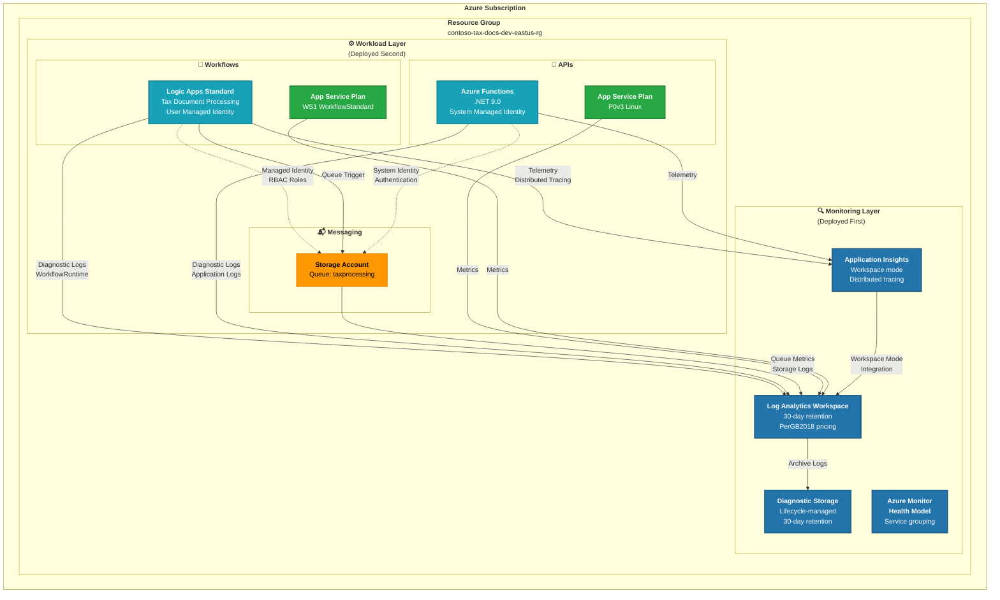
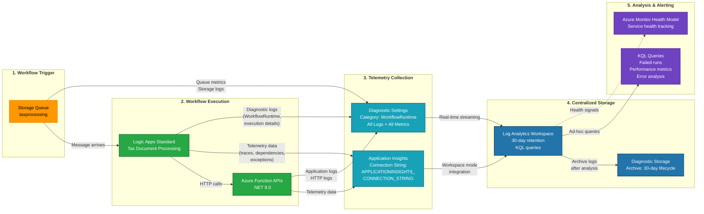

# Azure Logic Apps Standard - Monitoring Solution

[](LICENSE.md)
[](https://azure.microsoft.com)
[](https://learn.microsoft.com/azure/azure-resource-manager/bicep/)

A production-ready Infrastructure-as-Code (IaC) monitoring solution for Azure Logic Apps Standard using Bicep templates. This solution provides comprehensive observability for enterprise workflow orchestration with Application Insights, Log Analytics, and diagnostic settings pre-configured for Logic Apps-specific scenarios.

## Table of Contents

- [Overview](#overview)
  - [Purpose](#purpose)
  - [Key Features](#key-features)
  - [Target Audience](#target-audience)
  - [Benefits](#benefits)
- [Architecture](#architecture)
  - [Solution Layers](#solution-layers)
  - [Architecture Diagram](#architecture-diagram)
  - [Data Flow](#data-flow)
- [Prerequisites](#prerequisites)
- [Deployment](#deployment)
  - [Quick Start (Azure Developer CLI)](#quick-start-azure-developer-cli)
  - [Manual Deployment](#manual-deployment)
  - [Troubleshooting](#troubleshooting-common-deployment-issues)
- [Usage Examples](#usage-examples)
- [Project Structure](#project-structure)
- [Monitoring Best Practices](#monitoring-best-practices)
- [Contributing](#contributing)
- [License](#license)
- [Additional Resources](#additional-resources)

---

## Overview

### Purpose

This solution addresses critical gaps in default Azure Logic Apps monitoring by providing:

- **Pre-configured observability**: Eliminates manual setup of diagnostic settings across Logic Apps, App Service Plans, Storage Accounts, and Azure Functions
- **Centralized telemetry**: Aggregates workflow execution logs, performance metrics, and health data in Log Analytics and Application Insights
- **Repeatable deployments**: Infrastructure-as-Code approach ensures consistent monitoring across dev, staging, and production environments
- **Security by default**: Uses Managed Identities for service-to-service authentication, eliminating credential management

**Problem Solved**: Out-of-the-box Azure Logic Apps monitoring lacks workflow-specific insights, requires manual configuration of diagnostic settings, and doesn't provide unified visibility across dependent resources (storage, functions, messaging). This solution automates the complete monitoring stack.

### Key Features

✓ **Comprehensive Instrumentation**
- Logic Apps Standard with WorkflowRuntime diagnostic logging
- Application Insights for distributed tracing and dependency tracking
- Log Analytics workspace for centralized log aggregation
- Storage Account queue monitoring for workflow triggers

✓ **Production-Ready Configuration**
- Managed Identity-based authentication (User-Assigned for Logic Apps, System-Assigned for Functions)
- Diagnostic settings pre-configured for all resources (allLogs + allMetrics)
- 30-day log retention with automated lifecycle management
- Azure Monitor health model for service grouping

✓ **Modular Architecture**
- Separation of monitoring infrastructure and workload resources
- Reusable Bicep modules for multi-environment deployments
- Parameterized templates for customization

✓ **Developer Experience**
- Azure Developer CLI (`azd`) support for one-command deployment
- Pre-built KQL queries for common troubleshooting scenarios
- Sample tax document processing workflow included

### Target Audience

- **Beginners**: Deploy your first Logic App monitoring solution in 30 minutes with guided instructions
- **Azure Architects**: Evaluate the modular Bicep architecture and Well-Architected Framework alignment
- **DevOps Engineers**: Automate monitoring deployment across multiple environments with IaC
- **Platform Engineers**: Standardize observability patterns for enterprise workflow orchestration

### Benefits

**Beyond Default Monitoring**:
- ⚠️ **Gap Filled**: Azure Portal provides basic metrics, but lacks workflow execution context. This solution captures `WorkflowRuntime` logs with run IDs, action outcomes, and error details.
- ⚠️ **Gap Filled**: Diagnostic settings require manual configuration per resource. This solution automates settings across 6+ resource types (Logic Apps, Storage, Functions, Service Plans).
- ⚠️ **Gap Filled**: Application Insights standalone mode lacks integration with Log Analytics. This solution uses workspace mode for unified KQL queries across all resources.

**Cost Optimization**:
- Lifecycle policies delete diagnostic logs after 30 days (customizable)
- Pay-per-GB Log Analytics pricing with 30-day retention minimizes costs
- Centralized storage account for diagnostic logs reduces redundancy

**Well-Architected Framework Alignment**:
- **Reliability**: Health probes, diagnostic settings for failure detection
- **Security**: Managed Identities, TLS 1.2 minimum, HTTPS-only enforcement
- **Operational Excellence**: IaC for repeatable deployments, centralized logging
- **Performance Efficiency**: Workspace mode Application Insights reduces query latency

---

## Architecture

### Solution Layers

This solution uses a **3-layer modular architecture** to separate concerns and enable reusability:

1. **Infrastructure Layer** (`infra/main.bicep`)
   - Deploys at subscription scope
   - Creates resource group with environment-specific naming (`contoso-{name}-{env}-{location}-rg`)
   - Orchestrates deployment of monitoring and workload modules
   - Manages outputs for cross-module dependencies

2. **Monitoring Layer** (`src/monitoring/main.bicep`)
   - **Deployed first** (workload resources depend on Log Analytics workspace)
   - Components:
     - Log Analytics workspace (30-day retention, PerGB2018 pricing tier)
     - Application Insights (workspace mode for unified telemetry)
     - Diagnostic storage account (lifecycle-managed, 30-day log retention)
     - Azure Monitor health model (tenant-level service grouping)
   - Outputs workspace IDs and Application Insights connection strings for workload layer

3. **Workload Layer** (`src/workload/main.bicep`)
   - Depends on monitoring layer outputs
   - Components:
     - **Messaging** (`messaging/main.bicep`): Storage Account with queue for workflow triggers
     - **APIs** (`azure-function.bicep`): .NET 9.0 Function App for backend services
     - **Workflows** (`logic-app.bicep`): Logic Apps Standard instance with User-Assigned Managed Identity
   - All resources configured with diagnostic settings pointing to centralized Log Analytics

**Why This Separation?**
- **Reusability**: Monitoring layer can be shared across multiple workload deployments
- **Dependency Management**: Explicit module outputs ensure correct deployment sequence
- **Environment Isolation**: Different environments (dev/uat/prod) share monitoring patterns but deploy independently

### Architecture Diagram


```mermaid
graph TB
    subgraph Azure["<b>Azure Subscription</b>"]
        subgraph RG["<b>Resource Group</b><br/>contoso-tax-docs-dev-eastus-rg"]
            
            subgraph Monitoring["<b>🔍 Monitoring Layer</b><br/>(Deployed First)"]
                LAW["<b>Log Analytics Workspace</b><br/>30-day retention<br/>PerGB2018 pricing"]
                AppInsights["<b>Application Insights</b><br/>Workspace mode<br/>Distributed tracing"]
                DiagStorage["<b>Diagnostic Storage</b><br/>Lifecycle-managed<br/>30-day retention"]
                HealthModel["<b>Azure Monitor<br/>Health Model</b><br/>Service grouping"]
            end
            
            subgraph Workload["<b>⚙️ Workload Layer</b><br/>(Deployed Second)"]
                subgraph Messaging["<b>📬 Messaging</b>"]
                    Storage["<b>Storage Account</b><br/>Queue: taxprocessing"]
                end
                
                subgraph APIs["<b>🔌 APIs</b>"]
                    Function["<b>Azure Functions</b><br/>.NET 9.0<br/>System Managed Identity"]
                    ASP_API["<b>App Service Plan</b><br/>P0v3 Linux"]
                end
                
                subgraph Workflows["<b>🔄 Workflows</b>"]
                    LogicApp["<b>Logic Apps Standard</b><br/>Tax Document Processing<br/>User Managed Identity"]
                    ASP_LA["<b>App Service Plan</b><br/>WS1 WorkflowStandard"]
                end
            end
        end
    end
    
    %% Data flow arrows
    LogicApp -->|"Diagnostic Logs<br/>WorkflowRuntime"| LAW
    LogicApp -->|"Telemetry<br/>Distributed Tracing"| AppInsights
    Function -->|"Diagnostic Logs<br/>Application Logs"| LAW
    Function -->|"Telemetry"| AppInsights
    Storage -->|"Queue Metrics<br/>Storage Logs"| LAW
    ASP_API -->|"Metrics"| LAW
    ASP_LA -->|"Metrics"| LAW
    
    AppInsights -->|"Workspace Mode<br/>Integration"| LAW
    LAW -->|"Archive Logs"| DiagStorage
    
    LogicApp -.->|"Managed Identity<br/>RBAC Roles"| Storage
    LogicApp -->|"Queue Trigger"| Storage
    Function -.->|"System Identity<br/>Authentication"| Storage
    
    %% Styling
    classDef monitoring fill:#2374ab,stroke:#1a5276,stroke-width:2px,color:#ffffff
    classDef workload fill:#28a745,stroke:#1e7e34,stroke-width:2px,color:#ffffff
    classDef storage fill:#ff9800,stroke:#e68900,stroke-width:2px,color:#000000
    classDef compute fill:#17a2b8,stroke:#117a8b,stroke-width:2px,color:#ffffff
    
    class LAW,AppInsights,DiagStorage,HealthModel monitoring
    class Storage storage
    class Function,LogicApp compute
    class ASP_API,ASP_LA workload
```

### Data Flow


```mermaid
flowchart LR
    subgraph Trigger["<b>1. Workflow Trigger</b>"]
        Queue["Storage Queue<br/>taxprocessing"]
    end
    
    subgraph Execution["<b>2. Workflow Execution</b>"]
        LogicApp["Logic Apps Standard<br/>Tax Document Processing"]
        Function["Azure Function APIs<br/>.NET 9.0"]
    end
    
    subgraph Telemetry["<b>3. Telemetry Collection</b>"]
        AppInsights["Application Insights<br/>Connection String:<br/>APPLICATIONINSIGHTS_<br/>CONNECTION_STRING"]
        DiagSettings["Diagnostic Settings<br/>Category: WorkflowRuntime<br/>All Logs + All Metrics"]
    end
    
    subgraph Aggregation["<b>4. Centralized Storage</b>"]
        LAW["Log Analytics Workspace<br/>30-day retention<br/>KQL queries"]
        DiagStorage["Diagnostic Storage<br/>Archive: 30-day lifecycle"]
    end
    
    subgraph Analysis["<b>5. Analysis & Alerting</b>"]
        Queries["KQL Queries<br/>Failed runs<br/>Performance metrics<br/>Error analysis"]
        HealthModel["Azure Monitor Health Model<br/>Service health tracking"]
    end
    
    Queue -->|"Message arrives"| LogicApp
    LogicApp -->|"HTTP calls"| Function
    
    LogicApp -->|"Telemetry data<br/>(traces, dependencies,<br/>exceptions)"| AppInsights
    Function -->|"Telemetry data"| AppInsights
    
    LogicApp -->|"Diagnostic logs<br/>(WorkflowRuntime,<br/>execution details)"| DiagSettings
    Function -->|"Application logs<br/>HTTP logs"| DiagSettings
    Queue -->|"Queue metrics<br/>Storage logs"| DiagSettings
    
    DiagSettings -->|"Real-time streaming"| LAW
    AppInsights -->|"Workspace mode<br/>integration"| LAW
    
    LAW -->|"Archive logs<br/>after analysis"| DiagStorage
    
    LAW -->|"Ad-hoc queries"| Queries
    LAW -.->|"Health signals"| HealthModel
    
    %% Styling
    classDef trigger fill:#ff9800,stroke:#e68900,stroke-width:2px,color:#000000
    classDef execution fill:#28a745,stroke:#1e7e34,stroke-width:2px,color:#ffffff
    classDef telemetry fill:#17a2b8,stroke:#117a8b,stroke-width:2px,color:#ffffff
    classDef aggregation fill:#2374ab,stroke:#1a5276,stroke-width:2px,color:#ffffff
    classDef analysis fill:#6f42c1,stroke:#5a32a3,stroke-width:2px,color:#ffffff
    
    class Queue trigger
    class LogicApp,Function execution
    class AppInsights,DiagSettings telemetry
    class LAW,DiagStorage aggregation
    class Queries,HealthModel analysis
```

**Data Flow Explanation**:

1. **Trigger Phase**: A message arrives in the Storage Queue (`taxprocessing`), triggering the Logic App workflow
2. **Execution Phase**: Logic App processes the tax document, making HTTP calls to Azure Function APIs for validation and enrichment
3. **Telemetry Collection**: Both Logic App and Function App send telemetry (traces, dependencies, exceptions) to Application Insights via connection strings. Diagnostic settings capture workflow execution logs (WorkflowRuntime category)
4. **Centralized Storage**: Diagnostic settings stream logs in real-time to Log Analytics workspace. Application Insights integrates in workspace mode, consolidating all telemetry for unified KQL queries. Archive logs are sent to diagnostic storage after 30 days
5. **Analysis & Alerting**: Operators run KQL queries in Log Analytics to troubleshoot failures, analyze performance, and track errors. Azure Monitor health model aggregates signals for service-level health tracking

**Key Integration Points**:
- Managed Identity authentication eliminates connection strings for Logic App → Storage access
- Application Insights workspace mode enables cross-resource correlation (Logic App → Function App)
- Diagnostic settings use `logAnalyticsDestinationType: 'Dedicated'` for optimized query performance

---

## Prerequisites

### Azure Requirements

- **Azure Subscription**: Active subscription with **Contributor** role (minimum) on subscription or resource group
- **Resource Providers**: Ensure the following are registered:
  - `Microsoft.Logic`
  - `Microsoft.Insights`
  - `Microsoft.OperationalInsights`
  - `Microsoft.Web`
  - `Microsoft.Storage`

  ```powershell
  # Check registration status
  az provider show --namespace Microsoft.Logic --query "registrationState"
  
  # Register if needed
  az provider register --namespace Microsoft.Logic
  az provider register --namespace Microsoft.Insights
  az provider register --namespace Microsoft.OperationalInsights
  ```

### Local Tools

| Tool | Version | Purpose |
|------|---------|---------|
| [Azure CLI](https://learn.microsoft.com/cli/azure/install-azure-cli) | ≥ 2.50.0 | Deploy Bicep templates and manage Azure resources |
| [Bicep CLI](https://learn.microsoft.com/azure/azure-resource-manager/bicep/install) | ≥ 0.20.0 | Compile and validate Bicep templates |
| [Azure Developer CLI](https://learn.microsoft.com/azure/developer/azure-developer-cli/install-azd) | Latest | **(Recommended)** One-command deployment via `azd up` |
| [PowerShell](https://learn.microsoft.com/powershell/scripting/install/installing-powershell) | ≥ 7.0 | Execute deployment scripts |

```powershell
# Verify tool versions
az --version
bicep --version
azd version
$PSVersionTable.PSVersion
```

### Knowledge Prerequisites

- ✓ **Required**: Basic understanding of Azure Logic Apps Standard and workflow concepts
- ✓ **Required**: Familiarity with Azure Resource Manager deployments and resource groups
- ○ **Optional**: Experience with Bicep/ARM templates (provided templates are ready-to-use)
- ○ **Optional**: Knowledge of Azure Monitor, Log Analytics, and KQL query language
- ○ **Optional**: Well-Architected Framework principles for production deployments

### Configuration Files

The following files require customization before deployment:

| File | Required Changes | Purpose |
|------|------------------|---------|
| `infra/main.parameters.json` | Set `AZURE_LOCATION` and `AZURE_ENV_NAME` environment variables | Defines Azure region and environment name (dev/uat/prod) |
| `infra/main.bicep` | (Optional) Modify `solutionName` parameter default value | Changes resource naming prefix (default: `tax-docs`) |

---

## Deployment

### Quick Start (Azure Developer CLI)

**Recommended for beginners** - deploys complete solution in 5 minutes.

```bash
# 1. Clone the repository
git clone https://github.com/Evilazaro/Azure-LogicApps-Monitoring.git
cd Azure-LogicApps-Monitoring

# 2. Login to Azure
azd auth login

# 3. Provision and deploy all resources
azd up
```

**What `azd up` does**:
1. Prompts for environment name (`dev`, `uat`, or `prod`) and Azure region
2. Creates resource group: `contoso-tax-docs-{env}-{location}-rg`
3. Deploys monitoring infrastructure (Log Analytics, Application Insights, diagnostic storage)
4. Deploys workload resources (Storage Queue, Function App, Logic App)
5. Configures diagnostic settings and Managed Identity role assignments
6. Outputs resource names and Application Insights connection strings

**Expected output**:
```
✓ Provisioning Azure resources (azd provision)
  ✓ Resource group: contoso-tax-docs-dev-eastus-rg
  ✓ Log Analytics workspace: tax-docs-abc123-law
  ✓ Application Insights: tax-docs-abc123-appinsights
  ✓ Logic App: tax-docs-abc123-logicapp

SUCCESS: Your deployment completed successfully!
```

---

### Manual Deployment

**For advanced users** requiring custom configuration or CI/CD integration.

#### Step 1: Configure Parameters

Edit `infra/main.parameters.json` or set environment variables:

```powershell
# Set required environment variables
$env:AZURE_LOCATION = "eastus"          # Azure region (e.g., eastus, westus2, westeurope)
$env:AZURE_ENV_NAME = "dev"             # Environment name (dev, uat, or prod)
```

**Required parameters**:
- `location`: Azure region where resources will be deployed
- `envName`: Environment suffix (allowed values: `dev`, `uat`, `prod`)

**Optional parameters** (modify in `infra/main.bicep`):
- `solutionName`: Base name for resources (default: `tax-docs`, 3-20 characters)

---

#### Step 2: Login and Create Resource Group

```powershell
# Login to Azure
az login

# Set subscription (if you have multiple subscriptions)
az account set --subscription "Your-Subscription-Name"

# Resource group will be created automatically by main.bicep at subscription scope
# Name format: contoso-{solutionName}-{envName}-{location}-rg
```

**Why no manual resource group creation?** The `infra/main.bicep` template deploys at subscription scope (`targetScope = 'subscription'`) and creates the resource group automatically with standardized naming.

---

#### Step 3: Deploy Monitoring Infrastructure

Deploy monitoring components **before** workload resources (dependency requirement).

```powershell
# Deploy complete solution at subscription scope
az deployment sub create `
  --location eastus `
  --template-file infra/main.bicep `
  --parameters infra/main.parameters.json `
  --name "logicapp-monitoring-deployment-$(Get-Date -Format 'yyyyMMddHHmmss')"
```

**What happens**:
1. Creates resource group: `contoso-tax-docs-dev-eastus-rg`
2. Deploys monitoring module:
   - Log Analytics workspace with 30-day retention
   - Application Insights in workspace mode
   - Diagnostic storage account with lifecycle policies
   - Azure Monitor health model
3. Deploys workload module:
   - Storage Account with `taxprocessing` queue
   - Azure Function App (.NET 9.0) with App Service Plan
   - Logic Apps Standard instance with User-Assigned Managed Identity
4. Configures diagnostic settings for all resources
5. Assigns RBAC roles (Storage Blob Data Owner, Queue Data Contributor) to Logic App Managed Identity

**Deployment time**: Approximately 8-12 minutes

---

#### Step 4: Verify Deployment

```powershell
# List all deployed resources
az resource list `
  --resource-group contoso-tax-docs-dev-eastus-rg `
  --output table

# Check Logic App status
az logicapp show `
  --name tax-docs-abc123-logicapp `
  --resource-group contoso-tax-docs-dev-eastus-rg `
  --query "{Name:name, State:state, DefaultHostName:defaultHostName}" `
  --output table

# Verify Application Insights connection
az monitor app-insights component show `
  --app tax-docs-abc123-appinsights `
  --resource-group contoso-tax-docs-dev-eastus-rg `
  --query "{Name:name, Location:location, ProvisioningState:provisioningState}" `
  --output table

# Check Log Analytics workspace
az monitor log-analytics workspace show `
  --workspace-name tax-docs-abc123-law `
  --resource-group contoso-tax-docs-dev-eastus-rg `
  --query "{Name:name, RetentionInDays:retentionInDays, Sku:sku.name}" `
  --output table
```

**Expected output**:
- **Logic App**: `State: Running`
- **Application Insights**: `ProvisioningState: Succeeded`
- **Log Analytics**: `RetentionInDays: 30`, `Sku: PerGB2018`

---

#### Step 5: Post-Deployment Configuration

The following are **automatically configured** by the Bicep templates:

- ✓ Application Insights connection strings (via app settings)
- ✓ Managed Identity role assignments (Storage Blob Data Owner, Queue Data Contributor)
- ✓ Diagnostic settings (all resources configured with allLogs + allMetrics)
- ✓ Storage queue (`taxprocessing`) created in workflow storage account

**Manual steps** (if customizing the solution):

1. **Deploy Logic App Workflow Definitions**:
   ```powershell
   # Navigate to Logic App in Azure Portal → Workflows → Upload workflow.json
   # Or use VS Code with Azure Logic Apps (Standard) extension
   ```

2. **Configure Alert Rules** (optional):
   ```powershell
   # Create alert for failed workflow runs
   az monitor metrics alert create `
     --name "logicapp-failed-runs" `
     --resource-group contoso-tax-docs-dev-eastus-rg `
     --scopes "/subscriptions/{subscription-id}/resourceGroups/contoso-tax-docs-dev-eastus-rg/providers/Microsoft.Web/sites/tax-docs-abc123-logicapp" `
     --condition "count WorkflowRunsFailureRate > 5" `
     --window-size 5m `
     --evaluation-frequency 1m
   ```

3. **Test Workflow Trigger**:
   ```powershell
   # Send test message to storage queue
   az storage message put `
     --queue-name taxprocessing `
     --content "Test message" `
     --account-name taxdocsabc123
   ```

---

### Troubleshooting Common Deployment Issues

<details>
<summary><strong>Issue: "Resource provider not registered"</strong></summary>

**Symptom**: Deployment fails with error:
```
Code: MissingSubscriptionRegistration
Message: The subscription is not registered to use namespace 'Microsoft.Logic'
```

**Solution**:
```powershell
# Register required resource providers
az provider register --namespace Microsoft.Logic
az provider register --namespace Microsoft.Insights
az provider register --namespace Microsoft.OperationalInsights
az provider register --namespace Microsoft.Web
az provider register --namespace Microsoft.Storage

# Wait for registration to complete (takes 2-5 minutes)
az provider show --namespace Microsoft.Logic --query "registrationState" --output tsv
# Expected output: Registered
```

**Prevention**: Run provider registration before deployment in new subscriptions.

</details>

<details>
<summary><strong>Issue: "Insufficient permissions to create role assignments"</strong></summary>

**Symptom**: Deployment fails with authorization error:
```
Code: AuthorizationFailed
Message: The client does not have authorization to perform action 'Microsoft.Authorization/roleAssignments/write'
```

**Solution**:
```powershell
# Verify you have Contributor role (minimum)
az role assignment list --assignee your-email@domain.com --output table

# If missing, request access from subscription owner
# Required role: Contributor (or custom role with roleAssignments/write permission)
```

**Workaround**: Ask subscription owner to assign **User Access Administrator** role temporarily during deployment.

</details>

<details>
<summary><strong>Issue: "Deployment timeout after 60 minutes"</strong></summary>

**Symptom**: Deployment exceeds Azure timeout limits for complex deployments.

**Solution**:
```powershell
# Use --no-wait flag for long deployments (monitors in background)
az deployment sub create `
  --location eastus `
  --template-file infra/main.bicep `
  --parameters infra/main.parameters.json `
  --name "logicapp-monitoring-deployment" `
  --no-wait

# Check deployment status
az deployment sub show `
  --name "logicapp-monitoring-deployment" `
  --query "properties.provisioningState" `
  --output tsv
# Expected: Succeeded
```

**Root cause**: Large deployments with multiple nested modules may exceed default timeout. The `--no-wait` flag allows Azure to continue provisioning in the background.

</details>

<details>
<summary><strong>Issue: "Storage account name already exists"</strong></summary>

**Symptom**: Deployment fails with error:
```
Code: StorageAccountAlreadyTaken
Message: The storage account named 'taxdocsabc123logs' is already taken
```

**Solution**:
Storage account names use `uniqueString()` function to avoid conflicts, but collisions can occur. Modify the `solutionName` parameter to generate a different unique suffix:

```powershell
# Option 1: Change solution name in main.bicep
# param solutionName string = 'tax-docs'  →  param solutionName string = 'tax-app'

# Option 2: Pass parameter at deployment time
az deployment sub create `
  --location eastus `
  --template-file infra/main.bicep `
  --parameters infra/main.parameters.json solutionName="tax-app"
```

</details>

<details>
<summary><strong>Issue: "Cannot find Application Insights connection string"</strong></summary>

**Symptom**: Logic App or Function App fails to send telemetry. App settings show empty connection string.

**Solution**:
```powershell
# Retrieve connection string manually
$appInsightsName = "tax-docs-abc123-appinsights"
$resourceGroup = "contoso-tax-docs-dev-eastus-rg"

# Get connection string
az monitor app-insights component show `
  --app $appInsightsName `
  --resource-group $resourceGroup `
  --query "connectionString" `
  --output tsv

# Update Logic App app settings
az logicapp config appsettings set `
  --name tax-docs-abc123-logicapp `
  --resource-group $resourceGroup `
  --settings "APPLICATIONINSIGHTS_CONNECTION_STRING=<connection-string>"
```

**Root cause**: Module outputs may not propagate correctly if deployment is interrupted. Re-run deployment to fix.

</details>

---

## Usage Examples

### Example 1: Query Failed Logic App Workflow Runs

**Scenario**: Troubleshoot workflows that failed in the last 24 hours with error details.

**Query** (Run in Log Analytics workspace → Logs):
```kql
// Failed Logic App workflow runs with error messages
AzureDiagnostics
| where ResourceProvider == "MICROSOFT.LOGIC"
| where Category == "WorkflowRuntime"
| where status_s == "Failed"
| where TimeGenerated > ago(24h)
| project 
    TimeGenerated,
    WorkflowName = resource_workflowName_s,
    RunId = resource_runId_s,
    Status = status_s,
    Error = error_message_s,
    Code = error_code_s,
    ResourceId
| order by TimeGenerated desc
| take 50
```

**How to run**:
1. Navigate to **Log Analytics workspace** in Azure Portal
2. Select **Logs** from left menu
3. Paste query and click **Run**

**Expected output**:
| TimeGenerated | WorkflowName | RunId | Status | Error | Code |
|---------------|--------------|-------|--------|-------|------|
| 2025-12-04 10:23:45 | tax-processing | 08584...1ab | Failed | Connection timeout to external API | ActionFailed |
| 2025-12-04 09:15:22 | tax-processing | 08584...2cd | Failed | Invalid JSON schema in request body | InvalidTemplate |

<details>
<summary><strong>View KQL query explanation</strong></summary>

- `AzureDiagnostics`: Table containing diagnostic logs from all resources
- `ResourceProvider == "MICROSOFT.LOGIC"`: Filter for Logic Apps resources
- `Category == "WorkflowRuntime"`: Workflow execution events
- `status_s == "Failed"`: Only failed runs
- `TimeGenerated > ago(24h)`: Last 24 hours
- `project`: Select specific columns for output
- `order by TimeGenerated desc`: Most recent failures first

</details>

---

### Example 2: Analyze Logic App Performance Metrics

**Scenario**: Identify slow-running workflows and optimize performance.

**Query**:
```kql
// Workflow execution duration and success rate
AzureDiagnostics
| where ResourceProvider == "MICROSOFT.LOGIC"
| where Category == "WorkflowRuntime"
| where TimeGenerated > ago(7d)
| summarize 
    TotalRuns = count(),
    SuccessfulRuns = countif(status_s == "Succeeded"),
    FailedRuns = countif(status_s == "Failed"),
    AvgDurationSeconds = avg(todouble(duration_s)),
    P50Duration = percentile(todouble(duration_s), 50),
    P95Duration = percentile(todouble(duration_s), 95),
    P99Duration = percentile(todouble(duration_s), 99)
    by WorkflowName = resource_workflowName_s
| extend SuccessRate = round((SuccessfulRuns * 100.0) / TotalRuns, 2)
| order by TotalRuns desc
```

**Expected output**:
| WorkflowName | TotalRuns | SuccessfulRuns | FailedRuns | AvgDurationSeconds | P95Duration | SuccessRate |
|--------------|-----------|----------------|------------|-----------------------|-------------|-------------|
| tax-processing | 1,234 | 1,198 | 36 | 3.45 | 8.23 | 97.08% |

**Optimization insights**:
- **High P95Duration**: Investigate actions with HTTP dependencies or loops
- **Low SuccessRate**: Review error logs from Example 1
- **Increasing AvgDuration**: Check for inefficient For-Each loops or large payloads

---

### Example 3: Monitor Storage Queue Depth (Workflow Triggers)

**Scenario**: Ensure the Logic App is processing messages at an appropriate rate.

**Query**:
```kql
// Storage Queue message count over time
AzureDiagnostics
| where ResourceProvider == "MICROSOFT.STORAGE"
| where Category == "StorageRead" or Category == "StorageWrite"
| where OperationName == "GetMessages"
| where TimeGenerated > ago(1h)
| summarize 
    QueueDepth = count()
    by bin(TimeGenerated, 5m), AccountName = tolower(resource_s)
| render timechart
```

**Expected output**: Time-series chart showing queue depth trends.

**Alerting rule** (if queue depth exceeds threshold):
```powershell
az monitor metrics alert create `
  --name "high-queue-depth" `
  --resource-group contoso-tax-docs-dev-eastus-rg `
  --scopes "/subscriptions/{sub-id}/resourceGroups/{rg}/providers/Microsoft.Storage/storageAccounts/{account}/queueServices/default/queues/taxprocessing" `
  --condition "count ApproximateMessageCount > 1000" `
  --window-size 5m `
  --evaluation-frequency 1m
```

---

### Example 4: Trace End-to-End Request Across Logic App and Function App

**Scenario**: Troubleshoot latency by viewing distributed tracing across Logic App and Function App.

**Query** (Application Insights → Logs):
```kql
// End-to-end request trace with dependencies
requests
| where timestamp > ago(1h)
| where cloud_RoleName in ("tax-docs-abc123-logicapp", "tax-docs-abc123-api")
| join kind=inner (
    dependencies
    | where timestamp > ago(1h)
) on operation_Id
| project 
    timestamp,
    SourceService = cloud_RoleName,
    TargetService = dependencies.target,
    DurationMs = duration,
    Success = success,
    RequestName = name
| order by timestamp desc
```

**Expected output**:
| timestamp | SourceService | TargetService | DurationMs | Success | RequestName |
|-----------|---------------|---------------|------------|---------|-------------|
| 2025-12-04 11:30:00 | tax-docs-logicapp | tax-docs-api | 245 | true | POST /validate |
| 2025-12-04 11:30:01 | tax-docs-api | external-api.com | 3420 | false | GET /tax-rates |

**Root cause analysis**: External API call (`external-api.com`) took 3.4 seconds and failed, causing workflow failure.

---

### Example 5: Identify Top Errors by Error Code

**Scenario**: Prioritize fixing the most common workflow errors.

**Query**:
```kql
// Top 10 errors by frequency
AzureDiagnostics
| where ResourceProvider == "MICROSOFT.LOGIC"
| where Category == "WorkflowRuntime"
| where status_s == "Failed"
| where TimeGenerated > ago(7d)
| summarize 
    ErrorCount = count(),
    SampleError = any(error_message_s)
    by ErrorCode = error_code_s
| order by ErrorCount desc
| take 10
```

**Expected output**:
| ErrorCode | ErrorCount | SampleError |
|-----------|------------|-------------|
| ActionFailed | 142 | HTTP request to external API timed out |
| InvalidTemplate | 87 | JSON schema validation failed |
| TriggerFailed | 34 | Storage queue message is empty |

**Actionable insights**:
- **ActionFailed (142)**: Implement retry policies for HTTP actions
- **InvalidTemplate (87)**: Add schema validation in previous action
- **TriggerFailed (34)**: Validate queue message format in sender application

---

### Example 6: Calculate Logic App Costs (Execution Actions)

**Scenario**: Estimate Logic App costs based on action executions.

**Query**:
```kql
// Count billable action executions (excludes triggers and built-in actions)
AzureDiagnostics
| where ResourceProvider == "MICROSOFT.LOGIC"
| where Category == "WorkflowRuntime"
| where TimeGenerated > ago(30d)
| where isnotempty(resource_actionName_s)
| where resource_actionName_s !startswith "manual"  // Exclude manual triggers
| where resource_actionName_s !startswith "Recurrence"  // Exclude schedule triggers
| summarize 
    TotalActions = count(),
    UniqueWorkflows = dcount(resource_workflowName_s)
    by ActionType = resource_actionType_s
| extend EstimatedCostUSD = TotalActions * 0.000125  // $0.000125 per standard action
| order by TotalActions desc
```

**Expected output**:
| ActionType | TotalActions | UniqueWorkflows | EstimatedCostUSD |
|------------|--------------|-----------------|------------------|
| Http | 45,000 | 3 | $5.63 |
| Compose | 30,000 | 5 | $3.75 |
| Condition | 22,000 | 4 | $2.75 |

**Note**: Pricing varies by action type. See [Logic Apps pricing](https://azure.microsoft.com/pricing/details/logic-apps/) for current rates.

---

### Example 7: Monitor Managed Identity Authentication Failures

**Scenario**: Detect permission issues with Logic App Managed Identity accessing storage.

**Query**:
```kql
// Managed Identity authentication errors
AzureDiagnostics
| where ResourceProvider == "MICROSOFT.LOGIC"
| where Category == "WorkflowRuntime"
| where error_code_s == "Unauthorized" or error_code_s == "Forbidden"
| where TimeGenerated > ago(24h)
| project 
    TimeGenerated,
    WorkflowName = resource_workflowName_s,
    ActionName = resource_actionName_s,
    Error = error_message_s,
    StatusCode = httpStatusCode_s
| order by TimeGenerated desc
```

**Solution if errors found**:
```powershell
# Verify role assignments for Logic App Managed Identity
$logicAppName = "tax-docs-abc123-logicapp"
$resourceGroup = "contoso-tax-docs-dev-eastus-rg"

# Get Logic App Managed Identity principal ID
$principalId = az logicapp identity show `
  --name $logicAppName `
  --resource-group $resourceGroup `
  --query "userAssignedIdentities.*.principalId | [0]" `
  --output tsv

# List role assignments
az role assignment list --assignee $principalId --output table

# Expected roles: Storage Blob Data Owner, Storage Queue Data Contributor
```

---

### Example 8: Alert on High Failure Rate (Proactive Monitoring)

**Scenario**: Automatically notify teams when workflow failure rate exceeds 10% in 5 minutes.

**Alert rule configuration**:
```powershell
# Create action group for notifications
az monitor action-group create `
  --name "logic-app-alerts" `
  --resource-group contoso-tax-docs-dev-eastus-rg `
  --short-name "LA-Alerts" `
  --email-receiver name="DevOps Team" email-address="devops@contoso.com"

# Create scheduled query alert
az monitor scheduled-query create `
  --name "logic-app-high-failure-rate" `
  --resource-group contoso-tax-docs-dev-eastus-rg `
  --scopes "/subscriptions/{sub-id}/resourceGroups/{rg}/providers/Microsoft.OperationalInsights/workspaces/{workspace-name}" `
  --condition "count 'AzureDiagnostics | where ResourceProvider == \"MICROSOFT.LOGIC\" and status_s == \"Failed\" and TimeGenerated > ago(5m) | count' > 5" `
  --condition-query "AzureDiagnostics | where ResourceProvider == 'MICROSOFT.LOGIC' and Category == 'WorkflowRuntime' | summarize FailedRuns = countif(status_s == 'Failed'), TotalRuns = count() by bin(TimeGenerated, 5m) | where (FailedRuns * 100.0 / TotalRuns) > 10" `
  --action-groups /subscriptions/{sub-id}/resourceGroups/{rg}/providers/Microsoft.Insights/actionGroups/logic-app-alerts `
  --evaluation-frequency 5 `
  --window-size 5
```

**Notification example**:
```
Alert: Logic App High Failure Rate
Severity: Warning
Time: 2025-12-04 12:30:00 UTC
Details: 15% of workflow runs failed in the last 5 minutes (8 failures out of 53 runs)
Resource: tax-docs-abc123-logicapp
```

---

### Example 9: Compare Environment Performance (Dev vs. Prod)

**Scenario**: Validate that production workflows perform similarly to development.

**Query** (requires multi-workspace query):
```kql
// Compare workflow performance across environments
union 
  workspace("tax-docs-dev-eastus-law").AzureDiagnostics,
  workspace("tax-docs-prod-eastus-law").AzureDiagnostics
| where ResourceProvider == "MICROSOFT.LOGIC"
| where Category == "WorkflowRuntime"
| where TimeGenerated > ago(7d)
| extend Environment = iff(WorkspaceName contains "dev", "Development", "Production")
| summarize 
    AvgDurationSeconds = avg(todouble(duration_s)),
    P95Duration = percentile(todouble(duration_s), 95),
    SuccessRate = round((countif(status_s == "Succeeded") * 100.0) / count(), 2)
    by Environment, WorkflowName = resource_workflowName_s
| order by WorkflowName, Environment
```

**Expected output**:
| Environment | WorkflowName | AvgDurationSeconds | P95Duration | SuccessRate |
|-------------|--------------|-----------------------|-------------|-------------|
| Development | tax-processing | 2.34 | 5.67 | 98.45% |
| Production | tax-processing | 3.12 | 7.89 | 97.23% |

**Analysis**: Production workflows are ~33% slower (possibly due to higher load). Consider scaling App Service Plan.

---

### Example 10: Audit Configuration Changes

**Scenario**: Track changes to Logic App configurations (app settings, diagnostic settings).

**Query** (Azure Activity Log):
```kql
// Configuration changes to Logic App
AzureActivity
| where ResourceProviderValue == "MICROSOFT.LOGIC"
| where OperationNameValue in (
    "MICROSOFT.LOGIC/WORKFLOWS/WRITE",
    "MICROSOFT.WEB/SITES/CONFIG/WRITE",
    "MICROSOFT.INSIGHTS/DIAGNOSTICSETTINGS/WRITE"
)
| where TimeGenerated > ago(30d)
| project 
    TimeGenerated,
    Caller,
    OperationName = OperationNameValue,
    ResourceName = Resource,
    ActivityStatus = ActivityStatusValue,
    SubscriptionId
| order by TimeGenerated desc
```

**Expected output**:
| TimeGenerated | Caller | OperationName | ResourceName | ActivityStatus |
|---------------|--------|---------------|--------------|----------------|
| 2025-12-01 14:30:00 | user@contoso.com | MICROSOFT.WEB/SITES/CONFIG/WRITE | tax-docs-abc123-logicapp | Succeeded |
| 2025-11-28 09:15:00 | service-principal-xyz | MICROSOFT.INSIGHTS/DIAGNOSTICSETTINGS/WRITE | tax-docs-abc123-logicapp | Succeeded |

**Use case**: Compliance auditing, change management, troubleshooting unexpected behavior.

---

## Project Structure

```
Azure-LogicApps-Monitoring/
│
├── infra/                              # Infrastructure orchestration layer
│   ├── main.bicep                      # Subscription-level deployment (creates RG, calls modules)
│   └── main.parameters.json            # Deployment parameters (location, envName)
│
├── src/
│   ├── monitoring/                     # Monitoring infrastructure (deployed first)
│   │   ├── main.bicep                  # Orchestrates monitoring components
│   │   ├── log-analytics-workspace.bicep  # Log Analytics + diagnostic storage
│   │   ├── app-insights.bicep          # Application Insights (workspace mode)
│   │   └── azure-monitor-health-model.bicep  # Azure Monitor health grouping
│   │
│   └── workload/                       # Application workload (deployed second)
│       ├── main.bicep                  # Orchestrates workload components
│       ├── logic-app.bicep             # Logic Apps Standard + App Service Plan
│       ├── azure-function.bicep        # Azure Functions for APIs
│       └── messaging/
│           └── main.bicep              # Storage Account with queue (taxprocessing)
│
├── tax-docs/                           # Sample Logic App workflow definition
│   ├── connections.json                # Connections configuration (managed identity)
│   ├── host.json                       # Logic App host settings
│   ├── local.settings.json             # Local development settings (not deployed)
│   ├── tax-processing/
│   │   └── workflow.json               # Workflow definition (tax document processing)
│   └── workflow-designtime/
│       ├── host.json                   # Design-time configuration
│       └── local.settings.json         # Design-time local settings
│
├── azure.yaml                          # Azure Developer CLI (azd) configuration
├── host.json                           # Root host configuration for Logic Apps
├── README.md                           # This file
├── CONTRIBUTING.md                     # Contribution guidelines
├── SECURITY.md                         # Security policies and vulnerability reporting
├── LICENSE.md                          # License information (MIT)
└── CODE_OF_CONDUCT.md                  # Community code of conduct
```

**Key design patterns**:

1. **Module Hierarchy**: `infra/main.bicep` orchestrates deployment, calling `src/monitoring/main.bicep` and `src/workload/main.bicep` in sequence
2. **Output Propagation**: Monitoring module outputs (workspace IDs, connection strings) are passed as inputs to workload module
3. **Unique Naming**: `uniqueString()` function generates deterministic suffixes to avoid naming conflicts
4. **Diagnostic Settings**: Consistently applied across all resources using `logsSettings` and `metricsSettings` parameters
5. **Managed Identity**: User-Assigned Managed Identity for Logic Apps (static identity for role assignments), System-Assigned for Function Apps (simpler for single-resource access)

---

## Monitoring Best Practices

### Reliability

✓ **Health Probes Configured**
- Diagnostic settings on all resources capture availability metrics
- Azure Monitor health model groups services for dependency tracking
- Recommended: Configure health probes on Logic App workflows (HTTP trigger endpoints)

✓ **Automatic Retries**
- Logic App HTTP actions: Enable retry policy with exponential backoff
  ```json
  "retryPolicy": {
    "type": "exponential",
    "count": 4,
    "interval": "PT10S",
    "maximumInterval": "PT1H"
  }
  ```
- Azure Functions: Use [Durable Functions](https://learn.microsoft.com/azure/azure-functions/durable/durable-functions-overview) for stateful retry patterns

✓ **Dead-Letter Queue Monitoring**
- Storage queue (`taxprocessing`) does not have built-in DLQ. Recommended:
  - Implement custom dead-letter logic in Logic App (move failed messages to separate queue)
  - Monitor with KQL query:
    ```kql
    AzureDiagnostics
    | where ResourceProvider == "MICROSOFT.STORAGE"
    | where OperationName == "PutMessage"
    | where AccountName == "taxdocsabc123"
    | where QueueName == "taxprocessing-deadletter"
    ```

### Performance Efficiency

✓ **Key Metrics Tracked**
- **Execution Duration**: `AzureDiagnostics | where Category == "WorkflowRuntime" | summarize avg(todouble(duration_s))`
- **Throughput**: `AzureDiagnostics | summarize count() by bin(TimeGenerated, 1h)`
- **Resource Utilization**: App Service Plan CPU/Memory metrics in Azure Monitor

✓ **Scaling Triggers**
- **Logic Apps**: Automatically scales based on queue depth and concurrent runs (elastic scale enabled)
- **App Service Plan**: Configure autoscale rules based on CPU > 70% for 5 minutes
  ```powershell
  az monitor autoscale create `
    --resource-group contoso-tax-docs-dev-eastus-rg `
    --resource tax-docs-abc123-asp `
    --resource-type Microsoft.Web/serverfarms `
    --name autoscale-asp `
    --min-count 1 `
    --max-count 10 `
    --count 1 `
    --scale-out-rule condition="Percentage CPU > 70" duration=5
  ```

### Security

✓ **Managed Identities**
- **Logic Apps**: User-Assigned Managed Identity with RBAC roles (Storage Blob Data Owner, Queue Data Contributor)
- **Azure Functions**: System-Assigned Managed Identity for Application Insights
- **Benefit**: No connection strings or secrets in app settings (reduces attack surface)

✓ **Diagnostic Logs Capture Authentication**
- Failed authentication attempts logged in `AzureDiagnostics` with `error_code_s == "Unauthorized"`
- Recommended: Create alert for repeated authentication failures (potential brute-force attack)

✓ **Secrets Management**
- ⚠️ **Current State**: No Azure Key Vault integration in this solution
- **Recommended**: Store sensitive configuration (API keys, connection strings) in Key Vault and reference via app settings:
  ```json
  {
    "name": "ExternalApiKey",
    "value": "@Microsoft.KeyVault(SecretUri=https://keyvault.vault.azure.net/secrets/ApiKey)"
  }
  ```

### Cost Optimization

✓ **Log Retention Policies**
- **Log Analytics**: 30-day retention (configurable in `log-analytics-workspace.bicep`)
- **Diagnostic Storage**: Lifecycle policy deletes logs after 30 days
- **Cost Estimate**: ~$2.50/GB/month for Log Analytics (PerGB2018 tier)

✓ **Sampling Strategies**
- **Application Insights**: Fixed-rate sampling (50%) reduces ingestion costs
  ```json
  "sampling": { "isEnabled": true, "percentage": 50 }
  ```
- **Logic Apps**: No built-in sampling. Monitor action execution counts (Example 6) to estimate costs

✓ **Cost Monitoring Dashboard**
- Use Cost Management + Billing to track resource group spend
- Recommended KQL query for Log Analytics costs:
  ```kql
  Usage
  | where TimeGenerated > ago(30d)
  | summarize TotalGB = sum(Quantity) / 1024 by DataType
  | extend EstimatedCostUSD = TotalGB * 2.50
  | order by TotalGB desc
  ```

### Operational Excellence

✓ **Infrastructure-as-Code**
- All resources defined in Bicep templates (version-controlled)
- Repeatable deployments across environments (dev/uat/prod)
- Recommended: Store `azure.yaml` and Bicep files in Git with CI/CD integration

✓ **Automated Alerting**
- See Example 8 for proactive failure rate alerts
- Recommended alerts:
  - Workflow failure rate > 10% in 5 minutes
  - Queue depth > 1,000 messages for 10 minutes
  - Logic App CPU > 80% for 15 minutes
  - Application Insights ingestion volume > 10 GB/day (cost anomaly)

✓ **Runbooks for Troubleshooting**
- **High Failure Rate**: Run Example 1 (failed runs), then Example 5 (top errors by code)
- **Slow Performance**: Run Example 2 (performance metrics), check P95 duration trends
- **Authentication Errors**: Run Example 7 (Managed Identity failures), verify RBAC roles
- **Cost Spike**: Run Example 6 (action execution counts), identify high-volume workflows

---

## Contributing

We welcome contributions! Please see [CONTRIBUTING.md](CONTRIBUTING.md) for:
- Code of conduct
- How to submit issues and pull requests
- Development setup instructions
- Testing requirements

**Quick contribution guidelines**:
- Fork the repository and create a feature branch
- Test Bicep templates with `bicep build` and `az deployment sub validate`
- Follow naming conventions: `{resource}-{purpose}.bicep` (e.g., `logic-app-standard.bicep`)
- Update README.md if adding new features or usage examples

---

## License

This project is licensed under the MIT License - see the [LICENSE.md](LICENSE.md) file for details.

---

## Additional Resources

### Official Documentation

- [Azure Logic Apps Standard Documentation](https://learn.microsoft.com/azure/logic-apps/logic-apps-overview)
- [Azure Monitor Best Practices](https://learn.microsoft.com/azure/azure-monitor/best-practices)
- [Bicep Documentation](https://learn.microsoft.com/azure/azure-resource-manager/bicep/)
- [Application Insights for Logic Apps](https://learn.microsoft.com/azure/logic-apps/monitor-logic-apps-log-analytics)
- [Azure Developer CLI (azd) Documentation](https://learn.microsoft.com/azure/developer/azure-developer-cli/)

### Architecture Guidance

- [Well-Architected Framework for Azure](https://learn.microsoft.com/azure/architecture/framework/)
- [Logic Apps Monitoring and Diagnostics](https://learn.microsoft.com/azure/logic-apps/monitor-logic-apps)
- [Managed Identity Best Practices](https://learn.microsoft.com/azure/active-directory/managed-identities-azure-resources/managed-identity-best-practice-recommendations)

### Pricing & Cost Management

- [Logic Apps Pricing Calculator](https://azure.microsoft.com/pricing/details/logic-apps/)
- [Log Analytics Pricing](https://azure.microsoft.com/pricing/details/monitor/)
- [Application Insights Pricing](https://azure.microsoft.com/pricing/details/monitor/)

### Community & Support

- [Azure Logic Apps GitHub Repository](https://github.com/Azure/logicapps)
- [Microsoft Q&A - Logic Apps](https://learn.microsoft.com/answers/topics/azure-logic-apps.html)
- [Stack Overflow - Azure Logic Apps Tag](https://stackoverflow.com/questions/tagged/azure-logic-apps)

---

## Security

If you discover a security vulnerability, please see [SECURITY.md](SECURITY.md) for responsible disclosure guidelines.

---

**Last Updated**: December 2025  
**Version**: 1.0.0  
**Maintained By**: [Evilazaro](https://github.com/Evilazaro)
