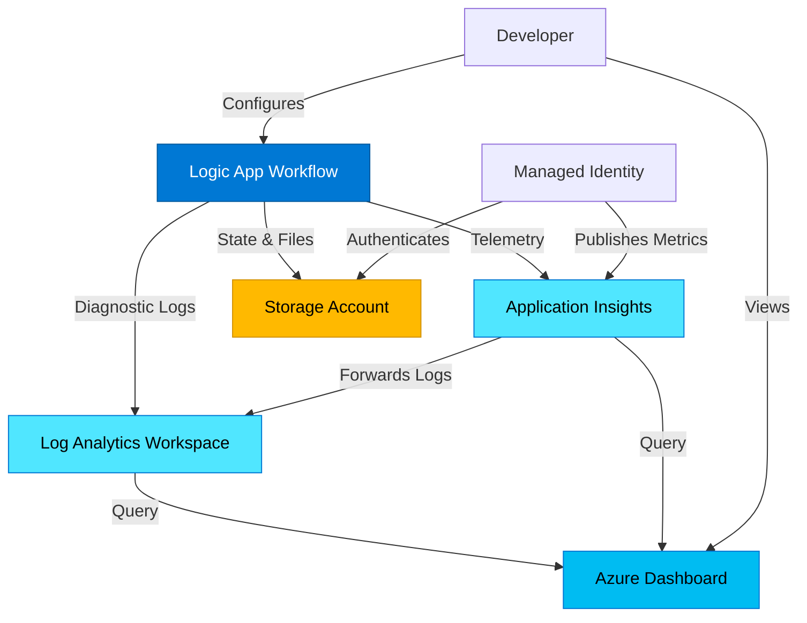

# Azure Logic Apps Monitoring

A comprehensive Infrastructure as Code (IaC) solution demonstrating monitoring and observability best practices for Azure Logic Apps using Azure Monitor. This project provides production-ready Bicep templates for deploying Logic Apps with integrated monitoring, diagnostics, and custom dashboards.

[](https://github.com)
[](LICENSE.md)
[](CONTRIBUTING.md)

---

## Features

### Comprehensive Monitoring
Provides end-to-end observability for Azure Logic Apps with integrated Application Insights, Log Analytics workspaces, and Azure Monitor health models.

| Feature | Description |
|---------|-------------|
| **Application Insights Integration** | Captures telemetry data, performance metrics, and diagnostic logs for Logic App workflows |
| **Log Analytics Workspace** | Centralized log aggregation with 30-day retention and automatic purge capabilities |
| **Azure Monitor Health Model** | Hierarchical service group structure for organizing and monitoring resources at scale |
| **Diagnostic Settings** | Automatic configuration of diagnostic logs and metrics for all deployed resources |

### Metrics & Telemetry
Pre-configured dashboards and monitoring capabilities for tracking Logic App performance and health.

| Feature | Description |
|---------|-------------|
| **Workflow Metrics Dashboard** | Real-time visualization of workflow runs, triggers, actions, and failure rates |
| **App Service Plan Dashboard** | CPU, memory, network traffic, and HTTP queue length monitoring |
| **Custom KQL Queries** | Ready-to-use Kusto Query Language (KQL) queries for deep analysis |
| **Automated Alerts** (coming soon) | Proactive notifications for workflow failures and performance degradation |

### Security & Compliance
Implements Azure security best practices with managed identities and Role-Based Access Control (RBAC).

| Feature | Description |
|---------|-------------|
| **Managed Identity** | System-assigned and user-assigned identities for secure authentication |
| **RBAC Role Assignments** | Least-privilege access to Storage Accounts, Application Insights, and monitoring resources |
| **Secure Storage Access** | Connection strings managed through Azure Key Vault integration patterns |
| **Network Security** | Public network access controls with optional private endpoint support |

### Infrastructure as Code
Modular Bicep templates following Azure Well-Architected Framework principles.

| Feature | Description |
|---------|-------------|
| **Modular Design** | Reusable components for monitoring, shared resources, and Logic Apps |
| **Azure Developer CLI Support** | Simplified deployment with `azd` (Azure Developer CLI) |
| **Parameterized Configuration** | Environment-specific settings via parameters and environment variables |
| **Resource Tagging** | Consistent tagging strategy for cost management and governance |

---

## Prerequisites

Before deploying this solution, ensure you have:

- **Azure Subscription**: An active Azure subscription with sufficient permissions to create resources
- **Azure CLI**: Version 2.50.0 or higher ([Install Guide](https://learn.microsoft.com/cli/azure/install-azure-cli))
- **Azure Developer CLI (azd)**: Version 1.5.0 or higher ([Install Guide](https://learn.microsoft.com/azure/developer/azure-developer-cli/install-azd))
- **Bicep**: Version 0.20.0 or higher (included with Azure CLI)
- **Permissions**: Contributor or Owner role on the target subscription

---

## Installation & Setup

### Step 1: Clone the Repository

Clone this repository to your local machine:

```bash
git clone https://github.com/yourusername/Azure-LogicApps-Monitoring.git
cd Azure-LogicApps-Monitoring
```

### Step 2: Initialize Azure Developer CLI

Initialize the project with Azure Developer CLI:

```bash
azd init
```

When prompted, provide:
- **Environment Name**: A unique name for your deployment (e.g., `dev`, `prod`)
- **Azure Subscription**: Select your target subscription
- **Azure Location**: Choose a region (e.g., `eastus`, `westus2`)

### Step 3: Configure Environment Variables

Set the deployment location (or use the `.azure/.env` file):

```bash
azd env set AZURE_LOCATION eastus
```

### Step 4: Deploy the Infrastructure

Deploy all resources using Azure Developer CLI:

```bash
azd up
```

This command will:
1. Provision the resource group
2. Deploy the Log Analytics workspace
3. Deploy Application Insights
4. Deploy the Storage Account with RBAC roles
5. Deploy the Logic App with monitoring enabled
6. Create Azure Monitor dashboards

### Step 5: Verify Deployment

After deployment completes, verify resources in the Azure Portal:

```bash
azd env get-values
```

Note the output values:
- `AZURE_LOG_ANALYTICS_WORKSPACE_ID`
- `AZURE_APPLICATION_INSIGHTS_CONNECTION_STRING`
- `STORAGE_ACCOUNT_NAME`

---

## Usage Examples

### View Application Insights Telemetry

Navigate to Application Insights in the Azure Portal to view:

1. **Live Metrics**: Real-time performance monitoring
2. **Application Map**: Dependency visualization
3. **Failures**: Exception tracking and error analysis
4. **Performance**: Response time and throughput analysis

### Query Log Analytics Workspace

Run KQL (Kusto Query Language) queries to analyze workflow execution:

```kql
// Get failed workflow runs in the last 24 hours
AzureDiagnostics
| where ResourceProvider == "MICROSOFT.WEB"
| where Category == "WorkflowRuntime"
| where status_s == "Failed"
| where TimeGenerated > ago(24h)
| project TimeGenerated, workflowName_s, runId_s, error_message_s
| order by TimeGenerated desc
```

### Access Pre-configured Dashboards

Two dashboards are automatically created:

1. **Service Plan Metrics Dashboard**: Monitor App Service Plan resource utilization
2. **Tax-Docs-Workflows Dashboard**: Track workflow execution metrics

Access dashboards:
1. Open the Azure Portal
2. Navigate to **Dashboard Hub**
3. Select the deployed dashboard by name

### Export Metrics for Reporting

Export metrics using Azure CLI:

```bash
az monitor metrics list \
  --resource /subscriptions/{subscription-id}/resourceGroups/{resource-group}/providers/Microsoft.Web/sites/{logic-app-name} \
  --metric WorkflowRunsCompleted WorkflowRunsFailureRate \
  --start-time 2024-01-01T00:00:00Z \
  --end-time 2024-01-31T23:59:59Z \
  --interval PT1H \
  --output table
```

---

## Architecture

### System Context Diagram (C4 Model)

```
workspace {
    model {
        user = person "Developer/Operator" "Monitors and manages Logic App workflows"
        
        logicAppSystem = softwareSystem "Azure Logic Apps Monitoring System" "Provides monitoring and observability for Logic App workflows" {
            logicApp = container "Logic App" "Azure Logic Apps (Standard)" "Executes workflows with built-in monitoring"
            appInsights = container "Application Insights" "Azure Monitor" "Collects telemetry and performance data"
            logAnalytics = container "Log Analytics" "Azure Monitor" "Stores and analyzes diagnostic logs"
            storage = container "Storage Account" "Azure Storage" "Stores workflow state and artifacts"
            dashboard = container "Azure Dashboard" "Azure Portal" "Visualizes metrics and health status"
        }
        
        user -> dashboard "Views metrics and logs"
        logicApp -> appInsights "Sends telemetry"
        logicApp -> logAnalytics "Sends diagnostic logs"
        logicApp -> storage "Reads/Writes workflow data"
        appInsights -> logAnalytics "Forwards data"
        dashboard -> logAnalytics "Queries data"
        dashboard -> appInsights "Queries data"
    }
    
    views {
        systemContext logicAppSystem "SystemContext" {
            include *
            autoLayout
        }
    }
}
```

### Data Flow Diagram


```mermaid
graph TB
    A[Logic App Workflow] -->|Telemetry| B[Application Insights]
    A -->|Diagnostic Logs| C[Log Analytics Workspace]
    A -->|State & Files| D[Storage Account]
    
    B -->|Forwards Logs| C
    
    C -->|Query| E[Azure Dashboard]
    B -->|Query| E
    
    F[Developer] -->|Views| E
    F -->|Configures| A
    
    G[Managed Identity] -->|Authenticates| D
    G -->|Publishes Metrics| B
    
    style A fill:#0078D4,stroke:#005A9E,color:#fff
    style B fill:#50E6FF,stroke:#0078D4,color:#000
    style C fill:#50E6FF,stroke:#0078D4,color:#000
    style D fill:#FFB900,stroke:#D39200,color:#000
    style E fill:#00BCF2,stroke:#0078D4,color:#000
```

### Key Components

| Component | Description | Purpose | Key Features |
|-----------|-------------|---------|--------------|
| **Logic App (Standard)** | Azure Logic Apps running on App Service Plan | Execute workflows with monitoring | System-assigned identity, diagnostic logging, Application Insights integration |
| **Application Insights** | Application Performance Management (APM) service | Collect and analyze telemetry | Live metrics, dependency tracking, custom events, distributed tracing |
| **Log Analytics Workspace** | Centralized log repository | Store and query diagnostic data | KQL queries, 30-day retention, data export, workbook integration |
| **Storage Account** | Azure Blob, Queue, Table, File storage | Persist workflow state and artifacts | RBAC-enabled, managed identity access, LRS replication |
| **App Service Plan** | Hosting infrastructure for Logic Apps | Provide compute resources | Workflow Standard tier (WS1), elastic scaling, zone redundancy support |
| **Azure Dashboard** | Custom monitoring dashboards | Visualize metrics and KPIs | Pre-configured charts, real-time updates, shared access |

### RBAC Roles Configured

| Role Name | Role Description | Documentation Link |
|-----------|------------------|-------------------|
| **Storage Account Contributor** | Manage storage accounts (not data access) | [Learn More](https://learn.microsoft.com/azure/role-based-access-control/built-in-roles#storage-account-contributor) |
| **Storage Blob Data Owner** | Full access to blob containers and data | [Learn More](https://learn.microsoft.com/azure/role-based-access-control/built-in-roles#storage-blob-data-owner) |
| **Storage Queue Data Contributor** | Read, write, delete queue messages | [Learn More](https://learn.microsoft.com/azure/role-based-access-control/built-in-roles#storage-queue-data-contributor) |
| **Storage Table Data Contributor** | Read, write, delete table data | [Learn More](https://learn.microsoft.com/azure/role-based-access-control/built-in-roles#storage-table-data-contributor) |
| **Monitoring Metrics Publisher** | Publish custom metrics to Azure Monitor | [Learn More](https://learn.microsoft.com/azure/role-based-access-control/built-in-roles#monitoring-metrics-publisher) |
| **Storage File Data Privileged Contributor** | Full access to Azure file shares via SMB | [Learn More](https://learn.microsoft.com/azure/role-based-access-control/built-in-roles#storage-file-data-privileged-contributor) |

---

## File Structure

```
azure-logicapps-monitoring/
├── .azure/
│   ├── .gitignore
│   └── config.json                    # Azure Developer CLI configuration
├── infra/
│   ├── main.bicep                     # Root infrastructure template
│   └── main.parameters.json           # Deployment parameters
├── src/
│   ├── logic-app.bicep                # Logic App and App Service Plan
│   ├── monitoring/
│   │   ├── main.bicep                 # Monitoring orchestration module
│   │   ├── app-insights.bicep         # Application Insights configuration
│   │   ├── log-analytics-workspace.bicep  # Log Analytics workspace
│   │   └── azure-monitor-health-model.bicep  # Health model service groups
│   └── shared/
│       ├── main.bicep                 # Shared resources orchestration
│       └── data/
│           └── main.bicep             # Storage Account with RBAC
├── .gitignore
├── azure.yaml                         # Azure Developer CLI project definition
├── CODE_OF_CONDUCT.md
├── CONTRIBUTING.md
├── LICENSE.md
├── README.md
└── SECURITY.md
```

### Key Files Explained

| File Name | File Path | Description |
|-----------|-----------|-------------|
| **azure.yaml** | azure.yaml | Azure Developer CLI project definition specifying project name and structure |
| **main.bicep** | main.bicep | Root Bicep template orchestrating all infrastructure deployments at subscription scope |
| **main.parameters.json** | main.parameters.json | Parameter file for main deployment containing location and environment variables |
| **logic-app.bicep** | logic-app.bicep | Logic App and App Service Plan deployment with diagnostic settings and dashboards |
| **main.bicep** | main.bicep | Monitoring infrastructure orchestration (Log Analytics, App Insights, Health Model) |
| **app-insights.bicep** | app-insights.bicep | Application Insights configuration with RBAC roles and diagnostic settings |
| **log-analytics-workspace.bicep** | log-analytics-workspace.bicep | Log Analytics workspace with system-assigned identity and retention policies |
| **azure-monitor-health-model.bicep** | azure-monitor-health-model.bicep | Azure Monitor service groups for hierarchical health modeling |
| **main.bicep** | main.bicep | Shared resources orchestration (managed identity, storage, monitoring) |
| **main.bicep** | main.bicep | Storage Account deployment with comprehensive RBAC role assignments |

---

## Additional Resources

### Azure Logic Apps
- [Azure Logic Apps Documentation](https://learn.microsoft.com/azure/logic-apps/)
- [Logic Apps Standard vs Consumption](https://learn.microsoft.com/azure/logic-apps/logic-apps-overview#logic-app-resource-type-and-host-environment-differences)
- [Monitor Logic Apps with Azure Monitor](https://learn.microsoft.com/azure/logic-apps/monitor-workflows-collect-diagnostic-data)

### Azure Monitor
- [Azure Monitor Overview](https://learn.microsoft.com/azure/azure-monitor/overview)
- [Log Analytics Tutorial](https://learn.microsoft.com/azure/azure-monitor/logs/log-analytics-tutorial)
- [Application Insights Overview](https://learn.microsoft.com/azure/azure-monitor/app/app-insights-overview)
- [KQL Quick Reference](https://learn.microsoft.com/azure/data-explorer/kusto/query/)

### Infrastructure as Code
- [Bicep Documentation](https://learn.microsoft.com/azure/azure-resource-manager/bicep/)
- [Azure Developer CLI](https://learn.microsoft.com/azure/developer/azure-developer-cli/overview)
- [Azure Well-Architected Framework](https://learn.microsoft.com/azure/well-architected/)

### Security & Compliance
- [Azure RBAC Documentation](https://learn.microsoft.com/azure/role-based-access-control/overview)
- [Managed Identities Overview](https://learn.microsoft.com/azure/active-directory/managed-identities-azure-resources/overview)

---

## Support

### Getting Help

If you encounter issues or have questions:

1. **Check Existing Issues**: Search GitHub Issues for similar problems
2. **Open a New Issue**: Create a detailed issue report with:
   - Clear description of the problem
   - Steps to reproduce
   - Expected vs actual behavior
   - Deployment logs (sanitize sensitive data)
   - Azure CLI/azd version information

3. **Start a Discussion**: For questions or feature requests, use GitHub Discussions

### Community Guidelines

Please review our Code of Conduct and Contributing Guidelines before participating.

### Security Vulnerabilities

To report security vulnerabilities, please follow our Security Policy. Do not create public GitHub issues for security concerns.

---

## License

This project is licensed under the MIT License - see the LICENSE.md file for details.

---

## Acknowledgments

This project follows Azure best practices and guidance from:
- [Azure Logic Apps Documentation](https://learn.microsoft.com/azure/logic-apps/)
- [Azure Well-Architected Framework](https://learn.microsoft.com/azure/well-architected/)
- [Azure Bicep Best Practices](https://learn.microsoft.com/azure/azure-resource-manager/bicep/best-practices)