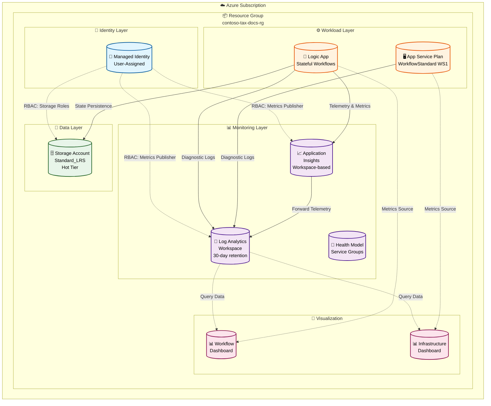
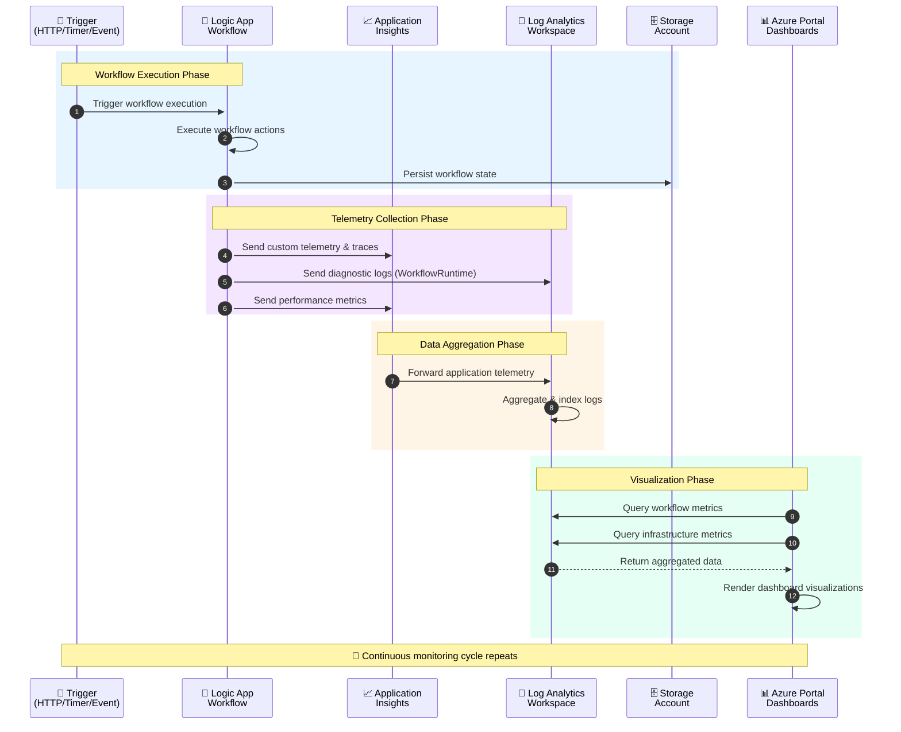

# Azure Logic Apps Monitoring

A comprehensive monitoring and observability solution demonstrating production-ready best practices for Azure Logic Apps workflows using Azure Monitor, Application Insights, and Log Analytics.


---

## Table of Contents

- [Project Overview](#project-overview)
- [Features](#features)
- [Architecture](#architecture)
- [File Structure](#file-structure)
- [Prerequisites](#prerequisites)
- [Installation & Setup](#installation--setup)
- [Usage Examples](#usage-examples)
- [Additional Resources](#additional-resources)
- [Support](#support)

---

## Project Overview

This project provides a complete Infrastructure as Code (IaC) solution for monitoring Azure Logic Apps using Azure Monitor. It demonstrates enterprise-grade observability patterns including centralized logging, custom dashboards, health modeling, and Role-Based Access Control (RBAC = Role-Based Access Control) for secure, passwordless authentication. Ideal for developers and cloud architects learning monitoring best practices for serverless workflows.

---

## Features

### Comprehensive Monitoring

End-to-end observability for Logic Apps workflows with automated diagnostics and real-time insights using Azure Monitor.

| Feature | Description |
|---------|-------------|
| **Azure Monitor Integration** | Full-stack monitoring with Log Analytics Workspace and Application Insights for centralized telemetry |
| **Health Model Management** | Azure Monitor Health Model using Service Groups for hierarchical resource organization |
| **Diagnostic Settings** | Automated diagnostic configuration for all Azure resources with logs and metrics collection |
| **Custom Dashboards** | Pre-configured Azure Portal dashboards visualizing workflow and infrastructure performance |

### Metrics & Telemetry

Track workflow performance, failures, and resource utilization with pre-configured metrics and alerts.

| Feature | Description |
|---------|-------------|
| **Workflow Runtime Metrics** | Monitor workflow runs, completions, failures, and execution duration in real-time |
| **Action-Level Telemetry** | Track individual action success rates, failure patterns, and performance bottlenecks |
| **Trigger Monitoring** | Monitor trigger completions, failures, and dispatched runs to identify issues early |
| **Infrastructure Metrics** | Track CPU, memory, network I/O, and HTTP queue length for App Service Plans |

### Security & Compliance

Identity-based access control with Azure RBAC for secure, passwordless authentication and compliance.

| Feature | Description |
|---------|-------------|
| **Managed Identity** | User-assigned managed identity for workload authentication without credentials |
| **RBAC Integration** | Granular role assignments for Storage, Application Insights, and Log Analytics resources |
| **Secure Configuration** | HTTPS-only storage accounts with proper access tiers and secure endpoints |
| **Audit Logging** | Complete audit trail through Azure Monitor diagnostic logs for compliance requirements |

### Infrastructure as Code

Fully automated deployment using Azure Bicep with modular, reusable architecture patterns.

| Feature | Description |
|---------|-------------|
| **Modular Bicep Templates** | Separate, reusable modules for monitoring, data, and workload components |
| **Azure Developer CLI** | Simplified deployment workflow using `azd` for consistent environments |
| **Parameterized Deployment** | Environment-specific configuration through parameter files for flexibility |
| **Resource Tagging** | Comprehensive tagging strategy for cost management, governance, and organization |

---

## Architecture

### Solution Architecture


```mermaid
graph TB
    subgraph Azure["☁️ Azure Subscription"]
        subgraph RG["📦 Resource Group<br/>contoso-tax-docs-rg"]
            
            subgraph Identity["🔐 Identity Layer"]
                MI[("👤 Managed Identity<br/>User-Assigned")]
            end
            
            subgraph Monitor["📊 Monitoring Layer"]
                LAW[("📝 Log Analytics<br/>Workspace<br/>30-day retention")]
                AI[("📈 Application<br/>Insights<br/>Workspace-based")]
                HM[("🏥 Health Model<br/>Service Groups")]
            end
            
            subgraph Data["💾 Data Layer"]
                SA[("🗄️ Storage Account<br/>Standard_LRS<br/>Hot Tier")]
            end
            
            subgraph Workload["⚙️ Workload Layer"]
                ASP[("🖥️ App Service Plan<br/>WorkflowStandard WS1")]
                LA[("🔄 Logic App<br/>Stateful Workflows")]
            end
            
            subgraph Visual["📱 Visualization"]
                D1[("📊 Workflow<br/>Dashboard")]
                D2[("📊 Infrastructure<br/>Dashboard")]
            end
            
        end
    end
    
    %% Identity Connections
    MI -.->|RBAC: Storage Roles| SA
    MI -.->|RBAC: Metrics Publisher| AI
    MI -.->|RBAC: Metrics Publisher| LAW
    
    %% Workload to Monitoring
    LA -->|Telemetry & Metrics| AI
    LA -->|Diagnostic Logs| LAW
    LA -->|State Persistence| SA
    ASP -->|Diagnostic Logs| LAW
    
    %% Monitoring Integration
    AI -->|Forward Telemetry| LAW
    
    %% Visualization
    LAW -.->|Query Data| D1
    LAW -.->|Query Data| D2
    LA -.->|Metrics Source| D1
    ASP -.->|Metrics Source| D2
    
    %% Styling
    classDef identityStyle fill:#e1f5fe,stroke:#01579b,stroke-width:2px,color:#000
    classDef monitorStyle fill:#f3e5f5,stroke:#4a148c,stroke-width:2px,color:#000
    classDef dataStyle fill:#e8f5e9,stroke:#1b5e20,stroke-width:2px,color:#000
    classDef workloadStyle fill:#fff3e0,stroke:#e65100,stroke-width:2px,color:#000
    classDef visualStyle fill:#fce4ec,stroke:#880e4f,stroke-width:2px,color:#000
    
    class MI identityStyle
    class LAW,AI,HM monitorStyle
    class SA dataStyle
    class ASP,LA workloadStyle
    class D1,D2 visualStyle
```

### Data Flow


```mermaid
sequenceDiagram
    autonumber
    
    participant T as 🔔 Trigger<br/>(HTTP/Timer/Event)
    participant LW as 🔄 Logic App<br/>Workflow
    participant AI as 📈 Application<br/>Insights
    participant LAW as 📝 Log Analytics<br/>Workspace
    participant SA as 🗄️ Storage<br/>Account
    participant D as 📊 Azure Portal<br/>Dashboards
    
    rect rgb(230, 245, 255)
        Note over T,LW: Workflow Execution Phase
        T->>+LW: Trigger workflow execution
        LW->>LW: Execute workflow actions
        LW->>SA: Persist workflow state
    end
    
    rect rgb(245, 230, 255)
        Note over LW,LAW: Telemetry Collection Phase
        LW->>AI: Send custom telemetry & traces
        LW->>LAW: Send diagnostic logs (WorkflowRuntime)
        LW->>AI: Send performance metrics
    end
    
    rect rgb(255, 245, 230)
        Note over AI,LAW: Data Aggregation Phase
        AI->>LAW: Forward application telemetry
        LAW->>LAW: Aggregate & index logs
    end
    
    rect rgb(230, 255, 245)
        Note over LAW,D: Visualization Phase
        D->>LAW: Query workflow metrics
        D->>LAW: Query infrastructure metrics
        LAW-->>D: Return aggregated data
        D->>D: Render dashboard visualizations
    end
    
    Note over T,D: 🔄 Continuous monitoring cycle repeats
```

### Key Components

| Component | Description | Purpose | Key Features |
|-----------|-------------|---------|--------------|
| **Log Analytics Workspace** | Central log aggregation service | Collect, analyze, and query logs from all Azure resources | 30-day retention, PerGB2018 pricing tier, system-assigned identity, Kusto Query Language (KQL) support |
| **Application Insights** | Application performance monitoring (APM) | Track Logic App telemetry, custom metrics, and distributed tracing | Workspace-based configuration, instrumentation key, connection string, live metrics stream |
| **Storage Account** | Durable storage service | Store Logic App runtime state, file shares, and workflow artifacts | Standard_LRS replication, Hot access tier, HTTPS-only enforcement, managed identity access |
| **App Service Plan** | Managed compute infrastructure | Host and scale Logic App workflows with elastic capacity | WorkflowStandard tier (WS1), elastic scaling enabled, up to 20 workers, zone-redundancy support |
| **Logic App** | Serverless workflow orchestration | Execute business logic, integrations, and automated processes | Stateful workflows, built-in connectors, Azure Monitor integration, diagnostic settings |
| **Managed Identity** | Azure AD identity for resources | Enable passwordless authentication to Azure services | User-assigned type, automatic credential rotation, RBAC role assignments |
| **Azure Monitor Health Model** | Hierarchical service organization | Organize monitoring resources into logical service groups | Tenant-level deployment, service group hierarchy, health state tracking |

### RBAC Roles

The following Azure built-in roles are assigned to the managed identity for secure, passwordless access:

| Role Name | Role Description | Documentation Link |
|-----------|------------------|-------------------|
| **Storage Account Contributor** | Manage storage accounts but not access to data within them | [Documentation](https://learn.microsoft.com/azure/role-based-access-control/built-in-roles#storage-account-contributor) |
| **Storage Blob Data Owner** | Full access to Azure Storage blob containers and data, including ACL assignment | [Documentation](https://learn.microsoft.com/azure/role-based-access-control/built-in-roles#storage-blob-data-owner) |
| **Storage Queue Data Contributor** | Read, write, and delete Azure Storage queues and queue messages | [Documentation](https://learn.microsoft.com/azure/role-based-access-control/built-in-roles#storage-queue-data-contributor) |
| **Storage Table Data Contributor** | Read, write, and delete Azure Storage tables and table entities | [Documentation](https://learn.microsoft.com/azure/role-based-access-control/built-in-roles#storage-table-data-contributor) |
| **Storage File Data Privileged Contributor** | Read, write, delete, and modify ACLs on files and directories in Azure file shares | [Documentation](https://learn.microsoft.com/azure/role-based-access-control/built-in-roles#storage-file-data-privileged-contributor) |
| **Monitoring Metrics Publisher** | Enable publishing metrics against Azure resources for custom monitoring scenarios | [Documentation](https://learn.microsoft.com/azure/role-based-access-control/built-in-roles#monitoring-metrics-publisher) |

---

## File Structure

```
Azure-LogicApps-Monitoring/
├── .azure/
│   ├── .gitignore
│   ├── config.json                     # Azure Developer CLI environment config
│   └── dev/
│       ├── .env                         # Environment-specific variables
│       └── config.json
├── infra/
│   ├── main.bicep                       # Root subscription-level deployment template
│   └── main.parameters.json             # Environment-specific parameters
├── src/
│   ├── logic-app.bicep                  # Logic App and App Service Plan deployment
│   ├── monitoring/
│   │   ├── main.bicep                   # Monitoring orchestration module
│   │   ├── log-analytics-workspace.bicep
│   │   ├── app-insights.bicep
│   │   └── azure-monitor-health-model.bicep
│   └── shared/
│       ├── main.bicep                   # Shared resources orchestration
│       └── data/
│           └── main.bicep               # Storage account with RBAC assignments
├── .gitignore                           # Git ignore patterns
├── azure.yaml                           # Azure Developer CLI manifest
├── CODE_OF_CONDUCT.md
├── CONTRIBUTING.md
├── LICENSE.md
├── README.md
└── SECURITY.md
```

### Key Files Explained

| File | Name | File Path | Description |
|------|------|-----------|-------------|
| **Root Template** | `main.bicep` | [`infra/main.bicep`](infra/main.bicep) | Subscription-level deployment orchestrating resource group, shared resources, and workload components |
| **Logic App Deployment** | `logic-app.bicep` | [`src/logic-app.bicep`](src/logic-app.bicep) | Deploys App Service Plan, Logic App with diagnostic settings, and custom Azure Portal dashboards |
| **Monitoring Orchestration** | `main.bicep` | [`src/monitoring/main.bicep`](src/monitoring/main.bicep) | Coordinates deployment of Log Analytics, Application Insights, and Health Model with dependencies |
| **Log Analytics Workspace** | `log-analytics-workspace.bicep` | [`src/monitoring/log-analytics-workspace.bicep`](src/monitoring/log-analytics-workspace.bicep) | Creates workspace with 30-day retention, PerGB2018 pricing, and system-assigned identity |
| **Application Insights** | `app-insights.bicep` | [`src/monitoring/app-insights.bicep`](src/monitoring/app-insights.bicep) | Deploys workspace-based Application Insights with RBAC, diagnostic settings, and monitoring integration |
| **Health Model** | `azure-monitor-health-model.bicep` | [`src/monitoring/azure-monitor-health-model.bicep`](src/monitoring/azure-monitor-health-model.bicep) | Creates Azure Monitor Service Group for hierarchical resource organization at tenant scope |
| **Shared Resources** | `main.bicep` | [`src/shared/main.bicep`](src/shared/main.bicep) | Deploys managed identity, storage account, and integrates monitoring components |
| **Storage & RBAC** | `main.bicep` | [`src/shared/data/main.bicep`](src/shared/data/main.bicep) | Creates storage account with comprehensive RBAC role assignments for managed identity |
| **Parameters File** | `main.parameters.json` | [`infra/main.parameters.json`](infra/main.parameters.json) | Environment-specific parameter values for deployment customization |
| **Azure Developer CLI Manifest** | `azure.yaml` | [`azure.yaml`](azure.yaml) | Defines project metadata and deployment configuration for Azure Developer CLI |

---

## Prerequisites

Before deploying this solution, ensure you have the following tools and access:

### Required Tools

- **Azure Subscription** with Owner or Contributor access
- **Azure Developer CLI (azd)** version 1.0.0 or later
  - [Install azd](https://learn.microsoft.com/azure/developer/azure-developer-cli/install-azd)
- **Azure CLI** version 2.50.0 or later
  - [Install Azure CLI](https://learn.microsoft.com/cli/azure/install-azure-cli)
- **Bicep CLI** - Automatically included with Azure CLI 2.20.0+
  - Verify: `az bicep version`

### Recommended Tools

- **Visual Studio Code** with extensions:
  - [Azure Bicep](https://marketplace.visualstudio.com/items?itemName=ms-azuretools.vscode-bicep) - Bicep language support and validation
  - [Azure Logic Apps (Standard)](https://marketplace.visualstudio.com/items?itemName=ms-azuretools.vscode-azurelogicapps) - Logic Apps authoring and debugging
  - [Azure Account](https://marketplace.visualstudio.com/items?itemName=ms-vscode.azure-account) - Azure authentication in VS Code

### Azure Permissions

Your Azure account needs:

- **Subscription-level permissions**: `Owner` or `Contributor` + `User Access Administrator`
- **Required for**: Creating resource groups, assigning RBAC roles, and deploying resources

---

## Installation & Setup

Follow these steps to deploy the Azure Logic Apps monitoring solution to your Azure subscription.

### Step 1: Clone the Repository

Clone this repository to your local machine:

```bash
git clone https://github.com/your-org/Azure-LogicApps-Monitoring.git
cd Azure-LogicApps-Monitoring
```

### Step 2: Authenticate with Azure

Sign in to your Azure account using Azure Developer CLI:

```bash
azd auth login
```

This will open a browser window for authentication. Follow the prompts to sign in.

### Step 3: Initialize the Environment

Initialize a new Azure Developer CLI environment:

```bash
azd init
```

When prompted, provide the following information:

- **Environment name**: Choose a unique name (e.g., `dev`, `prod`, `staging`)
- **Azure Subscription**: Select your target Azure subscription
- **Azure Location**: Choose an Azure region (e.g., `eastus`, `westus2`, `northeurope`)

The environment configuration is saved in `.azure/<environment-name>/` directory.

### Step 4: Review Configuration (Optional)

Review and customize deployment parameters if needed:

```bash
code infra/main.parameters.json
```

The default configuration includes:

- Solution name: `tax-docs`
- Resource group: `contoso-tax-docs-rg`
- Tags for cost management and organization

### Step 5: Deploy the Infrastructure

Deploy all resources to Azure:

```bash
azd up
```

This command will:

1. ✅ Provision the resource group at subscription level
2. ✅ Deploy managed identity for secure authentication
3. ✅ Create storage account with RBAC role assignments
4. ✅ Deploy Log Analytics Workspace (30-day retention)
5. ✅ Deploy Application Insights (workspace-based)
6. ✅ Create Azure Monitor Health Model service groups
7. ✅ Deploy App Service Plan (WorkflowStandard WS1)
8. ✅ Deploy Logic App with diagnostic settings
9. ✅ Configure custom Azure Portal dashboards

Deployment typically takes **5-10 minutes** to complete.

### Step 6: Verify Deployment

Verify the deployment succeeded:

```bash
azd show
```

View deployed resources in the Azure Portal:

```bash
az portal open --resource-group contoso-tax-docs-rg
```

You should see:

- 1x Resource Group
- 1x Managed Identity
- 1x Storage Account
- 1x Log Analytics Workspace
- 1x Application Insights
- 1x App Service Plan
- 1x Logic App (Standard)
- 2x Dashboards (Workflow + Infrastructure)

---

## Usage Examples

### View Workflow Metrics Dashboard

Navigate to the pre-configured workflow dashboard in Azure Portal:

```bash
az portal dashboard show \
  --resource-group contoso-tax-docs-rg \
  --name tax-docs-dashboard
```

The dashboard displays:

- Workflow Actions Failure Rate
- Workflow Job Execution Duration
- Workflow Runs (Completed, Started, Dispatched)
- Workflow Triggers (Completed, Failure Rate)

### Query Logs in Log Analytics

Query workflow runtime logs using Azure CLI:

```bash
az monitor log-analytics query \
  --workspace <your-workspace-id> \
  --analytics-query "AzureDiagnostics | where ResourceType == 'WORKFLOWS' | take 100" \
  --output table
```

Replace `<your-workspace-id>` with your Log Analytics Workspace resource ID.

### Monitor Workflow Runs

List recent workflow runs:

```bash
az logicapp workflow run list \
  --resource-group contoso-tax-docs-rg \
  --name <your-logic-app-name> \
  --output table
```

Get details of a specific workflow run:

```bash
az logicapp workflow run show \
  --resource-group contoso-tax-docs-rg \
  --name <your-logic-app-name> \
  --run-name <run-id>
```

### View Application Insights Metrics

Query Application Insights metrics:

```bash
az monitor app-insights metrics show \
  --app <your-app-insights-name> \
  --resource-group contoso-tax-docs-rg \
  --metric "requests/count" \
  --aggregation count \
  --output table
```

### Custom KQL Query: Failed Workflow Actions

Navigate to your Log Analytics Workspace in the Azure Portal and run this Kusto Query Language (KQL) query:

```kql
AzureDiagnostics
| where ResourceType == "WORKFLOWS"
| where status_s == "Failed"
| summarize FailureCount = count() by workflowName_s, actionName_s, bin(TimeGenerated, 1h)
| order by FailureCount desc
| render timechart
```

This query:

1. Filters for failed workflow actions
2. Groups failures by workflow name and action name
3. Aggregates by hour
4. Sorts by failure count
5. Renders a time chart visualization

### Access Application Insights Live Metrics

View real-time telemetry:

```bash
az portal open \
  --resource-id "/subscriptions/<subscription-id>/resourceGroups/contoso-tax-docs-rg/providers/Microsoft.Insights/components/<app-insights-name>"
```

Navigate to **Live Metrics** in the left menu to see:

- Incoming request rate
- Outgoing request duration
- Overall health
- Server performance (CPU, Memory)

---

## Additional Resources

### Official Microsoft Documentation

- **Azure Logic Apps**: [Documentation](https://learn.microsoft.com/azure/logic-apps/)
- **Azure Monitor**: [Documentation](https://learn.microsoft.com/azure/azure-monitor/)
- **Application Insights**: [Documentation](https://learn.microsoft.com/azure/azure-monitor/app/app-insights-overview)
- **Log Analytics Workspaces**: [Documentation](https://learn.microsoft.com/azure/azure-monitor/logs/log-analytics-workspace-overview)
- **Azure Bicep**: [Documentation](https://learn.microsoft.com/azure/azure-resource-manager/bicep/)
- **Azure Developer CLI**: [Documentation](https://learn.microsoft.com/azure/developer/azure-developer-cli/)

### Best Practices & Guidance

- **Azure Well-Architected Framework**: [Framework Overview](https://learn.microsoft.com/azure/well-architected/)
- **Logic Apps Monitoring Best Practices**: [Monitoring Guidance](https://learn.microsoft.com/azure/logic-apps/monitor-workflows-collect-diagnostic-data)
- **Azure RBAC Best Practices**: [RBAC Guidance](https://learn.microsoft.com/azure/role-based-access-control/best-practices)
- **Bicep Best Practices**: [Bicep Patterns](https://learn.microsoft.com/azure/azure-resource-manager/bicep/best-practices)
- **Logic Apps Standard**: [Standard Plan Overview](https://learn.microsoft.com/azure/logic-apps/single-tenant-overview-compare)

### Community & Learning

- **Azure Logic Apps Discussions**: [GitHub Discussions](https://github.com/Azure/logicapps/discussions)
- **Azure Monitor Community**: [Tech Community](https://techcommunity.microsoft.com/t5/azure-monitor/bd-p/AzureMonitor)
- **Azure Developer CLI Samples**: [GitHub Repository](https://github.com/Azure/awesome-azd)
- **Bicep Examples**: [Azure Quickstart Templates](https://github.com/Azure/azure-quickstart-templates)

### Video Tutorials

- [Azure Logic Apps (Standard) Overview](https://learn.microsoft.com/shows/azure-friday/azure-logic-apps-standard-overview)
- [Azure Monitor Overview](https://learn.microsoft.com/shows/azure-friday/azure-monitor-overview)
- [Getting Started with Azure Developer CLI](https://learn.microsoft.com/shows/learn-live/getting-started-with-azure-developer-cli)

---

## Support

### Getting Help

- **🐛 Issues**: Report bugs or request features via [GitHub Issues](https://github.com/your-org/Azure-LogicApps-Monitoring/issues)
- **💬 Discussions**: Ask questions and share ideas in [GitHub Discussions](https://github.com/your-org/Azure-LogicApps-Monitoring/discussions)
- **📧 Azure Support**: For Azure-specific issues, contact [Azure Support](https://azure.microsoft.com/support/options/)
- **📚 Documentation**: Check [Additional Resources](#additional-resources) for comprehensive guides

### Contributing

We welcome contributions from the community! To contribute:

1. Read our [Contributing Guidelines](CONTRIBUTING.md)
2. Review the [Code of Conduct](CODE_OF_CONDUCT.md)
3. Fork the repository and create a feature branch
4. Submit a pull request with clear description of changes

Please ensure:

- Bicep templates pass validation: `az bicep build --file <template>.bicep`
- Code follows Azure Bicep best practices
- Documentation is updated for new features
- Tests are included where applicable

### Security

For security vulnerabilities, please see [SECURITY.md](SECURITY.md) for our responsible disclosure policy. **Do not** report security issues via public GitHub issues.

### Roadmap

Planned enhancements:

- 🔔 Azure Monitor Alerts and Action Groups
- 📊 Workbooks for advanced analytics
- 🔄 CI/CD pipeline templates (GitHub Actions, Azure DevOps)
- 🌍 Multi-region deployment support
- 📦 Terraform version for multi-cloud teams

---

## License

This project is licensed under the **MIT License** - see the [LICENSE.md](LICENSE.md) file for details.

---

## Acknowledgments

- Built with ❤️ using [Azure Bicep](https://learn.microsoft.com/azure/azure-resource-manager/bicep/)
- Deployed using [Azure Developer CLI (azd)](https://learn.microsoft.com/azure/developer/azure-developer-cli/)
- Monitoring powered by [Azure Monitor](https://azure.microsoft.com/services/monitor/)
- Inspired by the [Azure Well-Architected Framework](https://learn.microsoft.com/azure/well-architected/)

---

**⚠️ Note**: Replace `your-org` in URLs with your actual GitHub organization or username before publishing this README.

**📝 Quick Start**: New to this project? Start with [Prerequisites](#prerequisites) → [Installation & Setup](#installation--setup) → [Usage Examples](#usage-examples)

---

<div align="center">

**[⬆ Back to Top](#azure-logic-apps-monitoring)**

Made with 💙 for the Azure community

</div>