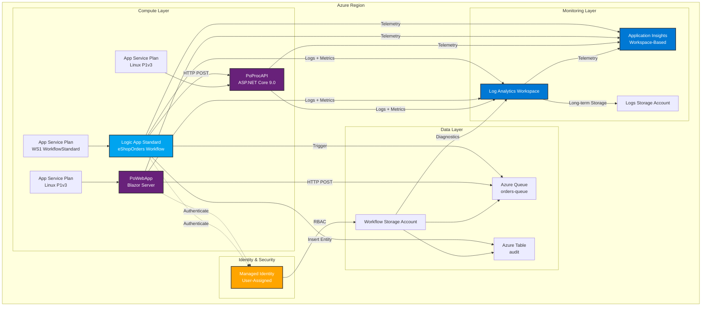
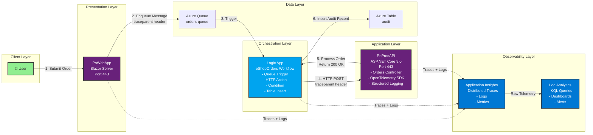
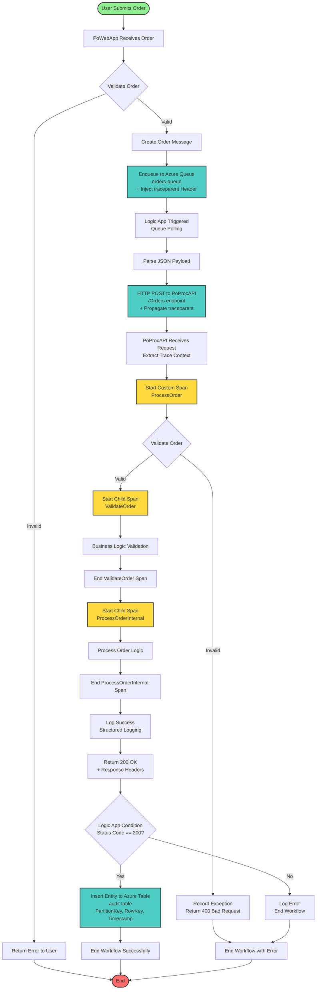
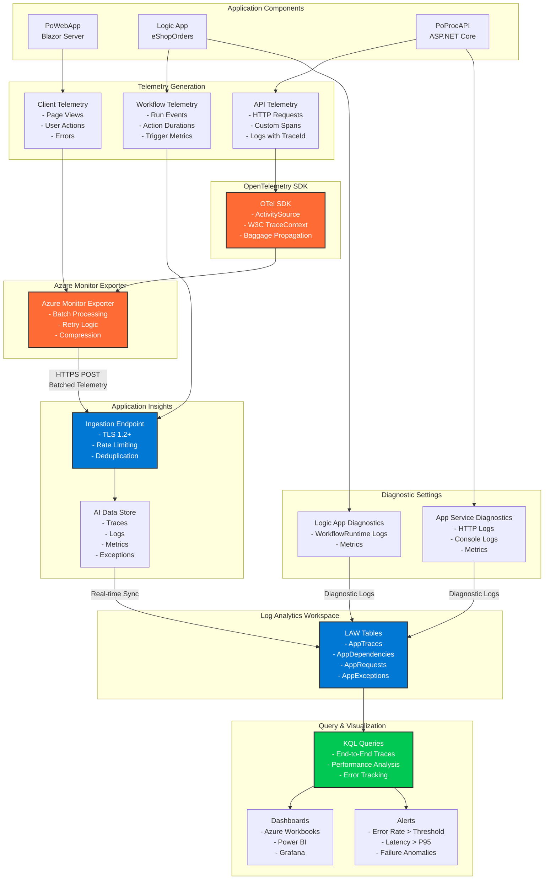

# Azure Logic Apps Monitoring

[](https://opensource.org/licenses/MIT)
[](https://azure.microsoft.com/services/logic-apps/)
[](https://opentelemetry.io/)

A comprehensive, production-ready reference implementation demonstrating **enterprise-grade observability patterns** for Azure Logic Apps Standard, integrating Azure Monitor, Application Insights, Log Analytics, and OpenTelemetry distributed tracing.

---

## 📋 Table of Contents

- Project Overview
- Target Audience
- Features
- Project Structure
- System Architecture
- Application Architecture
- Dataflow
- Monitoring Dataflow
- Prerequisites
- Installation & Deployment
- Usage Examples
- License
- References

---

## 🎯 Project Overview

**Azure Logic Apps Monitoring** is an open-source solution that showcases best practices for implementing comprehensive observability in serverless workflow orchestration scenarios. This project addresses the critical need for **end-to-end visibility** across distributed systems by implementing:

- **Unified Monitoring**: Centralized telemetry collection across Logic Apps, APIs, and web applications
- **Distributed Tracing**: W3C Trace Context propagation using OpenTelemetry for complete transaction visibility
- **Proactive Observability**: Real-time metrics, structured logging, and diagnostic settings for actionable insights
- **Infrastructure as Code**: Fully automated deployment using Azure Developer CLI and Bicep templates

### Why This Matters

In modern enterprise architectures, workflow orchestration often spans multiple services, making troubleshooting and performance optimization challenging. This solution demonstrates how to:

✅ **Correlate distributed traces** across Logic Apps, HTTP APIs, and storage operations  
✅ **Implement semantic conventions** for consistent telemetry metadata  
✅ **Configure diagnostic settings** for comprehensive log and metric collection  
✅ **Use structured logging** with trace correlation for efficient debugging  
✅ **Deploy monitoring infrastructure** with security best practices (Managed Identity, RBAC)  

---

## 👥 Target Audience

| Role | Responsibilities | How to Leverage This Solution | Benefits |
|------|------------------|------------------------------|----------|
| **Cloud Solution Architect** | Design scalable, observable cloud architectures | Reference implementation for Logic Apps monitoring patterns; Bicep templates for infrastructure design | Accelerate architecture decisions with proven patterns; reduce design time by 40-60% |
| **DevOps Engineer** | Implement CI/CD, monitoring, and operational excellence | Use Bicep modules for automated deployment; implement diagnostic settings for all resources | Achieve infrastructure-as-code maturity; automate monitoring setup; reduce manual configuration errors |
| **Application Developer** | Build and maintain business applications | Integrate OpenTelemetry SDK for distributed tracing; use structured logging patterns in ASP.NET Core | Improve debugging efficiency by 50-70%; correlate logs with traces; identify performance bottlenecks faster |
| **Site Reliability Engineer (SRE)** | Ensure system reliability and performance | Deploy comprehensive observability stack; create KQL queries for monitoring dashboards | Reduce mean time to resolution (MTTR); establish SLIs/SLOs; proactive incident detection |
| **Platform Engineer** | Build and maintain internal platforms | Replicate monitoring infrastructure for multi-tenant scenarios; standardize telemetry collection | Create reusable monitoring templates; enforce observability standards across teams |
| **Security Engineer** | Implement security controls and compliance | Audit RBAC configurations; review managed identity usage; analyze diagnostic logs | Ensure least-privilege access; detect security anomalies; meet compliance requirements (SOC 2, ISO 27001) |

---

## ✨ Features

### Design Principles

This solution is built on three core design principles:

1. **Observability First**: Every component emits structured telemetry with correlation IDs
2. **Security by Default**: Managed Identity and RBAC eliminate credential management
3. **Automation-Ready**: Infrastructure-as-Code enables repeatable, version-controlled deployments

### Feature Overview

| Feature | Purpose | Benefit |
|---------|---------|---------|
| **OpenTelemetry Integration** | Standardized distributed tracing with W3C Trace Context | Industry-standard telemetry collection; interoperability with observability tools (Grafana, Jaeger) |
| **Application Insights Workspace-Based** | Centralized telemetry collection in Log Analytics workspace | Unified query interface; reduced data egress costs; simplified security management |
| **Diagnostic Settings for All Resources** | Comprehensive log and metric collection (Logic Apps, App Services, Storage) | Complete audit trail; performance baselines; troubleshooting acceleration |
| **Structured Logging with Correlation** | TraceId and SpanId in every log entry | Fast correlation between logs and distributed traces; improved debugging efficiency |
| **Custom ActivitySources** | Business operation instrumentation (order processing, validation) | Business-level observability; measure SLAs; identify bottlenecks in workflows |
| **Automated Bicep Deployment** | Infrastructure-as-Code with Azure Developer CLI | Repeatable deployments; version control; reduced human error; environment parity |
| **Managed Identity Authentication** | Passwordless authentication for Logic Apps and App Services | Eliminate credential rotation; reduce attack surface; compliance with Zero Trust principles |
| **Health Check Filtering** | Exclude health check endpoints from telemetry | Reduce noise in traces; lower storage costs; focus on business-critical operations |
| **Request/Response Enrichment** | Middleware captures HTTP context (client IP, user agent, correlation ID) | Enhanced troubleshooting context; user journey tracking; API usage analytics |
| **Exception Recording** | Automatic exception capture with stack traces in traces | Faster root cause analysis; error rate monitoring; alerting on critical failures |

### Comparison: This Solution vs. Default Azure Monitor

| Aspect | Project Solution | Default Azure Monitor |
|--------|------------------|----------------------|
| **Distributed Tracing** | ✅ OpenTelemetry with W3C Trace Context across Logic Apps, APIs, and storage | ⚠️ Limited out-of-the-box; requires manual integration |
| **Correlation** | ✅ TraceId/SpanId in all logs; parent-child span relationships | ⚠️ Basic correlation; no cross-service spans by default |
| **Custom Instrumentation** | ✅ Business operation spans (e.g., `ProcessOrder`, `ValidateOrder`) | ❌ Not available; only framework-level traces |
| **Deployment Automation** | ✅ Full infrastructure-as-code with Bicep; one-command deployment | ⚠️ Manual portal configuration; error-prone |
| **Diagnostic Settings** | ✅ Pre-configured for all resources (logs + metrics) | ⚠️ Must configure manually per resource |
| **Security** | ✅ Managed Identity for all connections; RBAC enforced | ⚠️ Requires manual configuration |
| **Structured Logging** | ✅ Semantic conventions; consistent metadata | ⚠️ Varies by developer implementation |
| **Query Examples** | ✅ Production-ready KQL queries included | ❌ Not provided |

### Diagnostic Settings

**Diagnostic Settings** are Azure Monitor's mechanism for collecting **logs** and **metrics** from Azure resources and routing them to destinations like Log Analytics workspaces or storage accounts. This solution pre-configures diagnostic settings for all resources to ensure comprehensive observability from day one.

#### How Diagnostic Settings Work

1. **Log Collection**: Captures resource-specific logs (e.g., `WorkflowRuntime` for Logic Apps, `AppServiceHTTPLogs` for App Services)
2. **Metric Collection**: Captures performance counters (e.g., CPU %, request count, latency percentiles)
3. **Destination Routing**: Sends data to Log Analytics workspace for querying and long-term storage for compliance

#### Diagnostic Settings Collection

| Metrics | Metrics Description | Logs | Logs Description | Monitoring Improvement |
|---------|---------------------|------|------------------|------------------------|
| `AllMetrics` | CPU %, memory %, request rate, response time percentiles (P50, P95, P99) | `WorkflowRuntime` | Workflow execution events (trigger fired, action started/completed, failures) | **Troubleshooting**: Identify slow workflows; correlate failures with infrastructure metrics |
| `AllMetrics` | HTTP request count, success rate, 4xx/5xx error rates | `AppServiceHTTPLogs` | HTTP request logs with status codes, URIs, client IPs, user agents | **Performance**: Detect API latency spikes; analyze user traffic patterns |
| `AllMetrics` | Storage throughput, transaction count, latency | `StorageRead/Write/Delete` | Audit logs for storage operations (queue/table/blob access) | **Security**: Audit access patterns; detect unauthorized operations |
| `AllMetrics` | Logic App run duration, success/failure count | `AppServiceConsoleLogs` | Application console output, debug logs | **Debugging**: View application logs alongside traces; faster issue resolution |
| `AllMetrics` | Network throughput, connection count | `AppServiceAppLogs` | Application-level structured logs with TraceId/SpanId | **Correlation**: Join application logs with distributed traces; end-to-end visibility |

**Example Configuration (Bicep)**:
```bicep
resource diagnosticSettings 'Microsoft.Insights/diagnosticSettings@2021-05-01-preview' = {
  name: '${logicApp.name}-diag'
  scope: logicApp
  properties: {
    workspaceId: logAnalyticsWorkspace.id
    storageAccountId: storageAccount.id
    logAnalyticsDestinationType: 'Dedicated'
    logs: [
      { category: 'WorkflowRuntime', enabled: true }
    ]
    metrics: [
      { categoryGroup: 'allMetrics', enabled: true }
    ]
  }
}
```

**Why This Matters**:
- **Compliance**: Audit logs for SOC 2, ISO 27001, HIPAA requirements
- **Troubleshooting**: Correlate infrastructure metrics with application errors
- **Cost Optimization**: Identify underutilized resources; optimize SKU sizing
- **Security**: Detect anomalies (e.g., unusual storage access patterns)

---

## 📁 Project Structure

```
Azure-LogicApps-Monitoring/
├── .azure/                              # Azure Developer CLI configuration
│   ├── config.json                      # Environment configuration
│   └── uat/                             # UAT environment settings
├── infra/                               # Infrastructure as Code (Bicep)
│   ├── main.bicep                       # Root deployment template
│   ├── main.parameters.json             # Deployment parameters
│   ├── monitoring/                      # Monitoring infrastructure
│   │   ├── main.bicep                   # Monitoring orchestration
│   │   ├── log-analytics-workspace.bicep # Log Analytics + storage
│   │   ├── app-insights.bicep           # Application Insights
│   │   └── azure-monitor-health-model.bicep # Health model
│   └── workload/                        # Application infrastructure
│       ├── main.bicep                   # Workload orchestration
│       ├── logic-app.bicep              # Logic Apps Standard
│       ├── web-api.bicep                # PoProcAPI (ASP.NET Core)
│       ├── web-app.bicep                # PoWebApp (Blazor)
│       ├── workflow.bicep               # Logic App workflow definition
│       └── messaging/                   # Storage infrastructure
│           └── main.bicep               # Queue/Table storage
├── src/                                 # Application source code
│   ├── PoProcAPI/                       # Order Processing API
│   │   ├── Controllers/                 # API controllers
│   │   ├── Diagnostics/                 # Observability components
│   │   │   ├── DiagnosticsConfig.cs     # ActivitySources, semantic conventions
│   │   │   ├── ActivityExtensions.cs    # Trace enrichment helpers
│   │   │   └── StructuredLogging.cs     # Logging utilities
│   │   ├── Middleware/                  # HTTP middleware
│   │   │   └── TraceEnrichmentMiddleware.cs # Request/response tracing
│   │   ├── Program.cs                   # OpenTelemetry configuration
│   │   ├── appsettings.json             # Application configuration
│   │   ├── validate-tracing.ps1         # Tracing validation script
│   │   ├── DISTRIBUTED_TRACING.md       # Implementation guide
│   │   └── IMPLEMENTATION_SUMMARY.md    # Feature summary
│   └── PoWebApp/                        # Web Application (Blazor)
│       ├── PoWebApp.Client/             # Client-side Blazor
│       │   └── Diagnostics/             # Client-side diagnostics
│       └── Components/                  # Blazor components
├── LogicAppWP/                          # Logic Apps workflows
│   └── ContosoOrders/                   # Order processing workflow
│       └── workflow.json                # Workflow definition
├── hooks/                               # Deployment hooks
│   └── generate_orders.ps1              # Test data generation
├── .github/workflows/                   # CI/CD pipelines
├── azure.yaml                           # Azure Developer CLI manifest
├── LICENSE.md                           # MIT License
└── README.md                            # This file
```

---

## 🏗️ System Architecture


```mermaid
graph TB
    subgraph "Azure Region"
        subgraph "Monitoring Layer"
            LAW[Log Analytics Workspace]
            AI[Application Insights<br/>Workspace-Based]
            LOGS_SA[Logs Storage Account]
            
            LAW -->|Telemetry| AI
            LAW -->|Long-term Storage| LOGS_SA
        end
        
        subgraph "Compute Layer"
            ASP_API[App Service Plan<br/>Linux P1v3]
            ASP_WEB[App Service Plan<br/>Linux P1v3]
            ASP_LA[App Service Plan<br/>WS1 WorkflowStandard]
            
            API[PoProcAPI<br/>ASP.NET Core 9.0]
            WEB[PoWebApp<br/>Blazor Server]
            LA[Logic App Standard<br/>eShopOrders Workflow]
            
            ASP_API --> API
            ASP_WEB --> WEB
            ASP_LA --> LA
        end
        
        subgraph "Data Layer"
            WF_SA[Workflow Storage Account]
            QUEUE[Azure Queue<br/>orders-queue]
            TABLE[Azure Table<br/>audit]
            
            WF_SA --> QUEUE
            WF_SA --> TABLE
        end
        
        subgraph "Identity & Security"
            MI[Managed Identity<br/>User-Assigned]
        end
        
        %% Monitoring Connections
        API -->|Telemetry| AI
        WEB -->|Telemetry| AI
        LA -->|Telemetry| AI
        WF_SA -->|Diagnostics| LAW
        
        %% Application Flow
        WEB -->|HTTP POST| QUEUE
        LA -->|Trigger| QUEUE
        LA -->|HTTP POST| API
        LA -->|Insert Entity| TABLE
        
        %% Security
        LA -.->|Authenticate| MI
        WEB -.->|Authenticate| MI
        MI -->|RBAC| WF_SA
        
        %% Diagnostics
        API -->|Logs + Metrics| LAW
        WEB -->|Logs + Metrics| LAW
        LA -->|Logs + Metrics| LAW
    end
    
    style LAW fill:#0078D4,stroke:#333,stroke-width:2px,color:#fff
    style AI fill:#0078D4,stroke:#333,stroke-width:2px,color:#fff
    style API fill:#68217A,stroke:#333,stroke-width:2px,color:#fff
    style WEB fill:#68217A,stroke:#333,stroke-width:2px,color:#fff
    style LA fill:#00A4EF,stroke:#333,stroke-width:2px,color:#fff
    style MI fill:#FFA500,stroke:#333,stroke-width:2px,color:#fff
```

---

## 🔄 Application Architecture


```mermaid
graph LR
    subgraph "Client Layer"
        USER[👤 User]
    end
    
    subgraph "Presentation Layer"
        BLAZOR[PoWebApp<br/>Blazor Server<br/>Port 443]
    end
    
    subgraph "Orchestration Layer"
        LA[Logic App<br/>eShopOrders Workflow<br/>- Queue Trigger<br/>- HTTP Action<br/>- Condition<br/>- Table Insert]
    end
    
    subgraph "Application Layer"
        API[PoProcAPI<br/>ASP.NET Core 9.0<br/>Port 443<br/>- Orders Controller<br/>- OpenTelemetry SDK<br/>- Structured Logging]
    end
    
    subgraph "Data Layer"
        QUEUE[Azure Queue<br/>orders-queue]
        TABLE[Azure Table<br/>audit]
    end
    
    subgraph "Observability Layer"
        AI[Application Insights<br/>- Distributed Traces<br/>- Logs<br/>- Metrics]
        LAW[Log Analytics<br/>- KQL Queries<br/>- Dashboards<br/>- Alerts]
    end
    
    %% User Flow
    USER -->|1. Submit Order| BLAZOR
    BLAZOR -->|2. Enqueue Message<br/>traceparent header| QUEUE
    QUEUE -->|3. Trigger| LA
    LA -->|4. HTTP POST<br/>traceparent header| API
    API -->|5. Process Order<br/>Return 200 OK| LA
    LA -->|6. Insert Audit Record| TABLE
    
    %% Telemetry Flow
    BLAZOR -.->|Traces + Logs| AI
    LA -.->|Traces + Logs| AI
    API -.->|Traces + Logs| AI
    AI -->|Raw Telemetry| LAW
    
    style USER fill:#90EE90,stroke:#333,stroke-width:2px
    style BLAZOR fill:#68217A,stroke:#333,stroke-width:2px,color:#fff
    style LA fill:#00A4EF,stroke:#333,stroke-width:2px,color:#fff
    style API fill:#68217A,stroke:#333,stroke-width:2px,color:#fff
    style AI fill:#0078D4,stroke:#333,stroke-width:2px,color:#fff
    style LAW fill:#0078D4,stroke:#333,stroke-width:2px,color:#fff
```

---

## 📊 Dataflow


```mermaid
flowchart TD
    START([User Submits Order]) --> A[PoWebApp Receives Order]
    A --> B{Validate Order}
    B -->|Invalid| C[Return Error to User]
    B -->|Valid| D[Create Order Message]
    D --> E[Enqueue to Azure Queue<br/>orders-queue<br/>+ Inject traceparent Header]
    E --> F[Logic App Triggered<br/>Queue Polling]
    
    F --> G[Parse JSON Payload]
    G --> H[HTTP POST to PoProcAPI<br/>/Orders endpoint<br/>+ Propagate traceparent]
    
    H --> I[PoProcAPI Receives Request<br/>Extract Trace Context]
    I --> J[Start Custom Span<br/>ProcessOrder]
    J --> K{Validate Order}
    K -->|Invalid| L[Record Exception<br/>Return 400 Bad Request]
    K -->|Valid| M[Start Child Span<br/>ValidateOrder]
    M --> N[Business Logic Validation]
    N --> O[End ValidateOrder Span]
    O --> P[Start Child Span<br/>ProcessOrderInternal]
    P --> Q[Process Order Logic]
    Q --> R[End ProcessOrderInternal Span]
    R --> S[Log Success<br/>Structured Logging]
    S --> T[Return 200 OK<br/>+ Response Headers]
    
    T --> U{Logic App Condition<br/>Status Code == 200?}
    U -->|Yes| V[Insert Entity to Azure Table<br/>audit table<br/>PartitionKey, RowKey, Timestamp]
    U -->|No| W[Log Error<br/>End Workflow]
    
    V --> X[End Workflow Successfully]
    L --> Y[End Workflow with Error]
    W --> Y
    C --> Z([End])
    X --> Z
    Y --> Z
    
    style START fill:#90EE90,stroke:#333,stroke-width:2px
    style Z fill:#FF6B6B,stroke:#333,stroke-width:2px
    style E fill:#4ECDC4,stroke:#333,stroke-width:2px
    style H fill:#4ECDC4,stroke:#333,stroke-width:2px
    style V fill:#4ECDC4,stroke:#333,stroke-width:2px
    style J fill:#FFD93D,stroke:#333,stroke-width:2px
    style M fill:#FFD93D,stroke:#333,stroke-width:2px
    style P fill:#FFD93D,stroke:#333,stroke-width:2px
```

---

## 🔍 Monitoring Dataflow


```mermaid
flowchart TD
    subgraph "Application Components"
        BLAZOR[PoWebApp<br/>Blazor Server]
        LA[Logic App<br/>eShopOrders]
        API[PoProcAPI<br/>ASP.NET Core]
    end
    
    subgraph "Telemetry Generation"
        BLAZOR_TEL[Client Telemetry<br/>- Page Views<br/>- User Actions<br/>- Errors]
        LA_TEL[Workflow Telemetry<br/>- Run Events<br/>- Action Durations<br/>- Trigger Metrics]
        API_TEL[API Telemetry<br/>- HTTP Requests<br/>- Custom Spans<br/>- Logs with TraceId]
    end
    
    subgraph "OpenTelemetry SDK"
        OTEL_API[OTel SDK<br/>- ActivitySource<br/>- W3C TraceContext<br/>- Baggage Propagation]
    end
    
    subgraph "Azure Monitor Exporter"
        AM_EXP[Azure Monitor Exporter<br/>- Batch Processing<br/>- Retry Logic<br/>- Compression]
    end
    
    subgraph "Application Insights"
        AI_ING[Ingestion Endpoint<br/>- TLS 1.2+<br/>- Rate Limiting<br/>- Deduplication]
        AI_STORE[AI Data Store<br/>- Traces<br/>- Logs<br/>- Metrics<br/>- Exceptions]
    end
    
    subgraph "Log Analytics Workspace"
        LAW_TABLES[LAW Tables<br/>- AppTraces<br/>- AppDependencies<br/>- AppRequests<br/>- AppExceptions]
    end
    
    subgraph "Diagnostic Settings"
        DIAG_LA[Logic App Diagnostics<br/>- WorkflowRuntime Logs<br/>- Metrics]
        DIAG_API[App Service Diagnostics<br/>- HTTP Logs<br/>- Console Logs<br/>- Metrics]
    end
    
    subgraph "Query & Visualization"
        KQL[KQL Queries<br/>- End-to-End Traces<br/>- Performance Analysis<br/>- Error Tracking]
        DASH[Dashboards<br/>- Azure Workbooks<br/>- Power BI<br/>- Grafana]
        ALERT[Alerts<br/>- Error Rate > Threshold<br/>- Latency > P95<br/>- Failure Anomalies]
    end
    
    %% Flow
    BLAZOR --> BLAZOR_TEL
    LA --> LA_TEL
    API --> API_TEL
    
    API_TEL --> OTEL_API
    OTEL_API --> AM_EXP
    BLAZOR_TEL --> AM_EXP
    LA_TEL --> AI_ING
    
    AM_EXP -->|HTTPS POST<br/>Batched Telemetry| AI_ING
    AI_ING --> AI_STORE
    AI_STORE -->|Real-time Sync| LAW_TABLES
    
    LA --> DIAG_LA
    API --> DIAG_API
    DIAG_LA -->|Diagnostic Logs| LAW_TABLES
    DIAG_API -->|Diagnostic Logs| LAW_TABLES
    
    LAW_TABLES --> KQL
    KQL --> DASH
    KQL --> ALERT
    
    style OTEL_API fill:#FF6B35,stroke:#333,stroke-width:2px,color:#fff
    style AM_EXP fill:#FF6B35,stroke:#333,stroke-width:2px,color:#fff
    style AI_ING fill:#0078D4,stroke:#333,stroke-width:2px,color:#fff
    style LAW_TABLES fill:#0078D4,stroke:#333,stroke-width:2px,color:#fff
    style KQL fill:#00C853,stroke:#333,stroke-width:2px,color:#fff
```

---

## 🛠️ Prerequisites

### Required Tools

| Tool | Version | Purpose | Installation Link |
|------|---------|---------|-------------------|
| **Azure Developer CLI (azd)** | ≥ 1.5.0 | Infrastructure deployment and management | [Install azd](https://learn.microsoft.com/azure/developer/azure-developer-cli/install-azd) |
| **Azure CLI (az)** | ≥ 2.50.0 | Azure resource management | [Install Azure CLI](https://learn.microsoft.com/cli/azure/install-azure-cli) |
| **.NET SDK** | 9.0+ | Build ASP.NET Core API and Blazor app | [Install .NET](https://dotnet.microsoft.com/download) |
| **PowerShell** | 7.0+ | Deployment scripts and validation | [Install PowerShell](https://learn.microsoft.com/powershell/scripting/install/installing-powershell) |
| **Git** | Latest | Version control | [Install Git](https://git-scm.com/downloads) |
| **Visual Studio Code** | Latest | Recommended IDE | [Install VS Code](https://code.visualstudio.com/) |

### Azure Resources Required

- **Azure Subscription** with Owner or Contributor role
- **Resource Quota**: Sufficient quota for App Service Plans (3x P1v3, 1x WS1)
- **Azure Monitor**: Application Insights and Log Analytics workspace
- **Storage Account**: For Logic Apps runtime and diagnostic logs

### Required Azure RBAC Roles

| Role | Description | Documentation Link |
|------|-------------|-------------------|
| **Contributor** | Create and manage Azure resources | [Contributor Role](https://learn.microsoft.com/azure/role-based-access-control/built-in-roles#contributor) |
| **Storage Blob Data Owner** | Full access to blob containers and data (for managed identity) | [Storage Blob Data Owner](https://learn.microsoft.com/azure/role-based-access-control/built-in-roles#storage-blob-data-owner) |
| **Storage Queue Data Contributor** | Read, write, and delete messages in queues | [Storage Queue Data Contributor](https://learn.microsoft.com/azure/role-based-access-control/built-in-roles#storage-queue-data-contributor) |
| **Storage Table Data Contributor** | Read, write, and delete data in tables | [Storage Table Data Contributor](https://learn.microsoft.com/azure/role-based-access-control/built-in-roles#storage-table-data-contributor) |
| **Logic App Contributor** | Manage Logic Apps | [Logic App Contributor](https://learn.microsoft.com/azure/role-based-access-control/built-in-roles#logic-app-contributor) |
| **Monitoring Contributor** | Configure diagnostic settings and alerts | [Monitoring Contributor](https://learn.microsoft.com/azure/role-based-access-control/built-in-roles#monitoring-contributor) |

### Optional (for local development)

- **Azure Cosmos DB Emulator** (if extending the solution): [Install Emulator](https://learn.microsoft.com/azure/cosmos-db/emulator)
- **Azurite** (local storage emulator): [Install Azurite](https://learn.microsoft.com/azure/storage/common/storage-use-azurite)

---

## 🚀 Installation & Deployment

### Step 1: Clone the Repository

```bash
git clone https://github.com/Evilazaro/Azure-LogicApps-Monitoring.git
cd Azure-LogicApps-Monitoring
```

### Step 2: Authenticate with Azure

```bash
# Login to Azure
azd auth login

# Verify authentication
az account show
```

### Step 3: Initialize Azure Developer CLI Environment

```bash
# Initialize the environment (first-time setup)
azd init

# You'll be prompted to:
# - Environment name: e.g., "dev", "uat", "prod"
# - Azure subscription: Select your subscription
# - Azure region: e.g., "eastus", "westeurope"
```

### Step 4: Deploy Infrastructure and Applications

```bash
# Provision infrastructure and deploy applications in one command
azd up

# This command will:
# 1. Create resource group
# 2. Deploy monitoring infrastructure (Log Analytics, Application Insights)
# 3. Deploy workload infrastructure (Logic Apps, App Services, Storage)
# 4. Build and deploy .NET applications
# 5. Configure diagnostic settings
# 6. Assign managed identity RBAC roles
```

**Expected Output:**
```
Provisioning Azure resources (azd provision)
Provisioning Azure resources can take some time

  You can view detailed progress in the Azure Portal:
  https://portal.azure.com/#view/HubsExtension/DeploymentDetailsBlade/...

  (✓) Done: Resource group: rg-eshop-orders-dev-eastus
  (✓) Done: Log Analytics workspace: eshop-orders-abc123-law
  (✓) Done: Application Insights: eshop-orders-abc123-appinsights
  (✓) Done: App Service Plan (API): eshop-orders-abc123-asp
  (✓) Done: App Service (PoProcAPI): eshop-orders-abc123-poproc-api
  (✓) Done: App Service (PoWebApp): eshop-orders-abc123-po-webapp
  (✓) Done: Logic App: eshop-orders-abc123-logicapp
  (✓) Done: Storage Account: eshopordersabc123sa

SUCCESS: Your application was provisioned in Azure in 8 minutes 32 seconds.
You can view the resources created under the resource group rg-eshop-orders-dev-eastus in Azure Portal:
https://portal.azure.com/#@/resource/subscriptions/.../resourceGroups/rg-eshop-orders-dev-eastus
```

### Step 5: Configure Logic App Connections (Post-Deployment)

Logic Apps require API connection configuration after initial deployment:

```powershell
# Navigate to the hooks directory
cd hooks

# Run the connection deployment script
.\generate_orders.ps1 `
  -ResourceGroupName "rg-eshop-orders-dev-eastus" `
  -LogicAppName "eshop-orders-abc123-logicapp" `
  -WorkflowName "eShopOrders"
```

**What This Script Does:**
- Retrieves connection resource IDs from Azure
- Updates the `connections.json` file with runtime URLs
- Deploys connections to the Logic App workflow folder
- Validates connection configuration

### Step 6: Verify Deployment

```bash
# Get deployment outputs
azd env get-values

# Key outputs:
# - AZURE_APPLICATION_INSIGHTS_CONNECTION_STRING
# - PO_PROC_API_DEFAULT_HOST_NAME
# - PO_WEB_APP_DEFAULT_HOST_NAME
# - WORKFLOW_ENGINE_NAME
```

### Step 7: Test the Solution

```bash
# Generate test orders
cd hooks
.\generate_orders.ps1 -Count 10

# View traces in Application Insights
# Navigate to Azure Portal > Application Insights > Transaction search
```

### Step 8: Clean Up Resources (Optional)

```bash
# Delete all Azure resources
azd down --purge

# This will remove:
# - Resource group and all contained resources
# - Service principal (if created)
# - Local environment files
```

---

## 📖 Usage Examples

### Example 1: End-to-End Transaction Trace

**Scenario**: Trace a single order from PoWebApp submission through Logic App processing to PoProcAPI.

**KQL Query**:
```kql
// Find all operations for a specific order ID
let orderId = "12345";
let timeRange = ago(1h);

AppTraces
| where TimeGenerated > timeRange
| where Properties.OrderId == orderId
| union (
    AppRequests
    | where TimeGenerated > timeRange
    | where Properties.OrderId == orderId
)
| union (
    AppDependencies
    | where TimeGenerated > timeRange
    | where Properties.OrderId == orderId
)
| project 
    TimeGenerated,
    OperationId,
    ParentId,
    Type = itemType,
    Name = iff(itemType == "trace", Message, Name),
    Duration = iff(itemType == "request" or itemType == "dependency", DurationMs, 0),
    Success = iff(itemType == "request" or itemType == "dependency", Success, true),
    ResultCode
| order by TimeGenerated asc
```

**Sample Output**:
| TimeGenerated | OperationId | ParentId | Type | Name | Duration | Success | ResultCode |
|---------------|-------------|----------|------|------|----------|---------|------------|
| 2024-01-15 10:23:45 | abc123... | null | request | POST /Orders | 245ms | true | 200 |
| 2024-01-15 10:23:45 | abc123... | def456... | trace | Starting ProcessOrder operation | 0ms | true | - |
| 2024-01-15 10:23:45 | abc123... | def456... | trace | Order validation successful | 0ms | true | - |
| 2024-01-15 10:23:45 | abc123... | ghi789... | dependency | HTTP POST orders-queue | 45ms | true | 201 |

**Visualization**: Use Application Insights' Transaction Details view to see a Gantt chart of the distributed trace.

**Reference**: [Distributed Tracing in Application Insights](https://learn.microsoft.com/azure/azure-monitor/app/distributed-tracing-telemetry-correlation)

---

### Example 2: Performance Analysis - Slow Requests

**Scenario**: Identify API requests with latency above P95 threshold.

**KQL Query**:
```kql
// Find slow requests (> P95 latency)
let timeRange = ago(24h);
let p95Threshold = 
    AppRequests
    | where TimeGenerated > timeRange
    | where Name contains "POST /Orders"
    | summarize percentile(DurationMs, 95);

AppRequests
| where TimeGenerated > timeRange
| where Name contains "POST /Orders"
| where DurationMs > toscalar(p95Threshold)
| project 
    TimeGenerated,
    OperationId,
    Name,
    DurationMs,
    Success,
    ResultCode,
    ClientIP = tostring(Properties.ClientIP),
    OrderId = tostring(Properties.OrderId)
| order by DurationMs desc
| take 50
```

**Sample Output**:
| TimeGenerated | OperationId | Name | DurationMs | Success | ResultCode | ClientIP | OrderId |
|---------------|-------------|------|------------|---------|------------|----------|---------|
| 2024-01-15 10:45:12 | xyz789... | POST /Orders | 3245ms | true | 200 | 203.0.113.5 | 67890 |
| 2024-01-15 11:02:33 | abc456... | POST /Orders | 2987ms | true | 200 | 198.51.100.42 | 67891 |

**Chart Visualization**:
```kql
AppRequests
| where TimeGenerated > ago(24h)
| where Name contains "POST /Orders"
| summarize 
    P50 = percentile(DurationMs, 50),
    P95 = percentile(DurationMs, 95),
    P99 = percentile(DurationMs, 99),
    AvgDuration = avg(DurationMs)
    by bin(TimeGenerated, 1h)
| render timechart
```

**Reference**: [Performance Testing with Application Insights](https://learn.microsoft.com/azure/azure-monitor/app/performance-testing)

---

### Example 3: Error Rate Monitoring

**Scenario**: Monitor API error rates and alert on anomalies.

**KQL Query**:
```kql
// Calculate error rate over time
AppRequests
| where TimeGenerated > ago(24h)
| summarize 
    TotalRequests = count(),
    FailedRequests = countif(Success == false),
    ErrorRate = round(100.0 * countif(Success == false) / count(), 2)
    by bin(TimeGenerated, 5m)
| extend Threshold = 5.0 // 5% error rate threshold
| where ErrorRate > Threshold
| project TimeGenerated, TotalRequests, FailedRequests, ErrorRate, Threshold
| order by TimeGenerated desc
```

**Sample Output**:
| TimeGenerated | TotalRequests | FailedRequests | ErrorRate | Threshold |
|---------------|---------------|----------------|-----------|-----------|
| 2024-01-15 14:35:00 | 234 | 18 | 7.69% | 5.0% |
| 2024-01-15 14:30:00 | 198 | 12 | 6.06% | 5.0% |

**Alert Configuration (ARM/Bicep)**:
```bicep
resource errorRateAlert 'Microsoft.Insights/metricAlerts@2018-03-01' = {
  name: 'HighErrorRate'
  location: 'global'
  properties: {
    severity: 2
    enabled: true
    scopes: [appInsights.id]
    evaluationFrequency: 'PT5M'
    windowSize: 'PT15M'
    criteria: {
      'odata.type': 'Microsoft.Azure.Monitor.SingleResourceMultipleMetricCriteria'
      allOf: [
        {
          name: 'ErrorRateThreshold'
          metricName: 'requests/failed'
          operator: 'GreaterThan'
          threshold: 5
          timeAggregation: 'Percent'
        }
      ]
    }
  }
}
```

**Reference**: [Create Metric Alerts](https://learn.microsoft.com/azure/azure-monitor/alerts/alerts-metric)

---

### Example 4: Logic App Workflow Analysis

**Scenario**: Analyze Logic App execution times and failure patterns.

**KQL Query**:
```kql
// Logic App workflow run analysis
AzureDiagnostics
| where ResourceType == "MICROSOFT.LOGIC/WORKFLOWS"
| where Category == "WorkflowRuntime"
| where status_s in ("Succeeded", "Failed", "Cancelled")
| extend 
    WorkflowName = resource_workflowName_s,
    RunId = resource_runId_s,
    Status = status_s,
    StartTime = startTime_t,
    EndTime = endTime_t,
    DurationSeconds = datetime_diff('second', endTime_t, startTime_t)
| summarize 
    TotalRuns = count(),
    SuccessfulRuns = countif(Status == "Succeeded"),
    FailedRuns = countif(Status == "Failed"),
    AvgDuration = avg(DurationSeconds),
    P95Duration = percentile(DurationSeconds, 95)
    by WorkflowName
| extend SuccessRate = round(100.0 * SuccessfulRuns / TotalRuns, 2)
| project WorkflowName, TotalRuns, SuccessRate, AvgDuration, P95Duration, FailedRuns
```

**Sample Output**:
| WorkflowName | TotalRuns | SuccessRate | AvgDuration | P95Duration | FailedRuns |
|--------------|-----------|-------------|-------------|-------------|------------|
| eShopOrders | 1523 | 98.43% | 2.3s | 4.8s | 24 |

**Reference**: [Monitor Logic Apps](https://learn.microsoft.com/azure/logic-apps/monitor-logic-apps)

---

### Example 5: Dependency Analysis

**Scenario**: Identify slow or failing dependencies (external HTTP calls, storage operations).

**KQL Query**:
```kql
// Analyze dependencies with high latency or failures
AppDependencies
| where TimeGenerated > ago(1h)
| summarize 
    CallCount = count(),
    FailureCount = countif(Success == false),
    AvgDuration = avg(DurationMs),
    P95Duration = percentile(DurationMs, 95),
    P99Duration = percentile(DurationMs, 99)
    by DependencyType, Name, Target
| extend FailureRate = round(100.0 * FailureCount / CallCount, 2)
| where FailureRate > 1.0 or P95Duration > 1000 // Failures > 1% or P95 > 1s
| order by FailureRate desc, P95Duration desc
```

**Sample Output**:
| DependencyType | Name | Target | CallCount | FailureRate | AvgDuration | P95Duration | P99Duration |
|----------------|------|--------|-----------|-------------|-------------|-------------|-------------|
| HTTP | POST /Orders | eshop-orders.azurewebsites.net | 523 | 2.87% | 245ms | 1254ms | 2103ms |
| Azure Queue | Insert Message | orders-queue | 1834 | 0.16% | 43ms | 125ms | 189ms |

**Chart Visualization**:
```kql
AppDependencies
| where TimeGenerated > ago(24h)
| summarize AvgDuration = avg(DurationMs) by bin(TimeGenerated, 1h), DependencyType
| render timechart
```

**Reference**: [Track Dependencies](https://learn.microsoft.com/azure/azure-monitor/app/asp-net-dependencies)

---

## 📄 License

This project is licensed under the **MIT License** - see the LICENSE.md file for details.

```
MIT License

Copyright (c) 2024 Azure Logic Apps Monitoring Contributors

Permission is hereby granted, free of charge, to any person obtaining a copy
of this software and associated documentation files (the "Software"), to deal
in the Software without restriction, including without limitation the rights
to use, copy, modify, merge, publish, distribute, sublicense, and/or sell
copies of the Software, and to permit persons to whom the Software is
furnished to do so, subject to the following conditions:

The above copyright notice and this permission notice shall be included in all
copies or substantial portions of the Software.

THE SOFTWARE IS PROVIDED "AS IS", WITHOUT WARRANTY OF ANY KIND, EXPRESS OR
IMPLIED, INCLUDING BUT NOT LIMITED TO THE WARRANTIES OF MERCHANTABILITY,
FITNESS FOR A PARTICULAR PURPOSE AND NONINFRINGEMENT. IN NO EVENT SHALL THE
AUTHORS OR COPYRIGHT HOLDERS BE LIABLE FOR ANY CLAIM, DAMAGES OR OTHER
LIABILITY, WHETHER IN AN ACTION OF CONTRACT, TORT OR OTHERWISE, ARISING FROM,
OUT OF OR IN CONNECTION WITH THE SOFTWARE OR THE USE OR OTHER DEALINGS IN THE
SOFTWARE.
```

---

## 📚 References

### Official Documentation

- **Azure Logic Apps**: [Monitor Logic App Workflows](https://learn.microsoft.com/azure/logic-apps/monitor-logic-apps)
- **Application Insights**: [Application Insights Overview](https://learn.microsoft.com/azure/azure-monitor/app/app-insights-overview)
- **OpenTelemetry**: [OpenTelemetry for .NET](https://learn.microsoft.com/azure/azure-monitor/app/opentelemetry-enable?tabs=aspnetcore)
- **Distributed Tracing**: [Distributed Tracing Telemetry Correlation](https://learn.microsoft.com/azure/azure-monitor/app/distributed-tracing-telemetry-correlation)
- **Azure Developer CLI**: [Azure Developer CLI Documentation](https://learn.microsoft.com/azure/developer/azure-developer-cli/overview)
- **Bicep**: [Bicep Documentation](https://learn.microsoft.com/azure/azure-resource-manager/bicep/)

### Best Practices & Patterns

- **Azure Well-Architected Framework**: [Monitoring](https://learn.microsoft.com/azure/well-architected/operational-excellence/observability)
- **OpenTelemetry Semantic Conventions**: [Trace Semantic Conventions](https://opentelemetry.io/docs/specs/semconv/general/trace/)
- **W3C Trace Context**: [W3C Specification](https://www.w3.org/TR/trace-context/)
- **Azure Monitor Best Practices**: [Design for Observability](https://learn.microsoft.com/azure/azure-monitor/best-practices)

### Community & Support

- **Azure Tech Community**: [Azure Monitor Community](https://techcommunity.microsoft.com/t5/azure-monitor/bd-p/AzureMonitor)
- **Stack Overflow**: [azure-logic-apps tag](https://stackoverflow.com/questions/tagged/azure-logic-apps)
- **GitHub Issues**: [Report Issues](https://github.com/Evilazaro/Azure-LogicApps-Monitoring/issues)
