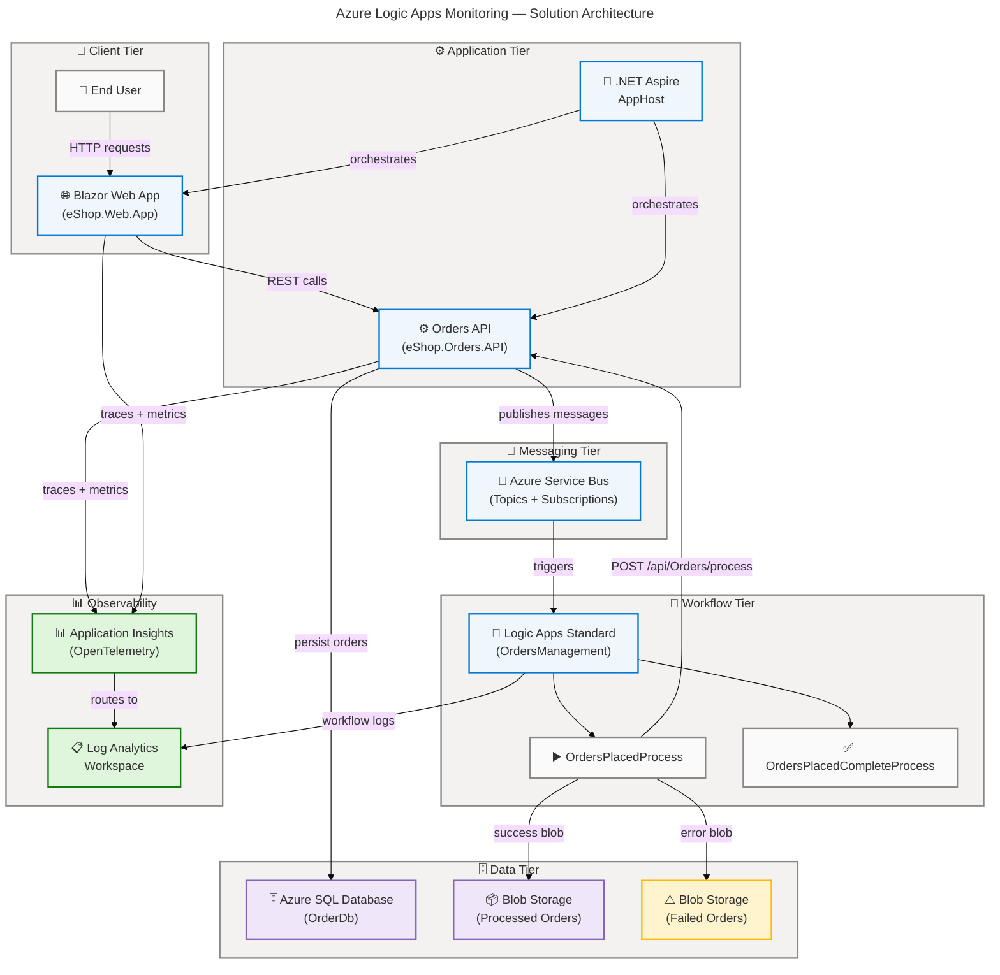

# Azure Logic Apps Monitoring

[](https://dotnet.microsoft.com)
[](https://azure.microsoft.com)
[](https://learn.microsoft.com/azure/logic-apps/)
[](https://learn.microsoft.com/dotnet/aspire/)
[](https://learn.microsoft.com/azure/azure-resource-manager/bicep/)
[](LICENSE)
[](https://learn.microsoft.com/azure/developer/azure-developer-cli/)

## Overview

**Overview**

The Azure Logic Apps Monitoring solution is a production-ready, cloud-native reference architecture that demonstrates how to build, monitor, and operate event-driven order management workflows on Azure. It combines the orchestration power of **.NET Aspire**, the workflow automation of **Azure Logic Apps Standard**, and enterprise-grade observability through **Application Insights** and **Log Analytics** — all deployed as Infrastructure-as-Code using **Bicep** and **Azure Developer CLI (azd)**.

This solution provides development teams and architects with a fully working end-to-end example of an order management platform: from accepting orders through a REST API and Blazor web frontend, dispatching them via **Azure Service Bus**, processing them with **Logic Apps Standard** workflows, and persisting results to **Azure SQL Database** and **Azure Blob Storage**. Every component is monitored with distributed tracing via **OpenTelemetry**, making it observable from development through production.

> [!NOTE]
> This repository is structured as an `azd` template. Running `azd up` from a configured Azure environment provisions all infrastructure and deploys all services end-to-end without manual steps.

> [!TIP]
> For local development without Azure services, the solution runs entirely using the **.NET Aspire Developer Dashboard** with an Azure Service Bus emulator. Only an Azure subscription and authenticated CLI session are required for cloud deployment.

## Table of Contents

- [Overview](#overview)
- [Architecture](#architecture)
- [Features](#features)
- [Requirements](#requirements)
- [Quick Start](#quick-start)
- [Deployment](#deployment)
- [Usage](#usage)
- [Configuration](#configuration)
- [Contributing](#contributing)
- [License](#license)

## Architecture

**Overview**

The solution follows a layered event-driven architecture with clear separation between the web frontend, backend API, message-driven workflow processing, and shared infrastructure. The **.NET Aspire AppHost** acts as the orchestration entry point for both local development and Azure Container Apps deployment, wiring together service discovery, health checks, and environment-specific configuration automatically.

At the core of the monitoring story, **Azure Logic Apps Standard** workflows consume Service Bus messages, call back into the Orders API, and route the processed payloads to Azure Blob Storage — either to a success container or an error container — depending on the HTTP response code. All I/O, telemetry, and workflow runs are captured in the connected **Application Insights** and **Log Analytics** workspace, giving operators a single pane of glass for the entire solution.


```mermaid
---
title: "Azure Logic Apps Monitoring — Solution Architecture"
config:
  theme: base
  look: classic
  layout: dagre
  themeVariables:
    fontSize: '16px'
  flowchart:
    htmlLabels: true
---
flowchart TB
    accTitle: Azure Logic Apps Monitoring Solution Architecture
    accDescr: End-to-end architecture showing user requests flowing through Blazor Web App and Orders API, dispatched to Azure Service Bus, processed by Logic Apps Standard workflows, and persisted in Azure SQL and Blob Storage, with monitoring via Application Insights and Log Analytics.

    %% ═══════════════════════════════════════════════════════════════════════════
    %% AZURE / FLUENT ARCHITECTURE PATTERN v1.1
    %% (Semantic + Structural + Font + Accessibility Governance)
    %% ═══════════════════════════════════════════════════════════════════════════
    %% PHASE 1 - FLUENT UI: All styling uses approved Fluent UI palette only
    %% PHASE 2 - GROUPS: Every subgraph has semantic color via style directive
    %% PHASE 3 - COMPONENTS: Every node has semantic classDef + icon prefix
    %% PHASE 4 - ACCESSIBILITY: accTitle/accDescr present, WCAG AA contrast
    %% PHASE 5 - STANDARD: Governance block present, classDefs centralized
    %% ═══════════════════════════════════════════════════════════════════════════

    subgraph clients["👥 Client Tier"]
        direction LR
        user["👤 End User"]:::neutral
        webapp["🌐 Blazor Web App\n(eShop.Web.App)"]:::core
    end

    subgraph api["⚙️ Application Tier"]
        direction LR
        ordersapi["⚙️ Orders API\n(eShop.Orders.API)"]:::core
        aspire["🔷 .NET Aspire\nAppHost"]:::core
    end

    subgraph messaging["📨 Messaging Tier"]
        direction LR
        servicebus["📨 Azure Service Bus\n(Topics + Subscriptions)"]:::core
    end

    subgraph workflows["🔄 Workflow Tier"]
        direction LR
        logicapp["🔄 Logic Apps Standard\n(OrdersManagement)"]:::core
        process1["▶️ OrdersPlacedProcess"]:::neutral
        process2["✅ OrdersPlacedCompleteProcess"]:::neutral
    end

    subgraph data["🗄️ Data Tier"]
        direction LR
        sqldb["🗄️ Azure SQL Database\n(OrderDb)"]:::data
        blobsuccess["📦 Blob Storage\n(Processed Orders)"]:::data
        bloberror["⚠️ Blob Storage\n(Failed Orders)"]:::warning
    end

    subgraph monitoring["📊 Observability"]
        direction LR
        appinsights["📊 Application Insights\n(OpenTelemetry)"]:::success
        loganalytics["📋 Log Analytics\nWorkspace"]:::success
    end

    user -->|"HTTP requests"| webapp
    webapp -->|"REST calls"| ordersapi
    ordersapi -->|"publishes messages"| servicebus
    servicebus -->|"triggers"| logicapp
    logicapp --> process1
    logicapp --> process2
    process1 -->|"POST /api/Orders/process"| ordersapi
    process1 -->|"success blob"| blobsuccess
    process1 -->|"error blob"| bloberror
    ordersapi -->|"persist orders"| sqldb
    ordersapi -->|"traces + metrics"| appinsights
    webapp -->|"traces + metrics"| appinsights
    logicapp -->|"workflow logs"| loganalytics
    appinsights -->|"routes to"| loganalytics
    aspire -->|"orchestrates"| ordersapi
    aspire -->|"orchestrates"| webapp

    style clients fill:#F3F2F1,stroke:#8A8886,stroke-width:2px,color:#323130
    style api fill:#F3F2F1,stroke:#8A8886,stroke-width:2px,color:#323130
    style messaging fill:#F3F2F1,stroke:#8A8886,stroke-width:2px,color:#323130
    style workflows fill:#F3F2F1,stroke:#8A8886,stroke-width:2px,color:#323130
    style data fill:#F3F2F1,stroke:#8A8886,stroke-width:2px,color:#323130
    style monitoring fill:#F3F2F1,stroke:#8A8886,stroke-width:2px,color:#323130

    %% Centralized semantic classDefs (Phase 5 compliant)
    classDef neutral fill:#FAFAFA,stroke:#8A8886,stroke-width:2px,color:#323130
    classDef core fill:#EFF6FC,stroke:#0078D4,stroke-width:2px,color:#323130
    classDef success fill:#DFF6DD,stroke:#107C10,stroke-width:2px,color:#323130
    classDef warning fill:#FFF4CE,stroke:#FFB900,stroke-width:2px,color:#323130
    classDef data fill:#F0E6FA,stroke:#8764B8,stroke-width:2px,color:#323130
```

**Component Roles:**

| Component               | Role                                                                    | Technology                           |
| ----------------------- | ----------------------------------------------------------------------- | ------------------------------------ |
| 🌐 Blazor Web App       | 🖥️ Interactive order management UI with Fluent UI design system         | Blazor Server, Microsoft.FluentUI    |
| ⚙️ Orders API           | 🔧 RESTful order CRUD with distributed tracing and Service Bus dispatch | ASP.NET Core, EF Core, OpenTelemetry |
| 🔷 .NET Aspire AppHost  | 🎛️ Service orchestration, health checks, service discovery              | .NET Aspire 10                       |
| 📨 Azure Service Bus    | 📬 Durable async messaging for order events (Topics + Subscriptions)    | Azure Service Bus Standard/Premium   |
| 🔄 Logic Apps Standard  | 🔁 Workflow automation: order validation, routing, persistence          | Azure Logic Apps Standard            |
| 🗄️ Azure SQL Database   | 💾 Relational persistence for orders via Entity Framework Core          | Azure SQL, EF Core 10                |
| 📦 Azure Blob Storage   | 🗂️ Object storage for processed and failed order payloads               | Azure Blob Storage                   |
| 📊 Application Insights | 🔍 Distributed tracing, metrics, and telemetry via OpenTelemetry        | Application Insights, OTLP           |

## Features

**Overview**

This solution packages a comprehensive set of cloud-native capabilities that address the most common challenges in building and operating event-driven systems on Azure: from end-to-end observability and secure managed identity authentication to repeatable one-command deployment. Every feature is implemented in production-quality code with no placeholders.

The feature set spans the full lifecycle — local development with emulators, automated test execution during CI/CD gates, Bicep IaC with private networking, and Logic Apps Standard workflows wired to a full monitoring stack — making this a reference implementation suitable for both learning and rapid production bootstrapping.

| Feature                            | Description                                                                                                                                                             | Status    |
| ---------------------------------- | ----------------------------------------------------------------------------------------------------------------------------------------------------------------------- | --------- |
| 🔄 Logic Apps Standard Workflows   | 🗂️ Two automated workflows (`OrdersPlacedProcess`, `OrdersPlacedCompleteProcess`) process Service Bus messages, call the Orders API, and route payloads to Blob Storage | ✅ Stable |
| 📊 End-to-End Observability        | 🔍 OpenTelemetry distributed tracing across all services with Application Insights + Log Analytics integration; activity sources in API and Web App                     | ✅ Stable |
| 🌐 Blazor Server Web App           | 🖥️ Fluent UI-styled order management frontend with typed HTTP client, service discovery, session management, and health endpoints                                       | ✅ Stable |
| ⚙️ Orders REST API                 | 🔧 ASP.NET Core Web API with EF Core + Azure SQL, Service Bus message dispatch, Swagger/OpenAPI docs, and structured logging                                            | ✅ Stable |
| 🔒 Managed Identity Authentication | 🔑 Zero-password architecture: all Azure service connections (SQL, Service Bus, Blob, Container Registry) use User-Assigned Managed Identity                            | ✅ Stable |
| 🚀 One-Command Deployment          | ▶️ `azd up` deploys all Bicep IaC and application containers in a single command with pre/post hooks for validation and SQL configuration                               | ✅ Stable |
| 🏗️ Bicep Infrastructure-as-Code    | 📐 Modular Bicep templates deploy VNet, identity, Log Analytics, App Insights, SQL, Service Bus, Container Apps, and Logic Apps                                         | ✅ Stable |
| 🧪 Automated Test Gates            | ✔️ `dotnet test` with code coverage (Cobertura) and TRX reports runs automatically during `azd provision` pre-hook                                                      | ✅ Stable |

## Requirements

**Overview**

This solution targets Azure cloud deployment using the Azure Developer CLI (`azd`) workflow with .NET 10 SDK. The complete toolchain is validated by the `check-dev-workstation.ps1` / `check-dev-workstation.sh` scripts included in the `hooks/` directory. **Running these scripts before first deployment** ensures your workstation meets all version thresholds before any Azure resources are provisioned.

For local development, **Docker is required** to run the Azure Service Bus emulator used by Aspire's local mode. For Azure deployment, an **active Azure subscription** with sufficient quota for Container Apps, Logic Apps Standard (WorkflowStandard tier), Azure SQL, and Service Bus is required.

| Prerequisite           | Minimum Version | Purpose                          | Validation Script  |
| ---------------------- | --------------- | -------------------------------- | ------------------ |
| ☁️ Azure Subscription  | Active          | ☁️ Cloud resource provisioning   | `az account show`  |
| 🔑 Azure Developer CLI | ≥ 1.11.0        | 🚀 One-command deploy (`azd up`) | `azd version`      |
| 🛠️ Azure CLI           | ≥ 2.60.0        | 🔧 Resource management and auth  | `az version`       |
| ⚡ .NET SDK            | 10.0.100        | ⚡ Build and test                | `dotnet --version` |
| 🔗 Bicep CLI           | ≥ 0.30.0        | 📐 IaC template compilation      | `az bicep version` |
| 🐳 Docker Desktop      | Latest          | 🐋 Local Service Bus emulator    | `docker version`   |
| 🖥️ PowerShell          | ≥ 7.0           | 📜 Hook script execution         | `pwsh --version`   |

> [!WARNING]
> The `global.json` file pins the .NET SDK to version `10.0.100`. Using an older SDK version will cause build failures. Run `dotnet --version` to confirm your installed version and update via the [.NET download page](https://dotnet.microsoft.com/download) if needed.

## Quick Start

The fastest path from zero to a running deployment is the `azd up` command. The following steps authenticate, configure a new environment, and deploy the complete solution including all Azure infrastructure and application containers.

**1. Clone and authenticate:**

```bash
git clone https://github.com/Evilazaro/Azure-LogicApps-Monitoring.git
cd Azure-LogicApps-Monitoring
azd auth login
```

**2. Validate your workstation:**

```powershell
./hooks/check-dev-workstation.ps1
```

**3. Initialize a new azd environment:**

```bash
azd env new <your-environment-name>
```

**4. Deploy everything:**

```bash
azd up
```

`azd up` runs in this order:

- `preprovision` hook — cleans, restores, builds, and tests the solution
- Bicep IaC — provisions all Azure resources (VNet, identity, SQL, Service Bus, Container Apps, Logic Apps)
- `postprovision` hook — configures SQL managed identity and .NET user secrets for local development
- Application deploy — builds and pushes container images, deploys to Azure Container Apps

> [!TIP]
> To deploy only the application code without re-provisioning infrastructure, run `azd deploy`. To tear down all Azure resources, run `azd down`.

**Expected output after `azd up`:**

```text
SUCCESS: Your up workflow to provision and deploy to Azure completed in 12m.

Outputs:
  AZURE_CONTAINER_APPS_ENVIRONMENT_ID : /subscriptions/.../environmentId
  ORDERS_API_URL                      : https://orders-api.<env>.azurecontainerapps.io
  WEB_APP_URL                         : https://web-app.<env>.azurecontainerapps.io
```

## Deployment

**Full Deployment (Provision + Deploy)**

```bash
# Provision infrastructure and deploy apps in one step
azd up
```

**Infrastructure Only**

```bash
# Provision Azure resources without deploying application containers
azd provision
```

**Application Only (after infrastructure exists)**

```bash
# Build, push images, and deploy to Container Apps
azd deploy
```

**Tear Down**

```bash
# Delete all Azure resources and resource group
azd down
```

**Local Development (without Azure)**

```bash
# Run in local mode with .NET Aspire Developer Dashboard
dotnet run --project app.AppHost
```

Opening `https://localhost:17000` launches the **.NET Aspire Dashboard** showing real-time traces, logs, and resource states for all services.

**Run Tests**

```bash
dotnet test --configuration Debug \
  --results-directory ./src/tests/AzdTestResults \
  --coverage \
  --coverage-output-format cobertura \
  --coverage-output coverage.cobertura.xml
```

## Usage

**Overview**

All API interactions use the base URL of the deployed `orders-api` Container App. The full OpenAPI specification is available at `<orders-api-url>/swagger` once deployed. For local Aspire development, the URL is shown in the **.NET Aspire Dashboard** under the `orders-api` resource entry. Every endpoint emits OpenTelemetry spans tagged with the HTTP method, route, and order ID — all visible in Application Insights.

### API Reference

| Method      | Endpoint              | Description                                 | Success Code     |
| ----------- | --------------------- | ------------------------------------------- | ---------------- |
| 📥 `POST`   | `/api/Orders`         | ➕ Place a single new order                 | `201 Created`    |
| 📋 `GET`    | `/api/Orders`         | 📄 Retrieve all orders                      | `200 OK`         |
| 🔍 `GET`    | `/api/Orders/{id}`    | 🔎 Retrieve a specific order by ID          | `200 OK`         |
| 🗑️ `DELETE` | `/api/Orders/{id}`    | ❌ Delete an order by ID                    | `204 No Content` |
| 📦 `POST`   | `/api/Orders/batch`   | 📥 Place multiple orders in one call        | `200 OK`         |
| ⚙️ `POST`   | `/api/Orders/process` | 🔄 Called internally by Logic Apps workflow | `201 Created`    |

### Request / Response Schema

The `Order` object and `OrderProduct` sub-object are defined in `app.ServiceDefaults/CommonTypes.cs` and shared across all projects.

**`Order` object:**

| Field                | Type                | Required | Constraints                      |
| -------------------- | ------------------- | -------- | -------------------------------- |
| 🆔 `id`              | `string`            | ✅ Yes   | 📏 1–100 characters              |
| 👤 `customerId`      | `string`            | ✅ Yes   | 📏 1–100 characters              |
| 📅 `date`            | `string (ISO 8601)` | ❌ No    | ⏱️ Defaults to `DateTime.UtcNow` |
| 📍 `deliveryAddress` | `string`            | ✅ Yes   | 📏 5–500 characters              |
| 💰 `total`           | `decimal`           | ✅ Yes   | 🔢 Must be > 0.00                |
| 🛒 `products`        | `OrderProduct[]`    | ✅ Yes   | 📦 At least 1 item               |

**`OrderProduct` object:**

| Field                   | Type      | Required | Constraints         |
| ----------------------- | --------- | -------- | ------------------- |
| 🆔 `id`                 | `string`  | ✅ Yes   | 📏 Non-empty        |
| 🔗 `orderId`            | `string`  | ✅ Yes   | 📏 Non-empty        |
| 🏷️ `productId`          | `string`  | ✅ Yes   | 📏 Non-empty        |
| 📝 `productDescription` | `string`  | ✅ Yes   | 📏 1–500 characters |
| 🔢 `quantity`           | `int`     | ✅ Yes   | 📊 Must be ≥ 1      |
| 💵 `price`              | `decimal` | ✅ Yes   | 💰 Must be > 0.00   |

### Place a Single Order

```http
POST https://<orders-api-url>/api/Orders
Content-Type: application/json

{
  "id": "order-001",
  "customerId": "customer-123",
  "deliveryAddress": "123 Main Street, Seattle, WA 98101",
  "total": 89.97,
  "products": [
    {
      "id": "op-001",
      "orderId": "order-001",
      "productId": "prod-abc",
      "productDescription": "Wireless Headphones",
      "quantity": 2,
      "price": 19.99
    },
    {
      "id": "op-002",
      "orderId": "order-001",
      "productId": "prod-xyz",
      "productDescription": "USB-C Hub",
      "quantity": 1,
      "price": 49.99
    }
  ]
}
```

**Expected response (`201 Created`):**

```json
{
  "id": "order-001",
  "customerId": "customer-123",
  "deliveryAddress": "123 Main Street, Seattle, WA 98101",
  "date": "2026-03-06T10:00:00Z",
  "total": 89.97,
  "products": [
    {
      "id": "op-001",
      "orderId": "order-001",
      "productId": "prod-abc",
      "productDescription": "Wireless Headphones",
      "quantity": 2,
      "price": 19.99
    },
    {
      "id": "op-002",
      "orderId": "order-001",
      "productId": "prod-xyz",
      "productDescription": "USB-C Hub",
      "quantity": 1,
      "price": 49.99
    }
  ]
}
```

After the order is persisted to Azure SQL, the Orders API publishes a message to the `ordersplaced` Service Bus topic. The **Logic Apps Standard** `OrdersPlacedProcess` workflow triggers on that message, validates the `Content-Type` is `application/json`, calls `POST /api/Orders/process`, and routes the result to either the `ordersprocessedsuccessfully` Blob container (HTTP 201) or the error Blob container (any other code).

### Retrieve All Orders

```http
GET https://<orders-api-url>/api/Orders
```

**Expected response (`200 OK`):**

```json
[
  {
    "id": "order-001",
    "customerId": "customer-123",
    "deliveryAddress": "123 Main Street, Seattle, WA 98101",
    "date": "2026-03-06T10:00:00Z",
    "total": 89.97,
    "products": [ ... ]
  }
]
```

### Retrieve a Single Order

```http
GET https://<orders-api-url>/api/Orders/order-001
```

**Expected response (`200 OK`):** Returns the matching `Order` JSON object. Returns `404 Not Found` with `{ "error": "Order with ID order-001 not found", "type": "NotFoundError" }` if not found.

### Delete an Order

```http
DELETE https://<orders-api-url>/api/Orders/order-001
```

**Expected response:** `204 No Content` on success, `404 Not Found` if the order does not exist.

### Place Orders in Batch

For load testing or bulk imports, submit an array of `Order` objects to the batch endpoint:

```http
POST https://<orders-api-url>/api/Orders/batch
Content-Type: application/json

[ { ...order1... }, { ...order2... } ]
```

**Expected response (`200 OK`):** Array of all successfully placed `Order` objects.

### Generating Test Orders

The `Generate-Orders.ps1` script creates realistic randomized order payloads in JSON format, compatible with the batch endpoint and Logic Apps triggers:

```powershell
# Generate 2000 orders with default settings (saves to infra/data/ordersBatch.json)
./hooks/Generate-Orders.ps1

# Generate 100 orders with 2-4 products each to a custom path
./hooks/Generate-Orders.ps1 -OrderCount 100 -MinProducts 2 -MaxProducts 4 -OutputPath "./test-orders.json"

# Dry run to preview actions without writing files
./hooks/Generate-Orders.ps1 -WhatIf
```

| Parameter         | Type     | Default                          | Description                                |
| ----------------- | -------- | -------------------------------- | ------------------------------------------ |
| 🔢 `-OrderCount`  | `int`    | `2000`                           | 📊 Number of orders to generate (1–10,000) |
| 📁 `-OutputPath`  | `string` | `../infra/data/ordersBatch.json` | 💾 Output file path                        |
| 🛒 `-MinProducts` | `int`    | `1`                              | 📦 Minimum products per order (1–20)       |
| 🛍️ `-MaxProducts` | `int`    | `6`                              | 📦 Maximum products per order (1–20)       |
| ⚡ `-Force`       | `switch` | `false`                          | 🚫 Skip confirmation prompts               |

### Health Check Endpoints

Both services expose standard health endpoints registered by `.NET Aspire` service defaults:

| Endpoint         | Purpose                             | Expected Response                |
| ---------------- | ----------------------------------- | -------------------------------- |
| 🟢 `GET /health` | 🔍 Deep health check (dependencies) | `200 OK` with health report JSON |
| 💚 `GET /alive`  | ❤️ Liveness probe (process running) | `200 OK` plain text              |

### Browsing the Web App

Navigate to the deployed Web App URL to manage orders through the Blazor Server UI. The frontend is built with **Microsoft FluentUI v4.14.0** and communicates with the Orders API through Aspire service discovery — the `services:orders-api:https:0` key is automatically resolved at startup.

### Monitoring in Azure Portal

All observability data flows into the single Log Analytics workspace provisioned by the Bicep IaC:

| Tool                    | Where to look                                        | What you see                                        |
| ----------------------- | ---------------------------------------------------- | --------------------------------------------------- |
| 📊 Application Insights | Live Metrics → Transaction Search → App Map          | 🔍 Distributed traces, dependency calls, exceptions |
| 📋 Log Analytics        | `traces`, `dependencies`, `requests`, `customEvents` | 📄 Cross-service correlated logs                    |
| 🔄 Logic Apps Standard  | Run History panel (per workflow)                     | ▶️ Step-level inputs/outputs and run status         |
| 🏥 Container Apps       | Revision console + Log Stream                        | 🖥️ Container stdout and health probe results        |

## Configuration

**Overview**

All environment-specific configuration is managed through `azd` environment variables and .NET user secrets. The `postprovision.ps1` hook automatically populates user secrets for all three projects (`app.AppHost`, `eShop.Orders.API`, `eShop.Web.App`) after `azd provision` completes — **no manual secret management is required** for standard deployments. For CI/CD pipelines running as a `ServicePrincipal`, the same environment variables are injected automatically from the provisioned Azure resources.

Sensitive values (connection strings, client IDs) are **never stored in source-controlled files**. The solution uses **User-Assigned Managed Identity** for all Azure service authentication at runtime and **DefaultAzureCredential** for Azure SQL connections — **eliminating the need for stored passwords** across all environments.

### Environment Variables (set by `azd` / `postprovision.ps1`)

These variables are required at provisioning time and automatically written to `.env` by `azd provision`:

| Variable                                   | Required    | Description                                              |
| ------------------------------------------ | ----------- | -------------------------------------------------------- |
| ☁️ `AZURE_SUBSCRIPTION_ID`                 | ✅ Yes      | 🔑 Azure subscription ID for all resource operations     |
| 🗂️ `AZURE_RESOURCE_GROUP`                  | ✅ Yes      | 📁 Resource group containing all solution resources      |
| 🌍 `AZURE_LOCATION`                        | ✅ Yes      | 🗺️ Azure region for resource deployment (e.g. `eastus2`) |
| 🐳 `AZURE_CONTAINER_REGISTRY_ENDPOINT`     | ⬜ Optional | 🏗️ ACR login server URL for container image push/pull    |
| 🗄️ `AZURE_SQL_SERVER_NAME`                 | ⬜ Optional | 💾 SQL Server hostname (set when SQL is provisioned)     |
| 📊 `AZURE_SQL_DATABASE_NAME`               | ⬜ Optional | 🗃️ SQL Database name (defaults to `OrderDb`)             |
| 🔒 `MANAGED_IDENTITY_NAME`                 | ⬜ Optional | 🆔 User-Assigned Managed Identity resource name          |
| 🆔 `MANAGED_IDENTITY_CLIENT_ID`            | ⬜ Optional | 🔑 Client ID of the User-Assigned Managed Identity       |
| 📡 `APPLICATIONINSIGHTS_CONNECTION_STRING` | ⬜ Optional | 📊 Application Insights ingestion endpoint               |
| 📨 `MESSAGING_SERVICEBUSHOSTNAME`          | ⬜ Optional | 🌐 Fully qualified Service Bus namespace hostname        |

### .NET User Secrets (set by `postprovision.ps1`)

The post-provision hook calls `dotnet user-secrets set` for each project. The following tables show the exact secret keys used.

**`app.AppHost` (`app.AppHost/app.AppHost.csproj`):**

| Secret Key                             | Description                                          |
| -------------------------------------- | ---------------------------------------------------- |
| 🏗️ `Azure:ResourceGroup`               | ☁️ Azure resource group name                         |
| 🔑 `Azure:TenantId`                    | 🔒 Azure AD tenant ID for `DefaultAzureCredential`   |
| 🆔 `Azure:ClientId`                    | 🆔 Managed Identity client ID (local dev only)       |
| 📊 `Azure:ApplicationInsights:Name`    | 📡 Application Insights resource name                |
| 📨 `Azure:ServiceBus:HostName`         | 🌐 Service Bus namespace hostname                    |
| 🔤 `Azure:ServiceBus:TopicName`        | 📨 Topic name (default: `ordersplaced`)              |
| 🔖 `Azure:ServiceBus:SubscriptionName` | 📬 Subscription name (default: `orderprocessingsub`) |

**`eShop.Orders.API` (`src/eShop.Orders.API/eShop.Orders.API.csproj`):**

| Secret Key                                 | Description                                       |
| ------------------------------------------ | ------------------------------------------------- |
| 🗄️ `ConnectionStrings:OrderDb`             | 💾 SQL Server connection string using AAD auth    |
| 📨 `ConnectionStrings:messaging`           | 🔌 Service Bus connection string (local emulator) |
| 📊 `APPLICATIONINSIGHTS_CONNECTION_STRING` | 📡 Application Insights telemetry endpoint        |

**`eShop.Web.App` (`src/eShop.Web.App/eShop.Web.App.csproj`):**

| Secret Key                                 | Description                                |
| ------------------------------------------ | ------------------------------------------ |
| 📊 `APPLICATIONINSIGHTS_CONNECTION_STRING` | 📡 Application Insights telemetry endpoint |

### `appsettings.json` Configuration

**`app.AppHost/appsettings.json`** — controls Aspire orchestration behaviour:

```json
{
  "Azure": {
    "AllowResourceGroupCreation": false
  },
  "Logging": {
    "LogLevel": {
      "Default": "Information",
      "Microsoft.AspNetCore": "Warning",
      "Aspire.Hosting.Dcp": "Warning"
    }
  }
}
```

**`src/eShop.Orders.API/appsettings.json`** — Orders API HTTP client resilience settings:

```json
{
  "HttpClient": {
    "OrdersAPIService": {
      "Timeout": "00:02:00",
      "Resilience": {
        "AttemptTimeout": "00:00:30",
        "TotalRequestTimeout": "00:01:30",
        "Retry": {
          "MaxRetryAttempts": 2
        }
      }
    }
  }
}
```

### Azure SQL Connection String Format

The `OrderDb` connection string uses **Windows Integrated / AAD authentication** — no password required:

```text
Server=tcp:<sql-server-name>.database.windows.net,1433;
Initial Catalog=OrderDb;
Authentication=Active Directory Default;
Encrypt=True;
TrustServerCertificate=False;
Connection Timeout=30;
```

### Service Bus Configuration

The AppHost automatically switches between **local emulator mode** and **Azure mode** based on `Azure:ServiceBus:HostName`:

| Mode                | `HostName` value                     | Auth method                                  |
| ------------------- | ------------------------------------ | -------------------------------------------- |
| 🖥️ Local emulator   | `localhost` (default)                | 🔌 Emulator connection string                |
| ☁️ Azure deployment | `<namespace>.servicebus.windows.net` | 🔒 Managed Identity (DefaultAzureCredential) |

> [!NOTE]
> The `AllowResourceGroupCreation` flag in `app.AppHost/appsettings.json` is intentionally set to `false` to prevent accidental resource group creation during local development. Set it to `true` only when initializing a brand-new Azure environment for the first time with `azd env new`.

## Contributing

**Overview**

Contributions to the Azure Logic Apps Monitoring solution are welcome and encouraged. Whether you are fixing a bug, improving documentation, extending the Logic Apps workflows, or proposing new observability patterns, the project follows standard GitHub contribution conventions with an emphasis on clean, tested, and well-documented changes.

All pull requests are gated by the same automated test suite that runs during `azd provision` — so passing `dotnet test` locally before opening a PR is the most reliable way to ensure CI success. New features **should include test coverage** in the corresponding project under `src/tests/`.

**How to contribute:**

1. Fork the repository and create a feature branch from `main`
2. Validate your workstation: `./hooks/check-dev-workstation.ps1`
3. Make your changes and run the full test suite:

   ```bash
   dotnet test --configuration Debug
   ```

4. **Ensure no placeholder text** (`TODO`, `TBD`, `Coming soon`) remains in your changes
5. Open a pull request against `main` with a clear description of the change

> [!TIP]
> Use the `Generate-Orders.ps1` hook script to generate realistic test data for end-to-end validation of workflow changes before submitting a pull request.

**Reporting Issues**

Open an issue at [github.com/Evilazaro/Azure-LogicApps-Monitoring/issues](https://github.com/Evilazaro/Azure-LogicApps-Monitoring/issues) with reproduction steps, expected behavior, and actual behavior.

## License

This project is licensed under the **MIT License**. See the [`LICENSE`](LICENSE) file in the repository root for full terms.

---

> 📌 **Maintainer**: [Evilazaro](https://github.com/Evilazaro) — Principal Cloud Solution Architect, Microsoft
> 📦 **Template version**: `azure-logicapps-monitoring@1.0.0`
> 🔗 **Repository**: [github.com/Evilazaro/Azure-LogicApps-Monitoring](https://github.com/Evilazaro/Azure-LogicApps-Monitoring)
