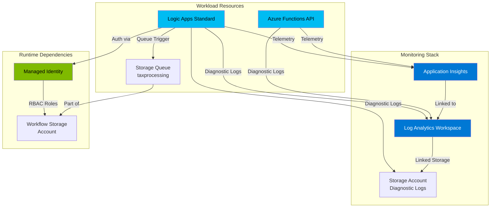
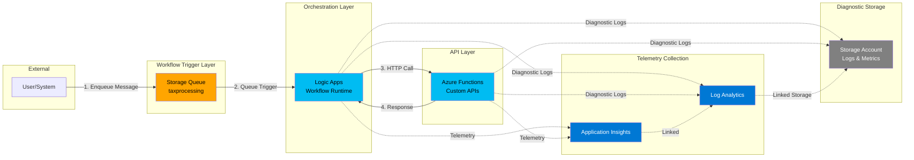

# Azure Logic Apps Monitoring

[](https://opensource.org/licenses/MIT)
[](https://azure.microsoft.com/en-us/services/logic-apps/)
[](https://docs.microsoft.com/en-us/azure/azure-resource-manager/bicep/)

A comprehensive open-source solution demonstrating Azure Monitor best practices for Logic Apps Standard using Infrastructure as Code (Bicep). This project provides production-ready observability patterns for enterprise workflow orchestration.

## Table of Contents

- Project Overview
- Target Audience
- Features
- Architecture
- Data Flow
- Prerequisites
- Installation & Deployment
- Usage Examples
- Project Structure
- Contributing
- License
- References

## Project Overview

**Azure Logic Apps Monitoring** is an Infrastructure as Code (IaC) solution that demonstrates how to implement comprehensive observability for Azure Logic Apps Standard workflows. The project deploys a complete monitoring stack including:

- **Log Analytics Workspace** for centralized log aggregation
- **Application Insights** for distributed tracing and telemetry
- **Storage Account** with lifecycle management for diagnostic logs
- **Logic Apps Standard** runtime with workflow execution tracking
- **Azure Functions** for custom API integration
- **Diagnostic Settings** across all resources

### Why This Project Matters

While Azure provides built-in monitoring capabilities, implementing production-grade observability requires careful configuration of diagnostic settings, log routing, retention policies, and query patterns. This project:

- ✅ Demonstrates **end-to-end monitoring architecture** for Logic Apps
- ✅ Provides **reusable Bicep templates** following Azure best practices
- ✅ Includes **pre-configured diagnostic settings** for all resources
- ✅ Shows **integration patterns** between monitoring services
- ✅ Offers **practical query examples** for common scenarios

## Target Audience

| Role | Benefits |
|------|----------|
| **Cloud Architects** | Reference architecture for Logic Apps observability patterns |
| **DevOps Engineers** | IaC templates for automated monitoring infrastructure deployment |
| **Platform Engineers** | Best practices for centralized logging and diagnostics configuration |
| **Developers** | Query examples and workflow troubleshooting techniques |
| **Site Reliability Engineers** | Production-ready monitoring setup with retention policies |

**Experience Level**: Beginner to Intermediate
- Basic understanding of Azure services
- Familiarity with Bicep or ARM templates helpful but not required
- Knowledge of Logic Apps workflows beneficial

## Features

### Feature Overview

| Feature | Purpose | Benefit |
|---------|---------|---------|
| **Workspace-Based Application Insights** | Centralized telemetry collection for Logic Apps and Functions | Single pane of glass for distributed tracing across workflows |
| **Diagnostic Settings on All Resources** | Automatic log and metrics collection | Complete audit trail and troubleshooting capability |
| **Managed Identity for Storage Access** | Secure, credential-free Logic Apps runtime authentication | Eliminates secrets management and follows zero-trust principles |
| **Log Analytics Linked Storage** | Dedicated storage for alerts and query results | Cost-effective long-term retention with lifecycle policies |
| **Queue-Based Workflow Triggers** | Azure Storage Queue integration for Logic Apps | Reliable, scalable event-driven architecture |
| **Dedicated Storage Lifecycle Policies** | Automated log deletion after 30 days | Optimized storage costs while meeting retention requirements |
| **Resource Tagging Strategy** | Consistent metadata across all resources | Simplified cost allocation and resource governance |

### Solution vs Default Azure Monitor Comparison

| Capability | Default Azure Monitor | This Solution |
|------------|----------------------|---------------|
| **Logic Apps Diagnostics** | Manual configuration required | Automated via Bicep with `WorkflowRuntime` logs enabled |
| **Storage Account Access** | Connection strings in app settings | Managed Identity with role-based access (Blob Data Owner, Queue Contributor) |
| **Log Retention** | 30-90 days default, requires manual cleanup | Automated lifecycle policy with 30-day deletion rules |
| **Cross-Resource Correlation** | Separate Application Insights instances | Unified workspace-based telemetry with linked storage |
| **Diagnostic Logs Routing** | Per-resource configuration | Centralized via diagnostic settings to Log Analytics + Storage |
| **Cost Optimization** | Standard storage with no lifecycle management | Hot tier for active logs, automatic archival/deletion |
| **Infrastructure as Code** | Portal-based or Azure CLI scripts | Declarative Bicep templates with parameterization |
| **Monitoring for Functions** | Basic metrics only | Full logs, metrics, and Application Insights integration |

### Implementation Highlights

**1. Workspace-Based Application Insights**
```bicep
// src/monitoring/app-insights.bicep
resource appInsights 'Microsoft.Insights/components@2020-02-02' = {
  name: '${name}-${uniqueString(resourceGroup().id, name, envName, location)}-appinsights'
  properties: {
    Application_Type: 'web'
    WorkspaceResourceId: logAnalyticsWorkspaceId  // Links to centralized workspace
    publicNetworkAccessForIngestion: 'Enabled'
    publicNetworkAccessForQuery: 'Enabled'
  }
}
```

**2. Logic Apps with Managed Identity**
```bicep
// src/workload/logic-app.bicep
resource app 'Microsoft.Web/sites@2023-12-01' = {
  identity: {
    type: 'UserAssigned'
    userAssignedIdentities: {
      '${mi.id}': {}  // User-assigned managed identity
    }
  }
  properties: {
    siteConfig: {
      appSettings: [
        {
          name: 'AzureWebJobsStorage__credential'
          value: 'managedidentity'  // No connection strings!
        }
      ]
    }
  }
}
```

**3. Comprehensive Diagnostic Settings**
```bicep
// Diagnostic settings applied to Logic Apps, Functions, Storage, and App Service Plans
resource appDiag 'Microsoft.Insights/diagnosticSettings@2021-05-01-preview' = {
  scope: app
  properties: {
    workspaceId: workspaceId
    storageAccountId: storageAccountId
    logs: [
      {
        category: 'WorkflowRuntime'  // Captures workflow execution logs
        enabled: true
      }
    ]
    metrics: [
      {
        categoryGroup: 'allMetrics'
        enabled: true
      }
    ]
  }
}
```

**4. Storage Lifecycle Management**
```bicep
// src/monitoring/log-analytics-workspace.bicep
resource maPolicy 'Microsoft.Storage/storageAccounts/managementPolicies@2025-06-01' = {
  properties: {
    policy: {
      rules: [
        {
          definition: {
            actions: {
              baseBlob: {
                delete: {
                  daysAfterModificationGreaterThan: 30  // Auto-cleanup
                }
              }
            }
          }
        }
      ]
    }
  }
}
```

## Architecture


```mermaid
graph TB
    subgraph "Monitoring Stack"
        LAW[Log Analytics Workspace]
        AI[Application Insights]
        SA[Storage Account<br/>Diagnostic Logs]
    end

    subgraph "Workload Resources"
        LA[Logic Apps Standard]
        FA[Azure Functions API]
        QS[Storage Queue<br/>taxprocessing]
    end

    subgraph "Runtime Dependencies"
        WSA[Workflow Storage<br/>Account]
        MI[Managed Identity]
    end

    LA -->|Telemetry| AI
    LA -->|Diagnostic Logs| LAW
    LA -->|Diagnostic Logs| SA
    FA -->|Telemetry| AI
    FA -->|Diagnostic Logs| LAW
    
    LA -->|Queue Trigger| QS
    LA -->|Auth via| MI
    MI -->|RBAC Roles| WSA
    
    AI -->|Linked to| LAW
    LAW -->|Linked Storage| SA
    
    QS -->|Part of| WSA

    style LAW fill:#0078D4,color:#fff
    style AI fill:#0078D4,color:#fff
    style LA fill:#00BCF2,color:#000
    style FA fill:#00BCF2,color:#000
    style MI fill:#7FBA00,color:#000
```

### Component Descriptions

| Component | Purpose | Configuration |
|-----------|---------|---------------|
| **Log Analytics Workspace** | Centralized log aggregation and Kusto query engine | 30-day retention, PerGB2018 pricing tier |
| **Application Insights** | Application Performance Management (APM) for Logic Apps and Functions | Workspace-based mode, linked to Log Analytics |
| **Storage Account (Logs)** | Long-term storage for diagnostic logs with lifecycle policies | Standard LRS, Hot tier, 30-day auto-deletion |
| **Storage Account (Workflows)** | Runtime storage for Logic Apps (blobs, queues, tables) | Standard LRS, Managed Identity access |
| **Logic Apps Standard** | Workflow orchestration runtime | WS1 tier, Managed Identity, Queue trigger enabled |
| **Azure Functions** | Custom API backend | P0v3 tier, .NET 9.0, Linux container |
| **Storage Queue** | Event-driven trigger for workflows | `taxprocessing` queue for tax document processing |

## Data Flow


```mermaid
flowchart LR
    subgraph External
        USER[User/System]
    end

    subgraph WorkflowTrigger["Workflow Trigger Layer"]
        QUEUE[Storage Queue<br/>taxprocessing]
    end

    subgraph Orchestration["Orchestration Layer"]
        LA[Logic Apps<br/>Workflow Runtime]
    end

    subgraph APIs["API Layer"]
        FA[Azure Functions<br/>Custom APIs]
    end

    subgraph Telemetry["Telemetry Collection"]
        AI[Application Insights]
        LAW[Log Analytics]
    end

    subgraph Storage["Diagnostic Storage"]
        SA[Storage Account<br/>Logs & Metrics]
    end

    USER -->|1. Enqueue Message| QUEUE
    QUEUE -->|2. Queue Trigger| LA
    LA -->|3. HTTP Call| FA
    FA -->|4. Response| LA
    
    LA -.->|Telemetry| AI
    FA -.->|Telemetry| AI
    
    LA -.->|Diagnostic Logs| LAW
    LA -.->|Diagnostic Logs| SA
    FA -.->|Diagnostic Logs| LAW
    FA -.->|Diagnostic Logs| SA
    
    AI -.->|Linked| LAW
    LAW -.->|Linked Storage| SA

    style QUEUE fill:#FFA500,color:#000
    style LA fill:#00BCF2,color:#000
    style FA fill:#00BCF2,color:#000
    style AI fill:#0078D4,color:#fff
    style LAW fill:#0078D4,color:#fff
    style SA fill:#808080,color:#fff
```

### Data Flow Steps

1. **Event Ingestion**: External system enqueues message to `taxprocessing` queue
2. **Workflow Trigger**: Logic Apps workflow triggered by queue message
3. **API Integration**: Logic Apps invokes Azure Functions for custom processing
4. **Telemetry**: Both services emit metrics and traces to Application Insights
5. **Log Routing**: Diagnostic logs sent to Log Analytics Workspace and Storage Account
6. **Query & Analysis**: Operators run Kusto queries in Log Analytics for monitoring

## Prerequisites

### Required Tools

| Tool | Version | Purpose |
|------|---------|---------|
| [Azure CLI](https://learn.microsoft.com/en-us/cli/azure/install-azure-cli) | 2.60.0+ | Azure resource management |
| [Azure Developer CLI (azd)](https://learn.microsoft.com/en-us/azure/developer/azure-developer-cli/install-azd) | 1.5.0+ | Deployment automation |
| [Bicep CLI](https://learn.microsoft.com/en-us/azure/azure-resource-manager/bicep/install) | 0.24.0+ | Infrastructure as Code compilation |
| [Visual Studio Code](https://code.visualstudio.com/) | Latest | IDE with Bicep/Logic Apps extensions |

### Azure Subscription Requirements

- **Active Azure Subscription** with the following quotas available:
  - Logic Apps Standard (WS1 tier)
  - Azure Functions Premium Plan (P0v3 tier)
  - Log Analytics Workspace (PerGB2018 tier)
  - Storage Accounts (minimum 2)

### RBAC Permissions

Deploying user/service principal requires:

- `Owner` or `User Access Administrator` at subscription level (for role assignments)
- `Contributor` at subscription level (for resource deployment)

### Azure Resource Providers

Ensure the following providers are registered:

```bash
az provider register --namespace Microsoft.Logic
az provider register --namespace Microsoft.Web
az provider register --namespace Microsoft.Storage
az provider register --namespace Microsoft.Insights
az provider register --namespace Microsoft.OperationalInsights
```

## Installation & Deployment

### Step 1: Clone the Repository

```bash
git clone https://github.com/YOUR_USERNAME/Azure-LogicApps-Monitoring.git
cd Azure-LogicApps-Monitoring
```

### Step 2: Authenticate with Azure

```bash
# Login to Azure
az login

# Set your subscription (if you have multiple)
az account set --subscription "YOUR_SUBSCRIPTION_ID"

# Login to Azure Developer CLI
azd auth login
```

### Step 3: Initialize Azure Developer CLI Environment

```bash
# Initialize azd environment
azd init --environment dev

# You will be prompted for:
# - Environment name: dev (or uat, prod)
# - Azure location: eastus (or your preferred region)
```

This creates configuration in config.json:

```json
{
  "services": {},
  "variables": {
    "AZURE_ENV_NAME": "dev",
    "AZURE_LOCATION": "eastus"
  }
}
```

### Step 4: Deploy Infrastructure

```bash
# Deploy all resources using Bicep templates
azd provision

# Follow prompts to confirm:
# - Resource group name: contoso-tax-docs-dev-eastus-rg
# - Deployment parameters
```

**What Gets Deployed:**

1. **Monitoring Stack** (src/monitoring/main.bicep)
   - Log Analytics Workspace
   - Application Insights
   - Storage Account for logs

2. **Workload Stack** (src/workload/main.bicep)
   - Logic Apps Standard runtime
   - Azure Functions App
   - Workflow Storage Account with queue
   - Managed Identity and role assignments

### Step 5: Deploy Logic Apps Workflow

```bash
# Navigate to Logic Apps project
cd tax-docs

# Deploy workflow definition to Azure
az logicapp deployment source config-zip \
  --resource-group contoso-tax-docs-dev-eastus-rg \
  --name <LOGIC_APP_NAME> \
  --src tax-processing.zip
```

Replace `<LOGIC_APP_NAME>` with the output from `azd provision`.

### Step 6: Verify Deployment

```bash
# List deployed resources
az resource list \
  --resource-group contoso-tax-docs-dev-eastus-rg \
  --output table

# Check Logic Apps status
az logicapp show \
  --resource-group contoso-tax-docs-dev-eastus-rg \
  --name <LOGIC_APP_NAME> \
  --query "state"
```

## Usage Examples

### Example 1: Monitor Workflow Execution Status

**Scenario**: Track all workflow runs and their completion status.

```kusto
AzureDiagnostics
| where Category == "WorkflowRuntime"
| where OperationName == "Microsoft.Logic/workflows/workflowRunCompleted"
| project 
    TimeGenerated,
    resource_workflowName_s,
    resource_runId_s,
    status_s,
    DurationMs = endTime_t - startTime_t
| order by TimeGenerated desc
```

**Sample Output:**

| TimeGenerated | resource_workflowName_s | resource_runId_s | status_s | DurationMs |
|---------------|-------------------------|------------------|----------|------------|
| 2025-01-15 10:30:15 | tax-processing | 08585320389... | Succeeded | 2345 |
| 2025-01-15 10:28:42 | tax-processing | 08585320388... | Failed | 1823 |

**Reference**: [Monitor Logic Apps with Azure Monitor logs](https://learn.microsoft.com/en-us/azure/logic-apps/monitor-workflows-collect-diagnostic-data)

---

### Example 2: Identify Failed Workflow Runs

**Scenario**: Troubleshoot workflow failures with error details.

```kusto
AzureDiagnostics
| where Category == "WorkflowRuntime"
| where status_s == "Failed"
| project 
    TimeGenerated,
    resource_workflowName_s,
    resource_runId_s,
    error_code_s,
    error_message_s
| order by TimeGenerated desc
| take 50
```

**Sample Output:**

| TimeGenerated | resource_workflowName_s | error_code_s | error_message_s |
|---------------|-------------------------|--------------|-----------------|
| 2025-01-15 10:28:42 | tax-processing | ActionFailed | HTTP request failed with status 500 |

**Reference**: [Troubleshoot workflow failures](https://learn.microsoft.com/en-us/azure/logic-apps/logic-apps-diagnosing-failures)

---

### Example 3: Analyze Workflow Performance Trends

**Scenario**: Calculate average workflow duration over time.

```kusto
AzureDiagnostics
| where Category == "WorkflowRuntime"
| where OperationName == "Microsoft.Logic/workflows/workflowRunCompleted"
| extend DurationMs = endTime_t - startTime_t
| summarize 
    AvgDurationMs = avg(DurationMs),
    MaxDurationMs = max(DurationMs),
    RunCount = count()
    by bin(TimeGenerated, 1h)
| render timechart
```

**Sample Output:**

| TimeGenerated | AvgDurationMs | MaxDurationMs | RunCount |
|---------------|---------------|---------------|----------|
| 2025-01-15 10:00 | 2145 | 5234 | 47 |
| 2025-01-15 11:00 | 2198 | 4821 | 52 |

**Reference**: [Query diagnostic data for Logic Apps](https://learn.microsoft.com/en-us/azure/logic-apps/create-monitoring-tracking-queries)

---

### Example 4: Monitor Application Insights Dependencies

**Scenario**: Track external HTTP calls from Logic Apps to Azure Functions.

```kusto
dependencies
| where cloud_RoleName == "tax-processing"
| where type == "Http"
| project 
    timestamp,
    name,
    target,
    duration,
    success,
    resultCode
| order by timestamp desc
```

**Sample Output:**

| timestamp | name | target | duration | success | resultCode |
|-----------|------|--------|----------|---------|------------|
| 2025-01-15 10:30:15 | POST /api/validate | contoso-api.azurewebsites.net | 234 | true | 200 |

**Reference**: [Application Insights dependency tracking](https://learn.microsoft.com/en-us/azure/azure-monitor/app/asp-net-dependencies)

---

### Example 5: Storage Queue Metrics for Triggers

**Scenario**: Monitor queue message processing rate.

```kusto
StorageQueueLogs
| where OperationName == "GetMessages"
| summarize MessageCount = count() by bin(TimeGenerated, 5m)
| render timechart
```

**Reference**: [Monitor Azure Storage with Azure Monitor](https://learn.microsoft.com/en-us/azure/storage/common/monitor-storage)

---

### Example 6: Cost Analysis for Log Analytics

**Scenario**: Track Log Analytics ingestion volume for cost optimization.

```kusto
Usage
| where DataType == "AzureDiagnostics"
| summarize DataVolumeMB = sum(Quantity) / 1024 by Solution
| order by DataVolumeMB desc
```

**Sample Output:**

| Solution | DataVolumeMB |
|----------|--------------|
| LogicAppsManagement | 1453.2 |
| StorageInsights | 234.5 |

**Reference**: [Monitor usage and costs in Log Analytics](https://learn.microsoft.com/en-us/azure/azure-monitor/logs/manage-cost-storage)

## Project Structure

```
Azure-LogicApps-Monitoring/
├── infra/                          # Infrastructure as Code
│   ├── main.bicep                  # Root deployment template
│   └── main.parameters.json        # Environment parameters
├── src/
│   ├── monitoring/                 # Monitoring stack modules
│   │   ├── main.bicep              # Monitoring orchestration
│   │   ├── log-analytics-workspace.bicep
│   │   ├── app-insights.bicep
│   │   └── azure-monitor-health-model.bicep
│   └── workload/                   # Application workload modules
│       ├── main.bicep              # Workload orchestration
│       ├── logic-app.bicep         # Logic Apps Standard
│       ├── azure-function.bicep    # Azure Functions API
│       └── messaging/
│           └── main.bicep          # Storage Queue infrastructure
├── tax-docs/                       # Logic Apps project
│   ├── tax-processing/
│   │   └── workflow.json           # Workflow definition
│   ├── connections.json            # API connections
│   └── host.json                   # Runtime configuration
├── .azure/                         # Azure Developer CLI config
├── .vscode/                        # VS Code settings
├── azure.yaml                      # azd project manifest
└── README.md
```

## Contributing

Contributions are welcome! Please follow these guidelines:

1. **Fork the repository** and create a feature branch
2. **Follow Bicep best practices** (linting, parameter validation)
3. **Add documentation** for new features in README
4. **Test deployments** in a dev environment before submitting PR
5. **Submit Pull Request** with clear description of changes

See CONTRIBUTING.md for detailed guidelines.

## License

This project is licensed under the **MIT License** - see the LICENSE.md file for details.

### Third-Party Licenses

- Azure Bicep: [MIT License](https://github.com/Azure/bicep/blob/main/LICENSE)
- Azure Developer CLI: [MIT License](https://github.com/Azure/azure-dev/blob/main/LICENSE)

## References

### Microsoft Documentation

- [Azure Logic Apps Documentation](https://learn.microsoft.com/en-us/azure/logic-apps/)
- [Monitor Logic Apps with Azure Monitor](https://learn.microsoft.com/en-us/azure/logic-apps/monitor-workflows-collect-diagnostic-data)
- [Azure Monitor Logs Reference](https://learn.microsoft.com/en-us/azure/azure-monitor/reference/tables/azurediagnostics)
- [Bicep Language Reference](https://learn.microsoft.com/en-us/azure/azure-resource-manager/bicep/)
- [Application Insights for Logic Apps](https://learn.microsoft.com/en-us/azure/logic-apps/create-monitoring-tracking-queries)
- [Azure Developer CLI Overview](https://learn.microsoft.com/en-us/azure/developer/azure-developer-cli/overview)

### GitHub Best Practices

- [GitHub README Template](https://github.com/othneildrew/Best-README-Template)
- [Awesome README](https://github.com/matiassingers/awesome-readme)
- [Open Source Guide](https://opensource.guide/)

### Community

- [Azure Logic Apps Community](https://techcommunity.microsoft.com/t5/azure-integration-services-blog/bg-p/AzureIntegrationServicesBlog)
- [Azure Bicep Discussions](https://github.com/Azure/bicep/discussions)

---

**Maintained by**: Platform Engineering Team  
**Last Updated**: January 2025  
**Repository**: [https://github.com/YOUR_USERNAME/Azure-LogicApps-Monitoring](https://github.com/YOUR_USERNAME/Azure-LogicApps-Monitoring)