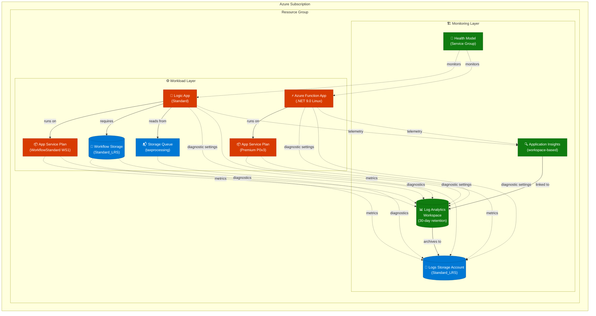

# Azure Logic Apps Monitoring Solution

A production-ready, enterprise-grade monitoring infrastructure for Azure Logic Apps Standard with integrated Application Insights, Log Analytics, and comprehensive diagnostic capabilities.

[](LICENSE.md)
[](https://azure.microsoft.com/services/logic-apps/)
[](https://docs.microsoft.com/azure/azure-resource-manager/bicep/)
[](https://github.com/Evilazaro/Azure-LogicApps-Monitoring)

## Table of Contents

- [Overview](#overview)
- [Architecture](#architecture)
- [Key Features](#key-features)
- [Prerequisites](#prerequisites)
- [Deployment](#deployment)
- [Usage](#usage)
- [Project Structure](#project-structure)
- [Security](#security)
- [Contributing](#contributing)
- [Glossary](#glossary)

---

## Overview

### Purpose

This solution addresses a critical gap in Azure Logic Apps observability by providing a comprehensive, pre-configured monitoring infrastructure that goes beyond the default Azure telemetry. While Azure offers basic monitoring capabilities out-of-the-box, production Logic Apps deployments require deeper insights into workflow execution patterns, performance bottlenecks, failure analysis, and integration health.

**What problem does this solve?**
- **Fragmented monitoring**: Default Azure monitoring requires manual configuration of diagnostic settings across multiple resources
- **Limited workflow visibility**: Out-of-the-box telemetry lacks Logic Apps-specific context like workflow run history, action-level performance, and correlation tracking
- **Inconsistent implementation**: Teams often create ad-hoc monitoring solutions that vary across environments
- **Delayed incident response**: Without centralized, pre-configured dashboards and alerts, troubleshooting becomes reactive rather than proactive

### Key Features

✓ **Comprehensive telemetry collection** across Logic Apps, Azure Functions, and Storage Queues  
✓ **Centralized log aggregation** with Log Analytics workspace configured for 30-day retention  
✓ **Application Insights integration** with workspace-based mode for unified analytics  
✓ **Pre-configured diagnostic settings** for all workload and infrastructure components  
✓ **Modular Bicep architecture** enabling easy customization and extension  
✓ **Infrastructure as Code** for reproducible deployments across dev/uat/prod environments  
✓ **Health model foundation** using Azure Monitor service groups (preview)  
✓ **Secure-by-default** with TLS 1.2 minimum, HTTPS-only storage, and managed identities

### Target Audience

**DevOps Engineers**: Implementing and maintaining production Logic Apps monitoring  
**Azure Architects**: Designing enterprise observability strategies  
**Platform Engineers**: Standardizing monitoring patterns across teams  
**SRE Teams**: Ensuring reliability and performance of workflow-based applications

### Benefits Over Default Monitoring

| Default Azure Monitoring | This Solution |
|--------------------------|---------------|
| Manual diagnostic settings per resource | Automated diagnostic configuration across all resources |
| Basic metrics collection | Comprehensive logs, metrics, and custom telemetry |
| Separate monitoring for Logic Apps/Functions | Unified observability across the entire workflow |
| No pre-configured queries | Production-ready KQL queries for common scenarios |
| Environment-specific setup | Repeatable, parameterized deployments |
| Limited correlation tracking | Cross-component correlation via Application Insights |

---

## Architecture

### Solution Design

This solution follows a **separation of concerns** architecture with three distinct layers:

1. **Infrastructure Layer** (`infra/main.bicep`): Subscription-level deployment that creates the resource group and orchestrates the monitoring and workload layers
2. **Monitoring Layer** (`src/monitoring/`): Establishes the observability foundation with Log Analytics, Application Insights, and health models
3. **Workload Layer** (`src/workload/`): Deploys Logic Apps, Azure Functions, and messaging infrastructure with pre-configured diagnostic settings

**Why this structure?**
- **Reusability**: Monitoring components can be deployed independently or shared across multiple workloads
- **Dependency management**: Monitoring infrastructure deploys first, providing workspace IDs and connection strings to workload resources
- **Environment isolation**: Each layer can be deployed to different environments (dev/uat/prod) with environment-specific parameters
- **Modularity**: Teams can extend workload components without modifying monitoring infrastructure

### Deployed Resources

The solution deploys the following Azure resources:

#### Monitoring Layer
- **Log Analytics Workspace**: Central repository for all logs and metrics (30-day retention)
- **Application Insights**: Workspace-based telemetry collection for Logic Apps and Functions
- **Storage Account (Logs)**: Long-term storage for diagnostic logs and metrics
- **Health Model Service Group**: Tenant-scoped health monitoring structure (preview feature)

#### Workload Layer
- **Logic App (Standard)**: Workflow execution engine with managed identity and diagnostic settings
- **App Service Plan (WorkflowStandard)**: Elastic hosting plan (WS1 SKU) for Logic Apps
- **Azure Function App**: API layer with .NET 9.0 runtime on Linux (Premium P0v3)
- **App Service Plan (Functions)**: Premium hosting plan for Azure Functions
- **Storage Account (Workflow)**: Required storage for Logic Apps runtime and state management
- **Storage Queue**: `taxprocessing` queue for workflow task coordination

### Architecture Diagram


```mermaid
graph TB
    subgraph Azure Subscription
        subgraph Resource Group
            subgraph Infrastructure["🏗️ Monitoring Layer"]
                LAW[("📊 Log Analytics<br/>Workspace<br/>(30-day retention)")]
                AI["🔍 Application Insights<br/>(workspace-based)"]
                LogStorage[("💾 Logs Storage Account<br/>(Standard_LRS)")]
                HM["🏥 Health Model<br/>(Service Group)"]
            end
            
            subgraph Workload["⚙️ Workload Layer"]
                LA["🔄 Logic App<br/>(Standard)"]
                ASP_LA["📦 App Service Plan<br/>(WorkflowStandard WS1)"]
                FUNC["⚡ Azure Function App<br/>(.NET 9.0 Linux)"]
                ASP_FUNC["📦 App Service Plan<br/>(Premium P0v3)"]
                WorkflowStorage[("💾 Workflow Storage<br/>(Standard_LRS)")]
                Queue["📬 Storage Queue<br/>(taxprocessing)"]
            end
        end
    end
    
    %% Dependencies
    LA -->|runs on| ASP_LA
    FUNC -->|runs on| ASP_FUNC
    LA -->|requires| WorkflowStorage
    LA -->|reads from| Queue
    
    %% Diagnostic flows (workload → monitoring)
    LA -.->|diagnostic settings| LAW
    LA -.->|diagnostic settings| LogStorage
    LA -.->|telemetry| AI
    FUNC -.->|diagnostic settings| LAW
    FUNC -.->|diagnostic settings| LogStorage
    FUNC -.->|telemetry| AI
    ASP_LA -.->|metrics| LAW
    ASP_LA -.->|metrics| LogStorage
    ASP_FUNC -.->|metrics| LAW
    ASP_FUNC -.->|metrics| LogStorage
    WorkflowStorage -.->|diagnostics| LAW
    WorkflowStorage -.->|diagnostics| LogStorage
    Queue -.->|diagnostics| LAW
    
    %% Monitoring relationships
    AI -->|linked to| LAW
    LAW -->|archives to| LogStorage
    HM -.->|monitors| LA
    HM -.->|monitors| FUNC
    
    %% Styling
    classDef monitoring fill:#107C10,stroke:#0B5A0B,color:#fff
    classDef workload fill:#D83B01,stroke:#A52A00,color:#fff
    classDef storage fill:#0078D4,stroke:#005A9E,color:#fff
    classDef flow stroke:#605E5C,stroke-width:2px,stroke-dasharray:5
    
    class LAW,AI,HM monitoring
    class LA,FUNC,ASP_LA,ASP_FUNC workload
    class LogStorage,WorkflowStorage,Queue storage
```

### Data Flow Sequence

1. **Telemetry Collection**: Logic Apps and Azure Functions emit telemetry (traces, exceptions, dependencies) via Application Insights SDKs using the provided connection string
2. **Diagnostic Settings**: All workload resources automatically stream diagnostic logs and metrics to Log Analytics Workspace
3. **Log Aggregation**: Log Analytics Workspace receives:
   - Logic App workflow runtime logs (runs, actions, triggers)
   - Function App execution logs
   - Storage queue operations
   - App Service Plan metrics (CPU, memory, scaling events)
4. **Long-term Storage**: Diagnostic logs are simultaneously archived to the dedicated logs storage account for compliance and cost-effective retention beyond 30 days
5. **Health Monitoring**: The health model service group (preview) provides a hierarchical structure for monitoring service health across Logic Apps and Functions
6. **Query & Analysis**: You can query aggregated data using Kusto Query Language (KQL) in Log Analytics or via Application Insights analytics

---

## Key Features

### Logic Apps-Specific Monitoring

- **Workflow run tracking**: Complete execution history with correlation IDs
- **Action-level performance**: Timing metrics for each workflow action
- **Trigger monitoring**: Track trigger activations, failures, and patterns
- **Error context**: Detailed error messages with stack traces and request/response payloads

### Cross-Component Correlation

- **End-to-end tracing**: Follow requests from Logic Apps through Functions and storage operations
- **Dependency mapping**: Visualize relationships between workflow components
- **Performance profiling**: Identify bottlenecks across the entire processing pipeline

### Operational Excellence

- **Environment-aware deployments**: Separate dev/uat/prod configurations with consistent monitoring
- **Managed identities**: Role-based access control (RBAC) for secure resource access
- **Secure defaults**: TLS 1.2 minimum, HTTPS-only traffic, disabled public blob access
- **Cost optimization**: 30-day Log Analytics retention with overflow to storage

---

## Prerequisites

### Azure Requirements

- **Azure Subscription** with `Contributor` role (minimum required permissions)
- **Resource Providers** registered:
  - `Microsoft.Logic` (Logic Apps)
  - `Microsoft.Web` (App Service, Functions)
  - `Microsoft.Storage` (Storage Accounts)
  - `Microsoft.Insights` (Application Insights, Diagnostic Settings)
  - `Microsoft.OperationalInsights` (Log Analytics)
  - `Microsoft.Management` (Health Model - optional, preview feature)

**To verify and register providers:**
```bash
# Check if providers are registered
az provider show --namespace Microsoft.Logic --query "registrationState"
az provider show --namespace Microsoft.Web --query "registrationState"
az provider show --namespace Microsoft.Storage --query "registrationState"
az provider show --namespace Microsoft.Insights --query "registrationState"
az provider show --namespace Microsoft.OperationalInsights --query "registrationState"

# Register if needed (takes 2-5 minutes)
az provider register --namespace Microsoft.Logic
az provider register --namespace Microsoft.Web
az provider register --namespace Microsoft.Storage
az provider register --namespace Microsoft.Insights
az provider register --namespace Microsoft.OperationalInsights
```

### Local Development Tools

| Tool | Minimum Version | Purpose |
|------|----------------|---------|
| [Azure CLI](https://docs.microsoft.com/cli/azure/install-azure-cli) | 2.50.0+ | Deploy Bicep templates and manage Azure resources |
| [Bicep CLI](https://docs.microsoft.com/azure/azure-resource-manager/bicep/install) | 0.20.0+ | Compile and validate infrastructure code |
| [Azure Developer CLI (azd)](https://learn.microsoft.com/azure/developer/azure-developer-cli/install-azd) | 1.5.0+ | *(Optional)* Simplified deployment workflow |
| [PowerShell](https://docs.microsoft.com/powershell/scripting/install/installing-powershell) | 7.0+ | Run deployment scripts (alternative to Bash) |

**Quick installation (Windows):**
```powershell
# Install Azure CLI
winget install Microsoft.AzureCLI

# Install Bicep CLI (via Azure CLI)
az bicep install

# Install Azure Developer CLI (optional)
winget install Microsoft.Azd

# Verify installations
az --version
az bicep version
azd version
```

### Knowledge Prerequisites

- **Required**: Basic understanding of Azure Logic Apps concepts (workflows, triggers, actions)
- **Required**: Familiarity with Azure Resource Manager deployments
- **Helpful**: Experience with Bicep or ARM templates for customization
- **Helpful**: Knowledge of Kusto Query Language (KQL) for log analysis

---

## Deployment

### Option A: Azure Developer CLI (Recommended)

The Azure Developer CLI (`azd`) provides the fastest path to deployment with minimal configuration.

```bash
# 1. Clone the repository
git clone https://github.com/Evilazaro/Azure-LogicApps-Monitoring.git
cd Azure-LogicApps-Monitoring

# 2. Authenticate with Azure
azd auth login

# 3. Provision infrastructure and deploy (interactive prompts)
azd up
```

**What `azd up` does behind the scenes:**
1. Prompts for required parameters (subscription, location, environment name)
2. Creates a resource group with naming convention: `contoso-{solutionName}-{envName}-{location}-rg`
3. Deploys monitoring layer (Log Analytics, Application Insights)
4. Deploys workload layer (Logic Apps, Functions, Storage)
5. Configures all diagnostic settings and integrations
6. Outputs resource IDs and connection strings to `.azure/{envName}/.env`

**Expected deployment time**: 8-12 minutes

---

### Option B: Manual Bicep Deployment

For more control over the deployment process, you can deploy using Azure CLI directly.

#### Step 1: Configure Parameters

Create or modify `infra/main.parameters.json` with your environment-specific values:

```json
{
  "$schema": "https://schema.management.azure.com/schemas/2015-01-01/deploymentParameters.json#",
  "contentVersion": "1.0.0.0",
  "parameters": {
    "location": {
      "value": "eastus"
    },
    "envName": {
      "value": "dev"
    },
    "solutionName": {
      "value": "tax-docs"
    }
  }
}
```

**Parameter descriptions:**
- `location`: Azure region (e.g., `eastus`, `westeurope`, `australiaeast`)
- `envName`: Environment identifier - must be one of: `dev`, `uat`, `prod`
- `solutionName`: Base name for resources (3-20 characters, alphanumeric only)

#### Step 2: Authenticate and Set Subscription

```bash
# Login to Azure
az login

# List available subscriptions
az account list --output table

# Set active subscription
az account set --subscription "<subscription-id-or-name>"

# Verify current subscription
az account show --output table
```

#### Step 3: Deploy Complete Solution

```bash
# Deploy to subscription scope (creates resource group automatically)
az deployment sub create \
  --location eastus \
  --template-file infra/main.bicep \
  --parameters infra/main.parameters.json \
  --name "monitoring-deployment-$(date +%Y%m%d-%H%M%S)"
```

**Why subscription scope?**  
The main template creates a resource group as part of the deployment. Subscription-level deployment is required to create resource groups via Bicep.

#### Step 4: Verify Deployment

```bash
# Get deployment outputs
az deployment sub show \
  --name "monitoring-deployment-<timestamp>" \
  --query "properties.outputs"

# List all resources in the deployed resource group
az resource list \
  --resource-group "contoso-tax-docs-dev-eastus-rg" \
  --output table

# Check Logic App status
az logicapp show \
  --name "<logic-app-name-from-output>" \
  --resource-group "contoso-tax-docs-dev-eastus-rg" \
  --query "{Name:name, State:state, Location:location}" \
  --output table

# Verify Application Insights connection
az monitor app-insights component show \
  --app "<app-insights-name-from-output>" \
  --resource-group "contoso-tax-docs-dev-eastus-rg" \
  --query "{Name:name, ApplicationId:appId, ConnectionString:connectionString}"
```

#### Step 5: Post-Deployment Configuration

**Configure Application Insights Connection (if using custom Logic Apps):**

```bash
# Update Logic App application settings with Application Insights
az logicapp config appsettings set \
  --name "<logic-app-name>" \
  --resource-group "contoso-tax-docs-dev-eastus-rg" \
  --settings \
    "APPLICATIONINSIGHTS_CONNECTION_STRING=<connection-string-from-output>" \
    "ApplicationInsightsAgent_EXTENSION_VERSION=~3"
```

**Deploy Sample Workflow (optional):**

The `tax-docs/` directory contains a sample tax processing workflow. To deploy it:

1. Navigate to the Logic App in Azure Portal
2. Go to **Workflows** → **Add**
3. Upload `tax-docs/tax-processing/workflow.json`
4. Configure connections in `tax-docs/connections.json` as needed

---

### Troubleshooting Common Issues

<details>
<summary><strong>Issue: "Resource provider not registered"</strong></summary>

**Error message:**
```
Code: MissingSubscriptionRegistration
Message: The subscription is not registered to use namespace 'Microsoft.Logic'
```

**Solution:**
```bash
# Register the required provider
az provider register --namespace Microsoft.Logic

# Wait for registration to complete (2-5 minutes)
az provider show --namespace Microsoft.Logic --query "registrationState"
```
</details>

<details>
<summary><strong>Issue: "Insufficient permissions"</strong></summary>

**Error message:**
```
Code: AuthorizationFailed
Message: The client does not have authorization to perform action
```

**Solution:**
1. Verify you have `Contributor` role on the subscription:
   ```bash
   az role assignment list --assignee "<your-email>" --scope "/subscriptions/<subscription-id>"
   ```
2. If missing, request access from subscription owner:
   ```bash
   az role assignment create \
     --assignee "<your-email>" \
     --role "Contributor" \
     --scope "/subscriptions/<subscription-id>"
   ```
</details>

<details>
<summary><strong>Issue: "Deployment timeout"</strong></summary>

**Error message:**
```
Code: DeploymentTimeout
Message: The deployment exceeded the maximum duration
```

**Solution:**
1. Check Azure service health: `az rest --method get --url "https://management.azure.com/subscriptions/{subscriptionId}/providers/Microsoft.ResourceHealth/availabilityStatuses?api-version=2022-10-01"`
2. Retry deployment with asynchronous mode:
   ```bash
   az deployment sub create \
     --location eastus \
     --template-file infra/main.bicep \
     --parameters infra/main.parameters.json \
     --no-wait
   
   # Check status later
   az deployment sub show --name "<deployment-name>"
   ```
</details>

<details>
<summary><strong>Issue: "Resource name already exists"</strong></summary>

**Error message:**
```
Code: StorageAccountAlreadyTaken
Message: The storage account name is already taken
```

**Solution:**  
Storage account names must be globally unique. The template uses `uniqueString()` to generate unique suffixes, but if you've deployed previously, change the `solutionName` parameter:

```json
{
  "solutionName": {
    "value": "tax-docs-v2"
  }
}
```
</details>

<details>
<summary><strong>Issue: "Health Model deployment fails (tenant scope)"</strong></summary>

**Error message:**
```
Code: InvalidResourceReference
Message: Cannot deploy service group to tenant scope
```

**Solution:**  
The health model component (`azure-monitor-health-model.bicep`) uses a preview API that requires tenant-level permissions. If you encounter errors:

1. **Option 1 (Recommended)**: Comment out the health model module in `src/monitoring/main.bicep`:
   ```bicep
   // module healthModel 'azure-monitor-health-model.bicep' = {
   //   name: 'healthModelDeployment'
   //   ...
   // }
   ```

2. **Option 2**: Ensure you have `Global Administrator` or `Privileged Role Administrator` in Microsoft Entra ID to deploy tenant-scoped resources.
</details>

---

## Usage

### Query Logic App Execution History

Use this Kusto Query Language (KQL) query to analyze failed Logic App runs:

```kql
// Query failed Logic App workflow runs with error details
AzureDiagnostics
| where ResourceProvider == "MICROSOFT.LOGIC"
| where Category == "WorkflowRuntime"
| where status_s == "Failed"
| project 
    TimeGenerated,                      // When the failure occurred
    resource_workflowName_s,            // Name of the workflow
    resource_runId_s,                   // Unique run identifier
    status_s,                           // Run status
    error_code_s,                       // Error code
    error_message_s,                    // Error description
    resource_actionName_s,              // Action that failed
    resource_location_s                 // Azure region
| order by TimeGenerated desc
| take 50
```

**How to run this query:**
1. Navigate to **Log Analytics Workspace** in Azure Portal
2. Select **Logs** from the left menu
3. Paste the query and click **Run**
4. Use the time range selector to adjust the query window (default: last 24 hours)

**Common modifications:**
- **Filter by workflow**: Add `| where resource_workflowName_s == "tax-processing"`
- **Filter by time range**: Add `| where TimeGenerated > ago(7d)`
- **Group by error type**: Replace `take 50` with `| summarize Count=count() by error_code_s`

---

### Monitor Azure Function Performance

```bash
# Get function execution count for the last 24 hours
az monitor metrics list \
  --resource "/subscriptions/<subscription-id>/resourceGroups/<resource-group>/providers/Microsoft.Web/sites/<function-app-name>" \
  --metric "FunctionExecutionCount" \
  --start-time "$(date -u -d '24 hours ago' '+%Y-%m-%dT%H:%M:%SZ')" \
  --end-time "$(date -u '+%Y-%m-%dT%H:%M:%SZ')" \
  --interval PT1H \
  --aggregation Total \
  --output table
```

**Key metrics to monitor:**

| Metric Name | Description | Threshold Guidance |
|-------------|-------------|--------------------|
| `FunctionExecutionCount` | Total function invocations | > 1000/hour indicates high load |
| `FunctionExecutionUnits` | Execution time × memory (GB-seconds) | Monitor for cost optimization |
| `Http5xx` | Server-side errors | > 1% error rate requires investigation |
| `ResponseTime` | Average response time | > 5 seconds indicates performance issues |

**Query function failures in Application Insights:**

```kql
// Azure Function exceptions and failures
requests
| where cloud_RoleName contains "api"              // Filter to function app
| where success == false                           // Only failed requests
| project 
    timestamp,
    name,                                          // Function name
    duration,                                      // Execution time (ms)
    resultCode,                                    // HTTP status code
    customDimensions.InvocationId,                 // Unique invocation ID
    customDimensions.Category                      // Function category
| join kind=leftouter (
    exceptions
    | project operation_Id, outerMessage, problemId
) on $left.operation_Id == $right.operation_Id
| order by timestamp desc
| take 100
```

---

### Set Up Custom Alert Rules

Create an alert that triggers when Logic App runs fail more than 5 times in 5 minutes:

```bash
# Create an action group (email notification)
az monitor action-group create \
  --name "LogicAppAlerts" \
  --resource-group "contoso-tax-docs-dev-eastus-rg" \
  --short-name "LA-Alert" \
  --email-receiver \
    name="DevOpsTeam" \
    email-address="devops@contoso.com" \
    use-common-alert-schema=true

# Create metric alert rule
az monitor metrics alert create \
  --name "LogicAppFailures-HighRate" \
  --resource-group "contoso-tax-docs-dev-eastus-rg" \
  --scopes "/subscriptions/<subscription-id>/resourceGroups/<resource-group>/providers/Microsoft.Web/sites/<logic-app-name>" \
  --condition "count RunsFailed > 5" \
  --window-size 5m \
  --evaluation-frequency 1m \
  --severity 2 \
  --description "Alert when Logic App fails more than 5 times in 5 minutes" \
  --action "/subscriptions/<subscription-id>/resourceGroups/<resource-group>/providers/microsoft.insights/actionGroups/LogicAppAlerts"
```

<details>
<summary><strong>View full alert configuration JSON</strong></summary>

```json
{
  "location": "global",
  "name": "LogicAppFailures-HighRate",
  "description": "Alert when Logic App fails more than 5 times in 5 minutes",
  "severity": 2,
  "enabled": true,
  "scopes": [
    "/subscriptions/<subscription-id>/resourceGroups/<resource-group>/providers/Microsoft.Web/sites/<logic-app-name>"
  ],
  "evaluationFrequency": "PT1M",
  "windowSize": "PT5M",
  "criteria": {
    "allOf": [
      {
        "criterionType": "StaticThresholdCriterion",
        "name": "FailedRuns",
        "metricName": "RunsFailed",
        "metricNamespace": "Microsoft.Web/sites",
        "operator": "GreaterThan",
        "threshold": 5,
        "timeAggregation": "Total"
      }
    ],
    "odata.type": "Microsoft.Azure.Monitor.SingleResourceMultipleMetricCriteria"
  },
  "actions": [
    {
      "actionGroupId": "/subscriptions/<subscription-id>/resourceGroups/<resource-group>/providers/microsoft.insights/actionGroups/LogicAppAlerts"
    }
  ]
}
```

**Additional recommended alerts:**
- **Function App High Error Rate**: `Http5xx > 10` over 5 minutes
- **Storage Queue Depth**: `ApproximateMessageCount > 1000` over 15 minutes
- **App Service Plan CPU**: `CpuPercentage > 80` over 10 minutes
- **Log Analytics Ingestion**: `IngestedVolume > 10GB` per day (cost control)
</details>

---

### Access Storage Queue Diagnostic Logs

**Via Azure Portal:**
1. Navigate to **Storage Account** (`<solutionName><uniqueString>`)
2. Select **Monitoring** → **Diagnostic settings**
3. Click **Add diagnostic setting**
4. Configure:
   - **Name**: `QueueDiagnostics`
   - **Logs**: Select `StorageRead`, `StorageWrite`, `StorageDelete`
   - **Destination**: Check **Send to Log Analytics workspace**
   - **Log Analytics workspace**: Select your workspace
5. Click **Save**

**Via Azure CLI:**

```bash
# Enable queue service diagnostic logs
az monitor diagnostic-settings create \
  --name "QueueServiceLogs" \
  --resource "/subscriptions/<subscription-id>/resourceGroups/<resource-group>/providers/Microsoft.Storage/storageAccounts/<storage-account-name>/queueServices/default" \
  --workspace "/subscriptions/<subscription-id>/resourceGroups/<resource-group>/providers/Microsoft.OperationalInsights/workspaces/<workspace-name>" \
  --logs '[
    {"category":"StorageRead","enabled":true},
    {"category":"StorageWrite","enabled":true},
    {"category":"StorageDelete","enabled":true}
  ]' \
  --metrics '[
    {"category":"Transaction","enabled":true}
  ]'
```

**Query queue operations in Log Analytics:**

```kql
// Analyze storage queue operations and performance
StorageQueueLogs
| where AccountName == "<storage-account-name>"
| where TimeGenerated > ago(1h)
| project 
    TimeGenerated,
    OperationName,                    // e.g., PutMessage, GetMessages, DeleteMessage
    StatusCode,                       // HTTP status code
    DurationMs,                       // Operation latency
    CallerIpAddress,                  // Client IP (Logic App/Function)
    Uri,                              // Full request URI
    UserAgentHeader                   // Client user agent
| where OperationName in ("PutMessage", "GetMessages")
| summarize 
    Count=count(), 
    AvgDuration=avg(DurationMs), 
    MaxDuration=max(DurationMs) 
  by bin(TimeGenerated, 5m), OperationName
| render timechart
```

---

### Generate Application Insights Dependency Map

View end-to-end dependencies across Logic Apps, Functions, and external services:

1. Navigate to **Application Insights** in Azure Portal
2. Select **Application Map** from the left menu
3. Review:
   - **Nodes**: Each component (Logic App, Function App, Storage, external APIs)
   - **Edges**: Dependency relationships with call counts
   - **Health indicators**: Green (healthy), yellow (warnings), red (failures)

**Query cross-component dependencies via KQL:**

```kql
// Track dependencies from Logic Apps to Functions and storage
dependencies
| where timestamp > ago(24h)
| where cloud_RoleName contains "tax-docs"         // Filter to your solution
| project 
    timestamp,
    operation_Name,                                 // Parent operation
    name,                                           // Dependency name
    type,                                           // Dependency type (HTTP, Azure blob, etc.)
    target,                                         // Target service
    duration,                                       // Call duration (ms)
    success,                                        // Success indicator
    resultCode                                      // Result code
| summarize 
    TotalCalls=count(),
    AvgDuration=avg(duration),
    FailureRate=100.0 * countif(success == false) / count()
  by name, type
| order by TotalCalls desc
```

---

### Export Logs for Compliance

For long-term retention beyond 30 days (e.g., compliance requirements):

```bash
# Export Log Analytics data to storage account (manual one-time export)
az monitor log-analytics workspace data-export create \
  --resource-group "contoso-tax-docs-dev-eastus-rg" \
  --workspace-name "<workspace-name>" \
  --name "ComplianceExport" \
  --tables "AzureDiagnostics" "AzureMetrics" \
  --destination "/subscriptions/<subscription-id>/resourceGroups/<resource-group>/providers/Microsoft.Storage/storageAccounts/<logs-storage-account>" \
  --enable true
```

**Note**: The solution already configures diagnostic settings to archive to the logs storage account automatically. This command is for additional custom exports.

---

## Project Structure

```
Azure-LogicApps-Monitoring/
├── infra/
│   ├── main.bicep                    # Subscription-level orchestration template
│   └── main.parameters.json          # Environment-specific parameters
│
├── src/
│   ├── monitoring/                   # 📊 Monitoring Layer
│   │   ├── main.bicep               # Monitoring orchestration
│   │   ├── log-analytics-workspace.bicep  # Log Analytics + logs storage account
│   │   ├── app-insights.bicep       # Application Insights (workspace-based)
│   │   └── azure-monitor-health-model.bicep  # Health monitoring service groups (preview)
│   │
│   └── workload/                     # ⚙️ Workload Layer
│       ├── main.bicep               # Workload orchestration
│       ├── logic-app.bicep          # Logic App Standard + App Service Plan + managed identity + RBAC
│       ├── azure-function.bicep     # Azure Function App + App Service Plan (Linux .NET 9.0)
│       └── messaging/
│           └── main.bicep           # Storage account + queue for workflow tasks
│
├── tax-docs/                         # 📝 Sample Workflow (Tax Processing)
│   ├── connections.json             # Logic App connections configuration
│   ├── host.json                    # Logic App host settings
│   ├── local.settings.json          # Local development configuration
│   └── tax-processing/
│       └── workflow.json            # Sample workflow definition
│
├── azure.yaml                        # Azure Developer CLI configuration
├── host.json                         # Root-level Logic App host settings
├── README.md                         # This file
├── CONTRIBUTING.md                   # Contribution guidelines
├── SECURITY.md                       # Security policies and vulnerability reporting
├── LICENSE.md                        # Project license
└── CODE_OF_CONDUCT.md               # Community code of conduct
```

### Key Directories

**`infra/`**: Infrastructure as Code entry point  
- **Purpose**: Subscription-level deployment that creates resource groups and orchestrates monitoring + workload layers
- **When to modify**: Changing resource group naming, adding new environments, adjusting tags

**`src/monitoring/`**: Observability foundation  
- **Purpose**: Deploys Log Analytics, Application Insights, and diagnostic storage independent of workloads
- **When to modify**: Adjusting log retention, adding custom health models, changing telemetry sampling

**`src/workload/`**: Application components  
- **Purpose**: Deploys Logic Apps, Functions, and messaging infrastructure with pre-configured diagnostic settings
- **When to modify**: Adding new workflows, scaling App Service Plans, integrating additional services

**`tax-docs/`**: Sample workflow demonstrating the monitoring solution  
- **Purpose**: Reference implementation showing how to structure Logic App workflows
- **When to modify**: Creating your own workflows, testing monitoring capabilities

---

## Security

Security is critical for monitoring infrastructure that handles production telemetry and potentially sensitive log data. Please review our [SECURITY.md](SECURITY.md) for:

- Reporting security vulnerabilities (responsible disclosure process)
- Security best practices for deployments
- Credential and secret management guidelines
- Incident response procedures

### Key Security Considerations

⚠️ **Never commit secrets**: Do not commit connection strings, instrumentation keys, or storage account keys to version control. Use Azure Key Vault for sensitive configuration.

✓ **Use Managed Identities**: The solution deploys Logic Apps and Functions with system-assigned managed identities. Use these for resource access instead of connection strings.

✓ **Apply least-privilege access**: Grant only necessary RBAC roles. The Bicep templates assign:
- `Storage Blob Data Owner` for Logic App → Workflow Storage
- `Storage Queue Data Contributor` for Logic App → Queues
- `Storage Table Data Contributor` for Logic App → Tables

✓ **Enable diagnostic logging**: All resources have diagnostic settings pre-configured for audit trails and security monitoring.

✓ **Secure network access**: The solution uses `publicNetworkAccess: 'Enabled'` for simplicity. For production, consider:
- Private endpoints for storage accounts
- VNet integration for Logic Apps and Functions
- Network Security Groups (NSGs) restricting traffic

**Recommended hardening steps:**

```bash
# Disable storage account public blob access (already configured)
az storage account update \
  --name "<storage-account-name>" \
  --resource-group "<resource-group>" \
  --allow-blob-public-access false

# Enable storage account soft delete for data protection
az storage account blob-service-properties update \
  --account-name "<storage-account-name>" \
  --resource-group "<resource-group>" \
  --enable-delete-retention true \
  --delete-retention-days 7

# Rotate Application Insights API keys regularly (if using API access)
az monitor app-insights api-key create \
  --app "<app-insights-name>" \
  --resource-group "<resource-group>" \
  --api-key "MonitoringKey-$(date +%Y%m%d)" \
  --read-properties ReadTelemetry
```

---

## Contributing

Contributions are welcome! This project benefits from community input on:

- Additional monitoring scenarios and KQL queries
- Support for new Azure services (Event Grid, API Management, etc.)
- Enhanced health models and alerting patterns
- Documentation improvements and use case examples

Please review [CONTRIBUTING.md](CONTRIBUTING.md) for:
- Code contribution guidelines
- Pull request process
- Development environment setup
- Testing requirements

**Quick contribution workflow:**

1. Fork the repository
2. Create a feature branch: `git checkout -b feature/add-eventgrid-monitoring`
3. Make your changes and test thoroughly
4. Commit with descriptive messages: `git commit -m "Add Event Grid diagnostic settings module"`
5. Push to your fork: `git push origin feature/add-eventgrid-monitoring`
6. Open a pull request with detailed description

---

## Glossary

<details>
<summary><strong>Azure Terminology Reference</strong></summary>

**Application Insights**: Azure's application performance management (APM) service providing telemetry collection, distributed tracing, and performance analytics for applications.

**App Service Plan**: Compute resources that host Azure Logic Apps Standard and Azure Functions. Defines pricing tier, scaling capacity, and features.

**Bicep**: Domain-specific language (DSL) for deploying Azure resources declaratively. Compiles to Azure Resource Manager (ARM) templates.

**Diagnostic Settings**: Azure configuration that streams platform logs and metrics from resources to destinations like Log Analytics, Storage, or Event Hubs.

**Kusto Query Language (KQL)**: Query language used in Log Analytics and Application Insights for analyzing log and telemetry data.

**Log Analytics Workspace**: Centralized repository for log data from Azure resources and applications. Supports KQL queries and visualization.

**Logic Apps Standard**: Single-tenant Logic Apps runtime offering improved performance, VNet integration, and local development capabilities compared to Consumption tier.

**Managed Identity**: Azure AD identity automatically managed by Azure for authenticating to services without storing credentials in code.

**Resource Group**: Logical container for Azure resources that share the same lifecycle, permissions, and policies.

**Subscription Scope**: ARM deployment level that allows creating resource groups and deploying resources across multiple groups within a subscription.

**Workspace-based Application Insights**: Application Insights configuration that stores telemetry data in a Log Analytics workspace, enabling unified log queries and longer retention.

</details>

---

## License

<!-- TODO: Verify license type with maintainers -->
This project is licensed under the terms specified in [LICENSE.md](LICENSE.md).

---

## Support & Feedback

- **Issues**: Report bugs and request features via [GitHub Issues](https://github.com/Evilazaro/Azure-LogicApps-Monitoring/issues)
- **Discussions**: Ask questions and share ideas in [GitHub Discussions](https://github.com/Evilazaro/Azure-LogicApps-Monitoring/discussions)
- **Documentation**: Additional resources available at [Microsoft Learn - Logic Apps Monitoring](https://learn.microsoft.com/azure/logic-apps/monitor-logic-apps)

---

**Built with ❤️ for the Azure Logic Apps community**

*This solution demonstrates best practices for production-grade monitoring infrastructure. Customize and extend based on your organization's requirements.*
