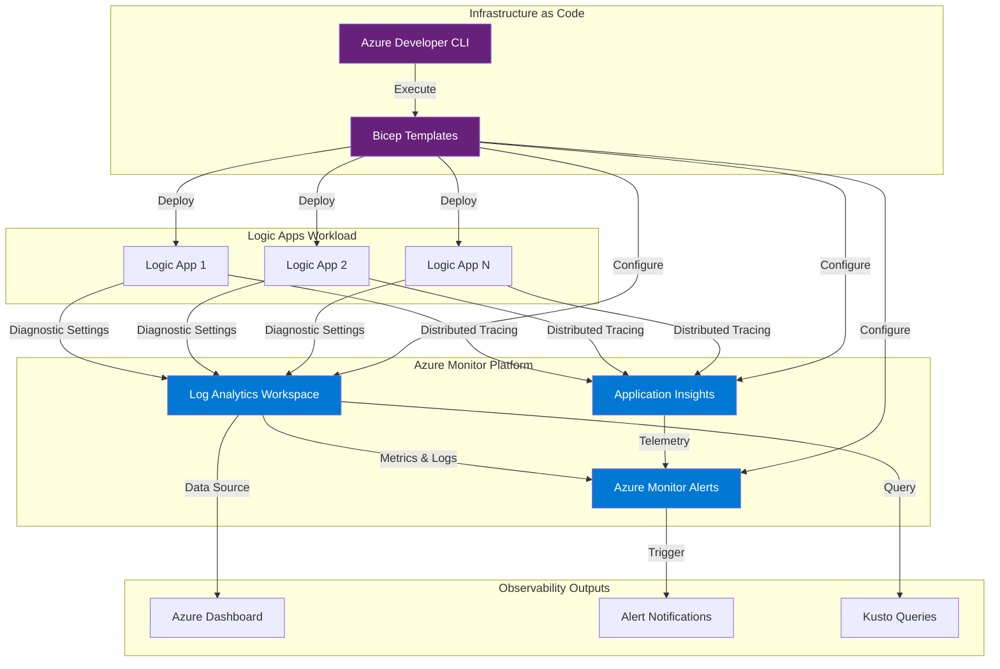
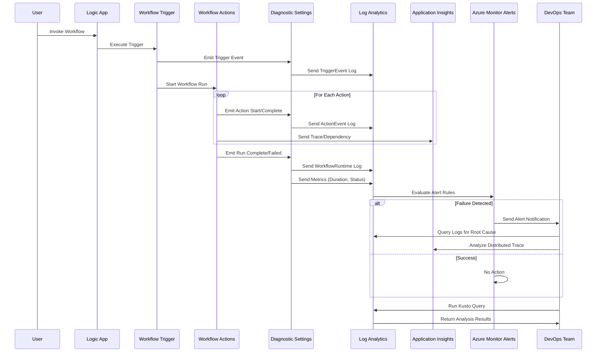

# Azure Logic Apps Monitoring Open Source Project

[](https://opensource.org/licenses/MIT)
[](https://azure.microsoft.com/en-us/services/logic-apps/)
[](https://learn.microsoft.com/en-us/azure/developer/azure-developer-cli/)

## Project Overview

The **Azure Logic Apps Monitoring Open Source Project** demonstrates enterprise-grade observability patterns for Azure Logic Apps using Azure Monitor. This project provides a comprehensive monitoring solution that showcases best practices for collecting, analyzing, and visualizing workflow telemetry data to ensure reliable enterprise workflow orchestration.

### Why This Matters

While Azure Logic Apps provides basic monitoring capabilities out of the box, enterprise scenarios require advanced observability patterns including:
- **Proactive alerting** for workflow failures and performance degradation
- **Comprehensive logging** of workflow execution details
- **Custom metrics** for business-specific KPIs
- **Automated diagnostics** configuration across multiple Logic Apps
- **Centralized analytics** using Azure Monitor and Log Analytics

This project bridges the gap between default monitoring and production-ready observability, providing reusable Infrastructure as Code (IaC) templates and query examples that can be deployed in minutes.

## Target Audience

| Role | Responsibilities | How to Leverage the Solution | Benefits |
|------|------------------|------------------------------|----------|
| **Cloud Solution Architect** | Design scalable, resilient cloud architectures | Use the reference architecture and Bicep templates to standardize Logic Apps monitoring across enterprise workloads | Reduce design time, ensure consistent observability patterns, demonstrate Azure Monitor best practices to stakeholders |
| **DevOps Engineer** | Implement CI/CD pipelines, manage infrastructure, ensure operational excellence | Deploy the IaC templates via Azure Developer CLI, integrate Kusto queries into operational dashboards, configure automated alerts | Accelerate deployment, reduce manual configuration errors, improve MTTR (Mean Time To Recovery) with pre-built queries |
| **Application Developer** | Build and maintain Logic Apps workflows | Reference diagnostic settings configuration, use sample queries to troubleshoot workflow issues, understand telemetry collection | Faster debugging, better understanding of workflow behavior, learn Azure Monitor integration patterns |
| **Site Reliability Engineer (SRE)** | Monitor system health, respond to incidents, optimize performance | Leverage alerting patterns, use performance queries to identify bottlenecks, analyze failure trends | Proactive incident detection, data-driven performance optimization, reduced operational toil |
| **Platform Engineer** | Manage shared platform services and governance | Deploy monitoring infrastructure at scale, enforce diagnostic settings policies, standardize observability across teams | Consistent platform governance, reduced operational overhead, improved security and compliance posture |

## Features

### Design Principles

This solution is built on four core design principles for enterprise monitoring:

1. **Infrastructure as Code**: All monitoring resources defined in Bicep for repeatability and version control
2. **Comprehensive Telemetry**: Collect metrics, logs, and traces from all Logic Apps components
3. **Actionable Insights**: Pre-built queries and dashboards for common operational scenarios
4. **Automation-First**: Minimize manual configuration through automated deployment

### Feature Overview

| Feature | Purpose | Benefit |
|---------|---------|---------|
| **Automated Diagnostic Settings** | Configure comprehensive log and metric collection for all Logic Apps | Ensures consistent telemetry collection without manual configuration per workflow |
| **Log Analytics Workspace Integration** | Centralize all Logic Apps logs in a queryable repository | Enables cross-workflow analysis, long-term retention, and advanced analytics |
| **Application Insights Integration** | Correlate Logic Apps execution with distributed tracing | Track end-to-end transactions across Logic Apps and dependent services |
| **Pre-configured Alert Rules** | Automated notifications for failures, performance degradation, and anomalies | Proactive incident detection reduces MTTR and prevents business impact |
| **Sample Kusto Queries** | Ready-to-use KQL queries for common troubleshooting scenarios | Accelerates root cause analysis and reduces learning curve for Azure Monitor |
| **Custom Metrics Collection** | Track business-specific KPIs alongside technical metrics | Align operational dashboards with business outcomes |
| **Resource Health Monitoring** | Automated tracking of Azure platform health affecting Logic Apps | Distinguish between application issues and Azure platform incidents |

### Solution Comparison

| Aspect | Project Solution | Default Azure Monitor |
|--------|------------------|----------------------|
| **Diagnostic Settings** | Automated deployment via Bicep with all relevant log categories enabled | Requires manual configuration per Logic App |
| **Log Retention** | Configurable retention in Log Analytics (30-730 days) | Run history available for 90 days only |
| **Query Library** | Pre-built Kusto queries for common scenarios (performance, errors, trends) | No pre-built queries; users must write KQL from scratch |
| **Alerting** | Pre-configured alert rules for workflow failures, latency, and throttling | No default alerts; requires manual creation |
| **Cross-Workflow Analysis** | Centralized Log Analytics enables querying across multiple workflows | Portal UI limited to individual workflow analysis |
| **Infrastructure Management** | Full IaC with Bicep templates and Azure Developer CLI support | Monitoring configured through Portal UI clicks |
| **Distributed Tracing** | Application Insights integration for end-to-end transaction tracking | Basic run history without correlation to dependent services |
| **Cost Optimization** | Configurable log sampling and retention policies | All logs collected at full fidelity with default retention |

### Diagnostic Settings

Diagnostic settings are the foundation of Azure Monitor observability for Logic Apps. They control which telemetry is collected and where it's sent (Log Analytics, Storage, Event Hubs, or partner solutions).

#### How Diagnostic Settings Work

When you enable diagnostic settings for a Logic App:
1. Azure automatically captures workflow execution events
2. Telemetry is routed to configured destinations (e.g., Log Analytics Workspace)
3. Logs and metrics become queryable for analysis, alerting, and visualization
4. Historical data is retained based on workspace configuration

#### Diagnostic Settings Collection

| Metrics | Metrics Description | Logs | Logs Description | Monitoring Improvement |
|---------|---------------------|------|------------------|------------------------|
| **AllMetrics** | Aggregated metrics including runs started, completed, failed, succeeded, throttled, and latency measurements | **WorkflowRuntime** | Detailed execution logs including action inputs/outputs, trigger events, and workflow state transitions | Enables performance baselining, capacity planning, and SLA tracking with queryable execution details |
| N/A | N/A | **IntegrationAccountTrackingEvents** | Custom tracking events emitted by workflows (e.g., business transaction IDs, correlation data) | Correlates technical execution with business processes for end-to-end transaction visibility |
| N/A | N/A | **WorkflowManagementOperations** | Control plane operations including workflow creation, updates, and configuration changes | Provides audit trail for governance, compliance, and change management |

#### Example Categories Collected

- **WorkflowRuntime**: Action execution results, retry attempts, error messages, execution duration
- **WorkflowMetrics**: Run counts, success/failure rates, throughput, latency percentiles
- **IntegrationAccountTrackingEvents**: B2B transaction tracking, EDI message processing, custom business events

#### Why This Improves Monitoring

| Without Diagnostic Settings | With Diagnostic Settings |
|-----------------------------|--------------------------|
| Limited to 90-day run history in Portal | Configurable retention (30-730 days) in Log Analytics |
| No cross-workflow analysis | Query across all Logic Apps simultaneously |
| Manual troubleshooting via Portal UI | Automated alerting and programmatic analysis |
| No integration with external SIEM tools | Export to Event Hubs, Storage, or partner solutions |
| Basic metrics only | Comprehensive logs with action-level details |

## Architecture


```mermaid
graph TB
    subgraph "Azure Monitor Platform"
        LA[Log Analytics Workspace]
        AI[Application Insights]
        AM[Azure Monitor Alerts]
    end
    
    subgraph "Logic Apps Workload"
        LApp1[Logic App 1]
        LApp2[Logic App 2]
        LApp3[Logic App N]
    end
    
    subgraph "Infrastructure as Code"
        Bicep[Bicep Templates]
        AZD[Azure Developer CLI]
    end
    
    subgraph "Observability Outputs"
        Dashboard[Azure Dashboard]
        Alerts[Alert Notifications]
        Queries[Kusto Queries]
    end
    
    LApp1 -->|Diagnostic Settings| LA
    LApp2 -->|Diagnostic Settings| LA
    LApp3 -->|Diagnostic Settings| LA
    
    LApp1 -->|Distributed Tracing| AI
    LApp2 -->|Distributed Tracing| AI
    LApp3 -->|Distributed Tracing| AI
    
    LA -->|Metrics & Logs| AM
    AI -->|Telemetry| AM
    
    AM -->|Trigger| Alerts
    LA -->|Data Source| Dashboard
    LA -->|Query| Queries
    
    Bicep -->|Deploy| LApp1
    Bicep -->|Deploy| LApp2
    Bicep -->|Deploy| LApp3
    Bicep -->|Configure| LA
    Bicep -->|Configure| AI
    Bicep -->|Configure| AM
    
    AZD -->|Execute| Bicep
    
    style LA fill:#0078d4,color:#fff
    style AI fill:#0078d4,color:#fff
    style AM fill:#0078d4,color:#fff
    style Bicep fill:#68217a,color:#fff
    style AZD fill:#68217a,color:#fff
```

## Dataflow


```mermaid
sequenceDiagram
    participant User
    participant LogicApp as Logic App
    participant Trigger as Workflow Trigger
    participant Actions as Workflow Actions
    participant DS as Diagnostic Settings
    participant LA as Log Analytics
    participant AI as Application Insights
    participant Alerts as Azure Monitor Alerts
    participant DevOps as DevOps Team
    
    User->>LogicApp: Invoke Workflow
    LogicApp->>Trigger: Execute Trigger
    Trigger->>DS: Emit Trigger Event
    DS->>LA: Send TriggerEvent Log
    
    Trigger->>Actions: Start Workflow Run
    
    loop For Each Action
        Actions->>DS: Emit Action Start/Complete
        DS->>LA: Send ActionEvent Log
        Actions->>AI: Send Trace/Dependency
    end
    
    Actions->>DS: Emit Run Complete/Failed
    DS->>LA: Send WorkflowRuntime Log
    DS->>LA: Send Metrics (Duration, Status)
    
    LA->>Alerts: Evaluate Alert Rules
    
    alt Failure Detected
        Alerts->>DevOps: Send Alert Notification
        DevOps->>LA: Query Logs for Root Cause
        DevOps->>AI: Analyze Distributed Trace
    else Success
        Alerts->>Alerts: No Action
    end
    
    DevOps->>LA: Run Kusto Query
    LA->>DevOps: Return Analysis Results
```

## Prerequisites

### Tools Required

| Tool | Version | Purpose | Installation Link |
|------|---------|---------|------------------|
| Azure Developer CLI | 1.5.0+ | Infrastructure deployment and management | [Install azd](https://learn.microsoft.com/en-us/azure/developer/azure-developer-cli/install-azd) |
| Azure CLI | 2.50.0+ | Azure resource management | [Install Azure CLI](https://learn.microsoft.com/en-us/cli/azure/install-azure-cli) |
| Git | 2.40.0+ | Version control | [Install Git](https://git-scm.com/downloads) |

### Azure Resources

- **Azure Subscription** with sufficient quota for:
  - Logic Apps (Standard or Consumption)
  - Log Analytics Workspace
  - Application Insights
  - Azure Monitor Alert Rules
- **Resource Group** (will be created during deployment)

### Required Permissions

You need the following RBAC roles to deploy this solution:

## RBAC Roles

| Role | Description | Documentation Link |
|------|-------------|-------------------|
| **Contributor** | Create and manage all Azure resources including Logic Apps, Log Analytics, and Application Insights | [Contributor Role](https://learn.microsoft.com/en-us/azure/role-based-access-control/built-in-roles#contributor) |
| **Logic App Contributor** | Create and manage Logic Apps workflows | [Logic App Contributor](https://learn.microsoft.com/en-us/azure/role-based-access-control/built-in-roles#logic-app-contributor) |
| **Log Analytics Contributor** | Manage Log Analytics workspaces and query data | [Log Analytics Contributor](https://learn.microsoft.com/en-us/azure/role-based-access-control/built-in-roles#log-analytics-contributor) |
| **Monitoring Contributor** | Configure diagnostic settings and alert rules | [Monitoring Contributor](https://learn.microsoft.com/en-us/azure/role-based-access-control/built-in-roles#monitoring-contributor) |

### Dependencies

- **.NET 8.0 SDK** (if extending sample Logic Apps)
- **PowerShell 7.0+** or **Bash** for deployment scripts

## Installation & Deployment

### 1. Clone the Repository

```bash
git clone https://github.com/yourusername/Azure-LogicApps-Monitoring.git
cd Azure-LogicApps-Monitoring
```

### 2. Authenticate with Azure

```bash
azd auth login
```

Follow the browser prompt to authenticate with your Azure account.

### 3. Initialize the Azure Environment

```bash
azd init
```

When prompted:
- **Environment name**: Enter a unique name (e.g., `logicapps-monitoring-dev`)
- **Azure subscription**: Select your subscription
- **Azure location**: Choose a region (e.g., `eastus`, `westeurope`)

### 4. Configure Deployment Parameters (Optional)

Edit the main.parameters.json file to customize:

```json
{
  "logAnalyticsRetentionDays": 90,
  "enableApplicationInsights": true,
  "alertEmailRecipients": "your-email@example.com"
}
```

### 5. Deploy the Infrastructure

```bash
azd up
```

This command will:
- Provision all Azure resources (Logic Apps, Log Analytics, Application Insights)
- Configure diagnostic settings automatically
- Deploy sample Logic Apps workflows
- Set up monitoring alerts

**Expected deployment time**: 5-10 minutes

### 6. Verify Deployment

```bash
azd show
```

Output will display:
- Resource Group name
- Logic App endpoints
- Log Analytics Workspace ID
- Application Insights Connection String

### 7. Access Log Analytics

```bash
az monitor log-analytics workspace show \
  --resource-group <resource-group-name> \
  --workspace-name <workspace-name> \
  --query customerId -o tsv
```

Navigate to [Azure Portal > Log Analytics Workspaces](https://portal.azure.com/#view/HubsExtension/BrowseResource/resourceType/Microsoft.OperationalInsights%2Fworkspaces) and select your workspace to run queries.

## Usage Examples

### Example 1: Analyze Workflow Execution Failures

**Scenario**: Identify failed workflow runs in the last 24 hours with error details.

```kql
AzureDiagnostics
| where Category == "WorkflowRuntime"
| where status_s == "Failed"
| where TimeGenerated > ago(24h)
| project 
    TimeGenerated,
    workflowName_s,
    runId_s,
    error_code_s,
    error_message_s,
    clientTrackingId_s
| order by TimeGenerated desc
```

**Sample Output**:

| TimeGenerated | workflowName_s | runId_s | error_code_s | error_message_s | clientTrackingId_s |
|---------------|----------------|---------|--------------|-----------------|-------------------|
| 2024-01-15 14:32:10 | ProcessOrder | 08584283... | ActionFailed | HTTP request failed with status 500 | order-12345 |
| 2024-01-15 13:15:45 | SendNotification | 08584281... | Timeout | Operation timed out after 120 seconds | notif-67890 |

**Chart Visualization**: Render as time chart to identify failure spikes.

**Reference**: [Monitor Logic Apps - Troubleshoot workflow failures](https://learn.microsoft.com/en-us/azure/logic-apps/monitor-logic-apps-log-analytics)

---

### Example 2: Track Workflow Performance Over Time

**Scenario**: Calculate average execution duration and success rate per workflow.

```kql
AzureDiagnostics
| where Category == "WorkflowRuntime"
| where TimeGenerated > ago(7d)
| summarize 
    TotalRuns = count(),
    SuccessfulRuns = countif(status_s == "Succeeded"),
    FailedRuns = countif(status_s == "Failed"),
    AvgDurationMs = avg(todouble(duration_s))
    by workflowName_s
| extend SuccessRate = round((SuccessfulRuns * 100.0) / TotalRuns, 2)
| project 
    WorkflowName = workflowName_s,
    TotalRuns,
    SuccessfulRuns,
    FailedRuns,
    SuccessRate,
    AvgDurationMs
| order by TotalRuns desc
```

**Sample Output**:

| WorkflowName | TotalRuns | SuccessfulRuns | FailedRuns | SuccessRate | AvgDurationMs |
|--------------|-----------|----------------|------------|-------------|---------------|
| ProcessOrder | 15420 | 15382 | 38 | 99.75% | 2348.5 |
| SendNotification | 8934 | 8921 | 13 | 99.85% | 1203.2 |
| DataSync | 2341 | 2298 | 43 | 98.16% | 5432.1 |

**Chart Visualization**: Render as bar chart comparing success rates across workflows.

**Reference**: [Monitor Logic Apps - Performance metrics](https://learn.microsoft.com/en-us/azure/logic-apps/monitor-logic-apps#view-metrics)

---

### Example 3: Identify Long-Running Workflows

**Scenario**: Find workflows exceeding 30 seconds execution time.

```kql
AzureDiagnostics
| where Category == "WorkflowRuntime"
| where TimeGenerated > ago(1h)
| where todouble(duration_s) > 30000
| project 
    TimeGenerated,
    workflowName_s,
    runId_s,
    DurationSeconds = todouble(duration_s) / 1000,
    status_s,
    clientTrackingId_s
| order by DurationSeconds desc
```

**Sample Output**:

| TimeGenerated | workflowName_s | runId_s | DurationSeconds | status_s | clientTrackingId_s |
|---------------|----------------|---------|-----------------|----------|--------------------|
| 2024-01-15 15:22:33 | DataSync | 08584285... | 124.5 | Succeeded | sync-task-001 |
| 2024-01-15 15:18:12 | ProcessOrder | 08584284... | 87.3 | Succeeded | order-78901 |

**Chart Visualization**: Render as time chart with duration threshold line.

**Reference**: [Monitor Logic Apps - Query logs](https://learn.microsoft.com/en-us/azure/logic-apps/monitor-logic-apps-log-analytics#query-logs)

---

### Example 4: Analyze Action-Level Performance

**Scenario**: Break down execution time by individual actions within workflows.

```kql
AzureDiagnostics
| where Category == "WorkflowRuntime"
| where TimeGenerated > ago(1h)
| where isnotempty(actionName_s)
| summarize 
    ActionCount = count(),
    AvgDurationMs = avg(todouble(duration_s)),
    MaxDurationMs = max(todouble(duration_s)),
    FailureCount = countif(status_s == "Failed")
    by workflowName_s, actionName_s
| project 
    WorkflowName = workflowName_s,
    ActionName = actionName_s,
    ActionCount,
    AvgDurationMs,
    MaxDurationMs,
    FailureCount
| order by AvgDurationMs desc
```

**Sample Output**:

| WorkflowName | ActionName | ActionCount | AvgDurationMs | MaxDurationMs | FailureCount |
|--------------|------------|-------------|---------------|---------------|--------------|
| ProcessOrder | CallInventoryAPI | 2341 | 3421.5 | 8932.1 | 12 |
| ProcessOrder | SendEmailNotification | 2341 | 1203.8 | 2345.6 | 3 |
| DataSync | QueryDatabase | 456 | 5234.2 | 12340.5 | 8 |

**Chart Visualization**: Render as horizontal bar chart showing action performance.

**Reference**: [Monitor Logic Apps - Action metrics](https://learn.microsoft.com/en-us/azure/logic-apps/monitor-logic-apps#action-metrics)

---

### Example 5: Detect Throttling Events

**Scenario**: Identify workflows experiencing throttling due to connector limits.

```kql
AzureDiagnostics
| where Category == "WorkflowRuntime"
| where TimeGenerated > ago(24h)
| where status_s == "Throttled" or error_code_s contains "Throttl"
| summarize 
    ThrottleCount = count(),
    LastThrottleTime = max(TimeGenerated)
    by workflowName_s, actionName_s, error_code_s
| project 
    WorkflowName = workflowName_s,
    ActionName = actionName_s,
    ErrorCode = error_code_s,
    ThrottleCount,
    LastThrottleTime
| order by ThrottleCount desc
```

**Sample Output**:

| WorkflowName | ActionName | ErrorCode | ThrottleCount | LastThrottleTime |
|--------------|------------|-----------|---------------|------------------|
| DataSync | Office365Connector | TooManyRequests | 234 | 2024-01-15 15:45:22 |
| ProcessOrder | SQLConnector | RateLimitExceeded | 87 | 2024-01-15 15:32:10 |

**Chart Visualization**: Render as time chart showing throttling events over time.

**Reference**: [Monitor Logic Apps - Throttling limits](https://learn.microsoft.com/en-us/azure/logic-apps/logic-apps-limits-and-config#throughput-limits)

---

### Example 6: Correlate Logic Apps with Application Insights

**Scenario**: Track end-to-end transaction across Logic Apps and dependent services.

```kql
union 
    (AzureDiagnostics
    | where Category == "WorkflowRuntime"
    | project 
        TimeGenerated,
        Component = "LogicApp",
        Operation = workflowName_s,
        OperationId = clientTrackingId_s,
        Duration = todouble(duration_s),
        Status = status_s
    ),
    (dependencies
    | project 
        TimeGenerated,
        Component = "Dependency",
        Operation = name,
        OperationId = operation_Id,
        Duration = duration,
        Status = resultCode
    )
| where TimeGenerated > ago(1h)
| order by TimeGenerated desc
```

**Sample Output**:

| TimeGenerated | Component | Operation | OperationId | Duration | Status |
|---------------|-----------|-----------|-------------|----------|--------|
| 2024-01-15 15:50:12 | LogicApp | ProcessOrder | order-12345 | 2348.5 | Succeeded |
| 2024-01-15 15:50:13 | Dependency | SQL Query | order-12345 | 1234.2 | 200 |
| 2024-01-15 15:50:14 | Dependency | HTTP POST | order-12345 | 456.7 | 200 |

**Chart Visualization**: Render as application map showing dependencies.

**Reference**: [Application Insights - Distributed tracing](https://learn.microsoft.com/en-us/azure/azure-monitor/app/distributed-tracing)

## License Information

This project is licensed under the **MIT License**.

```
MIT License

Copyright (c) 2024 Azure Logic Apps Monitoring Contributors

Permission is hereby granted, free of charge, to any person obtaining a copy
of this software and associated documentation files (the "Software"), to deal
in the Software without restriction, including without limitation the rights
to use, copy, modify, merge, publish, distribute, sublicense, and/or sell
copies of the Software, and to permit persons to whom the Software is
furnished to do so, subject to the following conditions:

The above copyright notice and this permission notice shall be included in all
copies or substantial portions of the Software.

THE SOFTWARE IS PROVIDED "AS IS", WITHOUT WARRANTY OF ANY KIND, EXPRESS OR
IMPLIED, INCLUDING BUT NOT LIMITED TO THE WARRANTIES OF MERCHANTABILITY,
FITNESS FOR A PARTICULAR PURPOSE AND NONINFRINGEMENT. IN NO EVENT SHALL THE
AUTHORS OR COPYRIGHT HOLDERS BE LIABLE FOR ANY CLAIM, DAMAGES OR OTHER
LIABILITY, WHETHER IN AN ACTION OF CONTRACT, TORT OR OTHERWISE, ARISING FROM,
OUT OF OR IN CONNECTION WITH THE SOFTWARE OR THE USE OR OTHER DEALINGS IN THE
SOFTWARE.
```

See LICENSE.md for the full license text.

## References

### Microsoft Documentation
- [Monitor Logic Apps - Azure Logic Apps | Microsoft Learn](https://learn.microsoft.com/en-us/azure/logic-apps/monitor-logic-apps)
- [Monitor Logic Apps with Azure Monitor logs | Microsoft Learn](https://learn.microsoft.com/en-us/azure/logic-apps/monitor-logic-apps-log-analytics)
- [Azure Logic Apps limits and configuration | Microsoft Learn](https://learn.microsoft.com/en-us/azure/logic-apps/logic-apps-limits-and-config)
- [Diagnostic settings in Azure Monitor | Microsoft Learn](https://learn.microsoft.com/en-us/azure/azure-monitor/essentials/diagnostic-settings)
- [Kusto Query Language (KQL) | Microsoft Learn](https://learn.microsoft.com/en-us/azure/data-explorer/kusto/query/)
- [Azure Developer CLI (azd) | Microsoft Learn](https://learn.microsoft.com/en-us/azure/developer/azure-developer-cli/)

### GitHub Best Practices
- [GitHub README Guidelines](https://docs.github.com/en/repositories/managing-your-repositorys-settings-and-features/customizing-your-repository/about-readmes)
- [Open Source Guides - Best Practices](https://opensource.guide/best-practices/)
- [Awesome README - Examples and Resources](https://github.com/matiassingers/awesome-readme)

### Azure Monitor Resources
- [Azure Monitor Best Practices](https://learn.microsoft.com/en-us/azure/azure-monitor/best-practices)
- [Log Analytics Workspace Design](https://learn.microsoft.com/en-us/azure/azure-monitor/logs/workspace-design)
- [Application Insights Overview](https://learn.microsoft.com/en-us/azure/azure-monitor/app/app-insights-overview)

### Community Resources
- [Azure Architecture Center - Monitoring Patterns](https://learn.microsoft.com/en-us/azure/architecture/best-practices/monitoring)
- [Azure Logic Apps Community](https://techcommunity.microsoft.com/t5/azure-integration-services-blog/bg-p/AzureIntegrationServicesBlog)

---

## Contributing

We welcome contributions! Please see CONTRIBUTING.md for guidelines on:
- Reporting issues
- Submitting pull requests
- Code of conduct
- Development setup

## Support

For questions and support:
- **Issues**: [GitHub Issues](https://github.com/yourusername/Azure-LogicApps-Monitoring/issues)
- **Discussions**: [GitHub Discussions](https://github.com/yourusername/Azure-LogicApps-Monitoring/discussions)
- **Microsoft Q&A**: [Azure Logic Apps Q&A](https://learn.microsoft.com/en-us/answers/tags/133/azure-logic-apps)

## Roadmap

Upcoming features:
- [ ] Power BI dashboard templates
- [ ] ARM template support (in addition to Bicep)
- [ ] Azure DevOps pipeline integration
- [ ] Custom connector monitoring patterns
- [ ] Cost optimization queries

---

**Built with ❤️ for the Azure community**

Similar code found with 2 license types