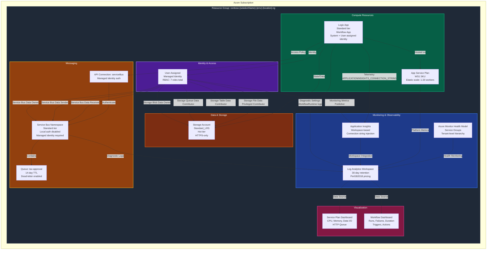
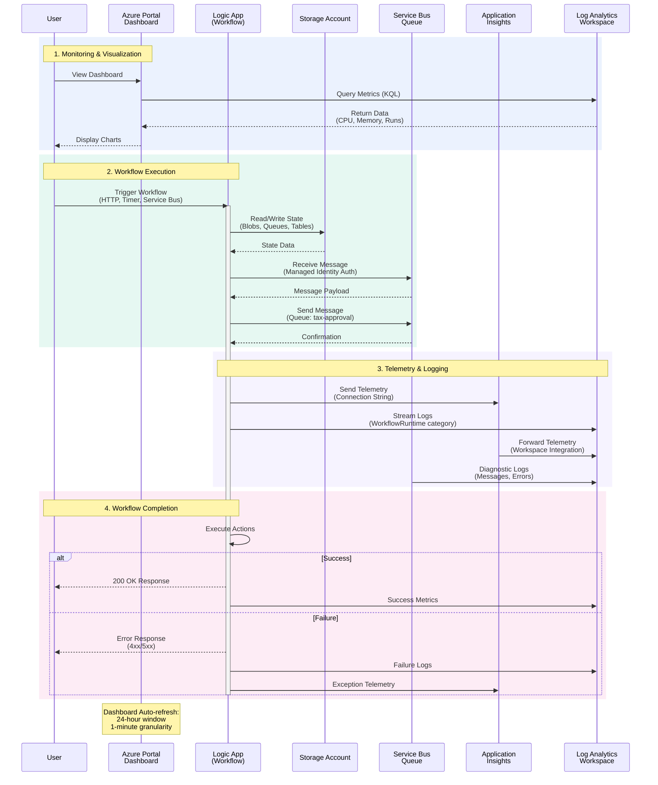

# Azure Logic Apps Monitoring

This project demonstrates Azure Monitor best practices for Logic Apps through production-ready Infrastructure as Code (IaC) templates. Built for beginner-to-intermediate developers and architects, it provides reusable Bicep modules that deploy Logic Apps with integrated observability, health tracking, and security best practices using Azure Monitor, Application Insights, and Log Analytics.

---

## Badges


---

## Prerequisites

- **Azure Subscription**: Active subscription with Contributor or Owner access
- **Azure Developer CLI (azd)**: Version 1.0.0 or higher ([Installation Guide](https://learn.microsoft.com/azure/developer/azure-developer-cli/install-azd))
- **Azure CLI**: Version 2.50.0 or higher ([Installation Guide](https://learn.microsoft.com/cli/azure/install-azure-cli))
- **Bicep CLI**: Version 0.23.0 or higher (installed with Azure CLI)
- **Permissions**: Ability to create resource groups and assign RBAC (Role-Based Access Control) roles
- **Knowledge**: Basic understanding of Azure Logic Apps, Azure Monitor, and Infrastructure as Code

---

## File Structure

```
Azure-LogicApps-Monitoring/
├── .azure/                          # Azure Developer CLI environments
│   ├── config.json                  # Global azd configuration
│   ├── dev/                         # Development environment
│   │   ├── .env                     # Dev environment variables
│   │   └── config.json              # Dev configuration
│   └── prod/                        # Production environment
│       ├── .env                     # Prod environment variables
│       └── config.json              # Prod configuration
├── .vscode/                         # VS Code workspace settings
│   ├── launch.json                  # Debug configurations
│   ├── settings.json                # Workspace settings
│   └── tasks.json                   # Build tasks
├── infra/                           # Infrastructure as Code
│   ├── main.bicep                   # Subscription-level orchestrator
│   └── main.parameters.json         # Deployment parameters
├── src/                             # Bicep modules
│   ├── logic-app.bicep              # Logic App + dashboards
│   ├── monitoring/                  # Monitoring infrastructure
│   │   ├── main.bicep               # Monitoring orchestrator
│   │   ├── app-insights.bicep       # Application Insights
│   │   ├── azure-monitor-health-model.bicep  # Health model
│   │   └── log-analytics-workspace.bicep     # Log Analytics
│   └── shared/                      # Shared resources
│       ├── main.bicep               # Shared orchestrator
│       ├── data/                    # Storage infrastructure
│       │   └── main.bicep           # Storage account
│       └── messaging/               # Messaging infrastructure
│           └── main.bicep           # Service Bus namespace
├── tax-docs/                        # Sample Logic App workflow
│   ├── .funcignore                  # Deployment exclusions
│   ├── .gitignore                   # Git exclusions
│   ├── connections.json             # Managed API connections
│   ├── host.json                    # Function host configuration
│   └── tax-processing/              # Sample workflow
│       └── workflow.json            # Workflow definition
├── azure.yaml                       # Azure Developer CLI project
├── host.json                        # Root Functions runtime config
├── CODE_OF_CONDUCT.md               # Community guidelines
├── CONTRIBUTING.md                  # Contribution guidelines
├── LICENSE.md                       # MIT License
├── README.md                        # This file
└── SECURITY.md                      # Security policies
```

---

## Architecture

### System Architecture


```mermaid
flowchart TB
    subgraph Subscription["Azure Subscription"]
        subgraph RG["Resource Group: contoso-{solutionName}-{env}-{location}-rg"]
            subgraph MonitoringStack["Monitoring & Observability"]
                LAW["Log Analytics Workspace<br/>30-day retention<br/>PerGB2018 pricing"]
                AI["Application Insights<br/>Workspace-based<br/>Connection string injection"]
                HM["Azure Monitor Health Model<br/>Service Groups<br/>Tenant-level hierarchy"]
            end
            
            subgraph ComputeLayer["Compute Resources"]
                ASP["App Service Plan<br/>WS1 SKU<br/>Elastic scale: 1-20 workers"]
                LA["Logic App<br/>Standard tier<br/>Workflow App<br/>System + User-assigned identity"]
            end
            
            subgraph DataLayer["Data & Storage"]
                SA["Storage Account<br/>Standard_LRS<br/>Hot tier<br/>HTTPS-only"]
            end
            
            subgraph IdentityLayer["Identity & Access"]
                UMI["User-Assigned<br/>Managed Identity<br/>RBAC: 7 roles total"]
            end
            
            subgraph DashboardLayer["Visualization"]
                DASH1["Service Plan Dashboard<br/>CPU, Memory, Data I/O<br/>HTTP Queue"]
                DASH2["Workflow Dashboard<br/>Runs, Failures, Duration<br/>Triggers, Actions"]
            end
            
            subgraph MessagingLayer["Messaging"]
                SB["Service Bus Namespace<br/>Standard tier<br/>Local auth disabled<br/>Managed identity required"]
                Queue["Queue: tax-approval<br/>14-day TTL<br/>Dead-letter enabled"]
                SBConn["API Connection: serviceBus<br/>Managed identity auth"]
            end
        end
    end
    
    UMI -->|Storage Blob Data Owner| SA
    UMI -->|Storage Queue Data Contributor| SA
    UMI -->|Storage Table Data Contributor| SA
    UMI -->|Storage File Data Privileged Contributor| SA
    UMI -->|Monitoring Metrics Publisher| AI
    UMI -->|Service Bus Data Owner| SB
    UMI -->|Service Bus Data Sender| SB
    UMI -->|Service Bus Data Receiver| SB
    
    LA -->|Hosted on| ASP
    LA -->|Identity| UMI
    LA -->|State/Data| SA
    LA -->|Diagnostic Settings:<br/>WorkflowRuntime logs| LAW
    LA -->|Telemetry:<br/>APPLICATIONINSIGHTS_CONNECTION_STRING| AI
    LA -->|Access Policy| SBConn
    
    SBConn -->|Authenticate| SB
    SB -->|Contains| Queue
    
    AI -->|Workspace Integration| LAW
    ASP -->|Platform Metrics| LAW
    SB -->|Diagnostic Logs| LAW
    HM -->|Health Monitoring| LAW
    
    LAW -->|Data Source| DASH1
    LAW -->|Data Source| DASH2
    
    style MonitoringStack fill:#1E3A8A,stroke:#3B82F6,stroke-width:2px,color:#FFFFFF
    style ComputeLayer fill:#065F46,stroke:#10B981,stroke-width:2px,color:#FFFFFF
    style DataLayer fill:#7C2D12,stroke:#F97316,stroke-width:2px,color:#FFFFFF
    style IdentityLayer fill:#4C1D95,stroke:#A78BFA,stroke-width:2px,color:#FFFFFF
    style DashboardLayer fill:#831843,stroke:#EC4899,stroke-width:2px,color:#FFFFFF
    style MessagingLayer fill:#92400E,stroke:#FBBF24,stroke-width:2px,color:#FFFFFF
    style RG fill:#1F2937,stroke:#6B7280,stroke-width:1px,color:#FFFFFF
```

### Data Flow


```mermaid
sequenceDiagram
    participant User
    participant Portal as Azure Portal<br/>Dashboard
    participant LA as Logic App<br/>(Workflow)
    participant SA as Storage Account
    participant SB as Service Bus<br/>Queue
    participant AI as Application<br/>Insights
    participant LAW as Log Analytics<br/>Workspace
    
    rect rgba(59, 130, 246, 0.1)
        Note over User,Portal: 1. Monitoring & Visualization
        User->>Portal: View Dashboard
        Portal->>LAW: Query Metrics (KQL)
        LAW-->>Portal: Return Data<br/>(CPU, Memory, Runs)
        Portal-->>User: Display Charts
    end
    
    rect rgba(16, 185, 129, 0.1)
        Note over User,LA: 2. Workflow Execution
        User->>LA: Trigger Workflow<br/>(HTTP, Timer, Service Bus)
        activate LA
        
        LA->>SA: Read/Write State<br/>(Blobs, Queues, Tables)
        SA-->>LA: State Data
        
        LA->>SB: Receive Message<br/>(Managed Identity Auth)
        SB-->>LA: Message Payload
        
        LA->>SB: Send Message<br/>(Queue: tax-approval)
        SB-->>LA: Confirmation
    end
    
    rect rgba(167, 139, 250, 0.1)
        Note over LA,LAW: 3. Telemetry & Logging
        LA->>AI: Send Telemetry<br/>(Connection String)
        LA->>LAW: Stream Logs<br/>(WorkflowRuntime category)
        
        AI->>LAW: Forward Telemetry<br/>(Workspace Integration)
        
        SB->>LAW: Diagnostic Logs<br/>(Messages, Errors)
    end
    
    rect rgba(236, 72, 153, 0.1)
        Note over LA,User: 4. Workflow Completion
        LA->>LA: Execute Actions
        
        alt Success
            LA-->>User: 200 OK Response
            LA->>LAW: Success Metrics
        else Failure
            LA-->>User: Error Response<br/>(4xx/5xx)
            LA->>LAW: Failure Logs
            LA->>AI: Exception Telemetry
        end
        
        deactivate LA
    end
    
    Note over Portal: Dashboard Auto-refresh:<br/>24-hour window<br/>1-minute granularity
```

### Key Components

| Component | Description | Purpose | Key Features |
|-----------|-------------|---------|--------------|
| **Logic App (Workflow App)** | Standard-tier Logic App hosted on App Service Plan | Execute business workflows with observability | WorkflowRuntime logging, system + user-assigned identity, App Insights connection string injection |
| **App Service Plan (WS1)** | Workflow Standard SKU with elastic scaling | Provide dedicated compute for Logic App | Elastic scale (1-20 workers), zone-redundancy capable, per-instance monitoring |
| **Application Insights** | APM (Application Performance Management) service | Collect telemetry, traces, and exceptions | Workspace-based resource, instrumentation key, diagnostic settings integration |
| **Log Analytics Workspace** | Centralized log aggregation and analytics | Store and query logs across all resources | 30-day retention, PerGB2018 pricing, system-assigned identity, KQL query engine |
| **Azure Monitor Health Model** | Hierarchical service group structure | Organize monitoring resources into logical groups | Tenant-level service groups, parent-child relationships, health rollup |
| **Storage Account** | Standard LRS, Hot tier storage | Provide durable storage for Logic App state and data | HTTPS-only, managed identity RBAC (4 roles), unique naming with `uniqueString()` |
| **User-Assigned Managed Identity** | Azure AD identity for the workload | Enable credential-free access to Azure resources | RBAC assignments to Storage (4 roles), Service Bus (3 roles), and Monitoring (1 role) |
| **Service Bus Namespace** | Standard-tier messaging service with local auth disabled | Enable reliable message-based integration with Logic Apps | Managed identity authentication only, SAS-free access, diagnostic logging to Log Analytics |
| **Service Bus Queue** | Message queue within Service Bus namespace | Store messages for asynchronous processing | 14-day TTL, dead-letter queue enabled, max 10 delivery attempts |
| **API Connection (Service Bus)** | Managed API connection resource for Logic Apps | Provide authenticated access to Service Bus from workflows | Managed identity-based authentication, access policy linked to Logic App identity |
| **Azure Portal Dashboards** | Pre-configured metric visualizations | Provide operational visibility for infrastructure and workflows | 2 dashboards: Service Plan metrics (CPU, memory, I/O) + Workflow metrics (runs, failures, latency) |

### RBAC Roles

| Role Name | Description | Documentation Link |
|-----------|-------------|-------------------|
| **Storage Blob Data Owner** | Full access to Azure Storage blob containers and data including ACL management | [Microsoft Learn](https://learn.microsoft.com/azure/role-based-access-control/built-in-roles#storage-blob-data-owner) |
| **Storage Queue Data Contributor** | Read, write, and delete Azure Storage queues and queue messages | [Microsoft Learn](https://learn.microsoft.com/azure/role-based-access-control/built-in-roles#storage-queue-data-contributor) |
| **Storage Table Data Contributor** | Read, write, and delete Azure Storage tables and table entities | [Microsoft Learn](https://learn.microsoft.com/azure/role-based-access-control/built-in-roles#storage-table-data-contributor) |
| **Storage File Data Privileged Contributor** | Full access to Azure Storage file shares over SMB and REST with elevated privileges | [Microsoft Learn](https://learn.microsoft.com/azure/role-based-access-control/built-in-roles#storage-file-data-privileged-contributor) |
| **Monitoring Metrics Publisher** | Enable publishing metrics against Azure resources | [Microsoft Learn](https://learn.microsoft.com/azure/role-based-access-control/built-in-roles#monitoring-metrics-publisher) |
| **Azure Service Bus Data Owner** | Full access to Azure Service Bus resources (send, receive, manage entities) | [Microsoft Learn](https://learn.microsoft.com/azure/role-based-access-control/built-in-roles#azure-service-bus-data-owner) |
| **Azure Service Bus Data Sender** | Send messages to Azure Service Bus queues and topics | [Microsoft Learn](https://learn.microsoft.com/azure/role-based-access-control/built-in-roles#azure-service-bus-data-sender) |
| **Azure Service Bus Data Receiver** | Receive and delete messages from Azure Service Bus queues and subscriptions | [Microsoft Learn](https://learn.microsoft.com/azure/role-based-access-control/built-in-roles#azure-service-bus-data-receiver) |

---

## Features

### Comprehensive Monitoring

This solution implements end-to-end observability for Logic Apps using Azure Monitor, Application Insights, and Log Analytics. All resources deploy with diagnostic settings preconfigured to capture logs and metrics, eliminating manual post-deployment configuration and ensuring consistent monitoring across environments.

**Benefits & Best Practices Applied**:
- **Centralized Logging**: All logs stream to a single Log Analytics Workspace for unified querying via KQL (Kusto Query Language)
- **Automatic Retention Management**: 30-day retention with immediate purge after expiration reduces storage costs while meeting compliance requirements
- **Workspace-Based Application Insights**: Modern workspace-based model enables cross-resource correlation and unified query interface
- **Diagnostic Settings at Deployment**: Configured via Bicep templates—no manual Azure Portal configuration required

| Feature | Description | Implementation | Documentation |
|---------|-------------|----------------|---------------|
| **WorkflowRuntime Logs** | Capture detailed execution logs for workflow runs, actions, and triggers | Diagnostic settings on Logic App resource with `WorkflowRuntime` category enabled | [Monitor Logic Apps](https://learn.microsoft.com/azure/logic-apps/monitor-logic-apps-log-analytics) |
| **Application Insights Integration** | Distributed tracing, dependency tracking, and performance monitoring | Connection string injected via `APPLICATIONINSIGHTS_CONNECTION_STRING` app setting | [Application Insights Overview](https://learn.microsoft.com/azure/azure-monitor/app/app-insights-overview) |
| **Log Analytics Workspace** | Centralized log storage with KQL query engine for analysis | PerGB2018 pricing tier, 30-day retention, system-assigned managed identity | [Log Analytics Workspace](https://learn.microsoft.com/azure/azure-monitor/logs/log-analytics-workspace-overview) |
| **Health Model Service Groups** | Hierarchical organization of monitoring resources | Tenant-level service groups linked to root service group for health rollup | [Service Groups Overview](https://learn.microsoft.com/azure/azure-monitor/service-groups/overview) |
| **Service Bus Diagnostic Logs** | Capture Service Bus operation logs, errors, and throttling events | Diagnostic settings send all log categories and metrics to Log Analytics Workspace | [Service Bus Monitoring](https://learn.microsoft.com/azure/service-bus-messaging/monitor-service-bus) |

---

### Metrics & Telemetry

Pre-configured Azure Portal dashboards provide real-time visibility into infrastructure health and workflow performance. Two dashboards capture 15+ metrics across CPU, memory, network, and workflow execution, enabling proactive issue detection and capacity planning without custom tooling.

**Benefits & Best Practices Applied**:
- **Proactive Monitoring**: Failure rate and latency metrics enable early issue detection before user impact
- **Resource Optimization**: CPU and memory trends inform scaling decisions and cost optimization strategies
- **24-Hour Default Window**: Dashboards focus on operational timeframes with auto-refresh for real-time insights
- **Automatic Time Granularity**: Azure adjusts chart granularity (1-min, 5-min, 1-hour) based on time window for optimal visualization

| Feature | Description | Metrics Captured | Dashboard Location |
|---------|-------------|------------------|-------------------|
| **Service Plan Metrics Dashboard** | Monitor App Service Plan infrastructure health and capacity utilization | CPU Percentage, Memory Percentage, Data In/Out, HTTP Queue Length | src/logic-app.bicep |
| **Workflow Execution Dashboard** | Track Logic App run success, failures, latency, and throughput | Actions Failure Rate, Job Execution Duration, Runs Completed, Runs Dispatched, Runs Failure Rate, Runs Started, Triggers Completed, Triggers Failure Rate | src/logic-app.bicep |
| **AllMetrics Collection** | Stream all available platform metrics to Log Analytics Workspace | CPU, memory, network, storage, workflow metrics (20+ total metrics) | Diagnostic settings in src/logic-app.bicep |
| **Monitoring Metrics Publisher** | Enable managed identity to publish custom metrics to Azure Monitor | Custom application metrics via RBAC-based access | src/logic-app.bicep |

---

### Security & Compliance

This solution follows Azure security best practices with managed identities, RBAC-based access control, and encryption by default. No credentials are stored in code or configuration files, and all resources enforce HTTPS-only communication with TLS 1.2+ for data in transit.

**Benefits & Best Practices Applied**:
- **Credential-Free Authentication**: Managed identities eliminate secrets management, credential rotation, and exposure risks
- **Least Privilege Access**: RBAC roles grant only necessary permissions for specific resource interactions (no wildcard permissions)
- **Encryption by Default**: HTTPS-only storage, TLS 1.2+ for connections, encryption at rest enabled automatically
- **Audit Trail**: All access logged in Azure Activity Log for compliance audits and security investigations

| Feature | Description | Security Mechanism | Implementation |
|---------|-------------|-------------------|----------------|
| **User-Assigned Managed Identity** | Credential-free authentication for Logic App to access Azure resources | Azure AD-based authentication via managed identity token exchange | Created in main.bicep, referenced in src/logic-app.bicep |
| **RBAC Role Assignments** | Granular, least-privilege access control to storage, Service Bus, and monitoring services | 4 storage roles + 3 Service Bus roles + 1 monitoring role at resource scope | src/logic-app.bicep |
| **HTTPS-Only Storage** | Enforce encrypted communication for all storage operations | `supportsHttpsTrafficOnly: true` property on storage account | src/shared/data/main.bicep |
| **System-Assigned Identity for Logs** | Secure data access for Log Analytics Workspace operations | System-assigned managed identity on Log Analytics Workspace | src/monitoring/log-analytics-workspace.bicep |
| **Local Auth Disabled (Service Bus)** | Block connection string/SAS authentication on Service Bus namespace | `disableLocalAuth: true` enforces Azure AD authentication only | src/shared/messaging/main.bicep |
| **Managed Identity API Connections** | Logic Apps connect to Service Bus using managed identity instead of connection strings | API Connection resource with access policy granting Logic App identity permissions | src/logic-app.bicep |

---

### Infrastructure as Code

All resources deploy via modular Azure Bicep templates using a subscription-level orchestrator pattern. This solution demonstrates IaC best practices with parameterization, consistent tagging, deterministic naming, and explicit dependency management for reliable, repeatable deployments across environments.

**Benefits & Best Practices Applied**:
- **Modular Architecture**: Separate modules for monitoring, storage, compute, and messaging enable independent updates and testing
- **Consistent Tagging**: All resources tagged with 9 standard tags for cost tracking, organization, and automated governance
- **Deterministic Naming**: `uniqueString()` function ensures reproducible, globally unique resource names without manual input
- **Explicit Dependencies**: `dependsOn` clauses prevent race conditions and ensure correct resource provisioning order

| Feature | Description | Implementation | Files |
|---------|-------------|----------------|-------|
| **Modular Bicep Templates** | Reusable, composable infrastructure modules with clear separation of concerns | 9 Bicep modules organized by resource category (monitoring, shared, logic-app, messaging) | main.bicep, main.bicep, main.bicep |
| **Azure Developer CLI Support** | Simplified multi-environment deployment workflow with `azd` commands | azure.yaml project definition with 2 environments (dev, prod) | azure.yaml |
| **Parameterization** | Environment-specific configuration without code changes | main.parameters.json with token replacement for `location` and `envName` | main.parameters.json |
| **Resource Tagging Strategy** | Consistent metadata across all resources for governance and cost management | 9 standard tags: Solution, Environment, ManagedBy, CostCenter, Owner, ApplicationName, BusinessUnit, DeploymentDate, Repository | Applied in infra/main.bicep |

---

## Installation & Setup

### Step 1: Clone Repository

Clone this repository to your local machine using Git.

```bash
git clone https://github.com/your-org/Azure-LogicApps-Monitoring.git
cd Azure-LogicApps-Monitoring
```

**Expected Output**: Repository files downloaded to current directory.

---

### Step 2: Login to Azure

Authenticate the Azure Developer CLI with your Azure account.

```bash
azd auth login
```

**Expected Output**: Browser opens for Azure authentication. After successful login, you'll see: `Logged in to Azure.`

---

### Step 3: Initialize Environment

Initialize a new `azd` environment or select an existing one (dev, prod).

```bash
azd init
```

**Expected Output**: Prompts for environment name (e.g., `dev`). If .env already exists, this step will use existing configuration.

---

### Step 4: Provision Infrastructure

Deploy all Azure resources defined in the Bicep templates.

```bash
azd provision
```

**Expected Output**:
```
Provisioning Azure resources (azd provision)
Subscription: <Your Subscription Name> (<subscription-id>)
Location: East US 2

Provisioning resources...
  (✓) Done: Resource group: contoso-tax-docs-dev-eastus2-rg
  (✓) Done: User-assigned managed identity: tax-docs-mi
  (✓) Done: Log Analytics Workspace: tax-docs-<unique>-law
  (✓) Done: Application Insights: tax-docs-<unique>-appinsights
  (✓) Done: Storage Account: taxdocs<unique>stg
  (✓) Done: Service Bus Namespace: tax-docs-sb-<unique>
  (✓) Done: Service Bus Queue: tax-approval
  (✓) Done: App Service Plan: tax-docs-<unique>-asp
  (✓) Done: Logic App: tax-docs-<unique>-logicapp
  (✓) Done: Service Bus API Connection: serviceBus
  (✓) Done: Dashboards: Service Plan + Workflow Metrics

SUCCESS: Your application was provisioned in Azure in X minutes Y seconds.
```

**Note**: Initial deployment takes 5-8 minutes. Subsequent deployments are faster due to incremental updates.

---

## Usage Examples

### Viewing Dashboards

#### Azure Portal Navigation

1. Navigate to the [Azure Portal](https://portal.azure.com)
2. In the left menu, select **Dashboard** or search for **"Dashboards"** in the top search bar
3. Click **Browse all dashboards**
4. Filter dashboards by your resource group name (e.g., `contoso-tax-docs-dev-eastus2-rg`)
5. Open the **Service Plan Metrics** dashboard to view CPU, memory, and I/O metrics
6. Open the **Tax-Docs-Workflows** dashboard to view run success/failure rates and latency

#### CLI Command to Open Dashboard

Use the Azure CLI to list dashboards in your resource group:

```bash
az portal dashboard list \
  --resource-group contoso-tax-docs-dev-eastus2-rg \
  --output table
```

**Expected Output**: Table listing dashboard names and resource IDs.

---

### Log Analytics Queries

Use these KQL (Kusto Query Language) queries in Log Analytics Workspace to monitor Logic App performance and troubleshoot issues. Access queries via **Azure Portal > Log Analytics Workspace > Logs**.

#### 1. Track Workflow Run Success and Failure Rates

Query all workflow runs with their status, duration, and trigger information over the past 24 hours.

```kql
AzureDiagnostics
| where TimeGenerated > ago(24h)
| where ResourceType == "WORKFLOWS"
| where Category == "WorkflowRuntime"
| where OperationName == "Microsoft.Logic/workflows/workflowRunCompleted"
| project 
    TimeGenerated,
    WorkflowName = resource_workflowName_s,
    RunId = resource_runId_s,
    Status = status_s,
    DurationMs = duration_d,
    TriggerName = resource_triggerName_s,
    ErrorCode = error_code_s,
    ErrorMessage = error_message_s
| order by TimeGenerated desc
| summarize 
    TotalRuns = count(),
    SuccessfulRuns = countif(Status == "Succeeded"),
    FailedRuns = countif(Status == "Failed"),
    AvgDurationMs = avg(DurationMs)
    by WorkflowName
| extend SuccessRate = round(100.0 * SuccessfulRuns / TotalRuns, 2)
| order by FailedRuns desc
```

**Use Case**: Identify workflows with high failure rates or long execution times. This query summarizes run statistics per workflow, enabling quick identification of problematic workflows.

---

#### 2. Analyze Action-Level Failures

Query failed actions within workflows to pinpoint specific steps causing errors.

```kql
AzureDiagnostics
| where TimeGenerated > ago(24h)
| where ResourceType == "WORKFLOWS"
| where Category == "WorkflowRuntime"
| where OperationName == "Microsoft.Logic/workflows/workflowActionCompleted"
| where status_s == "Failed"
| project 
    TimeGenerated,
    WorkflowName = resource_workflowName_s,
    RunId = resource_runId_s,
    ActionName = resource_actionName_s,
    ErrorCode = error_code_s,
    ErrorMessage = error_message_s,
    DurationMs = duration_d
| order by TimeGenerated desc
| take 50
```

**Use Case**: Troubleshoot specific action failures. This query lists the 50 most recent failed actions with error details, helping identify integration issues or configuration errors.

---

#### 3. Monitor Service Bus Message Processing

Track Service Bus operations (send, receive, errors) correlated with Logic App workflow runs.

```kql
AzureDiagnostics
| where TimeGenerated > ago(24h)
| where ResourceProvider == "MICROSOFT.SERVICEBUS"
| where Category == "OperationalLogs"
| project 
    TimeGenerated,
    OperationName,
    Status = ResultType,
    EntityName = EntityName_s,
    Message = Message_s,
    ErrorCode = ErrorCode_s
| order by TimeGenerated desc
| take 100
```

**Use Case**: Debug Service Bus integration issues. This query shows message send/receive operations, errors, and throttling events from the Service Bus namespace.

---

#### 4. Track Performance Metrics (CPU, Memory, HTTP Queue)

Query App Service Plan metrics to monitor infrastructure health and identify capacity issues.

```kql
AzureMetrics
| where TimeGenerated > ago(24h)
| where ResourceProvider == "MICROSOFT.WEB"
| where ResourceId contains "serverfarms"
| where MetricName in ("CpuPercentage", "MemoryPercentage", "HttpQueueLength")
| project 
    TimeGenerated,
    MetricName,
    Average,
    Maximum,
    Minimum
| order by TimeGenerated desc
| render timechart
```

**Use Case**: Identify infrastructure bottlenecks. This query visualizes CPU, memory, and HTTP queue length over time, helping determine if scaling is required.

---

#### 5. Correlate Logic App Runs with Application Insights Traces

Join workflow run data with Application Insights distributed traces for end-to-end observability.

```kql
let WorkflowRuns = AzureDiagnostics
| where TimeGenerated > ago(24h)
| where ResourceType == "WORKFLOWS"
| where Category == "WorkflowRuntime"
| where OperationName == "Microsoft.Logic/workflows/workflowRunCompleted"
| project TimeGenerated, WorkflowName = resource_workflowName_s, RunId = resource_runId_s, Status = status_s;
let AppInsightsTraces = traces
| where timestamp > ago(24h)
| where cloud_RoleName contains "logic-app"
| project timestamp, message, severityLevel, operation_Id;
WorkflowRuns
| join kind=inner (
    AppInsightsTraces
) on $left.RunId == $right.operation_Id
| project TimeGenerated, WorkflowName, RunId, Status, message, severityLevel
| order by TimeGenerated desc
| take 100
```

**Use Case**: Debug complex workflow issues by correlating workflow run status with Application Insights traces, exceptions, and dependency calls.

---

## Additional Resources

- **Azure Logic Apps Documentation**: [https://learn.microsoft.com/azure/logic-apps/](https://learn.microsoft.com/azure/logic-apps/)
- **Monitor Logic Apps with Azure Monitor**: [https://learn.microsoft.com/azure/logic-apps/monitor-logic-apps-log-analytics](https://learn.microsoft.com/azure/logic-apps/monitor-logic-apps-log-analytics)
- **Logic Apps Monitoring Overview**: [https://learn.microsoft.com/azure/logic-apps/monitor-logic-apps-overview](https://learn.microsoft.com/azure/logic-apps/monitor-logic-apps-overview)
- **Azure Monitor Best Practices**: [https://learn.microsoft.com/azure/azure-monitor/best-practices](https://learn.microsoft.com/azure/azure-monitor/best-practices)
- **Bicep Documentation**: [https://learn.microsoft.com/azure/azure-resource-manager/bicep/](https://learn.microsoft.com/azure/azure-resource-manager/bicep/)
- **Azure Developer CLI (azd)**: [https://learn.microsoft.com/azure/developer/azure-developer-cli/](https://learn.microsoft.com/azure/developer/azure-developer-cli/)
- **Log Analytics Workspace Overview**: [https://learn.microsoft.com/azure/azure-monitor/logs/log-analytics-workspace-overview](https://learn.microsoft.com/azure/azure-monitor/logs/log-analytics-workspace-overview)
- **Application Insights Overview**: [https://learn.microsoft.com/azure/azure-monitor/app/app-insights-overview](https://learn.microsoft.com/azure/azure-monitor/app/app-insights-overview)
- **Azure RBAC Built-in Roles**: [https://learn.microsoft.com/azure/role-based-access-control/built-in-roles](https://learn.microsoft.com/azure/role-based-access-control/built-in-roles)
- **KQL Quick Reference**: [https://learn.microsoft.com/azure/data-explorer/kql-quick-reference](https://learn.microsoft.com/azure/data-explorer/kql-quick-reference)
- **Azure Monitor Service Groups**: [https://learn.microsoft.com/azure/azure-monitor/service-groups/overview](https://learn.microsoft.com/azure/azure-monitor/service-groups/overview)
- **Service Bus Messaging with Managed Identity**: [https://learn.microsoft.com/azure/service-bus-messaging/service-bus-managed-service-identity](https://learn.microsoft.com/azure/service-bus-messaging/service-bus-managed-service-identity)
- **Service Bus Authentication and Authorization**: [https://learn.microsoft.com/azure/service-bus-messaging/service-bus-authentication-and-authorization](https://learn.microsoft.com/azure/service-bus-messaging/service-bus-authentication-and-authorization)