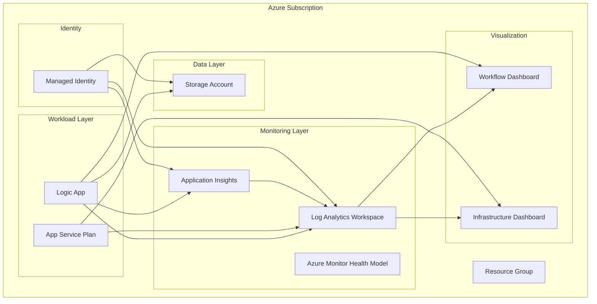
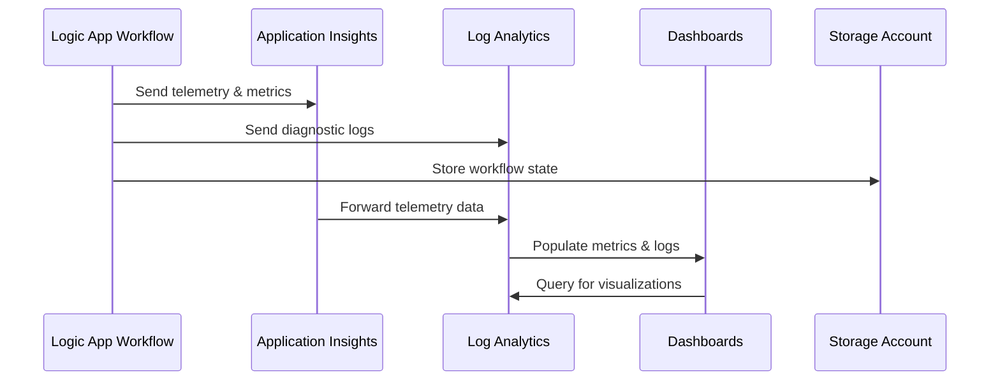

# Azure Logic Apps Monitoring

A comprehensive monitoring and observability solution for Azure Logic Apps using Azure Monitor, demonstrating production-ready best practices for workflow telemetry, diagnostics, and health modeling.


---

## Features

### Comprehensive Monitoring

End-to-end observability for Logic Apps workflows with automated diagnostics and real-time insights.

| Feature | Description |
|---------|-------------|
| **Azure Monitor Integration** | Full-stack monitoring with Log Analytics Workspace and Application Insights |
| **Health Model Management** | Azure Monitor Health Model using Service Groups for hierarchical organization |
| **Diagnostic Settings** | Automated diagnostic configuration for all Azure resources |
| **Custom Dashboards** | Pre-configured Azure Portal dashboards for workflows and infrastructure |

### Metrics & Telemetry

Track workflow performance, failures, and resource utilization with pre-configured metrics.

| Feature | Description |
|---------|-------------|
| **Workflow Runtime Metrics** | Track workflow runs, completions, failures, and execution duration |
| **Action-Level Telemetry** | Monitor individual action success rates and failure patterns |
| **Trigger Monitoring** | Track trigger completions, failures, and dispatched runs |
| **Infrastructure Metrics** | CPU, memory, network, and queue length for App Service Plans |

### Security & Compliance

Identity-based access control with Azure RBAC for secure, passwordless authentication.

| Feature | Description |
|---------|-------------|
| **Managed Identity** | User-assigned managed identity for workload authentication |
| **RBAC Integration** | Granular role assignments for Storage, Application Insights, and Log Analytics |
| **Secure Configuration** | HTTPS-only storage accounts with proper access tiers |
| **Audit Logging** | Complete audit trail through Azure Monitor diagnostic logs |

### Infrastructure as Code

Fully automated deployment using Azure Bicep with modular architecture.

| Feature | Description |
|---------|-------------|
| **Modular Bicep Templates** | Separate modules for monitoring, data, and workload components |
| **Azure Developer CLI** | Simplified deployment workflow with `azd` |
| **Parameterized Deployment** | Environment-specific configuration through parameter files |
| **Resource Tagging** | Comprehensive tagging strategy for cost management and organization |

---

## Architecture

### Solution Architecture


```mermaid
graph TB
    subgraph "Azure Subscription"
        RG[Resource Group]
        
        subgraph "Monitoring Layer"
            LAW[Log Analytics Workspace]
            AI[Application Insights]
            HM[Azure Monitor Health Model]
        end
        
        subgraph "Data Layer"
            SA[Storage Account]
        end
        
        subgraph "Workload Layer"
            ASP[App Service Plan]
            LA[Logic App]
        end
        
        subgraph "Identity"
            MI[Managed Identity]
        end
        
        subgraph "Visualization"
            D1[Workflow Dashboard]
            D2[Infrastructure Dashboard]
        end
    end
    
    LA --> AI
    LA --> LAW
    LA --> SA
    ASP --> LAW
    AI --> LAW
    MI --> SA
    MI --> AI
    MI --> LAW
    LAW --> D1
    LAW --> D2
    ASP --> D2
    LA --> D1
```

### Data Flow


```mermaid
sequenceDiagram
    participant LW as Logic App Workflow
    participant AI as Application Insights
    participant LAW as Log Analytics
    participant D as Dashboards
    participant SA as Storage Account
    
    LW->>AI: Send telemetry & metrics
    LW->>LAW: Send diagnostic logs
    LW->>SA: Store workflow state
    AI->>LAW: Forward telemetry data
    LAW->>D: Populate metrics & logs
    D->>LAW: Query for visualizations
```

### Key Components

| Component | Description | Purpose | Key Features |
|-----------|-------------|---------|--------------|
| **Log Analytics Workspace** | Central log aggregation | Collect and analyze logs from all resources | 30-day retention, PerGB2018 pricing tier, system-assigned identity |
| **Application Insights** | Application performance monitoring | Track Logic App telemetry and custom metrics | Workspace-based, instrumentation key, connection string |
| **Storage Account** | Workflow state persistence | Store Logic App runtime state and file shares | Standard_LRS, Hot tier, HTTPS-only, managed identity access |
| **App Service Plan** | Compute infrastructure | Host Logic App workflows | WorkflowStandard tier (WS1), elastic scaling, up to 20 workers |
| **Logic App** | Workflow orchestration | Execute business logic and integrations | Stateful workflows, Azure Monitor integration, diagnostic settings |
| **Managed Identity** | Secure authentication | Passwordless access to Azure resources | User-assigned, RBAC role assignments |
| **Azure Monitor Health Model** | Service group hierarchy | Organize monitoring resources logically | Tenant-level service groups |

### RBAC Roles

| Role Name | Role Description | Documentation Link |
|-----------|------------------|-------------------|
| **Storage Account Contributor** | Manage storage accounts but not access to data | [Documentation](https://learn.microsoft.com/azure/role-based-access-control/built-in-roles#storage-account-contributor) |
| **Storage Blob Data Owner** | Full access to blob containers and data | [Documentation](https://learn.microsoft.com/azure/role-based-access-control/built-in-roles#storage-blob-data-owner) |
| **Storage Queue Data Contributor** | Read, write, and delete Azure Storage queues and messages | [Documentation](https://learn.microsoft.com/azure/role-based-access-control/built-in-roles#storage-queue-data-contributor) |
| **Storage Table Data Contributor** | Read, write, and delete Azure Storage tables and entities | [Documentation](https://learn.microsoft.com/azure/role-based-access-control/built-in-roles#storage-table-data-contributor) |
| **Storage File Data Privileged Contributor** | Read, write, delete, and modify ACLs on files and directories | [Documentation](https://learn.microsoft.com/azure/role-based-access-control/built-in-roles#storage-file-data-privileged-contributor) |
| **Monitoring Metrics Publisher** | Publish metrics to Azure resources | [Documentation](https://learn.microsoft.com/azure/role-based-access-control/built-in-roles#monitoring-metrics-publisher) |

---

## File Structure

```
Azure-LogicApps-Monitoring/
├── infra/
│   ├── main.bicep                    # Root infrastructure template
│   └── main.parameters.json          # Environment-specific parameters
├── src/
│   ├── logic-app.bicep               # Logic App and App Service Plan deployment
│   ├── monitoring/
│   │   ├── main.bicep                # Monitoring orchestration module
│   │   ├── log-analytics-workspace.bicep
│   │   ├── app-insights.bicep
│   │   └── azure-monitor-health-model.bicep
│   └── shared/
│       ├── main.bicep                # Shared resources orchestration
│       └── data/
│           └── main.bicep            # Storage account and RBAC
├── .azure/
│   └── config.json                   # Azure Developer CLI configuration
├── azure.yaml                        # Azure Developer CLI manifest
└── README.md
```

### Key Files Explained

| File | Name | File Path | Description |
|------|------|-----------|-------------|
| **Root Template** | `main.bicep` | [`infra/main.bicep`](infra/main.bicep) | Subscription-level deployment orchestrating resource group, shared resources, and workload |
| **Logic App Deployment** | `logic-app.bicep` | [`src/logic-app.bicep`](src/logic-app.bicep) | App Service Plan, Logic App, diagnostic settings, and Azure Portal dashboards |
| **Monitoring Module** | `main.bicep` | [`src/monitoring/main.bicep`](src/monitoring/main.bicep) | Orchestrates Log Analytics, Application Insights, and Health Model deployment |
| **Log Analytics** | `log-analytics-workspace.bicep` | [`src/monitoring/log-analytics-workspace.bicep`](src/monitoring/log-analytics-workspace.bicep) | 30-day retention workspace with system-assigned identity |
| **Application Insights** | `app-insights.bicep` | [`src/monitoring/app-insights.bicep`](src/monitoring/app-insights.bicep) | Workspace-based Application Insights with RBAC and diagnostic settings |
| **Health Model** | `azure-monitor-health-model.bicep` | [`src/monitoring/azure-monitor-health-model.bicep`](src/monitoring/azure-monitor-health-model.bicep) | Azure Monitor Service Group for hierarchical organization |
| **Shared Resources** | `main.bicep` | [`src/shared/main.bicep`](src/shared/main.bicep) | Managed identity, data layer, and monitoring integration |
| **Storage Account** | `main.bicep` | [`src/shared/data/main.bicep`](src/shared/data/main.bicep) | Storage account with comprehensive RBAC role assignments |

---

## Prerequisites

Before deploying this solution, ensure you have:

- **Azure Subscription** with Owner or Contributor access
- **Azure Developer CLI (azd)** - [Install azd](https://learn.microsoft.com/azure/developer/azure-developer-cli/install-azd)
- **Azure CLI** - [Install Azure CLI](https://learn.microsoft.com/cli/azure/install-azure-cli)
- **Bicep CLI** - Included with Azure CLI version 2.20.0 or later
- **Visual Studio Code** (recommended) with:
  - [Bicep extension](https://marketplace.visualstudio.com/items?itemName=ms-azuretools.vscode-bicep)
  - [Azure Logic Apps extension](https://marketplace.visualstudio.com/items?itemName=ms-azuretools.vscode-azurelogicapps)

---

## Installation & Setup

### Step 1: Clone the Repository

```bash
git clone https://github.com/your-org/Azure-LogicApps-Monitoring.git
cd Azure-LogicApps-Monitoring
```

### Step 2: Authenticate with Azure

```bash
azd auth login
```

### Step 3: Initialize Azure Developer CLI

```bash
azd init
```

When prompted, provide:
- **Environment name**: Choose a unique name (e.g., `dev`, `prod`)
- **Subscription**: Select your Azure subscription
- **Location**: Choose an Azure region (e.g., `eastus`, `westus2`)

### Step 4: Deploy the Infrastructure

```bash
azd up
```

This command will:
1. Provision the resource group
2. Deploy the managed identity
3. Create the storage account with RBAC assignments
4. Deploy Log Analytics Workspace and Application Insights
5. Deploy the Azure Monitor Health Model
6. Create the App Service Plan and Logic App
7. Configure diagnostic settings and dashboards

### Step 5: Verify Deployment

```bash
azd show
```

View deployed resources in the Azure Portal:

```bash
az portal open --resource-group contoso-tax-docs-rg
```

---

## Usage Examples

### View Workflow Metrics

Navigate to the Logic App in the Azure Portal and view the pre-configured dashboard:

```bash
az portal dashboard show --name tax-docs-dashboard
```

### Query Logs in Log Analytics

```bash
az monitor log-analytics query \
  --workspace "your-workspace-id" \
  --analytics-query "AzureDiagnostics | where ResourceType == 'WORKFLOWS' | take 100"
```

### Monitor Workflow Runs

Using Azure CLI:

```bash
az logicapp workflow run list \
  --resource-group contoso-tax-docs-rg \
  --name your-logic-app-name
```

### View Application Insights Metrics

```bash
az monitor app-insights metrics show \
  --app your-app-insights-name \
  --resource-group contoso-tax-docs-rg \
  --metric "requests/count"
```

### Example: Custom Query for Failed Workflow Actions

Navigate to your Log Analytics Workspace and run:

```kql
AzureDiagnostics
| where ResourceType == "WORKFLOWS"
| where status_s == "Failed"
| summarize FailureCount = count() by workflowName_s, actionName_s
| order by FailureCount desc
```

---

## Additional Resources

### Official Microsoft Documentation

- **Azure Logic Apps**: [https://learn.microsoft.com/azure/logic-apps/](https://learn.microsoft.com/azure/logic-apps/)
- **Azure Monitor**: [https://learn.microsoft.com/azure/azure-monitor/](https://learn.microsoft.com/azure/azure-monitor/)
- **Application Insights**: [https://learn.microsoft.com/azure/azure-monitor/app/app-insights-overview](https://learn.microsoft.com/azure/azure-monitor/app/app-insights-overview)
- **Log Analytics Workspaces**: [https://learn.microsoft.com/azure/azure-monitor/logs/log-analytics-workspace-overview](https://learn.microsoft.com/azure/azure-monitor/logs/log-analytics-workspace-overview)
- **Azure Bicep**: [https://learn.microsoft.com/azure/azure-resource-manager/bicep/](https://learn.microsoft.com/azure/azure-resource-manager/bicep/)
- **Azure Developer CLI**: [https://learn.microsoft.com/azure/developer/azure-developer-cli/](https://learn.microsoft.com/azure/developer/azure-developer-cli/)

### Best Practices

- **Azure Well-Architected Framework**: [https://learn.microsoft.com/azure/well-architected/](https://learn.microsoft.com/azure/well-architected/)
- **Logic Apps Monitoring Best Practices**: [https://learn.microsoft.com/azure/logic-apps/monitor-workflows-collect-diagnostic-data](https://learn.microsoft.com/azure/logic-apps/monitor-workflows-collect-diagnostic-data)
- **Azure RBAC Best Practices**: [https://learn.microsoft.com/azure/role-based-access-control/best-practices](https://learn.microsoft.com/azure/role-based-access-control/best-practices)

### Community & Support

- **Azure Logic Apps Discussions**: [https://github.com/Azure/logicapps/discussions](https://github.com/Azure/logicapps/discussions)
- **Azure Monitor Community**: [https://techcommunity.microsoft.com/t5/azure-monitor/bd-p/AzureMonitor](https://techcommunity.microsoft.com/t5/azure-monitor/bd-p/AzureMonitor)

---

## Support

### Getting Help

- **Issues**: Report bugs or request features via [GitHub Issues](https://github.com/your-org/Azure-LogicApps-Monitoring/issues)
- **Discussions**: Ask questions and share ideas in [GitHub Discussions](https://github.com/your-org/Azure-LogicApps-Monitoring/discussions)
- **Azure Support**: For Azure-specific issues, contact [Azure Support](https://azure.microsoft.com/support/options/)

### Contributing

Contributions are welcome! Please see [CONTRIBUTING.md](CONTRIBUTING.md) for details on our code of conduct and the process for submitting pull requests.

### Security

Please see [SECURITY.md](SECURITY.md) for information on reporting security vulnerabilities.

---

## License

This project is licensed under the MIT License - see the [LICENSE.md](LICENSE.md) file for details.

---

## Acknowledgments

- Built with [Azure Bicep](https://learn.microsoft.com/azure/azure-resource-manager/bicep/)
- Deployed using [Azure Developer CLI](https://learn.microsoft.com/azure/developer/azure-developer-cli/)
- Monitoring powered by [Azure Monitor](https://azure.microsoft.com/services/monitor/)

---

**Note**: Replace `your-org` in URLs with your actual GitHub organization name before publishing.