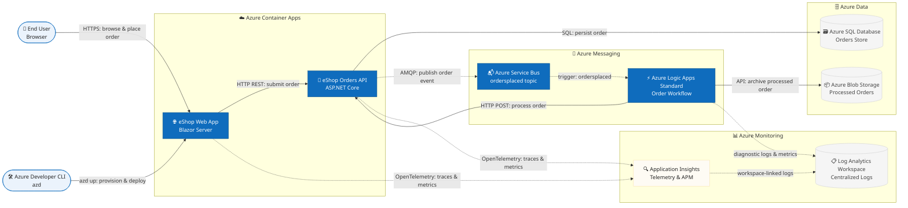

# Azure Logic Apps Monitoring

[](https://github.com/Evilazaro/Azure-LogicApps-Monitoring/actions/workflows/ci-dotnet.yml)
[](https://github.com/Evilazaro/Azure-LogicApps-Monitoring/actions/workflows/azure-dev.yml)
[](LICENSE)
[](https://github.com/Evilazaro/Azure-LogicApps-Monitoring/releases)
[](https://dotnet.microsoft.com/download/dotnet/10.0)
[](https://learn.microsoft.com/azure/developer/azure-developer-cli/)

**Azure Logic Apps Monitoring** is an end-to-end reference solution built on .NET 10 and Azure that demonstrates how to design, deploy, and monitor a distributed order-processing system. A Blazor Server frontend enables end users to place and track orders, while an ASP.NET Core REST API handles persistence and event publishing, and Azure Logic Apps Standard orchestrates downstream processing workflows — all hosted on Azure Container Apps and orchestrated locally with .NET Aspire.

Modern distributed applications require robust observability to diagnose failures, measure performance, and ensure reliability at scale. This solution addresses that challenge by instrumenting every service with **OpenTelemetry**, routing telemetry to Azure Application Insights and a Log Analytics Workspace, and using Azure Logic Apps Standard as an event-driven workflow engine that provides built-in run history, trigger monitoring, and action-level diagnostics. Service Bus dead-lettering, EF Core retry policies, and HTTP resilience patterns harden the system against transient failures.

The technology foundation combines .NET Aspire for frictionless local orchestration, ASP.NET Core 10 and Blazor Server with Microsoft FluentUI components for the API and UI layers, Entity Framework Core 10 for Azure SQL Database access, Azure Service Bus for reliable asynchronous messaging, and Bicep with the **Azure Developer CLI** (`azd`) for repeatable, one-command infrastructure provisioning and deployment.

## Table of Contents

- [Features](#features)
- [Architecture](#architecture)
- [Technologies Used](#technologies-used)
- [Quick Start](#quick-start)
- [Configuration](#configuration)
- [Deployment](#deployment)
- [Usage](#usage)
- [Contributing](#contributing)
- [License](#license)

## Features

- 🌐 **Blazor Server frontend** built with Microsoft FluentUI ASP.NET Components for an accessible, Fluent Design order management UI
- 🔗 **ASP.NET Core REST API** with OpenAPI/Swagger documentation, EF Core 10, and Azure SQL Database integration
- ⚡ **Azure Logic Apps Standard** workflows that react to Service Bus events, call the Orders API, and archive processed orders to Blob Storage
- 📬 **Azure Service Bus** topic and subscription (`ordersplaced`) for reliable, decoupled asynchronous messaging between the API and Logic Apps
- 🗄️ **Azure SQL Database** with Entity Framework Core 10, connection resiliency, and managed identity authentication
- 🔍 **Full-stack observability** via OpenTelemetry distributed tracing, custom metrics, and structured logging exported to Application Insights and Log Analytics
- 🛠️ **.NET Aspire** orchestration for local development with automatic service discovery, health checks, and resilience policies
- ☁️ **Azure Container Apps** hosting with managed identity, VNet integration, and automatic Application Insights configuration
- 🔒 **Managed identity authentication** — no secrets stored in code; all service-to-service auth uses User Assigned Managed Identity
- 🚀 **One-command deployment** via Azure Developer CLI (`azd up`) with Bicep infrastructure as code

## Architecture

### Architecture Summary

The Azure Logic Apps Monitoring solution serves two primary actors: an **End User** who interacts with the Blazor Server web application to browse and place orders, and the **Azure Developer CLI** that provisions and deploys all cloud infrastructure. The eShop Web App communicates synchronously with the eShop Orders API over HTTP REST; the API persists orders to Azure SQL Database and publishes order events asynchronously to Azure Service Bus. The Logic Apps Standard workflow subscribes to the `ordersplaced` topic, calls the Orders API to process each order, and archives successfully processed orders to Azure Blob Storage. All services emit OpenTelemetry telemetry to Application Insights, which forwards logs to a linked Log Analytics Workspace for unified observability. The API and web application are hosted on Azure Container Apps and orchestrated locally using .NET Aspire.


```mermaid
---
config:
  primaryColor: "#0f6cbd"
  primaryTextColor: "#FFFFFF"
  primaryBorderColor: "#0f548c"
  secondaryColor: "#ebf3fc"
  secondaryTextColor: "#242424"
  secondaryBorderColor: "#0f6cbd"
  tertiaryColor: "#f5f5f5"
  tertiaryTextColor: "#424242"
  tertiaryBorderColor: "#d1d1d1"
  noteBkgColor: "#fefbf4"
  noteTextColor: "#242424"
  noteBorderColor: "#f9e2ae"
  lineColor: "#616161"
  background: "#FFFFFF"
  edgeLabelBackground: "#FFFFFF"
  clusterBkg: "#fafafa"
  clusterBorder: "#e0e0e0"
  titleColor: "#242424"
  errorBkgColor: "#fdf3f4"
  errorTextColor: "#b10e1c"
  fontFamily: "Segoe UI, Verdana, sans-serif"
  fontSize: 16
  align: center
  description: "High-level architecture diagram showing actors, primary flows, and major components."
---
flowchart LR

%% ── Actors ──────────────────────────────────────────────────────────────────
    User(["👤 End User<br/>Browser"])
    AzDev(["🛠️ Azure Developer CLI<br/>azd"])

%% ── Azure Container Apps ─────────────────────────────────────────────────────
    subgraph ACA["☁️ Azure Container Apps"]
        WebApp["🌐 eShop Web App<br/>Blazor Server"]
        OrdersAPI["🔗 eShop Orders API<br/>ASP.NET Core"]
    end

%% ── Azure Messaging ──────────────────────────────────────────────────────────
    subgraph Msg["📨 Azure Messaging"]
        ServiceBus["📬 Azure Service Bus<br/>ordersplaced topic"]
        LogicApp["⚡ Azure Logic Apps Standard<br/>Order Workflow"]
    end

%% ── Azure Data ───────────────────────────────────────────────────────────────
    subgraph DataLayer["🗄️ Azure Data"]
        SQLDb[("🗃️ Azure SQL Database<br/>Orders Store")]
        BlobStorage[("📦 Azure Blob Storage<br/>Processed Orders")]
    end

%% ── Azure Monitoring ─────────────────────────────────────────────────────────
    subgraph ObsLayer["📊 Azure Monitoring"]
        AppInsights["🔍 Application Insights<br/>Telemetry & APM"]
        LogAnalytics[("📋 Log Analytics Workspace<br/>Centralized Logs")]
    end

%% ── Interactions ─────────────────────────────────────────────────────────────
    User -->|"HTTPS: browse & place order"| WebApp
    AzDev -->|"azd up: provision & deploy"| WebApp
    WebApp -->|"HTTP REST: submit order"| OrdersAPI
    OrdersAPI -->|"SQL: persist order"| SQLDb
    OrdersAPI -.->|"AMQP: publish order event"| ServiceBus
    ServiceBus -.->|"trigger: ordersplaced"| LogicApp
    LogicApp -->|"HTTP POST: process order"| OrdersAPI
    LogicApp -->|"API: archive processed order"| BlobStorage
    OrdersAPI -.->|"OpenTelemetry: traces & metrics"| AppInsights
    WebApp -.->|"OpenTelemetry: traces & metrics"| AppInsights
    LogicApp -.->|"diagnostic logs & metrics"| LogAnalytics
    AppInsights -.->|"workspace-linked logs"| LogAnalytics

%% ── Style Definitions ────────────────────────────────────────────────────────
    classDef actor fill:#ebf3fc,stroke:#0f6cbd,color:#242424
    classDef service fill:#0f6cbd,stroke:#0f548c,color:#FFFFFF
    classDef datastore fill:#f5f5f5,stroke:#d1d1d1,color:#424242
    classDef obsv fill:#fefbf4,stroke:#f9e2ae,color:#242424

    class User,AzDev actor
    class WebApp,OrdersAPI,ServiceBus,LogicApp service
    class SQLDb,BlobStorage,LogAnalytics datastore
    class AppInsights obsv
```

## Technologies Used

| Technology                                                                                              | Type          | Purpose                                                |
| ------------------------------------------------------------------------------------------------------- | ------------- | ------------------------------------------------------ |
| [.NET 10](https://dotnet.microsoft.com/download/dotnet/10.0)                                            | Runtime       | Server-side application runtime for all services       |
| [ASP.NET Core 10](https://learn.microsoft.com/aspnet/core)                                              | Framework     | REST API and Blazor Server hosting                     |
| [Blazor Server](https://learn.microsoft.com/aspnet/core/blazor)                                         | UI Framework  | Interactive server-side web UI with SignalR            |
| [Microsoft FluentUI ASP.NET Components 4](https://www.fluentui-blazor.net/)                             | UI Library    | Accessible, Fluent Design System components            |
| [Entity Framework Core 10](https://learn.microsoft.com/ef/core)                                         | ORM           | Azure SQL Database data access with migrations         |
| [.NET Aspire](https://learn.microsoft.com/dotnet/aspire)                                                | Orchestration | Local development service orchestration and discovery  |
| [OpenTelemetry](https://opentelemetry.io/)                                                              | Observability | Distributed tracing, metrics, and structured logging   |
| [Azure Logic Apps Standard](https://learn.microsoft.com/azure/logic-apps/logic-apps-overview)           | Workflow      | Event-driven order processing workflows                |
| [Azure Service Bus](https://learn.microsoft.com/azure/service-bus-messaging)                            | Messaging     | Reliable asynchronous order event publishing           |
| [Azure SQL Database](https://learn.microsoft.com/azure/azure-sql)                                       | Database      | Relational order data persistence                      |
| [Azure Blob Storage](https://learn.microsoft.com/azure/storage/blobs)                                   | Storage       | Processed order archival                               |
| [Azure Application Insights](https://learn.microsoft.com/azure/azure-monitor/app/app-insights-overview) | APM           | Application telemetry and performance monitoring       |
| [Azure Log Analytics](https://learn.microsoft.com/azure/azure-monitor/logs/log-analytics-overview)      | Logging       | Centralized log aggregation and querying               |
| [Azure Container Apps](https://learn.microsoft.com/azure/container-apps)                                | Hosting       | Serverless container hosting with managed identity     |
| [Bicep](https://learn.microsoft.com/azure/azure-resource-manager/bicep)                                 | IaC           | Declarative Azure infrastructure as code               |
| [Azure Developer CLI (azd)](https://learn.microsoft.com/azure/developer/azure-developer-cli)            | DevOps        | One-command infrastructure provisioning and deployment |

## Quick Start

### Prerequisites

| Prerequisite                                                                                               | Version     | Notes                                    |
| ---------------------------------------------------------------------------------------------------------- | ----------- | ---------------------------------------- |
| [Azure subscription](https://azure.microsoft.com/free/)                                                    | Any         | Required for cloud deployment            |
| [Azure CLI](https://learn.microsoft.com/cli/azure/install-azure-cli)                                       | `>= 2.60.0` | Required for `azd` and hooks             |
| [Azure Developer CLI (`azd`)](https://learn.microsoft.com/azure/developer/azure-developer-cli/install-azd) | `>= 1.11.0` | Required for provisioning and deployment |
| [.NET SDK](https://dotnet.microsoft.com/download/dotnet/10.0)                                              | `10.0.100`  | Specified in `global.json`               |
| [Docker Desktop](https://www.docker.com/products/docker-desktop/)                                          | Latest      | Required for local Service Bus emulator  |
| [PowerShell](https://learn.microsoft.com/powershell/scripting/install/installing-powershell)               | `>= 7.0`    | Required for lifecycle hooks             |

### Local Development Setup

1. **Clone** the repository:

   ```bash
   git clone https://github.com/Evilazaro/Azure-LogicApps-Monitoring.git
   cd Azure-LogicApps-Monitoring
   ```

2. **Authenticate** with Azure:

   ```bash
   azd auth login
   ```

3. **Build** the solution to verify dependencies:

   ```bash
   dotnet build app.sln
   ```

4. **Run** the .NET Aspire AppHost to start all services locally:

   ```bash
   dotnet run --project app.AppHost
   ```

5. Open the .NET Aspire dashboard URL printed in the console (typically `http://localhost:15888`), then navigate to the `web-app` service endpoint to use the application.

> [!NOTE]
> When `Azure:ResourceGroup` is not configured, the AppHost automatically starts a local **Service Bus emulator** via Docker. No Azure resources are needed for local development.

### Minimal Working Example

Place an order via the REST API:

```bash
curl -X POST https://localhost:<orders-api-port>/api/Orders \
  -H "Content-Type: application/json" \
  -d '{
    "productName": "Widget A",
    "quantity": 2,
    "unitPrice": 19.99,
    "customerEmail": "user@example.com"
  }'
```

Expected response (`201 Created`):

```json
{
  "id": "3fa85f64-5717-4562-b3fc-2c963f66afa6",
  "productName": "Widget A",
  "quantity": 2,
  "unitPrice": 19.99,
  "customerEmail": "user@example.com",
  "status": "Placed"
}
```

## Configuration

The application reads configuration from `appsettings.json`, environment variables, and .NET user secrets. The following options control Azure service integration:

| Option                                  | Default     | Description                                                          |
| --------------------------------------- | ----------- | -------------------------------------------------------------------- |
| `Azure:TenantId`                        | _(none)_    | Azure AD tenant ID for local development authentication              |
| `Azure:ClientId`                        | _(none)_    | Azure AD client ID for local development authentication              |
| `Azure:ResourceGroup`                   | _(none)_    | Azure resource group name; when empty, local emulators are used      |
| `Azure:ServiceBus:HostName`             | _(none)_    | Service Bus namespace hostname; when empty, uses local emulator      |
| `APPLICATIONINSIGHTS_CONNECTION_STRING` | _(none)_    | Application Insights connection string for telemetry export          |
| `ConnectionStrings:OrderDb`             | _(none)_    | SQL Database connection string for Entity Framework Core             |
| `OTEL_EXPORTER_OTLP_ENDPOINT`           | _(none)_    | OpenTelemetry collector endpoint for local OTLP export               |
| `MESSAGING_HOST`                        | `localhost` | Service Bus namespace host; `localhost` routes to the local emulator |

> [!IMPORTANT]
> Never store connection strings or credentials in source-controlled files. Use .NET **user secrets** for local development and managed identity in Azure.

Override settings for local development using .NET user secrets:

```bash
# Set Azure credentials for local development (eShop.Orders.API project)
dotnet user-secrets set "Azure:TenantId" "<your-tenant-id>" \
  --project src/eShop.Orders.API/eShop.Orders.API.csproj

dotnet user-secrets set "Azure:ServiceBus:HostName" "<your-sb-namespace>.servicebus.windows.net" \
  --project src/eShop.Orders.API/eShop.Orders.API.csproj

dotnet user-secrets set "APPLICATIONINSIGHTS_CONNECTION_STRING" "<your-connection-string>" \
  --project src/eShop.Orders.API/eShop.Orders.API.csproj
```

> [!TIP]
> After running `azd up`, the **post-provisioning hook** (`hooks/postprovision.ps1`) automatically configures all user secrets for the AppHost, API, and Web App projects using the provisioned Azure resource values.

## Deployment

Deploy the complete solution to Azure using the Azure Developer CLI:

1. **Authenticate** with your Azure account:

   ```bash
   azd auth login
   ```

2. **Create** a new environment (choose a short, alphanumeric name):

   ```bash
   azd env new <env-name>
   ```

3. **Set** the target Azure region:

   ```bash
   azd env set AZURE_LOCATION eastus
   ```

4. **Provision** infrastructure and **deploy** all services in one step:

   ```bash
   azd up
   ```

   This command:
   - Creates the Azure resource group and all shared resources (Log Analytics, Application Insights, VNet, SQL Server)
   - Creates workload resources (Service Bus, Azure Container Registry, Azure Container Apps, Logic Apps Standard)
   - Builds and pushes Docker images to Azure Container Registry
   - Deploys the eShop Orders API and eShop Web App to Azure Container Apps
   - Runs the post-provisioning hook to configure managed identity SQL access and user secrets

5. **Deploy** the Logic Apps workflows to the provisioned Logic App Standard resource. Use the VS Code **Azure Logic Apps** extension or the Azure Portal to upload the workflow definitions from `workflows/OrdersManagement/OrdersManagementLogicApp/`.

6. **(CI/CD only)** Configure a **federated credential** to enable the GitHub Actions pipeline to authenticate with Azure using OIDC:

   ```powershell
   ./hooks/configure-federated-credential.ps1
   ```

7. **Monitor** the deployed solution in the Azure Portal:
   - Navigate to your **Application Insights** resource for live metrics, traces, and failures.
   - Open the **Log Analytics Workspace** and run KQL queries for aggregated log analysis.
   - Open the **Logic Apps Standard** resource to inspect workflow run history.

> [!WARNING]
> Running `azd down` removes all provisioned Azure resources. Ensure you have exported any data you need before tearing down the environment.

## Usage

### Placing an Order via the Web App

1. Navigate to the eShop Web App URL (output by `azd up` or shown in the Aspire dashboard).
2. Select **New Order** and fill in the product name, quantity, unit price, and customer email.
3. Submit the form. The web app calls the Orders API, which persists the order to Azure SQL Database and publishes an event to the `ordersplaced` Service Bus topic.
4. The Logic Apps Standard workflow picks up the event, calls `POST /api/Orders/process`, and archives the result to Azure Blob Storage.

### Calling the Orders API Directly

Retrieve all orders:

```bash
GET /api/Orders
```

```bash
curl https://<orders-api-url>/api/Orders \
  -H "Accept: application/json"
```

Place a new order:

```bash
curl -X POST https://<orders-api-url>/api/Orders \
  -H "Content-Type: application/json" \
  -d '{
    "productName": "Gadget Pro",
    "quantity": 1,
    "unitPrice": 99.95,
    "customerEmail": "buyer@example.com"
  }'
# HTTP 201 Created — returns the created Order object
```

Trigger order processing (called internally by Logic Apps):

```bash
curl -X POST https://<orders-api-url>/api/Orders/process \
  -H "Content-Type: application/json" \
  -d '{ "id": "<order-id>", ... }'
# HTTP 201 Created — order status updated and event archived
```

### Generating Test Orders

Use the provided hook script to generate a batch of test orders against the deployed API:

```powershell
./hooks/Generate-Orders.ps1 -OrdersApiUrl "https://<orders-api-url>" -Count 20
```

### Exploring OpenAPI Documentation

Navigate to `/swagger` on the Orders API endpoint to view and interact with the full OpenAPI specification.

## Contributing

Contributions are welcome. To submit a bug report or feature request, open an [issue](https://github.com/Evilazaro/Azure-LogicApps-Monitoring/issues) on GitHub and provide as much detail as possible, including steps to reproduce, expected behavior, and observed behavior.

To contribute code:

1. **Fork** the repository and create a feature branch from `main`:

   ```bash
   git checkout -b feature/your-feature-name
   ```

2. **Make** your changes, following the existing code style and adding tests where applicable.

3. **Verify** the build and tests pass locally:

   ```bash
   dotnet build app.sln
   dotnet test app.sln
   ```

4. **Push** your branch and open a **pull request** against `main`, describing the problem solved and the approach taken.

5. Address any review comments. The CI pipeline runs build, test, code coverage, formatting analysis, and CodeQL security scanning automatically on every pull request.

> [!NOTE]
> All pull requests must pass the CI checks (`ci-dotnet.yml`) before they can be merged. CodeQL security scanning is always enabled and cannot be bypassed.

## License

This project is licensed under the **MIT License**. See the [LICENSE](LICENSE) file for full terms.
