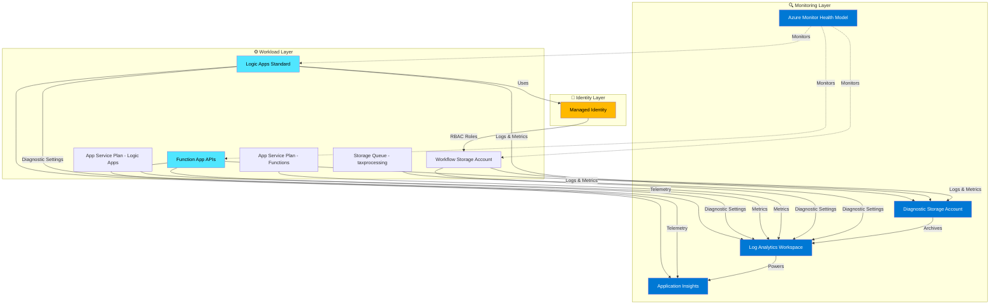
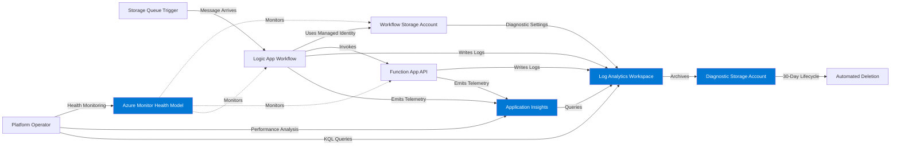

# Azure Logic Apps Monitoring

[](https://opensource.org/licenses/MIT)
[](https://azure.microsoft.com/en-us/products/logic-apps)
[](https://learn.microsoft.com/azure/azure-resource-manager/bicep/)

An enterprise-grade, open-source Infrastructure as Code (IaC) solution demonstrating Azure Monitor best practices for Logic Apps Standard. This project provides production-ready Bicep templates for comprehensive observability, diagnostics, and health monitoring of workflow orchestration workloads.

---

## 📋 Table of Contents

- Project Overview
- Target Audience
- Features
- Architecture
- Dataflow
- Prerequisites
- Installation & Deployment
- Usage Examples
- Project Structure
- Contributing
- License
- References

---

## 🎯 Project Overview

**Azure Logic Apps Monitoring** is a comprehensive monitoring solution that demonstrates how to implement observability for Azure Logic Apps Standard using Infrastructure as Code. The project addresses common challenges in workflow monitoring by providing:

- **Centralized Logging**: Unified Log Analytics workspace for all diagnostic data
- **Application Performance Monitoring**: Application Insights integration for end-to-end telemetry
- **Automated Diagnostics**: Pre-configured diagnostic settings for all Azure resources
- **Health Modeling**: Azure Monitor Health Model for service topology visualization
- **Cost Optimization**: Lifecycle management policies for log retention

This solution is ideal for organizations implementing enterprise workflow orchestration and requiring production-grade observability patterns.

---

## 👥 Target Audience

| Role | Responsibilities | How to Leverage the Solution | Benefits |
|------|------------------|------------------------------|----------|
| **Cloud Solution Architect** | Design scalable, observable cloud solutions | Use the Bicep templates as reference architecture for Logic Apps monitoring design | Accelerates architecture decisions with proven patterns; ensures compliance with Azure best practices |
| **DevOps Engineer** | Implement CI/CD pipelines and infrastructure automation | Deploy monitoring infrastructure using Azure Developer CLI (`azd`); integrate with existing IaC workflows | Reduces deployment time; provides reusable, version-controlled monitoring infrastructure |
| **Platform Engineer** | Manage shared platform services and monitoring | Customize diagnostic settings and Log Analytics workspace configuration for multi-tenant scenarios | Standardizes monitoring across teams; enables centralized observability |
| **Application Developer** | Build and maintain workflow-based applications | Leverage Application Insights queries to debug workflow failures and performance issues | Improves troubleshooting efficiency; provides actionable insights into workflow behavior |
| **Site Reliability Engineer (SRE)** | Ensure service reliability and incident response | Use pre-configured KQL queries for alerting and dashboards; analyze workflow metrics | Enhances incident detection; reduces MTTR (Mean Time To Resolution) |
| **Cloud Operations Team** | Monitor and maintain Azure environments | Deploy standardized monitoring for Logic Apps Standard workloads | Simplifies monitoring setup; ensures consistent logging and metrics collection |

---

## ✨ Features

### Design Principles

This solution follows Azure Monitor best practices organized by key design principles:

#### 1. **Unified Observability**
- Centralized Log Analytics workspace for all diagnostic data
- Application Insights workspace-based integration
- Correlated telemetry across Logic Apps, Function Apps, and Storage

#### 2. **Infrastructure as Code**
- Declarative Bicep templates for all monitoring resources
- Parameterized deployments for multi-environment support (dev, UAT, prod)
- Modular design for reusability and maintainability

#### 3. **Cost Management**
- Automated log retention policies (30-day default)
- Lifecycle management for diagnostic storage accounts
- Optimized diagnostic settings to collect only necessary data

#### 4. **Security & Compliance**
- Managed identities for secure resource access
- TLS 1.2 enforcement on all storage accounts
- Azure RBAC for granular access control

---

### Feature Overview

| Feature | Purpose | Benefit |
|---------|---------|---------|
| **Log Analytics Workspace** | Centralized repository for logs and metrics from all Azure resources | Unified query interface for troubleshooting; long-term log retention |
| **Application Insights** | Application Performance Monitoring (APM) for Logic Apps workflows | End-to-end transaction tracing; workflow execution telemetry |
| **Diagnostic Settings** | Automated collection of platform logs and metrics | Captures `WorkflowRuntime` logs, workflow metrics, and resource health |
| **Azure Monitor Health Model** | Service topology and dependency mapping | Visualizes workflow dependencies; enables proactive health monitoring |
| **Storage Lifecycle Policies** | Automated deletion of old diagnostic logs | Reduces storage costs; ensures compliance with data retention policies |
| **Managed Identities** | Passwordless authentication for Logic Apps to Storage | Eliminates secrets management; improves security posture |
| **Multi-Environment Support** | Environment-specific configurations (dev/UAT/prod) | Simplifies promotion across environments; reduces configuration drift |

---

### Comparison with Default Azure Monitor

| Aspect | Project Solution | Default Azure Monitor |
|--------|------------------|----------------------|
| **Log Collection** | Automated diagnostic settings for all resources (Logic Apps, Storage, App Service Plans, Function Apps) | Manual configuration required for each resource |
| **Storage Lifecycle** | Pre-configured 30-day retention with automated cleanup | No default lifecycle policies; logs accumulate indefinitely |
| **Application Insights** | Workspace-based integration with Logic Apps and Function Apps | Requires manual setup; may use classic (non-workspace) mode |
| **Cost Optimization** | Built-in retention policies and sampling configuration | Manual tuning required; risk of unexpected costs |
| **Security** | Managed identities for all connections; TLS 1.2 enforced | May default to connection strings; security must be manually configured |
| **Deployment Automation** | Single `azd up` command deploys entire monitoring stack | Manual resource creation via Portal or CLI |
| **Multi-Environment Support** | Environment-specific parameters (`dev`, `uat`, `prod`) | Requires manual duplication of configurations |

---

### Diagnostic Settings

Diagnostic Settings are the foundation of Azure Monitor observability. They enable you to route platform logs and metrics from Azure resources to destinations like Log Analytics, Storage Accounts, or Event Hubs.

**How Diagnostic Settings Work:**
1. **Logs**: Capture operational events (e.g., workflow executions, failures, HTTP requests)
2. **Metrics**: Collect performance data (e.g., request rates, latencies, resource utilization)
3. **Destinations**: Route data to Log Analytics (for querying), Storage Accounts (for archival), or Event Hubs (for streaming)

**Why This Matters:**
- Without diagnostic settings, you lose visibility into workflow failures, performance bottlenecks, and security events
- This project pre-configures diagnostic settings for all resources, ensuring zero observability gaps

---

#### Diagnostic Settings Collection

| Metrics Category | Metrics Description | Logs Category | Logs Description | Monitoring Improvement |
|------------------|---------------------|---------------|------------------|------------------------|
| `AllMetrics` | Captures all platform metrics (request count, latency, memory usage, CPU) | `WorkflowRuntime` | Logs workflow execution events (started, succeeded, failed, timed out) | Enables performance baselining; identifies resource constraints |
| `AllMetrics` | Storage account metrics (transaction count, availability, egress) | `StorageRead`, `StorageWrite`, `StorageDelete` | Logs storage operations used by workflows (queue messages, blob access) | Detects storage throttling; troubleshoots workflow-storage integration issues |
| `AllMetrics` | App Service Plan metrics (CPU, memory, instance count) | N/A | No logs available for App Service Plans | Identifies scaling opportunities; detects resource exhaustion |
| `AllMetrics` | Function App metrics (execution count, duration, failure rate) | `FunctionAppLogs` | Logs function invocations from workflows (API calls, data transformations) | Correlates workflow failures with API errors; improves end-to-end tracing |
| N/A | No metrics for Log Analytics workspace itself | `Audit` | Logs workspace changes (query executions, access control modifications) | Tracks who accessed diagnostic data; ensures compliance with audit requirements |

**Example: WorkflowRuntime Logs**
- **Event**: Logic App workflow `tax-processing` started
- **Log Entry**:
  ```json
  {
    "time": "2025-06-10T14:23:15Z",
    "workflowName": "tax-processing",
    "status": "Running",
    "triggeredBy": "Azure Storage Queue",
    "correlationId": "abc123-def456"
  }
  ```
- **Benefit**: Quickly identify when workflows start, complete, or fail; correlate events across resources using `correlationId`

---

## 🏗️ Architecture


```mermaid
graph TB
    subgraph Monitoring["🔍 Monitoring Layer"]
        LAW[Log Analytics Workspace]
        AI[Application Insights]
        LOGSA[Diagnostic Storage Account]
        HM[Azure Monitor Health Model]
    end

    subgraph Workload["⚙️ Workload Layer"]
        LA[Logic Apps Standard]
        ASP_LA[App Service Plan - Logic Apps]
        FUNC[Function App APIs]
        ASP_FUNC[App Service Plan - Functions]
        SA[Workflow Storage Account]
        QUEUE[Storage Queue - taxprocessing]
    end

    subgraph Identity["🔐 Identity Layer"]
        MI[Managed Identity]
    end

    LA -->|Diagnostic Settings| LAW
    LA -->|Telemetry| AI
    LA -->|Logs & Metrics| LOGSA
    
    FUNC -->|Diagnostic Settings| LAW
    FUNC -->|Telemetry| AI
    FUNC -->|Logs & Metrics| LOGSA
    
    ASP_LA -->|Metrics| LAW
    ASP_FUNC -->|Metrics| LAW
    
    SA -->|Diagnostic Settings| LAW
    SA -->|Logs & Metrics| LOGSA
    QUEUE -->|Diagnostic Settings| LAW
    
    LA -->|Uses| MI
    MI -->|RBAC Roles| SA
    
    HM -.->|Monitors| LA
    HM -.->|Monitors| FUNC
    HM -.->|Monitors| SA
    
    LAW -->|Powers| AI
    LOGSA -->|Archives| LAW

    style LAW fill:#0078D4,color:#fff
    style AI fill:#0078D4,color:#fff
    style LOGSA fill:#0078D4,color:#fff
    style HM fill:#0078D4,color:#fff
    style LA fill:#50E6FF,color:#000
    style FUNC fill:#50E6FF,color:#000
    style MI fill:#FFB900,color:#000
```

**Architecture Components:**

| Component | Resource Type | Purpose |
|-----------|--------------|---------|
| **Log Analytics Workspace** | `Microsoft.OperationalInsights/workspaces` | Centralized log and metric storage for querying and analysis |
| **Application Insights** | `Microsoft.Insights/components` | APM solution for workflow and API telemetry |
| **Diagnostic Storage Account** | `Microsoft.Storage/storageAccounts` | Long-term archival of diagnostic data (30-day lifecycle policy) |
| **Logic Apps Standard** | `Microsoft.Web/sites` (kind: workflowapp) | Serverless workflow orchestration engine |
| **Function App** | `Microsoft.Web/sites` (kind: functionapp) | API backend for workflow integrations |
| **Workflow Storage Account** | `Microsoft.Storage/storageAccounts` | Required storage for Logic Apps runtime (queues, blobs, tables) |
| **Managed Identity** | `Microsoft.ManagedIdentity/userAssignedIdentities` | Secure, passwordless authentication for Logic Apps |
| **Azure Monitor Health Model** | `Microsoft.Management/serviceGroups` | Service topology for health monitoring |

---

## 🔄 Dataflow


```mermaid
flowchart LR
    A[Storage Queue Trigger] -->|Message Arrives| B[Logic App Workflow]
    B -->|Emits Telemetry| C[Application Insights]
    B -->|Writes Logs| D[Log Analytics Workspace]
    B -->|Invokes| E[Function App API]
    E -->|Emits Telemetry| C
    E -->|Writes Logs| D
    
    B -->|Uses Managed Identity| F[Workflow Storage Account]
    F -->|Diagnostic Settings| D
    
    D -->|Archives| G[Diagnostic Storage Account]
    G -->|30-Day Lifecycle| H[Automated Deletion]
    
    C -->|Queries| D
    
    I[Platform Operator] -->|KQL Queries| D
    I -->|Performance Analysis| C
    I -->|Health Monitoring| J[Azure Monitor Health Model]
    
    J -.->|Monitors| B
    J -.->|Monitors| E
    J -.->|Monitors| F

    style C fill:#0078D4,color:#fff
    style D fill:#0078D4,color:#fff
    style G fill:#0078D4,color:#fff
    style J fill:#0078D4,color:#fff
```

**Dataflow Steps:**

1. **Workflow Trigger**: A message arrives in the `taxprocessing` Storage Queue
2. **Workflow Execution**: Logic App workflow processes the message
3. **Telemetry Emission**: Workflow emits traces to Application Insights (execution time, success/failure)
4. **Log Writing**: Workflow runtime logs (e.g., `WorkflowRuntime` category) are sent to Log Analytics
5. **API Invocation**: Workflow calls Function App API for data transformation
6. **Diagnostic Collection**: All resources send logs and metrics to Log Analytics via Diagnostic Settings
7. **Archival**: Log Analytics archives data to Diagnostic Storage Account
8. **Lifecycle Management**: Storage Account lifecycle policy deletes logs older than 30 days
9. **Querying**: Operators use KQL queries in Log Analytics for troubleshooting
10. **Health Monitoring**: Azure Monitor Health Model provides service topology view

---

## 📋 Prerequisites

Before deploying this solution, ensure you have the following:

### Tools & SDKs

- **Azure CLI**: [Install Azure CLI](https://learn.microsoft.com/cli/azure/install-azure-cli)
- **Azure Developer CLI (azd)**: [Install azd](https://learn.microsoft.com/azure/developer/azure-developer-cli/install-azd)
- **Visual Studio Code**: [Download VS Code](https://code.visualstudio.com/)
  - **Extension**: [Azure Logic Apps (Standard)](https://marketplace.visualstudio.com/items?itemName=ms-azuretools.vscode-azurelogicapps)
- **Git**: [Install Git](https://git-scm.com/downloads)

### Azure Resources

- **Azure Subscription**: Active subscription with available quota
- **Resource Group**: Will be created automatically during deployment
- **Azure Regions**: Deployment supports all Azure regions (default: same as Resource Group)

### Required RBAC Roles

You must have the following Azure RBAC roles to deploy this solution:

| Role | Scope | Description | Documentation |
|------|-------|-------------|---------------|
| **Owner** or **Contributor** | Subscription | Required to create Resource Groups and deploy resources | [Azure built-in roles](https://learn.microsoft.com/azure/role-based-access-control/built-in-roles#contributor) |
| **User Access Administrator** | Subscription | Required to assign Managed Identity roles to Storage Accounts | [Azure built-in roles](https://learn.microsoft.com/azure/role-based-access-control/built-in-roles#user-access-administrator) |
| **Log Analytics Contributor** | Resource Group | Required to create Log Analytics Workspace and configure diagnostic settings | [Azure Monitor roles](https://learn.microsoft.com/azure/azure-monitor/roles-permissions-security#log-analytics-contributor) |

**Note**: If you use a Service Principal for deployment, ensure it has the `Owner` role at the subscription level.

### Dependencies

- **.NET SDK 9.0**: Required for Function App (automatically managed by Azure)
- **Azure Functions Core Tools**: Version 4.x (automatically installed by Azure Logic Apps extension)

---

## 🚀 Installation & Deployment

Follow these steps to deploy the monitoring solution using Azure Developer CLI:

### Step 1: Clone the Repository

```bash
git clone https://github.com/your-org/Azure-LogicApps-Monitoring.git
cd Azure-LogicApps-Monitoring
```

### Step 2: Authenticate with Azure

```bash
azd auth login
```

Follow the browser prompt to authenticate with your Azure account.

### Step 3: Initialize the Environment

```bash
azd env new
```

When prompted, provide:
- **Environment Name**: `dev`, `uat`, or `prod`
- **Azure Subscription**: Select your subscription
- **Azure Location**: Choose a region (e.g., `eastus`)

Example:
```bash
? Enter a new environment name: dev
? Select an Azure Subscription to use: My Azure Subscription (abc123-def456)
? Select an Azure location to use: East US (eastus)
```

### Step 4: Set Required Parameters

The deployment uses parameters from main.parameters.json. The default values are:

- `location`: `${AZURE_LOCATION}` (from environment)
- `envName`: `${AZURE_ENV_NAME}` (from environment)

No additional configuration is required unless you want to customize resource names or tags.

### Step 5: Deploy the Infrastructure

```bash
azd up
```

This command will:
1. Provision the Resource Group
2. Deploy monitoring resources (Log Analytics, Application Insights, Storage Account)
3. Deploy workload resources (Logic Apps, Function App, Storage Queue)
4. Configure diagnostic settings for all resources
5. Assign Managed Identity roles

**Expected Output:**
```bash
Provisioning Azure resources (azd provision)
  Provisioned subscription (1m 30s)
  Provisioned resourceGroup/contoso-tax-docs-dev-eastus-rg (2m 45s)
  Provisioned monitoring/operationalDeployment (3m 20s)
  Provisioned workload/workflowsDeployment (4m 10s)

SUCCESS: Your application was provisioned in Azure in 5 minutes 15 seconds.
```

### Step 6: Verify Deployment

After deployment completes, retrieve the deployment outputs:

```bash
azd env get-values
```

**Sample Output:**
```bash
AZURE_LOG_ANALYTICS_WORKSPACE_ID="/subscriptions/.../resourceGroups/.../providers/Microsoft.OperationalInsights/workspaces/tax-docs-..."
AZURE_APPLICATION_INSIGHTS_NAME="tax-docs-...-appinsights"
LOGIC_APP_NAME="tax-docs-...-logicapp"
API_FUNCTION_APP_NAME="tax-docs-...-api"
```

### Step 7: Open Logic App in VS Code

1. Open the workspace in VS Code:
   ```bash
   code Azure-LogicApps-Monitoring.code-workspace
   ```

2. Navigate to workflow.json
3. Use the Azure Logic Apps extension to design your workflow
4. Deploy the workflow using the Azure Logic Apps extension:
   - Right-click on the Logic App in the Azure view
   - Select **Deploy to Logic App**

---

## 📊 Usage Examples

### Example 1: Monitor Workflow Executions

**Scenario**: Identify how many workflows ran successfully vs. failed in the last 24 hours.

**Kusto Query**:
```kql
AzureDiagnostics
| where ResourceProvider == "MICROSOFT.WEB"
| where Category == "WorkflowRuntime"
| where TimeGenerated > ago(24h)
| summarize 
    Total = count(),
    Succeeded = countif(status_s == "Succeeded"),
    Failed = countif(status_s == "Failed")
| extend SuccessRate = round(100.0 * Succeeded / Total, 2)
```

**Sample Output**:
| Total | Succeeded | Failed | SuccessRate |
|-------|-----------|--------|-------------|
| 1,234 | 1,198     | 36     | 97.08%      |

**Chart Visualization**:
- Use a **Pie Chart** to visualize success vs. failure distribution

**Reference**: [Monitor Logic Apps workflows - Azure Logic Apps](https://learn.microsoft.com/azure/logic-apps/monitor-workflows-collect-diagnostic-data)

---

### Example 2: Analyze Workflow Execution Time

**Scenario**: Identify workflows with the longest execution times to optimize performance.

**Kusto Query**:
```kql
AzureDiagnostics
| where ResourceProvider == "MICROSOFT.WEB"
| where Category == "WorkflowRuntime"
| where TimeGenerated > ago(7d)
| where status_s == "Succeeded"
| extend ExecutionTimeSeconds = todouble(duration_d)
| summarize 
    AvgExecutionTime = avg(ExecutionTimeSeconds),
    MaxExecutionTime = max(ExecutionTimeSeconds),
    P95ExecutionTime = percentile(ExecutionTimeSeconds, 95)
    by workflowName_s
| order by AvgExecutionTime desc
```

**Sample Output**:
| workflowName_s | AvgExecutionTime | MaxExecutionTime | P95ExecutionTime |
|----------------|------------------|------------------|------------------|
| tax-processing | 12.5             | 45.2             | 23.8             |

**Reference**: [Monitor workflow performance - Azure Logic Apps](https://learn.microsoft.com/azure/logic-apps/monitor-workflows-collect-diagnostic-data#workflow-run-duration)

---

### Example 3: Track API Invocations from Workflows

**Scenario**: Identify which Function App APIs are invoked most frequently by workflows.

**Kusto Query**:
```kql
AppDependencies
| where TimeGenerated > ago(24h)
| where Type == "Http"
| summarize RequestCount = count() by Target, ResultCode
| order by RequestCount desc
```

**Sample Output**:
| Target | ResultCode | RequestCount |
|--------|------------|--------------|
| tax-docs-api/process | 200 | 1,023 |
| tax-docs-api/validate | 200 | 987 |
| tax-docs-api/process | 500 | 12 |

**Reference**: [Application Insights dependency tracking](https://learn.microsoft.com/azure/azure-monitor/app/asp-net-dependencies)

---

### Example 4: Detect Storage Throttling

**Scenario**: Identify if workflows are experiencing throttling due to Storage Account limits.

**Kusto Query**:
```kql
AzureDiagnostics
| where ResourceProvider == "MICROSOFT.STORAGE"
| where Category == "StorageWrite" or Category == "StorageRead"
| where TimeGenerated > ago(1h)
| where statusCode_d == 503 // Service Unavailable (throttling)
| summarize ThrottledRequests = count() by Resource, bin(TimeGenerated, 5m)
| order by TimeGenerated desc
```

**Sample Output**:
| Resource | TimeGenerated | ThrottledRequests |
|----------|---------------|-------------------|
| taxdocs-storage | 2025-06-10 14:35:00 | 45 |

**Reference**: [Monitor Azure Storage](https://learn.microsoft.com/azure/storage/common/monitor-storage)

---

### Example 5: Identify Failed Workflow Runs with Error Details

**Scenario**: Troubleshoot workflow failures by extracting error messages.

**Kusto Query**:
```kql
AzureDiagnostics
| where ResourceProvider == "MICROSOFT.WEB"
| where Category == "WorkflowRuntime"
| where TimeGenerated > ago(24h)
| where status_s == "Failed"
| project 
    TimeGenerated,
    workflowName_s,
    correlationId_g,
    error_code_s,
    error_message_s
| order by TimeGenerated desc
```

**Sample Output**:
| TimeGenerated | workflowName_s | correlationId_g | error_code_s | error_message_s |
|---------------|----------------|-----------------|--------------|-----------------|
| 2025-06-10 14:30:00 | tax-processing | abc123-def456 | ActionFailed | HTTP request to API failed with 500 |

**Reference**: [Troubleshoot Logic Apps workflows](https://learn.microsoft.com/azure/logic-apps/logic-apps-diagnosing-failures)

---

## 📁 Project Structure

```
Azure-LogicApps-Monitoring/
├── infra/                          # Infrastructure as Code (Bicep templates)
│   ├── main.bicep                  # Main deployment template
│   └── main.parameters.json        # Deployment parameters
├── src/
│   ├── monitoring/                 # Monitoring resources
│   │   ├── main.bicep              # Monitoring module entry point
│   │   ├── log-analytics-workspace.bicep
│   │   ├── app-insights.bicep
│   │   └── azure-monitor-health-model.bicep
│   └── workload/                   # Workload resources
│       ├── main.bicep              # Workload module entry point
│       ├── logic-app.bicep
│       ├── azure-function.bicep
│       └── messaging/
│           └── main.bicep          # Storage Queue configuration
├── tax-docs/                       # Logic Apps project
│   ├── tax-processing/
│   │   └── workflow.json           # Workflow definition
│   ├── connections.json            # API connections
│   └── host.json                   # Logic Apps runtime configuration
├── .vscode/                        # VS Code configuration
│   ├── launch.json
│   ├── settings.json
│   └── tasks.json
├── azure.yaml                      # Azure Developer CLI configuration
└── README.md                       # This file
```

---

## 🤝 Contributing

Contributions are welcome! Please follow these guidelines:

1. **Fork the Repository**: Click the "Fork" button at the top right
2. **Create a Feature Branch**:
   ```bash
   git checkout -b feature/your-feature-name
   ```
3. **Make Your Changes**: Follow the existing code style and Bicep best practices
4. **Test Your Changes**: Deploy to a test environment using `azd up`
5. **Submit a Pull Request**: Provide a clear description of your changes

**Code Style**:
- Follow [Bicep best practices](https://learn.microsoft.com/azure/azure-resource-manager/bicep/best-practices)
- Use descriptive parameter names with validation decorators (`@minLength`, `@maxLength`)
- Add comments for complex logic

---

## 📄 License

This project is licensed under the **MIT License**. See the LICENSE.md file for details.

```
MIT License

Copyright (c) 2025 [Your Organization]

Permission is hereby granted, free of charge, to any person obtaining a copy
of this software and associated documentation files (the "Software"), to deal
in the Software without restriction, including without limitation the rights
to use, copy, modify, merge, publish, distribute, sublicense, and/or sell
copies of the Software, and to permit persons to whom the Software is
furnished to do so, subject to the following conditions:

The above copyright notice and this permission notice shall be included in all
copies or substantial portions of the Software.

THE SOFTWARE IS PROVIDED "AS IS", WITHOUT WARRANTY OF ANY KIND, EXPRESS OR
IMPLIED, INCLUDING BUT NOT LIMITED TO THE WARRANTIES OF MERCHANTABILITY,
FITNESS FOR A PARTICULAR PURPOSE AND NONINFRINGEMENT. IN NO EVENT SHALL THE
AUTHORS OR COPYRIGHT HOLDERS BE LIABLE FOR ANY CLAIM, DAMAGES OR OTHER
LIABILITY, WHETHER IN AN ACTION OF CONTRACT, TORT OR OTHERWISE, ARISING FROM,
OUT OF OR IN CONNECTION WITH THE SOFTWARE OR THE USE OR OTHER DEALINGS IN THE
SOFTWARE.
```

---

## 📚 References

### Microsoft Learn Documentation

- [Monitor Logic Apps workflows](https://learn.microsoft.com/azure/logic-apps/monitor-workflows-collect-diagnostic-data)
- [Azure Monitor overview](https://learn.microsoft.com/azure/azure-monitor/overview)
- [Application Insights for Logic Apps](https://learn.microsoft.com/azure/logic-apps/monitor-workflows-collect-diagnostic-data#application-insights)
- [Log Analytics workspace overview](https://learn.microsoft.com/azure/azure-monitor/logs/log-analytics-workspace-overview)
- [Diagnostic settings in Azure Monitor](https://learn.microsoft.com/azure/azure-monitor/essentials/diagnostic-settings)
- [Azure Bicep documentation](https://learn.microsoft.com/azure/azure-resource-manager/bicep/)
- [Azure Developer CLI (azd) documentation](https://learn.microsoft.com/azure/developer/azure-developer-cli/)

### GitHub Resources

- [GitHub README best practices](https://docs.github.com/en/repositories/managing-your-repositorys-settings-and-features/customizing-your-repository/about-readmes)
- [Markdown syntax guide](https://www.markdownguide.org/basic-syntax/)
- [Mermaid diagram syntax](https://mermaid.js.org/intro/)

### Azure Architecture

- [Azure Logic Apps Standard architecture](https://learn.microsoft.com/azure/logic-apps/single-tenant-overview-compare)
- [Monitoring architecture for Azure applications](https://learn.microsoft.com/azure/architecture/best-practices/monitoring)

---

## 🙋 Support

For questions or issues:

- **GitHub Issues**: [Open an issue](https://github.com/your-org/Azure-LogicApps-Monitoring/issues)
- **Microsoft Q&A**: [Azure Logic Apps forum](https://learn.microsoft.com/answers/tags/153/azure-logic-apps)
- **Azure Support**: [Create a support ticket](https://azure.microsoft.com/support/create-ticket/)

---

**Built with ❤️ for the Azure community**

Similar code found with 3 license types