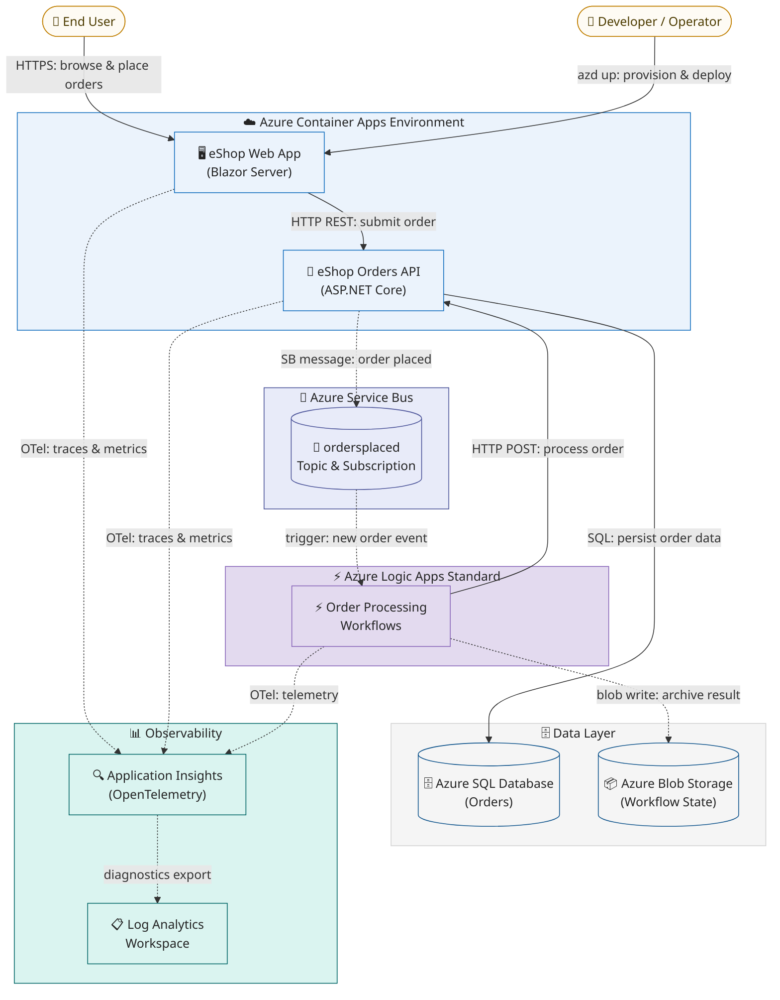

# Azure Logic Apps Monitoring

[](https://github.com/Evilazaro/Azure-LogicApps-Monitoring/actions/workflows/ci-dotnet.yml)
[](https://github.com/Evilazaro/Azure-LogicApps-Monitoring/actions/workflows/azure-dev.yml)
[](LICENSE)
[](https://dotnet.microsoft.com)
[](https://learn.microsoft.com/azure/developer/azure-developer-cli/)

## Description

**Azure Logic Apps Monitoring** is a cloud-native reference solution for building, deploying, and observing end-to-end order management workflows on Azure. The platform combines .NET Aspire orchestration with Azure Logic Apps Standard to deliver scalable, event-driven order processing with full distributed observability through Application Insights and Log Analytics.

The solution addresses the challenge of monitoring complex, multi-component distributed systems by providing a production-ready example that integrates Azure Service Bus messaging, automated Logic Apps workflows, Entity Framework Core data persistence, and OpenTelemetry-based telemetry across all components. Developers can use this reference to learn how to configure Azure Monitor, Application Insights, and Log Analytics for serverless workflow observability.

The technology stack is built on **.NET 10.0** with Blazor Server for the frontend, ASP.NET Core for the REST API, Azure Container Apps for hosting, Azure Logic Apps Standard for workflow orchestration, and Bicep with the Azure Developer CLI for infrastructure as code deployments.

## Table of Contents

- [Features](#features)
- [Architecture](#architecture)
- [Technologies Used](#technologies-used)
- [Quick Start](#quick-start)
- [Configuration](#configuration)
- [Deployment](#deployment)
- [Usage](#usage)
- [Contributing](#contributing)
- [License](#license)

## Features

- 🛍️ **Order management** — Place, retrieve, and process orders through a Blazor Server web interface built with Microsoft FluentUI components.
- ⚡ **Logic Apps Standard workflows** — Multi-step order processing workflows (`OrdersPlacedProcess`, `OrdersPlacedCompleteProcess`) triggered by Azure Service Bus messages.
- 📨 **Asynchronous messaging** — Azure Service Bus with an `ordersplaced` topic and dead-lettering decouples order submission from workflow execution.
- 📊 **End-to-end observability** — Distributed tracing and metrics via OpenTelemetry exported to Application Insights and a Log Analytics Workspace.
- 🏗️ **Cloud-native orchestration** — .NET Aspire 13.x orchestrates all services locally and generates production-ready Azure Container Apps deployment manifests.
- 🔐 **Passwordless authentication** — User-assigned managed identity with RBAC replaces credential-based access across Service Bus, SQL Database, and Blob Storage.
- 🏭 **Infrastructure as code** — Bicep modules provision all Azure resources — VNet, Container Apps, SQL, Service Bus, Logic Apps — in a single `azd up` command.
- 🔄 **CI/CD with OIDC** — GitHub Actions workflows use federated credentials (no stored secrets) for continuous integration and delivery to Azure.
- 🗄️ **SQL persistence** — Entity Framework Core with Azure SQL Database and configurable retry policies provides production-grade data durability.
- 🧪 **Automated testing** — Cross-platform test suite using Microsoft.Testing.Platform with code coverage reporting.

## Architecture

The Azure Logic Apps Monitoring solution is a cloud-native eShop order management platform that demonstrates enterprise-grade observability for Azure Logic Apps Standard, orchestrated with .NET Aspire. **End Users** interact with the eShop Web App (Blazor Server) to place orders; the web application communicates synchronously with the eShop Orders API (ASP.NET Core), which persists orders to Azure SQL Database. Once an order is confirmed, the Orders API publishes an asynchronous message to an Azure Service Bus topic, triggering Azure Logic Apps Standard workflows to execute multi-step HTTP-based order processing and archive results to Azure Blob Storage. All services emit distributed traces and metrics via OpenTelemetry to Application Insights, with diagnostics forwarded to a centralized Log Analytics Workspace.


```mermaid
---
config:
  primaryColor: "#0f6cbd"
  primaryTextColor: "#FFFFFF"
  primaryBorderColor: "#0f548c"
  secondaryColor: "#ebf3fc"
  secondaryTextColor: "#242424"
  secondaryBorderColor: "#0f6cbd"
  tertiaryColor: "#f5f5f5"
  tertiaryTextColor: "#424242"
  tertiaryBorderColor: "#d1d1d1"
  noteBkgColor: "#fefbf4"
  noteTextColor: "#242424"
  noteBorderColor: "#f9e2ae"
  lineColor: "#616161"
  background: "#FFFFFF"
  edgeLabelBackground: "#FFFFFF"
  clusterBkg: "#fafafa"
  clusterBorder: "#e0e0e0"
  titleColor: "#242424"
  errorBkgColor: "#fdf3f4"
  errorTextColor: "#b10e1c"
  fontFamily: "Segoe UI, Verdana, sans-serif"
  fontSize: 16
  align: center
  description: "High-level architecture diagram showing actors, primary flows, and major components."
---
graph TB

%% ── Actors ──────────────────────────────────────────────────────────────────
User(["👤 End User"])
Operator(["👷 Developer / Operator"])

%% ── Azure Container Apps Environment ────────────────────────────────────────
subgraph ACA["☁️ Azure Container Apps Environment"]
    WebApp["🖥️ eShop Web App<br/>(Blazor Server)"]
    OrdersAPI["🔌 eShop Orders API<br/>(ASP.NET Core)"]
end

%% ── Azure Logic Apps Standard ────────────────────────────────────────────────
subgraph WorkflowLayer["⚡ Azure Logic Apps Standard"]
    LogicApp["⚡ Order Processing<br/>Workflows"]
end

%% ── Azure Service Bus ────────────────────────────────────────────────────────
subgraph MessagingLayer["📨 Azure Service Bus"]
    ServiceBus[("📨 ordersplaced<br/>Topic & Subscription")]
end

%% ── Data Layer ───────────────────────────────────────────────────────────────
subgraph DataLayer["🗄️ Data Layer"]
    SqlDB[("🗄️ Azure SQL Database<br/>(Orders)")]
    BlobStorage[("📦 Azure Blob Storage<br/>(Workflow State)")]
end

%% ── Observability ────────────────────────────────────────────────────────────
subgraph ObservabilityLayer["📊 Observability"]
    AppInsights["🔍 Application Insights<br/>(OpenTelemetry)"]
    LogAnalytics["📋 Log Analytics<br/>Workspace"]
end

%% ── Primary Application Flows ────────────────────────────────────────────────
User -->|"HTTPS: browse & place orders"| WebApp
Operator -->|"azd up: provision & deploy"| WebApp
WebApp -->|"HTTP REST: submit order"| OrdersAPI
OrdersAPI -->|"SQL: persist order data"| SqlDB
OrdersAPI -.->|"SB message: order placed"| ServiceBus
ServiceBus -.->|"trigger: new order event"| LogicApp
LogicApp -->|"HTTP POST: process order"| OrdersAPI
LogicApp -.->|"blob write: archive result"| BlobStorage

%% ── Observability Flows ──────────────────────────────────────────────────────
WebApp -.->|"OTel: traces & metrics"| AppInsights
OrdersAPI -.->|"OTel: traces & metrics"| AppInsights
LogicApp -.->|"OTel: telemetry"| AppInsights
AppInsights -.->|"diagnostics export"| LogAnalytics

%% ── Node Styles ──────────────────────────────────────────────────────────────
classDef actorStyle fill:#fefbf4,stroke:#c07f00,color:#4d3c00
classDef serviceStyle fill:#ebf3fc,stroke:#0f6cbd,color:#242424
classDef datastoreStyle fill:#f5f5f5,stroke:#0f548c,color:#242424
classDef messagingStyle fill:#e8ebf9,stroke:#4a5298,color:#242424
classDef workflowStyle fill:#e3daef,stroke:#8764b8,color:#242424
classDef observabilityStyle fill:#daf4f0,stroke:#006666,color:#242424

%% ── Subgraph Styles ──────────────────────────────────────────────────────────
classDef acaSubgraph fill:#ebf3fc,stroke:#0f6cbd,color:#242424
classDef workflowSubgraph fill:#e3daef,stroke:#8764b8,color:#242424
classDef messagingSubgraph fill:#e8ebf9,stroke:#4a5298,color:#242424
classDef dataSubgraph fill:#f5f5f5,stroke:#d1d1d1,color:#242424
classDef observabilitySubgraph fill:#daf4f0,stroke:#006666,color:#242424

class User,Operator actorStyle
class WebApp,OrdersAPI serviceStyle
class SqlDB,BlobStorage datastoreStyle
class ServiceBus messagingStyle
class LogicApp workflowStyle
class AppInsights,LogAnalytics observabilityStyle
class ACA acaSubgraph
class WorkflowLayer workflowSubgraph
class MessagingLayer messagingSubgraph
class DataLayer dataSubgraph
class ObservabilityLayer observabilitySubgraph
```

## Technologies Used

| Technology                             | Type                    | Purpose                                                             |
| -------------------------------------- | ----------------------- | ------------------------------------------------------------------- |
| .NET 10.0 (C#)                         | Runtime / Language      | Application runtime and primary programming language                |
| ASP.NET Core 10.0                      | API Framework           | REST API for order management (`eShop.Orders.API`)                  |
| Blazor Server                          | Frontend Framework      | Interactive server-side rendered UI (`eShop.Web.App`)               |
| Microsoft FluentUI for ASP.NET Core v4 | UI Component Library    | Accessible, Fluent-design UI components                             |
| Entity Framework Core 10.0             | ORM                     | Data access layer with Azure SQL Database                           |
| .NET Aspire 13.x                       | Orchestration Framework | Local orchestration and Azure Container Apps manifest generation    |
| Azure Container Apps                   | Container Hosting       | Production hosting environment for Web App and Orders API           |
| Azure Logic Apps Standard              | Workflow Automation     | Event-driven, multi-step order processing workflows                 |
| Azure Service Bus (Standard)           | Message Broker          | Asynchronous messaging with `ordersplaced` topic and dead-lettering |
| Azure SQL Database                     | Relational Database     | Persistent order storage with managed identity authentication       |
| Azure Blob Storage                     | Object Storage          | Logic Apps workflow state and processed order archival              |
| Application Insights                   | Application Monitoring  | Distributed tracing, metrics, and telemetry via OpenTelemetry       |
| Log Analytics Workspace                | Centralized Logging     | Aggregated diagnostic logs and metrics from all components          |
| OpenTelemetry                          | Observability Standard  | Vendor-neutral distributed tracing and metrics instrumentation      |
| Bicep                                  | Infrastructure as Code  | Declarative Azure resource provisioning                             |
| Azure Developer CLI (azd)              | Deployment CLI          | End-to-end provisioning and deployment automation                   |
| GitHub Actions                         | CI/CD                   | Automated build, test, and deployment pipelines                     |
| Docker                                 | Containerization        | Local development and container image builds                        |

## Quick Start

### Prerequisites

| Prerequisite                                                                                             | Minimum Version | Notes                                                     |
| -------------------------------------------------------------------------------------------------------- | --------------- | --------------------------------------------------------- |
| [.NET SDK](https://dotnet.microsoft.com/download/dotnet/10.0)                                            | 10.0.100        | Required for building and running the solution            |
| [Azure Developer CLI (azd)](https://learn.microsoft.com/azure/developer/azure-developer-cli/install-azd) | 1.11.0          | Required for provisioning and deployment                  |
| [Azure CLI](https://learn.microsoft.com/cli/azure/install-azure-cli)                                     | 2.60.0          | Required for Azure authentication and resource management |
| [Docker Desktop](https://www.docker.com/products/docker-desktop)                                         | Latest          | Required for local container builds                       |
| [PowerShell](https://github.com/PowerShell/PowerShell)                                                   | 7.0             | Required for lifecycle hook scripts                       |

> [!TIP]
> Run `hooks/check-dev-workstation.ps1` to automatically validate all prerequisites before starting.

### Installation

1. Clone the repository:

```bash
git clone https://github.com/Evilazaro/Azure-LogicApps-Monitoring.git
cd Azure-LogicApps-Monitoring
```

2. Authenticate with Azure:

```bash
azd auth login
az login
```

3. Create a new environment:

```bash
azd env new dev
```

4. Provision Azure infrastructure and deploy all services:

```bash
azd up
```

5. Verify local development configuration (optional):

```powershell
dotnet user-secrets list --project app.AppHost/app.AppHost.csproj
```

### Minimal Working Example

Run the solution locally using .NET Aspire after `azd up` completes and user secrets are configured:

```bash
dotnet run --project app.AppHost/app.AppHost.csproj
```

Open the .NET Aspire dashboard URL printed in the console, then navigate to the `web-app` endpoint to access the eShop Web App.

## Configuration

The following settings control application behavior. Configure them as .NET user secrets for local development or as environment variables in Azure Container Apps.

| Option                                  | Default      | Description                                                                 |
| --------------------------------------- | ------------ | --------------------------------------------------------------------------- |
| `Azure:TenantId`                        | _(empty)_    | Azure AD tenant ID for local development authentication                     |
| `Azure:ClientId`                        | _(empty)_    | Managed identity client ID for local development authentication             |
| `Azure:ResourceGroup`                   | _(empty)_    | Target Azure resource group name                                            |
| `Azure:ServiceBus:HostName`             | _(empty)_    | Service Bus namespace hostname (e.g., `mynamespace.servicebus.windows.net`) |
| `ConnectionStrings:OrderDb`             | _(required)_ | SQL Database connection string for Entity Framework Core                    |
| `ConnectionStrings:messaging`           | _(empty)_    | Service Bus emulator connection string for local development                |
| `MESSAGING_HOST`                        | _(empty)_    | Alternative Service Bus hostname configuration key                          |
| `APPLICATIONINSIGHTS_CONNECTION_STRING` | _(empty)_    | Application Insights connection string for telemetry export                 |
| `OTEL_EXPORTER_OTLP_ENDPOINT`           | _(empty)_    | OpenTelemetry collector endpoint URL                                        |

> [!NOTE]
> In Azure Container Apps, `APPLICATIONINSIGHTS_CONNECTION_STRING` and managed identity credentials are configured automatically by .NET Aspire during `azd deploy`. The `postprovision` hook sets all required user secrets after provisioning.

**Example: configure user secrets for local development**

```powershell
dotnet user-secrets set "Azure:TenantId" "<your-tenant-id>" `
    --project app.AppHost/app.AppHost.csproj

dotnet user-secrets set "Azure:ClientId" "<your-client-id>" `
    --project app.AppHost/app.AppHost.csproj

dotnet user-secrets set "Azure:ServiceBus:HostName" "<namespace>.servicebus.windows.net" `
    --project src/eShop.Orders.API/eShop.Orders.API.csproj
```

## Deployment

Deploy the complete solution to Azure using the Azure Developer CLI.

> [!IMPORTANT]
> Configure federated credentials before running `azd up` in a CI/CD pipeline. Run `hooks/configure-federated-credential.ps1` to set up OIDC authentication between GitHub Actions and Azure.

1. Validate your development workstation:

```powershell
.\hooks\check-dev-workstation.ps1
```

2. Authenticate with Azure:

```bash
azd auth login
az login
```

3. Create and configure the target environment:

```bash
azd env new <env-name>
azd env set AZURE_LOCATION eastus2
```

4. Provision Azure infrastructure:

```bash
azd provision
```

5. Deploy applications to Azure Container Apps:

```bash
azd deploy
```

> [!TIP]
> Combine steps 4 and 5 with `azd up`. The `postprovision` hook automatically configures SQL managed identity access and .NET user secrets after provisioning completes.

### GitHub Actions CI/CD

Configure the following repository variables before pushing to `main`:

| Variable                | Description                                                          |
| ----------------------- | -------------------------------------------------------------------- |
| `AZURE_CLIENT_ID`       | App registration client ID configured for OIDC federated credentials |
| `AZURE_TENANT_ID`       | Azure AD tenant ID                                                   |
| `AZURE_SUBSCRIPTION_ID` | Target Azure subscription ID                                         |

Push to `main` to trigger the `azure-dev.yml` workflow, which runs CI checks, provisions infrastructure, configures SQL managed identity, and deploys the application.

## Usage

### Place an order via the web app

1. Navigate to the deployed eShop Web App URL shown in the `azd up` output.
2. Fill in the order details and submit.
3. The Orders API persists the order to Azure SQL Database and publishes an `ordersplaced` Service Bus message.
4. The Azure Logic Apps `OrdersPlacedProcess` workflow triggers automatically, calls the Orders API to process the order, and archives the result to Azure Blob Storage.

### Generate test orders in bulk

Use `Generate-Orders.ps1` to produce a batch of randomized orders for load testing or demonstration:

```powershell
# Generate 100 test orders with 2–4 products each and save to a custom path.
.\hooks\Generate-Orders.ps1 -OrderCount 100 -MinProducts 2 -MaxProducts 4 -OutputPath ".\infra\data\ordersBatch.json"
```

**Expected output:**

```text
[INFO] Generating 100 orders...
[INFO] Progress: 50/100 orders generated
[INFO] Orders saved to: .\infra\data\ordersBatch.json
```

### Call the Orders API directly

Place a new order:

```bash
curl -X POST https://<orders-api-url>/api/Orders \
  -H "Content-Type: application/json" \
  -d '{
    "id": "550e8400-e29b-41d4-a716-446655440000",
    "customerId": "customer-001",
    "deliveryAddress": "123 Main St, Seattle, WA 98101",
    "total": 129.99,
    "products": [
      {
        "id": "prod-item-001",
        "orderId": "550e8400-e29b-41d4-a716-446655440000",
        "productId": "item-001",
        "productDescription": "Azure T-Shirt",
        "quantity": 1,
        "price": 129.99
      }
    ]
  }'
```

**Expected response (HTTP 201):**

```json
{
  "id": "550e8400-e29b-41d4-a716-446655440000",
  "customerId": "customer-001",
  "date": "2026-04-28T10:00:00Z",
  "deliveryAddress": "123 Main St, Seattle, WA 98101",
  "total": 129.99,
  "products": [...]
}
```

### Monitor Logic Apps workflows

1. Open the [Azure Portal](https://portal.azure.com) and navigate to the Logic App resource in your resource group.
2. Select **Overview** → **Runs history** to view workflow executions and step-level details.
3. Open **Application Insights** and run the following KQL query to analyze order processing traces:

```kusto
requests
| where cloud_RoleName == "orders-api"
| summarize count(), avg(duration) by name
| order by count_ desc
```

## Contributing

Contributions are welcome. To contribute:

1. Fork the repository on GitHub.
2. Create a feature branch: `git checkout -b feature/<short-description>`.
3. Commit changes following the [Conventional Commits](https://www.conventionalcommits.org/) specification.
4. Push the branch and open a pull request targeting `main`.
5. Ensure all CI checks pass before requesting a review.

To report a bug or request a feature, open an issue on [GitHub Issues](https://github.com/Evilazaro/Azure-LogicApps-Monitoring/issues).

> [!NOTE]
> This repository uses Dependabot for automated dependency updates (NuGet packages and GitHub Actions), checked weekly every Monday.

## License

This project is licensed under the **MIT License**. See the [LICENSE](LICENSE) file for details.
