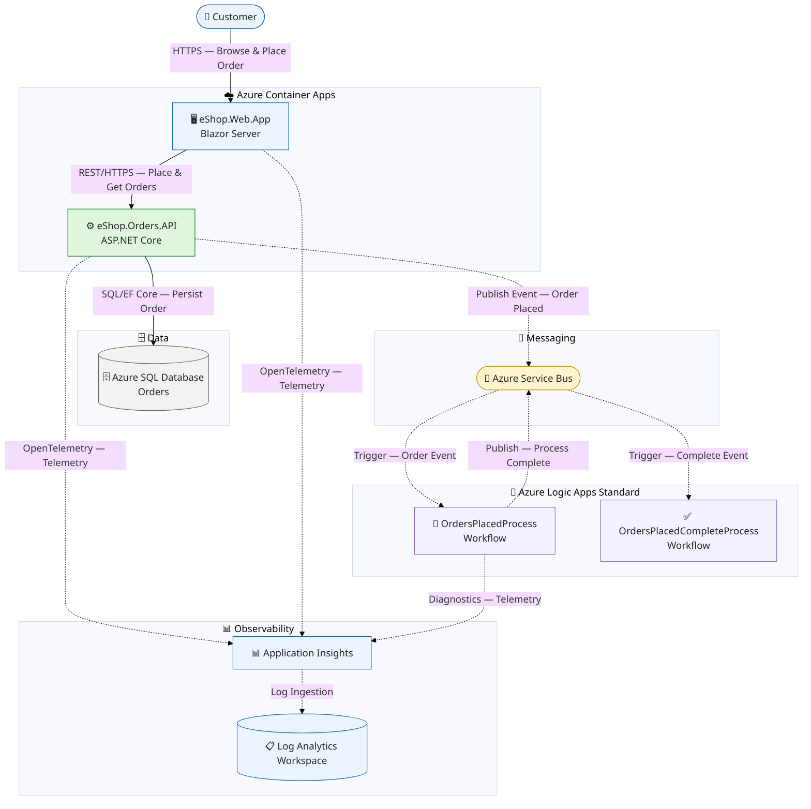

# Azure Logic Apps Monitoring Solution

[](https://github.com/Evilazaro/Azure-LogicApps-Monitoring/actions/workflows/ci-dotnet.yml)
[](https://github.com/Evilazaro/Azure-LogicApps-Monitoring/actions/workflows/azure-dev.yml)
[](LICENSE)
[](https://dotnet.microsoft.com/)
[](https://azure.microsoft.com/en-us/products/logic-apps/)

**Azure Logic Apps Monitoring Solution** is a cloud-native, event-driven order management platform that demonstrates end-to-end monitoring of Azure Logic Apps Standard workflows. The solution provides a complete reference architecture for building observable, production-ready applications on Azure using .NET Aspire orchestration and Infrastructure-as-Code deployments with Bicep.

The solution addresses the challenge of monitoring complex, multi-step business workflows in Azure. By combining Azure Logic Apps Standard with Application Insights, Log Analytics, and Azure Service Bus, it enables teams to track every order from placement through fulfilment while surfacing distributed traces, metrics, and centralised logs in a single observability stack.

The primary technology stack consists of **.NET 10**, **ASP.NET Core**, **Blazor Server** with **Microsoft FluentUI v9**, **.NET Aspire** for orchestration, **Azure Logic Apps Standard** for workflow processing, **Azure Service Bus** for event-driven messaging, **Azure SQL Database** with **Entity Framework Core** for persistence, and **Bicep** with the **Azure Developer CLI (azd)** for Infrastructure-as-Code deployment.

## Table of Contents

- [Features](#features)
- [Architecture](#architecture)
- [Technologies Used](#technologies-used)
- [Quick Start](#quick-start)
- [Configuration](#configuration)
- [Deployment](#deployment)
- [Usage](#usage)
- [Contributing](#contributing)
- [License](#license)

## Features

- 🛒 **Order placement and management** via a RESTful ASP.NET Core API with full CRUD support
- 🖥️ **Interactive web UI** built with Blazor Server and Microsoft FluentUI v9 for browsing and submitting orders
- 🔄 **Event-driven order processing** using Azure Service Bus and Logic Apps Standard workflows (`OrdersPlacedProcess` and `OrdersPlacedCompleteProcess`)
- 📊 **Full-stack observability** through Application Insights OpenTelemetry integration and a centralised Log Analytics Workspace
- 🔒 **Passwordless authentication** using a User Assigned Managed Identity for all Azure service connections (SQL Database, Service Bus, Storage)
- ☁️ **Cloud-native hosting** on Azure Container Apps with automatic scaling managed by .NET Aspire orchestration
- 🏗️ **Infrastructure as Code** using Bicep templates organised into shared and workload modules for repeatable deployments
- 🚀 **One-command deployment** with Azure Developer CLI (`azd up`) including post-provision hooks for SQL managed identity configuration
- 🛡️ **Automated security scanning** with CodeQL in the GitHub Actions CI pipeline
- 🧪 **Cross-platform test suite** covering unit and integration tests executed on Ubuntu, Windows, and macOS

## Architecture

The Azure Logic Apps Monitoring Solution is a cloud-native eShop order management and monitoring platform. Customers interact with a Blazor Server frontend (`eShop.Web.App`) hosted in Azure Container Apps, which communicates with an ASP.NET Core REST backend (`eShop.Orders.API`). The API persists orders to Azure SQL Database via Entity Framework Core and publishes order events to Azure Service Bus. Logic Apps Standard workflows subscribe to Service Bus topics and carry out the event-driven order-processing pipeline. Full-stack observability is delivered through Application Insights and a centralised Log Analytics Workspace.


```mermaid
---
config:
  theme: base
  htmlLabels: true
  fontFamily: "'Segoe UI', Verdana, sans-serif"
  fontSize: 16px
  align: center
  primaryColor: "#0078D4"
  primaryTextColor: "#FFFFFF"
  primaryBorderColor: "#005A9E"
  secondaryColor: "#EFF6FC"
  secondaryTextColor: "#201F1E"
  secondaryBorderColor: "#0078D4"
  tertiaryColor: "#F3F2F1"
  tertiaryTextColor: "#323130"
  tertiaryBorderColor: "#8A8886"
  noteBkgColor: "#FFF4CE"
  noteTextColor: "#323130"
  noteBorderColor: "#C8C6C4"
  lineColor: "#605E5C"
  background: "#FFFFFF"
  edgeLabelBackground: "#FFFFFF"
  clusterBkg: "#FAF9F8"
  clusterBorder: "#C8C6C4"
  titleColor: "#201F1E"
  errorBkgColor: "#FDE7E9"
  errorTextColor: "#A4262C"
---
flowchart TB
  %% ──────────────── External Actors ────────────────
  Customer(["👤 Customer"])

  %% ──────────────── Azure Container Apps ────────────────
  subgraph ContainerApps["☁️ Azure Container Apps"]
    WebApp["🖥️ eShop.Web.App<br/>Blazor Server"]
    OrdersAPI["⚙️ eShop.Orders.API<br/>ASP.NET Core"]
  end

  %% ──────────────── Data Layer ────────────────
  subgraph DataLayer["🗄️ Data"]
    SqlDb[("🗄️ Azure SQL Database<br/>Orders")]
  end

  %% ──────────────── Messaging Layer ────────────────
  subgraph MessagingLayer["📨 Messaging"]
    ServiceBus(["📨 Azure Service Bus"])
  end

  %% ──────────────── Logic Apps Standard ────────────────
  subgraph WorkflowLayer["🔄 Azure Logic Apps Standard"]
    OrdersPlaced["🔄 OrdersPlacedProcess<br/>Workflow"]
    OrdersComplete["✅ OrdersPlacedCompleteProcess<br/>Workflow"]
  end

  %% ──────────────── Observability Layer ────────────────
  subgraph ObsLayer["📊 Observability"]
    AppInsights["📊 Application Insights"]
    LogAnalytics[("📋 Log Analytics Workspace")]
  end

  %% ──────────────── Interactions ────────────────
  Customer -->|"HTTPS — Browse & Place Order"| WebApp
  WebApp -->|"REST/HTTPS — Place & Get Orders"| OrdersAPI
  OrdersAPI -->|"SQL/EF Core — Persist Order"| SqlDb
  OrdersAPI -.->|"Publish Event — Order Placed"| ServiceBus
  ServiceBus -.->|"Trigger — Order Event"| OrdersPlaced
  OrdersPlaced -.->|"Publish — Process Complete"| ServiceBus
  ServiceBus -.->|"Trigger — Complete Event"| OrdersComplete
  OrdersAPI -.->|"OpenTelemetry — Telemetry"| AppInsights
  WebApp -.->|"OpenTelemetry — Telemetry"| AppInsights
  OrdersPlaced -.->|"Diagnostics — Telemetry"| AppInsights
  AppInsights -.->|"Log Ingestion"| LogAnalytics

  %% ──────────────── Styles — Fluent UI v9 semantic tokens ────────────────
  classDef actor fill:#EBF3FC,stroke:#0F6CBD,color:#242424
  classDef frontend fill:#EBF3FC,stroke:#0F6CBD,color:#242424
  classDef api fill:#DFF6DD,stroke:#107C10,color:#242424
  classDef datastore fill:#F3F2F1,stroke:#605E5C,color:#242424
  classDef messaging fill:#FFF4CE,stroke:#C19C00,color:#242424
  classDef workflow fill:#F5F0FF,stroke:#8764B8,color:#242424
  classDef monitoring fill:#EBF3FC,stroke:#1164A3,color:#242424

  class Customer actor
  class WebApp frontend
  class OrdersAPI api
  class SqlDb datastore
  class ServiceBus messaging
  class OrdersPlaced,OrdersComplete workflow
  class AppInsights,LogAnalytics monitoring
```

## Technologies Used

| Technology                     | Type                   | Purpose                                                                      |
| ------------------------------ | ---------------------- | ---------------------------------------------------------------------------- |
| .NET 10                        | Runtime                | Application runtime for all services                                         |
| ASP.NET Core                   | Framework              | REST API and Blazor Server hosting                                           |
| Blazor Server                  | UI Framework           | Interactive server-rendered web frontend                                     |
| Microsoft FluentUI v9          | UI Component Library   | Accessible, consistent UI components                                         |
| .NET Aspire                    | Orchestration          | Local development orchestration and Azure Container Apps deployment          |
| Entity Framework Core          | ORM                    | Object-relational mapping for Azure SQL Database with resilient retry        |
| Azure Logic Apps Standard      | Workflow Engine        | Event-driven order processing workflows                                      |
| Azure Service Bus              | Messaging              | Asynchronous, reliable message delivery between services                     |
| Azure SQL Database             | Database               | Relational persistence for orders                                            |
| Application Insights           | Monitoring             | OpenTelemetry telemetry, distributed tracing, and metrics                    |
| Log Analytics Workspace        | Log Management         | Centralised log aggregation and querying                                     |
| Azure Container Apps           | Compute                | Serverless container hosting with automatic scaling                          |
| Azure Container Registry       | Container Registry     | Private container image storage                                              |
| Azure Virtual Network          | Networking             | Isolated VNet with subnets for Container Apps, Logic Apps, and data services |
| User Assigned Managed Identity | Identity               | Passwordless authentication for all Azure resource access                    |
| Bicep                          | Infrastructure as Code | Modular ARM template language for repeatable deployments                     |
| Azure Developer CLI (azd)      | Deployment Tooling     | End-to-end provisioning and deployment automation                            |
| GitHub Actions                 | CI/CD                  | Automated build, test, security scanning, and deployment pipelines           |
| PowerShell 7                   | Scripting              | Post-provision and lifecycle hook automation                                 |

## Quick Start

### Prerequisites

| Tool                      | Minimum Version | Notes                                   |
| ------------------------- | --------------- | --------------------------------------- |
| PowerShell                | 7.0             | Required for all lifecycle hook scripts |
| .NET SDK                  | 10.0.100        | Pinned in `global.json`                 |
| Azure CLI                 | 2.60.0          | Required for provisioning and Bicep     |
| Azure Developer CLI (azd) | 1.11.0          | End-to-end provisioning and deployment  |
| Bicep CLI                 | 0.30.0          | Infrastructure template compilation     |
| Docker                    | Latest          | Local container support                 |

> [!TIP]
> Run `./hooks/check-dev-workstation.ps1` to validate all prerequisites automatically before proceeding.

### Installation

1. Clone the repository:

   ```bash
   git clone https://github.com/Evilazaro/Azure-LogicApps-Monitoring.git
   cd Azure-LogicApps-Monitoring
   ```

2. Validate your workstation:

   ```powershell
   ./hooks/check-dev-workstation.ps1
   ```

3. Authenticate with Azure:

   ```bash
   azd auth login
   az login
   ```

4. Create a new environment:

   ```bash
   azd env new <env-name>
   ```

5. Provision all infrastructure and deploy all services:

   ```bash
   azd up
   ```

### Minimal Working Example (Local Development)

Run all services locally using .NET Aspire:

```bash
dotnet run --project app.AppHost
```

Open the Aspire Dashboard URL printed in the terminal, then navigate to the `web-app` endpoint to browse the eShop UI.

## Configuration

All runtime configuration is managed through `appsettings.json` files and **.NET user secrets**, which are set automatically by `hooks/postprovision.ps1` after `azd up`. The following table describes the key options.

| Option                                  | Default       | Description                                                                          |
| --------------------------------------- | ------------- | ------------------------------------------------------------------------------------ |
| `Azure:TenantId`                        | _(empty)_     | Azure AD tenant ID for local development authentication                              |
| `Azure:ClientId`                        | _(empty)_     | Service principal or managed identity client ID for local development                |
| `Azure:ServiceBus:HostName`             | _(empty)_     | Fully qualified Service Bus namespace hostname (e.g., `myns.servicebus.windows.net`) |
| `ConnectionStrings:OrderDb`             | _(empty)_     | SQL connection string for the Orders database (injected by .NET Aspire)              |
| `APPLICATIONINSIGHTS_CONNECTION_STRING` | _(empty)_     | Application Insights connection string (injected by post-provision hook)             |
| `Azure:AllowResourceGroupCreation`      | `false`       | Set to `true` to allow `azd` to create the resource group automatically              |
| `Logging:LogLevel:Default`              | `Information` | Default log verbosity for all services                                               |
| `HttpClient:OrdersAPIService:Timeout`   | `00:02:00`    | HTTP client timeout for the Orders API service                                       |

> [!NOTE]
> In Azure Container Apps, all connection strings and secrets are automatically injected by .NET Aspire and the post-provision hooks. Manual configuration is only required for local development.

### Example: Set the Service Bus hostname for local development

```powershell
dotnet user-secrets set "Azure:ServiceBus:HostName" "myns.servicebus.windows.net" `
  --project src/eShop.Orders.API/eShop.Orders.API.csproj
```

## Deployment

> [!IMPORTANT]
> Complete the [Quick Start](#quick-start) prerequisites and workstation validation before running these steps.

1. Authenticate with the Azure CLI and Azure Developer CLI:

   ```bash
   azd auth login
   az login --use-device-code
   ```

2. Create and configure the deployment environment:

   ```bash
   azd env new production
   azd env set AZURE_LOCATION eastus
   ```

3. Provision all Azure infrastructure (VNet, Managed Identity, SQL, Service Bus, Container Apps, Logic Apps):

   ```bash
   azd provision
   ```

4. Configure SQL Database managed identity access (run automatically by the post-provision hook, or manually):

   ```powershell
   ./hooks/sql-managed-identity-config.ps1
   ```

5. Deploy application containers and Logic Apps Standard workflows:

   ```bash
   azd deploy
   ```

6. Deploy the Logic Apps Standard workflow definitions:

   ```powershell
   ./hooks/deploy-workflow.ps1
   ```

> [!TIP]
> Combine steps 3–6 into a single command with `azd up`, which runs provisioning, all post-provision hooks, and deployment automatically.

7. Verify the deployment by navigating to the Container Apps endpoints displayed in the `azd up` output or in the Azure portal.

## Usage

### Place an order via the REST API

Send a `POST` request to the Orders API:

```bash
curl -X POST https://<orders-api-endpoint>/api/orders \
  -H "Content-Type: application/json" \
  -d '{
    "customerId": "customer-001",
    "products": [
      { "productId": "prod-001", "name": "Widget", "quantity": 2, "price": 9.99 }
    ],
    "deliveryAddress": "123 Main St, Seattle, WA 98101"
  }'
```

Expected response (`201 Created`):

```json
{
  "id": "ord-abc123",
  "customerId": "customer-001",
  "status": "Placed",
  "products": [
    { "productId": "prod-001", "name": "Widget", "quantity": 2, "price": 9.99 }
  ],
  "deliveryAddress": "123 Main St, Seattle, WA 98101"
}
```

### Retrieve all orders

```bash
curl https://<orders-api-endpoint>/api/orders
```

### Generate sample orders for testing

Use the `Generate-Orders` hook script to place multiple orders automatically:

```powershell
./hooks/Generate-Orders.ps1
```

### Explore the API with Swagger UI

Navigate to `https://<orders-api-endpoint>/swagger` to browse and test all available API endpoints interactively.

> [!NOTE]
> Replace `<orders-api-endpoint>` with the endpoint URL printed by `azd up` or visible in the Azure Container Apps blade in the Azure portal.

## Contributing

Contributions are welcome. To submit a change:

1. Fork the repository on GitHub.
2. Create a feature branch: `git checkout -b feature/my-feature`.
3. Make your changes and confirm all tests pass: `dotnet test`.
4. Submit a pull request against the `main` branch with a clear description of your changes.

When submitting issues, provide:

- A clear description of the problem or feature request.
- Steps to reproduce the issue (for bug reports).
- The output of `./hooks/check-dev-workstation.ps1` for environment-related issues.

> [!NOTE]
> All pull requests are automatically validated by the `.NET CI` and `CodeQL` GitHub Actions workflows. Confirm your changes pass both checks before requesting a review.

## License

This project is licensed under the **MIT License** — see the [LICENSE](LICENSE) file for full terms.
