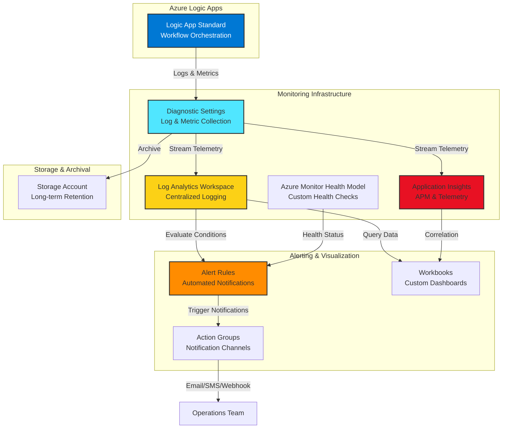
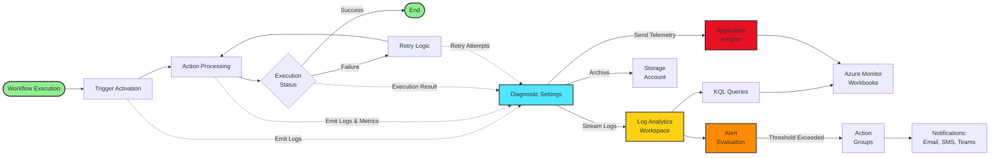

# Azure Logic Apps Monitoring Open Source Project

[](https://opensource.org/licenses/MIT)
[](https://azure.microsoft.com/en-us/products/logic-apps)
[](https://learn.microsoft.com/azure/azure-resource-manager/bicep/overview)

## Project Overview

The **Azure Logic Apps Monitoring** project is an open-source solution that demonstrates enterprise-grade observability patterns for Azure Logic Apps Standard using Infrastructure as Code (IaC) with Bicep templates. This project provides a comprehensive, production-ready monitoring framework that goes beyond default Azure Monitor capabilities by implementing advanced diagnostic settings, custom health models, and automated alerting strategies.

### Why It Matters

While Azure Logic Apps provides built-in monitoring capabilities, enterprise workflow orchestration requires sophisticated observability to ensure reliability, performance, and rapid incident response. This project bridges the gap between basic monitoring and enterprise requirements by providing:

- **Automated Infrastructure Deployment**: Complete monitoring stack deployed via Bicep templates
- **Best Practice Patterns**: Microsoft-recommended observability configurations
- **Production-Ready Templates**: Reusable components for immediate enterprise adoption
- **Cost-Optimized Design**: Efficient resource utilization and log retention strategies

## Target Audience

| Role | Responsibilities | How to Leverage the Solution | Benefits |
|------|------------------|------------------------------|----------|
| **Cloud Solution Architect** | Design enterprise Azure solutions and establish monitoring standards | Use as reference architecture for Logic Apps observability; customize templates for organizational standards | Accelerate solution design with proven patterns; reduce architecture review cycles; ensure compliance with monitoring best practices |
| **DevOps Engineer** | Implement CI/CD pipelines and infrastructure automation | Deploy monitoring infrastructure using provided Bicep templates; integrate with existing DevOps workflows | Automate monitoring deployment; maintain consistency across environments; reduce manual configuration errors |
| **Application Developer** | Build and maintain Logic Apps workflows | Reference diagnostic queries and metrics to troubleshoot workflows; implement telemetry best practices | Faster debugging with structured logs; proactive issue detection; improved workflow performance insights |
| **Site Reliability Engineer (SRE)** | Ensure system reliability and incident response | Configure alerts and dashboards; establish SLOs/SLIs based on collected metrics | Reduced MTTR (Mean Time To Repair); proactive incident prevention; comprehensive system health visibility |
| **Platform Engineer** | Manage Azure platform services and governance | Deploy standardized monitoring across multiple Logic Apps; enforce diagnostic settings policies | Centralized observability; simplified compliance auditing; scalable monitoring framework |

## Features

### Design Principles

This solution is built on four core design principles that align with Azure Well-Architected Framework:

#### 1. **Observability by Design**
Comprehensive telemetry collection from the infrastructure layer through application workflows.

#### 2. **Infrastructure as Code (IaC)**
All monitoring components defined as declarative Bicep templates for repeatability and version control.

#### 3. **Cost Optimization**
Selective log collection and retention policies to balance observability needs with Azure costs.

#### 4. **Operational Excellence**
Automated health checks, proactive alerting, and structured troubleshooting workflows.

### Feature Overview

| Feature | Purpose | Benefit |
|---------|---------|---------|
| **Comprehensive Diagnostic Settings** | Automatically configure collection of all workflow logs and metrics | Complete visibility into Logic Apps execution, performance, and errors without manual configuration |
| **Azure Monitor Integration** | Native integration with Log Analytics workspace and Application Insights | Centralized log aggregation, advanced query capabilities, and correlation with other Azure services |
| **Custom Health Model** | Proactive monitoring rules based on Logic Apps-specific health indicators | Early detection of workflow failures, performance degradation, and capacity issues |
| **Automated Alerting** | Pre-configured alert rules for critical workflow scenarios | Immediate notification of failures, SLA breaches, and anomalies with minimal setup |
| **Query Library** | Curated Kusto (KQL) queries for common monitoring scenarios | Accelerated troubleshooting with ready-to-use diagnostic queries |
| **Bicep Template Modules** | Modular infrastructure templates for monitoring components | Reusable, maintainable, and testable monitoring infrastructure |
| **Dashboard Templates** | Pre-built Azure Monitor workbooks and dashboards | Instant visibility into workflow health, performance trends, and operational metrics |
| **Retention Policies** | Configurable log retention aligned with compliance requirements | Balance between audit requirements and storage costs |

### Comparison: Enhanced vs Default Monitoring

| Aspect | Project Solution | Default Azure Monitor |
|--------|------------------|----------------------|
| **Deployment** | Fully automated via Bicep IaC templates | Manual configuration through Azure Portal |
| **Diagnostic Settings** | Pre-configured for all relevant log categories and metrics | Requires manual selection of categories |
| **Alert Coverage** | Comprehensive alert rules for workflow failures, performance, and capacity | Basic alerts must be manually created |
| **Query Library** | 10+ pre-built KQL queries for common scenarios | No pre-built queries provided |
| **Health Modeling** | Custom health model with Logic Apps-specific indicators | Generic Azure resource health only |
| **Cost Optimization** | Selective log collection with documented retention policies | All logs collected by default, potentially higher costs |
| **Multi-Environment** | Parameterized templates for dev/test/prod deployment | Duplicate manual configuration per environment |
| **Documentation** | Complete usage examples and troubleshooting guides | Generic Azure Monitor documentation |
| **Customization** | Modular Bicep templates for extension | Limited to Portal UI capabilities |
| **Version Control** | Infrastructure and queries managed in Git | Configuration not version controlled |

### Diagnostic Settings

Diagnostic Settings are the foundation of Azure Logic Apps monitoring, enabling the collection of detailed logs and metrics that provide deep insights into workflow execution, performance, and failures.

#### How Diagnostic Settings Work

When configured, Diagnostic Settings route telemetry data from Logic Apps to one or more destinations:
- **Log Analytics Workspace**: For advanced querying with KQL
- **Storage Account**: For long-term archival and compliance
- **Event Hub**: For streaming to third-party SIEM or analytics platforms
- **Application Insights**: For application performance monitoring and correlation

#### Diagnostic Settings Collection

| Metrics | Metrics Description | Logs | Logs Description | Monitoring Improvement |
|---------|-------------------|------|-----------------|----------------------|
| **AllMetrics** | Aggregated performance counters including workflow runs, actions, triggers | **WorkflowRuntime** | Detailed workflow execution logs, action inputs/outputs, correlation IDs | Real-time performance dashboards, capacity planning, SLA compliance tracking |
| **RunsStarted** | Count of workflow runs initiated per time window | **FunctionAppLogs** | Function execution logs for custom connectors and code actions | Throughput analysis, load pattern identification, autoscaling decisions |
| **RunsCompleted** | Count of successfully completed workflow runs | **TriggerRuns** | Trigger activation logs including polling results and event data | Success rate calculation, workflow reliability metrics, trend analysis |
| **RunsFailed** | Count of failed workflow runs with failure reasons | **ActionRuns** | Individual action execution logs with status and duration | Failure pattern detection, error categorization, root cause analysis |
| **RunLatency** | End-to-end workflow execution duration | **WorkflowWarnings** | Non-critical issues like timeout warnings and retry attempts | Performance optimization, bottleneck identification, SLA validation |
| **TriggerLatency** | Time between event occurrence and trigger firing | **IntegrationAccountTracking** | B2B message tracking for EDI and X12 workflows | Early warning system, proactive issue resolution, capacity alerting |

#### Why These Settings Improve Monitoring

1. **Granular Troubleshooting**: WorkflowRuntime and ActionRuns logs provide action-level visibility, enabling pinpoint identification of failures within complex workflows.

2. **Performance Optimization**: Latency metrics combined with execution logs reveal performance bottlenecks and opportunities for optimization.

3. **Cost Management**: Selective log collection (excluding verbose categories like AppTraces in production) reduces Log Analytics costs while maintaining essential observability.

4. **Compliance & Auditing**: Complete execution history in Log Analytics supports audit requirements and incident post-mortems.

5. **Proactive Alerting**: Metrics enable threshold-based alerts (e.g., failure rate > 5%) for immediate incident response.

6. **Correlation & Root Cause Analysis**: Correlation IDs in logs enable tracing end-to-end transactions across multiple workflows and Azure services.

## Architecture


```mermaid
graph TB
    subgraph "Azure Logic Apps"
        LA[Logic App Standard<br/>Workflow Orchestration]
    end
    
    subgraph "Monitoring Infrastructure"
        DS[Diagnostic Settings<br/>Log & Metric Collection]
        LAW[Log Analytics Workspace<br/>Centralized Logging]
        AI[Application Insights<br/>APM & Telemetry]
        AH[Azure Monitor Health Model<br/>Custom Health Checks]
    end
    
    subgraph "Alerting & Visualization"
        AR[Alert Rules<br/>Automated Notifications]
        WB[Workbooks<br/>Custom Dashboards]
        AG[Action Groups<br/>Notification Channels]
    end
    
    subgraph "Storage & Archival"
        SA[Storage Account<br/>Long-term Retention]
    end
    
    LA -->|Logs & Metrics| DS
    DS -->|Stream Telemetry| LAW
    DS -->|Stream Telemetry| AI
    DS -->|Archive| SA
    LAW -->|Query Data| WB
    AI -->|Correlation| WB
    LAW -->|Evaluate Conditions| AR
    AH -->|Health Status| AR
    AR -->|Trigger Notifications| AG
    AG -->|Email/SMS/Webhook| USERS[Operations Team]
    
    style LA fill:#0078D4,stroke:#333,stroke-width:2px,color:#fff
    style DS fill:#50E6FF,stroke:#333,stroke-width:2px
    style LAW fill:#FCD116,stroke:#333,stroke-width:2px
    style AI fill:#E81123,stroke:#333,stroke-width:2px
    style AR fill:#FF8C00,stroke:#333,stroke-width:2px
```

## Dataflow


```mermaid
flowchart LR
    START([Workflow Execution]) --> TRIGGER[Trigger Activation]
    TRIGGER --> ACTIONS[Action Processing]
    ACTIONS --> COMPLETE{Execution<br/>Status}
    
    TRIGGER -.->|Emit Logs| DIAG[Diagnostic Settings]
    ACTIONS -.->|Emit Logs & Metrics| DIAG
    COMPLETE -.->|Execution Result| DIAG
    
    DIAG -->|Stream Logs| LAW[Log Analytics<br/>Workspace]
    DIAG -->|Send Telemetry| AI[Application<br/>Insights]
    DIAG -->|Archive| STORAGE[Storage<br/>Account]
    
    LAW --> QUERY[KQL Queries]
    LAW --> ALERTS[Alert<br/>Evaluation]
    
    QUERY --> WORKBOOK[Azure Monitor<br/>Workbooks]
    AI --> WORKBOOK
    
    ALERTS -->|Threshold Exceeded| ACTION_GROUP[Action<br/>Groups]
    ACTION_GROUP --> NOTIFY[Notifications:<br/>Email, SMS, Teams]
    
    COMPLETE -->|Success| END([End])
    COMPLETE -->|Failure| RETRY[Retry Logic]
    RETRY --> ACTIONS
    RETRY -.->|Retry Attempts| DIAG
    
    style START fill:#90EE90,stroke:#333,stroke-width:2px
    style END fill:#90EE90,stroke:#333,stroke-width:2px
    style DIAG fill:#50E6FF,stroke:#333,stroke-width:2px
    style LAW fill:#FCD116,stroke:#333,stroke-width:2px
    style AI fill:#E81123,stroke:#333,stroke-width:2px
    style ALERTS fill:#FF8C00,stroke:#333,stroke-width:2px
```

## Prerequisites

### Required Tools

- **Azure Subscription** with contributor access or higher
- **Azure Developer CLI (`azd`)** - [Install Guide](https://learn.microsoft.com/azure/developer/azure-developer-cli/install-azd)
- **Azure CLI** - [Install Guide](https://learn.microsoft.com/cli/azure/install-azure-cli)
- **Git** - For cloning the repository
- **VS Code** (optional) - Recommended for Bicep template editing with Azure extensions

### Azure Resources

The deployment will create the following resources:
- Azure Logic Apps Standard (Workflow Service Plan)
- Log Analytics Workspace
- Application Insights
- Storage Account (for logs and Logic Apps storage)
- Azure Monitor Alert Rules and Action Groups

### Required Azure RBAC Roles

| Role | Description | Documentation Link |
|------|-------------|-------------------|
| **Contributor** | Required to deploy Azure resources (Logic Apps, Monitor, Storage) | [Contributor Role](https://learn.microsoft.com/azure/role-based-access-control/built-in-roles#contributor) |
| **Log Analytics Contributor** | Required to configure diagnostic settings and Log Analytics workspace | [Log Analytics Contributor](https://learn.microsoft.com/azure/role-based-access-control/built-in-roles#log-analytics-contributor) |
| **Monitoring Contributor** | Required to create alert rules, action groups, and workbooks | [Monitoring Contributor](https://learn.microsoft.com/azure/role-based-access-control/built-in-roles#monitoring-contributor) |
| **Logic App Contributor** | Required to manage Logic Apps Standard resources | [Logic App Contributor](https://learn.microsoft.com/azure/role-based-access-control/built-in-roles#logic-app-contributor) |
| **Storage Account Contributor** | Required for diagnostic log archival configuration | [Storage Account Contributor](https://learn.microsoft.com/azure/role-based-access-control/built-in-roles#storage-account-contributor) |

### Dependencies

- **.NET 6.0 or later** - Required for Logic Apps Standard runtime
- **Azure Functions Core Tools v4** - For local Logic Apps development (optional)

## Installation & Deployment

### Step 1: Clone the Repository

```bash
git clone https://github.com/your-org/Azure-LogicApps-Monitoring.git
cd Azure-LogicApps-Monitoring
```

### Step 2: Authenticate with Azure

```bash
azd auth login
```

This will open a browser window for Azure authentication.

### Step 3: Initialize the Environment

```bash
azd init
```

When prompted, provide:
- **Environment Name**: e.g., `dev`, `test`, `prod`
- **Azure Subscription**: Select your target subscription
- **Azure Region**: e.g., `eastus`, `westeurope`

### Step 4: Configure Parameters (Optional)

Edit main.parameters.json to customize deployment settings:

```json
{
  "$schema": "https://schema.management.azure.com/schemas/2019-04-01/deploymentParameters.json#",
  "contentVersion": "1.0.0.0",
  "parameters": {
    "environmentName": {
      "value": "${AZURE_ENV_NAME}"
    },
    "location": {
      "value": "${AZURE_LOCATION}"
    },
    "logRetentionDays": {
      "value": 30
    },
    "enableAlerts": {
      "value": true
    }
  }
}
```

### Step 5: Deploy the Infrastructure

```bash
azd up
```

This command will:
1. Provision all Azure resources defined in Bicep templates
2. Configure diagnostic settings for Logic Apps
3. Deploy monitoring infrastructure (Log Analytics, Application Insights)
4. Create alert rules and action groups
5. Deploy sample Logic Apps workflows (optional)

**Expected deployment time**: 5-10 minutes

### Step 6: Verify Deployment

```bash
azd env get-values
```

Output will display important resource information:

```
AZURE_LOGICAPP_NAME="la-monitoring-dev-001"
AZURE_LOGANALYTICS_WORKSPACE_ID="/subscriptions/.../resourceGroups/.../providers/Microsoft.OperationalInsights/workspaces/law-monitoring-dev"
AZURE_APPINSIGHTS_CONNECTION_STRING="InstrumentationKey=..."
```

### Step 7: Access Monitoring Resources

Navigate to the Azure Portal and open:
- **Logic Apps**: Review deployed workflows
- **Log Analytics**: Execute KQL queries from the Usage Examples section
- **Application Insights**: View application performance monitoring
- **Monitor > Alerts**: Review configured alert rules

## Usage Examples

### Example 1: Monitor Workflow Success Rate

**Scenario**: Track the success rate of Logic App workflows over the past 24 hours to identify reliability trends.

**Kusto Query**:

```kql
AzureDiagnostics
| where ResourceProvider == "MICROSOFT.LOGIC"
| where Category == "WorkflowRuntime"
| where TimeGenerated > ago(24h)
| summarize 
    TotalRuns = count(),
    SuccessfulRuns = countif(status_s == "Succeeded"),
    FailedRuns = countif(status_s == "Failed")
    by workflow_name_s
| extend SuccessRate = round((SuccessfulRuns * 100.0) / TotalRuns, 2)
| project 
    WorkflowName = workflow_name_s,
    TotalRuns,
    SuccessfulRuns,
    FailedRuns,
    SuccessRate
| order by SuccessRate asc
```

**Sample Output**:

| WorkflowName | TotalRuns | SuccessfulRuns | FailedRuns | SuccessRate |
|--------------|-----------|----------------|------------|-------------|
| OrderProcessing | 1523 | 1498 | 25 | 98.36 |
| CustomerSync | 847 | 847 | 0 | 100.00 |
| InvoiceGeneration | 234 | 210 | 24 | 89.74 |

**Visualization**: Pin this query to an Azure Dashboard as a column chart to track trends over time.

**Reference**: [Monitor logic app workflows - Azure Logic Apps | Microsoft Learn](https://learn.microsoft.com/azure/logic-apps/monitor-logic-apps-log-analytics)

---

### Example 2: Identify Long-Running Workflows

**Scenario**: Find workflows that exceed expected execution duration for performance optimization.

**Kusto Query**:

```kql
AzureDiagnostics
| where ResourceProvider == "MICROSOFT.LOGIC"
| where Category == "WorkflowRuntime"
| where TimeGenerated > ago(7d)
| where status_s == "Succeeded"
| extend DurationSeconds = todouble(duration_d)
| where DurationSeconds > 60  // Workflows taking more than 60 seconds
| summarize 
    RunCount = count(),
    AvgDuration = round(avg(DurationSeconds), 2),
    MaxDuration = round(max(DurationSeconds), 2),
    P95Duration = round(percentile(DurationSeconds, 95), 2)
    by workflow_name_s
| project 
    WorkflowName = workflow_name_s,
    RunCount,
    AvgDurationSec = AvgDuration,
    MaxDurationSec = MaxDuration,
    P95DurationSec = P95Duration
| order by AvgDurationSec desc
```

**Sample Output**:

| WorkflowName | RunCount | AvgDurationSec | MaxDurationSec | P95DurationSec |
|--------------|----------|----------------|----------------|----------------|
| DataMigration | 45 | 187.34 | 342.18 | 298.56 |
| ReportGeneration | 128 | 92.47 | 156.23 | 134.89 |
| BatchProcessing | 67 | 78.91 | 124.56 | 112.34 |

**Reference**: [Monitor and collect data from workflows - Azure Logic Apps | Microsoft Learn](https://learn.microsoft.com/azure/logic-apps/monitor-workflows-collect-diagnostic-data)

---

### Example 3: Analyze Workflow Failure Patterns

**Scenario**: Investigate failure reasons to prioritize error handling improvements.

**Kusto Query**:

```kql
AzureDiagnostics
| where ResourceProvider == "MICROSOFT.LOGIC"
| where Category == "WorkflowRuntime"
| where TimeGenerated > ago(7d)
| where status_s == "Failed"
| extend ErrorCode = tostring(error_code_s)
| extend ErrorMessage = tostring(error_message_s)
| summarize 
    FailureCount = count(),
    AffectedWorkflows = dcount(workflow_name_s),
    SampleWorkflow = any(workflow_name_s)
    by ErrorCode, ErrorMessage
| project 
    ErrorCode,
    ErrorMessage = substring(ErrorMessage, 0, 100),  // Truncate long messages
    FailureCount,
    AffectedWorkflows,
    SampleWorkflow
| order by FailureCount desc
| take 10
```

**Sample Output**:

| ErrorCode | ErrorMessage | FailureCount | AffectedWorkflows | SampleWorkflow |
|-----------|--------------|--------------|-------------------|----------------|
| ConnectionFailed | The connection to SQL Database timed out | 87 | 3 | OrderProcessing |
| InvalidInput | Required parameter 'customerId' is missing | 43 | 2 | CustomerSync |
| AuthenticationFailed | Invalid credentials for Azure Storage | 28 | 1 | FileProcessor |

**Reference**: [Troubleshoot and diagnose workflow failures - Azure Logic Apps | Microsoft Learn](https://learn.microsoft.com/azure/logic-apps/logic-apps-diagnosing-failures)

---

### Example 4: Track Action-Level Performance

**Scenario**: Identify which specific actions within workflows are causing bottlenecks.

**Kusto Query**:

```kql
AzureDiagnostics
| where ResourceProvider == "MICROSOFT.LOGIC"
| where Category == "WorkflowRuntime"
| where TimeGenerated > ago(24h)
| where action_name_s != ""
| extend DurationSeconds = todouble(duration_d)
| summarize 
    ExecutionCount = count(),
    AvgDuration = round(avg(DurationSeconds), 2),
    MaxDuration = round(max(DurationSeconds), 2)
    by workflow_name_s, action_name_s
| where AvgDuration > 5  // Actions taking more than 5 seconds on average
| project 
    WorkflowName = workflow_name_s,
    ActionName = action_name_s,
    ExecutionCount,
    AvgDurationSec = AvgDuration,
    MaxDurationSec = MaxDuration
| order by AvgDurationSec desc
| take 20
```

**Sample Output**:

| WorkflowName | ActionName | ExecutionCount | AvgDurationSec | MaxDurationSec |
|--------------|------------|----------------|----------------|----------------|
| OrderProcessing | SQL_GetCustomerData | 1523 | 12.34 | 28.91 |
| InvoiceGeneration | HTTP_CallExternalAPI | 234 | 8.76 | 19.45 |
| DataMigration | Foreach_TransformRecords | 45 | 7.89 | 15.23 |

**Chart Visualization**: Create a scatter chart in Azure Monitor Workbooks plotting ActionName vs AvgDurationSec.

**Reference**: [View workflow action history - Azure Logic Apps | Microsoft Learn](https://learn.microsoft.com/azure/logic-apps/monitor-logic-apps#view-runs-and-trigger-history)

---

### Example 5: Monitor Trigger Latency

**Scenario**: Measure the delay between an event occurring and the workflow trigger firing.

**Kusto Query**:

```kql
AzureDiagnostics
| where ResourceProvider == "MICROSOFT.LOGIC"
| where Category == "WorkflowRuntime"
| where TimeGenerated > ago(24h)
| where isnotempty(trigger_name_s)
| extend TriggerLatencySeconds = todouble(trigger_latency_d)
| summarize 
    TriggerCount = count(),
    AvgLatency = round(avg(TriggerLatencySeconds), 2),
    MaxLatency = round(max(TriggerLatencySeconds), 2),
    P95Latency = round(percentile(TriggerLatencySeconds, 95), 2)
    by workflow_name_s, trigger_name_s
| project 
    WorkflowName = workflow_name_s,
    TriggerName = trigger_name_s,
    TriggerCount,
    AvgLatencySec = AvgLatency,
    MaxLatencySec = MaxLatency,
    P95LatencySec = P95Latency
| order by AvgLatencySec desc
```

**Sample Output**:

| WorkflowName | TriggerName | TriggerCount | AvgLatencySec | MaxLatencySec | P95LatencySec |
|--------------|-------------|--------------|---------------|---------------|---------------|
| EventProcessor | ServiceBus_MessageArrived | 3421 | 2.14 | 8.92 | 4.56 |
| FileWatcher | OnBlobCreated | 847 | 1.87 | 7.34 | 3.89 |
| ScheduledJob | Recurrence | 24 | 0.23 | 0.45 | 0.38 |

**Reference**: [Troubleshoot and diagnose trigger issues - Azure Logic Apps | Microsoft Learn](https://learn.microsoft.com/azure/logic-apps/logic-apps-diagnosing-failures#troubleshoot-trigger-history)

---

### Example 6: Cost Analysis - Log Analytics Data Ingestion

**Scenario**: Monitor Log Analytics data ingestion to optimize monitoring costs.

**Kusto Query**:

```kql
Usage
| where TimeGenerated > ago(30d)
| where IsBillable == true
| where DataType in ("AzureDiagnostics", "AzureMetrics")
| summarize 
    TotalGB = round(sum(Quantity) / 1024, 2)
    by DataType, bin(TimeGenerated, 1d)
| project 
    Date = format_datetime(TimeGenerated, 'yyyy-MM-dd'),
    DataType,
    DataIngestionGB = TotalGB
| order by Date desc, DataType asc
```

**Sample Output**:

| Date | DataType | DataIngestionGB |
|------|----------|----------------|
| 2024-01-15 | AzureDiagnostics | 4.73 |
| 2024-01-15 | AzureMetrics | 0.87 |
| 2024-01-14 | AzureDiagnostics | 4.91 |
| 2024-01-14 | AzureMetrics | 0.84 |

**Reference**: [Azure Monitor Logs cost calculations and options | Microsoft Learn](https://learn.microsoft.com/azure/azure-monitor/logs/cost-logs)

---

## Contributing

We welcome contributions from the community! To contribute:

1. **Fork the repository** on GitHub
2. **Create a feature branch** (`git checkout -b feature/your-feature-name`)
3. **Make your changes** following the coding standards
4. **Test your changes** with `azd up` in a test environment
5. **Commit your changes** (`git commit -m 'Add: description of feature'`)
6. **Push to your branch** (`git push origin feature/your-feature-name`)
7. **Open a Pull Request** with a detailed description

### Code of Conduct

This project adheres to the Contributor Covenant Code of Conduct. By participating, you are expected to uphold this code.

### Contribution Guidelines

Please see CONTRIBUTING.md for detailed guidelines on:
- Code style and formatting (Bicep best practices)
- Testing requirements
- Documentation standards
- Pull request process

## License Information

This project is licensed under the **MIT License** - see the LICENSE.md file for complete details.

### MIT License Summary

```
MIT License

Copyright (c) 2024 Azure Logic Apps Monitoring Contributors

Permission is hereby granted, free of charge, to any person obtaining a copy
of this software and associated documentation files (the "Software"), to deal
in the Software without restriction, including without limitation the rights
to use, copy, modify, merge, publish, distribute, sublicense, and/or sell
copies of the Software, and to permit persons to whom the Software is
furnished to do so, subject to the following conditions:

The above copyright notice and this permission notice shall be included in all
copies or substantial portions of the Software.

THE SOFTWARE IS PROVIDED "AS IS", WITHOUT WARRANTY OF ANY KIND, EXPRESS OR
IMPLIED, INCLUDING BUT NOT LIMITED TO THE WARRANTIES OF MERCHANTABILITY,
FITNESS FOR A PARTICULAR PURPOSE AND NONINFRINGEMENT.
```

## Security

Please see SECURITY.md for information on:
- Reporting security vulnerabilities
- Security best practices for deployment
- Credential management guidelines

**Important**: Never commit secrets, connection strings, or credentials to the repository. Use Azure Key Vault and managed identities for secure credential management.

## References

### Microsoft Learn Documentation

- [Monitor logic app workflows - Azure Logic Apps](https://learn.microsoft.com/azure/logic-apps/monitor-logic-apps)
- [Monitor workflows with Azure Monitor logs - Azure Logic Apps](https://learn.microsoft.com/azure/logic-apps/monitor-logic-apps-log-analytics)
- [Diagnostic settings in Azure Monitor](https://learn.microsoft.com/azure/azure-monitor/essentials/diagnostic-settings)
- [Azure Logic Apps Standard - Overview](https://learn.microsoft.com/azure/logic-apps/single-tenant-overview-compare)
- [Kusto Query Language (KQL) Reference](https://learn.microsoft.com/azure/data-explorer/kusto/query/)
- [Azure Bicep Documentation](https://learn.microsoft.com/azure/azure-resource-manager/bicep/overview)
- [Azure Monitor Best Practices](https://learn.microsoft.com/azure/azure-monitor/best-practices)

### GitHub Resources

- [GitHub README Best Practices](https://docs.github.com/en/repositories/managing-your-repositorys-settings-and-features/customizing-your-repository/about-readmes)
- [Markdown Guide](https://www.markdownguide.org/)
- [Mermaid Diagram Syntax](https://mermaid.js.org/intro/)
- [Open Source Guides](https://opensource.guide/)

### Azure Developer CLI

- [Azure Developer CLI (azd) Overview](https://learn.microsoft.com/azure/developer/azure-developer-cli/overview)
- [azd Template Structure](https://learn.microsoft.com/azure/developer/azure-developer-cli/make-azd-compatible)

### Community & Support

- **Issues**: Report bugs or request features via [GitHub Issues](https://github.com/your-org/Azure-LogicApps-Monitoring/issues)
- **Discussions**: Join community discussions in [GitHub Discussions](https://github.com/your-org/Azure-LogicApps-Monitoring/discussions)
- **Stack Overflow**: Tag questions with `azure-logic-apps` and `azure-monitor`
- **Microsoft Q&A**: [Azure Logic Apps Forum](https://learn.microsoft.com/answers/tags/146/azure-logic-apps)

---

## Acknowledgments

This project is inspired by Microsoft's Azure Well-Architected Framework and incorporates best practices from the Azure Logic Apps product team and the broader Azure community.

**Maintainers**: Azure Logic Apps Monitoring Contributors  
**Last Updated**: January 2024  
**Version**: 1.0.0

---

⭐ **Star this repository** if you find it helpful!  
🐛 **Report issues** to help improve the project.  
🤝 **Contribute** to make Azure monitoring better for everyone.

Similar code found with 2 license types