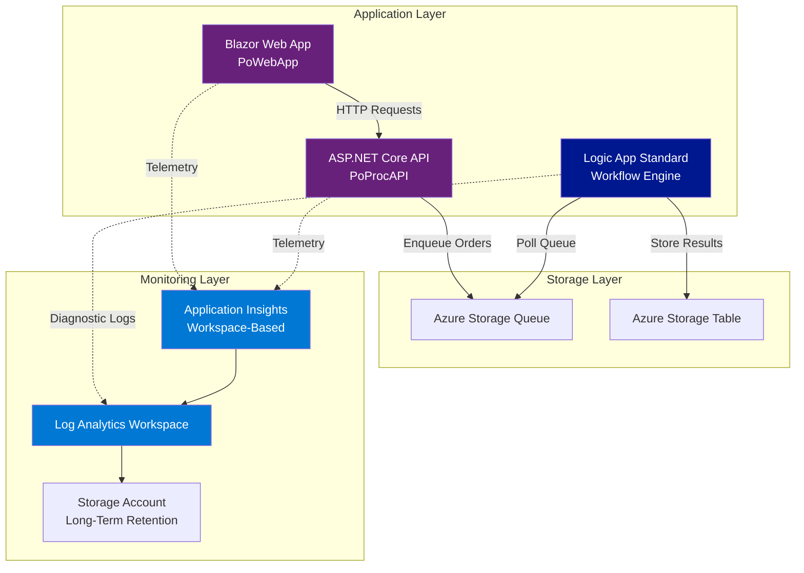
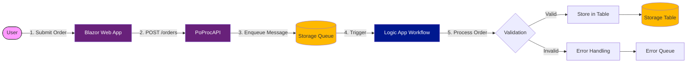
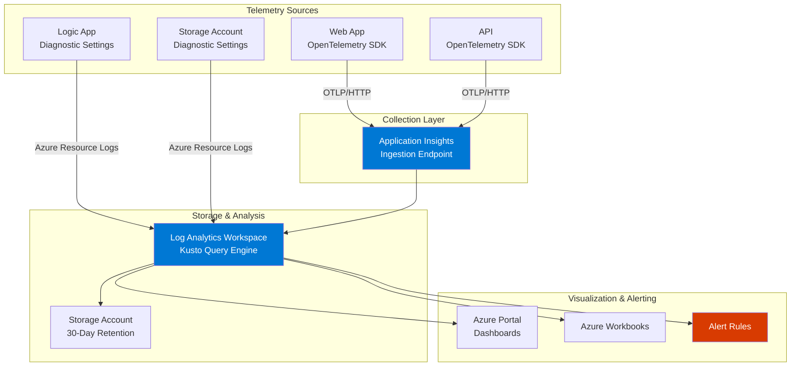

# Azure Logic Apps Monitoring Solution

[](https://opensource.org/licenses/MIT)
[](https://azure.microsoft.com/services/logic-apps/)
[](https://opentelemetry.io/)

A comprehensive, production-ready monitoring solution for Azure Logic Apps Standard that demonstrates enterprise-grade observability patterns using Azure Monitor, Application Insights, and distributed tracing with OpenTelemetry.

---

## 📋 Project Overview

**Azure Logic Apps Monitoring Solution** is an open-source reference implementation that showcases best practices for monitoring, observability, and troubleshooting Azure Logic Apps workflows in production environments. This solution goes beyond basic Azure Monitor capabilities by implementing:

- **End-to-end distributed tracing** across Logic Apps, APIs, and web applications
- **Automated diagnostic settings** for comprehensive log and metric collection
- **Structured logging** with correlation IDs for multi-service transactions
- **Infrastructure as Code (IaC)** using Bicep for reproducible deployments
- **Health monitoring** with custom health checks and availability tests
- **Cost-optimized log retention** with lifecycle management policies

### Why This Project Matters

While Azure provides baseline monitoring for Logic Apps, this solution addresses common enterprise challenges:

- **Correlation gaps** across distributed workflow executions
- **Manual diagnostic configuration** that is error-prone and inconsistent
- **Limited visibility** into custom business metrics and operations
- **Lack of standardization** for observability patterns across teams
- **Troubleshooting complexity** in multi-service integrations

This project provides a **battle-tested blueprint** that organizations can adopt to accelerate their Logic Apps monitoring strategy.

---

## 👥 Target Audience

| Role | Responsibilities | How to Leverage This Solution | Benefits |
|------|------------------|-------------------------------|----------|
| **Cloud Solution Architect** | Design scalable, observable cloud architectures | Use as a reference architecture for Logic Apps monitoring patterns; customize Bicep modules for organizational standards | Reduced architecture design time; proven observability patterns; compliance with Azure Well-Architected Framework |
| **DevOps Engineer** | Automate deployment, monitoring, and incident response | Deploy via `azd` CLI; integrate diagnostic settings into CI/CD pipelines; use Kusto queries for alerting | Automated observability setup; consistent monitoring across environments; faster incident detection |
| **Application Developer** | Build and maintain Logic Apps workflows and integrations | Leverage distributed tracing examples; implement structured logging in custom connectors; use health checks | Faster debugging with correlated logs; better understanding of workflow performance; reduced MTTR |
| **Site Reliability Engineer (SRE)** | Ensure system reliability, availability, and performance | Configure alerts based on collected metrics; create dashboards from Log Analytics data; set SLOs/SLIs | Proactive issue detection; data-driven capacity planning; improved service reliability |
| **Platform Engineer** | Manage shared services and infrastructure | Deploy monitoring infrastructure as a shared service; standardize diagnostic settings; manage Log Analytics workspaces | Centralized observability; cost optimization; governance enforcement |
| **Security Operations** | Monitor security events and compliance | Analyze diagnostic logs for security anomalies; track access patterns; audit workflow executions | Enhanced security visibility; compliance reporting; threat detection |

---

## ✨ Features

### Design Principles

This solution is built on four core design principles:

1. **Observability by Default**: Every component emits structured logs, metrics, and traces
2. **Automation First**: Infrastructure and monitoring configuration deployed as code
3. **Cost Conscious**: Intelligent log retention and sampling to optimize Azure Monitor costs
4. **Developer Experience**: Clear documentation, validation scripts, and examples

### Feature Overview Table

| Feature | Purpose | Benefit |
|---------|---------|---------|
| **Distributed Tracing with OpenTelemetry** | Track requests across Logic Apps, APIs, and web applications using W3C Trace Context | End-to-end visibility; correlate failures across services; measure true latency |
| **Automated Diagnostic Settings** | Automatically configure log and metric collection for all Azure resources via Bicep | Consistent monitoring; eliminates manual setup; ensures compliance |
| **Application Insights Integration** | Centralized telemetry collection with workspace-based Application Insights | Unified observability dashboard; cross-resource correlation; powerful query capabilities |
| **Custom Health Checks** | Validate tracing configuration and Application Insights connectivity | Proactive issue detection; faster troubleshooting; deployment validation |
| **Structured Logging with Correlation** | All logs include TraceId, SpanId, and business context | Simplified troubleshooting; better log analysis; trace-log correlation |
| **Logic App Workflow Monitoring** | Capture workflow execution metrics, trigger history, and action results | Identify bottlenecks; track SLA compliance; optimize workflow performance |
| **Storage Account Diagnostics** | Monitor queue depth, table operations, and storage performance | Detect data bottlenecks; optimize storage costs; prevent throttling |
| **App Service Plan Metrics** | Track CPU, memory, and scaling events for hosting infrastructure | Capacity planning; cost optimization; performance tuning |
| **Log Retention Policies** | Automated lifecycle management for diagnostic logs in storage accounts | Cost control; compliance with data retention requirements; optimized storage |
| **Azure Developer CLI (azd) Support** | Single-command deployment and provisioning | Faster onboarding; reproducible environments; simplified CI/CD integration |

### Comparison Table

| Aspect | Project Solution | Default Azure Monitor |
|--------|------------------|----------------------|
| **Diagnostic Settings** | Automatically configured via IaC for all resources | Manual configuration required per resource |
| **Distributed Tracing** | Full OpenTelemetry instrumentation with W3C Trace Context | Limited to built-in Activity tracking |
| **Log Correlation** | TraceId/SpanId in all logs; baggage propagation | Basic correlation with Operation IDs |
| **Custom Business Metrics** | Semantic conventions for order processing, queue depth, etc. | Generic metrics only |
| **Deployment Automation** | Single `azd up` command deploys everything | Manual portal configuration or custom scripts |
| **Health Checks** | Built-in validation for tracing and connectivity | No automated health validation |
| **Cost Optimization** | Lifecycle policies, intelligent sampling, filtered endpoints | Pay-per-GB ingestion without optimization |
| **Developer Experience** | Validation scripts, examples, comprehensive documentation | Official docs only |
| **Multi-Service Visibility** | Correlated traces across Logic Apps, APIs, and UIs | Isolated per-resource monitoring |
| **Log Analytics Workspace** | Dedicated workspace with linked storage for long-term retention | Basic workspace without storage integration |

### Diagnostic Settings

**Diagnostic Settings** are the foundation of Azure Monitor observability. They define **what** telemetry data (logs and metrics) is collected from Azure resources and **where** it is sent (Log Analytics, Storage Account, Event Hub).

This solution automatically configures diagnostic settings for:
- **Logic Apps (Standard)**: Workflow runtime logs and metrics
- **App Service Plans**: Hosting infrastructure metrics
- **Application Insights**: Telemetry collection settings
- **Storage Accounts**: Queue and table operation logs

#### Diagnostic Settings Collection Table

| Metrics | Metrics Description | Logs | Logs Description | Monitoring Improvement |
|---------|---------------------|------|------------------|------------------------|
| **WorkflowMetrics** | Workflow run counts, success/failure rates, duration | **WorkflowRuntime** | Detailed workflow execution events, trigger activations, action results | Identify failing workflows; measure SLA compliance; optimize execution time |
| **AllMetrics** (App Service Plan) | CPU percentage, memory usage, HTTP queue length | N/A | Not applicable for App Service Plans | Capacity planning; detect resource exhaustion; optimize scaling rules |
| **AllMetrics** (Storage Account) | Transaction counts, ingress/egress bytes, queue message count | **StorageRead**, **StorageWrite**, **StorageDelete** | Detailed storage operation logs with caller IP and operation type | Detect throttling; optimize queue processing; audit data access |
| **AllMetrics** (Application Insights) | Request rate, failure rate, dependency duration | **AppTraces**, **AppDependencies**, **AppExceptions** | Distributed traces, dependency calls, exception stack traces | Correlate failures across services; measure true end-to-end latency; root cause analysis |

**Why These Settings Improve Monitoring:**

1. **Comprehensive Coverage**: Captures both metrics (quantitative) and logs (qualitative) for complete visibility
2. **Dual Destination**: Logs sent to both Log Analytics (querying) and Storage Account (long-term retention/compliance)
3. **Dedicated Workspace**: Uses `logAnalyticsDestinationType: 'Dedicated'` for resource-specific tables with better performance
4. **Lifecycle Management**: Storage Account logs automatically purged after 30 days to control costs
5. **Consistent Configuration**: All resources follow the same diagnostic pattern via Bicep modules

---

## 🏗️ Architecture


```mermaid
graph TB
    subgraph "Application Layer"
        WebApp[Blazor Web App<br/>PoWebApp]
        API[ASP.NET Core API<br/>PoProcAPI]
        LogicApp[Logic App Standard<br/>Workflow Engine]
    end

    subgraph "Storage Layer"
        Queue[Azure Storage Queue]
        Table[Azure Storage Table]
    end

    subgraph "Monitoring Layer"
        AppInsights[Application Insights<br/>Workspace-Based]
        LogAnalytics[Log Analytics Workspace]
        StorageAccount[Storage Account<br/>Long-Term Retention]
    end

    WebApp -->|HTTP Requests| API
    API -->|Enqueue Orders| Queue
    LogicApp -->|Poll Queue| Queue
    LogicApp -->|Store Results| Table

    WebApp -.->|Telemetry| AppInsights
    API -.->|Telemetry| AppInsights
    LogicApp -.->|Diagnostic Logs| LogAnalytics

    AppInsights --> LogAnalytics
    LogAnalytics --> StorageAccount

    style AppInsights fill:#0078D4,color:#fff
    style LogAnalytics fill:#0078D4,color:#fff
    style WebApp fill:#68217A,color:#fff
    style API fill:#68217A,color:#fff
    style LogicApp fill:#00188F,color:#fff
```

---

## 🔄 Dataflow


```mermaid
flowchart LR
    User([User]) -->|1. Submit Order| WebApp[Blazor Web App]
    WebApp -->|2. POST /orders| API[PoProcAPI]
    API -->|3. Enqueue Message| Queue[(Storage Queue)]
    Queue -->|4. Trigger| LogicApp[Logic App Workflow]
    LogicApp -->|5. Process Order| Processing{Validation}
    Processing -->|Valid| Success[Store in Table]
    Processing -->|Invalid| Failure[Error Handling]
    Success --> Table[(Storage Table)]
    Failure --> ErrorLog[Error Queue]

    style User fill:#f9f,stroke:#333
    style WebApp fill:#68217A,color:#fff
    style API fill:#68217A,color:#fff
    style LogicApp fill:#00188F,color:#fff
    style Queue fill:#FFB900
    style Table fill:#FFB900
```

---

## 📊 Monitoring Dataflow


```mermaid
flowchart TB
    subgraph Sources["Telemetry Sources"]
        WebApp[Web App<br/>OpenTelemetry SDK]
        API[API<br/>OpenTelemetry SDK]
        LogicApp[Logic App<br/>Diagnostic Settings]
        Storage[Storage Account<br/>Diagnostic Settings]
    end

    subgraph Collection["Collection Layer"]
        AppInsights[Application Insights<br/>Ingestion Endpoint]
    end

    subgraph Storage_Layer["Storage & Analysis"]
        LogAnalytics[Log Analytics Workspace<br/>Kusto Query Engine]
        LongTerm[Storage Account<br/>30-Day Retention]
    end

    subgraph Visualization["Visualization & Alerting"]
        Portal[Azure Portal<br/>Dashboards]
        Workbooks[Azure Workbooks]
        Alerts[Alert Rules]
    end

    WebApp -->|OTLP/HTTP| AppInsights
    API -->|OTLP/HTTP| AppInsights
    LogicApp -->|Azure Resource Logs| LogAnalytics
    Storage -->|Azure Resource Logs| LogAnalytics

    AppInsights --> LogAnalytics
    LogAnalytics --> LongTerm
    LogAnalytics --> Portal
    LogAnalytics --> Workbooks
    LogAnalytics --> Alerts

    style AppInsights fill:#0078D4,color:#fff
    style LogAnalytics fill:#0078D4,color:#fff
    style Alerts fill:#D83B01,color:#fff
```

**Monitoring Flow Explanation:**

1. **Telemetry Sources**: Applications emit traces, logs, and metrics using OpenTelemetry SDK or Azure diagnostic settings
2. **Collection Layer**: Application Insights acts as the ingestion endpoint for all telemetry
3. **Storage & Analysis**: Data flows to Log Analytics for querying and Storage Account for compliance retention
4. **Visualization & Alerting**: Operators use Azure Portal, Workbooks, and Alert Rules to monitor system health

---

## 📋 Prerequisites

### Tools & Software

- [Azure Developer CLI (`azd`)](https://learn.microsoft.com/azure/developer/azure-developer-cli/install-azd) - v1.5.0 or later
- [Azure CLI (`az`)](https://learn.microsoft.com/cli/azure/install-azure-cli) - v2.50.0 or later
- [.NET 9.0 SDK](https://dotnet.microsoft.com/download/dotnet/9.0)
- [PowerShell 7.x](https://learn.microsoft.com/powershell/scripting/install/installing-powershell) (cross-platform)
- [Git](https://git-scm.com/downloads)

### Azure Resources

- **Active Azure Subscription** with available quota for:
  - App Service Plans (Standard S1 or higher)
  - Logic Apps (Standard tier)
  - Storage Accounts (General Purpose v2)
  - Log Analytics Workspace
  - Application Insights

### RBAC Roles Required

| Role | Description | Documentation Link |
|------|-------------|-------------------|
| **Owner** or **Contributor** | Deploy Azure resources and configure role assignments | [Azure built-in roles](https://learn.microsoft.com/azure/role-based-access-control/built-in-roles#contributor) |
| **Log Analytics Contributor** | Configure diagnostic settings and query logs | [Log Analytics Contributor](https://learn.microsoft.com/azure/role-based-access-control/built-in-roles#log-analytics-contributor) |
| **Monitoring Contributor** | Create alert rules and manage Application Insights | [Monitoring Contributor](https://learn.microsoft.com/azure/role-based-access-control/built-in-roles#monitoring-contributor) |
| **Storage Blob Data Contributor** | Upload Logic App workflow definitions | [Storage Blob Data Contributor](https://learn.microsoft.com/azure/role-based-access-control/built-in-roles#storage-blob-data-contributor) |

### Dependencies

- **Azure Storage Account** for Logic App workflow storage
- **Managed Identity** enabled for all App Services and Logic Apps
- **Virtual Network (optional)** for private endpoint scenarios

---

## 🚀 Installation & Deployment

### Step 1: Clone the Repository

```bash
git clone https://github.com/Evilazaro/Azure-LogicApps-Monitoring.git
cd Azure-LogicApps-Monitoring
```

### Step 2: Authenticate with Azure

```bash
# Login to Azure
azd auth login

# Set your subscription (if you have multiple)
az account set --subscription "<your-subscription-id>"
```

### Step 3: Initialize Azure Developer Environment

```bash
# Initialize a new environment
azd init -e dev

# This will prompt you for:
# - Environment name (e.g., "dev", "prod")
# - Azure subscription
# - Azure region (e.g., "eastus", "westeurope")
```

### Step 4: Deploy Infrastructure and Applications

```bash
# Single command to provision and deploy everything
azd up

# This will:
# 1. Create resource group
# 2. Deploy monitoring infrastructure (Log Analytics, Application Insights)
# 3. Deploy workload resources (Logic App, APIs, Web App)
# 4. Configure diagnostic settings
# 5. Deploy application code
```

**Expected output:**
```
Provisioning Azure resources (azd provision)
  ✓ Provisioning resource group (1s)
  ✓ Deploying monitoring infrastructure (45s)
  ✓ Deploying workload infrastructure (60s)
  ✓ Configuring diagnostic settings (15s)

Deploying application code (azd deploy)
  ✓ Building PoProcAPI (30s)
  ✓ Deploying PoProcAPI to Azure (45s)
  ✓ Building PoWebApp (25s)
  ✓ Deploying PoWebApp to Azure (40s)
  ✓ Deploying Logic App workflows (20s)

SUCCESS: Your application was provisioned and deployed!
```

### Step 5: Configure Logic App Connections

```powershell
# Run the connection deployment script
cd hooks
./deploy-connections.ps1 `
  -ResourceGroupName "rg-eshop-orders-dev-eastus" `
  -LogicAppName "eshop-orders-abc123-logicapp" `
  -QueueConnectionName "azurequeues" `
  -TableConnectionName "azuretables"
```

### Step 6: Verify Deployment

```bash
# Check deployment outputs
azd env get-values

# Test API endpoint
curl https://<your-api-name>.azurewebsites.net/health

# View Logic App in Azure Portal
az logicapp show --name <your-logicapp-name> --resource-group <your-rg-name>
```

### Step 7: View Monitoring Data

1. Open [Azure Portal](https://portal.azure.com)
2. Navigate to **Application Insights** resource
3. Go to **Transaction search** or **Application Map**
4. View distributed traces with correlation IDs

---

## 💡 Usage Examples

### Example 1: Query Failed Workflow Runs

**Scenario**: Identify all Logic App workflow runs that failed in the last 24 hours.

```kql
AzureDiagnostics
| where Category == "WorkflowRuntime"
| where status_s == "Failed"
| where TimeGenerated > ago(24h)
| project TimeGenerated, workflowName_s, runId_s, error_message_s
| order by TimeGenerated desc
```

**Sample Output**:

| TimeGenerated | workflowName_s | runId_s | error_message_s |
|---------------|----------------|---------|-----------------|
| 2024-12-09 14:23:45 | eShopOrders | 08585918354... | ActionFailed: InvalidQueueMessage |
| 2024-12-09 12:15:30 | eShopOrders | 08585912234... | TriggerFailed: StorageAccountNotFound |

**Chart Visualization**: Use **Column chart** to visualize failure trends over time.

**Reference**: [Monitor Logic Apps with Azure Monitor](https://learn.microsoft.com/azure/logic-apps/monitor-logic-apps-log-analytics)

---

### Example 2: Measure API Response Time Distribution

**Scenario**: Analyze P50, P90, and P99 response times for the PoProcAPI.

```kql
AppRequests
| where Name startswith "POST /orders"
| where TimeGenerated > ago(1h)
| summarize 
    P50 = percentile(DurationMs, 50),
    P90 = percentile(DurationMs, 90),
    P99 = percentile(DurationMs, 99),
    RequestCount = count()
    by bin(TimeGenerated, 5m)
| render timechart
```

**Sample Output**:

| TimeGenerated | P50 | P90 | P99 | RequestCount |
|---------------|-----|-----|-----|--------------|
| 2024-12-09 14:00 | 85ms | 210ms | 450ms | 342 |
| 2024-12-09 14:05 | 92ms | 230ms | 520ms | 389 |

**Chart Visualization**: **Line chart** showing latency percentiles over time.

**Reference**: [Application Insights Kusto Queries](https://learn.microsoft.com/azure/azure-monitor/logs/get-started-queries)

---

### Example 3: Correlate Traces Across Services

**Scenario**: Find all operations related to a specific order by TraceId.

```kql
let traceId = "00-4bf92f3577b34da6a3ce929d0e0e4736-00f067aa0ba902b7-01";
union AppTraces, AppDependencies, AppRequests
| where OperationId == traceId
| project TimeGenerated, ItemType, OperationName, Message, DurationMs
| order by TimeGenerated asc
```

**Sample Output**:

| TimeGenerated | ItemType | OperationName | Message | DurationMs |
|---------------|----------|---------------|---------|------------|
| 2024-12-09 14:23:45 | Request | POST /orders | Order received | 120 |
| 2024-12-09 14:23:45 | Trace | ProcessOrder | Validating order data | - |
| 2024-12-09 14:23:46 | Dependency | HTTP POST | Call to Logic App | 340 |

**Reference**: [Distributed Tracing in Azure Monitor](https://learn.microsoft.com/azure/azure-monitor/app/distributed-tracing-telemetry-correlation)

---

### Example 4: Monitor Storage Queue Depth

**Scenario**: Track queue message count to detect backlog or processing delays.

```kql
AzureMetrics
| where ResourceId contains "storageAccounts"
| where MetricName == "QueueMessageCount"
| where TimeGenerated > ago(1h)
| summarize AvgQueueDepth = avg(Average) by bin(TimeGenerated, 5m)
| render timechart
```

**Sample Output**:

| TimeGenerated | AvgQueueDepth |
|---------------|---------------|
| 2024-12-09 14:00 | 125 |
| 2024-12-09 14:05 | 342 |
| 2024-12-09 14:10 | 89 |

**Chart Visualization**: **Area chart** to visualize queue backlog trends.

**Reference**: [Monitor Azure Storage with Azure Monitor](https://learn.microsoft.com/azure/storage/common/monitor-storage)

---

### Example 5: Detect Slow Logic App Actions

**Scenario**: Identify Logic App actions that exceed 5-second execution time.

```kql
AzureDiagnostics
| where Category == "WorkflowRuntime"
| where actionName_s != ""
| where actionDuration_d > 5000  // milliseconds
| project TimeGenerated, workflowName_s, actionName_s, actionDuration_d
| order by actionDuration_d desc
```

**Sample Output**:

| TimeGenerated | workflowName_s | actionName_s | actionDuration_d |
|---------------|----------------|--------------|------------------|
| 2024-12-09 14:23:45 | eShopOrders | Process_Order_Table | 8450 |
| 2024-12-09 14:22:30 | eShopOrders | HTTP_Call_External_API | 6200 |

**Reference**: [Optimize Logic Apps Performance](https://learn.microsoft.com/azure/logic-apps/create-workflow-with-trigger-or-action)

---

## 📄 License Information

This project is licensed under the **MIT License**.

```
MIT License

Copyright (c) 2024 Evilazaro

Permission is hereby granted, free of charge, to any person obtaining a copy
of this software and associated documentation files (the "Software"), to deal
in the Software without restriction, including without limitation the rights
to use, copy, modify, merge, publish, distribute, sublicense, and/or sell
copies of the Software, and to permit persons to whom the Software is
furnished to do so, subject to the following conditions:

The above copyright notice and this permission notice shall be included in all
copies or substantial portions of the Software.

THE SOFTWARE IS PROVIDED "AS IS", WITHOUT WARRANTY OF ANY KIND, EXPRESS OR
IMPLIED, INCLUDING BUT NOT LIMITED TO THE WARRANTIES OF MERCHANTABILITY,
FITNESS FOR A PARTICULAR PURPOSE AND NONINFRINGEMENT. IN NO EVENT SHALL THE
AUTHORS OR COPYRIGHT HOLDERS BE LIABLE FOR ANY CLAIM, DAMAGES OR OTHER
LIABILITY, WHETHER IN AN ACTION OF CONTRACT, TORT OR OTHERWISE, ARISING FROM,
OUT OF OR IN CONNECTION WITH THE SOFTWARE OR THE USE OR OTHER DEALINGS IN THE
SOFTWARE.
```

See LICENSE.md for full details.

---

## 🔗 References

### Microsoft Documentation

- [Monitor Logic Apps with Azure Monitor](https://learn.microsoft.com/azure/logic-apps/monitor-logic-apps-log-analytics)
- [Azure Monitor Overview](https://learn.microsoft.com/azure/azure-monitor/overview)
- [Application Insights for ASP.NET Core](https://learn.microsoft.com/azure/azure-monitor/app/asp-net-core)
- [Diagnostic Settings in Azure Monitor](https://learn.microsoft.com/azure/azure-monitor/essentials/diagnostic-settings)
- [Kusto Query Language (KQL) Reference](https://learn.microsoft.com/azure/data-explorer/kusto/query/)
- [Azure Developer CLI Documentation](https://learn.microsoft.com/azure/developer/azure-developer-cli/)

### OpenTelemetry Resources

- [OpenTelemetry .NET Documentation](https://opentelemetry.io/docs/instrumentation/net/)
- [W3C Trace Context Specification](https://www.w3.org/TR/trace-context/)
- [Azure Monitor OpenTelemetry Integration](https://learn.microsoft.com/azure/azure-monitor/app/opentelemetry-enable)

### GitHub Best Practices

- [Making READMEs Readable](https://docs.github.com/en/repositories/managing-your-repositorys-settings-and-features/customizing-your-repository/about-readmes)
- [Open Source Guides](https://opensource.guide/)
- [Awesome README Examples](https://github.com/matiassingers/awesome-readme)

### Related Projects

- [Azure/azure-sdk-for-net](https://github.com/Azure/azure-sdk-for-net) - Azure SDK for .NET
- [open-telemetry/opentelemetry-dotnet](https://github.com/open-telemetry/opentelemetry-dotnet) - OpenTelemetry .NET SDK

---

## 🤝 Contributing

Contributions are welcome! Please read CONTRIBUTING.md for details on our code of conduct and the process for submitting pull requests.

## 🐛 Issues

Found a bug or have a feature request? Please open an issue on our [GitHub Issues](https://github.com/Evilazaro/Azure-LogicApps-Monitoring/issues) page.

## 📧 Support

For questions or support, please refer to the following resources:

- **Documentation**: Review the detailed guides in DISTRIBUTED_TRACING.md and `src/PoWebApp/QUICK_START.md`
- **GitHub Discussions**: Ask questions in [Discussions](https://github.com/Evilazaro/Azure-LogicApps-Monitoring/discussions)
- **Azure Support**: For Azure-specific issues, contact [Azure Support](https://azure.microsoft.com/support/)

---

**⭐ If you find this project helpful, please consider giving it a star on GitHub!**

**Last Updated**: December 9, 2024

Similar code found with 2 license types