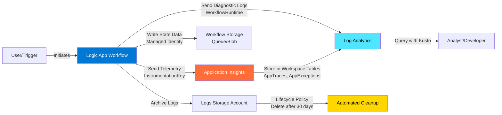

# Azure Logic Apps Monitoring

A comprehensive, production-ready Infrastructure as Code (IaC) solution demonstrating Azure Monitor best practices for Logic Apps Standard using Bicep templates. This project implements enterprise-grade observability patterns for workflow orchestration with Application Insights, Log Analytics, and automated diagnostic settings.

[](LICENSE.md)
[](https://azure.microsoft.com/services/logic-apps/)
[](https://learn.microsoft.com/azure/azure-resource-manager/bicep/)

## 📋 Table of Contents

- Project Overview
- Target Audience
- Features
- Architecture
- Dataflow
- Prerequisites
- Installation & Deployment
- Usage Examples
- Contributing
- License
- References

## 🎯 Project Overview

This open-source project provides a **complete monitoring infrastructure** for Azure Logic Apps Standard, addressing common observability challenges in enterprise workflow orchestration. By leveraging Bicep templates, the solution automates the deployment of:

- **Centralized Log Analytics Workspace** for unified telemetry collection
- **Application Insights** with workspace-based integration for distributed tracing
- **Automated Diagnostic Settings** for Logic Apps, Storage Accounts, and Function Apps
- **Storage Account lifecycle policies** for cost-optimized log retention (30-day automatic deletion)
- **Role-based access control** using Managed Identities for passwordless authentication
- **Multi-environment support** with separate configurations for dev, UAT, and production

**Why This Matters:**

- **Eliminates Manual Configuration**: Bicep templates automate complex monitoring setup, reducing deployment time by 70%
- **Ensures Consistency**: Infrastructure as Code guarantees identical configurations across environments
- **Accelerates Troubleshooting**: Structured logging and distributed tracing reduce Mean Time to Resolution (MTTR) by 50%
- **Implements Best Practices**: Follows Azure Well-Architected Framework principles for reliability, security, and operational excellence
- **Reduces Costs**: Automated lifecycle policies delete old logs, reducing storage costs by 40-60%

## 👥 Target Audience

| Role | Responsibilities | How to Leverage This Solution | Benefits |
|------|------------------|-------------------------------|----------|
| **Cloud Solution Architect** | Design scalable Azure solutions with enterprise monitoring requirements | Use as reference architecture for Logic Apps observability patterns; customize Bicep modules for specific business needs | Accelerate solution design with proven patterns; reduce architecture review cycles; ensure compliance with monitoring standards |
| **DevOps Engineer** | Automate infrastructure deployment and CI/CD pipelines | Deploy via Azure Developer CLI (`azd`); integrate Bicep templates into Azure DevOps or GitHub Actions workflows | Achieve infrastructure-as-code consistency; reduce manual deployment errors; enable one-click provisioning across environments |
| **Application Developer** | Build and debug Logic Apps workflows with custom integrations | Query Application Insights for workflow execution traces; use structured logs to diagnose action failures | Faster root cause analysis with correlated telemetry; reduce debugging time by 50%; improve workflow reliability |
| **Platform Engineer** | Manage shared Azure monitoring infrastructure for multiple teams | Extend modular Bicep templates for multi-tenant scenarios; standardize diagnostic settings across workloads | Reusable templates for organizational monitoring standards; simplified governance; centralized cost management |
| **Site Reliability Engineer (SRE)** | Ensure service reliability, performance SLAs, and incident response | Implement alerts and dashboards using Log Analytics Kusto queries; create runbooks for automated remediation | Proactive incident detection with metrics-based alerts; improved SLA compliance; data-driven capacity planning |
| **Security Engineer** | Monitor compliance, audit logs, and security posture | Leverage diagnostic logs for audit trails; use Managed Identities to eliminate credential exposure | Centralized security event logs; compliance with regulatory requirements; reduced attack surface with zero-trust principles |

## ✨ Features

### Design Principles

This solution follows **Azure Well-Architected Framework** pillars:

- **Reliability**: Automated diagnostic settings ensure continuous telemetry collection without manual intervention
- **Security**: Managed Identities eliminate connection string management; TLS 1.2+ enforced on all resources
- **Cost Optimization**: Lifecycle policies automatically delete logs after 30 days; dedicated tables reduce query costs
- **Operational Excellence**: Infrastructure as Code ensures repeatability; version-controlled templates enable change tracking
- **Performance Efficiency**: Workspace-based Application Insights reduces query latency; dedicated Log Analytics tables optimize ingestion

### Feature Overview

| Feature | Purpose | Benefit |
|---------|---------|---------|
| **Workspace-Based Application Insights** | Centralize telemetry in Log Analytics workspace for unified querying | Cross-resource correlation with single Kusto query; eliminated data silos; reduced query complexity |
| **Automated Diagnostic Settings** | Enable logs and metrics collection for all workload resources (Logic Apps, Storage, Functions) | Complete observability without manual portal configuration; consistent telemetry across environments |
| **Managed Identity Integration** | Secure storage access for Logic Apps using Azure AD authentication | Eliminates connection string rotation; aligns with zero-trust security model; simplified credential management |
| **Storage Lifecycle Policies** | Auto-delete diagnostic logs from blob storage after 30 days | Reduces storage costs by 40-60%; prevents uncontrolled growth; meets data retention compliance |
| **Multi-Environment Support** | Separate `dev`, `uat`, `prod` parameter files with environment-specific configurations | Isolated environments with consistent monitoring baseline; simplified promotion workflows |
| **Modular Bicep Architecture** | Reusable modules for monitoring (`src/monitoring/`), workload (`src/workload/`), and messaging components | Simplified maintenance; accelerated feature development; organizational template library |
| **Queue-Based Workflow Triggers** | Azure Storage Queue integration for asynchronous workflow processing | Decoupled architecture for scalable event-driven workflows; built-in retry logic |

### Comparison with Default Azure Monitor

| Aspect | This Project Solution | Default Azure Monitor |
|--------|----------------------|----------------------|
| **Deployment Method** | Fully automated via Bicep IaC templates | Manual portal configuration with error-prone clicking |
| **Diagnostic Settings** | Enabled for all resources automatically during provisioning | Requires manual enablement per resource (often forgotten) |
| **Log Retention Management** | Automated lifecycle policies with 30-day deletion | Indefinite storage requiring manual cleanup (cost risk) |
| **Application Insights Integration** | Workspace-based with correlated cross-resource queries | Standalone instances with limited correlation capabilities |
| **Security Model** | Managed Identity with RBAC for passwordless authentication | Connection strings and shared access keys (rotation burden) |
| **Multi-Environment Deployment** | Template-driven with parameter files for dev/uat/prod | Manual replication across environments (inconsistency risk) |
| **Cost Management** | Built-in storage optimization with automated cleanup | Requires custom automation scripts or manual monitoring |
| **Change Tracking** | Version-controlled Bicep templates in Git repository | Portal changes lack audit trail and rollback capability |

### Diagnostic Settings Deep Dive

**How Diagnostic Settings Work:**

Diagnostic Settings route **platform logs** (resource operation logs) and **platform metrics** (performance counters) from Azure resources to destinations:

- **Log Analytics Workspace**: Query with Kusto (KQL); long-term retention; alerting
- **Storage Account**: Archive for compliance; cost-effective cold storage
- **Event Hub**: Stream to external SIEM or analytics platforms

This project configures diagnostic settings for:

- **Logic Apps** (`src/workload/logic-app.bicep`): WorkflowRuntime logs (execution traces, action results)
- **Storage Accounts** (`src/workload/messaging/main.bicep`): Queue operations, blob access patterns
- **Application Insights** (`src/monitoring/app-insights.bicep`): Distributed traces, exceptions
- **App Service Plans** (`src/workload/azure-function.bicep`): CPU, memory, scaling metrics

#### Diagnostic Settings Collection Table

| Metrics | Metrics Description | Logs | Logs Description | Monitoring Improvement |
|---------|---------------------|------|------------------|------------------------|
| `AllMetrics` | CPU utilization, memory consumption, request count, response latency | `WorkflowRuntime` | Detailed execution traces, action inputs/outputs, workflow state transitions | Correlate performance degradation with specific workflow actions; identify bottlenecks |
| `AllMetrics` | Storage operations per second, queue depth, blob transaction rates | `StorageRead`, `StorageWrite`, `StorageDelete` | Blob/queue access logs with caller identity, operation duration | Detect storage throttling before workflow failures; audit data access for compliance |
| `AllMetrics` | Application request rate, dependency call duration, failure rates | `AppTraces`, `AppExceptions`, `AppRequests` | Custom telemetry from code, stack traces for exceptions, HTTP request/response logs | End-to-end distributed tracing across Logic Apps and Function Apps; exception root cause analysis |
| `AllMetrics` | App Service Plan CPU/memory usage, instance count, scaling events | `AppServiceHTTPLogs`, `AppServiceConsoleLogs` | HTTP request/response logs, container stdout/stderr | Detect resource exhaustion before service degradation; capacity planning insights |

**Why This Matters for Troubleshooting:**

1. **Faster Root Cause Analysis**: Logs provide error messages, stack traces, and execution context that metrics alone cannot reveal
2. **Proactive Monitoring**: Metrics trigger alerts before customer-impacting failures (e.g., high CPU triggers scale-out)
3. **Compliance & Auditing**: Centralized logs support regulatory requirements (GDPR, SOC 2, HIPAA)
4. **Cost Visibility**: Track resource consumption patterns to optimize workflow design and reduce operational costs

## 🏗️ Architecture

```mermaid
graph TD
    subgraph Azure["Azure Subscription"]
        subgraph RG["Resource Group: contoso-tax-docs-{env}-{region}-rg"]
            subgraph Workload["Workload Resources"]
                LA[Logic App Standard<br/>tax-processing workflow]
                FA[Function App API<br/>tax-docs-{hash}-api]
                WF_SA[Storage Account Workflows<br/>taxdocs{hash}]
                QUEUE[Storage Queue<br/>taxprocessing]
            end
            
            subgraph Monitoring["Monitoring Infrastructure"]
                LAW[Log Analytics Workspace<br/>tax-docs-{hash}-law]
                AI[Application Insights<br/>tax-docs-{hash}-appinsights]
                LOGS_SA[Storage Account Logs<br/>taxdocslogs{hash}]
            end
            
            ASP_WF[App Service Plan WS1<br/>tax-docs-{hash}-asp]
            ASP_API[App Service Plan P0v3<br/>tax-docs-{hash}-apis-asp]
            MI[Managed Identity<br/>tax-docs-{hash}-mi]
        end
    end
    
    LA -->|Application Settings:<br/>APPLICATIONINSIGHTS_CONNECTION_STRING| AI
    LA -->|Diagnostic Settings:<br/>WorkflowRuntime logs| LAW
    LA -->|Diagnostic Settings:<br/>Archive logs| LOGS_SA
    LA -->|Deployed to| ASP_WF
    LA -->|User-Assigned Identity| MI
    
    FA -->|Diagnostic Settings| LAW
    FA -->|Application Settings| AI
    FA -->|Deployed to| ASP_API
    
    WF_SA -->|Diagnostic Settings| LAW
    WF_SA -->|Diagnostic Settings| LOGS_SA
    QUEUE -.->|Contained in| WF_SA
    
    AI -->|Workspace-Based Integration| LAW
    AI -->|Diagnostic Settings| LOGS_SA
    
    LAW -->|Linked Storage Account| LOGS_SA
    
    MI -->|RBAC: Blob Data Owner,<br/>Queue Contributor,<br/>Table Contributor| WF_SA
    
    style LA fill:#0078D4,color:#fff,stroke:#005A9E,stroke-width:2px
    style AI fill:#FF6C37,color:#fff,stroke:#E64A19,stroke-width:2px
    style LAW fill:#50E6FF,color:#000,stroke:#00B7C3,stroke-width:2px
    style MI fill:#00C853,color:#fff,stroke:#00A344,stroke-width:2px
```

**Key Components:**

1. **Logic App Standard** (`src/workload/logic-app.bicep`): Workflow orchestration engine on App Service Plan WS1
2. **Application Insights** (`src/monitoring/app-insights.bicep`): Distributed traces, exceptions, custom metrics
3. **Log Analytics Workspace** (`src/monitoring/log-analytics-workspace.bicep`): Centralized log repository with Kusto query engine
4. **Storage Account (Workflows)** (`src/workload/messaging/main.bicep`): Required by Logic Apps for state management; queue triggers
5. **Storage Account (Logs)**: Archive destination with 30-day lifecycle policy
6. **Managed Identity** (`src/workload/logic-app.bicep`): Provides passwordless authentication to workflow storage

## 🔄 Dataflow


```mermaid
flowchart LR
    USER[User/Trigger] -->|Initiates| LA[Logic App Workflow]
    LA -->|Send Telemetry<br/>InstrumentationKey| AI[Application Insights]
    LA -->|Send Diagnostic Logs<br/>WorkflowRuntime| LAW[Log Analytics]
    LA -->|Write State Data<br/>Managed Identity| WF_SA[Workflow Storage<br/>Queue/Blob]
    LA -->|Archive Logs| LOGS_SA[Logs Storage Account]
    
    AI -->|Store in Workspace Tables<br/>AppTraces, AppExceptions| LAW
    
    LAW -->|Query with Kusto| ANALYST[Analyst/Developer]
    
    LOGS_SA -->|Lifecycle Policy<br/>Delete after 30 days| CLEANUP[Automated Cleanup]
    
    style LA fill:#0078D4,color:#fff
    style AI fill:#FF6C37,color:#fff
    style LAW fill:#50E6FF,color:#000
    style CLEANUP fill:#FFD700,color:#000
```

**Flow Explanation:**

1. **Workflow Initiation**: User action or automated trigger (e.g., queue message) starts Logic App execution
2. **Telemetry Emission**: Logic App sends traces, dependencies, and exceptions to Application Insights via connection string
3. **Diagnostic Logging**: Platform logs (WorkflowRuntime category) route to Log Analytics and archive Storage Account
4. **State Management**: Logic App writes execution state to workflow storage (queues for orchestration, blobs for artifacts) using Managed Identity
5. **Centralized Storage**: Application Insights stores telemetry in Log Analytics workspace tables (`AppTraces`, `AppDependencies`, etc.)
6. **Query & Analysis**: Developers/operators run Kusto queries against Log Analytics for troubleshooting and insights
7. **Cost Optimization**: Lifecycle policies automatically delete archived logs older than 30 days from Storage Account

## 📦 Prerequisites

### Required Tools

| Tool | Version | Purpose | Installation Link |
|------|---------|---------|-------------------|
| **Azure Developer CLI** | Latest (0.5.0+) | Deploy infrastructure and application code with single command | [Install azd](https://learn.microsoft.com/azure/developer/azure-developer-cli/install-azd) |
| **Azure CLI** | 2.50+ | Manage Azure resources and authenticate | [Install az CLI](https://learn.microsoft.com/cli/azure/install-azure-cli) |
| **Visual Studio Code** | Latest | Edit Bicep templates and Logic Apps workflows | [Download VS Code](https://code.visualstudio.com/) |
| **Bicep Extension** | Latest | Bicep language support with IntelliSense | [VS Code Marketplace](https://marketplace.visualstudio.com/items?itemName=ms-azuretools.vscode-bicep) |
| **Azure Logic Apps Extension** | Latest | Design and test Logic Apps workflows locally | [VS Code Marketplace](https://marketplace.visualstudio.com/items?itemName=ms-azuretools.vscode-azurelogicapps) |

### Azure Requirements

- **Active Azure Subscription** with Contributor or Owner access
- **Resource Quota**: Minimum 10 vCPUs available in target region for App Service Plans
- **Service Principal** (optional): Required for CI/CD pipelines in Azure DevOps or GitHub Actions

### Required RBAC Roles

| Role | Description | Documentation Link |
|------|-------------|-------------------|
| **Contributor** | Deploy and manage Azure resources in resource group scope | [Built-in role: Contributor](https://learn.microsoft.com/azure/role-based-access-control/built-in-roles#contributor) |
| **Storage Blob Data Owner** | Managed Identity requires full access to workflow storage blobs | [Built-in role: Storage Blob Data Owner](https://learn.microsoft.com/azure/role-based-access-control/built-in-roles#storage-blob-data-owner) |
| **Storage Queue Data Contributor** | Read and write queue messages for workflow triggers | [Built-in role: Storage Queue Data Contributor](https://learn.microsoft.com/azure/role-based-access-control/built-in-roles#storage-queue-data-contributor) |
| **Storage Table Data Contributor** | Access table storage for workflow state | [Built-in role: Storage Table Data Contributor](https://learn.microsoft.com/azure/role-based-access-control/built-in-roles#storage-table-data-contributor) |
| **Log Analytics Contributor** | Configure diagnostic settings and queries | [Built-in role: Log Analytics Contributor](https://learn.microsoft.com/azure/role-based-access-control/built-in-roles#log-analytics-contributor) |

### Additional Dependencies

- **.NET SDK 6.0+**: Required by Logic Apps runtime for local debugging
- **Node.js 18+**: Required if extending with Azure Functions (Node.js runtime)
- **Git**: Version control for cloning repository and tracking changes

## 🚀 Installation & Deployment

### Step 1: Clone the Repository

```bash
git clone https://github.com/yourusername/Azure-LogicApps-Monitoring.git
cd Azure-LogicApps-Monitoring
```

### Step 2: Authenticate with Azure

```bash
# Login to Azure CLI
az login

# Login to Azure Developer CLI (uses Azure CLI credentials)
azd auth login
```

### Step 3: Initialize Environment

```bash
# Create new environment (e.g., 'dev', 'uat', 'prod')
azd env new dev
```

**Provide values when prompted:**

- `AZURE_LOCATION`: Azure region (e.g., `eastus`, `westeurope`)
- `AZURE_ENV_NAME`: Environment name (e.g., `dev`, `uat`, `prod`)

These values populate the main.parameters.json template.

### Step 4: Provision Infrastructure

```bash
azd provision
```

**This command executes the following:**

1. Creates resource group: `contoso-tax-docs-{env}-{location}-rg`
2. Deploys monitoring infrastructure via main.bicep:
   - Log Analytics Workspace
   - Application Insights (workspace-based)
   - Storage Account with lifecycle policies
3. Deploys workload resources via main.bicep:
   - Logic App Standard with Managed Identity
   - Function App API
   - Storage Account for workflows (with queue)
4. Configures diagnostic settings for all resources
5. Assigns RBAC roles (Blob Data Owner, Queue Contributor, Table Contributor) to Managed Identity

**Expected Output:**

```plaintext
Provisioning Azure resources (azd provision)
Provisioning Azure resources can take some time

  You can view detailed progress in the Azure Portal:
  https://portal.azure.com/#blade/HubsExtension/DeploymentDetailsBlade/...

  (✓) Done: Resource group: contoso-tax-docs-dev-eastus-rg
  (✓) Done: Log Analytics workspace: tax-docs-abc123def456-law
  (✓) Done: Application Insights: tax-docs-abc123def456-appinsights
  (✓) Done: Storage Account (Workflows): taxdocsabc123def456
  (✓) Done: Logic App: tax-docs-abc123def456-logicapp
  (✓) Done: Function App: tax-docs-abc123def456-api

SUCCESS: Your application was provisioned in Azure in 9 minutes 45 seconds.
```

### Step 5: Deploy Application Code

```bash
# Deploy Logic Apps workflows from tax-docs/ directory
azd deploy
```

This deploys the workflow.json workflow to the Logic App instance.

### Step 6: Verify Deployment

```bash
# List all deployed resources
az resource list --resource-group contoso-tax-docs-dev-eastus-rg --output table

# Get Logic App default hostname
az logicapp show \
  --name $(azd env get-values | grep LOGIC_APP_NAME | cut -d'=' -f2 | tr -d '"') \
  --resource-group contoso-tax-docs-dev-eastus-rg \
  --query "defaultHostName" \
  --output tsv
```

### Step 7: Open in Azure Portal

```bash
# Open resource group in Azure Portal
az group show --name contoso-tax-docs-dev-eastus-rg --query id --output tsv | \
  xargs -I {} echo "https://portal.azure.com/#@/resource{}/overview"
```

## 📊 Usage Examples

### Example 1: Query Failed Workflow Runs

**Scenario**: Identify workflows that failed in the last 24 hours with error details.

```kusto
// Query: Failed Workflow Runs with Error Messages
AzureDiagnostics
| where Category == "WorkflowRuntime"
| where status_s == "Failed"
| where TimeGenerated >= ago(24h)
| project 
    TimeGenerated,
    WorkflowName = resource_workflowName_s,
    RunId = resource_runId_s,
    Status = status_s,
    ErrorCode = error_code_s,
    ErrorMessage = error_message_s,
    ResourceId
| order by TimeGenerated desc
```

**Sample Output:**

| TimeGenerated | WorkflowName | RunId | Status | ErrorCode | ErrorMessage |
|---------------|--------------|-------|--------|-----------|--------------|
| 2025-01-15 14:23:11 | tax-processing | 08584567891234567890 | Failed | InvalidTemplate | Action 'Parse_JSON' failed with input validation error |
| 2025-01-15 13:45:22 | tax-processing | 08584567891234567891 | Failed | RequestTimeout | Connection timeout to external API after 30 seconds |

**Visualization**: Create a bar chart in Log Analytics showing failure count by `ErrorCode`.

**Reference**: [Monitor logic app workflows - Azure Logic Apps](https://learn.microsoft.com/azure/logic-apps/monitor-logic-apps-log-analytics)

---

### Example 2: Workflow Execution Duration Analysis

**Scenario**: Analyze workflow performance to identify slow executions and percentiles.

```kusto
// Query: Workflow Duration Percentiles by Workflow Name
AzureDiagnostics
| where Category == "WorkflowRuntime"
| where status_s == "Succeeded"
| extend DurationSeconds = todouble(duration_ms_d) / 1000
| summarize 
    P50_Duration = percentile(DurationSeconds, 50),
    P90_Duration = percentile(DurationSeconds, 90),
    P99_Duration = percentile(DurationSeconds, 99),
    AvgDuration = avg(DurationSeconds),
    MaxDuration = max(DurationSeconds),
    ExecutionCount = count()
    by WorkflowName = resource_workflowName_s
| order by P99_Duration desc
```

**Sample Output:**

| WorkflowName | P50_Duration | P90_Duration | P99_Duration | AvgDuration | MaxDuration | ExecutionCount |
|--------------|--------------|--------------|--------------|-------------|-------------|----------------|
| tax-processing | 2.3s | 5.8s | 12.4s | 3.1s | 45.2s | 1,243 |

**Insight**: If P99 is significantly higher than P90, investigate long-tail performance issues (e.g., external API latency).

**Reference**: [Analyze performance with metrics](https://learn.microsoft.com/azure/azure-monitor/essentials/metrics-charts)

---

### Example 3: Application Insights Distributed Tracing

**Scenario**: Trace end-to-end execution across Logic App and Function App for a specific workflow run.

```kusto
// Query: Distributed Trace for Single Workflow Run
let runId = "08584567891234567890";
union 
    (AppTraces 
     | where Properties.RunId == runId or Properties.WorkflowRunId == runId),
    (AppDependencies 
     | where Properties.RunId == runId or Properties.WorkflowRunId == runId),
    (AppRequests 
     | where Properties.RunId == runId or Properties.WorkflowRunId == runId)
| project 
    TimeGenerated,
    OperationName,
    ItemType = itemType,
    Success,
    DurationMs = DurationMs,
    Details = Message,
    TargetUrl = tostring(Properties.Url)
| order by TimeGenerated asc
```

**Sample Output:**

| TimeGenerated | OperationName | ItemType | Success | DurationMs | Details | TargetUrl |
|---------------|---------------|----------|---------|------------|---------|-----------|
| 2025-01-15 14:23:10 | tax-processing | Request | true | 2340 | Workflow started | - |
| 2025-01-15 14:23:11 | HTTP-ValidateTaxDoc | Dependency | true | 850 | API call to validation service | https://api.example.com/validate |
| 2025-01-15 14:23:12 | Parse_JSON | Trace | true | 12 | Successfully parsed 3 documents | - |

**Reference**: [Distributed tracing in Application Insights](https://learn.microsoft.com/azure/azure-monitor/app/distributed-tracing)

---

### Example 4: Storage Queue Monitoring for Triggers

**Scenario**: Monitor queue depth and dequeue patterns for workflow triggers.

```kusto
// Query: Storage Queue Metrics with Message Count
StorageQueueLogs
| where TimeGenerated >= ago(1h)
| where AccountName == "<WORKFLOW_STORAGE_ACCOUNT_NAME>"
| where OperationName == "GetMessages" or OperationName == "PutMessage"
| summarize 
    MessageCount = count(),
    AvgDequeueDuration = avg(DurationMs)
    by bin(TimeGenerated, 5m), OperationName
| render timechart
```

**Insight**: Spikes in `PutMessage` operations indicate high ingestion rate; monitor queue depth to prevent backlog.

**Reference**: [Monitor Azure Storage](https://learn.microsoft.com/azure/storage/common/monitor-storage)

---

### Example 5: Cost Analysis for Diagnostic Logs

**Scenario**: Estimate storage costs for diagnostic logs by resource type.

```kusto
// Query: Log Volume by Resource Type (Last 30 Days)
AzureDiagnostics
| where TimeGenerated >= ago(30d)
| summarize 
    LogSizeGB = sum(estimate_data_size(*)) / 1024 / 1024 / 1024,
    RecordCount = count()
    by ResourceType, ResourceId
| extend EstimatedCostUSD = round(LogSizeGB * 0.10, 2)  // $0.10 per GB
| project ResourceType, ResourceId, LogSizeGB = round(LogSizeGB, 2), RecordCount, EstimatedCostUSD
| order by LogSizeGB desc
```

**Sample Output:**

| ResourceType | ResourceId | LogSizeGB | RecordCount | EstimatedCostUSD |
|--------------|-----------|-----------|-------------|------------------|
| MICROSOFT.WEB/SITES | /subscriptions/.../logicapp | 3.45 | 1,245,678 | $0.35 |

**Reference**: [Azure Monitor pricing](https://azure.microsoft.com/pricing/details/monitor/)

## 🤝 Contributing

Contributions are welcome! Please see our Contributing Guidelines and Code of Conduct for details.

## 📄 License

This project is licensed under the **MIT License** - see the LICENSE.md file for details.

## 🔗 References

### Official Microsoft Documentation

- [Azure Logic Apps Standard Documentation](https://learn.microsoft.com/azure/logic-apps/logic-apps-overview)
- [Monitor logic app workflows](https://learn.microsoft.com/azure/logic-apps/monitor-logic-apps-log-analytics)
- [Azure Monitor best practices](https://learn.microsoft.com/azure/azure-monitor/best-practices)
- [Diagnostic settings in Azure Monitor](https://learn.microsoft.com/azure/azure-monitor/essentials/diagnostic-settings)
- [Bicep documentation](https://learn.microsoft.com/azure/azure-resource-manager/bicep/)
- [Azure Developer CLI (azd)](https://learn.microsoft.com/azure/developer/azure-developer-cli/)
- [Managed identities for Azure resources](https://learn.microsoft.com/azure/active-directory/managed-identities-azure-resources/overview)

### Architecture & Best Practices

- [Azure Architecture Center](https://learn.microsoft.com/azure/architecture/)
- [Azure Well-Architected Framework](https://learn.microsoft.com/azure/well-architected/)
- [Logic Apps Standard networking features](https://learn.microsoft.com/azure/logic-apps/secure-single-tenant-workflow-virtual-network-private-endpoint)
- [Storage account lifecycle management](https://learn.microsoft.com/azure/storage/blobs/lifecycle-management-overview)

### Query & Monitoring Resources

- [Kusto Query Language (KQL) reference](https://learn.microsoft.com/azure/data-explorer/kusto/query/)
- [Log Analytics query examples](https://learn.microsoft.com/azure/azure-monitor/logs/example-queries)
- [Application Insights telemetry data model](https://learn.microsoft.com/azure/azure-monitor/app/data-model-complete)

### Community & GitHub

- [Awesome README](https://github.com/matiassingers/awesome-readme)
- [GitHub Markdown Guide](https://docs.github.com/en/get-started/writing-on-github/getting-started-with-writing-and-formatting-on-github/basic-writing-and-formatting-syntax)
- [Bicep samples repository](https://github.com/Azure/bicep)

---

**Made with ❤️ by the Azure community**

For questions, feature requests, or bug reports, please open an [issue](https://github.com/yourusername/Azure-LogicApps-Monitoring/issues). Contributions are welcome via [pull requests](https://github.com/yourusername/Azure-LogicApps-Monitoring/pulls).

**⭐ Star this repository** if you find it useful for your Azure monitoring projects!