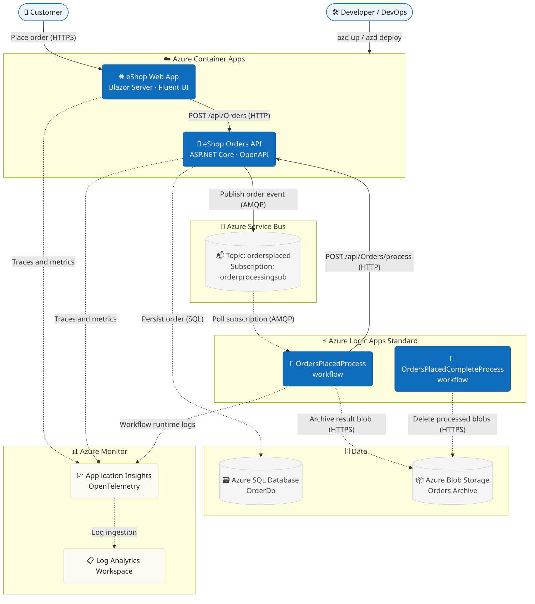

# Azure Logic Apps Monitoring


**Azure Logic Apps Monitoring** is a reference implementation that demonstrates end-to-end event-driven order processing using Azure Logic Apps Standard, with comprehensive observability powered by Azure Application Insights and Log Analytics.

Managing distributed order workflows reliably requires robust monitoring, automated error handling, and end-to-end traceability. This solution addresses those challenges by integrating Azure Service Bus for decoupled messaging, Azure Logic Apps Standard for durable workflow automation, and Azure Monitor for real-time diagnostics and structured alerting.

Built on .NET 10 with ASP.NET Core, Blazor Server, and .NET Aspire, the solution demonstrates a complete microservices pattern: a Blazor web front end, a RESTful Orders API, and two Azure Logic Apps Standard workflows — all deployed to Azure Container Apps and orchestrated via the Azure Developer CLI (`azd`).

## Table of Contents

- [Features](#features)
- [Architecture](#architecture)
- [Technologies Used](#technologies-used)
- [Quick Start](#quick-start)
- [Configuration](#configuration)
- [Deployment](#deployment)
- [Usage](#usage)
- [Contributing](#contributing)
- [License](#license)

## Features

- 📨 **Event-driven order processing** via Azure Service Bus using a topic and subscription pattern
- ⚡ **Logic Apps Standard workflows** for order validation, Orders API orchestration, and Blob Storage archiving
- 🔄 **Automated cleanup workflow** that removes successfully processed order blobs on a recurring schedule
- 📊 **Full observability** with OpenTelemetry, Azure Application Insights, and a shared Log Analytics Workspace
- 🌐 **Blazor Server frontend** built with Microsoft Fluent UI components for interactive order management
- 🔌 **RESTful Orders API** backed by Azure SQL Database with Entity Framework Core and retry resiliency
- 🏗️ **Infrastructure as Code** using Bicep modules with the Azure Developer CLI (`azd`) for one-command deployments
- 🔐 **Zero-credential security** — a User-Assigned Managed Identity authenticates all services to Azure resources
- 🧪 **Local development** with .NET Aspire orchestration, an Azure Service Bus emulator, and a SQL Server container

## Architecture

### Architecture Summary

The Azure Logic Apps Monitoring solution is an event-driven order management system. **Customers** interact with a Blazor Server web application that calls the eShop Orders REST API. The API persists orders to Azure SQL Database and publishes an order-placed event to an Azure Service Bus topic. The `OrdersPlacedProcess` Logic Apps Standard workflow polls the subscription, calls the Orders API to process each order, and archives the outcome to Azure Blob Storage. A second workflow, `OrdersPlacedCompleteProcess`, runs on a recurrence trigger every three seconds to delete successfully processed blobs. All services emit OpenTelemetry traces and metrics to Azure Application Insights, which forwards log data to a shared Log Analytics Workspace.


```mermaid
---
config:
  primaryColor: "#0f6cbd"
  primaryTextColor: "#FFFFFF"
  primaryBorderColor: "#0f548c"
  secondaryColor: "#ebf3fc"
  secondaryTextColor: "#242424"
  secondaryBorderColor: "#0f6cbd"
  tertiaryColor: "#f5f5f5"
  tertiaryTextColor: "#424242"
  tertiaryBorderColor: "#d1d1d1"
  noteBkgColor: "#fefbf4"
  noteTextColor: "#242424"
  noteBorderColor: "#f9e2ae"
  lineColor: "#616161"
  background: "#FFFFFF"
  edgeLabelBackground: "#FFFFFF"
  clusterBkg: "#fafafa"
  clusterBorder: "#e0e0e0"
  titleColor: "#242424"
  errorBkgColor: "#fdf3f4"
  errorTextColor: "#b10e1c"
  fontFamily: "'Segoe UI', Verdana, sans-serif"
  fontSize: "16px"
  align: center
  description: "High-level architecture diagram showing actors, primary flows, and major components."
---
flowchart TB

  %% ── Actors ──────────────────────────────────────────────────────────────────
  Customer(["👤 Customer"])
  DevOps(["🛠️ Developer / DevOps"])

  %% ── Azure Container Apps ─────────────────────────────────────────────────────
  subgraph ACA["☁️ Azure Container Apps"]
    WebApp("🌐 eShop Web App<br/>Blazor Server · Fluent UI")
    OrdersAPI("🔌 eShop Orders API<br/>ASP.NET Core · OpenAPI")
  end

  %% ── Messaging ────────────────────────────────────────────────────────────────
  subgraph Messaging["📨 Azure Service Bus"]
    SBTopic[("📬 Topic: ordersplaced<br/>Subscription: orderprocessingsub")]
  end

  %% ── Logic Apps ───────────────────────────────────────────────────────────────
  subgraph LogicApps["⚡ Azure Logic Apps Standard"]
    LA_Process("🔄 OrdersPlacedProcess<br/>workflow")
    LA_Cleanup("🧹 OrdersPlacedCompleteProcess<br/>workflow")
  end

  %% ── Data ─────────────────────────────────────────────────────────────────────
  subgraph DataLayer["🗄️ Data"]
    SQLDb[("🗃️ Azure SQL Database<br/>OrderDb")]
    BlobStorage[("📦 Azure Blob Storage<br/>Orders Archive")]
  end

  %% ── Monitoring ───────────────────────────────────────────────────────────────
  subgraph Monitor["📊 Azure Monitor"]
    AppInsights("📈 Application Insights<br/>OpenTelemetry")
    LogAnalytics("📋 Log Analytics Workspace")
  end

  %% ── Primary flows ────────────────────────────────────────────────────────────
  Customer -->|"Place order (HTTPS)"| WebApp
  WebApp -->|"POST /api/Orders (HTTP)"| OrdersAPI
  OrdersAPI -->|"Publish order event (AMQP)"| SBTopic
  OrdersAPI -.->|"Persist order (SQL)"| SQLDb
  SBTopic -.->|"Poll subscription (AMQP)"| LA_Process
  LA_Process -->|"POST /api/Orders/process (HTTP)"| OrdersAPI
  LA_Process -.->|"Archive result blob (HTTPS)"| BlobStorage
  LA_Cleanup -.->|"Delete processed blobs (HTTPS)"| BlobStorage
  DevOps -->|"azd up / azd deploy"| ACA

  %% ── Telemetry ────────────────────────────────────────────────────────────────
  WebApp -.->|"Traces and metrics"| AppInsights
  OrdersAPI -.->|"Traces and metrics"| AppInsights
  LA_Process -.->|"Workflow runtime logs"| AppInsights
  AppInsights -.->|"Log ingestion"| LogAnalytics

  %% ── Styles ───────────────────────────────────────────────────────────────────
  classDef actor fill:#ebf3fc,stroke:#0f6cbd,color:#242424
  classDef service fill:#0f6cbd,stroke:#0f548c,color:#FFFFFF
  classDef datastore fill:#f5f5f5,stroke:#d1d1d1,color:#424242
  classDef monitor fill:#fefbf4,stroke:#f9e2ae,color:#242424

  class Customer,DevOps actor
  class WebApp,OrdersAPI,LA_Process,LA_Cleanup service
  class SQLDb,BlobStorage,SBTopic datastore
  class AppInsights,LogAnalytics monitor
```

## Technologies Used

| Technology                        | Type                   | Purpose                                                      |
| --------------------------------- | ---------------------- | ------------------------------------------------------------ |
| .NET 10                           | Runtime                | Target framework for all .NET projects                       |
| ASP.NET Core 10                   | Framework              | Orders API HTTP server and Blazor host                       |
| Blazor Server                     | UI Framework           | Interactive server-rendered web frontend                     |
| Microsoft Fluent UI for .NET (v4) | Component Library      | Accessible UI components for the web application             |
| Entity Framework Core 10          | ORM                    | Azure SQL Database access with migrations and retry          |
| .NET Aspire (v13)                 | Orchestration          | Local development orchestration and service discovery        |
| Azure Logic Apps Standard         | Workflow Engine        | Event-driven order processing and blob cleanup workflows     |
| Azure Service Bus                 | Messaging              | Decoupled order event publishing and consumption             |
| Azure SQL Database                | Relational Database    | Persistent storage for order records                         |
| Azure Blob Storage                | Object Storage         | Archive storage for processed and error order records        |
| Azure Container Apps              | Hosting                | Container hosting for the web application and Orders API     |
| Azure Container Registry          | Container Registry     | Container image storage and distribution                     |
| Azure Application Insights        | Observability          | Distributed tracing, metrics, and OpenTelemetry export       |
| Azure Log Analytics Workspace     | Log Aggregation        | Centralised log storage and Kusto query analysis             |
| Bicep                             | Infrastructure as Code | Azure resource provisioning templates                        |
| Azure Developer CLI (`azd`)       | Developer Tooling      | End-to-end provision, build, and deploy automation           |
| OpenTelemetry                     | Telemetry Standard     | Traces, metrics, and log instrumentation across all services |
| Azure Managed Identity            | Security               | Credential-free authentication to all Azure services         |

## Quick Start

### Prerequisites

| Prerequisite                | Minimum Version | Install                                                                                |
| --------------------------- | --------------- | -------------------------------------------------------------------------------------- |
| .NET SDK                    | 10.0.100        | [Download](https://dotnet.microsoft.com/download/dotnet/10.0)                          |
| Azure Developer CLI (`azd`) | 1.11.0          | [Install](https://learn.microsoft.com/azure/developer/azure-developer-cli/install-azd) |
| Azure CLI (`az`)            | Latest          | [Install](https://learn.microsoft.com/cli/azure/install-azure-cli)                     |
| Docker Desktop              | Latest          | [Download](https://www.docker.com/products/docker-desktop)                             |
| Azure subscription          | —               | [Create free account](https://azure.microsoft.com/free)                                |

### Installation

1. Clone the repository:

   ```bash
   git clone https://github.com/Evilazaro/Azure-LogicApps-Monitoring.git
   cd Azure-LogicApps-Monitoring
   ```

2. Restore .NET dependencies:

   ```bash
   dotnet restore
   ```

3. Sign in to Azure:

   ```bash
   azd auth login
   ```

4. Run the application locally using .NET Aspire:

   ```bash
   dotnet run --project app.AppHost
   ```

> [!NOTE]
> When running locally, .NET Aspire automatically starts a Service Bus emulator and a SQL Server Docker container. No Azure subscription is required for local development.

### Minimal Working Example

After the .NET Aspire Dashboard opens in your browser, navigate to the **eShop Web App** URL listed on the Resources page. Place a test order through the web interface. The `OrdersPlacedProcess` Logic Apps workflow will consume the Service Bus message, call the Orders API, and write the outcome to Blob Storage — all visible in the Application Insights traces.

## Configuration

The application reads settings from `appsettings.json`, environment variables, and .NET user secrets. The table below describes the key configuration options for the Aspire host and the Orders API.

| Option                                  | Default              | Description                                                                             |
| --------------------------------------- | -------------------- | --------------------------------------------------------------------------------------- |
| `Azure:ResourceGroup`                   | _(empty)_            | Azure Resource Group name. Required when connecting to any live Azure resource.         |
| `Azure:ServiceBus:HostName`             | `localhost`          | Service Bus namespace hostname. Set to `localhost` to use the local emulator.           |
| `Azure:ServiceBus:TopicName`            | `ordersplaced`       | Service Bus topic name for order events.                                                |
| `Azure:ServiceBus:SubscriptionName`     | `orderprocessingsub` | Service Bus subscription the Logic App polls.                                           |
| `Azure:SqlServer:Name`                  | `OrdersDatabase`     | SQL Server name. Defaults to a local Docker container when set to `OrdersDatabase`.     |
| `Azure:SqlServer:DatabaseName`          | `OrderDb`            | Database name within the SQL Server instance.                                           |
| `Azure:ApplicationInsights:Name`        | _(empty)_            | Application Insights resource name. Required when telemetry is enabled in Azure.        |
| `Azure:TenantId`                        | _(empty)_            | Azure tenant ID for developer credential authentication (development only).             |
| `Azure:ClientId`                        | _(empty)_            | Azure client ID for developer credential authentication (development only).             |
| `APPLICATIONINSIGHTS_CONNECTION_STRING` | _(empty)_            | Application Insights connection string, injected automatically on Azure Container Apps. |

#### Example override for a live Azure Service Bus connection

```json
{
  "Azure": {
    "ResourceGroup": "rg-orders-dev-eastus",
    "ServiceBus": {
      "HostName": "my-servicebus.servicebus.windows.net",
      "TopicName": "ordersplaced",
      "SubscriptionName": "orderprocessingsub"
    }
  }
}
```

> [!IMPORTANT]
> Never store secrets such as connection strings or client secrets in `appsettings.json`. Use .NET user secrets for local development and Azure Managed Identity for all Azure deployments.

## Deployment

> [!NOTE]
> The `azd up` command provisions all Bicep infrastructure, builds and pushes container images to Azure Container Registry, deploys the Logic App workflow, and configures all managed identity role assignments in a single step.

1. Sign in to Azure:

   ```bash
   azd auth login
   ```

2. Create a new `azd` environment and set the target region:

   ```bash
   azd env new <environment-name>
   azd env set AZURE_LOCATION eastus
   ```

3. Provision infrastructure and deploy all services:

   ```bash
   azd up
   ```

   The `preprovision` hook runs `dotnet build` and `dotnet test` before provisioning. After provisioning, the `postprovision` hook seeds initial data and configures managed identity connections.

4. Generate sample orders to verify the end-to-end flow:

   ```powershell
   ./hooks/Generate-Orders.ps1
   ```

5. Deploy only application changes after the initial provision:

   ```bash
   azd deploy
   ```

6. Remove all provisioned Azure resources:

   ```bash
   azd down
   ```

> [!WARNING]
> Running `azd down` permanently deletes all provisioned Azure resources, including the Azure SQL Database and all stored data.

## Usage

### Place an Order via the Orders API

Send a `POST` request to `/api/Orders` with an `Order` JSON body:

```bash
curl -X POST https://<orders-api-url>/api/Orders \
  -H "Content-Type: application/json" \
  -d '{
    "id": "ORD-001",
    "customerId": "CUST-42",
    "deliveryAddress": "123 Main St, Redmond, WA 98052",
    "total": 49.99,
    "products": [
      {
        "id": "PROD-001",
        "orderId": "ORD-001",
        "name": "Azure T-Shirt",
        "quantity": 2,
        "price": 24.99
      }
    ]
  }'
```

Expected response (`201 Created`):

```json
{
  "id": "ORD-001",
  "customerId": "CUST-42",
  "date": "2026-04-28T00:00:00Z",
  "deliveryAddress": "123 Main St, Redmond, WA 98052",
  "total": 49.99,
  "products": [...]
}
```

After the Orders API creates the order, Azure Service Bus delivers the event to the `ordersplaced` topic. The **OrdersPlacedProcess** Logic App workflow polls the `orderprocessingsub` subscription, validates the message content type, calls `POST /api/Orders/process`, and writes the outcome blob to either `/ordersprocessedsuccessfully/` or `/ordersprocessedwitherrors/` in Azure Blob Storage.

### Generate bulk test orders

Run the included generation script to send multiple orders and observe the end-to-end flow:

```powershell
./hooks/Generate-Orders.ps1
```

### Browse the API documentation

The Orders API exposes a Swagger UI at the application root when running locally:

```
http://localhost:<port>/
```

> [!TIP]
> Open the .NET Aspire Dashboard during local development to correlate distributed traces across the Web App, Orders API, and Service Bus in a single view. The dashboard URL is printed to the terminal when the Aspire host starts.

## Contributing

Contributions are welcome. To propose a change:

1. Fork the repository.
2. Create a feature branch: `git checkout -b feature/my-improvement`.
3. Commit your changes following [Conventional Commits](https://www.conventionalcommits.org/) conventions.
4. Open a pull request against the `main` branch and describe the motivation for the change.

To report a bug or request a feature, open an issue using the GitHub issue tracker on this repository.

## License

This project is licensed under the **MIT License**. See the [LICENSE](LICENSE) file for the full license text.
