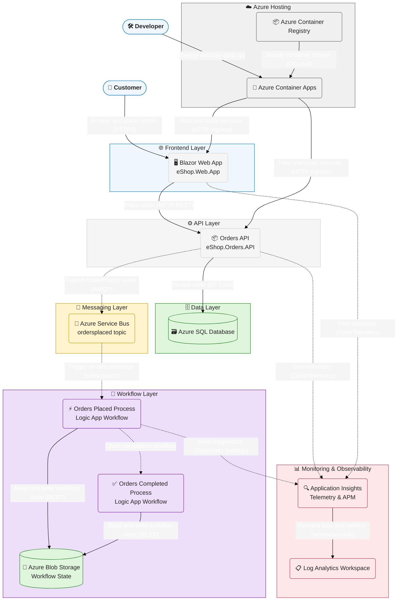

# Azure Logic Apps Monitoring

[](https://github.com/Evilazaro/Azure-LogicApps-Monitoring/actions/workflows/azure-dev.yml)
[](https://github.com/Evilazaro/Azure-LogicApps-Monitoring/actions/workflows/ci-dotnet.yml)
[](LICENSE)
[](https://dotnet.microsoft.com/download/dotnet/10.0)

## Description

**Azure Logic Apps Monitoring** is a production-ready reference implementation for building and monitoring event-driven order management systems on Azure. It combines a Blazor Server frontend, an ASP.NET Core REST API, Azure Logic Apps Standard workflows, and comprehensive observability through Application Insights and Log Analytics — all orchestrated via .NET Aspire and deployed with the Azure Developer CLI (`azd`).

The project solves the challenge of reliably processing distributed order events at scale while maintaining full observability. Customers place orders through a Blazor web application; the Orders API persists each order to Azure SQL Database and publishes an event to Azure Service Bus. Logic Apps Standard workflows then trigger automatically to process and complete each order, with workflow state stored in Azure Blob Storage — all without managing connection strings, because every service authenticates using managed identity.

Built on .NET 10, ASP.NET Core, and Blazor Server with Microsoft Fluent UI components, the solution uses .NET Aspire for local development orchestration, Azure Container Apps for production hosting, Bicep for infrastructure as code, and GitHub Actions with OpenID Connect (OIDC) for zero-secret CI/CD pipelines.

## Table of Contents

- [Description](#description)
- [Features](#features)
- [Architecture](#architecture)
- [Technologies Used](#technologies-used)
- [Quick Start](#quick-start)
- [Configuration](#configuration)
- [Deployment](#deployment)
- [Usage](#usage)
- [Contributing](#contributing)
- [License](#license)

## Features

| Feature                        | Description                                                                                                                               |
| ------------------------------ | ----------------------------------------------------------------------------------------------------------------------------------------- |
| 🛒 Order Placement             | REST API for placing single orders and batch orders, with idempotency conflict detection                                                  |
| 📨 Event-Driven Messaging      | Azure Service Bus integration publishes `OrderPlaced` events on the `ordersplaced` topic for reliable, at-least-once delivery             |
| ⚡ Logic App Workflows         | Logic Apps Standard workflows (`OrdersPlacedProcess`, `OrdersPlacedCompleteProcess`) trigger automatically from Service Bus subscriptions |
| 🔐 Passwordless Authentication | User-assigned managed identity authenticates all Azure service connections — no connection strings or secrets in code                     |
| 📊 Full Observability          | OpenTelemetry distributed tracing, custom metrics, Application Insights APM, and Log Analytics aggregation across all components          |
| 🌐 Blazor Server UI            | Interactive server-side Blazor frontend built with Microsoft Fluent UI React v9 components                                                |
| 🐳 Container Hosting           | Azure Container Apps deployment with VNet integration, private endpoints, and elastic auto-scaling                                        |
| 🏗️ Infrastructure as Code      | One-command provisioning with `azd up` using modular Bicep templates for every Azure resource                                             |
| 🔍 Health Monitoring           | Built-in `/health` and `/alive` HTTP endpoints checking database connectivity and Service Bus availability                                |
| 🧪 Automated Testing           | Unit and integration tests across all projects with Cobertura code coverage collection via Microsoft.Testing.Platform                     |

## Architecture

> [!NOTE]
> Solid arrows (`→`) represent synchronous interactions. Dashed arrows (`⇢`) represent asynchronous or event-driven interactions.


```mermaid
---
config:
  description: "High-level architecture diagram showing actors, primary flows, and major components."
  theme: base
  themeVariables:
    textColor: "#242424"
    primaryColor: "#f5f5f5"
    primaryTextColor: "#FFFFFF"
    primaryBorderColor: "#e0e0e0"
---
flowchart TB
  %% ── Actors ──────────────────────────────────────────────────────────────────
  Customer(["👤 Customer"])
  Developer(["🛠️ Developer"])

  %% ── Frontend Layer ───────────────────────────────────────────────────────────
  subgraph FE["🌐 Frontend Layer"]
    WebApp("🖥️ Blazor Web App<br/>eShop.Web.App")
  end

  %% ── API Layer ────────────────────────────────────────────────────────────────
  subgraph API["⚙️ API Layer"]
    OrdersAPI("📦 Orders API<br/>eShop.Orders.API")
  end

  %% ── Data Layer ───────────────────────────────────────────────────────────────
  subgraph Data["🗄️ Data Layer"]
    SQLDb[("🗃️ Azure SQL Database")]
  end

  %% ── Messaging Layer ──────────────────────────────────────────────────────────
  subgraph Msg["📨 Messaging Layer"]
    ServiceBus("🚌 Azure Service Bus<br/>ordersplaced topic")
  end

  %% ── Workflow Layer ───────────────────────────────────────────────────────────
  subgraph WF["🔄 Workflow Layer"]
    OrdersPlacedProc("⚡ Orders Placed Process<br/>Logic App Workflow")
    OrdersCompletedProc("✅ Orders Completed Process<br/>Logic App Workflow")
    BlobStorage[("💾 Azure Blob Storage<br/>Workflow State")]
  end

  %% ── Monitoring & Observability ───────────────────────────────────────────────
  subgraph Mon["📊 Monitoring & Observability"]
    AppInsights("🔍 Application Insights<br/>Telemetry & APM")
    LogAnalytics("📋 Log Analytics Workspace")
  end

  %% ── Hosting Layer ────────────────────────────────────────────────────────────
  subgraph Host["☁️ Azure Hosting"]
    ContainerApps("🐳 Azure Container Apps")
    ContainerRegistry("📦 Azure Container Registry")
  end

  %% ── Interactions ─────────────────────────────────────────────────────────────
  Customer -->|"Browse and place orders (HTTPS)"| WebApp
  Developer -->|"Deploy services (azd up)"| ContainerApps
  WebApp -->|"Place order (HTTP REST)"| OrdersAPI
  OrdersAPI -->|"Persist order (EF Core)"| SQLDb
  OrdersAPI -.->|"Publish OrderPlaced event (AMQP)"| ServiceBus
  ServiceBus -.->|"Trigger on new message (subscription)"| OrdersPlacedProc
  OrdersPlacedProc -.->|"Chain completion workflow"| OrdersCompletedProc
  OrdersPlacedProc -->|"Read and write workflow state (REST)"| BlobStorage
  OrdersCompletedProc -->|"Read and write workflow state (REST)"| BlobStorage
  ContainerRegistry -->|"Supply container images (OCI pull)"| ContainerApps
  ContainerApps -->|"Host and scale services (HTTP ingress)"| WebApp
  ContainerApps -->|"Host and scale services (HTTP ingress)"| OrdersAPI
  OrdersAPI -.->|"Emit telemetry (OpenTelemetry)"| AppInsights
  WebApp -.->|"Emit telemetry (OpenTelemetry)"| AppInsights
  OrdersPlacedProc -.->|"Send diagnostics (Diagnostic Settings)"| AppInsights
  AppInsights -->|"Forward logs and metrics (workspace link)"| LogAnalytics

  %% ── Subgraph styles (Fluent UI React v9 tokens) ──────────────────────────────
  style FE fill:#eff6fc,stroke:#0078d4,color:#242424
  style API fill:#f5f5f5,stroke:#d1d1d1,color:#242424
  style Data fill:#dff6dd,stroke:#107c10,color:#242424
  style Msg fill:#fff4ce,stroke:#c19c00,color:#242424
  style WF fill:#eddffa,stroke:#7719aa,color:#242424
  style Mon fill:#fde7e9,stroke:#c4314b,color:#242424
  style Host fill:#f0f0f0,stroke:#616161,color:#242424

  %% ── Node class definitions (Fluent UI React v9 tokens) ───────────────────────
  classDef actor fill:#eff6fc,stroke:#0078d4,color:#242424,font-weight:bold
  classDef component fill:#f5f5f5,stroke:#d1d1d1,color:#242424
  classDef datastore fill:#dff6dd,stroke:#107c10,color:#242424
  classDef messaging fill:#fff4ce,stroke:#c19c00,color:#242424
  classDef workflow fill:#eddffa,stroke:#7719aa,color:#242424
  classDef monitoring fill:#fde7e9,stroke:#c4314b,color:#242424
  classDef hosting fill:#f0f0f0,stroke:#616161,color:#242424

  %% ── Class assignments ────────────────────────────────────────────────────────
  class Customer,Developer actor
  class WebApp,OrdersAPI component
  class SQLDb,BlobStorage datastore
  class ServiceBus messaging
  class OrdersPlacedProc,OrdersCompletedProc workflow
  class AppInsights,LogAnalytics monitoring
  class ContainerApps,ContainerRegistry hosting
```

**Primary flow:** A customer submits an order through the Blazor Web App → the Orders API validates and persists it to Azure SQL Database → the API publishes an `OrderPlaced` event to Azure Service Bus → the `OrdersPlacedProcess` Logic App workflow triggers automatically → it chains to `OrdersPlacedCompleteProcess` to finalize the order → all components emit OpenTelemetry telemetry to Application Insights, which forwards logs and metrics to the Log Analytics Workspace.

## Technologies Used

| Technology                | Type                 | Purpose                                                             |
| ------------------------- | -------------------- | ------------------------------------------------------------------- |
| .NET 10                   | Runtime              | Core application platform, pinned via `global.json`                 |
| ASP.NET Core              | Web Framework        | Orders REST API with OpenAPI/Swagger documentation                  |
| Blazor Server             | Frontend Framework   | Interactive server-side web UI with SignalR                         |
| Microsoft Fluent UI v4.14 | UI Component Library | Consistent Microsoft design system components                       |
| Entity Framework Core 10  | ORM                  | SQL data access with automatic migrations on startup                |
| .NET Aspire 13            | Orchestration SDK    | Local development orchestration and service discovery               |
| Azure Container Apps      | PaaS Hosting         | Production container runtime with auto-scaling and VNet integration |
| Azure SQL Database        | Managed Database     | Order data persistence with Entra ID authentication                 |
| Azure Service Bus         | Messaging            | Async `OrderPlaced` event delivery via `ordersplaced` topic         |
| Azure Logic Apps Standard | Workflow Engine      | `OrdersPlacedProcess` and `OrdersPlacedCompleteProcess` workflows   |
| Azure Blob Storage        | Object Storage       | Logic App workflow state storage                                    |
| Azure Container Registry  | Image Registry       | Container image storage and distribution                            |
| Application Insights      | APM                  | Distributed tracing, custom metrics, and telemetry                  |
| Log Analytics Workspace   | Log Aggregation      | Centralized log storage and diagnostics                             |
| Azure Developer CLI (azd) | DevOps Tool          | One-command infrastructure provisioning and deployment              |
| Bicep                     | IaC Language         | Modular Azure infrastructure as code                                |
| GitHub Actions            | CI/CD                | Build, test, CodeQL scan, and deploy pipeline with OIDC             |
| OpenTelemetry             | Observability        | Distributed tracing and metrics across all services                 |

## Quick Start

### Prerequisites

| Prerequisite                | Minimum Version | Install                                                                                         |
| --------------------------- | --------------- | ----------------------------------------------------------------------------------------------- |
| .NET SDK                    | 10.0.100        | [Download](https://dotnet.microsoft.com/download/dotnet/10.0)                                   |
| Azure CLI                   | 2.60.0          | [Install guide](https://learn.microsoft.com/cli/azure/install-azure-cli)                        |
| Azure Developer CLI (`azd`) | 1.11.0          | [Install guide](https://learn.microsoft.com/azure/developer/azure-developer-cli/install-azd)    |
| Bicep CLI                   | 0.30.0          | Installed automatically by Azure CLI                                                            |
| PowerShell                  | 7.0             | [Install guide](https://learn.microsoft.com/powershell/scripting/install/installing-powershell) |
| Azure subscription          | —               | [Create free account](https://azure.microsoft.com/free/)                                        |

> [!IMPORTANT]
> Your Azure account must have **Contributor** role on the target subscription to provision infrastructure. The deployment also requires permission to assign roles (required for managed identity setup).

### Installation

1. Clone the repository and change into the project directory:

   ```bash
   git clone https://github.com/Evilazaro/Azure-LogicApps-Monitoring.git
   cd Azure-LogicApps-Monitoring
   ```

2. Sign in to Azure with the Azure Developer CLI:

   ```bash
   azd auth login
   ```

3. (Optional) Set your target environment name and Azure region:

   ```bash
   azd env new dev
   azd env set AZURE_LOCATION eastus2
   ```

4. Provision all Azure infrastructure and deploy the application in one step:

   ```bash
   azd up
   ```

   `azd up` runs the lifecycle hooks in this order: `preprovision` (validates prerequisites and runs tests) → `provision` (deploys Bicep infrastructure) → `postprovision` (configures SQL managed identity and writes `.NET` user secrets) → `predeploy` (uploads Logic App workflows) → `deploy` (builds and pushes container images).

5. After deployment, retrieve the application URL from the command output and open it in your browser.

### Minimal Example

Place a sample order against the deployed Orders API using `curl`:

```bash
# Set the API base URL from azd output
API_URL="https://<orders-api-fqdn>"

curl -s -X POST "${API_URL}/api/orders" \
  -H "Content-Type: application/json" \
  -d '{
    "id": "order-001",
    "customerId": "customer-123",
    "deliveryAddress": "123 Main St, Seattle, WA 98101",
    "total": 59.97,
    "products": [
      {
        "id": "op-001",
        "orderId": "order-001",
        "productId": "prod-001",
        "productDescription": "Azure Logo T-Shirt",
        "quantity": 3,
        "price": 19.99
      }
    ]
  }'
```

Expected response (`201 Created`):

```json
{
  "id": "order-001",
  "customerId": "customer-123",
  "date": "2026-04-28T10:00:00Z",
  "deliveryAddress": "123 Main St, Seattle, WA 98101",
  "total": 59.97,
  "products": [
    {
      "id": "op-001",
      "orderId": "order-001",
      "productId": "prod-001",
      "productDescription": "Azure Logo T-Shirt",
      "quantity": 3,
      "price": 19.99
    }
  ]
}
```

> [!TIP]
> To run the application locally with .NET Aspire, run `dotnet run --project app.AppHost` from the repository root. The Aspire dashboard starts at `https://localhost:15888` and automatically configures local Service Bus and SQL Server containers.

## Configuration

The following environment variables are set by `azd` during provisioning and consumed by the application. Use `azd env set <VARIABLE> <VALUE>` to override defaults before running `azd up`.

| Option                                  | Default              | Description                                                       |
| --------------------------------------- | -------------------- | ----------------------------------------------------------------- |
| `AZURE_LOCATION`                        | `eastus2`            | Azure region for all provisioned resources                        |
| `AZURE_ENV_NAME`                        | `dev`                | Environment label appended to resource names                      |
| `AZURE_SUBSCRIPTION_ID`                 | —                    | Azure subscription identifier (set by `azd auth login`)           |
| `AZURE_TENANT_ID`                       | —                    | Entra ID tenant identifier                                        |
| `AZURE_CLIENT_ID`                       | —                    | User-assigned managed identity client ID (set by `postprovision`) |
| `AZURE_SERVICE_BUS_TOPIC_NAME`          | `ordersplaced`       | Service Bus topic name for order events                           |
| `AZURE_SERVICE_BUS_SUBSCRIPTION_NAME`   | `orderprocessingsub` | Service Bus subscription name for Logic App trigger               |
| `AZURE_SQL_DATABASE_NAME`               | —                    | Azure SQL database name (set by `postprovision`)                  |
| `APPLICATIONINSIGHTS_CONNECTION_STRING` | —                    | Application Insights connection string (set by `postprovision`)   |
| `AZURE_CONTAINER_REGISTRY_ENDPOINT`     | —                    | Container Registry login server URL (set by `postprovision`)      |

**Example — override the deployment region and environment name:**

```bash
azd env set AZURE_LOCATION westus3
azd env set AZURE_ENV_NAME staging
azd up
```

> [!NOTE]
> The resource group naming convention is `rg-orders-{envName}-{locationAbbreviation}`. For example, `AZURE_ENV_NAME=staging` and `AZURE_LOCATION=eastus2` produce `rg-orders-staging-eus2`.

## Deployment

Follow these steps to deploy the solution to a production or staging environment on Azure.

1. **Validate prerequisites** — Run the workstation check script to confirm all required tools are installed and meet the minimum version requirements:

   ```powershell
   ./hooks/check-dev-workstation.ps1
   ```

2. **Authenticate** — Sign in with both the Azure Developer CLI and the Azure CLI:

   ```bash
   azd auth login
   az login --tenant <YOUR_TENANT_ID>
   ```

3. **Configure federated credentials** (first-time CI/CD setup only) — Run the federated credential script to register GitHub Actions OIDC trust on your Entra ID app registration:

   ```powershell
   ./hooks/configure-federated-credential.ps1
   ```

4. **Provision infrastructure** — Deploy all Azure resources defined in `infra/main.bicep`:

   ```bash
   azd provision
   ```

   This creates the resource group, VNet, managed identity, SQL Server, Service Bus, Container Registry, Container Apps Environment, Logic Apps Standard instance, Application Insights, and Log Analytics Workspace.

5. **Deploy the application** — Build container images, push them to Azure Container Registry, and update the Container Apps revisions:

   ```bash
   azd deploy
   ```

6. **Set up the CI/CD pipeline** — Configure GitHub Actions with the required repository variables and enable the `azure-dev.yml` workflow:

   ```bash
   azd pipeline config
   ```

   Set the following repository variables in GitHub: `AZURE_CLIENT_ID`, `AZURE_TENANT_ID`, `AZURE_SUBSCRIPTION_ID`. The workflow uses OIDC — no passwords or secrets are stored.

7. **Generate sample data** (optional) — Run the order generation script to populate the database with test orders:

   ```powershell
   ./hooks/Generate-Orders.ps1
   ```

> [!WARNING]
> Running `azd down` deletes all provisioned Azure resources including the SQL database. This action is irreversible. The `postinfradelete` hook cleans up any remaining user secrets.

## Usage

### Place a single order

Submit a new order to the Orders API. The API validates the payload, persists the order to Azure SQL Database, and publishes an `OrderPlaced` event to Service Bus.

```bash
curl -s -X POST "https://<orders-api-fqdn>/api/orders" \
  -H "Content-Type: application/json" \
  -d '{
    "id": "order-abc-123",
    "customerId": "cust-456",
    "deliveryAddress": "1 Microsoft Way, Redmond, WA 98052",
    "total": 29.99,
    "products": [
      {
        "id": "op-001",
        "orderId": "order-abc-123",
        "productId": "sku-789",
        "productDescription": "Surface Laptop Sleeve",
        "quantity": 1,
        "price": 29.99
      }
    ]
  }'
# HTTP 201 Created — order persisted and OrderPlaced event published to Service Bus
```

### Retrieve all orders

```bash
curl -s "https://<orders-api-fqdn>/api/orders"
# HTTP 200 OK — returns a JSON array of all orders
```

### Retrieve a specific order

```bash
curl -s "https://<orders-api-fqdn>/api/orders/order-abc-123"
# HTTP 200 OK — returns the order JSON object
# HTTP 404 Not Found — if the order ID does not exist
```

### Place a batch of orders

Submit multiple orders in a single request. Each order is validated and persisted independently; the API returns a summary result for the batch.

```bash
curl -s -X POST "https://<orders-api-fqdn>/api/orders/batch" \
  -H "Content-Type: application/json" \
  -d '[
    {
      "id": "batch-order-001",
      "customerId": "cust-100",
      "deliveryAddress": "456 Oak Ave, Portland, OR 97201",
      "total": 15.00,
      "products": [
        {
          "id": "bp-001",
          "orderId": "batch-order-001",
          "productId": "sku-001",
          "productDescription": "Azure Sticker Pack",
          "quantity": 3,
          "price": 5.00
        }
      ]
    }
  ]'
# HTTP 200 OK — batch processing summary returned
```

### Delete an order

```bash
curl -s -X DELETE "https://<orders-api-fqdn>/api/orders/order-abc-123"
# HTTP 204 No Content — order removed from the database
# HTTP 404 Not Found — if the order ID does not exist
```

### Access the Swagger UI

Open the API's interactive documentation in a browser:

```
https://<orders-api-fqdn>/
```

> [!TIP]
> The Blazor Web App provides a graphical interface for order management. After running `azd up`, the web application URL is printed to the terminal. Open it in a browser to place orders without using `curl`.

For Entity Framework migration guidance, see [src/eShop.Orders.API/MIGRATION_GUIDE.md](src/eShop.Orders.API/MIGRATION_GUIDE.md).

## Contributing

Contributions are welcome. To propose a change, follow these steps:

1. **Open an issue** — Before starting work on a significant change, open a [GitHub issue](https://github.com/Evilazaro/Azure-LogicApps-Monitoring/issues) to describe the problem or improvement. This avoids duplicate effort and allows maintainers to provide early feedback.

2. **Fork the repository** — Click **Fork** on GitHub and clone your fork locally:

   ```bash
   git clone https://github.com/<your-username>/Azure-LogicApps-Monitoring.git
   ```

3. **Create a branch** — Use a descriptive branch name tied to the issue:

   ```bash
   git checkout -b fix/issue-42-service-bus-retry
   ```

4. **Make your changes** — Follow the existing coding conventions. Run the full test suite before committing:

   ```bash
   dotnet test --configuration Debug
   ```

5. **Submit a pull request** — Open a pull request against the `main` branch. Reference the issue number in the PR description (e.g., `Closes #42`). The CI pipeline (`ci-dotnet.yml`) runs build, test, and CodeQL analysis automatically.

> [!NOTE]
> All commits must pass the CodeQL security analysis and all unit tests before a pull request can be merged.

## License

This project is licensed under the **MIT License**. See the [LICENSE](LICENSE) file for the full license text.
