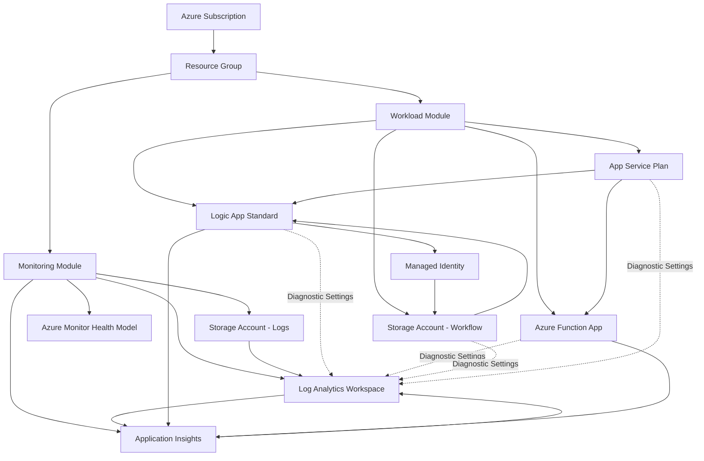
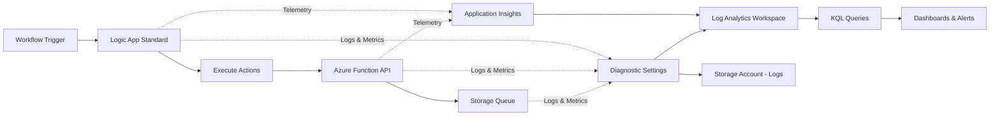

Collecting workspace information# Azure Logic Apps Monitoring

[](https://opensource.org/licenses/MIT)
[](https://azure.microsoft.com/en-us/products/logic-apps)
[](https://learn.microsoft.com/en-us/azure/azure-resource-manager/bicep/)

A production-ready Infrastructure as Code (IaC) solution demonstrating Azure Monitor best practices for Logic Apps Standard. This project provides comprehensive observability patterns for enterprise workflow orchestration using Bicep templates, Application Insights, Log Analytics, and Azure Storage.

## 📋 Project Overview

This open-source project showcases how to implement robust monitoring and observability for Azure Logic Apps Standard environments. It addresses common challenges in enterprise workflow monitoring by providing:

- **Complete Infrastructure as Code**: Bicep templates for all monitoring resources
- **Integrated Observability**: Application Insights, Log Analytics, and diagnostic settings
- **Enterprise-Ready Patterns**: Storage account management, RBAC configuration, and health modeling
- **Best Practice Implementation**: Follows Microsoft's recommended monitoring architecture

### Why This Matters

Logic Apps Standard workflows require sophisticated monitoring to ensure reliability, performance, and compliance. This solution eliminates the complexity of setting up monitoring infrastructure from scratch, providing a tested, production-ready foundation.

## 👥 Target Audience

| Role | Responsibilities | How to Leverage the Solution | Benefits |
|------|-----------------|------------------------------|----------|
| **Cloud Solution Architect** | Design scalable Azure solutions | Use as reference architecture for Logic Apps monitoring design | Pre-validated monitoring patterns, reduced design time, compliance-ready architecture |
| **DevOps Engineer** | Automate infrastructure deployment | Deploy using provided Bicep templates and Azure Developer CLI | Faster deployment cycles, consistent environments, automated monitoring setup |
| **Application Developer** | Build and maintain Logic Apps workflows | Integrate application telemetry with monitoring infrastructure | Enhanced debugging capabilities, performance insights, proactive issue detection |
| **Platform Engineer** | Manage Azure platform services | Customize monitoring templates for organizational standards | Standardized monitoring across teams, centralized observability, cost optimization |
| **Site Reliability Engineer (SRE)** | Ensure system reliability and uptime | Implement alerting and dashboards using collected telemetry | Improved MTTR, proactive incident response, comprehensive SLO tracking |

## ✨ Features

### Feature Overview

| Feature | Purpose | Benefit |
|---------|---------|---------|
| **Application Insights Integration** | Workspace-based telemetry collection | Unified observability with correlated logs and metrics |
| **Log Analytics Workspace** | Centralized log aggregation | Advanced querying with KQL, long-term retention, cross-resource analytics |
| **Diagnostic Settings Automation** | Automatic log and metric collection | Complete visibility into workflow execution, performance monitoring |
| **Storage Account Management** | Dedicated storage for logs and workflow state | Cost-effective retention, compliance support, audit trails |
| **RBAC with Managed Identity** | Secure, keyless authentication | Enhanced security posture, simplified credential management |
| **Azure Function APIs** | Backend services for workflows | Modular architecture, independent scaling, reusable components |
| **Multi-Environment Support** | Dev, UAT, and Prod configurations | Consistent deployment patterns, environment isolation |

### Solution Comparison

| Aspect | Project Solution | Default Azure Monitor |
|--------|------------------|----------------------|
| **Deployment** | Fully automated via Bicep templates | Manual portal configuration required |
| **Observability** | Integrated Application Insights + Log Analytics | Basic metrics only |
| **Diagnostic Settings** | Pre-configured for all resources | Must be configured individually |
| **Storage Management** | Automated lifecycle policies | Manual retention management |
| **RBAC Configuration** | Managed identity with least-privilege roles | Requires manual setup |
| **Customization** | Template-based, version-controlled | Portal-based changes |
| **Multi-Resource Monitoring** | Correlated telemetry across Logic Apps, Functions, Storage | Siloed monitoring per resource |

### Diagnostic Settings

Diagnostic Settings are Azure's mechanism for collecting platform logs and metrics from resources. They route telemetry data to destinations like Log Analytics workspaces and Storage Accounts for analysis, alerting, and compliance.

#### Why Diagnostic Settings Matter

Without diagnostic settings, you lose visibility into:
- Workflow execution details and failures
- Performance bottlenecks and latency
- Security events and access patterns
- Resource utilization and cost optimization opportunities

#### Diagnostic Settings Collection

| Metrics | Metrics Description | Logs | Logs Description | Monitoring Improvement |
|---------|-------------------|------|-----------------|----------------------|
| **RunsStarted** | Number of workflow runs initiated | **WorkflowRuntime** | Workflow execution lifecycle events | Track workflow throughput and identify execution patterns |
| **RunsCompleted** | Successfully completed workflow runs | **FunctionExecutionLogs** | Function app execution details | Measure success rates and operational health |
| **RunsFailed** | Failed workflow run count | **AppServiceConsoleLogs** | Application-level diagnostic output | Proactive failure detection and root cause analysis |
| **RunsSucceeded** | Successful run rate | **AppServiceHTTPLogs** | HTTP request/response logs | Performance optimization and SLA monitoring |
| **RunLatency** | Average workflow execution time | **AppServiceAuditLogs** | Security and access audit events | Performance tuning and bottleneck identification |
| **StorageTransactions** | Storage account operation metrics | **StorageRead/Write** | Blob/Queue/Table operation logs | Cost optimization and capacity planning |
| **ActionLatency** | Individual action execution time | **TriggerExecutionHistory** | Workflow trigger event logs | Identify slow actions and optimize workflow logic |
| **TriggerThrottledEvents** | Throttling event count | **ConnectorLogs** | API connection diagnostics | Prevent rate limiting and improve reliability |

**Example Impact**: Enabling `WorkflowRuntime` logs allows you to query execution history with KQL, trace failures to specific actions, and correlate issues across Logic Apps and dependent services.

## 🏗️ Architecture


```mermaid
graph TD
    A[Azure Subscription] --> B[Resource Group]
    B --> C[Monitoring Module]
    B --> D[Workload Module]
    
    C --> E[Log Analytics Workspace]
    C --> F[Application Insights]
    C --> G[Storage Account - Logs]
    C --> H[Azure Monitor Health Model]
    
    D --> I[Logic App Standard]
    D --> J[Azure Function App]
    D --> K[Storage Account - Workflow]
    D --> L[App Service Plan]
    
    E --> F
    G --> E
    F --> E
    
    I --> F
    J --> F
    K --> I
    L --> I
    L --> J
    
    I -.Diagnostic Settings.-> E
    J -.Diagnostic Settings.-> E
    K -.Diagnostic Settings.-> E
    L -.Diagnostic Settings.-> E
    
    M[Managed Identity] --> K
    I --> M
```

## 🔄 Dataflow


```mermaid
flowchart LR
    A[Workflow Trigger] --> B[Logic App Standard]
    B --> C[Execute Actions]
    C --> D[Azure Function API]
    D --> E[Storage Queue]
    
    B -.Telemetry.-> F[Application Insights]
    D -.Telemetry.-> F
    
    F --> G[Log Analytics Workspace]
    
    B -.Logs & Metrics.-> H[Diagnostic Settings]
    D -.Logs & Metrics.-> H
    E -.Logs & Metrics.-> H
    
    H --> G
    H --> I[Storage Account - Logs]
    
    G --> J[KQL Queries]
    J --> K[Dashboards & Alerts]
```

## 📦 Prerequisites

### Tools

- [Azure Developer CLI (azd)](https://learn.microsoft.com/en-us/azure/developer/azure-developer-cli/install-azd) v1.5.0+
- [Azure CLI](https://learn.microsoft.com/en-us/cli/azure/install-azure-cli) v2.50.0+
- [Visual Studio Code](https://code.visualstudio.com/) with extensions:
  - [Azure Logic Apps (Standard)](https://marketplace.visualstudio.com/items?itemName=ms-azuretools.vscode-azurelogicapps)
  - [Bicep](https://marketplace.visualstudio.com/items?itemName=ms-azuretools.vscode-bicep)

### Azure Resources

- Active Azure subscription
- Sufficient quota for:
  - Logic Apps Standard (Workflow Standard SKU)
  - App Service Plan (Premium V3 or Workflow Standard)
  - Storage Accounts (Standard_LRS)
  - Log Analytics Workspace

### RBAC Roles

| Role | Description | Documentation Link |
|------|-------------|-------------------|
| **Contributor** | Deploy and manage Azure resources | [Built-in roles](https://learn.microsoft.com/en-us/azure/role-based-access-control/built-in-roles#contributor) |
| **Storage Blob Data Owner** | Full access to blob containers and data | [Storage roles](https://learn.microsoft.com/en-us/azure/role-based-access-control/built-in-roles#storage-blob-data-owner) |
| **Storage Queue Data Contributor** | Read, write, and delete queue messages | [Storage roles](https://learn.microsoft.com/en-us/azure/role-based-access-control/built-in-roles#storage-queue-data-contributor) |
| **Monitoring Contributor** | Configure diagnostic settings | [Monitoring roles](https://learn.microsoft.com/en-us/azure/role-based-access-control/built-in-roles#monitoring-contributor) |

### Dependencies

- .NET 9.0 SDK (for Azure Functions)
- Node.js 18.x+ (for Logic Apps designer)

## 🚀 Installation & Deployment

### 1. Clone the Repository

```bash
git clone https://github.com/yourusername/Azure-LogicApps-Monitoring.git
cd Azure-LogicApps-Monitoring
```

### 2. Initialize Azure Developer CLI

```bash
azd init
```

When prompted, select the existing environment or create a new one.

### 3. Set Environment Variables

```bash
# Set your Azure location
azd env set AZURE_LOCATION eastus

# Set environment name (dev, uat, or prod)
azd env set AZURE_ENV_NAME dev
```

### 4. Provision Infrastructure

```bash
azd provision
```

This command:
- Creates the resource group
- Deploys monitoring infrastructure (Log Analytics, Application Insights)
- Deploys workload resources (Logic Apps, Functions, Storage)
- Configures diagnostic settings and RBAC

### 5. Deploy Application Code

```bash
azd deploy
```

### 6. Verify Deployment

```bash
# List deployed resources
az resource list --resource-group contoso-tax-docs-dev-eastus-rg --output table

# Get Logic App URL
az logicapp show --name <logic-app-name> --resource-group <resource-group> --query defaultHostName -o tsv
```

## 📊 Usage Examples

### Example 1: Monitor Workflow Run Success Rate

**Purpose**: Track the percentage of successful workflow executions over time.

```kql
AzureDiagnostics
| where ResourceProvider == "MICROSOFT.WEB"
| where Category == "WorkflowRuntime"
| where OperationName == "Microsoft.Logic/workflows/workflowRunCompleted"
| summarize 
    Total = count(),
    Succeeded = countif(status_s == "Succeeded"),
    Failed = countif(status_s == "Failed")
    by bin(TimeGenerated, 1h)
| extend SuccessRate = round((Succeeded * 100.0) / Total, 2)
| project TimeGenerated, Total, Succeeded, Failed, SuccessRate
| order by TimeGenerated desc
```

**Sample Output**:

| TimeGenerated | Total | Succeeded | Failed | SuccessRate |
|---------------|-------|-----------|--------|-------------|
| 2024-01-15 14:00 | 245 | 238 | 7 | 97.14 |
| 2024-01-15 13:00 | 312 | 305 | 7 | 97.76 |

**Reference**: [Monitor Logic Apps - Run History](https://learn.microsoft.com/en-us/azure/logic-apps/monitor-logic-apps)

---

### Example 2: Identify Slowest Workflow Actions

**Purpose**: Find actions causing performance bottlenecks.

```kql
AzureDiagnostics
| where ResourceProvider == "MICROSOFT.WEB"
| where Category == "WorkflowRuntime"
| where OperationName == "Microsoft.Logic/workflows/workflowActionCompleted"
| extend ActionName = tostring(split(resource_actionName_s, "/")[1])
| summarize 
    AvgDuration = avg(todouble(resource_duration_d)),
    MaxDuration = max(todouble(resource_duration_d)),
    Count = count()
    by ActionName
| where Count > 10
| order by AvgDuration desc
| take 10
```

**Sample Output**:

| ActionName | AvgDuration (ms) | MaxDuration (ms) | Count |
|------------|-----------------|------------------|-------|
| CallExternalAPI | 1842.5 | 4523.2 | 156 |
| ProcessTaxDocument | 987.3 | 2134.1 | 203 |

**Reference**: [Analyze Logic Apps performance](https://learn.microsoft.com/en-us/azure/logic-apps/monitor-logic-apps-log-analytics)

---

### Example 3: Track Storage Queue Message Processing

**Purpose**: Monitor queue depth and processing throughput.

```kql
StorageQueueLogs
| where AccountName == "workflowstorageaccount"
| where OperationName == "GetMessages" or OperationName == "DeleteMessage"
| summarize 
    Retrieved = countif(OperationName == "GetMessages"),
    Processed = countif(OperationName == "DeleteMessage")
    by bin(TimeGenerated, 5m)
| extend QueueDepthChange = Retrieved - Processed
| project TimeGenerated, Retrieved, Processed, QueueDepthChange
```

**Sample Output**:

| TimeGenerated | Retrieved | Processed | QueueDepthChange |
|---------------|-----------|-----------|------------------|
| 2024-01-15 14:05 | 45 | 42 | +3 |
| 2024-01-15 14:00 | 38 | 40 | -2 |

**Reference**: [Monitor Azure Storage](https://learn.microsoft.com/en-us/azure/storage/common/monitor-storage)

---

### Example 4: Detect Failed Function Executions

**Purpose**: Identify and troubleshoot Azure Function failures.

```kql
AppTraces
| where AppRoleName contains "api"
| where SeverityLevel >= 3 // Warning and above
| project 
    TimeGenerated,
    Message,
    SeverityLevel,
    OperationName,
    Properties
| order by TimeGenerated desc
| take 50
```

**Sample Output**:

| TimeGenerated | Message | SeverityLevel | OperationName |
|---------------|---------|---------------|---------------|
| 2024-01-15 14:23 | Connection timeout to external API | 3 | ProcessTaxRequest |

**Reference**: [Monitor Azure Functions](https://learn.microsoft.com/en-us/azure/azure-functions/functions-monitoring)

---

### Example 5: Cost Analysis - Storage Transactions

**Purpose**: Analyze storage costs by operation type.

```kql
AzureMetrics
| where ResourceProvider == "MICROSOFT.STORAGE"
| where MetricName == "Transactions"
| summarize TotalTransactions = sum(Total) by ApiName, bin(TimeGenerated, 1d)
| order by TotalTransactions desc
```

**Sample Output**:

| ApiName | TimeGenerated | TotalTransactions |
|---------|---------------|-------------------|
| PutBlob | 2024-01-15 | 12,453 |
| GetBlob | 2024-01-15 | 8,921 |

**Reference**: [Optimize storage costs](https://learn.microsoft.com/en-us/azure/storage/common/storage-plan-manage-costs)

## 📄 License Information

This project is licensed under the **MIT License**.

```
MIT License

Copyright (c) 2024 Azure Logic Apps Monitoring Contributors

Permission is hereby granted, free of charge, to any person obtaining a copy
of this software and associated documentation files (the "Software"), to deal
in the Software without restriction, including without limitation the rights
to use, copy, modify, merge, publish, distribute, sublicense, and/or sell
copies of the Software, and to permit persons to whom the Software is
furnished to do so, subject to the following conditions:

The above copyright notice and this permission notice shall be included in all
copies or substantial portions of the Software.

THE SOFTWARE IS PROVIDED "AS IS", WITHOUT WARRANTY OF ANY KIND, EXPRESS OR
IMPLIED, INCLUDING BUT NOT LIMITED TO THE WARRANTIES OF MERCHANTABILITY,
FITNESS FOR A PARTICULAR PURPOSE AND NONINFRINGEMENT. IN NO EVENT SHALL THE
AUTHORS OR COPYRIGHT HOLDERS BE LIABLE FOR ANY CLAIM, DAMAGES OR OTHER
LIABILITY, WHETHER IN AN ACTION OF CONTRACT, TORT OR OTHERWISE, ARISING FROM,
OUT OF OR IN CONNECTION WITH THE SOFTWARE OR THE USE OR OTHER DEALINGS IN THE
SOFTWARE.
```

See LICENSE.md for full license text.

## 🔗 References

### Microsoft Documentation

- [Monitor Logic Apps - Azure Logic Apps](https://learn.microsoft.com/en-us/azure/logic-apps/monitor-logic-apps)
- [Azure Monitor overview](https://learn.microsoft.com/en-us/azure/azure-monitor/overview)
- [Bicep documentation](https://learn.microsoft.com/en-us/azure/azure-resource-manager/bicep/)
- [Application Insights overview](https://learn.microsoft.com/en-us/azure/azure-monitor/app/app-insights-overview)
- [Log Analytics workspace overview](https://learn.microsoft.com/en-us/azure/azure-monitor/logs/log-analytics-workspace-overview)

### GitHub Resources

- [README Best Practices](https://github.com/matiassingers/awesome-readme)
- [Open Source Guides](https://opensource.guide/)
- [Azure Samples Repository](https://github.com/Azure-Samples)

### Tools & SDKs

- [Azure Developer CLI](https://learn.microsoft.com/en-us/azure/developer/azure-developer-cli/)
- [Azure CLI Reference](https://learn.microsoft.com/en-us/cli/azure/)
- [VS Code Azure Extensions](https://marketplace.visualstudio.com/azuretools)

---

## 🤝 Contributing

Contributions are welcome! Please read CONTRIBUTING.md for guidelines on submitting pull requests, reporting issues, and code of conduct.

## 🛡️ Security

For security vulnerabilities, please review SECURITY.md for our responsible disclosure policy.

---

**Built with ❤️ for the Azure community**

Similar code found with 2 license types