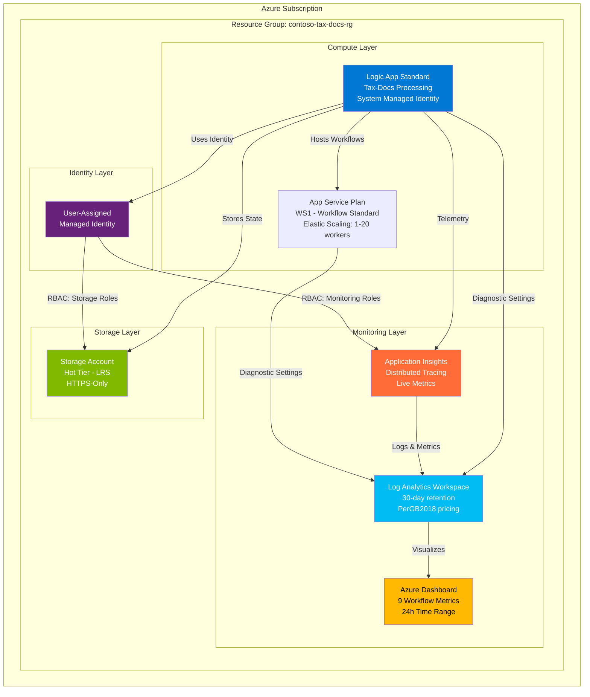

# Azure Logic Apps Monitoring

[](LICENSE.md)
[](CONTRIBUTING.md)
[](CODE_OF_CONDUCT.md)
[](https://azure.microsoft.com/services/logic-apps/)

> A comprehensive reference implementation demonstrating enterprise-grade monitoring and observability for Azure Logic Apps (Standard) using Azure Monitor, Application Insights, and Log Analytics.

## 📋 Table of Contents

- [Overview](#overview)
- [Features](#features)
- [Solution Architecture](#solution-architecture)
- [Getting Started](#getting-started)
  - [Prerequisites](#prerequisites)
  - [Installation](#installation)
  - [Configuration](#configuration)
  - [First Run](#first-run)
- [Usage & Examples](#usage--examples)
  - [Deploying the Infrastructure](#deploying-the-infrastructure)
  - [Viewing Metrics and Logs](#viewing-metrics-and-logs)
  - [Custom Dashboards](#custom-dashboards)
  - [Querying Logs](#querying-logs)
- [Monitoring Capabilities](#monitoring-capabilities)
- [Advanced Topics](#advanced-topics)
  - [Performance Tuning](#performance-tuning)
  - [Custom Alerts](#custom-alerts)
  - [Diagnostic Queries](#diagnostic-queries)
- [Troubleshooting](#troubleshooting)
- [Roadmap & Status](#roadmap--status)
- [Contributing](#contributing)
- [Security](#security)
- [Code of Conduct](#code-of-conduct)
- [Support](#support)
- [License](#license)

## Overview

**Azure Logic Apps Monitoring** is an open-source infrastructure-as-code (IaC) solution that demonstrates how to deploy and monitor Azure Logic Apps (Standard) with comprehensive observability capabilities. This project provides a production-ready template for organizations seeking to implement robust monitoring for their workflow automation solutions.

**Key Value Propositions:**
- ✅ **Production-Ready**: Enterprise-grade monitoring configured out-of-the-box
- ✅ **Infrastructure as Code**: Fully automated deployment using Azure Bicep
- ✅ **Security First**: Managed identities, RBAC, and least-privilege access
- ✅ **Cost-Optimized**: Right-sized resources with configurable retention policies
- ✅ **Well-Architected**: Follows Azure Well-Architected Framework principles

**Use Cases:**
- Tax document processing workflows (sample scenario)
- Event-driven business process automation
- Integration patterns requiring end-to-end observability
- Enterprise workflow monitoring and alerting
- Compliance and audit logging requirements

## Features

- **📊 Comprehensive Monitoring**: Pre-configured dashboards tracking workflow runs, actions, triggers, and execution duration
- **🔍 Distributed Tracing**: Application Insights integration for end-to-end request correlation
- **📝 Centralized Logging**: Log Analytics workspace with 30-day retention for queryable logs and metrics
- **🔐 Secure by Default**: Managed identities (system and user-assigned) for password-less authentication
- **🏗️ Infrastructure as Code**: Modular Bicep templates for repeatable deployments
- **📈 Custom Dashboards**: Pre-built Azure Portal dashboards with 9 workflow metric tiles
- **🔒 RBAC Integration**: Least-privilege role assignments for storage, monitoring, and workflow resources
- **⚡ Auto-Scaling**: Elastic App Service Plan with configurable worker count (1-20)
- **🌍 Multi-Region Ready**: Location-agnostic deployment parameters

## Solution Architecture

The solution deploys a complete monitoring stack for Azure Logic Apps, consisting of:


```mermaid
graph TB
    subgraph "Azure Subscription"
        subgraph "Resource Group: contoso-tax-docs-rg"
            subgraph "Compute Layer"
                ASP[App Service Plan<br/>WS1 - Workflow Standard<br/>Elastic Scaling: 1-20 workers]
                LA[Logic App Standard<br/>Tax-Docs Processing<br/>System Managed Identity]
            end
            
            subgraph "Storage Layer"
                SA[Storage Account<br/>Hot Tier - LRS<br/>HTTPS-Only]
            end
            
            subgraph "Monitoring Layer"
                LAW[Log Analytics Workspace<br/>30-day retention<br/>PerGB2018 pricing]
                AI[Application Insights<br/>Distributed Tracing<br/>Live Metrics]
                DASH[Azure Dashboard<br/>9 Workflow Metrics<br/>24h Time Range]
            end
            
            subgraph "Identity Layer"
                UMI[User-Assigned<br/>Managed Identity]
            end
        end
    end
    
    LA -->|Hosts Workflows| ASP
    LA -->|Stores State| SA
    LA -->|Diagnostic Settings| LAW
    LA -->|Telemetry| AI
    AI -->|Logs & Metrics| LAW
    ASP -->|Diagnostic Settings| LAW
    LAW -->|Visualizes| DASH
    UMI -->|RBAC: Storage Roles| SA
    UMI -->|RBAC: Monitoring Roles| AI
    LA -->|Uses Identity| UMI
    
    style LA fill:#0078D4,color:#fff
    style AI fill:#FF6C37,color:#fff
    style LAW fill:#00BCF2,color:#fff
    style SA fill:#7FBA00,color:#fff
    style DASH fill:#FFB900,color:#000
    style UMI fill:#68217A,color:#fff
```

**Architecture Components:**

| Component | Purpose | Key Features |
|-----------|---------|--------------|
| **Logic App (Standard)** | Workflow execution engine | System-assigned identity, Application Insights integration |
| **App Service Plan (WS1)** | Compute hosting | Elastic scaling (1-20 workers), zone-redundant capable |
| **Storage Account** | Workflow state persistence | Hot tier, HTTPS-only, managed identity access |
| **Log Analytics Workspace** | Centralized log aggregation | 30-day retention, KQL query support |
| **Application Insights** | APM and distributed tracing | Connection string auth, live metrics |
| **Azure Dashboard** | Metrics visualization | 9 pre-configured tiles, 24h default range |
| **User-Assigned Managed Identity** | Security principal | RBAC roles on storage and monitoring |

**Data Flow:**
1. Logic App workflows execute on the App Service Plan
2. Workflow state persists to the Storage Account via managed identity
3. Diagnostic settings stream logs and metrics to Log Analytics
4. Application Insights captures telemetry and traces
5. Azure Dashboard visualizes metrics from Logic App and App Service Plan
6. All resources tagged for cost tracking and governance

## Getting Started

### Prerequisites

Ensure you have the following tools and access:

**Required:**
- **Azure CLI** (`2.50.0` or later): [Installation Guide](https://learn.microsoft.com/cli/azure/install-azure-cli)
- **Azure Developer CLI (azd)** (`1.5.0` or later): [Installation Guide](https://learn.microsoft.com/azure/developer/azure-developer-cli/install-azd)
- **Active Azure Subscription**: [Create a free account](https://azure.microsoft.com/free/)
- **Azure Permissions**: `Contributor` or `Owner` role on target subscription

**Optional (Recommended):**
- **Visual Studio Code**: [Download](https://code.visualstudio.com/)
- **Azure Logic Apps Extension**: [Marketplace Link](https://marketplace.visualstudio.com/items?itemName=ms-azuretools.vscode-logicapps)
- **Bicep Extension**: [Marketplace Link](https://marketplace.visualstudio.com/items?itemName=ms-azuretools.vscode-bicep)
- **Git**: For version control

**Verify Installation:**

```bash
# Check Azure CLI version
az --version

# Check Azure Developer CLI version
azd version

# Verify Azure subscription access
az account show
```

### Installation

1. **Clone the repository**:

```bash
git clone https://github.com/your-org/Azure-LogicApps-Monitoring.git
cd Azure-LogicApps-Monitoring
```

2. **Authenticate with Azure**:

```bash
# Azure CLI authentication
az login

# Azure Developer CLI authentication
azd auth login
```

3. **Set your target Azure subscription** (if you have multiple subscriptions):

```bash
# List available subscriptions
az account list --output table

# Set active subscription
az account set --subscription "<Your-Subscription-ID-or-Name>"

# Verify selection
az account show --query "{Name:name, ID:id, TenantID:tenantId}" --output table
```

### Configuration

1. **Review deployment parameters** in [`infra/main.parameters.json`](infra/main.parameters.json):

```json
{
  "$schema": "https://schema.management.azure.com/schemas/2015-01-01/deploymentParameters.json#",
  "contentVersion": "1.0.0.0",
  "parameters": {
    "location": {
      "value": "eastus"
    }
  }
}
```

**Supported Regions**: `eastus`, `westus2`, `westeurope`, `southeastasia`, `australiaeast`, `centralus`

2. **Customize resource tags** in [`infra/main.bicep`](infra/main.bicep):

```bicep
var tags = {
  Solution: 'tax-docs'
  Environment: 'Production'          // Change to 'Development', 'Staging', etc.
  ManagedBy: 'Bicep'
  CostCenter: 'Engineering'          // Update with your cost center
  Owner: 'Platform-Team'             // Update with your team name
  ApplicationName: 'Tax-Docs-Processing'
  BusinessUnit: 'Tax'
}
```

3. **Optional: Modify solution name** in [`infra/main.bicep`](infra/main.bicep):

```bicep
param solutionName string = 'tax-docs'  // Change to your solution name
```

### First Run

Deploy the complete infrastructure using Azure Developer CLI:

```bash
# Initialize the azd environment (one-time setup)
azd init

# Provision all Azure resources
azd provision

# Expected output:
# ✓ Resource group created: contoso-tax-docs-rg
# ✓ User-assigned managed identity deployed
# ✓ Storage account created with RBAC roles
# ✓ Log Analytics workspace provisioned
# ✓ Application Insights configured
# ✓ App Service Plan (WS1) deployed
# ✓ Logic App (Standard) created
# ✓ Diagnostic settings applied
# ✓ Azure Dashboard deployed
#
# Deployment Time: ~5-7 minutes
```

**Alternative: Manual deployment with Azure CLI**:

```bash
# Create resource group
az group create \
  --name contoso-tax-docs-rg \
  --location eastus \
  --tags Solution=tax-docs Environment=Production

# Deploy Bicep template
az deployment group create \
  --resource-group contoso-tax-docs-rg \
  --template-file infra/main.bicep \
  --parameters @infra/main.parameters.json \
  --name InitialDeployment

# Monitor deployment progress
az deployment group show \
  --resource-group contoso-tax-docs-rg \
  --name InitialDeployment \
  --query "properties.provisioningState"
```

**Verify Deployment:**

```bash
# List deployed resources
az resource list \
  --resource-group contoso-tax-docs-rg \
  --output table

# Get Logic App details
az logicapp show \
  --resource-group contoso-tax-docs-rg \
  --name $(az resource list --resource-group contoso-tax-docs-rg --resource-type "Microsoft.Web/sites" --query "[0].name" -o tsv) \
  --output table
```

## Usage & Examples

### Deploying the Infrastructure

**Full Stack Deployment (Recommended):**

```bash
# Using Azure Developer CLI
azd up

# This single command:
# 1. Provisions infrastructure (azd provision)
# 2. Deploys application code (if present)
# 3. Configures monitoring
```

**Incremental Updates:**

```bash
# Update only infrastructure
azd provision

# Force re-deployment
azd provision --force
```

**Infrastructure-Only Deployment:**

```bash
# Using Azure CLI with Bicep
az deployment group create \
  --resource-group contoso-tax-docs-rg \
  --template-file infra/main.bicep \
  --parameters location=eastus \
  --mode Incremental
```

### Viewing Metrics and Logs

#### Azure Portal Navigation

1. **Open the Logic App**:
   - Navigate to: [Azure Portal](https://portal.azure.com) → Resource Groups → `contoso-tax-docs-rg`
   - Select: `tax-docs-*-logicapp`
   - View: Overview, Workflow runs, Metrics

2. **Access Pre-Configured Dashboard**:
   - Navigate to: Resource Groups → `contoso-tax-docs-rg` → Dashboards
   - Open: `tax-docs-dashboard`
   - View: 9 metric tiles with 24-hour time range


> _Screenshot: Azure Dashboard with 9 workflow metric tiles_

#### Azure CLI Monitoring

```bash
# Get Logic App metrics
az monitor metrics list \
  --resource $(az logicapp show --resource-group contoso-tax-docs-rg --name <logic-app-name> --query id -o tsv) \
  --metric WorkflowRunsCompleted WorkflowRunsFailureRate \
  --start-time 2024-01-01T00:00:00Z \
  --end-time 2024-01-02T00:00:00Z \
  --output table

# Stream live logs
az logicapp log stream \
  --resource-group contoso-tax-docs-rg \
  --name <logic-app-name>
```

### Custom Dashboards

The deployment creates an Azure Monitor dashboard ([`infra/modules/logic-app.bicep`](infra/modules/logic-app.bicep)) with these tiles:

| Tile # | Metric | Chart Type | Aggregation | Purpose |
|--------|--------|------------|-------------|---------|
| 1 | `WorkflowActionsFailureRate` | Line | Average | Track action-level errors |
| 2 | `WorkflowActionsFailureRate` | Line | Average | Redundant view for comparison |
| 3 | `WorkflowJobExecutionDuration` | Line | Average | Identify performance bottlenecks |
| 4 | `WorkflowRunsCompleted` | Line | Sum | Monitor successful executions |
| 5 | `WorkflowRunsDispatched` | Line | Sum | Track queued runs |
| 6 | `WorkflowRunsFailureRate` | Line | Average | Alert on workflow failures |
| 7 | `WorkflowRunsStarted` | Line | Sum | Monitor workflow initiation |
| 8 | `WorkflowTriggersCompleted` | Line | Sum | Track trigger executions |
| 9 | `WorkflowTriggersFailureRate` | Line | Sum | Alert on trigger issues |

**Dashboard Configuration:**
- **Time Range**: Last 24 hours (UTC)
- **Grain**: 1 minute
- **Auto-Refresh**: Enabled (5 minutes)
- **Export**: Supports JSON export for custom modifications

### Querying Logs

#### Log Analytics Queries (KQL)

**1. Workflow Runtime Logs (Last 24 Hours):**

```kusto
AzureDiagnostics
| where ResourceType == "MICROSOFT.WEB/SITES"
| where Category == "WorkflowRuntime"
| where TimeGenerated > ago(24h)
| project TimeGenerated, OperationName, ResultDescription, status_s, CorrelationId
| order by TimeGenerated desc
| take 100
```

**2. Failed Workflow Runs with Error Details:**

```kusto
AzureDiagnostics
| where Category == "WorkflowRuntime"
| where status_s == "Failed"
| extend ErrorCode = tostring(parse_json(properties_s).error.code)
| extend ErrorMessage = tostring(parse_json(properties_s).error.message)
| summarize FailureCount = count() by workflowName_s, ErrorCode, bin(TimeGenerated, 1h)
| order by FailureCount desc
```

**3. Top 10 Slowest Workflow Runs:**

```kusto
AzureDiagnostics
| where Category == "WorkflowRuntime"
| where OperationName == "WorkflowRunCompleted"
| extend Duration = todouble(duration_d)
| top 10 by Duration desc
| project TimeGenerated, workflowName_s, Duration, status_s, CorrelationId
```

**4. Correlation ID Trace (End-to-End):**

```kusto
// Replace <your-correlation-id> with actual ID
let correlationId = "<your-correlation-id>";
union AzureDiagnostics, AppTraces, AppDependencies
| where CorrelationId == correlationId or operation_Id == correlationId
| project TimeGenerated, OperationName, ResultDescription, Level, Message
| order by TimeGenerated asc
```

**5. Workflow Actions by Hour (Aggregated):**

```kusto
AzureDiagnostics
| where Category == "WorkflowRuntime"
| where OperationName has "Action"
| summarize 
    TotalActions = count(),
    SuccessCount = countif(status_s == "Succeeded"),
    FailureCount = countif(status_s == "Failed")
    by bin(TimeGenerated, 1h), workflowName_s
| extend SuccessRate = round(SuccessCount * 100.0 / TotalActions, 2)
| order by TimeGenerated desc
```

#### Application Insights Queries

**Query via Azure CLI:**

```bash
# Get Application Insights App ID
APP_ID=$(az monitor app-insights component show \
  --resource-group contoso-tax-docs-rg \
  --app tax-docs-*-appinsights \
  --query "appId" -o tsv)

# Execute custom query
az monitor app-insights query \
  --app $APP_ID \
  --analytics-query "requests | where timestamp > ago(1h) | summarize count() by resultCode | order by count_ desc"
```

## Monitoring Capabilities

### Metrics Collected

| Metric Name | Description | Unit | Aggregation | Alert Threshold (Recommended) |
|-------------|-------------|------|-------------|-------------------------------|
| `WorkflowRunsCompleted` | Total completed workflow runs | Count | Sum | N/A (info only) |
| `WorkflowRunsFailureRate` | Percentage of failed runs | Percent | Average | > 5% |
| `WorkflowActionsFailureRate` | Percentage of failed actions | Percent | Average | > 10% |
| `WorkflowJobExecutionDuration` | Average execution time | Milliseconds | Average | > 30,000ms (30s) |
| `WorkflowTriggersCompleted` | Total trigger executions | Count | Sum | N/A (info only) |
| `WorkflowRunsDispatched` | Queued workflow runs | Count | Sum | > 1000 (backlog) |
| `WorkflowRunsStarted` | Initiated workflow runs | Count | Sum | N/A (info only) |
| `WorkflowTriggersFailureRate` | Percentage of failed triggers | Percent | Average | > 5% |

### Diagnostic Settings

All resources emit diagnostic data to Log Analytics ([`infra/modules/logic-app.bicep`](infra/modules/logic-app.bicep)):

**Logic App:**
- **Logs**: `WorkflowRuntime` (enabled)
- **Metrics**: `AllMetrics` (enabled)
- **Retention**: Governed by Log Analytics workspace (30 days)

**App Service Plan:**
- **Logs**: None (metrics only)
- **Metrics**: `AllMetrics` (enabled)

**Application Insights:**
- **Logs**: `allLogs` category group (enabled)
- **Metrics**: `AllMetrics` (enabled)

### Application Insights Integration

The Logic App is configured with Application Insights for:

- **Distributed Tracing**: End-to-end request correlation with `operation_Id`
- **Dependency Tracking**: External service calls (HTTP, SQL, Azure services)
- **Custom Events**: Workflow-specific telemetry
- **Live Metrics Stream**: Real-time performance monitoring (1-second granularity)
- **Smart Detection**: Automatic anomaly detection for failures and performance

**Access Application Insights:**

```bash
# Get connection string
az monitor app-insights component show \
  --resource-group contoso-tax-docs-rg \
  --app tax-docs-*-appinsights \
  --query "connectionString" -o tsv

# Open Live Metrics in browser
az monitor app-insights component show \
  --resource-group contoso-tax-docs-rg \
  --app tax-docs-*-appinsights \
  --query "appId" -o tsv | xargs -I {} open "https://portal.azure.com/#@/resource/subscriptions/{subscriptionId}/resourceGroups/contoso-tax-docs-rg/providers/Microsoft.Insights/components/tax-docs-*-appinsights/live"
```

## Advanced Topics

### Performance Tuning

#### 1. Optimize Workflow Actions

```json
// workflow.json - Add timeout and retry policies
{
  "actions": {
    "HTTP_Action": {
      "type": "Http",
      "inputs": {
        "method": "GET",
        "uri": "https://api.example.com/data"
      },
      "runAfter": {},
      "timeout": "PT30S",  // 30-second timeout
      "retryPolicy": {
        "type": "fixed",
        "count": 3,
        "interval": "PT5S"
      }
    }
  }
}
```

#### 2. Scale App Service Plan

```bash
# Scale out to 3 workers
az appservice plan update \
  --resource-group contoso-tax-docs-rg \
  --name tax-docs-*-asp \
  --number-of-workers 3

# Scale up to WS2 tier
az appservice plan update \
  --resource-group contoso-tax-docs-rg \
  --name tax-docs-*-asp \
  --sku WS2
```

#### 3. Partition Workflows by Load

- **High-Volume Workflows**: Deploy to dedicated Logic App instances
- **Low-Latency Workflows**: Use smaller, focused workflow definitions
- **Batch Processing**: Implement batching actions to reduce action count

### Custom Alerts

#### Create Metric Alert (Azure CLI)

```bash
# Alert on high workflow failure rate
az monitor metrics alert create \
  --name "High-Workflow-Failure-Rate" \
  --resource-group contoso-tax-docs-rg \
  --scopes $(az logicapp show --resource-group contoso-tax-docs-rg --name tax-docs-*-logicapp --query id -o tsv) \
  --condition "avg WorkflowRunsFailureRate > 10" \
  --window-size 5m \
  --evaluation-frequency 1m \
  --action email your-email@example.com \
  --description "Alert when workflow failure rate exceeds 10% over 5 minutes"

# Alert on long execution duration
az monitor metrics alert create \
  --name "Long-Workflow-Duration" \
  --resource-group contoso-tax-docs-rg \
  --scopes $(az logicapp show --resource-group contoso-tax-docs-rg --name tax-docs-*-logicapp --query id -o tsv) \
  --condition "avg WorkflowJobExecutionDuration > 60000" \
  --window-size 15m \
  --evaluation-frequency 5m \
  --action email your-email@example.com \
  --description "Alert when average execution duration exceeds 60 seconds"
```

#### Create Log Alert (KQL-Based)

```bash
# Alert on specific error pattern
az monitor scheduled-query create \
  --name "Workflow-Specific-Error-Alert" \
  --resource-group contoso-tax-docs-rg \
  --scopes $(az monitor log-analytics workspace show --resource-group contoso-tax-docs-rg --workspace-name tax-docs-*-law --query id -o tsv) \
  --condition "count > 5" \
  --condition-query "AzureDiagnostics | where Category == 'WorkflowRuntime' | where ResultDescription contains 'timeout' | summarize count()" \
  --window-size 10m \
  --evaluation-frequency 5m \
  --action email your-email@example.com \
  --description "Alert when more than 5 timeout errors occur in 10 minutes"
```

### Diagnostic Queries

#### Performance Analysis

```kusto
// Workflow execution time trends
AzureDiagnostics
| where Category == "WorkflowRuntime"
| where OperationName == "WorkflowRunCompleted"
| extend Duration = todouble(duration_d)
| summarize 
    AvgDuration = avg(Duration),
    P50Duration = percentile(Duration, 50),
    P95Duration = percentile(Duration, 95),
    P99Duration = percentile(Duration, 99)
    by bin(TimeGenerated, 1h), workflowName_s
| render timechart
```

#### Error Rate by Workflow

```kusto
// Error distribution across workflows
AzureDiagnostics
| where Category == "WorkflowRuntime"
| summarize 
    TotalRuns = count(),
    FailedRuns = countif(status_s == "Failed")
    by workflowName_s
| extend ErrorRate = round(FailedRuns * 100.0 / TotalRuns, 2)
| order by ErrorRate desc
```

## Troubleshooting

### Common Issues

| Issue | Cause | Solution |
|-------|-------|----------|
| **Deployment fails: "Resource already exists"** | Name collision due to `uniqueString()` | Delete resource group and redeploy, or modify `solutionName` in [`infra/main.bicep`](infra/main.bicep) |
| **Logic App not logging to Log Analytics** | Diagnostic settings not applied or propagation delay | Verify diagnostic settings in Azure Portal; wait 5-10 minutes for initial logs |
| **Dashboard shows "No data"** | Insufficient time for metrics aggregation | Run at least one workflow; wait 5-10 minutes for metrics to populate |
| **Storage account access denied** | RBAC role assignment pending propagation | Wait 1-2 minutes for Azure RBAC to propagate; verify managed identity roles |
| **Application Insights not receiving telemetry** | Connection string misconfigured | Check `APPLICATIONINSIGHTS_CONNECTION_STRING` in Logic App app settings |
| **High costs from Log Analytics** | Excessive logging or long retention | Review ingestion volume; adjust retention in [`infra/modules/monitoring/log-analytics-workspace.bicep`](infra/modules/monitoring/log-analytics-workspace.bicep) |

### Enable Verbose Logging

#### Azure CLI Debugging

```bash
# Enable debug output for deployment
az deployment group create \
  --resource-group contoso-tax-docs-rg \
  --template-file infra/main.bicep \
  --parameters @infra/main.parameters.json \
  --debug \
  --verbose

# Enable diagnostic logging for Logic App
az logicapp config appsettings set \
  --resource-group contoso-tax-docs-rg \
  --name tax-docs-*-logicapp \
  --settings "WEBSITE_HTTPLOGGING_RETENTION_DAYS=7" "DIAGNOSTICS_AZUREBLOBCONTAINERSASURL=<sas-url>"
```

#### Bicep Deployment Debugging

```bash
# Validate Bicep template
az deployment group validate \
  --resource-group contoso-tax-docs-rg \
  --template-file infra/main.bicep \
  --parameters @infra/main.parameters.json

# Export ARM template for inspection
az bicep build --file infra/main.bicep --outfile main.json
```

### Diagnostic Checklist

Run through this checklist when troubleshooting:

- [ ] **Managed Identity**: Verify user-assigned identity has required roles on storage account
  ```bash
  az role assignment list --assignee <managed-identity-principal-id> --resource-group contoso-tax-docs-rg --output table
  ```
- [ ] **Application Insights**: Confirm connection string is set in Logic App app settings
  ```bash
  az logicapp config appsettings list --resource-group contoso-tax-docs-rg --name tax-docs-*-logicapp --query "[?name=='APPLICATIONINSIGHTS_CONNECTION_STRING']"
  ```
- [ ] **Log Analytics**: Check workspace is receiving data
  ```kusto
  Heartbeat | where TimeGenerated > ago(5m) | take 10
  ```
- [ ] **Diagnostic Settings**: Validate Logic App and App Service Plan have diagnostic settings
  ```bash
  az monitor diagnostic-settings list --resource $(az logicapp show --resource-group contoso-tax-docs-rg --name tax-docs-*-logicapp --query id -o tsv)
  ```
- [ ] **Network Connectivity**: Ensure no private endpoints or firewall rules block traffic (if applicable)
- [ ] **Resource Provisioning**: Confirm all resources are in "Succeeded" state
  ```bash
  az resource list --resource-group contoso-tax-docs-rg --query "[].{Name:name, Type:type, State:provisioningState}" --output table
  ```

### Support Resources

- **Azure Logic Apps Documentation**: https://learn.microsoft.com/azure/logic-apps/
- **Azure Monitor Best Practices**: https://learn.microsoft.com/azure/azure-monitor/best-practices
- **Bicep Language Reference**: https://learn.microsoft.com/azure/azure-resource-manager/bicep/
- **Community Forums**: https://learn.microsoft.com/answers/tags/133/azure-logic-apps

## Roadmap & Status

### Current Status: **Alpha Release (v0.1.0)**

This project is in active development and suitable for **demonstration and learning purposes**. Production use is supported but should be validated in your environment.

### Completed Features ✅

- [x] Core infrastructure deployment (Logic App, storage, monitoring)
- [x] User-assigned and system-assigned managed identities
- [x] Log Analytics workspace with 30-day retention
- [x] Application Insights integration with distributed tracing
- [x] Pre-configured Azure Dashboard with 9 metric tiles
- [x] Diagnostic settings for all resources
- [x] RBAC role assignments for storage and monitoring
- [x] Modular Bicep architecture (shared, monitoring, workload)

### In Progress 🚧

- [ ] Sample workflow definitions (tax document processing scenario)
- [ ] CI/CD pipeline using GitHub Actions
- [ ] Terraform equivalent templates
- [ ] Cost optimization guide and recommendations
- [ ] Performance benchmarking scripts

### Planned Features 📋

- [ ] Multi-region deployment with traffic manager
- [ ] Private endpoint support for enhanced security
- [ ] Custom connector examples (REST API, SQL, Event Grid)
- [ ] Automated alert rule deployment
- [ ] Workflow versioning and rollback capabilities
- [ ] Integration with Azure DevOps Pipelines
- [ ] Cosmos DB integration for state management
- [ ] Key Vault integration for secrets management

### Known Limitations ⚠️

- Dashboard requires manual refresh (not auto-refreshed in current Portal version)
- Storage account uses access keys (managed identity preferred but requires additional configuration for file shares)
- No sample workflows included (infrastructure only)
- Metrics lag 1-2 minutes behind real-time execution

**View Roadmap**: [GitHub Issues](https://github.com/your-org/Azure-LogicApps-Monitoring/issues) | [Milestones](https://github.com/your-org/Azure-LogicApps-Monitoring/milestones)

## Contributing

We welcome contributions from the community! Please see our [Contributing Guide](CONTRIBUTING.md) for details on:

- 🐛 **Reporting Bugs**: Use GitHub Issues with the `bug` label
- 💡 **Feature Requests**: Use GitHub Discussions or Issues with the `enhancement` label
- 📝 **Submitting Pull Requests**: Fork, branch, commit, push, and PR
- 📐 **Coding Standards**: Follow Bicep best practices and Azure naming conventions
- ✅ **Testing Requirements**: Validate deployments in isolated resource groups

### Quick Start for Contributors

1. **Fork the repository** on GitHub
2. **Clone your fork**:
   ```bash
   git clone https://github.com/your-username/Azure-LogicApps-Monitoring.git
   cd Azure-LogicApps-Monitoring
   ```
3. **Create a feature branch**:
   ```bash
   git checkout -b feature/add-new-metric-tile
   ```
4. **Make your changes** and commit:
   ```bash
   git add .
   git commit -m "feat: add CPU utilization metric tile to dashboard"
   ```
5. **Push to your fork**:
   ```bash
   git push origin feature/add-new-metric-tile
   ```
6. **Open a Pull Request** on GitHub with a clear description

### Contribution Guidelines

- **Code Quality**: All Bicep files must pass `az bicep build` without errors
- **Documentation**: Update README.md for any new features or configuration changes
- **Commit Messages**: Follow [Conventional Commits](https://www.conventionalcommits.org/) (`feat:`, `fix:`, `docs:`, etc.)
- **Testing**: Deploy to a test resource group and validate functionality
- **Security**: Never commit secrets, keys, or connection strings

## Security

Security is a top priority. Please review our [Security Policy](SECURITY.md) for:

- 🔒 **Reporting Vulnerabilities**: Private disclosure process
- 🛡️ **Security Best Practices**: Managed identities, RBAC, encryption
- 📢 **Disclosure Policy**: Coordinated vulnerability disclosure timeline

### Security Features

- **Managed Identities**: No stored credentials or connection strings (except storage account keys, which can be replaced with managed identity for blob/queue/table)
- **HTTPS-Only**: Storage account enforces TLS 1.2+
- **RBAC**: Least-privilege role assignments on all resources
- **Diagnostic Logs**: Exclude sensitive data (PII redaction not enforced)
- **Network Security**: Supports private endpoints (not enabled by default)

**Report Security Issues**: Email `security@your-org.com` or use [GitHub Private Vulnerability Reporting](https://github.com/your-org/Azure-LogicApps-Monitoring/security)

## Code of Conduct

This project adheres to the [Microsoft Open Source Code of Conduct](CODE_OF_CONDUCT.md). By participating, you are expected to uphold this code.

**Key Expectations:**
- Be respectful and inclusive in all interactions
- Constructive feedback and criticism
- Focus on what is best for the community
- Show empathy towards other community members

**Report Violations**: Contact project maintainers at `conduct@your-org.com` or use the [Code of Conduct form](https://opensource.microsoft.com/codeofconduct/faq/).

## Support

This is an **open-source reference implementation** provided "as-is" under the MIT License. There is no official support SLA, but we encourage community engagement:

### Community Support

- 💬 **Discussions**: [GitHub Discussions](https://github.com/your-org/Azure-LogicApps-Monitoring/discussions) for questions, ideas, and show-and-tell
- 🐛 **Bug Reports**: [GitHub Issues](https://github.com/your-org/Azure-LogicApps-Monitoring/issues) for reproducible bugs
- 📖 **Documentation**: [Azure Logic Apps Docs](https://learn.microsoft.com/azure/logic-apps/)
- 🔗 **Stack Overflow**: Tag questions with `azure-logic-apps` and `azure-monitor`

### Response Expectations

- **Bug Reports**: Acknowledged within 3-5 business days; fixes on best-effort basis
- **Feature Requests**: Reviewed monthly; prioritized by community interest
- **Pull Requests**: Reviewed within 7 days; feedback provided
- **Security Issues**: Acknowledged within 24 hours; patched per security policy

### Commercial Support

For enterprise support, contact:
- **Microsoft Azure Support**: [Open a support ticket](https://azure.microsoft.com/support/create-ticket/)
- **Microsoft Partners**: Find a [certified Azure partner](https://partner.microsoft.com/partnership/find-a-partner)

## License

This project is licensed under the **MIT License** - see the [LICENSE.md](LICENSE.md) file for full text.

```
MIT License

Copyright (c) 2024 [Your Organization Name]

Permission is hereby granted, free of charge, to any person obtaining a copy
of this software and associated documentation files (the "Software"), to deal
in the Software without restriction, including without limitation the rights
to use, copy, modify, merge, publish, distribute, sublicense, and/or sell
copies of the Software, and to permit persons to whom the Software is
furnished to do so, subject to the following conditions:

[... full MIT License text ...]
```

### Third-Party Notices

This project uses Azure services subject to the [Microsoft Azure Legal Terms](https://azure.microsoft.com/support/legal/).

**Azure Services Used:**
- Azure Logic Apps (Standard): [Service Terms](https://azure.microsoft.com/support/legal/sla/logic-apps/)
- Azure Monitor: [Service Terms](https://azure.microsoft.com/support/legal/sla/monitor/)
- Azure Storage: [Service Terms](https://azure.microsoft.com/support/legal/sla/storage/)
- Application Insights: [Service Terms](https://azure.microsoft.com/support/legal/sla/application-insights/)

**No Additional Dependencies**: This infrastructure-only project does not include third-party libraries or packages.

---

## Acknowledgments

- **Microsoft Azure Team**: For comprehensive Logic Apps and monitoring services
- **Azure Bicep Team**: For Infrastructure-as-Code tooling
- **Community Contributors**: Thank you for your feedback and improvements

---

**Built with ❤️ by the Azure community**

[](https://github.com/your-org/Azure-LogicApps-Monitoring/stargazers)
[](https://github.com/your-org/Azure-LogicApps-Monitoring/network/members)

[⬆ Back to Top](#azure-logic-apps-monitoring)