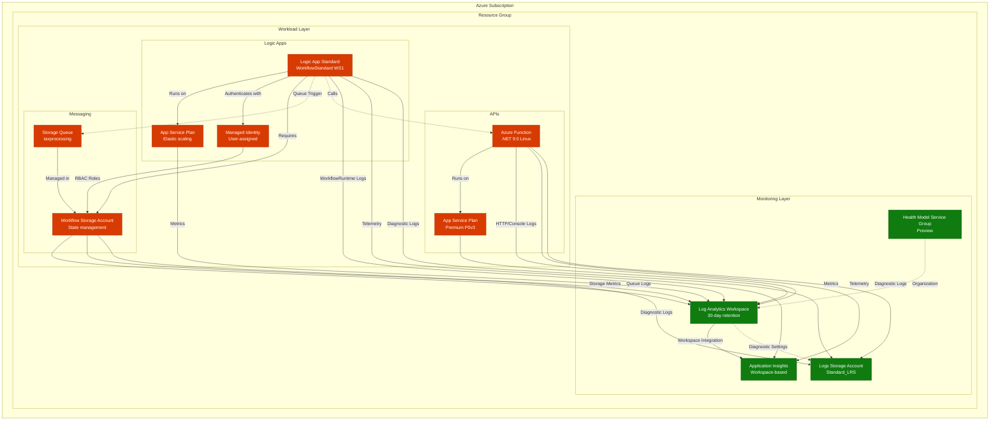

# Azure Logic Apps Monitoring Solution

[](LICENSE.md)
[](https://azure.microsoft.com/en-us/products/logic-apps)

A production-ready, enterprise-grade monitoring solution for Azure Logic Apps Standard using Infrastructure as Code (IaC) with Bicep templates. This project demonstrates Azure Monitor best practices, providing comprehensive observability for workflow orchestration at scale.

---

## Table of Contents

- [Project Overview](#project-overview)
  - [Purpose](#purpose)
  - [Key Features](#key-features)
  - [Target Audience](#target-audience)
  - [Benefits](#benefits)
- [Architecture](#architecture)
  - [Component Analysis](#component-analysis)
  - [Architecture Diagram](#architecture-diagram)
  - [Data Flow Explanation](#data-flow-explanation)
- [Prerequisites](#prerequisites)
- [Deployment](#deployment)
  - [Option A: Using Azure Developer CLI (Recommended)](#option-a-using-azure-developer-cli-recommended)
  - [Option B: Manual Bicep Deployment](#option-b-manual-bicep-deployment)
  - [Troubleshooting Common Issues](#troubleshooting-common-issues)
- [Usage](#usage)
- [Project Structure](#project-structure)
- [Security](#security)
- [Contributing](#contributing)
- [License](#license)
- [Glossary](#glossary)

---

## Project Overview

### Purpose

This solution was created to address the observability gap in Azure Logic Apps Standard deployments. While Azure provides basic monitoring capabilities out-of-the-box, enterprise workflow orchestration requires:

- **Centralized log aggregation** across multiple Logic Apps and supporting services
- **Proactive alerting** on workflow failures, performance degradation, and resource constraints
- **End-to-end telemetry** from ingestion (Storage Queues) through processing (Logic Apps) to APIs (Azure Functions)
- **Cost-optimized monitoring** with structured retention policies and intelligent data routing
- **Compliance-ready audit trails** for regulated industries

**Target Use Cases:**
- Enterprise workflow orchestration (document processing, ETL pipelines, API orchestrations)
- Mission-critical integrations requiring SLA monitoring
- Multi-environment deployments (dev, staging, production) with consistent observability
- Troubleshooting workflow failures and performance bottlenecks

### Key Features

This monitoring solution provides comprehensive visibility into:

**What It Monitors:**
- **Logic Apps Standard** - Workflow runtime events, execution history, trigger metrics, action failures
- **Azure Functions** - HTTP request logs, application traces, performance counters, custom metrics
- **Storage Accounts** - Queue operations, blob transactions, storage capacity, availability metrics
- **App Service Plans** - CPU/memory utilization, scaling events, health status
- **Application Insights** - Distributed tracing, dependency tracking, exception telemetry

**How It Monitors:**
- **Diagnostic Settings** - Automated configuration of diagnostic logs for all Azure resources, routing to Log Analytics and Storage
- **Workspace-Based Application Insights** - Unified telemetry collection with Log Analytics integration for cross-service correlation
- **Azure Monitor Health Model** - Service group hierarchies for organizing monitored resources (preview feature)
- **Managed Identity Integration** - Secure, keyless authentication for Logic Apps to access storage and monitoring endpoints
- **Structured Logging** - Standardized resource tagging (environment, cost center, business unit) for multi-dimensional analysis

**Integration Points:**
- Log Analytics workspace as central data repository
- Application Insights for application performance management (APM)
- Storage Account for long-term log retention and compliance archival
- Azure Resource Graph for resource inventory queries
- Azure Monitor Alerts (ready for custom alert rules)
- Azure Dashboards and Workbooks (bring your own visualizations)

### Target Audience

- **DevOps Engineers** managing Azure Logic Apps in production environments
- **Azure Architects** designing enterprise monitoring solutions
- **Platform Engineers** standardizing observability across cloud workloads
- **SRE Teams** implementing reliability engineering practices
- **Cloud Administrators** seeking IaC templates for repeatable deployments

**Skill Level:** Beginner to Intermediate
- Basic understanding of Azure Logic Apps and resource deployment
- Familiarity with Azure Portal navigation
- (Optional) Experience with Bicep/ARM templates for customization

### Benefits

**Gaps Filled Beyond Out-of-the-Box Monitoring:**

| Default Azure Monitoring | This Solution |
|-------------------------|---------------|
| Manual diagnostic settings configuration per resource | Automated diagnostic settings for all resources via IaC |
| No centralized log repository | Unified Log Analytics workspace for cross-service queries |
| Logs scattered across resource-specific storage | Structured log aggregation with consistent retention policies |
| Basic Application Insights setup | Workspace-based Application Insights with correlation IDs |
| No standardized tagging | Enterprise-grade resource tagging for cost allocation and governance |
| Manual role assignments for Logic Apps | Automated managed identity configuration with least-privilege RBAC |

**Logic Apps-Specific Monitoring Capabilities:**
- **Workflow Runtime Logs** - Capture every action execution, retry attempt, and error message
- **Performance Baselines** - Track workflow duration, trigger latency, and action timeouts
- **Storage Integration Monitoring** - Monitor Logic Apps dependencies on blob, queue, table, and file services
- **Dependency Tracking** - Trace calls from Logic Apps to Azure Functions and external APIs
- **Failed Run Analysis** - KQL queries optimized for troubleshooting workflow failures

**Cost & Operational Advantages:**
- **Reduced MTTR** - Faster incident resolution with centralized logs and pre-built queries
- **Cost Optimization** - 30-day retention in Log Analytics with long-term storage in cheaper tiers
- **Infrastructure as Code** - Version-controlled, repeatable deployments eliminate configuration drift
- **Multi-Environment Support** - Single codebase deployed across dev, staging, production with parameter files
- **Compliance-Ready** - Immutable audit trails with diagnostic logs stored in append-only storage

---

## Architecture

### Overview

This solution uses a **modular, layered architecture** to separate concerns and enable reusability:

**Why Layers Are Separated:**
1. **Infrastructure Layer** (`infra/main.bicep`) - Creates resource groups and orchestrates deployment order
2. **Monitoring Layer** (`src/monitoring/main.bicep`) - Deploys observability infrastructure (Log Analytics, Application Insights, storage) **first** to ensure diagnostic endpoints exist before workloads
3. **Workload Layer** (`src/workload/main.bicep`) - Deploys business logic resources (Logic Apps, Functions, messaging) with automatic diagnostic settings configuration

This separation ensures:
- **Reusability** - Monitoring module can be used across multiple projects
- **Dependency Management** - Workloads deploy only after monitoring infrastructure is ready
- **Blast Radius Limitation** - Changes to workloads don't affect monitoring infrastructure
- **Environment Parity** - Same monitoring configuration across dev, staging, production

**Deployment Sequence:**
```
1. Resource Group → 2. Monitoring (Log Analytics, App Insights) → 3. Workload (Logic Apps, Functions, Storage)
```

### Component Analysis

**Infrastructure Foundation** (`infra/main.bicep`):
- **Resource Group** - Logical container for all solution resources
- **Parameter Configuration** - Environment-specific settings (dev/uat/prod)
- **Tagging Strategy** - Cost center, business unit, deployment date for governance

**Monitoring Components** (`src/monitoring/main.bicep`):
- **Log Analytics Workspace** - Centralized log repository with 30-day retention
- **Application Insights** - Workspace-based telemetry collection for distributed tracing
- **Logs Storage Account** - Long-term retention for compliance (Standard_LRS, Hot tier, TLS 1.2+)
- **Health Model Service Group** - Organizational hierarchy for monitored resources (Azure Monitor preview)

**Workload Resources** (`src/workload/main.bicep`):

*Logic Apps Standard:*
- **Workflow App** - Single-tenant Logic App with managed identity
- **App Service Plan** - WS1 (WorkflowStandard) tier with elastic scaling (up to 20 workers)
- **Managed Identity** - User-assigned identity with RBAC roles for storage access
- **Diagnostic Settings** - WorkflowRuntime logs, AllMetrics to Log Analytics + Storage

*Azure Functions:*
- **Function App** - .NET 9.0 on Linux (P0v3 Premium tier)
- **App Service Plan** - Dedicated Premium plan for consistent performance
- **Diagnostic Settings** - HTTP logs, console logs, application logs, metrics

*Messaging Infrastructure:*
- **Workflow Storage Account** - Required by Logic Apps for state management
- **Storage Queue** - `taxprocessing` queue for workflow triggers
- **Diagnostic Settings** - Storage metrics, queue service logs

**Dependencies Between Resources:**
- Logic Apps → Requires workflow storage account (created first)
- Logic Apps → Requires Application Insights connection string (from monitoring layer)
- All Resources → Send diagnostic logs to Log Analytics workspace ID (from monitoring layer)
- Managed Identity → Requires role assignments (Storage Contributor, Blob Data Owner, Queue/Table/File Data Contributor)

**Data Flows:**
1. **Telemetry Collection** - Logic Apps/Functions → Application Insights → Log Analytics
2. **Diagnostic Logs** - All resources → Diagnostic Settings → Log Analytics + Storage Account
3. **Metrics Aggregation** - Azure Monitor → Log Analytics (1-minute granularity)
4. **Storage Operations** - Queue triggers → Logic App workflows → Application logs

### Architecture Diagram


```mermaid
graph TB
    subgraph "Azure Subscription"
        subgraph "Resource Group"
            subgraph "Monitoring Layer"
                LAW[Log Analytics Workspace<br/>30-day retention]
                AI[Application Insights<br/>Workspace-based]
                LOGS[Logs Storage Account<br/>Standard_LRS]
                HM[Health Model Service Group<br/>Preview]
                
                LAW -->|Workspace Integration| AI
                LAW -.->|Diagnostic Settings| LOGS
                HM -.->|Organization| LAW
            end
            
            subgraph "Workload Layer"
                subgraph "Logic Apps"
                    LA[Logic App Standard<br/>WorkflowStandard WS1]
                    ASP1[App Service Plan<br/>Elastic scaling]
                    MI[Managed Identity<br/>User-assigned]
                    
                    LA -->|Runs on| ASP1
                    LA -->|Authenticates with| MI
                end
                
                subgraph "APIs"
                    FA[Azure Function<br/>.NET 9.0 Linux]
                    ASP2[App Service Plan<br/>Premium P0v3]
                    
                    FA -->|Runs on| ASP2
                end
                
                subgraph "Messaging"
                    WSA[Workflow Storage Account<br/>State management]
                    Q[Storage Queue<br/>taxprocessing]
                    
                    Q -->|Managed in| WSA
                end
                
                LA -->|Requires| WSA
                LA -.->|Queue Trigger| Q
                LA -.->|Calls| FA
                MI -->|RBAC Roles| WSA
            end
            
            %% Data Flow Arrows
            LA -->|WorkflowRuntime Logs| LAW
            LA -->|Telemetry| AI
            LA -->|Diagnostic Logs| LOGS
            
            FA -->|HTTP/Console Logs| LAW
            FA -->|Telemetry| AI
            FA -->|Diagnostic Logs| LOGS
            
            WSA -->|Storage Metrics| LAW
            WSA -->|Queue Logs| LAW
            WSA -->|Diagnostic Logs| LOGS
            
            ASP1 -->|Metrics| LAW
            ASP2 -->|Metrics| LAW
        end
    end
    
    %% Styling
    classDef monitoring fill:#107C10,stroke:#0B5A0B,color:#fff
    classDef workload fill:#D83B01,stroke:#A62A00,color:#fff
    classDef infrastructure fill:#0078D4,stroke:#005A9E,color:#fff
    classDef dataflow stroke:#605E5C,stroke-width:2px,stroke-dasharray: 5 5
    
    class LAW,AI,LOGS,HM monitoring
    class LA,FA,WSA,Q,ASP1,ASP2,MI workload
```

### Data Flow Explanation

**1. How Data Flows from Logic Apps to Log Analytics**

```
Logic App Workflow Execution
    ↓
Workflow Runtime Events (trigger fired, action started, action completed, errors)
    ↓
Diagnostic Settings (configured via Bicep)
    ↓
Log Analytics Workspace (AzureDiagnostics table, WorkflowRuntime category)
    ↓
Available for KQL queries and alert rules
```

Simultaneously, the Logic App sends telemetry to Application Insights (distributed traces, dependencies, custom events), which is automatically synchronized to the same Log Analytics workspace via workspace-based integration.

**2. How Metrics Are Collected and Stored**

Azure Monitor automatically collects platform metrics at **1-minute intervals**:

- **Logic Apps** - Runs started, runs completed, runs failed, runs succeeded, trigger latency
- **Azure Functions** - Function execution count, function execution units, HTTP requests, response times
- **Storage Accounts** - Transactions, ingress/egress, queue message count, availability percentage
- **App Service Plans** - CPU percentage, memory percentage, disk queue length

These metrics are:
- Stored in Azure Monitor's time-series database (93-day retention by default)
- Exported to Log Analytics via diagnostic settings (30-day retention, queryable with KQL)
- Archived to the logs storage account for long-term retention

**3. How Alerts Are Triggered Based on Conditions**

This solution provides the **infrastructure for alerting** but does not pre-configure alert rules (to avoid alert fatigue). You can create custom alerts based on:

- **Log-based alerts** - Query Log Analytics for patterns (e.g., "WorkflowRuntime | where status_s == 'Failed' | count > 5 in 5 minutes")
- **Metric alerts** - Threshold-based triggers (e.g., "Logic App runs failed > 10 per minute")
- **Activity log alerts** - Operational events (e.g., "Logic App scaled down unexpectedly")

See [Usage Examples](#usage) for sample alert rule configurations.

**4. How Health Models Aggregate Telemetry**

The Azure Monitor Health Model (preview feature) creates a **service group hierarchy**:

```
Root Service Group (Azure Tenant Level)
    └── Tax-Docs-Processing Service Group
            ├── Logic Apps
            ├── Azure Functions
            ├── Storage Accounts
            └── Monitoring Infrastructure
```

This organizational structure enables:
- **Aggregated health views** - Roll-up status from child resources
- **Dependency mapping** - Visualize relationships between services
- **Impact analysis** - Understand blast radius during incidents

> **Note**: Health models are a preview feature and require Microsoft.Management resource provider registration.

---

## Prerequisites

### Azure Requirements

**Subscription & Permissions:**
- Active Azure subscription ([create a free account](https://azure.microsoft.com/free/) if needed)
- **Contributor** role (or higher) on the target subscription
  - Required for creating resource groups and deploying resources
  - Can be scoped to a specific resource group for least-privilege deployments

**Azure Resource Providers:**
Ensure these providers are registered (deployment will fail if missing):
```bash
# Check registration status
az provider list --query "[?namespace=='Microsoft.Logic' || namespace=='Microsoft.Web' || namespace=='Microsoft.Insights' || namespace=='Microsoft.OperationalInsights' || namespace=='Microsoft.Storage'].{Provider:namespace, Status:registrationState}" --output table

# Register if needed
az provider register --namespace Microsoft.Logic
az provider register --namespace Microsoft.Web
az provider register --namespace Microsoft.Insights
az provider register --namespace Microsoft.OperationalInsights
az provider register --namespace Microsoft.Storage
az provider register --namespace Microsoft.Management  # For health models (optional)
```

### Local Tools

Install the following tools on your development machine:

| Tool | Minimum Version | Installation |
|------|----------------|--------------|
| **Azure CLI** | 2.60.0+ | [Install Azure CLI](https://learn.microsoft.com/cli/azure/install-azure-cli) |
| **Bicep CLI** | 0.30.0+ | Automatically installed with Azure CLI 2.20.0+ |
| **Azure Developer CLI (azd)** | 1.5.0+ | [Install azd](https://learn.microsoft.com/azure/developer/azure-developer-cli/install-azd) (optional but recommended) |
| **PowerShell** | 7.0+ | [Install PowerShell](https://learn.microsoft.com/powershell/scripting/install/installing-powershell) |

**Verify Installation:**
```powershell
# Check Azure CLI version
az --version

# Check Bicep version
az bicep version

# Check azd (if using recommended path)
azd version

# Check PowerShell version
$PSVersionTable.PSVersion
```

### Dependencies

**Configuration Files:**
- `infra/main.parameters.json` - Customize deployment parameters (location, environment name)
- `azure.yaml` - Azure Developer CLI configuration (auto-detected)

**No local development dependencies** - This is a pure infrastructure deployment (no application code to compile).

### Knowledge Prerequisites

**Required:**
- Basic understanding of Azure Logic Apps Standard (vs Consumption tier)
- Familiarity with Azure Portal navigation and resource creation
- Ability to run commands in a terminal

**Helpful (but not required):**
- Experience with Infrastructure as Code (Bicep/ARM templates)
- Knowledge of Azure Monitor and Log Analytics
- Understanding of managed identities and RBAC

---

## Deployment

### Option A: Using Azure Developer CLI (Recommended)

The fastest way to deploy the entire solution is with Azure Developer CLI (azd):

```bash
# Clone the repository
git clone https://github.com/Evilazaro/Azure-LogicApps-Monitoring.git
cd Azure-LogicApps-Monitoring

# Login to Azure (opens browser for authentication)
azd auth login

# Provision infrastructure and deploy (one command!)
azd up
```

**What `azd up` Does Behind the Scenes:**
1. Prompts for required parameters (Azure subscription, region, environment name)
2. Creates a new resource group (format: `contoso-tax-docs-{env}-{location}-rg`)
3. Deploys monitoring infrastructure (Log Analytics, Application Insights)
4. Deploys workload infrastructure (Logic Apps, Functions, Storage)
5. Configures diagnostic settings automatically
6. Outputs connection strings and resource IDs as environment variables

**Interactive Prompts:**
```
? Select an Azure Subscription: [Use arrows to select]
? Select an Azure location: eastus
? Enter a value for 'envName' (dev/uat/prod): dev
```

**Expected Output:**
```
✓ Provisioning Azure resources (ARM) can take some time...
SUCCESS: Your application was provisioned in Azure in 5 minutes 32 seconds.

Outputs:
  AZURE_LOG_ANALYTICS_WORKSPACE_NAME: tax-docs-abc123-law
  AZURE_APPLICATION_INSIGHTS_NAME: tax-docs-abc123-appinsights
  LOGIC_APP_NAME: tax-docs-abc123-logicapp
  RESOURCE_GROUP_NAME: contoso-tax-docs-dev-eastus-rg
```

### Option B: Manual Bicep Deployment

For more control or CI/CD pipeline integration, deploy using Azure CLI:

#### Step 1: Configure Parameters

Edit `infra/main.parameters.json` to customize your deployment:

```json
{
  "$schema": "https://schema.management.azure.com/schemas/2015-01-01/deploymentParameters.json#",
  "contentVersion": "1.0.0.0",
  "parameters": {
    "location": {
      "value": "eastus"  // Change to your preferred region
    },
    "envName": {
      "value": "dev"  // Options: dev, uat, prod
    }
  }
}
```

**Optional Parameters** (defined in `infra/main.bicep` with defaults):
- `solutionName` - Base name for resources (default: `tax-docs`)
  - Must be 3-20 characters, lowercase alphanumeric
  - Used as prefix for all resource names

**Note**: Resource names are automatically generated with unique suffixes to avoid conflicts:
- Format: `{solutionName}-{uniqueString}-{resourceType}`
- Example: `tax-docs-abc123def456-logicapp`

#### Step 2: Login and Set Subscription

```bash
# Login to Azure
az login

# List subscriptions
az account list --output table

# Set active subscription
az account set --subscription "<subscription-id-or-name>"

# Verify selected subscription
az account show --output table
```

#### Step 3: Deploy Infrastructure

Deploy at subscription scope (creates resource group automatically):

```bash
# Navigate to project root
cd Azure-LogicApps-Monitoring

# Deploy all infrastructure
az deployment sub create \
  --name "logicapps-monitoring-$(Get-Date -Format 'yyyyMMdd-HHmmss')" \
  --location eastus \
  --template-file infra/main.bicep \
  --parameters infra/main.parameters.json \
  --parameters solutionName=tax-docs
```

**Why Subscription Scope?**
- Allows Bicep to create the resource group automatically
- Ensures consistent naming and tagging
- Simplifies multi-environment deployments

**Deployment Progress:**
```
Creating deployment...
Waiting for deployment to complete (this may take 5-10 minutes)...

Deployment Status:
  Resource Group: Running
  Monitoring Layer: Running
  Workload Layer: Waiting

✓ Deployment complete (Status: Succeeded)
```

#### Step 4: Verify Deployment

**Check Deployed Resources:**
```bash
# Set resource group name (adjust based on your parameters)
$RESOURCE_GROUP="contoso-tax-docs-dev-eastus-rg"

# List all resources
az resource list --resource-group $RESOURCE_GROUP --output table

# Expected output:
# Name                                    Type
# --------------------------------------  --------------------------------------------------
# tax-docs-abc123-law                     Microsoft.OperationalInsights/workspaces
# tax-docs-abc123-appinsights             Microsoft.Insights/components
# taxdocslogsabc123                       Microsoft.Storage/storageAccounts
# tax-docs-abc123-logicapp                Microsoft.Web/sites
# tax-docs-abc123-asp                     Microsoft.Web/serverfarms
# tax-docs-abc123-api                     Microsoft.Web/sites
# taxdocsabc123                           Microsoft.Storage/storageAccounts
```

**Verify Logic App Status:**
```bash
# Get Logic App details
az logicapp show \
  --name $(az resource list -g $RESOURCE_GROUP --resource-type "Microsoft.Web/sites" --query "[?kind=='functionapp,workflowapp'].name" -o tsv) \
  --resource-group $RESOURCE_GROUP \
  --query "{Name:name, State:state, DefaultHostName:defaultHostName}" \
  --output table

# Expected: State = Running
```

**Verify Application Insights Connection:**
```bash
# Get Application Insights instrumentation key
az monitor app-insights component show \
  --app $(az resource list -g $RESOURCE_GROUP --resource-type "Microsoft.Insights/components" --query "[0].name" -o tsv) \
  --resource-group $RESOURCE_GROUP \
  --query "instrumentationKey" \
  --output tsv

# Expected: GUID output (e.g., 12345678-abcd-1234-abcd-1234567890ab)
```

**Verify Log Analytics Workspace:**
```bash
# Query Log Analytics for recent data (may take 5-10 minutes for data to appear)
az monitor log-analytics query \
  --workspace $(az resource list -g $RESOURCE_GROUP --resource-type "Microsoft.OperationalInsights/workspaces" --query "[0].name" -o tsv) \
  --analytics-query "AzureDiagnostics | summarize count() by ResourceType | order by count_ desc" \
  --output table

# Expected: Table showing diagnostic log counts by resource type
```

#### Step 5: Post-Deployment Configuration

**1. Deploy Sample Logic App Workflow:**

The solution deploys the infrastructure but not the workflow definition. To deploy the sample tax processing workflow:

```bash
# Navigate to workflow directory
cd tax-docs

# Deploy workflow (requires Azure Logic Apps extension for VS Code or Azure Portal)
# Via Portal: Navigate to Logic App → Workflows → Upload workflow.json
```

Alternatively, use the [Azure Logic Apps VS Code extension](https://marketplace.visualstudio.com/items?itemName=ms-azuretools.vscode-azurelogicapps):
1. Open `tax-docs/tax-processing/workflow.json` in VS Code
2. Right-click → "Deploy to Logic App"
3. Select the deployed Logic App from the list

**2. Configure Connection Strings (if needed):**

If your Logic App workflows require API connections (SQL, Office 365, etc.), create them manually:
```bash
az logicapp connection create --help  # View connection creation syntax
```

**3. Test Workflow Execution:**

Trigger the tax processing workflow by adding a message to the storage queue:

```bash
# Get storage account name
$STORAGE_ACCOUNT=$(az storage account list -g $RESOURCE_GROUP --query "[?contains(name, 'taxdocs')].name" -o tsv | Select-Object -First 1)

# Get storage account connection string
$CONN_STR=$(az storage account show-connection-string -g $RESOURCE_GROUP -n $STORAGE_ACCOUNT --query connectionString -o tsv)

# Send test message to queue
az storage message put \
  --queue-name taxprocessing \
  --content "Test workflow trigger" \
  --connection-string $CONN_STR

# Verify message was processed (check Logic App run history)
```

### Troubleshooting Common Issues

#### Issue: "Resource provider not registered"

**Error Message:**
```
Code: MissingSubscriptionRegistration
Message: The subscription is not registered to use namespace 'Microsoft.Logic'
```

**Solution:**
```bash
# Register the required resource provider
az provider register --namespace Microsoft.Logic

# Wait for registration to complete (takes 1-2 minutes)
az provider show --namespace Microsoft.Logic --query "registrationState" --output tsv
# Expected: Registered
```

#### Issue: "Insufficient permissions"

**Error Message:**
```
Code: AuthorizationFailed
Message: The client does not have authorization to perform action 'Microsoft.Resources/subscriptions/resourcegroups/write'
```

**Solution:**
1. Verify you have Contributor role:
   ```bash
   az role assignment list --assignee $(az account show --query user.name -o tsv) --output table
   ```
2. Contact subscription administrator to grant Contributor role:
   ```bash
   az role assignment create \
     --assignee <your-email@domain.com> \
     --role "Contributor" \
     --scope "/subscriptions/<subscription-id>"
   ```

#### Issue: "Deployment timeout"

**Error Message:**
```
Deployment failed. Correlation ID: abc-123-def. Operation timed out after 60 minutes.
```

**Solution:**
1. Check Azure Service Health for outages:
   ```bash
   az service-health issue list --query "[?impactedService=='Logic Apps' || impactedService=='Storage']"
   ```
2. Retry deployment with `--no-wait` flag (deploy asynchronously):
   ```bash
   az deployment sub create \
     --name "logicapps-monitoring-retry" \
     --location eastus \
     --template-file infra/main.bicep \
     --parameters infra/main.parameters.json \
     --no-wait

   # Check deployment status
   az deployment sub show --name "logicapps-monitoring-retry" --query "properties.provisioningState"
   ```

#### Issue: "Resource name already exists"

**Error Message:**
```
Code: StorageAccountAlreadyTaken
Message: The storage account named 'taxdocslogsabc123' is already taken
```

**Solution:**
This typically happens when redeploying to the same resource group. The `uniqueString()` function generates the same suffix. Either:
- Delete the existing resource group:
  ```bash
  az group delete --name $RESOURCE_GROUP --yes --no-wait
  ```
- Change the `solutionName` parameter to generate a new unique suffix:
  ```bash
  --parameters solutionName=tax-docs-v2
  ```

#### Issue: "WorkflowRuntime logs not appearing"

**Symptoms:**
- Deployment succeeded, but no logs in Log Analytics
- KQL queries return 0 results

**Solution:**
1. **Wait 5-10 minutes** - Diagnostic logs have ingestion latency
2. Verify diagnostic settings are configured:
   ```bash
   az monitor diagnostic-settings list \
     --resource $(az logicapp show -g $RESOURCE_GROUP -n <logic-app-name> --query id -o tsv) \
     --output table
   ```
3. Trigger a workflow execution to generate logs (see Step 5 above)
4. Run a test query:
   ```kusto
   AzureDiagnostics
   | where TimeGenerated > ago(1h)
   | summarize count() by ResourceType
   ```

---

## Usage

This section provides practical, tested examples for common monitoring scenarios.

### Example 1: Query Logic App Execution History

**Scenario**: Troubleshoot why a workflow failed in the last 24 hours.

**KQL Query** (run in Log Analytics workspace):

```kusto
// Find all failed Logic App workflow runs in the last 24 hours
AzureDiagnostics
| where TimeGenerated > ago(24h)
| where ResourceProvider == "MICROSOFT.LOGIC"
| where Category == "WorkflowRuntime"
| where status_s == "Failed"
| project 
    TimeGenerated,
    WorkflowName = resource_workflowName_s,
    RunId = resource_runId_s,
    Status = status_s,
    ErrorCode = code_s,
    ErrorMessage = error_message_s,
    CorrelationId = clientTrackingId_s
| order by TimeGenerated desc
| take 50
```

**How to Run:**
1. Navigate to your Log Analytics workspace in Azure Portal
2. Select **Logs** from the left menu
3. Paste the query above
4. Click **Run**

**Expected Output:**
| TimeGenerated | WorkflowName | RunId | Status | ErrorCode | ErrorMessage | CorrelationId |
|--------------|--------------|-------|--------|-----------|--------------|---------------|
| 2025-12-04 10:15:23 | tax-processing | 08585... | Failed | ActionFailed | The template language expression 'body('Parse_JSON')' cannot be evaluated | abc-123-def |

**Explanation:**
- `ResourceProvider == "MICROSOFT.LOGIC"` - Filter for Logic Apps events
- `Category == "WorkflowRuntime"` - Workflow execution events (vs management operations)
- `status_s == "Failed"` - Only failed runs (change to "Succeeded" for successful runs)
- `project` - Select specific columns for readability
- `take 50` - Limit to 50 results (adjust as needed)

<details>
<summary><strong>Advanced: Correlation with Application Insights</strong></summary>

```kusto
// Join Logic App failures with Application Insights dependency tracking
let failedRuns = AzureDiagnostics
| where TimeGenerated > ago(24h)
| where ResourceProvider == "MICROSOFT.LOGIC"
| where status_s == "Failed"
| project TimeGenerated, CorrelationId = clientTrackingId_s, WorkflowName = resource_workflowName_s;
dependencies
| where timestamp > ago(24h)
| where cloud_RoleName contains "tax-docs"
| join kind=inner failedRuns on $left.operation_Id == $right.CorrelationId
| project 
    timestamp,
    WorkflowName,
    DependencyType = type,
    DependencyName = name,
    Duration = duration,
    Success = success,
    ResultCode = resultCode
```

This query correlates Logic App failures with downstream API calls captured by Application Insights.
</details>

---

### Example 2: View Azure Function Performance Metrics

**Scenario**: Analyze function app response times to identify performance regressions.

**Azure CLI Method:**
```powershell
# Get Function App resource ID
$FUNC_APP_ID=$(az functionapp show `
  --name $(az resource list -g $RESOURCE_GROUP --resource-type "Microsoft.Web/sites" --query "[?kind=='app,linux'].name" -o tsv) `
  --resource-group $RESOURCE_GROUP `
  --query id `
  --output tsv)

# Query average response time over last 24 hours (1-hour granularity)
az monitor metrics list `
  --resource $FUNC_APP_ID `
  --metric "HttpResponseTime" `
  --aggregation Average `
  --start-time (Get-Date).AddDays(-1).ToString("yyyy-MM-ddTHH:mm:ssZ") `
  --end-time (Get-Date).ToString("yyyy-MM-ddTHH:mm:ssZ") `
  --interval PT1H `
  --output table
```

**KQL Query Method** (Log Analytics):
```kusto
// Function app performance percentiles
AzureDiagnostics
| where TimeGenerated > ago(24h)
| where ResourceType == "MICROSOFT.WEB/SITES"
| where Category == "AppServiceHTTPLogs"
| summarize 
    P50 = percentile(timeTaken_d, 50),  // Median
    P95 = percentile(timeTaken_d, 95),  // 95th percentile
    P99 = percentile(timeTaken_d, 99),  // 99th percentile
    Requests = count()
    by bin(TimeGenerated, 1h)
| order by TimeGenerated desc
| render timechart
```

**Explanation:**
- `HttpResponseTime` metric - Average response time in milliseconds
- `--interval PT1H` - Aggregate data in 1-hour buckets (ISO 8601 duration format)
- Percentiles (P95, P99) identify tail latency affecting user experience

**Expected Output (CLI):**
```
Timestamp                 Average (ms)
------------------------  --------------
2025-12-04T10:00:00Z     245.3
2025-12-04T11:00:00Z     198.7
2025-12-04T12:00:00Z     523.1  ← Spike detected
```

**Threshold Recommendations:**
- **P50 < 200ms** - Good
- **P95 < 500ms** - Acceptable
- **P99 < 1000ms** - Needs investigation if higher

---

### Example 3: Set Up Custom Alert Rule

**Scenario**: Get notified when Logic App fails more than 5 times in 5 minutes.

#### Create Action Group (one-time setup)

```powershell
# Create action group for email notifications
az monitor action-group create `
  --name "LogicAppAlerts" `
  --resource-group $RESOURCE_GROUP `
  --short-name "LAAlerts" `
  --email-receiver `
    name="DevOpsTeam" `
    email-address="devops@yourcompany.com" `
    use-common-alert-schema
```

#### Create Metric Alert Rule

```powershell
# Get Logic App resource ID
$LOGIC_APP_ID=$(az logicapp show `
  --name $(az resource list -g $RESOURCE_GROUP --resource-type "Microsoft.Web/sites" --query "[?kind=='functionapp,workflowapp'].name" -o tsv) `
  --resource-group $RESOURCE_GROUP `
  --query id `
  --output tsv)

# Get action group resource ID
$ACTION_GROUP_ID=$(az monitor action-group show `
  --name "LogicAppAlerts" `
  --resource-group $RESOURCE_GROUP `
  --query id `
  --output tsv)

# Create alert rule
az monitor metrics alert create `
  --name "LogicAppFailures-HighRate" `
  --resource-group $RESOURCE_GROUP `
  --description "Alert when Logic App fails more than 5 times in 5 minutes" `
  --scopes $LOGIC_APP_ID `
  --condition "count runs/failed > 5" `
  --window-size 5m `
  --evaluation-frequency 1m `
  --severity 2 `
  --action $ACTION_GROUP_ID `
  --enabled true
```

**Parameters Explained:**
- `--condition "count runs/failed > 5"` - Trigger when failed runs exceed threshold
- `--window-size 5m` - Look-back period for aggregation
- `--evaluation-frequency 1m` - Check condition every minute
- `--severity 2` - Warning level (0=Critical, 1=Error, 2=Warning, 3=Informational)

<details>
<summary><strong>View Full Alert Configuration JSON</strong></summary>

```json
{
  "name": "LogicAppFailures-HighRate",
  "type": "Microsoft.Insights/metricAlerts",
  "location": "global",
  "properties": {
    "description": "Alert when Logic App fails more than 5 times in 5 minutes",
    "severity": 2,
    "enabled": true,
    "scopes": [
      "/subscriptions/{subscription-id}/resourceGroups/{rg}/providers/Microsoft.Web/sites/{logic-app-name}"
    ],
    "evaluationFrequency": "PT1M",
    "windowSize": "PT5M",
    "criteria": {
      "allOf": [
        {
          "criterionType": "StaticThresholdCriterion",
          "name": "FailedRunsMetric",
          "metricName": "RunsFailed",
          "metricNamespace": "Microsoft.Logic/workflows",
          "operator": "GreaterThan",
          "threshold": 5,
          "timeAggregation": "Total"
        }
      ],
      "odata.type": "Microsoft.Azure.Monitor.SingleResourceMultipleMetricCriteria"
    },
    "actions": [
      {
        "actionGroupId": "/subscriptions/{subscription-id}/resourceGroups/{rg}/providers/microsoft.insights/actiongroups/LogicAppAlerts"
      }
    ]
  }
}
```

**To deploy from JSON:**
```powershell
az monitor metrics alert create --parameters @alert-config.json
```
</details>

#### Verify Alert Rule

```powershell
# List all alert rules in resource group
az monitor metrics alert list `
  --resource-group $RESOURCE_GROUP `
  --query "[].{Name:name, Enabled:enabled, Severity:severity}" `
  --output table

# View alert rule details
az monitor metrics alert show `
  --name "LogicAppFailures-HighRate" `
  --resource-group $RESOURCE_GROUP
```

**Testing the Alert:**
1. Intentionally trigger 6 failed Logic App runs (e.g., send malformed JSON to queue)
2. Wait 1-2 minutes for metric aggregation
3. Check email for alert notification
4. View fired alerts in Azure Portal: Monitor → Alerts → Alert History

---

### Example 4: Access Storage Queue Diagnostic Logs

**Scenario**: Investigate why messages are not being processed from the taxprocessing queue.

#### Via Azure Portal

1. Navigate to your workflow storage account (name like `taxdocsabc123`)
2. Select **Diagnostic settings** from the left menu under **Monitoring**
3. Verify a diagnostic setting exists pointing to your Log Analytics workspace
4. If missing, click **+ Add diagnostic setting**:
   - Name: `QueueLogs`
   - Logs: Check **allLogs** under **QueueService**
   - Destination: Check **Send to Log Analytics workspace**, select your workspace
   - Click **Save**

#### Via Azure CLI

```powershell
# Get storage account resource ID
$STORAGE_ID=$(az storage account show `
  -n $(az storage account list -g $RESOURCE_GROUP --query "[?contains(name, 'taxdocs')].name" -o tsv | Select-Object -First 1) `
  -g $RESOURCE_GROUP `
  --query id `
  --output tsv)

# Get queue service resource ID (append /queueServices/default)
$QUEUE_SERVICE_ID="$STORAGE_ID/queueServices/default"

# Get Log Analytics workspace ID
$WORKSPACE_ID=$(az monitor log-analytics workspace show `
  -n $(az resource list -g $RESOURCE_GROUP --resource-type "Microsoft.OperationalInsights/workspaces" --query "[0].name" -o tsv) `
  -g $RESOURCE_GROUP `
  --query id `
  --output tsv)

# Create diagnostic setting for queue service
az monitor diagnostic-settings create `
  --name "QueueServiceLogs" `
  --resource $QUEUE_SERVICE_ID `
  --workspace $WORKSPACE_ID `
  --logs '[{"category":"StorageRead","enabled":true},{"category":"StorageWrite","enabled":true},{"category":"StorageDelete","enabled":true}]' `
  --metrics '[{"category":"Transaction","enabled":true}]'
```

#### Query Queue Metrics

```kusto
// Queue message count over time
StorageQueueLogs
| where TimeGenerated > ago(24h)
| where AccountName contains "taxdocs"
| summarize 
    MessageCount = sum(MessageCount),
    OldestMessageAge = max(OldestMessageAgeSeconds)
    by bin(TimeGenerated, 5m)
| render timechart

// Identify queue operation failures
StorageQueueLogs
| where TimeGenerated > ago(24h)
| where StatusCode >= 400  // Client or server errors
| project 
    TimeGenerated,
    OperationName,
    StatusCode,
    StatusText,
    CallerIpAddress,
    Uri
| order by TimeGenerated desc
```

**Common Status Codes:**
- **200** - Success
- **404** - Queue or message not found
- **409** - Conflict (queue already exists)
- **500** - Internal server error

---

### Example 5: Generate Custom Workbook for Logic Apps Health

**Scenario**: Create a visual dashboard showing Logic App health metrics.

Azure Workbooks provide interactive visualizations. Here's how to create one:

#### Create Workbook via Portal

1. Navigate to Azure Portal → **Monitor** → **Workbooks**
2. Click **+ New**
3. Add query blocks with these KQL queries:

**Query 1: Workflow Success Rate (Last 24h)**
```kusto
AzureDiagnostics
| where TimeGenerated > ago(24h)
| where ResourceProvider == "MICROSOFT.LOGIC"
| where Category == "WorkflowRuntime"
| summarize 
    Total = count(),
    Succeeded = countif(status_s == "Succeeded"),
    Failed = countif(status_s == "Failed")
| extend SuccessRate = round((Succeeded * 100.0) / Total, 2)
| project SuccessRate, Total, Succeeded, Failed
```
Visualization: **Tiles** (show success rate as large number)

**Query 2: Top 5 Failed Actions**
```kusto
AzureDiagnostics
| where TimeGenerated > ago(24h)
| where ResourceProvider == "MICROSOFT.LOGIC"
| where status_s == "Failed"
| summarize FailureCount = count() by resource_actionName_s
| order by FailureCount desc
| take 5
```
Visualization: **Bar chart**

**Query 3: Workflow Duration Trend**
```kusto
AzureDiagnostics
| where TimeGenerated > ago(24h)
| where ResourceProvider == "MICROSOFT.LOGIC"
| where isnotempty(resource_runId_s)
| summarize AvgDuration = avg(todouble(duration_d)) by bin(TimeGenerated, 1h)
| render timechart
```
Visualization: **Time chart**

4. Click **Done Editing** → **Save As**
   - Title: "Logic Apps Health Dashboard"
   - Resource Group: Select your resource group
   - Location: Same as resource group

5. Pin workbook to Azure Dashboard for quick access

---

### Example 6: Export Logs for Compliance Archival

**Scenario**: Export 90 days of diagnostic logs to blob storage for audit retention.

```powershell
# Get logs storage account name
$LOGS_STORAGE=$(az storage account list -g $RESOURCE_GROUP --query "[?contains(name, 'logs')].name" -o tsv)

# Get storage account key
$STORAGE_KEY=$(az storage account keys list -g $RESOURCE_GROUP -n $LOGS_STORAGE --query "[0].value" -o tsv)

# Export Log Analytics data to storage account
az monitor log-analytics workspace data-export create `
  --name "ComplianceExport" `
  --workspace-name $(az resource list -g $RESOURCE_GROUP --resource-type "Microsoft.OperationalInsights/workspaces" --query "[0].name" -o tsv) `
  --resource-group $RESOURCE_GROUP `
  --destination $LOGS_STORAGE `
  --tables "AzureDiagnostics" `
  --enable true
```

**Verification:**
```powershell
# List blobs in logs container (wait 24 hours for first export)
az storage blob list `
  --account-name $LOGS_STORAGE `
  --account-key $STORAGE_KEY `
  --container-name "am-logs" `
  --output table
```

**Alternative**: Configure [Log Analytics data export rules](https://learn.microsoft.com/azure/azure-monitor/logs/logs-data-export) in Azure Portal for continuous export.

---

## Project Structure

```
Azure-LogicApps-Monitoring/
│
├── infra/                              # Infrastructure orchestration
│   ├── main.bicep                      # Subscription-level entry point
│   └── main.parameters.json            # Environment-specific parameters
│
├── src/
│   ├── monitoring/                     # Observability infrastructure
│   │   ├── main.bicep                  # Monitoring module orchestrator
│   │   ├── log-analytics-workspace.bicep   # Log Analytics + logs storage
│   │   ├── app-insights.bicep          # Application Insights (workspace-based)
│   │   └── azure-monitor-health-model.bicep # Service group hierarchy (preview)
│   │
│   └── workload/                       # Business logic resources
│       ├── main.bicep                  # Workload module orchestrator
│       ├── logic-app.bicep             # Logic Apps Standard + App Service Plan
│       ├── azure-function.bicep        # Azure Functions API layer
│       └── messaging/
│           └── main.bicep              # Workflow storage account + queue
│
├── tax-docs/                           # Sample Logic App workflow
│   ├── connections.json                # API connection definitions
│   ├── host.json                       # Logic App host configuration
│   ├── local.settings.json             # Local development settings
│   ├── tax-processing/
│   │   └── workflow.json               # Workflow definition (declarative JSON)
│   └── workflow-designtime/            # VS Code design-time configuration
│       ├── host.json
│       └── local.settings.json
│
├── azure.yaml                          # Azure Developer CLI configuration
├── host.json                           # Root-level Logic App host settings
├── README.md                           # This file
├── LICENSE.md                          # Project license
├── SECURITY.md                         # Security policy and vulnerability reporting
├── CONTRIBUTING.md                     # Contribution guidelines
├── CODE_OF_CONDUCT.md                  # Community code of conduct
└── Azure-LogicApps-Monitoring.code-workspace  # VS Code workspace settings
```

**Key Files Explained:**

| File | Purpose |
|------|---------|
| `infra/main.bicep` | Creates resource group, deploys monitoring layer first, then workload layer with dependency chaining |
| `src/monitoring/log-analytics-workspace.bicep` | Deploys Log Analytics workspace (30-day retention) and logs storage account (Standard_LRS) |
| `src/monitoring/app-insights.bicep` | Creates workspace-based Application Insights with automatic correlation to Log Analytics |
| `src/workload/logic-app.bicep` | Deploys Logic Apps Standard with managed identity, RBAC roles, and diagnostic settings |
| `src/workload/azure-function.bicep` | Deploys .NET 9.0 Function App on Linux Premium plan with Application Insights integration |
| `src/workload/messaging/main.bicep` | Creates workflow storage account with `taxprocessing` queue for Logic App triggers |
| `tax-docs/tax-processing/workflow.json` | Sample workflow definition (stateful, queue-triggered) - customize for your use case |
| `azure.yaml` | Defines `azd` deployment behavior (service mappings, environment variables) |

---

## Security

Security is critical for monitoring infrastructure. Please review our [SECURITY.md](SECURITY.md) for:
- Reporting security vulnerabilities responsibly
- Security best practices for production deployments
- Credential and secret management guidelines

### Key Security Considerations

**1. Never Commit Secrets**
- ❌ **Don't** store connection strings, instrumentation keys, or passwords in Git
- ✅ **Do** use Azure Key Vault for secret management
- ✅ **Do** use parameter files with token replacement in CI/CD pipelines

**2. Use Managed Identities**
This solution uses **user-assigned managed identities** for Logic Apps to access storage:
- No storage account keys in configuration
- Automatic credential rotation by Azure
- RBAC roles assigned via Bicep (Storage Contributor, Blob Data Owner, etc.)

**3. Apply Least-Privilege Access**
The deployed managed identity has only these roles on the workflow storage account:
- Storage Account Contributor
- Storage Blob Data Owner
- Storage Queue Data Contributor
- Storage Table Data Contributor
- Storage File Data Contributor

**To review role assignments:**
```powershell
az role assignment list --scope $STORAGE_ID --output table
```

**4. Enable Diagnostic Logging for Audit Trails**
All resources have diagnostic settings enabled, capturing:
- **Control plane operations** - Who created/modified/deleted resources (Activity Log)
- **Data plane operations** - Workflow executions, storage transactions, function invocations
- **Authentication events** - Managed identity token requests

**To audit who deployed resources:**
```kusto
AzureActivity
| where TimeGenerated > ago(90d)
| where OperationNameValue contains "deployments/write"
| project TimeGenerated, Caller, ResourceGroup, OperationNameValue, ActivityStatusValue
```

**5. Network Security Recommendations**

This solution deploys resources with **public network access enabled** for simplicity. For production:

- Enable **Azure Private Link** for Logic Apps, Storage, and Log Analytics
- Configure **Virtual Network integration** for App Service Plans
- Use **Managed Private Endpoints** to access storage accounts
- Enable **Azure Firewall** or **Network Security Groups** to restrict traffic

**Example: Enable storage firewall (after deployment):**
```powershell
az storage account update `
  --name $STORAGE_ACCOUNT `
  --resource-group $RESOURCE_GROUP `
  --default-action Deny `
  --bypass AzureServices
```

**6. Sensitive Outputs**

The Bicep templates mark these outputs as `@secure()` to prevent accidental logging:
- Application Insights connection string
- Application Insights instrumentation key

However, Azure CLI may still display secure outputs in deployment results. **Do not share deployment output logs publicly.**

---

## Contributing

Contributions are welcome! Please read our [CONTRIBUTING.md](CONTRIBUTING.md) for:
- Code of conduct
- Development workflow
- Pull request guidelines
- Testing requirements

**Quick Start for Contributors:**
1. Fork the repository
2. Create a feature branch: `git checkout -b feature/your-feature-name`
3. Make changes and test locally
4. Submit a pull request with a clear description

---

## License

This project is licensed under the **MIT License** - see [LICENSE.md](LICENSE.md) for details.

<!-- TODO: Populate LICENSE.md with MIT license text -->

---

## Glossary

<details>
<summary><strong>Azure-Specific Terms</strong></summary>

**Application Insights**  
Azure's application performance management (APM) service that collects telemetry (traces, metrics, exceptions) from applications. Workspace-based Application Insights integrates directly with Log Analytics for unified querying.

**App Service Plan**  
The compute infrastructure that hosts Logic Apps Standard and Azure Functions. Determines pricing tier, scaling limits, and regional availability. This solution uses WorkflowStandard (WS1) for Logic Apps and Premium (P0v3) for Functions.

**Azure Monitor**  
Umbrella service for observability in Azure, encompassing Log Analytics, Application Insights, Metrics, Alerts, and Workbooks. Provides a unified data platform for all telemetry.

**Bicep**  
Domain-specific language (DSL) for declaratively deploying Azure resources. Transpiles to ARM templates. Simpler syntax than JSON with type safety, modularity, and automatic dependency resolution.

**Diagnostic Settings**  
Configuration that routes platform logs and metrics from Azure resources to destinations (Log Analytics, Storage, Event Hubs). Each resource can have multiple diagnostic settings for different log categories.

**KQL (Kusto Query Language)**  
Query language used by Log Analytics, Application Insights, and Azure Data Explorer. Similar to SQL but optimized for time-series and semi-structured data. Supports aggregations, joins, time-series operators, and visualizations.

**Log Analytics Workspace**  
Centralized repository for storing and analyzing log data from Azure Monitor. Data is organized into tables (AzureDiagnostics, AzureActivity, custom tables). Supports retention policies and data export rules.

**Logic Apps Standard**  
Single-tenant Logic Apps runtime hosted on dedicated App Service Plans (vs multi-tenant Consumption tier). Provides VNet integration, stateful/stateless workflows, and local development with VS Code.

**Managed Identity**  
Azure AD identity for applications to authenticate to Azure services without storing credentials. User-assigned identities are standalone resources; system-assigned are tied to a resource lifecycle. Used by Logic Apps to access storage in this solution.

**RBAC (Role-Based Access Control)**  
Authorization system based on roles (e.g., Contributor, Reader) assigned to security principals (users, groups, service principals, managed identities) at specific scopes (subscription, resource group, resource).

**Resource Provider**  
Azure service that provides resource types (e.g., Microsoft.Logic provides Logic Apps, Microsoft.Storage provides storage accounts). Must be registered in a subscription before use.

**Subscription Scope Deployment**  
Bicep/ARM deployment targeted at subscription level (vs resource group level). Allows creating resource groups, assigning policies, and deploying across multiple resource groups. Uses `targetScope = 'subscription'` in Bicep.

**Workspace-Based Application Insights**  
Application Insights resources that store data in a Log Analytics workspace (vs classic Application Insights with separate storage). Enables cross-service KQL queries and unified retention policies.

</details>

---

## Support & Feedback

- **Issues**: Report bugs or request features via [GitHub Issues](https://github.com/Evilazaro/Azure-LogicApps-Monitoring/issues)
- **Questions**: Ask questions in [GitHub Discussions](https://github.com/Evilazaro/Azure-LogicApps-Monitoring/discussions)
- **Documentation**: Official Azure documentation at [learn.microsoft.com](https://learn.microsoft.com/azure/logic-apps/)

---

**Built with ❤️ for the Azure community**

*This project is maintained by [Evilazaro](https://github.com/Evilazaro) and contributors.*
