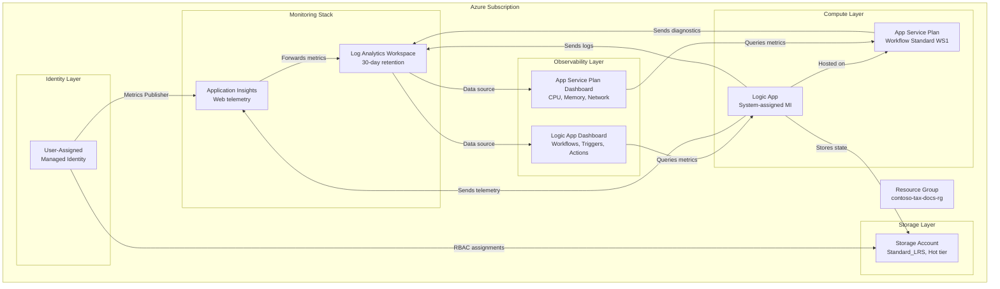
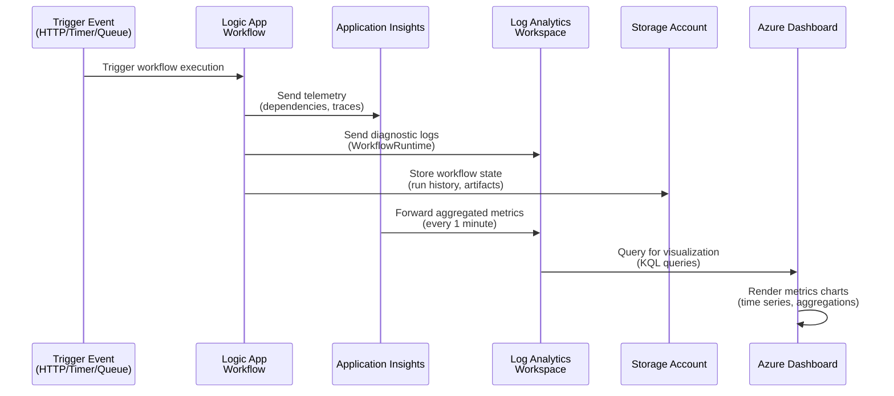

# Azure Logic Apps Monitoring

A comprehensive demonstration of **Azure Monitor** capabilities for **Azure Logic Apps** and **Workflows**. This project provides Infrastructure as Code (IaC) templates using Bicep, pre-configured Azure dashboards, diagnostic settings, and RBAC (Role-Based Access Control) configurations to help developers and cloud architects implement enterprise-grade monitoring and observability for production Logic Apps environments.

---

## Badges


---

## Features

### Comprehensive Monitoring

Full-stack observability ensures you can track every aspect of your Logic Apps workflows, from trigger execution to action completion, enabling proactive issue detection and rapid troubleshooting.

| Feature | Description |
|---------|-------------|
| **Diagnostic Settings for Logic Apps** | Automatically captures `WorkflowRuntime` logs and all metrics for detailed workflow execution tracking and debugging |
| **Diagnostic Settings for App Service Plans** | Monitors CPU percentage, memory percentage, HTTP queue length, and data transfer metrics to optimize resource allocation |
| **Log Analytics Workspace** | Centralized log repository with 30-day retention for historical analysis, compliance auditing, and troubleshooting |
| **Application Insights Integration** | Advanced telemetry collection for workflow performance monitoring, dependency tracking, and custom event instrumentation |

### Metrics & Telemetry

Real-time metrics and custom dashboards provide actionable insights into workflow health, performance bottlenecks, and capacity planning requirements.

| Feature | Description |
|---------|-------------|
| **Pre-configured Azure Dashboards** | Two production-ready dashboards: one for App Service Plan infrastructure metrics, one for Logic App workflow-level metrics |
| **Workflow Execution Metrics** | Tracks runs started, completed, dispatched, and failure rates across all workflows for health monitoring |
| **Action-Level Metrics** | Monitors individual action execution duration and failure rates for granular performance analysis and debugging |
| **Trigger Monitoring** | Analyzes trigger completion rates, failure rates, and latency patterns to identify integration issues |
| **Resource Performance Metrics** | Tracks CPU percentage, memory usage, data in/out, and HTTP queue length for infrastructure capacity planning |
| **Job Execution Duration** | Measures average workflow job execution time to identify performance degradation and optimization opportunities |

### Security & Compliance

Least-privilege security model using managed identities and granular RBAC assignments eliminates secrets management and enhances security posture.

| Feature | Description |
|---------|-------------|
| **System-Assigned Managed Identity for Logic Apps** | Eliminates credential management by using Azure AD (Azure Active Directory) authentication for secure resource access |
| **User-Assigned Managed Identity** | Dedicated identity with scoped permissions for accessing Azure Storage, Application Insights, and Log Analytics |
| **Storage Account RBAC** | Granular permissions for Blob Data Owner, Queue Data Contributor, Table Data Contributor, and File Data Privileged Contributor roles |
| **Monitoring Metrics Publisher Role** | Enables Logic Apps to publish custom metrics to Azure Monitor without requiring administrative privileges |
| **Diagnostic Settings Automation** | All resources automatically send logs and metrics to Log Analytics using infrastructure as code templates |

### Infrastructure as Code

Fully automated deployment using Azure Developer CLI (azd) with modular Bicep templates ensures consistent, repeatable provisioning across environments.

| Feature | Description |
|---------|-------------|
| **Modular Bicep Templates** | Reusable modules for monitoring, storage, Logic Apps, and dashboards following Azure Well-Architected Framework principles |
| **Azure Developer CLI (azd) Support** | One-command deployment with `azd up` for rapid environment provisioning and developer onboarding |
| **Environment Variable Substitution** | Configuration settings managed through `main.parameters.json` for environment-specific deployments |
| **Resource Tagging Strategy** | Comprehensive tagging (Solution, Environment, Owner, CostCenter, BusinessUnit) for cost tracking and governance |
| **Unique Resource Naming** | Automatic generation of globally unique names using `uniqueString()` function to prevent naming conflicts |

---

## Prerequisites

Before deploying this project, ensure you have the following tools and access:

### Required Tools

- **Azure Developer CLI (azd)** - [Install azd](https://learn.microsoft.com/azure/developer/azure-developer-cli/install-azd)
- **Azure CLI (az)** - [Install Azure CLI](https://learn.microsoft.com/cli/azure/install-azure-cli)
- **Bicep CLI** - Included with Azure CLI or [install standalone](https://learn.microsoft.com/azure/azure-resource-manager/bicep/install)

### Azure Subscription Requirements

- An active **Azure Subscription** with permissions to:
  - Create resource groups
  - Deploy Azure Logic Apps (Workflow Standard tier)
  - Create Azure Monitor resources (Log Analytics Workspace, Application Insights)
  - Assign RBAC roles at the resource scope
  - Create Storage Accounts and Azure Portal dashboards

### Recommended Tools

- **Visual Studio Code** with extensions:
  - [Bicep Extension](https://marketplace.visualstudio.com/items?itemName=ms-azuretools.vscode-bicep) - Syntax highlighting and IntelliSense for Bicep
  - [Azure Logic Apps Extension](https://marketplace.visualstudio.com/items?itemName=ms-azuretools.vscode-azurelogicapps) - Workflow development and testing

---

## Installation & Setup

This project uses **Azure Developer CLI (azd)** for streamlined deployment and environment management.

### Step 1: Clone the Repository

```bash
git clone https://github.com/yourusername/Azure-LogicApps-Monitoring.git
cd Azure-LogicApps-Monitoring
```

### Step 2: Authenticate to Azure

```bash
azd auth login
```

This opens a browser window for Azure authentication. Sign in with credentials that have Contributor access to your subscription.

### Step 3: Initialize Azure Developer CLI

```bash
azd init
```

When prompted:
- **Environment name**: Enter a unique name (e.g., `my-logicapps-monitoring-dev`)
- **Azure Subscription**: Select your target subscription
- **Azure Location**: Choose a region (e.g., `eastus2`)

### Step 4: Set Azure Location (Optional)

To explicitly set the deployment location:

```bash
azd env set AZURE_LOCATION eastus2
```

Replace `eastus2` with your preferred Azure region that supports Logic Apps Workflow Standard tier.

### Step 5: Deploy All Resources

```bash
azd up
```

This single command:
- Provisions a resource group named `contoso-tax-docs-rg`
- Deploys Log Analytics Workspace with 30-day retention
- Deploys Application Insights connected to Log Analytics
- Deploys Storage Account (Standard_LRS, Hot tier) with RBAC roles
- Deploys App Service Plan (Workflow Standard tier, WS1 SKU)
- Deploys Logic App with system-assigned managed identity
- Creates diagnostic settings for all resources
- Deploys two Azure Portal dashboards

**Deployment time**: Approximately 3-5 minutes.

### Step 6: Verify Deployment

```bash
azd show
```

This displays:
- Resource group name
- Deployed resource names
- Output values (Log Analytics Workspace ID, Application Insights connection string, Storage Account name)

---

## Usage Examples

### Accessing Azure Portal Dashboards

After deployment, view pre-configured dashboards:

1. Navigate to the [Azure Portal](https://portal.azure.com)
2. Go to **Dashboard Hub** (search "Dashboards" in the top search bar)
3. Look for dashboards named:
   - **`tax-docs-{uniqueId}-asp-dashboard`** - App Service Plan metrics (CPU, memory, data transfer, HTTP queue)
   - **`tax-docs-dashboard`** - Logic App workflow metrics (runs, triggers, actions, failures)
4. Pin important metrics to your personal dashboard for quick access

### Viewing Logic App Logs in Log Analytics

Navigate to your Log Analytics Workspace and run KQL (Kusto Query Language) queries:

```kql
// View all Logic App workflow runs in the last 24 hours
AzureDiagnostics
| where ResourceProvider == "MICROSOFT.WEB" 
| where Category == "WorkflowRuntime"
| where TimeGenerated > ago(24h)
| project TimeGenerated, resource_workflowName_s, resource_runId_s, status_s, resource_actionName_s
| order by TimeGenerated desc
```

```kql
// Track workflow execution failures
AzureDiagnostics
| where Category == "WorkflowRuntime"
| where status_s == "Failed"
| summarize FailureCount = count() by resource_workflowName_s, bin(TimeGenerated, 1h)
| order by TimeGenerated desc
```

### Monitoring Workflow Metrics in Azure Portal

1. Navigate to your Logic App resource in the Azure Portal
2. Select **Metrics** from the left navigation menu
3. Click **Add metric** and select:
   - `WorkflowRunsStarted` - Total workflow executions initiated
   - `WorkflowRunsCompleted` - Successfully completed workflow runs
   - `WorkflowRunsFailureRate` - Percentage of failed runs (critical for SLA monitoring)
   - `WorkflowJobExecutionDuration` - Average execution time for performance tracking
4. Set time range to **Last 24 hours** and apply filters by workflow name if needed
5. Click **Pin to dashboard** to add metrics to your main dashboard

### Querying Application Insights Telemetry

Navigate to Application Insights and run queries:

```kql
// Track Logic App dependencies and response times
dependencies
| where cloud_RoleName contains "logicapp"
| summarize avg(duration), count() by name, resultCode
| order by avg_duration desc
```

### Triggering a Test Workflow

To test monitoring capabilities:

1. Navigate to your Logic App in the Azure Portal
2. Select **Workflows** from the left menu
3. Create a simple workflow with an HTTP trigger
4. Click **Run Trigger** → **Manual**
5. Monitor execution in:
   - **Run History** tab
   - Log Analytics Workspace (query shown above)
   - Azure Dashboard metrics

---

## Architecture

### System Architecture


```mermaid
flowchart TB
    subgraph Azure Subscription
        RG[Resource Group<br/>contoso-tax-docs-rg]
        
        subgraph Monitoring Stack
            LAW[Log Analytics Workspace<br/>30-day retention]
            AI[Application Insights<br/>Web telemetry]
        end
        
        subgraph Compute Layer
            ASP[App Service Plan<br/>Workflow Standard WS1]
            LA[Logic App<br/>System-assigned MI]
        end
        
        subgraph Storage Layer
            SA[Storage Account<br/>Standard_LRS, Hot tier]
        end
        
        subgraph Observability Layer
            D1[App Service Plan Dashboard<br/>CPU, Memory, Network]
            D2[Logic App Dashboard<br/>Workflows, Triggers, Actions]
        end
        
        subgraph Identity Layer
            UMI[User-Assigned<br/>Managed Identity]
        end
    end
    
    LA -->|Hosted on| ASP
    LA -->|Sends telemetry| AI
    LA -->|Sends logs| LAW
    LA -->|Stores state| SA
    ASP -->|Sends diagnostics| LAW
    AI -->|Forwards metrics| LAW
    UMI -->|RBAC assignments| SA
    UMI -->|Metrics Publisher| AI
    D1 -->|Queries metrics| ASP
    D2 -->|Queries metrics| LA
    LAW -->|Data source| D1
    LAW -->|Data source| D2
```

### Data Flow


```mermaid
sequenceDiagram
    participant T as Trigger Event<br/>(HTTP/Timer/Queue)
    participant LA as Logic App<br/>Workflow
    participant AI as Application Insights
    participant LAW as Log Analytics<br/>Workspace
    participant SA as Storage Account
    participant D as Azure Dashboard
    
    T->>LA: Trigger workflow execution
    LA->>AI: Send telemetry<br/>(dependencies, traces)
    LA->>LAW: Send diagnostic logs<br/>(WorkflowRuntime)
    LA->>SA: Store workflow state<br/>(run history, artifacts)
    AI->>LAW: Forward aggregated metrics<br/>(every 1 minute)
    LAW->>D: Query for visualization<br/>(KQL queries)
    D->>D: Render metrics charts<br/>(time series, aggregations)
```

### Key Components

| Component | Description | Purpose | Key Features |
|-----------|-------------|---------|--------------|
| **Log Analytics Workspace** | Centralized logging and analytics platform | Stores all diagnostic logs, metrics, and telemetry for querying and alerting | 30-day retention, PerGB2018 pricing tier, system-assigned identity, immediatePurgeDataOn30Days enabled |
| **Application Insights** | Application performance monitoring (APM) service | Tracks telemetry, dependencies, request/response times, and custom events | Connected to Log Analytics, web application type, instrumentation key and connection string outputs |
| **Logic App (Workflow Standard)** | Serverless workflow orchestration engine | Executes business logic, integrations, and automation workflows | System-assigned managed identity, diagnostic settings enabled, FUNCTIONS_EXTENSION_VERSION ~4 |
| **App Service Plan (WS1)** | Hosting infrastructure for Logic Apps | Provides dedicated compute resources with elastic scaling capabilities | Workflow Standard tier, elastic scale enabled, maximum 20 workers, zone redundancy support |
| **Storage Account** | Persistent storage for workflow state | Stores workflow runtime state, run history, and artifacts | Standard_LRS replication, Hot access tier, HTTPS-only traffic, unique naming with 24-character limit |
| **User-Assigned Managed Identity** | Azure AD security principal | Provides identity for accessing Azure resources without managing credentials | Assigned RBAC roles for Storage Account, Application Insights, and Log Analytics access |
| **Azure Portal Dashboards** | Visual monitoring and observability interface | Displays real-time metrics, charts, and KPIs for monitoring workflow health | Pre-configured with 9 workflow metrics and 6 App Service Plan metrics, 24-hour time range default |

### Deployed RBAC Roles

| Role Name | Role Description | Documentation Link |
|-----------|------------------|-------------------|
| **Storage Account Contributor** | Manage storage accounts, but not access to data within accounts | [Docs](https://learn.microsoft.com/azure/role-based-access-control/built-in-roles#storage-account-contributor) |
| **Storage Blob Data Owner** | Full access to Azure Storage blob containers and data, including assigning POSIX access control | [Docs](https://learn.microsoft.com/azure/role-based-access-control/built-in-roles#storage-blob-data-owner) |
| **Storage Queue Data Contributor** | Read, write, and delete Azure Storage queues and queue messages | [Docs](https://learn.microsoft.com/azure/role-based-access-control/built-in-roles#storage-queue-data-contributor) |
| **Storage Table Data Contributor** | Read, write, and delete Azure Storage tables and entities | [Docs](https://learn.microsoft.com/azure/role-based-access-control/built-in-roles#storage-table-data-contributor) |
| **Storage File Data Privileged Contributor** | Read, write, delete, and modify ACLs on files and directories in Azure file shares | [Docs](https://learn.microsoft.com/azure/role-based-access-control/built-in-roles#storage-file-data-privileged-contributor) |
| **Storage File Data SMB MI Admin** | Allows for read, write, delete and modify NTFS permission access in Azure file shares with managed identity | [Docs](https://learn.microsoft.com/azure/role-based-access-control/built-in-roles#storage-file-data-smb-share-elevated-contributor) |
| **Storage File Data SMB Share Contributor** | Read, write, and delete access on files and directories in Azure file shares via SMB | [Docs](https://learn.microsoft.com/azure/role-based-access-control/built-in-roles#storage-file-data-smb-share-contributor) |
| **Storage File Data SMB Share Elevated Contributor** | Read, write, delete, and modify ACLs on files and directories in Azure file shares via SMB | [Docs](https://learn.microsoft.com/azure/role-based-access-control/built-in-roles#storage-file-data-smb-share-elevated-contributor) |
| **Monitoring Metrics Publisher** | Enables publishing metrics against Azure resources, allowing Logic Apps to send custom metrics to Azure Monitor | [Docs](https://learn.microsoft.com/azure/role-based-access-control/built-in-roles#monitoring-metrics-publisher) |

---

## File Structure

```
Azure-LogicApps-Monitoring/
├── .gitignore
├── azure.yaml
├── CODE_OF_CONDUCT.md
├── CONTRIBUTING.md
├── LICENSE.md
├── README.md
├── SECURITY.md
├── infra/
│   ├── main.bicep
│   └── main.parameters.json
└── src/
    ├── logic-app.bicep
    ├── monitoring/
    │   ├── main.bicep
    │   ├── app-insights.bicep
    │   └── log-analytics-workspace.bicep
    └── shared/
        ├── main.bicep
        └── data/
            └── main.bicep
```

### Key Files Explained

| Name | File | Path | Description |
|------|------|------|-------------|
| **Azure Developer CLI Config** | `azure.yaml` | `/azure.yaml` | Azure Developer CLI project configuration defining solution name `azure-logicapps-monitoring` |
| **Main Orchestration Template** | `main.bicep` | `/infra/main.bicep` | Main entry point for deployment at subscription scope; creates resource group `contoso-tax-docs-rg` and orchestrates all modules with comprehensive tagging strategy (Solution, Environment, Owner, CostCenter, BusinessUnit, ApplicationName) |
| **Deployment Parameters** | `main.parameters.json` | `/infra/main.parameters.json` | Parameter file for setting Azure location using environment variable substitution `${AZURE_LOCATION}` |
| **Logic App Infrastructure** | `logic-app.bicep` | `/src/logic-app.bicep` | Defines Logic App with system-assigned managed identity, App Service Plan (WS1 tier with elastic scaling up to 20 workers), diagnostic settings capturing WorkflowRuntime logs and AllMetrics, and two Azure Portal dashboards with pre-configured metrics charts |
| **Monitoring Orchestration** | `main.bicep` | `/src/monitoring/main.bicep` | Orchestrates deployment of Log Analytics Workspace and Application Insights, passing service principal ID for RBAC assignments |
| **Log Analytics Workspace** | `log-analytics-workspace.bicep` | `/src/monitoring/log-analytics-workspace.bicep` | Creates Log Analytics Workspace with PerGB2018 pricing tier, 30-day retention, system-assigned identity, and immediatePurgeDataOn30Days feature enabled |
| **Application Insights** | `app-insights.bicep` | `/src/monitoring/app-insights.bicep` | Deploys Application Insights (web type) connected to Log Analytics Workspace, assigns Monitoring Metrics Publisher role to user-assigned managed identity, and enables diagnostic settings for allLogs and AllMetrics categories |
| **Shared Resources Orchestration** | `main.bicep` | `/src/shared/main.bicep` | Creates user-assigned managed identity with unique naming, orchestrates data and monitoring module deployments, outputs Storage Account name, Log Analytics Workspace ID, and Application Insights connection strings |
| **Storage Account with RBAC** | `main.bicep` | `/src/shared/data/main.bicep` | Deploys Storage Account (Standard_LRS, StorageV2, Hot tier, HTTPS-only) with unique naming (24-character limit), assigns 9 RBAC roles (Storage Account Contributor, Blob Data Owner, Queue Data Contributor, Table Data Contributor, File Data Privileged Contributor, File Data SMB roles, Monitoring Metrics Publisher) to user-assigned managed identity |

---

## Additional Resources

### Azure Logic Apps Documentation
- [Azure Logic Apps Overview](https://learn.microsoft.com/azure/logic-apps/logic-apps-overview) - Introduction to serverless workflow automation
- [Logic Apps Standard tier](https://learn.microsoft.com/azure/logic-apps/single-tenant-overview-compare) - Single-tenant hosting model for enterprise scenarios
- [Monitor Logic Apps with Azure Monitor](https://learn.microsoft.com/azure/logic-apps/monitor-logic-apps-log-analytics) - Best practices for monitoring and diagnostics

### Azure Monitor Documentation
- [Azure Monitor Overview](https://learn.microsoft.com/azure/azure-monitor/overview) - Comprehensive observability platform
- [Log Analytics Workspace design](https://learn.microsoft.com/azure/azure-monitor/logs/workspace-design) - Architecture and design considerations
- [Application Insights for serverless apps](https://learn.microsoft.com/azure/azure-monitor/app/azure-functions) - APM for serverless workloads
- [KQL Query Language Reference](https://learn.microsoft.com/azure/data-explorer/kusto/query/) - Kusto Query Language documentation

### Infrastructure as Code
- [Azure Developer CLI Documentation](https://learn.microsoft.com/azure/developer/azure-developer-cli/) - Modern developer workflow for Azure
- [Bicep Language Reference](https://learn.microsoft.com/azure/azure-resource-manager/bicep/) - Declarative infrastructure as code
- [Azure Bicep Best Practices](https://learn.microsoft.com/azure/azure-resource-manager/bicep/best-practices) - Recommended patterns and practices

### Security & Compliance
- [Managed Identities Overview](https://learn.microsoft.com/azure/active-directory/managed-identities-azure-resources/overview) - Eliminate credential management
- [Azure RBAC Best Practices](https://learn.microsoft.com/azure/role-based-access-control/best-practices) - Least-privilege access principles

---

## Support

For questions or issues:

- **GitHub Issues**: Open an [issue](https://github.com/yourusername/Azure-LogicApps-Monitoring/issues) for bugs or feature requests
- **Discussions**: Check existing [discussions](https://github.com/yourusername/Azure-LogicApps-Monitoring/discussions) for Q&A
- **Azure Logic Apps FAQ**: Review the [official FAQ](https://learn.microsoft.com/azure/logic-apps/logic-apps-faq)
- **Azure Support**: For production issues, contact [Azure Support](https://azure.microsoft.com/support/options/)

---

## Contributing

Contributions are welcome! Please read our [CONTRIBUTING.md](CONTRIBUTING.md) for details on our code of conduct and the process for submitting pull requests.

When contributing:
- Follow Azure Bicep best practices
- Test deployments in a dev subscription before submitting PRs
- Update documentation for new features
- Add diagnostic settings for any new Azure resources

---

## License

This project is licensed under the MIT License - see the [LICENSE.md](LICENSE.md) file for details.

---

## Security

Please review our [SECURITY.md](SECURITY.md) for information on reporting security vulnerabilities. Do not open public GitHub issues for security concerns.

---

**Built with ❤️ for the Azure community**