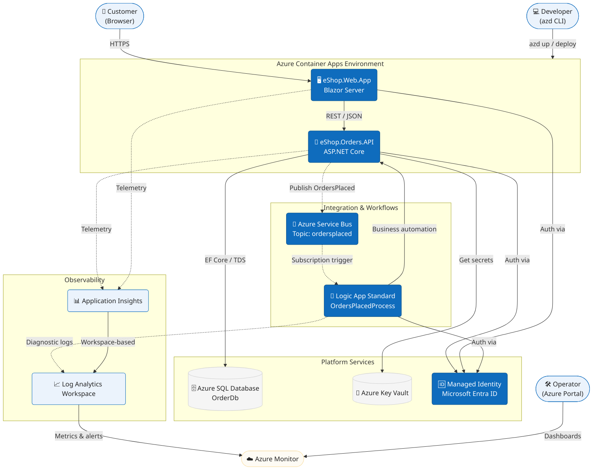

# Azure Logic Apps Monitoring

[](https://github.com/Evilazaro/Azure-LogicApps-Monitoring/actions)
[](LICENSE)
[](azure.yaml)
[](src/tests)

## Description

The **Azure Logic Apps Monitoring** solution is a reference implementation that demonstrates how to orchestrate, observe, and operate an event-driven order-processing workload built on **.NET Aspire**, **Azure Container Apps**, **Azure Service Bus**, **Azure SQL Database**, and **Azure Logic Apps (Standard)**. It uses an `eShop` sample domain (orders API and Blazor web app) to publish `OrdersPlaced` events that downstream Logic Apps workflows consume for business automation.

The solution solves the problem of building a production-grade, observable distributed system on Azure without hand-wiring infrastructure, identity, telemetry, and messaging. It centralizes deployment through the **Azure Developer CLI (azd)**, provisions resources via **Bicep** with **Managed Identity** for service-to-service authentication, and surfaces unified telemetry through **Azure Application Insights**.

The technology stack is built on **.NET 10**, **.NET Aspire** orchestration, **ASP.NET Core Web API**, **Blazor Server**, **Entity Framework Core**, **Azure Logic Apps Standard** workflows, **Bicep** Infrastructure-as-Code, and **GitHub Actions** for CI/CD with OIDC federated credentials.

## Table of Contents

- [Features](#features)
- [Architecture](#architecture)
- [Technologies Used](#technologies-used)
- [Quick Start](#quick-start)
- [Configuration](#configuration)
- [Deployment](#deployment)
- [Usage](#usage)
- [Contributing](#contributing)
- [License](#license)

## Features

- 🧩 **.NET Aspire orchestration** of the `orders-api` and `web-app` services with service discovery and health checks.
- 📦 **Order management REST API** (`eShop.Orders.API`) backed by Entity Framework Core and Azure SQL Database.
- 🖥️ **Blazor Server web app** (`eShop.Web.App`) with Fluent UI components for placing and reviewing orders.
- 📨 **Event publishing to Azure Service Bus** topics (`ordersplaced`) with managed-identity authentication.
- 🔁 **Azure Logic Apps Standard workflows** (`OrdersPlacedProcess`, `OrdersPlacedCompleteProcess`) for business automation.
- 🔍 **End-to-end observability** with OpenTelemetry traces, metrics, and logs streamed to Application Insights.
- 🔐 **Managed Identity** and **Microsoft Entra ID** authentication across SQL, Service Bus, and Key Vault — no secrets in code.
- 🧱 **Bicep Infrastructure-as-Code** organized into `shared/` (network, identity, monitoring, data) and `workload/` modules.
- ⚙️ **azd lifecycle hooks** (PowerShell + Bash) for preprovision validation, secret hydration, and federated-credential setup.
- 🧪 **xUnit test suites** for AppHost, ServiceDefaults, Orders API, and Web App with TRX and Cobertura coverage output.

## Architecture


```mermaid
---
config:
  primaryColor: "#0f6cbd"
  primaryTextColor: "#FFFFFF"
  primaryBorderColor: "#0f548c"
  secondaryColor: "#ebf3fc"
  secondaryTextColor: "#242424"
  secondaryBorderColor: "#0f6cbd"
  tertiaryColor: "#f5f5f5"
  tertiaryTextColor: "#424242"
  tertiaryBorderColor: "#d1d1d1"
  noteBkgColor: "#fefbf4"
  noteTextColor: "#242424"
  noteBorderColor: "#f9e2ae"
  lineColor: "#616161"
  background: "#FFFFFF"
  edgeLabelBackground: "#FFFFFF"
  clusterBkg: "#fafafa"
  clusterBorder: "#e0e0e0"
  titleColor: "#242424"
  errorBkgColor: "#fdf3f4"
  errorTextColor: "#b10e1c"
  fontFamily: "Segoe UI, Verdana, sans-serif"
  fontSize: 16
  align: center
  description: "High-level architecture for the Azure Logic Apps Monitoring solution."
---
flowchart TB
  %% Actors
  customer(["👤 Customer<br/>(Browser)"])
  operator(["🛠️ Operator<br/>(Azure Portal)"])
  developer(["💻 Developer<br/>(azd CLI)"])

  %% Frontend & API in Container Apps
  subgraph aca["Azure Container Apps Environment"]
    web("🖥️ eShop.Web.App<br/>Blazor Server")
    api("🧩 eShop.Orders.API<br/>ASP.NET Core")
  end

  %% Messaging & Workflow
  subgraph integration["Integration & Workflows"]
    sbus("📨 Azure Service Bus<br/>Topic: ordersplaced")
    logic("🔁 Logic App Standard<br/>OrdersPlacedProcess")
  end

  %% Data & Identity
  subgraph platform["Platform Services"]
    sql[("🗄️ Azure SQL Database<br/>OrderDb")]
    kv[("🔐 Azure Key Vault")]
    mi("🆔 Managed Identity<br/>Microsoft Entra ID")
  end

  %% Observability
  subgraph obs["Observability"]
    appi("📊 Application Insights")
    law("📈 Log Analytics Workspace")
  end

  %% External
  azmon(["☁️ Azure Monitor"])

  %% Flows
  customer -->|HTTPS| web
  web -->|REST / JSON| api
  api -->|EF Core / TDS| sql
  api -.->|Publish OrdersPlaced| sbus
  sbus -.->|Subscription trigger| logic
  logic -->|Business automation| api
  api -->|Get secrets| kv
  api -->|Auth via| mi
  web -->|Auth via| mi
  logic -->|Auth via| mi
  api -.->|Telemetry| appi
  web -.->|Telemetry| appi
  logic -.->|Diagnostic logs| law
  appi -->|Workspace-based| law
  law -->|Metrics & alerts| azmon
  operator -->|Dashboards| azmon
  developer -->|azd up / deploy| aca

  %% Styles
  classDef actor fill:#ebf3fc,stroke:#0f6cbd,color:#242424;
  classDef service fill:#0f6cbd,stroke:#0f548c,color:#FFFFFF;
  classDef data fill:#f5f5f5,stroke:#d1d1d1,color:#242424;
  classDef ext fill:#fefbf4,stroke:#f9e2ae,color:#242424;
  classDef obs fill:#ebf3fc,stroke:#0f6cbd,color:#242424;

  class customer,operator,developer actor;
  class web,api,logic,sbus,mi service;
  class sql,kv data;
  class azmon ext;
  class appi,law obs;
```

## Technologies Used

| Technology                   | Type                    | Purpose                                                          |
| ---------------------------- | ----------------------- | ---------------------------------------------------------------- |
| .NET 10                      | Runtime / SDK           | Builds and runs all services (`global.json` pins `10.0.100`).    |
| .NET Aspire                  | Orchestration framework | Wires services, telemetry, and Azure resources in `app.AppHost`. |
| ASP.NET Core Web API         | Web framework           | Hosts the `eShop.Orders.API` REST service.                       |
| Blazor Server + Fluent UI    | UI framework            | Powers the `eShop.Web.App` interactive frontend.                 |
| Entity Framework Core        | ORM                     | Persists orders to Azure SQL Database.                           |
| Azure Container Apps         | Compute platform        | Runs the orders API and web app as managed containers.           |
| Azure SQL Database           | Relational datastore    | Stores order data with Entra ID authentication.                  |
| Azure Service Bus (Standard) | Messaging               | Publishes `ordersplaced` events to subscribers.                  |
| Azure Logic Apps Standard    | Workflow engine         | Hosts `OrdersPlacedProcess` business workflows.                  |
| Azure Key Vault              | Secrets management      | Centralizes secrets accessed via Managed Identity.               |
| Azure Application Insights   | APM / telemetry         | Collects traces, metrics, and logs.                              |
| Azure Log Analytics          | Log platform            | Backs Application Insights and Logic Apps diagnostics.           |
| Microsoft Entra ID           | Identity provider       | Issues tokens for Managed Identity authentication.               |
| Bicep                        | Infrastructure-as-Code  | Declarative provisioning under `infra/`.                         |
| Azure Developer CLI (azd)    | Deployment tooling      | Drives `azd up`, `azd deploy`, and lifecycle hooks.              |
| GitHub Actions               | CI/CD                   | Federated OIDC deployment workflow.                              |
| xUnit                        | Test framework          | Unit tests under `src/tests/`.                                   |

## Quick Start

### Prerequisites

| Tool                        | Minimum Version | Purpose                                                         |
| --------------------------- | --------------- | --------------------------------------------------------------- |
| .NET SDK                    | `10.0.100`      | Build and run the solution.                                     |
| Azure Developer CLI (`azd`) | `1.11.0`        | Provision and deploy.                                           |
| Azure CLI (`az`)            | `2.60.0`        | Sign in and manage Azure resources.                             |
| Docker Desktop              | Latest          | Run the SQL Server and Service Bus emulator containers locally. |
| PowerShell 7 or Bash        | Latest          | Execute azd lifecycle hooks.                                    |

### Installation

1. Clone the repository:

   ```bash
   git clone https://github.com/Evilazaro/Azure-LogicApps-Monitoring.git
   cd Azure-LogicApps-Monitoring
   ```

2. Restore and build the solution:

   ```bash
   dotnet restore
   dotnet build --configuration Debug
   ```

3. Run the .NET Aspire AppHost (uses local SQL and Service Bus emulator containers):

   ```bash
   dotnet run --project app.AppHost
   ```

   The Aspire dashboard URL is printed in the console output.

> [!TIP]
> The first launch downloads SQL Server and Service Bus emulator container images, which can take several minutes.

## Configuration

Configuration is sourced from `appsettings.json`, environment variables, and azd environment values. The most important keys consumed by `app.AppHost/AppHost.cs` are:

| Option                              | Default              | Description                                                             |
| ----------------------------------- | -------------------- | ----------------------------------------------------------------------- |
| `Azure:ResourceGroup`               | _(none)_             | Resource group name; required when binding to existing Azure resources. |
| `Azure:ApplicationInsights:Name`    | _(none)_             | Existing Application Insights resource to attach for telemetry.         |
| `Azure:ServiceBus:HostName`         | `localhost`          | Service Bus FQDN; `localhost` enables the local emulator.               |
| `Azure:ServiceBus:TopicName`        | `ordersplaced`       | Topic used for order events.                                            |
| `Azure:ServiceBus:SubscriptionName` | `orderprocessingsub` | Subscription consumed by the Logic App.                                 |
| `Azure:SqlServer:Name`              | `OrdersDatabase`     | Azure SQL logical server name; default triggers a local container.      |
| `Azure:SqlServer:DatabaseName`      | `OrderDb`            | Database name created by EF Core migrations.                            |
| `Azure:TenantId`                    | _(none)_             | Tenant override for local Azure CLI credentials.                        |
| `Azure:ClientId`                    | _(none)_             | Client ID override for local Managed Identity emulation.                |

Example override using `azd` environment variables:

```bash
azd env set AZURE_RESOURCE_GROUP rg-logicapps-monitoring-dev
azd env set AZURE_SERVICEBUS_HOSTNAME sb-logicapps-mon.servicebus.windows.net
azd env set AZURE_SQLSERVER_NAME sql-logicapps-mon
```

## Deployment

1. Authenticate with Azure:

   ```bash
   azd auth login
   az login
   ```

2. Create a new azd environment:

   ```bash
   azd env new logicapps-monitoring-dev
   ```

3. Provision and deploy infrastructure plus services:

   ```bash
   azd up
   ```

   This runs the `preprovision` hook (build + tests), deploys `infra/main.bicep`, then deploys `orders-api` and `web-app` as Azure Container Apps and runs the `postprovision` hook to seed local secrets.

4. Configure GitHub Actions federated credentials for CI/CD:

   ```bash
   pwsh ./hooks/configure-federated-credential.ps1
   pwsh ./hooks/deploy-workflow.ps1
   ```

5. Tear down all resources when finished:

   ```bash
   azd down --purge
   ```

> [!IMPORTANT]
> The preprovision hook runs `dotnet test` and aborts deployment on failure to prevent provisioning broken builds.

## Usage

Send a `POST` request to the orders API to create an order, which publishes an `OrdersPlaced` message to Service Bus:

```bash
curl -X POST "https://<orders-api-fqdn>/api/orders" \
  -H "Content-Type: application/json" \
  -d '{
        "customerId": "11111111-1111-1111-1111-111111111111",
        "items": [
          { "productId": "SKU-001", "quantity": 2, "unitPrice": 19.99 }
        ]
      }'

# Expected output:
# HTTP/1.1 201 Created
# Location: /api/orders/<new-order-id>
# { "id": "<new-order-id>", "status": "Placed", "total": 39.98 }
```

Open the Blazor web app at the URL printed by the Aspire dashboard, navigate to **Orders**, and submit an order using the Fluent UI form. The Logic App `OrdersPlacedProcess` workflow under [workflows/OrdersManagement](workflows/OrdersManagement) is triggered by the resulting Service Bus message and writes diagnostics to Log Analytics.

## Contributing

Community contributions are welcome and encouraged.

1. Fork the repository and create a feature branch.
2. Run `dotnet test` locally and ensure all tests pass.
3. Open a pull request describing the change and referencing any related issue.
4. For bug reports and feature requests, open a GitHub issue with reproduction steps and environment details.

If a `CONTRIBUTING.md` or `CODE-OF-CONDUCT.md` is added to the repository in the future, please follow the guidance there.

## License

This project is released under the **MIT License**. See [LICENSE](LICENSE) for the full text.
