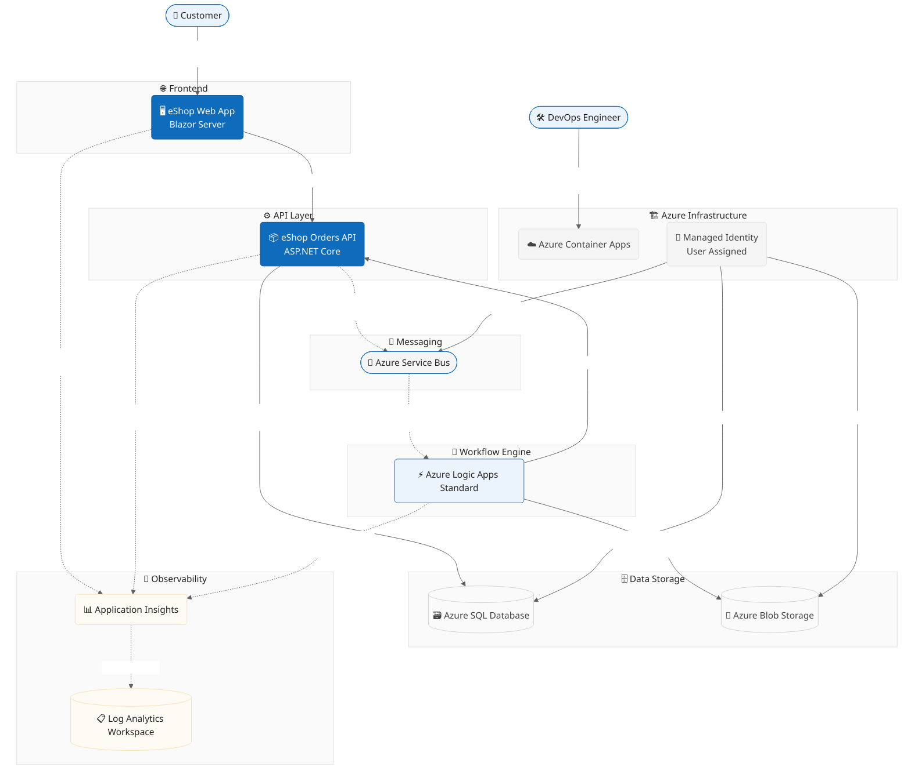

# Azure Logic Apps Monitoring

[](https://github.com/Evilazaro/Azure-LogicApps-Monitoring/actions/workflows/ci-dotnet.yml)
[](https://github.com/Evilazaro/Azure-LogicApps-Monitoring/actions/workflows/azure-dev.yml)
[](LICENSE)
[](https://dotnet.microsoft.com/)
[](https://azure.microsoft.com/products/logic-apps)

**Azure Logic Apps Monitoring** is a complete eShop order management reference solution that demonstrates end-to-end observability, event-driven processing, and cloud-native deployment patterns on Azure. It combines a Blazor Server frontend, an ASP.NET Core REST API, and Azure Logic Apps Standard workflows into a single, fully integrated system built on .NET 10.

Modern distributed applications require coordinated monitoring across service boundaries. This solution solves that challenge by providing a reference architecture that correlates **OpenTelemetry** traces, metrics, and logs from every component—Blazor Server frontend, REST API, and Logic Apps Standard workflows—in a unified Application Insights and Log Analytics plane, enabling rapid root-cause analysis and proactive alerting without switching between tools.

The solution is built on **.NET 10**, ASP.NET Core, and Blazor Server, orchestrated locally by .NET Aspire and deployed to Azure Container Apps using the Azure Developer CLI (`azd`) with Bicep infrastructure-as-code. Azure Service Bus drives asynchronous event-driven order processing, Azure SQL Database provides durable persistence via Entity Framework Core 9, and Azure Blob Storage archives completed workflow results.

## Table of Contents

- [Features](#features)
- [Architecture](#architecture)
- [Technologies Used](#technologies-used)
- [Quick Start](#quick-start)
- [Configuration](#configuration)
- [Deployment](#deployment)
- [Usage](#usage)
- [Contributing](#contributing)
- [License](#license)

## Features

- 🛒 **Order management UI** built with Blazor Server interactive server-side rendering and Microsoft Fluent UI v9 components
- 📦 **RESTful Orders API** with OpenAPI/Swagger documentation, EF Core persistence, and connection resiliency
- ⚡ **Event-driven order processing** via Azure Logic Apps Standard workflow engine with success and error branching
- 🚌 **Asynchronous messaging** with Azure Service Bus topic subscriptions for decoupled order event delivery
- 🗃️ **Durable order persistence** using Entity Framework Core 9 with Azure SQL Database and retry-on-failure policies
- 📂 **Workflow result archiving** to Azure Blob Storage in separate success and error containers
- 📊 **End-to-end observability** with Application Insights, Log Analytics Workspace, and OpenTelemetry distributed tracing
- 🔑 **Passwordless authentication** using User Assigned Managed Identity across Azure Service Bus, SQL Database, and Blob Storage
- ☁️ **Cloud-native hosting** on Azure Container Apps with VNet integration and private endpoints
- 🏗️ **Local development** with .NET Aspire orchestration, service discovery, and Service Bus emulator fallback
- 🚀 **One-command provisioning** via `azd up` backed by modular Bicep infrastructure-as-code
- 🔄 **CI/CD pipelines** with GitHub Actions including cross-platform builds, code coverage, and CodeQL security scanning

## Architecture

The following diagram shows the high-level architecture of the Azure Logic Apps Monitoring solution, including actors, components, and primary data flows. Solid arrows (`→`) indicate synchronous interactions; dashed arrows (`⤳`) indicate asynchronous or event-driven interactions.


```mermaid
---
config:
  description: "High-level architecture diagram showing actors, primary flows, and major components."
  theme: base
  align: center
  fontFamily: "Segoe UI, Verdana, sans-serif"
  fontSize: 16
  themeVariables:
    primaryColor: "#0f6cbd"           # colorBrandBackground (brandWeb[80])
    primaryTextColor: "#FFFFFF"       # colorNeutralForegroundOnBrand
    primaryBorderColor: "#0f548c"     # colorBrandBackground3Static (brandWeb[60])
    secondaryColor: "#ebf3fc"         # colorBrandBackground2 (brandWeb[160])
    secondaryTextColor: "#242424"     # colorNeutralForeground1 (grey[14])
    secondaryBorderColor: "#0f6cbd"   # colorBrandStroke1 (brandWeb[80])
    tertiaryColor: "#f5f5f5"          # colorNeutralBackground3 (grey[96])
    tertiaryTextColor: "#424242"      # colorNeutralForeground2 (grey[26])
    tertiaryBorderColor: "#d1d1d1"    # colorNeutralStroke1 (grey[82])
    noteBkgColor: "#fefbf4"           # colorPaletteMarigoldBackground1 (marigold.tint60)
    noteTextColor: "#242424"          # colorNeutralForeground1 (grey[14])
    noteBorderColor: "#f9e2ae"        # colorPaletteMarigoldBorder1 (marigold.tint40)
    lineColor: "#616161"              # colorNeutralStrokeAccessible (grey[38])
    background: "#FFFFFF"             # colorNeutralBackground1
    edgeLabelBackground: "#FFFFFF"    # colorNeutralBackground1
    clusterBkg: "#fafafa"             # colorNeutralBackground2 (grey[98])
    clusterBorder: "#e0e0e0"          # colorNeutralStroke2 (grey[88])
    titleColor: "#242424"             # colorNeutralForeground1 (grey[14])
    errorBkgColor: "#fdf3f4"          # colorStatusDangerBackground1 (cranberry.tint60)
    errorTextColor: "#b10e1c"         # colorStatusDangerForeground1 (cranberry.shade10)
---
flowchart TB

%% ─── Actors ─────────────────────────────────────────────────
  Customer(["👤 Customer"])
  DevOps(["🛠️ DevOps Engineer"])

%% ─── Frontend Layer ─────────────────────────────────────────
  subgraph FrontendLayer["🌐 Frontend"]
    WebApp("🖥️ eShop Web App<br/>Blazor Server")
  end

%% ─── API Layer ──────────────────────────────────────────────
  subgraph APILayer["⚙️ API Layer"]
    OrdersAPI("📦 eShop Orders API<br/>ASP.NET Core")
  end

%% ─── Messaging Layer ────────────────────────────────────────
  subgraph MessagingLayer["📨 Messaging"]
    ServiceBus(["🚌 Azure Service Bus"])
  end

%% ─── Workflow Layer ─────────────────────────────────────────
  subgraph WorkflowLayer["🔄 Workflow Engine"]
    LogicApps("⚡ Azure Logic Apps Standard")
  end

%% ─── Data Layer ─────────────────────────────────────────────
  subgraph DataLayer["🗄️ Data Storage"]
    SqlDb[("🗃️ Azure SQL Database")]
    BlobStorage[("📂 Azure Blob Storage")]
  end

%% ─── Observability Layer ─────────────────────────────────────
  subgraph ObservabilityLayer["🔭 Observability"]
    AppInsights("📊 Application Insights")
    LogAnalytics[("📋 Log Analytics Workspace")]
  end

%% ─── Infrastructure Layer ────────────────────────────────────
  subgraph InfraLayer["🏗️ Azure Infrastructure"]
    ContainerApps("☁️ Azure Container Apps")
    ManagedIdentity("🔑 Managed Identity<br/>User Assigned")
  end

%% ─── Interactions ────────────────────────────────────────────
  Customer -->|"HTTP/HTTPS: Browse and Place Order"| WebApp
  DevOps -->|"azd up: Provision and Deploy"| ContainerApps
  WebApp -->|"REST HTTP: Submit Order"| OrdersAPI
  OrdersAPI -->|"SQL via EF Core: Persist Order"| SqlDb
  OrdersAPI -.->|"Publish Event: Order Placed"| ServiceBus
  ServiceBus -.->|"Topic Subscription: Trigger Workflow"| LogicApps
  LogicApps -->|"HTTP POST: Process Order"| OrdersAPI
  LogicApps -->|"API Connection: Archive Result"| BlobStorage
  WebApp -.->|"OpenTelemetry: Traces and Metrics"| AppInsights
  OrdersAPI -.->|"OpenTelemetry: Traces and Metrics"| AppInsights
  LogicApps -.->|"Diagnostic Logs and Metrics"| AppInsights
  AppInsights -.->|"Log Ingestion"| LogAnalytics
  ManagedIdentity -->|"Passwordless Auth"| ServiceBus
  ManagedIdentity -->|"Passwordless Auth"| BlobStorage
  ManagedIdentity -->|"Passwordless Auth"| SqlDb

%% ─── Class Definitions ───────────────────────────────────────
  classDef actorStyle fill:#ebf3fc,stroke:#0f6cbd,color:#242424
  classDef serviceStyle fill:#0f6cbd,stroke:#0f548c,color:#FFFFFF
  classDef workflowStyle fill:#ebf3fc,stroke:#0f6cbd,color:#242424
  classDef datastoreStyle fill:#fafafa,stroke:#d1d1d1,color:#424242
  classDef observabilityStyle fill:#fefbf4,stroke:#f9e2ae,color:#242424
  classDef messagingStyle fill:#f5f5f5,stroke:#0f6cbd,color:#242424
  classDef infraStyle fill:#f5f5f5,stroke:#e0e0e0,color:#424242

  class Customer,DevOps actorStyle
  class WebApp,OrdersAPI serviceStyle
  class LogicApps workflowStyle
  class SqlDb,BlobStorage datastoreStyle
  class AppInsights,LogAnalytics observabilityStyle
  class ServiceBus messagingStyle
  class ContainerApps,ManagedIdentity infraStyle
```

### Architecture Summary

The solution consists of two user-facing services—the **eShop Web App** (Blazor Server) and the **eShop Orders API** (ASP.NET Core)—hosted in Azure Container Apps and orchestrated locally by .NET Aspire. A customer places an order through the Web App, which calls the Orders API synchronously over HTTP. The API persists the order to Azure SQL Database and publishes an event to Azure Service Bus. Azure Logic Apps Standard subscribes to that event, calls the Orders API to process the order, and archives the result to Azure Blob Storage in either a success or error container. All components emit OpenTelemetry telemetry to Application Insights, which forwards structured logs and metrics to a Log Analytics Workspace for centralized querying. A User Assigned Managed Identity provides passwordless access to Service Bus, SQL Database, and Blob Storage across all workloads.

## Technologies Used

| Technology                  | Type                | Purpose                                                                 |
| --------------------------- | ------------------- | ----------------------------------------------------------------------- |
| .NET 10                     | Runtime             | Application runtime for all .NET services                               |
| ASP.NET Core                | Framework           | REST API hosting and HTTP middleware pipeline                           |
| Blazor Server               | Framework           | Interactive server-side order management UI                             |
| .NET Aspire                 | Orchestration       | Local development orchestration and Azure Container Apps deployment     |
| Entity Framework Core 9     | ORM                 | Azure SQL Database access with connection resiliency and retry policies |
| Azure Logic Apps Standard   | Workflow Engine     | Event-driven order fulfillment workflow automation                      |
| Azure Service Bus           | Messaging           | Asynchronous order event publishing and topic subscriptions             |
| Azure SQL Database          | Relational Database | Durable order persistence with ACID transactions                        |
| Azure Blob Storage          | Object Storage      | Workflow result and processed order archiving                           |
| Application Insights        | APM                 | Distributed tracing, metrics, and application telemetry                 |
| Log Analytics Workspace     | Log Management      | Centralized log aggregation and KQL querying                            |
| Azure Container Apps        | Hosting             | Serverless container hosting for web app and Orders API                 |
| Azure Container Registry    | Registry            | Container image storage and lifecycle management                        |
| Azure Virtual Network       | Networking          | Network isolation and VNet integration for Logic Apps and data services |
| Bicep                       | IaC                 | Infrastructure-as-code for all Azure resource provisioning              |
| Azure Developer CLI (`azd`) | DevOps              | One-command infrastructure provisioning and application deployment      |
| GitHub Actions              | CI/CD               | Automated build, test, CodeQL security scanning, and CD pipelines       |
| OpenTelemetry               | Observability       | Distributed tracing and metrics instrumentation                         |
| Microsoft Fluent UI v9      | UI Components       | Accessible, consistent component library for the Blazor frontend        |

## Quick Start

### Prerequisites

| Prerequisite                | Minimum Version | Installation                                                                              |
| --------------------------- | --------------- | ----------------------------------------------------------------------------------------- |
| .NET SDK                    | 10.0            | [Download](https://dotnet.microsoft.com/download)                                         |
| Azure Developer CLI (`azd`) | 1.11.0          | [Install](https://learn.microsoft.com/azure/developer/azure-developer-cli/install-azd)    |
| Azure CLI                   | 2.60.0          | [Install](https://learn.microsoft.com/cli/azure/install-azure-cli)                        |
| Docker Desktop              | Latest          | [Download](https://www.docker.com/products/docker-desktop)                                |
| PowerShell                  | 7.0             | [Install](https://learn.microsoft.com/powershell/scripting/install/installing-powershell) |

> [!TIP]
> Run `./hooks/check-dev-workstation.ps1` to validate all prerequisites automatically before proceeding.

### Installation

1. Clone the repository:

   ```bash
   git clone https://github.com/Evilazaro/Azure-LogicApps-Monitoring.git
   cd Azure-LogicApps-Monitoring
   ```

2. Validate your developer workstation:

   ```powershell
   ./hooks/check-dev-workstation.ps1
   ```

3. Log in to Azure and provision infrastructure (this also configures local user secrets automatically):

   ```bash
   azd auth login
   azd env new <environment-name>
   azd up
   ```

4. Restore .NET dependencies:

   ```bash
   dotnet restore app.sln
   ```

5. Run the application locally using .NET Aspire:

   ```bash
   dotnet run --project app.AppHost/app.AppHost.csproj
   ```

6. Open the Aspire dashboard URL shown in the terminal output to view all running services, their logs, and distributed traces.

> [!NOTE]
> The `azd up` step in step 3 runs `hooks/postprovision.ps1` automatically, which sets all required .NET user secrets so the application connects to the provisioned Azure resources when running locally.

### Minimal Working Example

After the application is running, place an order by sending a `POST` request to the Orders API:

```http
POST https://localhost:5207/api/Orders
Content-Type: application/json

{
  "id": "ORD-001",
  "customerId": "CUST-100",
  "deliveryAddress": "1 Microsoft Way, Redmond, WA 98052, USA",
  "total": 149.99,
  "products": [
    {
      "id": "PROD-ITEM-001",
      "orderId": "ORD-001",
      "productId": "SKU-4200",
      "productDescription": "Wireless Keyboard",
      "quantity": 1,
      "price": 149.99
    }
  ]
}
```

**Expected response (HTTP 201 Created):**

```json
{
  "id": "ORD-001",
  "customerId": "CUST-100",
  "deliveryAddress": "1 Microsoft Way, Redmond, WA 98052, USA",
  "date": "2026-04-28T00:00:00Z",
  "total": 149.99,
  "products": [
    {
      "id": "PROD-ITEM-001",
      "orderId": "ORD-001",
      "productId": "SKU-4200",
      "productDescription": "Wireless Keyboard",
      "quantity": 1,
      "price": 149.99
    }
  ]
}
```

## Configuration

Configure the solution using the options below. Use `dotnet user-secrets` for local development; use Azure App Configuration or Azure Key Vault in production.

| Option                                  | Default     | Description                                                                    |
| --------------------------------------- | ----------- | ------------------------------------------------------------------------------ |
| `Azure:TenantId`                        | _(not set)_ | Azure Active Directory tenant ID for local development authentication          |
| `Azure:ClientId`                        | _(not set)_ | Service principal or managed identity client ID for local development          |
| `Azure:ServiceBus:HostName`             | `localhost` | Azure Service Bus namespace hostname (e.g., `myns.servicebus.windows.net`)     |
| `APPLICATIONINSIGHTS_CONNECTION_STRING` | _(not set)_ | Application Insights connection string for telemetry export                    |
| `ConnectionStrings:OrderDb`             | _(not set)_ | SQL Server connection string for the Orders database                           |
| `services:orders-api:https:0`           | _(not set)_ | Orders API base URL resolved via .NET Aspire service discovery for the Web App |
| `MESSAGING_HOST`                        | `localhost` | Alternate environment variable for the Service Bus namespace hostname          |

### Example: Setting Secrets for Local Development

```powershell
# Set secrets for the AppHost project
dotnet user-secrets --project app.AppHost/app.AppHost.csproj set "Azure:TenantId" "<your-tenant-id>"
dotnet user-secrets --project app.AppHost/app.AppHost.csproj set "Azure:ClientId" "<your-client-id>"
dotnet user-secrets --project app.AppHost/app.AppHost.csproj set "Azure:ServiceBus:HostName" "<your-namespace>.servicebus.windows.net"
```

> [!NOTE]
> After provisioning with `azd up`, the `hooks/postprovision.ps1` hook sets all required user secrets automatically by reading the deployed infrastructure outputs.

## Deployment

Deploy the complete solution to Azure using the Azure Developer CLI.

1. Authenticate with Azure:

   ```bash
   azd auth login
   ```

2. Create a new environment:

   ```bash
   azd env new <environment-name>
   ```

3. Set the target Azure region:

   ```bash
   azd env set AZURE_LOCATION eastus
   ```

4. Provision infrastructure and deploy the application in one step:

   ```bash
   azd up
   ```

   > [!IMPORTANT]
   > `azd up` provisions the full infrastructure stack—Azure Container Apps, SQL Database, Service Bus, Logic Apps Standard, Application Insights, Log Analytics Workspace, Container Registry, and Virtual Network—then deploys both the Orders API and Web App containers.

5. After provisioning completes, `hooks/postprovision.ps1` runs automatically and:
   - Configures the SQL Database managed identity user with `db_owner` role.
   - Sets .NET user secrets for all projects to enable local development against the provisioned resources.
   - Authenticates with the Azure Container Registry.

6. To redeploy only the application containers (without re-provisioning infrastructure):

   ```bash
   azd deploy
   ```

7. To remove all provisioned Azure resources:

   ```bash
   azd down
   ```

   > [!CAUTION]
   > Running `azd down` permanently deletes all Azure resources, including the SQL Database and Blob Storage data. Ensure all data is backed up before executing this command.

## Usage

### Generating Sample Orders

Use the `hooks/Generate-Orders.ps1` script to produce a batch of realistic test orders for Logic Apps workflow demonstration:

```powershell
# Generate 100 sample orders with 2–4 products each
./hooks/Generate-Orders.ps1 -OrderCount 100 -MinProducts 2 -MaxProducts 4 -OutputPath "./infra/data/ordersBatch.json"
```

**Expected output:**

```text
Generating 100 orders...
Progress: 100 / 100 orders generated
Orders saved to: ./infra/data/ordersBatch.json
```

### Querying Orders via the REST API

Retrieve all orders:

```bash
curl -X GET https://<orders-api-url>/api/Orders \
     -H "Accept: application/json"
```

Place a single order:

```bash
curl -X POST https://<orders-api-url>/api/Orders \
     -H "Content-Type: application/json" \
     -d '{
           "id": "ORD-002",
           "customerId": "CUST-200",
           "deliveryAddress": "123 Main St, Seattle, WA 98101, USA",
           "total": 59.99,
           "products": [{
             "id": "PROD-ITEM-002",
             "orderId": "ORD-002",
             "productId": "SKU-1100",
             "productDescription": "USB-C Hub",
             "quantity": 1,
             "price": 59.99
           }]
         }'
```

### Monitoring with Application Insights

After placing orders, trace the end-to-end flow in the Azure portal:

1. Open **Application Insights** in the Azure portal for your resource group.
2. Navigate to **Transaction search** to find individual order trace spans across the Web App, Orders API, and Logic Apps.
3. Open **Logs** and run the following KQL query to view all order processing events from the past hour:

```kql
traces
| where cloud_RoleName in ("orders-api", "web-app")
| where timestamp > ago(1h)
| order by timestamp desc
| project timestamp, cloud_RoleName, message, severityLevel
```

> [!TIP]
> Use the **Application Map** view in Application Insights to visualize the live dependency graph between the Web App, Orders API, Service Bus, SQL Database, and Logic Apps workflows.

## Contributing

Contributions are welcome. Submit issues or pull requests via the [GitHub repository](https://github.com/Evilazaro/Azure-LogicApps-Monitoring).

### Submitting Issues

- Use the [GitHub Issues](https://github.com/Evilazaro/Azure-LogicApps-Monitoring/issues) tracker to report bugs or request features.
- Select the appropriate issue template when creating a new issue.
- Include reproduction steps, environment details (.NET SDK version, OS, Azure region), and expected versus actual behavior.

### Submitting Pull Requests

1. Fork the repository and create a feature branch from `main`:

   ```bash
   git checkout -b feature/your-feature-name
   ```

2. Implement your changes and ensure all tests pass on your local machine:

   ```bash
   dotnet test app.sln
   ```

3. Commit your changes with a descriptive commit message and open a pull request targeting the `main` branch.

4. The CI pipeline (build, unit tests, and CodeQL security scanning) must pass before a pull request is eligible for review.

> [!NOTE]
> All pull requests are reviewed by the repository maintainers. Provide a clear description of the change and the motivation behind it to accelerate the review process.

## License

This project is licensed under the **MIT License**. See the [LICENSE](LICENSE) file for full terms and conditions.
