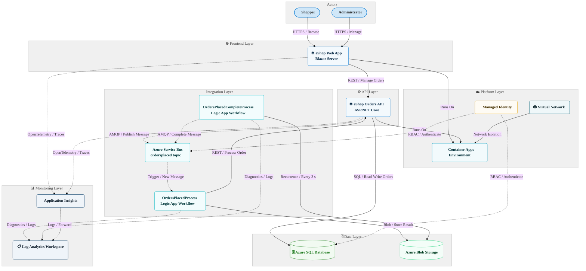

# Azure Logic Apps Monitoring Solution


The **Azure Logic Apps Monitoring Solution** is a production-ready, event-driven order management platform deployed on Azure Container Apps. It demonstrates how to build, observe, and operate Logic Apps Standard workflows integrated with ASP.NET Core microservices and a Blazor Server frontend, orchestrated end-to-end by .NET Aspire 13.

The solution solves the challenge of monitoring and operating complex event-driven workflows in Azure by combining Azure Logic Apps Standard, Azure Service Bus, Application Insights, and Log Analytics into a unified observability stack. Every order event is traced end-to-end — from placement through processing to completion — with diagnostics available in real time through Azure Monitor.

The primary technology stack includes **.NET 10**, ASP.NET Core, Blazor Server, Entity Framework Core 10, .NET Aspire 13, Azure Logic Apps Standard, Azure Service Bus, Azure Container Apps, Azure SQL Database, and Azure Application Insights, all provisioned through Bicep infrastructure-as-code and managed by the Azure Developer CLI (`azd`).

## Table of Contents

- [Features](#features)
- [Architecture](#architecture)
- [Technologies Used](#technologies-used)
- [Quick Start](#quick-start)
- [Configuration](#configuration)
- [Deployment](#deployment)
- [Usage](#usage)
- [Contributing](#contributing)
- [License](#license)

## Features

| Feature                     | Description                                                                                                                                                                             |
| --------------------------- | --------------------------------------------------------------------------------------------------------------------------------------------------------------------------------------- |
| 🔄 Logic Apps Workflows     | Two Logic Apps Standard workflows — `OrdersPlacedProcess` and `OrdersPlacedCompleteProcess` — orchestrate the full order lifecycle from message ingestion to completion acknowledgment. |
| 🌐 Blazor Web Frontend      | A Blazor Server application built with Microsoft Fluent UI provides a responsive order management user interface with session-backed state.                                             |
| 🌐 Orders REST API          | An ASP.NET Core REST API exposes order management endpoints with OpenAPI/Swagger documentation and Entity Framework Core persistence to Azure SQL Database.                             |
| 🚌 Service Bus Integration  | Azure Service Bus `ordersplaced` topic with dead-letter support decouples order placement from processing for reliable, asynchronous message delivery.                                  |
| 🗄️ SQL Persistence          | Entity Framework Core 10 with Azure SQL Database provides ACID-compliant order storage, connection resiliency (up to 5 retries), and EF Core migration support.                         |
| 🔭 End-to-End Observability | Application Insights collects OpenTelemetry traces and metrics from all .NET services; Logic Apps diagnostic logs forward to Log Analytics Workspace for centralized querying.          |
| 🐳 Container Apps Hosting   | .NET Aspire orchestrates the eShop services on Azure Container Apps with automatic managed identity configuration and external HTTP endpoints.                                          |
| 🪪 Managed Identity Auth    | A User-Assigned Managed Identity secures passwordless access to Service Bus, Azure SQL Database, Blob Storage, and Container Registry.                                                  |
| 🏗️ Infrastructure as Code   | Bicep modules provision all Azure resources — networking, monitoring, data, messaging, and compute — in a repeatable parameterized deployment via `azd up`.                             |
| 🧪 Sample Order Generator   | A PowerShell script (`hooks/Generate-Orders.ps1`) generates up to 10,000 randomized orders for load testing and demonstration scenarios.                                                |

## Architecture

The Azure Logic Apps Monitoring solution is an event-driven order management platform. **Shoppers** place and track orders through the **eShop Web App** (Blazor Server), which calls the **eShop Orders API** (ASP.NET Core) to persist data in an **Azure SQL Database**. When an order is placed, the API publishes a message to the **Azure Service Bus** `ordersplaced` topic. The **OrdersPlacedProcess** Logic App Standard workflow subscribes to the topic, calls the Orders API to process each order, and writes the result to **Azure Blob Storage**. The **OrdersPlacedCompleteProcess** Logic App Standard workflow runs on a three-second recurrence, reads processed blobs, and sends completion acknowledgments back to the Service Bus. **Administrators and DevOps Engineers** observe the full system through **Application Insights** (OpenTelemetry telemetry from both .NET services) and a **Log Analytics Workspace** (diagnostic logs from Logic Apps and Service Bus). A **User-Assigned Managed Identity** secures all resource access, and workloads are isolated within an **Azure Virtual Network**. The entire platform is orchestrated by .NET Aspire and deployed via the Azure Developer CLI.


```mermaid
---
config:
  description: "High-level architecture diagram showing actors, primary flows, and major components of the Azure Logic Apps Monitoring solution."
  theme: base
  themeVariables:
    htmlLabels: true
    fontFamily: "-apple-system, BlinkMacSystemFont, \"Segoe UI\", system-ui, \"Apple Color Emoji\", \"Segoe UI Emoji\", sans-serif"
    fontSize: 16
---
flowchart TB

  %% ── Class Definitions ─────────────────────────────────────────────────────
  classDef actor        fill:#d0e7f8,stroke:#0078d4,color:#242424,font-weight:bold
  classDef service      fill:#f5f5f5,stroke:#616161,color:#242424,font-weight:bold
  classDef gateway      fill:#a6e9ed,stroke:#00b7c3,color:#001d1f,font-weight:bold
  classDef datastore    fill:#f1faf1,stroke:#107c10,color:#0e700e,font-weight:bold
  classDef external     fill:#fff9f5,stroke:#f7630c,color:#835b00,font-weight:bold
  classDef ai           fill:#f7f4fb,stroke:#5c2e91,color:#46236e,font-weight:bold
  classDef analytics    fill:#f0fafa,stroke:#038387,color:#012728,font-weight:bold
  classDef compute      fill:#f6fafe,stroke:#3a96dd,color:#112d42,font-weight:bold
  classDef containers   fill:#f2fafc,stroke:#0099bc,color:#002e38,font-weight:bold
  classDef devops       fill:#f7f9fe,stroke:#4f6bed,color:#182047,font-weight:bold
  classDef identity     fill:#fefbf4,stroke:#eaa300,color:#463100,font-weight:bold
  classDef integration  fill:#f2fcfd,stroke:#00b7c3,color:#00373a,font-weight:bold
  classDef iot          fill:#f9f8fc,stroke:#8764b8,color:#281e37,font-weight:bold
  classDef monitor      fill:#eff4f9,stroke:#003966,color:#00111f,font-weight:bold
  classDef networking   fill:#eff7f9,stroke:#005b70,color:#001b22,font-weight:bold
  classDef security     fill:#fdf6f6,stroke:#d13438,color:#3f1011,font-weight:bold
  classDef storage      fill:#f3fdf8,stroke:#00cc6a,color:#003d20,font-weight:bold
  classDef web          fill:#f3f9fd,stroke:#0078d4,color:#002440,font-weight:bold

  %% ── Actors ─────────────────────────────────────────────────────────────────
  subgraph ACTORS["👥 Actors"]
    SHOPPER(["👤 Shopper"])
    ADMIN(["👤 Administrator"])
  end
  style ACTORS fill:#f0f0f0,stroke:#d1d1d1,color:#424242,stroke-width:2px

  %% ── Frontend Layer ─────────────────────────────────────────────────────────
  subgraph FRONTEND["🌐 Frontend Layer"]
    WEBAPP("🌐 eShop Web App<br/>Blazor Server")
  end
  style FRONTEND fill:#f0f0f0,stroke:#d1d1d1,color:#424242,stroke-width:2px

  %% ── API Layer ───────────────────────────────────────────────────────────────
  subgraph API_LAYER["⚙️ API Layer"]
    ORDERSAPI("🌐 eShop Orders API<br/>ASP.NET Core")
  end
  style API_LAYER fill:#f0f0f0,stroke:#d1d1d1,color:#424242,stroke-width:2px

  %% ── Integration Layer ────────────────────────────────────────────────────
  subgraph INTEGRATION["🔄 Integration Layer"]
    SERVICEBUS("🚌 Azure Service Bus<br/>ordersplaced topic")
    LA_PROCESS("🔄 OrdersPlacedProcess<br/>Logic App Workflow")
    LA_COMPLETE("🔄 OrdersPlacedCompleteProcess<br/>Logic App Workflow")
  end
  style INTEGRATION fill:#f0f0f0,stroke:#d1d1d1,color:#424242,stroke-width:2px

  %% ── Data Layer ──────────────────────────────────────────────────────────────
  subgraph DATA["🗄️ Data Layer"]
    SQLDB[("🗄️ Azure SQL Database")]
    BLOB[("💾 Azure Blob Storage")]
  end
  style DATA fill:#f0f0f0,stroke:#d1d1d1,color:#424242,stroke-width:2px

  %% ── Monitoring Layer ────────────────────────────────────────────────────────
  subgraph MONITORING["📊 Monitoring Layer"]
    APPINSIGHTS("🔭 Application Insights")
    LOGANALYTICS("📋 Log Analytics Workspace")
  end
  style MONITORING fill:#f0f0f0,stroke:#d1d1d1,color:#424242,stroke-width:2px

  %% ── Platform Layer ──────────────────────────────────────────────────────────
  subgraph PLATFORM["☁️ Platform Layer"]
    ACA_ENV("🐳 Container Apps Environment")
    IDENTITY("🪪 Managed Identity")
    VNET("🕸️ Virtual Network")
  end
  style PLATFORM fill:#f0f0f0,stroke:#d1d1d1,color:#424242,stroke-width:2px

  %% ── Primary Flows ───────────────────────────────────────────────────────────
  SHOPPER     -- "HTTPS / Browse"               --> WEBAPP
  ADMIN       -- "HTTPS / Manage"               --> WEBAPP
  WEBAPP      -- "REST / Manage Orders"         --> ORDERSAPI
  ORDERSAPI   -- "SQL / Read-Write Orders"      --> SQLDB
  ORDERSAPI   -. "AMQP / Publish Message" .->    SERVICEBUS
  SERVICEBUS  -. "Trigger / New Message" .->      LA_PROCESS
  LA_PROCESS  -- "REST / Process Order"         --> ORDERSAPI
  LA_PROCESS  -- "Blob / Store Result"          --> BLOB
  LA_COMPLETE -- "Recurrence / Every 3 s"       --> BLOB
  LA_COMPLETE -. "AMQP / Complete Message" .->   SERVICEBUS
  WEBAPP      -. "OpenTelemetry / Traces" .->    APPINSIGHTS
  ORDERSAPI   -. "OpenTelemetry / Traces" .->    APPINSIGHTS
  LA_PROCESS  -. "Diagnostics / Logs" .->        LOGANALYTICS
  LA_COMPLETE -. "Diagnostics / Logs" .->        LOGANALYTICS
  APPINSIGHTS -. "Logs / Forward" .->            LOGANALYTICS
  WEBAPP      -- "Runs On"                      --> ACA_ENV
  ORDERSAPI   -- "Runs On"                      --> ACA_ENV
  IDENTITY    -. "RBAC / Authenticate" .->       SERVICEBUS
  IDENTITY    -. "RBAC / Authenticate" .->       SQLDB
  VNET        -- "Network Isolation"            --> ACA_ENV

  %% ── Class Assignments ────────────────────────────────────────────────────
  class SHOPPER,ADMIN actor
  class WEBAPP,ORDERSAPI web
  class SERVICEBUS,LA_PROCESS,LA_COMPLETE integration
  class SQLDB datastore
  class BLOB storage
  class APPINSIGHTS,LOGANALYTICS monitor
  class ACA_ENV containers
  class IDENTITY identity
  class VNET networking
```

## Technologies Used

| Technology                    | Type          | Purpose                                                             |
| ----------------------------- | ------------- | ------------------------------------------------------------------- |
| .NET 10.0                     | Runtime       | Target framework for all .NET projects                              |
| ASP.NET Core 10               | Framework     | REST API hosting for the Orders API                                 |
| Blazor Server                 | Framework     | Interactive server-side UI for the eShop Web App                    |
| Microsoft Fluent UI (v4)      | UI Library    | Component library for the Blazor frontend                           |
| Entity Framework Core 10      | ORM           | Data access and migrations for Azure SQL Database                   |
| .NET Aspire 13                | Orchestration | Local development orchestration and Azure Container Apps deployment |
| Azure Logic Apps Standard     | Integration   | Order processing and completion workflows                           |
| Azure Service Bus             | Messaging     | Asynchronous message delivery via the `ordersplaced` topic          |
| Azure SQL Database            | Database      | Persistent, ACID-compliant order storage                            |
| Azure Blob Storage            | Storage       | Order processing result persistence                                 |
| Azure Container Apps          | Compute       | Serverless container hosting for eShop services                     |
| Azure Container Registry      | Registry      | Container image storage for deployed services                       |
| Azure Application Insights    | Monitoring    | OpenTelemetry-based traces, metrics, and logs                       |
| Azure Log Analytics Workspace | Monitoring    | Centralized log aggregation and query (KQL)                         |
| Azure Virtual Network         | Networking    | Workload isolation with private subnets                             |
| Azure Managed Identity        | Security      | Passwordless authentication to Azure resources                      |
| Bicep                         | IaC           | Parameterized Azure infrastructure provisioning                     |
| Azure Developer CLI (`azd`)   | Tooling       | End-to-end provision and deploy lifecycle                           |
| OpenTelemetry                 | Observability | Distributed traces and metrics exported to Application Insights     |
| GitHub Actions                | CI/CD         | Continuous integration and Azure deployment workflows               |

## Quick Start

### Prerequisites

| Prerequisite                | Minimum Version | Install                                                     |
| --------------------------- | --------------- | ----------------------------------------------------------- |
| .NET SDK                    | 10.0            | [Download](https://dotnet.microsoft.com/download)           |
| Azure Developer CLI (`azd`) | 1.11.0          | `winget install Microsoft.Azd`                              |
| Azure CLI (`az`)            | 2.60.0          | `winget install Microsoft.AzureCLI`                         |
| Docker Desktop              | Latest          | [Download](https://www.docker.com/products/docker-desktop/) |
| PowerShell                  | 7.0             | `winget install Microsoft.PowerShell`                       |

> [!IMPORTANT]
> Docker Desktop must be running before you start the local Aspire host. The Service Bus emulator runs as a container during local development.

### Installation Steps

1. Clone the repository:

   ```bash
   git clone https://github.com/Evilazaro/Azure-LogicApps-Monitoring.git
   cd Azure-LogicApps-Monitoring
   ```

2. Authenticate with Azure:

   ```bash
   az login
   azd auth login
   ```

3. Restore .NET dependencies:

   ```bash
   dotnet restore app.sln
   ```

4. Run the solution locally with .NET Aspire:

   ```bash
   dotnet run --project app.AppHost
   ```

5. Open the .NET Aspire dashboard in your browser at the URL printed in the terminal (typically `http://localhost:15888`) to observe all running services.

### Minimal Working Example

After step 4, the following services are available locally:

```bash
# Retrieve all orders from the Orders API
curl -s http://localhost:5207/api/Orders | jq .

# Expected output (empty store on first run):
# []

# Place a new order
curl -s -X POST http://localhost:5207/api/Orders \
  -H "Content-Type: application/json" \
  -d '{"customerId":"cust-001","items":[{"productId":"prod-42","quantity":2}]}' | jq .

# Expected output:
# { "orderId": "...", "status": "Placed", ... }
```

> [!NOTE]
> The eShop Web App is available at `http://localhost:5208` and provides the full Blazor UI for order management.

## Configuration

All configuration values are managed through .NET user secrets for local development and Azure Container Apps secrets/environment variables for production.

| Option                                  | Default     | Description                                                                            |
| --------------------------------------- | ----------- | -------------------------------------------------------------------------------------- |
| `Azure:TenantId`                        | _(empty)_   | Azure Active Directory tenant ID used for local development authentication.            |
| `Azure:ClientId`                        | _(empty)_   | Service Principal or user Client ID for local development. Not set in publish mode.    |
| `Azure:ResourceGroup`                   | _(empty)_   | Target Azure resource group name. Required when connecting to Azure resources locally. |
| `ConnectionStrings:OrderDb`             | _(empty)_   | SQL Server connection string for the Orders database (managed by .NET Aspire).         |
| `Azure:ServiceBus:HostName`             | _(empty)_   | Azure Service Bus namespace hostname (e.g., `mynamespace.servicebus.windows.net`).     |
| `APPLICATIONINSIGHTS_CONNECTION_STRING` | _(empty)_   | Application Insights connection string for OpenTelemetry export.                       |
| `MESSAGING_HOST`                        | `localhost` | Service Bus host; set to `localhost` to use the local emulator container.              |

### Example Override — Local Development Secrets

Set user secrets for the `AppHost` project to connect to Azure resources during local development:

```bash
dotnet user-secrets set "Azure:TenantId" "<your-tenant-id>" \
  --project app.AppHost/app.AppHost.csproj

dotnet user-secrets set "Azure:ClientId" "<your-client-id>" \
  --project app.AppHost/app.AppHost.csproj

dotnet user-secrets set "Azure:ResourceGroup" "<your-resource-group>" \
  --project app.AppHost/app.AppHost.csproj
```

> [!TIP]
> Run `.\hooks\postprovision.ps1` after `azd provision` to automatically populate all user secrets from the provisioned Azure environment.

## Deployment

Follow these steps to provision infrastructure and deploy the application to Azure.

1. **Verify prerequisites** by running the pre-deployment check script:

   ```powershell
   .\hooks\preprovision.ps1 -ValidateOnly
   ```

2. **Authenticate** with Azure using the Azure Developer CLI:

   ```bash
   azd auth login
   ```

3. **Create a new environment** and provide a name (e.g., `dev`):

   ```bash
   azd env new dev
   ```

4. **Set required environment parameters**:

   ```bash
   azd env set AZURE_LOCATION eastus
   azd env set AZURE_ENV_NAME dev
   ```

5. **Provision infrastructure and deploy** the application in a single command:

   ```bash
   azd up
   ```

   `azd up` runs the following phases in order:
   - Executes `hooks/preprovision.ps1` (validates prerequisites and clears secrets).
   - Provisions all Bicep resources (networking, identity, monitoring, SQL, Service Bus, Container Apps, Logic Apps).
   - Builds and pushes container images to Azure Container Registry.
   - Deploys the eShop services to Azure Container Apps.
   - Executes `hooks/postprovision.ps1` (configures SQL managed identity and populates user secrets).

6. **Deploy Logic Apps workflows** using the post-provision hook or manually:

   ```powershell
   .\hooks\deploy-workflow.ps1
   ```

7. **Verify deployment** by checking the Azure Container Apps endpoints printed at the end of `azd up`.

> [!WARNING]
> Re-running `azd down` removes all provisioned resources and **deletes all data**. Back up the SQL database before tearing down a production environment.

## Usage

### Generate Sample Orders

Use the `Generate-Orders.ps1` script to seed the system with randomized order data:

```powershell
# Generate 500 sample orders and save to the default output path
.\hooks\Generate-Orders.ps1 -OrderCount 500

# Expected output:
# [INFO] Generating 500 orders...
# [INFO] Progress: 100 / 500 orders generated
# ...
# [INFO] Orders saved to ..\infra\data\ordersBatch.json
```

### Query Orders via the REST API

```bash
# List all orders
GET http://localhost:5207/api/Orders

# Get a specific order by ID
GET http://localhost:5207/api/Orders/{orderId}

# Process an order
POST http://localhost:5207/api/Orders/process
Content-Type: application/json

{
  "orderId": "...",
  "customerId": "cust-001",
  "items": [{ "productId": "prod-42", "quantity": 2 }]
}

# Expected response (HTTP 201 Created):
# { "orderId": "...", "status": "Processed", "processedAt": "2026-04-29T..." }
```

> [!NOTE]
> The `OrdersPlacedProcess` Logic App workflow calls `POST /api/Orders/process` automatically for every message received on the Service Bus `ordersplaced` topic.

### View Telemetry in Application Insights

After deployment, navigate to the Application Insights resource in the Azure portal and use the **Transaction search** or **Live Metrics** panes to observe end-to-end traces from both the eShop Web App and the Orders API. Logic Apps diagnostic logs are available in the linked **Log Analytics Workspace** under the `AzureDiagnostics` table.

```kql
// Query Logic App run history from Log Analytics
AzureDiagnostics
| where ResourceType == "WORKFLOWS/RUNS"
| project TimeGenerated, resource_workflowName_s, status_s, startTime_t, endTime_t
| order by TimeGenerated desc
| take 50
```

## Contributing

Contributions are welcome. To contribute to this project:

1. **Fork** the repository on GitHub: [Evilazaro/Azure-LogicApps-Monitoring](https://github.com/Evilazaro/Azure-LogicApps-Monitoring).
2. **Create a feature branch** from `main`:

   ```bash
   git checkout -b feature/your-feature-name
   ```

3. **Commit your changes** with a clear, descriptive message.
4. **Open a pull request** against the `main` branch. Include a description of the change and reference any related issues.

To **report a bug or request a feature**, open an issue at [github.com/Evilazaro/Azure-LogicApps-Monitoring/issues](https://github.com/Evilazaro/Azure-LogicApps-Monitoring/issues) with a clear title and reproduction steps.

> [!NOTE]
> Ensure all CI checks pass before requesting a review. Run `dotnet test app.sln` locally to verify test results before opening a pull request.

## License

This project is licensed under the **MIT License**. See the [LICENSE](LICENSE) file for the full license text.
