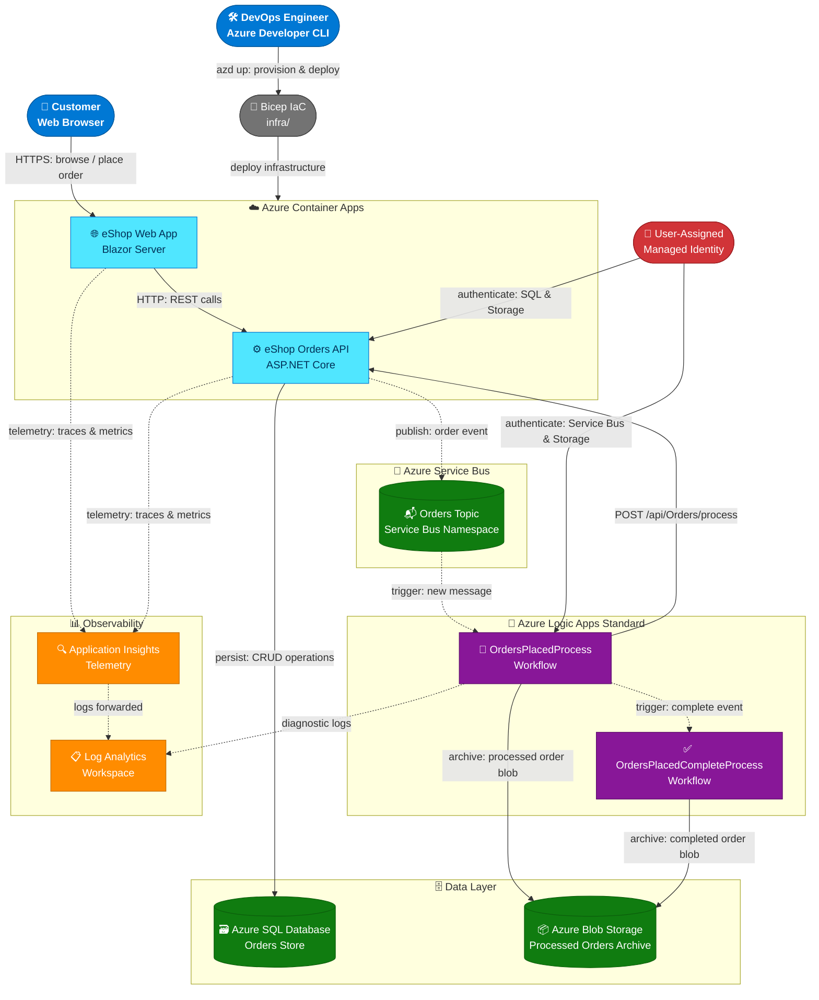

# Azure Logic Apps Monitoring

[](https://github.com/Evilazaro/Azure-LogicApps-Monitoring/actions)
[](LICENSE)
[](azure.yaml)
[](https://dotnet.microsoft.com/)
[](https://learn.microsoft.com/azure/logic-apps/)

## Description

Azure Logic Apps Monitoring is a production-ready reference solution that demonstrates end-to-end order processing using Azure Logic Apps Standard integrated with a .NET 10 microservices application. The solution orchestrates order intake, processing, and archival through an event-driven architecture built on Azure Service Bus, Azure Container Apps, and Azure SQL Database.

The solution solves the challenge of reliably processing high-throughput order events without manual intervention. Orders submitted through the Blazor web frontend are published to Azure Service Bus, consumed by a Logic Apps Standard workflow, forwarded to the Orders REST API for persistence, and then archived to Azure Blob Storage — all with zero-secret authentication via a User-Assigned Managed Identity.

The technology stack centres on .NET 10 with ASP.NET Core and Blazor Server for the application tier, .NET Aspire for local development orchestration, Bicep for infrastructure-as-code, and Azure Developer CLI (azd) for one-command provisioning and deployment. Observability is provided end-to-end through OpenTelemetry exporters connected to Azure Application Insights and Log Analytics.

## Table of Contents

- [Features](#features)
- [Architecture](#architecture)
- [Technologies Used](#technologies-used)
- [Quick Start](#quick-start)
- [Configuration](#configuration)
- [Deployment](#deployment)
- [Usage](#usage)
- [Contributing](#contributing)
- [License](#license)

## Features

- 🛒 **Order Management API** — RESTful ASP.NET Core Web API backed by Entity Framework Core and Azure SQL Database with connection resiliency.
- 🌐 **Blazor Server Frontend** — Responsive order management UI built with Microsoft FluentUI for Blazor and session-based state management.
- 🔄 **Logic Apps Standard Workflows** — Event-driven `OrdersPlacedProcess` and `OrdersPlacedCompleteProcess` workflows that trigger from Service Bus messages and archive results to Blob Storage.
- 📨 **Azure Service Bus Integration** — Asynchronous, durable order event messaging with managed identity authentication and local emulator support for development.
- 📊 **End-to-End Observability** — OpenTelemetry distributed tracing and metrics exported to Azure Application Insights and Log Analytics, including Logic Apps runtime telemetry.
- 🔐 **Zero-Secret Authentication** — All service-to-service communication uses a User-Assigned Managed Identity; no credentials are stored in code or configuration.
- 🏗️ **.NET Aspire Orchestration** — Local development orchestration via .NET Aspire AppHost with health checks, service discovery, and resilience policies pre-configured.
- ☁️ **One-Command Deployment** — Full infrastructure provisioning and application deployment with `azd up`, backed by modular Bicep templates.
- 🌐 **Virtual Network Isolation** — Container Apps, Logic Apps, and data services each occupy dedicated subnets within an Azure Virtual Network.

## Architecture


```mermaid
flowchart TB
    %% ── Actors ──────────────────────────────────────────────────────────
    Customer(["👤 Customer\nWeb Browser"])
    DevOps(["🛠️ DevOps Engineer\nAzure Developer CLI"])

    %% ── Presentation & API Layer ─────────────────────────────────────────
    subgraph ACA ["☁️ Azure Container Apps"]
        WebApp["🌐 eShop Web App\nBlazor Server"]
        OrdersAPI["⚙️ eShop Orders API\nASP.NET Core"]
    end

    %% ── Messaging Layer ──────────────────────────────────────────────────
    subgraph Messaging ["📨 Azure Service Bus"]
        SBTopic[("📬 Orders Topic\nService Bus Namespace")]
    end

    %% ── Workflow Layer ───────────────────────────────────────────────────
    subgraph LogicApps ["🔄 Azure Logic Apps Standard"]
        LAProcess["🔁 OrdersPlacedProcess\nWorkflow"]
        LAComplete["✅ OrdersPlacedCompleteProcess\nWorkflow"]
    end

    %% ── Data Layer ───────────────────────────────────────────────────────
    subgraph DataLayer ["🗄️ Data Layer"]
        SQLDB[("🗃️ Azure SQL Database\nOrders Store")]
        BlobStorage[("📦 Azure Blob Storage\nProcessed Orders Archive")]
    end

    %% ── Observability ────────────────────────────────────────────────────
    subgraph Observability ["📊 Observability"]
        AppInsights["🔍 Application Insights\nTelemetry"]
        LogAnalytics["📋 Log Analytics\nWorkspace"]
    end

    %% ── Identity & IaC ───────────────────────────────────────────────────
    UAMI(["🔐 User-Assigned\nManaged Identity"])
    Bicep(["📝 Bicep IaC\ninfra/"])

    %% ── Interactions ─────────────────────────────────────────────────────
    Customer -->|"HTTPS: browse / place order"| WebApp
    WebApp -->|"HTTP: REST calls"| OrdersAPI
    OrdersAPI -.->|"publish: order event"| SBTopic
    SBTopic -.->|"trigger: new message"| LAProcess
    LAProcess -->|"POST /api/Orders/process"| OrdersAPI
    OrdersAPI -->|"persist: CRUD operations"| SQLDB
    LAProcess -->|"archive: processed order blob"| BlobStorage
    LAProcess -.->|"trigger: complete event"| LAComplete
    LAComplete -->|"archive: completed order blob"| BlobStorage
    WebApp -.->|"telemetry: traces & metrics"| AppInsights
    OrdersAPI -.->|"telemetry: traces & metrics"| AppInsights
    LAProcess -.->|"diagnostic logs"| LogAnalytics
    AppInsights -.->|"logs forwarded"| LogAnalytics
    UAMI -->|"authenticate: SQL & Storage"| OrdersAPI
    UAMI -->|"authenticate: Service Bus & Storage"| LAProcess
    DevOps -->|"azd up: provision & deploy"| Bicep
    Bicep -->|"deploy infrastructure"| ACA

    %% ── Styles ───────────────────────────────────────────────────────────
    classDef actor fill:#0078D4,stroke:#005a9e,color:#ffffff,font-weight:bold
    classDef service fill:#50e6ff,stroke:#0078D4,color:#003057
    classDef datastore fill:#107c10,stroke:#0b5e0b,color:#ffffff
    classDef workflow fill:#881798,stroke:#5c0e6b,color:#ffffff
    classDef observability fill:#ff8c00,stroke:#c46c00,color:#ffffff
    classDef identity fill:#d13438,stroke:#9b1c20,color:#ffffff
    classDef iac fill:#737373,stroke:#404040,color:#ffffff

    class Customer,DevOps actor
    class WebApp,OrdersAPI service
    class SQLDB,BlobStorage,SBTopic datastore
    class LAProcess,LAComplete workflow
    class AppInsights,LogAnalytics observability
    class UAMI identity
    class Bicep iac
```

## Technologies Used

| Technology | Type | Purpose |
|---|---|---|
| .NET 10.0 | Runtime | Application runtime for all .NET services |
| ASP.NET Core Web API | Framework | RESTful Orders API with OpenAPI/Swagger |
| Blazor Server | Framework | Interactive server-side rendered web frontend |
| .NET Aspire | Orchestration | Local development orchestration, health checks, and service discovery |
| Entity Framework Core 10 | ORM | Data access layer for Azure SQL Database |
| Microsoft FluentUI for Blazor | UI Library | Accessible Fluent Design System components |
| Azure Logic Apps Standard | Workflow | Event-driven order processing and archival workflows |
| Azure Service Bus | Messaging | Durable asynchronous order event messaging |
| Azure SQL Database | Database | Relational order data persistence |
| Azure Blob Storage | Object Storage | Logic Apps runtime state and processed order archives |
| Azure Container Apps | Hosting | Serverless container hosting for Orders API and Web App |
| Azure Container Registry | Registry | Private container image registry |
| Azure Application Insights | Monitoring | Distributed tracing, metrics, and application telemetry |
| Azure Log Analytics | Monitoring | Centralized log aggregation and query workspace |
| Azure Virtual Network | Networking | Workload isolation via dedicated subnets |
| User-Assigned Managed Identity | Identity | Zero-secret service-to-service authentication |
| Bicep | IaC | Declarative Azure infrastructure-as-code |
| Azure Developer CLI (azd) | Tooling | One-command provisioning and deployment |
| OpenTelemetry | Observability | Distributed tracing and metrics instrumentation |

## Quick Start

### Prerequisites

| Prerequisite | Minimum Version | Install |
|---|---|---|
| PowerShell | 7.0+ | [Install](https://learn.microsoft.com/powershell/scripting/install/installing-powershell) |
| .NET SDK | 10.0+ | [Install](https://dotnet.microsoft.com/download) |
| Azure Developer CLI | 1.11.0+ | `winget install microsoft.azd` |
| Azure CLI | 2.60.0+ | `winget install microsoft.azurecli` |
| Bicep CLI | 0.30.0+ | `az bicep install` |
| Docker Desktop | Latest | [Install](https://www.docker.com/products/docker-desktop) |

### Installation Steps

1. **Clone the repository:**

```bash
git clone https://github.com/Evilazaro/Azure-LogicApps-Monitoring.git
cd Azure-LogicApps-Monitoring
```

2. **Validate your developer workstation:**

```pwsh
.\hooks\check-dev-workstation.ps1
```

3. **Authenticate with Azure:**

```bash
azd auth login
```

4. **Create a new environment:**

```bash
azd env new <your-environment-name>
```

5. **Provision infrastructure and deploy in one command:**

```bash
azd up
```

### Minimal Working Example

After `azd up` completes, the Orders API endpoint is available. Submit an order:

```bash
# Replace <orders-api-url> with the Container Apps URL from azd output
curl -X POST https://<orders-api-url>/api/Orders \
  -H "Content-Type: application/json" \
  -d '{
    "customerName": "Jane Doe",
    "products": [
      { "name": "Widget A", "quantity": 2, "price": 9.99 }
    ]
  }'

# Expected response: 201 Created
# { "id": "...", "status": "Placed", ... }
```

## Configuration

### Environment Variables

| Option | Default | Description |
|---|---|---|
| `AZURE_SUBSCRIPTION_ID` | _(required)_ | Azure subscription used for resource deployment |
| `AZURE_RESOURCE_GROUP` | `rg-orders-<env>-<region>` | Target resource group name |
| `AZURE_LOCATION` | _(required)_ | Azure region for all resources (e.g., `eastus`) |
| `APPLICATIONINSIGHTS_CONNECTION_STRING` | _(set by azd)_ | Application Insights connection string |
| `MESSAGING_HOST` | `localhost` | Azure Service Bus namespace hostname; `localhost` activates emulator |
| `ConnectionStrings__OrderDb` | _(set by azd)_ | Azure SQL Database connection string |
| `Azure__TenantId` | _(local dev only)_ | Azure AD tenant ID for local development |
| `Azure__ClientId` | _(local dev only)_ | Azure AD client ID for local development |
| `ORDERS_API_URL` | _(set by azd)_ | Orders API hostname injected into Logic App workflow parameters |
| `AZURE_STORAGE_ACCOUNT_NAME_WORKFLOW` | _(set by azd)_ | Storage account name for Logic Apps runtime and blob archival |

### Example Override Snippet (local `appsettings.Development.json`)

```json
{
  "Azure": {
    "TenantId": "<your-tenant-id>",
    "ClientId": "<your-client-id>",
    "ServiceBus": {
      "HostName": "<your-namespace>.servicebus.windows.net"
    }
  },
  "ConnectionStrings": {
    "OrderDb": "Server=<sql-server>.database.windows.net;Database=OrdersDb;Authentication=Active Directory Default;"
  }
}
```

## Deployment

The solution uses Azure Developer CLI (`azd`) with modular Bicep infrastructure templates. The Bicep structure is:

```
infra/
├── main.bicep               # Subscription-scope entry point
├── main.parameters.json     # Environment-specific parameter values
├── types.bicep              # Shared type definitions
├── shared/                  # Cross-cutting resources (network, identity, monitoring, data)
└── workload/                # Application resources (Service Bus, Container Apps, Logic Apps)
```

### Deployment Steps

1. **Authenticate with Azure:**

```bash
azd auth login
```

2. **Create or select an environment:**

```bash
azd env new production
```

3. **Set required parameters:**

```bash
azd env set AZURE_LOCATION eastus
```

4. **Provision Azure infrastructure (Bicep):**

```bash
azd provision
```

   The `preprovision` hook validates prerequisites and builds the solution. The `postprovision` hook configures managed identity SQL access and .NET user secrets automatically.

5. **Deploy application containers:**

```bash
azd deploy
```

6. **Or run both steps in one command:**

```bash
azd up
```

7. **To tear down all resources:**

```bash
azd down
```

   The `postinfradelete` hook cleans up federated credentials and secrets after resource deletion.

## Usage

### Browsing Orders (Web UI)

Navigate to the Container Apps URL for `web-app` (shown in `azd up` output) to access the Blazor Server frontend. The UI connects to the Orders API using service discovery.

### Placing an Order via the API

```http
POST /api/Orders
Content-Type: application/json

{
  "customerName": "John Smith",
  "products": [
    { "name": "Widget A", "quantity": 1, "price": 19.99 },
    { "name": "Widget B", "quantity": 3, "price": 4.50 }
  ]
}
```

**Expected response:**

```json
// HTTP 201 Created
{
  "id": "3fa85f64-5717-4562-b3fc-2c963f66afa6",
  "customerName": "John Smith",
  "status": "Placed",
  "products": [ ... ],
  "createdAt": "2026-04-28T10:00:00Z"
}
```

### Retrieving All Orders

```http
GET /api/Orders
Accept: application/json
```

### Logic App Workflow Trigger

The `OrdersPlacedProcess` workflow triggers automatically when a message arrives on the Azure Service Bus topic. To generate test orders, use the provided helper script:

```pwsh
.\hooks\Generate-Orders.ps1
```

The workflow checks the message content type, calls `POST /api/Orders/process` on the Orders API, and archives the result to Azure Blob Storage under `/ordersprocessedsuccessfully/` on success or a failure folder on error.

### Viewing API Documentation

Navigate to `/swagger` on the Orders API endpoint to access the OpenAPI/Swagger UI:

```
https://<orders-api-url>/swagger
```

## Contributing

1. Fork the repository and create a feature branch from `main`.
2. Validate your workstation: `.\hooks\check-dev-workstation.ps1`
3. Make your changes, ensuring all tests pass: `dotnet test`
4. Open a pull request against `main` with a clear description of the changes.

## License

This project is licensed under the MIT License. See the [LICENSE](LICENSE) file for details.

Created by **Evilazaro Alves | Principal Cloud Solution Architect | Cloud Platforms and AI**.
