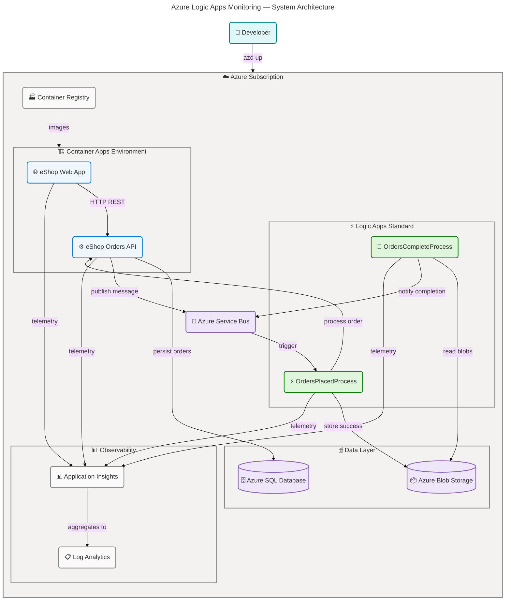

# Azure Logic Apps Monitoring


A production-ready, end-to-end monitoring solution for **Azure Logic Apps Standard** built on **.NET 10** and **.NET Aspire**. It combines an eShop orders-management microservice, a Blazor Server web front end, and two Logic Apps Standard workflows into a single, deployable unit that captures full-stack observability through Application Insights and Log Analytics — with zero static secrets.

## Overview

**Overview**

Azure Logic Apps Monitoring provides engineering teams with a reference architecture for monitoring business-critical Logic Apps Standard workflows in production. The solution integrates an orders-management REST API, a Blazor Server web front end, and two Logic Apps workflows into a cohesive, one-command deployment that captures end-to-end telemetry with no secrets management — all authentication flows through Azure Managed Identity.

The platform is purpose-built for teams that need observable, event-driven order processing at scale. It deploys entirely to Azure Container Apps via the Azure Developer CLI (`azd`), provisions all infrastructure declaratively through Bicep, and ships OpenTelemetry traces, custom metrics, and structured logs to Application Insights and Log Analytics out of the box.

> [!NOTE]
> This solution targets **.NET 10** and **Azure Developer CLI ≥ 1.11.0**. Run `azd version` and `dotnet --version` to verify compatibility before deploying.

## Table of Contents

- [Architecture](#architecture)
- [Features](#features)
- [Requirements](#requirements)
- [Quick Start](#quick-start)
- [Configuration](#configuration)
- [Usage](#usage)
- [Contributing](#contributing)
- [License](#license)

## Architecture

The solution follows a **microservices + event-driven** pattern. The eShop Orders API and Web App run in Azure Container Apps orchestrated by .NET Aspire. Azure Service Bus routes order events to Logic Apps Standard workflows that process orders, write results to Blob Storage, and publish completion notifications.


```mermaid
---
title: "Azure Logic Apps Monitoring — System Architecture"
config:
  theme: base
  look: classic
  layout: dagre
  themeVariables:
    fontSize: '16px'
  flowchart:
    htmlLabels: true
---
flowchart TB
    accTitle: Azure Logic Apps Monitoring System Architecture
    accDescr: Full-stack eShop order management deployed on Azure Container Apps with Logic Apps Standard for event-driven order processing. Shows data flows between the web app, Orders API, SQL Database, Service Bus, Logic Apps workflows, Blob Storage, and centralized observability via Application Insights and Log Analytics.

    %% ═══════════════════════════════════════════════════════════════════════════
    %% AZURE / FLUENT ARCHITECTURE PATTERN v1.1
    %% (Semantic + Structural + Font + Accessibility Governance)
    %% ═══════════════════════════════════════════════════════════════════════════
    %% PHASE 1 - FLUENT UI: All styling uses approved Fluent UI palette only
    %% PHASE 2 - GROUPS: Every subgraph has semantic color via style directive
    %% PHASE 3 - COMPONENTS: Every node has semantic classDef + icon prefix
    %% PHASE 4 - ACCESSIBILITY: accTitle/accDescr present, WCAG AA contrast
    %% PHASE 5 - STANDARD: Governance block present, classDefs centralized
    %% ═══════════════════════════════════════════════════════════════════════════

    developer("👤 Developer"):::external

    subgraph azure["☁️ Azure Subscription"]
        direction TB

        subgraph aca["🏗️ Container Apps Environment"]
            direction LR
            webapp("🌐 eShop Web App"):::core
            ordersapi("⚙️ eShop Orders API"):::core
        end

        subgraph data["🗄️ Data Layer"]
            direction TB
            sqldb[("🗄️ Azure SQL Database")]:::data
            blob[("📦 Azure Blob Storage")]:::data
        end

        servicebus("📨 Azure Service Bus"):::data

        subgraph workflows["⚡ Logic Apps Standard"]
            direction TB
            wf1("⚡ OrdersPlacedProcess"):::success
            wf2("🔄 OrdersCompleteProcess"):::success
        end

        subgraph monitoring["📊 Observability"]
            direction LR
            appinsights("📊 Application Insights"):::neutral
            loganalytics("📋 Log Analytics"):::neutral
        end

        acr("🏭 Container Registry"):::neutral
    end

    developer -->|"azd up"| azure
    webapp -->|"HTTP REST"| ordersapi
    ordersapi -->|"persist orders"| sqldb
    ordersapi -->|"publish message"| servicebus
    servicebus -->|"trigger"| wf1
    wf1 -->|"process order"| ordersapi
    wf1 -->|"store success"| blob
    wf2 -->|"read blobs"| blob
    wf2 -->|"notify completion"| servicebus
    ordersapi -->|"telemetry"| appinsights
    webapp -->|"telemetry"| appinsights
    wf1 -->|"telemetry"| appinsights
    wf2 -->|"telemetry"| appinsights
    appinsights -->|"aggregates to"| loganalytics
    acr -->|"images"| aca

    style azure fill:#F3F2F1,stroke:#8A8886,stroke-width:2px,color:#323130
    style aca fill:#F3F2F1,stroke:#8A8886,stroke-width:2px,color:#323130
    style data fill:#F3F2F1,stroke:#8A8886,stroke-width:2px,color:#323130
    style workflows fill:#F3F2F1,stroke:#8A8886,stroke-width:2px,color:#323130
    style monitoring fill:#F3F2F1,stroke:#8A8886,stroke-width:2px,color:#323130

    %% Centralized semantic classDefs (Phase 5 compliant)
    classDef neutral fill:#FAFAFA,stroke:#8A8886,stroke-width:2px,color:#323130
    classDef core fill:#EFF6FC,stroke:#0078D4,stroke-width:2px,color:#323130
    classDef success fill:#DFF6DD,stroke:#107C10,stroke-width:2px,color:#323130
    classDef data fill:#F0E6FA,stroke:#8764B8,stroke-width:2px,color:#323130
    classDef external fill:#E0F7F7,stroke:#038387,stroke-width:2px,color:#323130
```

**Component Roles:**

| Component                | Type                  | Responsibility                                                |
| ------------------------ | --------------------- | ------------------------------------------------------------- |
| 🌐 eShop Web App         | Blazor Server         | Order management UI using Microsoft FluentUI v4               |
| ⚙️ eShop Orders API      | ASP.NET Core Web API  | Order CRUD operations with EF Core and Service Bus publishing |
| 🗄️ Azure SQL Database    | Relational storage    | Persistent order data with EF Core migrations                 |
| 📨 Azure Service Bus     | Event bus             | `ordersplaced` topic for event-driven workflow triggering     |
| ⚡ OrdersPlacedProcess   | Logic App workflow    | Service Bus–triggered order processing and blob archival      |
| 🔄 OrdersCompleteProcess | Logic App workflow    | Recurrence-triggered completion scanning and notification     |
| 📦 Azure Blob Storage    | Artifact storage      | Successfully processed order artifacts                        |
| 📊 Application Insights  | Distributed telemetry | Traces, custom metrics, and structured logs                   |
| 📋 Log Analytics         | Log aggregation       | Centralized workspace for all service telemetry               |
| 🏭 Container Registry    | Image registry        | Container images for both Container Apps services             |

## Features

**Overview**

Azure Logic Apps Monitoring eliminates the need to assemble monitoring boilerplate from scratch. It gives teams an observable, secure, and immediately deployable starting point for Logic Apps Standard projects — with end-to-end order-processing workflows, a real web UI, and a production-ready REST API that wires up automatically through .NET Aspire service discovery.

All telemetry flows through a unified OpenTelemetry pipeline that surfaces distributed traces across six service boundaries, custom business metrics (`eShop.orders.*`), and structured log correlation. All authentication uses Azure Managed Identity, removing every static secret from the stack and making the solution compliant with zero-standing-privilege security patterns from day one.

| Feature                         | Description                                                                                                                         | Status    |
| ------------------------------- | ----------------------------------------------------------------------------------------------------------------------------------- | --------- |
| 🚀 One-command deploy           | `azd up` provisions all Azure resources and deploys all services end-to-end                                                         | ✅ Stable |
| ⚙️ Orders REST API              | Full CRUD endpoints (`POST`, `GET`, `DELETE`) with OpenAPI/Swagger documentation                                                    | ✅ Stable |
| 🌐 Blazor Web UI                | Interactive Blazor Server front end built with Microsoft FluentUI v4.14 components                                                  | ✅ Stable |
| ⚡ Logic Apps workflows         | Two Standard workflows: Service Bus–triggered processing and recurrence-based completion                                            | ✅ Stable |
| 📊 OpenTelemetry observability  | Distributed traces, custom counters and histograms, structured logs via OTLP and Azure Monitor                                      | ✅ Stable |
| 🔒 Managed Identity auth        | Passwordless SQL, Service Bus, Blob Storage, and Application Insights via `DefaultAzureCredential` — no static secrets in the stack | ✅ Stable |
| 🛡️ Bicep infrastructure as code | Shared + workload Bicep modules with private endpoints, virtual network isolation, and resource governance                          | ✅ Stable |

## Requirements

**Overview**

This solution targets **.NET 10** on Azure and requires an active Azure subscription with quota for Container Apps, Logic Apps Standard, Azure SQL Server, Service Bus Standard, and Azure Blob Storage. The toolchain is fully cross-platform — every lifecycle hook ships both a POSIX (`.sh`) and a Windows (`.ps1`) implementation, so the solution runs identically on macOS, Linux, and Windows developer workstations.

Before deploying, verify every prerequisite using the bundled workstation check script at `./hooks/check-dev-workstation.ps1`. The script validates tool versions, Azure CLI authentication status, Bicep CLI availability, and Azure resource provider registrations in your target subscription — saving time by catching missing tools or expired credentials before any Azure resources are provisioned.

> [!TIP]
> Run `./hooks/check-dev-workstation.ps1 -ValidateOnly` before your first deployment. It performs a dry-run check of all prerequisites without making any changes to your environment.

| Prerequisite                   | Minimum Version | Purpose                                                |
| ------------------------------ | --------------- | ------------------------------------------------------ |
| ☁️ Azure Subscription          | Active          | Resource provisioning target                           |
| 🔑 Azure CLI                   | 2.60.0+         | Azure resource management and authentication           |
| 🛠️ Azure Developer CLI (`azd`) | 1.11.0+         | Full-stack provision and deploy with `azd up`          |
| 📦 .NET SDK                    | 10.0.100        | Build and run all .NET 10 projects                     |
| 🔗 Bicep CLI                   | 0.30.0+         | Infrastructure template compilation and deployment     |
| 🐳 Docker Desktop              | Latest stable   | Local SQL Server and Service Bus containers via Aspire |
| ⚡ PowerShell                  | 7.0+            | Lifecycle hooks on all platforms                       |
| 🌐 zip utility                 | Any             | Logic Apps Standard workflow packaging                 |

## Quick Start

Deploy the entire Azure Logic Apps Monitoring solution in four commands:

```bash
# Authenticate with Azure
azd auth login

# Create a new deployment environment
azd env new my-monitoring-env

# Set the target Azure region and environment name
azd env set AZURE_LOCATION eastus
azd env set AZURE_ENV_NAME dev

# Provision infrastructure and deploy all services
azd up
```

**Expected output:**

```text
Packaging services (azd package)
  (✓) Done: Packaging service orders-api
  (✓) Done: Packaging service web-app

Provisioning Azure resources (azd provision)
  (✓) Done: Resource group: rg-orders-dev-eastus
  (✓) Done: Shared infrastructure (identity, monitoring, network, data)
  (✓) Done: Workload (Service Bus, Container Apps, Logic Apps)

Deploying services (azd deploy)
  (✓) Done: Deploying service orders-api
  (✓) Done: Deploying service web-app

SUCCESS: Your up workflow to provision and deploy to Azure completed.

Outputs:
  web-app endpoint: https://web-app.<env>.azurecontainerapps.io
  orders-api endpoint: https://orders-api.<env>.azurecontainerapps.io
```

Open the `web-app endpoint` URL in your browser to access the eShop order management UI.

To run everything **locally** with .NET Aspire:

```bash
# Start all services locally — SQL container, Service Bus emulator, both apps
dotnet run --project app.AppHost
```

The Aspire dashboard opens at `http://localhost:15888` and provides real-time structured logs, distributed traces, and health status for every service.

## Configuration

**Overview**

All runtime configuration flows through .NET Aspire service discovery in local mode, and through Azure Container Apps environment variables in production. Sensitive values — connection strings, managed identity references, and subscription parameters — are injected at deploy time by `azd` and are never stored in source code or static configuration files.

The configuration surface is divided into two tiers: **infrastructure parameters** resolved at provision time (Bicep templates and `azd` environment variables) and **application settings** resolved at runtime via `IConfiguration`. The `app.AppHost` project bridges both tiers by reading from `appsettings.json` and user secrets, then forwarding values to each service through `.WithReference()` and `.WithEnvironment()` bindings. In Azure, Container Apps environment variables automatically replace all local secrets.

| Key                                    | Source                 | Description                                     | Default (local)              |
| -------------------------------------- | ---------------------- | ----------------------------------------------- | ---------------------------- |
| 📁 `Azure:ResourceGroup`               | User secrets / env var | Resource group for existing Azure resources     | None — uses local containers |
| 🔒 `Azure:TenantId`                    | User secrets           | Azure AD tenant ID for local development auth   | None                         |
| 🔒 `Azure:ClientId`                    | User secrets           | Managed identity or service principal client ID | None                         |
| ⚙️ `Azure:SqlServer:Name`              | User secrets / env var | Azure SQL Server logical server name            | `OrdersDatabase` (container) |
| ⚙️ `Azure:SqlServer:DatabaseName`      | User secrets / env var | Database name within the SQL Server             | `OrderDb`                    |
| 📨 `Azure:ServiceBus:HostName`         | User secrets / env var | Service Bus namespace FQDN                      | `localhost` (emulator)       |
| 📨 `Azure:ServiceBus:TopicName`        | User secrets / env var | Service Bus topic for order events              | `ordersplaced`               |
| 📨 `Azure:ServiceBus:SubscriptionName` | User secrets / env var | Service Bus subscription name                   | `orderprocessingsub`         |
| 📊 `Azure:ApplicationInsights:Name`    | User secrets / env var | Application Insights resource name              | None — uses OTLP locally     |
| 🌍 `OTEL_EXPORTER_OTLP_ENDPOINT`       | Environment variable   | OTLP collector endpoint                         | Auto-configured by Aspire    |

Configure local development secrets from the repository root:

```bash
dotnet user-secrets set "Azure:ResourceGroup"    "rg-orders-dev-eastus"     --project app.AppHost
dotnet user-secrets set "Azure:TenantId"         "<your-tenant-id>"         --project app.AppHost
dotnet user-secrets set "Azure:ClientId"          "<your-client-id>"         --project app.AppHost
dotnet user-secrets set "Azure:SqlServer:Name"   "<your-sql-server-name>"   --project app.AppHost
dotnet user-secrets set "Azure:ServiceBus:HostName" "<your-sb-namespace>.servicebus.windows.net" --project app.AppHost
```

For Azure-deployed environments, all values are injected automatically by `azd` through Container Apps managed environment variables. No manual configuration is needed post-deployment.

## Usage

### Placing an Order

```bash
curl -X POST https://<orders-api-url>/api/Orders \
  -H "Content-Type: application/json" \
  -d '{
    "id": "order-001",
    "customerName": "Jane Smith",
    "deliveryAddress": "123 Main St, Seattle, WA 98101",
    "total": 149.99,
    "products": [
      { "id": "prod-A", "name": "Widget Pro",   "quantity": 2, "price": 49.99 },
      { "id": "prod-B", "name": "Gadget Plus",  "quantity": 1, "price": 50.01 }
    ]
  }'
```

**Expected response (HTTP 201 Created):**

```json
{
  "id": "order-001",
  "customerName": "Jane Smith",
  "deliveryAddress": "123 Main St, Seattle, WA 98101",
  "total": 149.99,
  "products": [
    { "id": "prod-A", "name": "Widget Pro", "quantity": 2, "price": 49.99 },
    { "id": "prod-B", "name": "Gadget Plus", "quantity": 1, "price": 50.01 }
  ]
}
```

### Retrieving Orders

```bash
# List all orders
curl https://<orders-api-url>/api/Orders

# Get a specific order by ID
curl https://<orders-api-url>/api/Orders/order-001
```

### Health Checks

```bash
# Kubernetes / Container Apps readiness probe
curl https://<orders-api-url>/health

# Liveness probe
curl https://<orders-api-url>/alive
```

**Expected response:**

```json
{ "status": "Healthy" }
```

### Running Tests

```bash
dotnet test \
  --configuration Debug \
  --results-directory ./src/tests/AzdTestResults \
  --coverage \
  --coverage-output-format cobertura \
  --coverage-output coverage.cobertura.xml
```

### Generating Sample Orders (Load Simulation)

```powershell
# Generate 50 sample orders against the deployed Orders API
.\hooks\Generate-Orders.ps1 -Count 50 -BaseUrl "https://<orders-api-url>"
```

### Viewing Observability Data

After deployment, open **Application Insights** in the Azure Portal and explore:

- **Live Metrics** — real-time request rates, failure rates, and dependency call latency
- **Transaction Search** — trace an individual order end-to-end across the Web App, Orders API, Service Bus, and both Logic Apps workflows
- **Metrics Explorer** — plot custom metrics: `eShop.orders.placed`, `eShop.orders.processing.duration` (histogram), and `eShop.orders.processing.errors`
- **Log Analytics** — run KQL queries against the `dependencies`, `requests`, and `customMetrics` tables for cross-service correlation

### Exploring the API with Swagger UI

When running locally, the Swagger UI is available at `http://localhost:<orders-api-port>/swagger`. It exposes all endpoints with request/response schemas and supports in-browser test execution.

## Contributing

**Overview**

Contributions to Azure Logic Apps Monitoring are welcome and encouraged. Whether you are fixing a bug, improving observability instrumentation, extending a Logic Apps workflow, or enhancing the Bicep infrastructure modules, every contribution strengthens the reference architecture and benefits engineers building production Logic Apps solutions on Azure.

The project follows standard GitHub flow: fork, create a feature branch, push changes with a clear commit message, and open a pull request against `main` with all CI checks passing. All lifecycle hooks ship cross-platform implementations — if you add a new hook script, include both a `.sh` and a `.ps1` version. Run the full test suite and the workstation validation script before submitting.

1. **Fork** the repository and clone your fork:

   ```bash
   git clone https://github.com/YOUR_GITHUB_USERNAME/Azure-LogicApps-Monitoring.git
   cd Azure-LogicApps-Monitoring
   ```

2. **Validate** your workstation prerequisites:

   ```powershell
   .\hooks\check-dev-workstation.ps1 -ValidateOnly
   ```

3. **Create a feature branch**:

   ```bash
   git checkout -b feature/your-feature-name
   ```

4. **Build and test** your changes:

   ```bash
   dotnet restore
   dotnet build --configuration Debug
   dotnet test --configuration Debug --no-build
   ```

5. **Commit and push**:

   ```bash
   git commit -m "feat: describe your change concisely"
   git push origin feature/your-feature-name
   ```

6. **Open a pull request** targeting the `main` branch. Include a description of the change, any infrastructure impact, and relevant observability considerations.

> [!WARNING]
> Never commit secrets, connection strings, managed identity credentials, or `.env` files to the repository. Use `dotnet user-secrets` for local values and `azd env set` for environment-specific configuration. The `./hooks/clean-secrets.ps1` script clears all user secrets if you need a clean slate.

## License

This project is licensed under the **MIT License**. See the [`LICENSE`](LICENSE) file for full terms.

Maintained by [Evilazaro](https://github.com/Evilazaro) — Principal Cloud Solution Architect.
