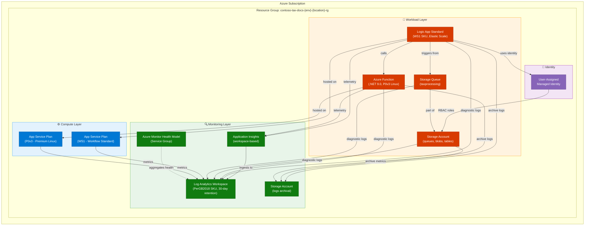

# Azure Logic Apps Standard - Monitoring Solution

[](LICENSE.md)
[](https://azure.microsoft.com/services/logic-apps/)

A production-ready Infrastructure as Code (IaC) solution that implements comprehensive monitoring and observability for Azure Logic Apps Standard using Bicep templates. This project demonstrates Azure Monitor best practices with pre-configured Application Insights, Log Analytics, custom health models, and diagnostic settings designed for enterprise workflow orchestration.

---

## Table of Contents

- [Project Overview](#project-overview)
- [Architecture](#architecture)
- [Prerequisites](#prerequisites)
- [Deployment](#deployment)
- [Usage](#usage)
- [Project Structure](#project-structure)
- [Monitoring Components](#monitoring-components)
- [Security](#security)
- [Contributing](#contributing)
- [Glossary](#glossary)
- [License](#license)

---

## Project Overview

### Purpose

This monitoring solution was created to address the observability gaps in Azure Logic Apps Standard deployments. While Azure provides basic monitoring capabilities out-of-the-box, enterprise workflow orchestration requires:

- **Comprehensive telemetry collection** across all Logic App execution stages
- **Centralized log aggregation** from Logic Apps, Azure Functions, and messaging services
- **Proactive alerting** with custom health models and metric thresholds
- **Infrastructure as Code** for repeatable, version-controlled monitoring deployments
- **Best practice patterns** aligned with the Azure Well-Architected Framework

This solution solves the problem of fragmented monitoring by providing a unified, automated approach to observability that works from day one.

### Target Use Cases

- **Production workflow monitoring**: Track Logic App executions, failures, and performance metrics
- **Multi-service observability**: Monitor Logic Apps, Azure Functions, Storage Queues, and supporting infrastructure
- **Compliance and auditing**: Retain diagnostic logs in Azure Storage with configurable retention policies
- **Cost optimization**: Identify inefficient workflows through performance telemetry
- **Incident response**: Quickly diagnose issues with pre-configured Log Analytics queries

### Key Features

#### What It Monitors

- **Logic Apps Standard**: Workflow runtime execution, trigger events, action failures, latency metrics
- **Azure Functions (.NET 9.0)**: Function execution counts, duration, failure rates, dependencies
- **Azure Storage Queues**: Message queue depth, processing latency, dead-letter queue metrics
- **Application Insights**: End-to-end transaction tracing, dependency tracking, exception telemetry
- **Log Analytics Workspace**: Centralized log repository with 30-day retention
- **App Service Plans**: CPU, memory, and scaling metrics for compute resources

#### How It Monitors

- **Diagnostic Settings**: Automatically configured on all resources to send logs and metrics to Log Analytics
- **Application Insights Integration**: Workspace-based Application Insights linked to Log Analytics for unified querying
- **Managed Identity**: Secure, passwordless authentication for Logic Apps to access storage and monitoring resources
- **Custom Health Models**: Azure Monitor service groups for hierarchical health aggregation (preview feature)
- **Dual Storage**: Metrics stored in both Log Analytics (for querying) and Azure Storage (for long-term archival)

#### Integration Points

- **Log Analytics Workspace**: Central hub for all diagnostic data with KQL query support
- **Application Insights**: Telemetry ingestion from Logic Apps and Azure Functions
- **Azure Storage**: Long-term log retention in blob containers and queues for workflow triggers
- **Managed Identities**: Role-based access control (RBAC) assignments for secure resource access
- **Bicep Modules**: Modular, reusable IaC templates for monitoring and workload components

### Target Audience

- **DevOps Engineers**: Managing Azure Logic Apps in production environments
- **Azure Architects**: Designing monitoring solutions for microservices and workflow orchestration
- **Platform Engineers**: Standardizing observability across multiple Azure subscriptions
- **SRE Teams**: Establishing SLIs, SLOs, and alert rules for workflow reliability

### Benefits

This solution goes beyond default Azure monitoring by providing:

#### Gaps Filled Beyond Out-of-the-Box Monitoring

- **Pre-configured diagnostic settings**: No manual portal clicks required—all resources automatically send telemetry
- **Unified logging**: Aggregates logs from Logic Apps, Functions, and Storage into a single queryable workspace
- **Storage archival**: Automated long-term retention in Azure Storage for compliance requirements
- **Managed Identity integration**: Demonstrates passwordless authentication patterns for Logic Apps

#### Logic Apps-Specific Monitoring Capabilities

- **Workflow execution tracking**: Detailed logs for each workflow run, including trigger sources and action results
- **Retry and failure analysis**: Capture failed actions with error messages for root cause analysis
- **Performance baselining**: Metrics for workflow duration, action latency, and throughput
- **Queue-driven workflow monitoring**: Track Storage Queue triggers and processing delays

#### Cost and Operational Advantages

- **Pay-per-GB ingestion**: Log Analytics with 30-day retention optimized for cost (PerGB2018 SKU)
- **Automated deployment**: Deploy entire monitoring stack in under 5 minutes using Bicep or Azure Developer CLI
- **Reusable modules**: Separate monitoring and workload layers for flexible, composable infrastructure
- **No third-party dependencies**: Native Azure services reduce complexity and integration overhead

#### Azure Well-Architected Framework Alignment

This solution implements best practices from the [Azure Well-Architected Framework](https://learn.microsoft.com/azure/well-architected/):

- **Reliability**: Health models and diagnostic settings enable proactive issue detection
- **Security**: Managed identities, RBAC, TLS 1.2 enforcement, and disabled public blob access
- **Cost Optimization**: Right-sized SKUs (WS1 for Logic Apps, P0v3 for Functions) with scalable tiers
- **Operational Excellence**: Infrastructure as Code with modular Bicep templates and automated deployments
- **Performance Efficiency**: Application Insights dependency tracking identifies bottlenecks

---

## Architecture

### Solution Design

This solution implements a **layered separation of concerns** to maximize reusability and maintainability:

1. **Infrastructure Layer** (`infra/main.bicep`): Deploys the resource group and orchestrates module deployments
2. **Monitoring Layer** (`src/monitoring/main.bicep`): Provisions observability infrastructure independent of workloads
3. **Workload Layer** (`src/workload/main.bicep`): Deploys Logic Apps, Functions, and messaging services that consume monitoring resources

**Why Separate Layers?**

- **Reusability**: The monitoring layer can be deployed once and shared across multiple workloads
- **Dependency management**: Monitoring resources must exist before workloads can configure diagnostic settings
- **Lifecycle independence**: Update workloads without redeploying monitoring infrastructure
- **Cost allocation**: Tag and bill monitoring vs. workload resources separately

**Modular Bicep Structure**

Each layer is composed of focused modules:

- `monitoring/log-analytics-workspace.bicep`: Creates Log Analytics and log storage account
- `monitoring/app-insights.bicep`: Configures Application Insights with workspace integration
- `monitoring/azure-monitor-health-model.bicep`: Sets up custom health hierarchy (tenant-scoped)
- `workload/messaging/main.bicep`: Deploys Storage Account with queues for workflow triggers
- `workload/azure-function.bicep`: Provisions Function App with Application Insights integration
- `workload/logic-app.bicep`: Creates Logic App Standard with managed identity and diagnostic settings

**Deployment Sequence**

```
1. Infrastructure → Resource Group
2. Monitoring → Log Analytics + Storage + Application Insights
3. Workload → Messaging (Storage Queue)
4. Workload → Azure Function (API layer)
5. Workload → Logic App (depends on Function and Messaging)
```

Dependencies are enforced through Bicep `dependsOn` and module output parameters.

### Component Architecture


```mermaid
graph TB
    subgraph Azure Subscription
        subgraph "Resource Group: contoso-tax-docs-{env}-{location}-rg"
            
            subgraph Monitoring["🔍 Monitoring Layer"]
                LAW["Log Analytics Workspace<br/>(PerGB2018 SKU, 30-day retention)"]
                AppInsights["Application Insights<br/>(workspace-based)"]
                LogStorage["Storage Account<br/>(logs archival)"]
                HealthModel["Azure Monitor Health Model<br/>(Service Group)"]
                
                style LAW fill:#107C10,stroke:#0B5A0B,color:#fff
                style AppInsights fill:#107C10,stroke:#0B5A0B,color:#fff
                style LogStorage fill:#107C10,stroke:#0B5A0B,color:#fff
                style HealthModel fill:#107C10,stroke:#0B5A0B,color:#fff
            end
            
            subgraph Workload["🔧 Workload Layer"]
                LogicApp["Logic App Standard<br/>(WS1 SKU, Elastic Scale)"]
                FunctionApp["Azure Function<br/>(.NET 9.0, P0v3 Linux)"]
                WorkflowStorage["Storage Account<br/>(queues, blobs, tables)"]
                Queue["Storage Queue<br/>(taxprocessing)"]
                
                style LogicApp fill:#D83B01,stroke:#A62A00,color:#fff
                style FunctionApp fill:#D83B01,stroke:#A62A00,color:#fff
                style WorkflowStorage fill:#D83B01,stroke:#A62A00,color:#fff
                style Queue fill:#D83B01,stroke:#A62A00,color:#fff
            end
            
            subgraph Compute["⚙️ Compute Layer"]
                ASP_Logic["App Service Plan<br/>(WS1 - Workflow Standard)"]
                ASP_Function["App Service Plan<br/>(P0v3 - Premium Linux)"]
                
                style ASP_Logic fill:#0078D4,stroke:#005A9E,color:#fff
                style ASP_Function fill:#0078D4,stroke:#005A9E,color:#fff
            end
            
            subgraph Identity["🔐 Identity"]
                ManagedID["User-Assigned<br/>Managed Identity"]
                
                style ManagedID fill:#8764B8,stroke:#5E3F8A,color:#fff
            end
            
        end
    end
    
    %% Data Flow Relationships
    LogicApp -->|telemetry| AppInsights
    FunctionApp -->|telemetry| AppInsights
    AppInsights -->|ingests to| LAW
    
    LogicApp -->|diagnostic logs| LAW
    FunctionApp -->|diagnostic logs| LAW
    WorkflowStorage -->|diagnostic logs| LAW
    Queue -->|diagnostic logs| LAW
    ASP_Logic -->|metrics| LAW
    ASP_Function -->|metrics| LAW
    
    LogicApp -->|archive logs| LogStorage
    FunctionApp -->|archive logs| LogStorage
    WorkflowStorage -->|archive metrics| LogStorage
    
    LogicApp -->|hosted on| ASP_Logic
    FunctionApp -->|hosted on| ASP_Function
    
    LogicApp -->|uses identity| ManagedID
    ManagedID -->|RBAC roles| WorkflowStorage
    
    Queue -->|part of| WorkflowStorage
    LogicApp -->|triggers from| Queue
    LogicApp -->|calls| FunctionApp
    
    HealthModel -.aggregates health.-> LAW
    
    style Monitoring fill:#E8F5E9,stroke:#4CAF50
    style Workload fill:#FFF3E0,stroke:#FF9800
    style Compute fill:#E3F2FD,stroke:#2196F3
    style Identity fill:#F3E5F5,stroke:#9C27B0
```

### Component Details

#### Monitoring Layer Resources

| Resource | Type | Purpose | Configuration |
|----------|------|---------|---------------|
| **Log Analytics Workspace** | `Microsoft.OperationalInsights/workspaces` | Central log aggregation and KQL queries | PerGB2018 SKU, 30-day retention, system-assigned identity |
| **Application Insights** | `Microsoft.Insights/components` | Application telemetry and distributed tracing | Workspace-based, linked to Log Analytics |
| **Log Storage Account** | `Microsoft.Storage/storageAccounts` | Long-term diagnostic log archival | Standard_LRS, StorageV2, TLS 1.2, Hot tier |
| **Health Model Service Group** | `Microsoft.Management/serviceGroups` | Custom health hierarchy (preview) | Tenant-scoped resource |

#### Workload Layer Resources

| Resource | Type | Purpose | Configuration |
|----------|------|---------|---------------|
| **Logic App Standard** | `Microsoft.Web/sites` (workflowapp) | Workflow orchestration engine | WS1 elastic scale, user-assigned managed identity |
| **Azure Function** | `Microsoft.Web/sites` (functionapp,linux) | API services for Logic App workflows | .NET 9.0 runtime, P0v3 Linux, system-assigned identity |
| **Workflow Storage** | `Microsoft.Storage/storageAccounts` | Logic App state, queues, blobs, tables | Standard_LRS, StorageV2, managed identity access |
| **Storage Queue** | `Microsoft.Storage/storageAccounts/queueServices/queues` | Workflow trigger source | Named `taxprocessing` |
| **App Service Plans** | `Microsoft.Web/serverfarms` | Compute hosts for Logic App and Function | WS1 (elastic) and P0v3 (Linux reserved) |
| **Managed Identity** | `Microsoft.ManagedIdentity/userAssignedIdentities` | Passwordless auth for Logic App | RBAC roles on storage (Blob Owner, Queue Contributor, etc.) |

#### Resource Dependencies

```
Log Analytics Workspace
    ├─→ Application Insights (requires workspaceId)
    ├─→ Logic App diagnostic settings (requires workspaceId)
    └─→ Function App diagnostic settings (requires workspaceId)

Workflow Storage Account
    ├─→ Storage Queue (child resource)
    ├─→ Logic App (requires storage for state)
    └─→ Managed Identity RBAC (requires storage for role assignments)

Application Insights
    ├─→ Logic App app settings (requires connection string)
    └─→ Function App app settings (requires connection string)

Function App
    └─→ Logic App dependency (workflows call Function APIs)
```

### Data Flow Architecture

```mermaid
flowchart LR
    subgraph External["External Triggers"]
        Scheduler["Scheduler/Timer"]
        HttpReq["HTTP Request"]
        QueueMsg["Queue Message"]
    end
    
    subgraph WorkloadLayer["Workload Execution"]
        LA["Logic App<br/>Workflow"]
        FA["Function App<br/>API"]
        SQ["Storage Queue<br/>(taxprocessing)"]
        
        style LA fill:#D83B01,stroke:#A62A00,color:#fff
        style FA fill:#D83B01,stroke:#A62A00,color:#fff
        style SQ fill:#D83B01,stroke:#A62A00,color:#fff
    end
    
    subgraph TelemetryCollection["Telemetry Collection"]
        AppInsights["Application Insights<br/>(telemetry ingestion)"]
        DiagPipeline["Diagnostic Settings<br/>(logs & metrics)"]
        
        style AppInsights fill:#107C10,stroke:#0B5A0B,color:#fff
        style DiagPipeline fill:#107C10,stroke:#0B5A0B,color:#fff
    end
    
    subgraph Storage["Storage & Query"]
        LAW["Log Analytics<br/>Workspace<br/>(KQL queries)"]
        BlobArchive["Blob Storage<br/>(long-term logs)"]
        
        style LAW fill:#107C10,stroke:#0B5A0B,color:#fff
        style BlobArchive fill:#107C10,stroke:#0B5A0B,color:#fff
    end
    
    subgraph Analysis["Analysis & Alerting"]
        Workbooks["Azure Workbooks<br/>(dashboards)"]
        Alerts["Azure Monitor<br/>Alerts"]
        HealthCheck["Health Model<br/>(aggregation)"]
        
        style Workbooks fill:#8764B8,stroke:#5E3F8A,color:#fff
        style Alerts fill:#8764B8,stroke:#5E3F8A,color:#fff
        style HealthCheck fill:#8764B8,stroke:#5E3F8A,color:#fff
    end
    
    %% Execution Flow
    Scheduler -->|triggers| LA
    HttpReq -->|invokes| LA
    QueueMsg -->|triggers| LA
    LA -->|calls API| FA
    LA -->|writes to| SQ
    
    %% Telemetry Flow
    LA -->|telemetry<br/>(traces, exceptions)| AppInsights
    FA -->|telemetry<br/>(dependencies, requests)| AppInsights
    
    LA -->|diagnostic logs<br/>(WorkflowRuntime)| DiagPipeline
    FA -->|diagnostic logs<br/>(FunctionAppLogs)| DiagPipeline
    SQ -->|diagnostic logs<br/>(StorageRead/Write)| DiagPipeline
    
    %% Storage Flow
    AppInsights -->|ingests to| LAW
    DiagPipeline -->|logs| LAW
    DiagPipeline -->|metrics| LAW
    DiagPipeline -->|archive| BlobArchive
    
    %% Analysis Flow
    LAW -->|queries| Workbooks
    LAW -->|metric alerts| Alerts
    LAW -->|aggregates| HealthCheck
    
    style External fill:#F3E5F5,stroke:#9C27B0
    style WorkloadLayer fill:#FFF3E0,stroke:#FF9800
    style TelemetryCollection fill:#E8F5E9,stroke:#4CAF50
    style Storage fill:#E8F5E9,stroke:#4CAF50
    style Analysis fill:#F3E5F5,stroke:#9C27B0
```

### Telemetry and Log Flow Explanation

1. **Execution Initiation**: Logic Apps are triggered by timers, HTTP requests, or Storage Queue messages. The workflow orchestrates business logic and calls Azure Functions for API operations.

2. **Telemetry Collection**: Both Logic Apps and Azure Functions send application telemetry (traces, exceptions, dependencies, custom events) to Application Insights using the configured connection string.

3. **Diagnostic Log Routing**: All resources have diagnostic settings configured to route logs and metrics to two destinations:
   - **Log Analytics Workspace**: For real-time querying with KQL
   - **Blob Storage**: For long-term archival and compliance retention

4. **Data Aggregation**: Application Insights automatically ingests its telemetry into the linked Log Analytics Workspace, creating a unified query surface. Metrics from App Service Plans, Storage, and other resources are also aggregated here.

5. **Analysis and Alerting**: 
   - **Azure Workbooks** visualize metrics and logs through custom dashboards
   - **Azure Monitor Alerts** trigger notifications based on metric thresholds or log query conditions
   - **Health Models** aggregate resource health into hierarchical service groups for holistic monitoring

---

## Prerequisites

### Azure Requirements

- **Azure Subscription**: Active subscription with **Contributor** role (minimum required for resource deployment and RBAC assignments)
- **Resource Providers Registered**: The following providers must be registered in your subscription:
  ```bash
  Microsoft.Logic
  Microsoft.Web
  Microsoft.Storage
  Microsoft.Insights
  Microsoft.OperationalInsights
  Microsoft.ManagedIdentity
  Microsoft.Authorization
  ```
  To verify registration:
  ```bash
  az provider show --namespace Microsoft.Logic --query "registrationState"
  ```

### Local Development Tools

Install these tools before deploying:

| Tool | Minimum Version | Purpose | Installation Link |
|------|-----------------|---------|-------------------|
| **Azure CLI** | 2.50.0+ | Deploy Bicep templates and manage resources | [Install Azure CLI](https://learn.microsoft.com/cli/azure/install-azure-cli) |
| **Bicep CLI** | 0.20.0+ | Compile and validate Bicep templates | [Install Bicep](https://learn.microsoft.com/azure/azure-resource-manager/bicep/install) |
| **Azure Developer CLI (azd)** | 1.5.0+ | *Optional but recommended* for streamlined deployments | [Install azd](https://learn.microsoft.com/azure/developer/azure-developer-cli/install-azd) |
| **PowerShell** | 7.0+ | Run deployment scripts on Windows/Linux/macOS | [Install PowerShell](https://learn.microsoft.com/powershell/scripting/install/installing-powershell) |

### Configuration Files

Before deploying, you'll need to customize:

- **`infra/main.parameters.json`**: Deployment parameters (location, environment name)
- **Azure Developer CLI Environment**: If using `azd`, initialize with `azd env new`

### Knowledge Prerequisites

- **Required**:
  - Basic understanding of Azure Logic Apps Standard and workflow concepts
  - Familiarity with Azure Resource Manager deployments (portal or CLI experience)
  - Ability to read JSON configuration files

- **Recommended**:
  - Experience with Bicep or ARM templates for infrastructure as code
  - Knowledge of Azure Monitor, Log Analytics, and Application Insights
  - Understanding of managed identities and Azure RBAC

- **Optional**:
  - Familiarity with the [Azure Well-Architected Framework](https://learn.microsoft.com/azure/well-architected/)
  - KQL (Kusto Query Language) for querying Log Analytics

---

## Deployment

### Option A: Using Azure Developer CLI (Recommended)

The fastest way to deploy the complete solution:

```bash
# Clone the repository
git clone https://github.com/Evilazaro/Azure-LogicApps-Monitoring.git
cd Azure-LogicApps-Monitoring

# Login to Azure
azd auth login

# Initialize a new environment (first-time setup)
azd env new

# You'll be prompted for:
# - Environment name (e.g., "dev", "prod")
# - Azure subscription
# - Azure region (e.g., "eastus", "westus2")

# Provision infrastructure and deploy
azd up
```

**What `azd up` does behind the scenes:**

1. Reads `azure.yaml` to understand the project structure
2. Compiles Bicep templates in `infra/main.bicep`
3. Creates a resource group in your chosen subscription and region
4. Deploys the monitoring layer (Log Analytics, Application Insights, Storage)
5. Deploys the workload layer (Logic App, Function App, Storage Queue)
6. Configures diagnostic settings and managed identity role assignments
7. Outputs connection strings and resource IDs to `.azure/{env}/.env`

**Typical deployment time**: 3-5 minutes

### Option B: Manual Bicep Deployment

For more control over the deployment process:

#### Step 1: Configure Parameters

Edit `infra/main.parameters.json` to customize your deployment:

```json
{
  "$schema": "https://schema.management.azure.com/schemas/2015-01-01/deploymentParameters.json#",
  "contentVersion": "1.0.0.0",
  "parameters": {
    "location": {
      "value": "eastus"  // Replace with your Azure region
    },
    "envName": {
      "value": "dev"  // Options: dev, uat, prod
    }
  }
}
```

**Parameter explanations:**

- **`location`**: Azure region for all resources (choose one close to your users for latency optimization)
- **`envName`**: Environment name suffix appended to resource names (helps differentiate dev/test/prod deployments)

**Optional parameters** (defined with defaults in `main.bicep`):

- `solutionName`: Base prefix for all resource names (default: `tax-docs`)
- `deploymentDate`: Timestamp tag (auto-generated)

#### Step 2: Login and Set Subscription

```bash
# Login to Azure
az login

# List your subscriptions
az account list --output table

# Set the target subscription
az account set --subscription "Your Subscription Name or ID"

# Verify the active subscription
az account show --output table
```

#### Step 3: Deploy Monitoring Infrastructure First

The monitoring layer must be deployed before workloads can configure diagnostic settings:

```bash
# Deploy at subscription scope (creates resource group + monitoring)
az deployment sub create \
  --location eastus \
  --template-file infra/main.bicep \
  --parameters infra/main.parameters.json \
  --name "monitoring-$(date +%Y%m%d-%H%M%S)"
```

**Why subscription scope?** The root `main.bicep` creates a resource group, which requires subscription-level deployment permissions.

**Expected output:**

```
{
  "outputs": {
    "RESOURCE_GROUP_NAME": "contoso-tax-docs-dev-eastus-rg",
    "AZURE_LOG_ANALYTICS_WORKSPACE_ID": "/subscriptions/{sub-id}/resourceGroups/.../loganalytics",
    "AZURE_APPLICATION_INSIGHTS_CONNECTION_STRING": "InstrumentationKey=...;IngestionEndpoint=...",
    ...
  }
}
```

Save these outputs—you'll need them for verification.

#### Step 4: Verify Deployment

Check that all resources were created successfully:

```bash
# List all resources in the deployed resource group
az resource list \
  --resource-group contoso-tax-docs-dev-eastus-rg \
  --output table

# Verify Logic App status
az logicapp show \
  --name tax-docs-{uniqueId}-logicapp \
  --resource-group contoso-tax-docs-dev-eastus-rg \
  --query "{Name:name, State:state, HostName:defaultHostName}" \
  --output table

# Check Application Insights connection
az monitor app-insights component show \
  --app tax-docs-{uniqueId}-appinsights \
  --resource-group contoso-tax-docs-dev-eastus-rg \
  --query "{Name:name, AppId:appId, InstrumentationKey:instrumentationKey}" \
  --output table
```

**Expected resource count**: 10-12 resources (depending on configuration):

- 1 Log Analytics Workspace
- 1 Application Insights instance
- 2 Storage Accounts (logs + workflow storage)
- 1 Storage Queue
- 1 Logic App (site + app service plan)
- 1 Function App (site + app service plan)
- 1 Managed Identity
- 1 Service Group (Health Model)

#### Step 5: Post-Deployment Configuration

##### Access Application Insights

1. Navigate to the Azure Portal
2. Find your Application Insights resource: `tax-docs-{uniqueId}-appinsights`
3. Go to **Logs** and verify data ingestion with this KQL query:

```kql
requests
| where timestamp > ago(1h)
| summarize count() by cloud_RoleName
| order by count_ desc
```

##### Configure Alert Rules (Optional)

Create a metric alert for failed Logic App runs:

```bash
# Get the Logic App resource ID
LOGIC_APP_ID=$(az logicapp show \
  --name tax-docs-{uniqueId}-logicapp \
  --resource-group contoso-tax-docs-dev-eastus-rg \
  --query id --output tsv)

# Create an action group (for email notifications)
az monitor action-group create \
  --name "LogicAppAlerts" \
  --resource-group contoso-tax-docs-dev-eastus-rg \
  --short-name "LA-Alerts" \
  --email-receiver name="DevOps Team" email="devops@example.com"

# Create the alert rule
az monitor metrics alert create \
  --name "LogicAppFailures" \
  --resource-group contoso-tax-docs-dev-eastus-rg \
  --scopes $LOGIC_APP_ID \
  --condition "count RunsFailed > 5" \
  --window-size 5m \
  --evaluation-frequency 1m \
  --action LogicAppAlerts \
  --description "Alert when Logic App fails more than 5 times in 5 minutes"
```

### Troubleshooting Common Issues

| Issue | Possible Cause | Solution |
|-------|---------------|----------|
| **Error: "Resource provider not registered"** | Missing provider registration | Run `az provider register --namespace Microsoft.Logic` and wait 2-3 minutes |
| **Error: "Insufficient permissions"** | Lack of Contributor role | Verify role assignment: `az role assignment list --assignee <your-email> --scope /subscriptions/<sub-id>` |
| **Error: "Deployment timeout"** | Azure service throttling or regional outage | Check [Azure Service Health](https://status.azure.com), retry with `--no-wait` flag |
| **Error: "Storage account name already taken"** | Name collision (unlikely with uniqueString) | Change `solutionName` parameter to generate a different unique suffix |
| **Warning: "Health model deployment failed"** | Tenant-scoped resource requires special permissions | Non-blocking warning; health model is a preview feature and optional |

---

## Usage

### Example 1: Query Logic App Execution History

Query failed workflow runs with error details:

```kql
// KQL query for Application Insights or Log Analytics
AzureDiagnostics
| where ResourceProvider == "MICROSOFT.LOGIC"
| where Category == "WorkflowRuntime"
| where status_s == "Failed"
| project 
    TimeGenerated,
    WorkflowName = resource_workflowName_s,
    RunId = resource_runId_s,
    Status = status_s,
    ErrorCode = error_code_s,
    ErrorMessage = error_message_s,
    TriggerName = resource_triggerName_s
| order by TimeGenerated desc
| take 50
```

**How to run this query:**

1. Open the Azure Portal
2. Navigate to your Log Analytics Workspace: `tax-docs-{uniqueId}-law`
3. Click **Logs** in the left menu
4. Paste the query above and click **Run**

**What this query shows:**

- Recent failed Logic App workflow runs
- Workflow name and unique run ID for troubleshooting
- Error codes and messages for root cause analysis
- Trigger name to identify the execution source

**Example visualization:**

```
TimeGenerated           WorkflowName      Status  ErrorCode  ErrorMessage
2025-12-04 14:23:11     tax-processing    Failed  400        Invalid JSON payload
2025-12-04 13:45:22     tax-processing    Failed  500        Function API timeout
2025-12-04 12:10:33     tax-processing    Failed  404        Queue message not found
```

<details>
<summary>View advanced query with success rate calculation</summary>

```kql
AzureDiagnostics
| where ResourceProvider == "MICROSOFT.LOGIC"
| where Category == "WorkflowRuntime"
| summarize 
    TotalRuns = count(),
    SuccessfulRuns = countif(status_s == "Succeeded"),
    FailedRuns = countif(status_s == "Failed")
    by bin(TimeGenerated, 1h), resource_workflowName_s
| extend SuccessRate = round((SuccessfulRuns * 100.0) / TotalRuns, 2)
| order by TimeGenerated desc
| render timechart
```

This query calculates hourly success rates and renders a line chart.

</details>

---

### Example 2: Monitor Azure Function Performance Metrics

Track Function App execution counts and duration:

```bash
# Get Function App resource ID
FUNCTION_APP_ID=$(az functionapp show \
  --name tax-docs-{uniqueId}-api \
  --resource-group contoso-tax-docs-dev-eastus-rg \
  --query id --output tsv)

# Query function execution count for the last 24 hours
az monitor metrics list \
  --resource $FUNCTION_APP_ID \
  --metric "FunctionExecutionCount" \
  --start-time $(date -u -d '24 hours ago' +%Y-%m-%dT%H:%M:%SZ) \
  --end-time $(date -u +%Y-%m-%dT%H:%M:%SZ) \
  --interval PT1H \
  --aggregation Total \
  --output table

# Query average function execution duration
az monitor metrics list \
  --resource $FUNCTION_APP_ID \
  --metric "FunctionExecutionUnits" \
  --start-time $(date -u -d '24 hours ago' +%Y-%m-%dT%H:%M:%SZ) \
  --end-time $(date -u +%Y-%m-%dT%H:%M:%SZ) \
  --interval PT1H \
  --aggregation Average \
  --output table
```

**Metrics explained:**

- **FunctionExecutionCount**: Total number of function invocations (successful + failed)
- **FunctionExecutionUnits**: Execution time × memory consumption (used for billing calculations)
- **Http5xx**: Server-side errors returned by functions (indicates code bugs or dependency failures)

**Example output:**

```
Timestamp            Total
2025-12-04 14:00     1,245 executions
2025-12-04 13:00     1,189 executions
2025-12-04 12:00     1,302 executions
```

**Threshold recommendations:**

- **Execution count spike**: Investigate if count increases >50% hour-over-hour (may indicate retry storms)
- **Execution duration**: Alert if average duration exceeds 5 seconds (performance degradation)

---

### Example 3: Set Up Custom Alert Rule

Create an alert that triggers when Logic App failures exceed a threshold:

```bash
# Get resource IDs
LOGIC_APP_ID=$(az logicapp show \
  --name tax-docs-{uniqueId}-logicapp \
  --resource-group contoso-tax-docs-dev-eastus-rg \
  --query id --output tsv)

# Create an action group (email + webhook)
az monitor action-group create \
  --name "LogicAppCriticalAlerts" \
  --resource-group contoso-tax-docs-dev-eastus-rg \
  --short-name "LA-Critical" \
  --email-receiver name="On-Call Engineer" email="oncall@example.com" \
  --webhook-receiver name="PagerDuty" service-uri="https://events.pagerduty.com/integration/YOUR_KEY/enqueue"

# Create the metric alert rule
az monitor metrics alert create \
  --name "LogicAppHighFailureRate" \
  --resource-group contoso-tax-docs-dev-eastus-rg \
  --scopes $LOGIC_APP_ID \
  --condition "count RunsFailed > 5" \
  --window-size 5m \
  --evaluation-frequency 1m \
  --action LogicAppCriticalAlerts \
  --severity 2 \
  --description "Alert when Logic App fails more than 5 times in 5 minutes"
```

<details>
<summary>View full alert configuration JSON</summary>

```json
{
  "name": "LogicAppHighFailureRate",
  "description": "Alert when Logic App fails more than 5 times in 5 minutes",
  "severity": 2,
  "enabled": true,
  "scopes": [
    "/subscriptions/{sub-id}/resourceGroups/contoso-tax-docs-dev-eastus-rg/providers/Microsoft.Web/sites/tax-docs-abc123-logicapp"
  ],
  "evaluationFrequency": "PT1M",
  "windowSize": "PT5M",
  "criteria": {
    "allOf": [
      {
        "criterionType": "StaticThresholdCriterion",
        "name": "FailedRuns",
        "metricName": "RunsFailed",
        "metricNamespace": "Microsoft.Logic/workflows",
        "operator": "GreaterThan",
        "threshold": 5,
        "timeAggregation": "Total"
      }
    ],
    "odata.type": "Microsoft.Azure.Monitor.SingleResourceMultipleMetricCriteria"
  },
  "actions": [
    {
      "actionGroupId": "/subscriptions/{sub-id}/resourceGroups/contoso-tax-docs-dev-eastus-rg/providers/Microsoft.Insights/actionGroups/LogicAppCriticalAlerts",
      "webHookProperties": {}
    }
  ]
}
```

</details>

**Severity levels:**

- **0 (Critical)**: System-wide outage
- **1 (Error)**: High-impact failures affecting multiple workflows
- **2 (Warning)**: Elevated error rate, requires investigation ← *this alert*
- **3 (Informational)**: Low-priority notifications

---

### Example 4: Query Storage Queue Diagnostic Logs

Monitor queue operations and latency:

```kql
// Query Storage Queue read/write operations
StorageQueueLogs
| where AccountName == "taxdocs{uniqueId}"
| where QueueName == "taxprocessing"
| summarize 
    MessageCount = count(),
    AvgLatencyMs = avg(DurationMs),
    MaxLatencyMs = max(DurationMs)
    by bin(TimeGenerated, 5m), OperationName
| order by TimeGenerated desc
| render timechart
```

**Via Azure CLI (configure diagnostic settings if not already enabled):**

```bash
# Get Storage Queue resource ID
STORAGE_ID=$(az storage account show \
  --name taxdocs{uniqueId} \
  --resource-group contoso-tax-docs-dev-eastus-rg \
  --query id --output tsv)

# Enable diagnostic settings for queue service
az monitor diagnostic-settings create \
  --name "QueueServiceLogs" \
  --resource "${STORAGE_ID}/queueServices/default" \
  --workspace tax-docs-{uniqueId}-law \
  --logs '[
    {
      "category": "StorageRead",
      "enabled": true
    },
    {
      "category": "StorageWrite",
      "enabled": true
    }
  ]' \
  --metrics '[
    {
      "category": "Transaction",
      "enabled": true
    }
  ]'
```

**What to monitor:**

- **Queue depth**: Alert if depth >1000 messages (indicates backlog)
- **Dequeue latency**: Alert if average latency >500ms (performance degradation)
- **Poison messages**: Messages that fail processing repeatedly (check dead-letter queue)

---

### Example 5: Generate Custom Azure Workbook for Logic Apps

Create a visual dashboard to monitor workflow health:

**Via Azure Portal:**

1. Navigate to **Azure Workbooks** (search in portal)
2. Click **+ New** → **Empty Workbook**
3. Add a query step with this KQL:

```kql
AzureDiagnostics
| where ResourceProvider == "MICROSOFT.LOGIC"
| where Category == "WorkflowRuntime"
| summarize 
    TotalRuns = count(),
    SuccessfulRuns = countif(status_s == "Succeeded"),
    FailedRuns = countif(status_s == "Failed"),
    CancelledRuns = countif(status_s == "Cancelled")
    by bin(TimeGenerated, 1h), resource_workflowName_s
| extend SuccessRate = round((SuccessfulRuns * 100.0) / TotalRuns, 2)
| order by TimeGenerated desc
```

4. Change visualization to **Grid** or **Time Chart**
5. Add parameters for time range and workflow name filtering
6. Save the workbook to your resource group

**Example workbook sections:**

- **Overview**: Total runs, success rate, error rate (big number tiles)
- **Execution Timeline**: Hourly run counts colored by status (area chart)
- **Top Errors**: Most frequent error messages (table)
- **Performance**: Average workflow duration by workflow name (bar chart)

---

### Example 6: Export Diagnostic Logs to External SIEM

For compliance or advanced analytics, export logs to Azure Event Hubs:

```bash
# Create an Event Hub namespace
az eventhubs namespace create \
  --name tax-docs-logs-eh \
  --resource-group contoso-tax-docs-dev-eastus-rg \
  --location eastus \
  --sku Standard

# Create an Event Hub
az eventhubs eventhub create \
  --name diagnostic-logs \
  --namespace-name tax-docs-logs-eh \
  --resource-group contoso-tax-docs-dev-eastus-rg

# Update diagnostic settings to stream to Event Hub
LOGIC_APP_ID=$(az logicapp show \
  --name tax-docs-{uniqueId}-logicapp \
  --resource-group contoso-tax-docs-dev-eastus-rg \
  --query id --output tsv)

EVENT_HUB_AUTH_RULE_ID=$(az eventhubs namespace authorization-rule show \
  --namespace-name tax-docs-logs-eh \
  --name RootManageSharedAccessKey \
  --resource-group contoso-tax-docs-dev-eastus-rg \
  --query id --output tsv)

az monitor diagnostic-settings create \
  --name "ExportToSIEM" \
  --resource $LOGIC_APP_ID \
  --event-hub-name diagnostic-logs \
  --event-hub-rule $EVENT_HUB_AUTH_RULE_ID \
  --logs '[{"categoryGroup":"allLogs","enabled":true}]'
```

**Use cases:**

- Stream logs to Splunk, Datadog, or other SIEMs
- Integrate with custom alerting systems
- Comply with regulatory requirements for log retention

---

## Project Structure

```
Azure-LogicApps-Monitoring/
│
├── azure.yaml                          # Azure Developer CLI configuration
├── host.json                           # Logic Apps host settings
├── README.md                           # This file
├── LICENSE.md                          # Project license
├── SECURITY.md                         # Security policies
├── CONTRIBUTING.md                     # Contribution guidelines
│
├── infra/                              # Infrastructure as Code (Bicep templates)
│   ├── main.bicep                      # Root deployment (subscription-scoped)
│   └── main.parameters.json            # Deployment parameters (location, envName)
│
├── src/                                # Source modules (monitoring + workload)
│   │
│   ├── monitoring/                     # Observability infrastructure layer
│   │   ├── main.bicep                  # Monitoring orchestration module
│   │   ├── log-analytics-workspace.bicep  # Log Analytics + log storage
│   │   ├── app-insights.bicep          # Application Insights (workspace-based)
│   │   └── azure-monitor-health-model.bicep  # Custom health hierarchy (tenant-scoped)
│   │
│   └── workload/                       # Application workload layer
│       ├── main.bicep                  # Workload orchestration module
│       ├── logic-app.bicep             # Logic App Standard + App Service Plan
│       ├── azure-function.bicep        # Function App (.NET 9.0) + App Service Plan
│       └── messaging/                  # Messaging infrastructure
│           └── main.bicep              # Storage Account with queues
│
└── tax-docs/                           # Logic App project files (workflows)
    ├── connections.json                # API connection definitions
    ├── host.json                       # Logic App host configuration
    ├── local.settings.json             # Local development settings
    ├── tax-processing/                 # Workflow definition folder
    │   └── workflow.json               # Tax processing workflow definition
    └── workflow-designtime/            # Design-time configuration
        ├── host.json                   # Design-time host settings
        └── local.settings.json         # Design-time local settings
```

### Key File Explanations

| File/Folder | Purpose |
|-------------|---------|
| **`azure.yaml`** | Defines the project name for Azure Developer CLI (`azd`) |
| **`infra/main.bicep`** | Root deployment template that creates the resource group and orchestrates monitoring + workload modules |
| **`infra/main.parameters.json`** | User-configurable parameters (Azure region, environment name) |
| **`src/monitoring/main.bicep`** | Deploys Log Analytics, Application Insights, log storage, and health models |
| **`src/workload/main.bicep`** | Deploys Logic App, Function App, and Storage Queue with diagnostic settings |
| **`tax-docs/tax-processing/workflow.json`** | Logic App workflow definition (can be edited in VS Code with Logic Apps extension) |

---

## Monitoring Components

### Log Analytics Workspace

- **SKU**: PerGB2018 (pay-per-GB ingestion)
- **Retention**: 30 days (configurable in `log-analytics-workspace.bicep`)
- **Features**: Immedi ate purge on 30 days, system-assigned managed identity
- **Use case**: Central repository for all diagnostic logs and metrics with KQL query support

### Application Insights

- **Type**: Workspace-based (integrated with Log Analytics)
- **Application Type**: Web (optimized for web apps and APIs)
- **Features**: Distributed tracing, dependency tracking, exception telemetry, live metrics
- **Integration**: Connected to both Logic App and Function App via connection string

### Diagnostic Settings

Automatically configured on all resources to send:

- **Logs**: All log categories (`allLogs` category group)
- **Metrics**: `AllMetrics` category
- **Destinations**: Log Analytics Workspace (query) + Azure Storage (archive)

### Managed Identity and RBAC

The Logic App uses a user-assigned managed identity with these roles on the workflow storage account:

- **Storage Account Contributor**: Manage storage account settings
- **Storage Blob Data Owner**: Full access to blobs (read/write/delete)
- **Storage Queue Data Contributor**: Send/receive queue messages
- **Storage Table Data Contributor**: Read/write table entities
- **Storage File Data Contributor**: Access file shares

This enables **passwordless authentication** (no connection strings in app settings).

### Health Model (Preview)

The solution creates an Azure Monitor service group (tenant-scoped resource) for hierarchical health aggregation. This is a **preview feature** and may require additional permissions.

---

## Security

Security is critical for monitoring infrastructure. **Please review our [SECURITY.md](SECURITY.md) for:**

- Reporting security vulnerabilities
- Security best practices for deployments
- Credential and secret management guidelines

### Security Best Practices Applied

This solution implements security controls aligned with the **Azure Well-Architected Framework Security pillar**:

#### 1. Identity and Access Management

- ✅ **Managed Identities**: Logic App uses user-assigned managed identity for passwordless storage access
- ✅ **RBAC Enforcement**: Least-privilege role assignments (Blob Owner, Queue Contributor) instead of access keys
- ✅ **No Hardcoded Secrets**: Application Insights connection strings injected via app settings, not stored in code

#### 2. Network Security

- ✅ **TLS 1.2 Enforcement**: All storage accounts configured with `minimumTlsVersion: 'TLS1_2'`
- ✅ **HTTPS-Only Traffic**: `supportsHttpsTrafficOnly: true` on all storage accounts
- ⚠️ **Public Network Access Enabled**: Current configuration allows public access (modify `publicNetworkAccess` property to disable)

#### 3. Data Protection

- ✅ **Encryption at Rest**: Azure Storage and Log Analytics use Microsoft-managed keys by default
- ✅ **Encryption in Transit**: All data transmitted over HTTPS/TLS 1.2
- ✅ **Blob Public Access Disabled**: `allowBlobPublicAccess: false` on log storage account
- ✅ **Diagnostic Log Retention**: 30-day retention in Log Analytics + long-term archival in Azure Storage

#### 4. Monitoring and Auditing

- ✅ **Diagnostic Settings Enabled**: All resources send audit logs to Log Analytics
- ✅ **Application Insights Telemetry**: Tracks all Logic App and Function App executions
- ✅ **Activity Log Integration**: Azure Activity Log available for control plane operations

#### 5. Secure Development Practices

- ✅ **Infrastructure as Code**: Bicep templates version-controlled in Git (no manual portal changes)
- ✅ **Parameter Validation**: Bicep `@minLength`, `@maxLength`, `@allowed` constraints enforce valid inputs
- ✅ **Resource Naming**: Unique resource names generated with `uniqueString()` to prevent collisions

### Security Recommendations

**For production deployments, implement these additional controls:**

1. **Private Endpoints**: Replace public network access with Azure Private Link for storage, Log Analytics, and Application Insights
2. **Network Security Groups (NSGs)**: Restrict inbound/outbound traffic on App Service Plan subnets
3. **Azure Policy**: Enforce organizational standards (e.g., require diagnostic settings, deny public blob access)
4. **Key Vault Integration**: Store sensitive configuration values in Azure Key Vault (connection strings, API keys)
5. **Microsoft Defender for Cloud**: Enable for threat detection and security posture management

### Credential and Secret Management

- **Never commit secrets to Git**: Use `.gitignore` for `local.settings.json`, `.env`, and `*.parameters.json` files
- **Use Azure Key Vault**: Store connection strings and API keys in Key Vault, reference via app settings
- **Rotate secrets regularly**: Implement automated key rotation policies for storage account keys
- **Audit access**: Review Azure Activity Log for Key Vault access and role assignments

### Reporting Security Issues

If you discover a security vulnerability, **do not open a public GitHub issue**. Instead:

1. Email security details to **opensource@microsoft.com** (if this is a Microsoft-hosted project)
2. Include reproduction steps, impact assessment, and affected versions
3. Allow 90 days for response and remediation before public disclosure

For more details, see [SECURITY.md](SECURITY.md).

---

## Contributing

We welcome contributions from the community! To contribute:

1. **Fork the repository** and create a feature branch
2. **Make your changes** with clear, descriptive commit messages
3. **Test your changes** by deploying to a dev environment
4. **Submit a pull request** with a detailed description of your changes

Please review our [CONTRIBUTING.md](CONTRIBUTING.md) for:

- Code of conduct
- Development setup instructions
- Pull request guidelines
- Code style conventions

---

## Glossary

<details>
<summary>Click to expand Azure terminology definitions</summary>

| Term | Definition |
|------|------------|
| **Application Insights** | Azure service for application performance monitoring (APM) and telemetry collection |
| **Bicep** | Declarative language for deploying Azure resources (transpiles to ARM JSON) |
| **Diagnostic Settings** | Azure configuration that routes resource logs and metrics to destinations (Log Analytics, Storage, Event Hub) |
| **KQL (Kusto Query Language)** | Query language used in Log Analytics, Application Insights, and Azure Data Explorer |
| **Log Analytics Workspace** | Central repository for log data with advanced query and visualization capabilities |
| **Logic Apps Standard** | Stateful workflow orchestration service (single-tenant, runs on App Service Plan) |
| **Managed Identity** | Azure AD identity for resources to authenticate to other services without credentials |
| **RBAC (Role-Based Access Control)** | Azure authorization system using role assignments (Owner, Contributor, Reader, etc.) |
| **Resource Group** | Logical container for Azure resources (enables grouped management and billing) |
| **SKU (Stock Keeping Unit)** | Pricing tier for Azure services (e.g., WS1 for Logic Apps, PerGB2018 for Log Analytics) |
| **Well-Architected Framework** | Microsoft's set of best practices for cloud architecture (reliability, security, cost, performance, operations) |

</details>

---

## License

This project is licensed under the **MIT License**. See [LICENSE.md](LICENSE.md) for details.

---

## Additional Resources

- [Azure Logic Apps Standard Documentation](https://learn.microsoft.com/azure/logic-apps/single-tenant-overview-compare)
- [Azure Monitor Best Practices](https://learn.microsoft.com/azure/azure-monitor/best-practices)
- [Bicep Language Reference](https://learn.microsoft.com/azure/azure-resource-manager/bicep/)
- [KQL Query Reference](https://learn.microsoft.com/azure/data-explorer/kusto/query/)
- [Azure Well-Architected Framework](https://learn.microsoft.com/azure/well-architected/)

---

**Questions or feedback?** Open an issue in this repository or contact the maintainers.

**Ready to deploy?** Jump to the [Deployment](#deployment) section and get started in minutes! 🚀
