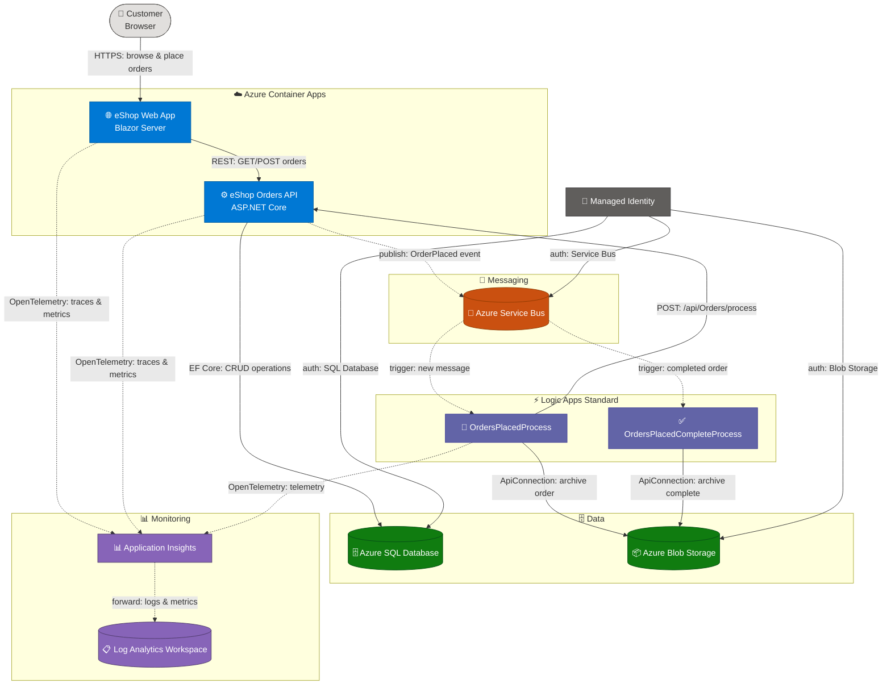

# Azure Logic Apps Monitoring

[](https://github.com/Evilazaro/Azure-LogicApps-Monitoring/actions/workflows/ci-dotnet.yml)
[](https://github.com/Evilazaro/Azure-LogicApps-Monitoring/actions/workflows/azure-dev.yml)
[](LICENSE)
[](https://dotnet.microsoft.com)
[](https://azure.microsoft.com/products/logic-apps)

**Azure Logic Apps Monitoring** is a production-ready reference solution that demonstrates end-to-end order management and workflow observability on Azure. The solution provides a Blazor-based storefront, a RESTful Orders API, and Azure Logic Apps Standard workflows that process orders reliably through Service Bus messaging.

The solution addresses the challenge of observing and troubleshooting **event-driven Logic Apps workflows** in production. It integrates Application Insights, Log Analytics, and OpenTelemetry instrumentation so that every order event, workflow execution, and API call is traceable from a single monitoring interface.

The platform is built on **.NET 10**, orchestrated locally with .NET Aspire 13, and deployed to Azure Container Apps and Azure Logic Apps Standard using the Azure Developer CLI (`azd`) with Bicep infrastructure as code.

---

## Table of Contents

- [Features](#features)
- [Architecture](#architecture)
- [Technologies Used](#technologies-used)
- [Quick Start](#quick-start)
- [Configuration](#configuration)
- [Deployment](#deployment)
- [Usage](#usage)
- [Contributing](#contributing)
- [License](#license)

---

## Features

- 🛒 **Order placement and management** via a Blazor Server web frontend and an ASP.NET Core REST API
- ⚡ **Event-driven order processing** powered by Azure Service Bus and Logic Apps Standard workflows
- 📊 **End-to-end observability** with Application Insights, Log Analytics, and OpenTelemetry distributed tracing
- 🔄 **Reliable workflow automation** with two Logic Apps workflows: `OrdersPlacedProcess` and `OrdersPlacedCompleteProcess`
- 🗄️ **Durable order persistence** using Entity Framework Core 10 with Azure SQL Database
- 📦 **Automated order archiving** to Azure Blob Storage for both successful and failed processing outcomes
- 🔐 **Zero-secret security** using a User-Assigned Managed Identity for all Azure resource authentication
- 🏗️ **Infrastructure as Code** with Bicep modules for fully repeatable, parameterized deployments
- 🚀 **One-command deployment** via Azure Developer CLI (`azd up`)
- 🧪 **Cross-platform CI/CD** with GitHub Actions including CodeQL security scanning and code coverage

---

## Architecture

The following diagram shows the high-level runtime architecture of the solution and the primary data flows between actors, services, and infrastructure components.


```mermaid
flowchart TB
    %% ── Actors ────────────────────────────────────────────────────────
    User(["👤 Customer<br/>Browser"])

    %% ── Application Layer ─────────────────────────────────────────────
    subgraph AppLayer["☁️ Azure Container Apps"]
        WebApp["🌐 eShop Web App<br/>Blazor Server"]
        OrdersAPI["⚙️ eShop Orders API<br/>ASP.NET Core"]
    end

    %% ── Messaging ─────────────────────────────────────────────────────
    subgraph MessagingLayer["📨 Messaging"]
        ServiceBus[("📨 Azure Service Bus")]
    end

    %% ── Workflow Layer ────────────────────────────────────────────────
    subgraph WorkflowLayer["⚡ Logic Apps Standard"]
        OrdersPlaced["🔄 OrdersPlacedProcess"]
        OrdersComplete["✅ OrdersPlacedCompleteProcess"]
    end

    %% ── Data Layer ────────────────────────────────────────────────────
    subgraph DataLayer["🗄️ Data"]
        SqlDb[("🗄️ Azure SQL Database")]
        BlobStorage[("📦 Azure Blob Storage")]
    end

    %% ── Monitoring Layer ──────────────────────────────────────────────
    subgraph MonitoringLayer["📊 Monitoring"]
        AppInsights["📊 Application Insights"]
        LogAnalytics[("📋 Log Analytics Workspace")]
    end

    %% ── Identity ──────────────────────────────────────────────────────
    Identity["🔐 Managed Identity"]

    %% ── Interactions ──────────────────────────────────────────────────
    User -->|"HTTPS: browse & place orders"| WebApp
    WebApp -->|"REST: GET/POST orders"| OrdersAPI
    OrdersAPI -->|"EF Core: CRUD operations"| SqlDb
    OrdersAPI -.->|"publish: OrderPlaced event"| ServiceBus
    ServiceBus -.->|"trigger: new message"| OrdersPlaced
    OrdersPlaced -->|"POST: /api/Orders/process"| OrdersAPI
    OrdersPlaced -->|"ApiConnection: archive order"| BlobStorage
    ServiceBus -.->|"trigger: completed order"| OrdersComplete
    OrdersComplete -->|"ApiConnection: archive complete"| BlobStorage
    WebApp -.->|"OpenTelemetry: traces & metrics"| AppInsights
    OrdersAPI -.->|"OpenTelemetry: traces & metrics"| AppInsights
    OrdersPlaced -.->|"OpenTelemetry: telemetry"| AppInsights
    AppInsights -.->|"forward: logs & metrics"| LogAnalytics
    Identity -->|"auth: Service Bus"| ServiceBus
    Identity -->|"auth: Blob Storage"| BlobStorage
    Identity -->|"auth: SQL Database"| SqlDb

    %% ── Styles ────────────────────────────────────────────────────────
    classDef actor fill:#E1DFDD,stroke:#605E5C,color:#323130
    classDef service fill:#0078D4,stroke:#005A9E,color:#FFFFFF
    classDef messaging fill:#CA5010,stroke:#8E3A00,color:#FFFFFF
    classDef workflow fill:#6264A7,stroke:#3B3A96,color:#FFFFFF
    classDef datastore fill:#107C10,stroke:#054B16,color:#FFFFFF
    classDef monitoring fill:#8764B8,stroke:#4B3867,color:#FFFFFF
    classDef identity fill:#605E5C,stroke:#3B3A3C,color:#FFFFFF

    class User actor
    class WebApp,OrdersAPI service
    class ServiceBus messaging
    class OrdersPlaced,OrdersComplete workflow
    class SqlDb,BlobStorage datastore
    class AppInsights,LogAnalytics monitoring
    class Identity identity
```

### Architecture Summary

Customers use the **eShop Web App** (Blazor Server) to browse and place orders, which the **eShop Orders API** (ASP.NET Core) persists to Azure SQL Database via Entity Framework Core. On order creation, the API publishes an event to Azure Service Bus, which triggers the **OrdersPlacedProcess** Logic Apps workflow. This workflow calls the Orders API to process the order and archives the result to Azure Blob Storage. A second workflow, **OrdersPlacedCompleteProcess**, handles completed order events and archives them accordingly. All services emit OpenTelemetry traces and metrics to **Application Insights**, which forwards aggregated data to a **Log Analytics Workspace** for centralized monitoring. A **User-Assigned Managed Identity** provides credential-free authentication to Service Bus, Blob Storage, and SQL Database.

---

## Technologies Used

| Technology                    | Type            | Purpose                                               |
| ----------------------------- | --------------- | ----------------------------------------------------- |
| .NET 10                       | Runtime         | Platform for all C# services                          |
| ASP.NET Core 10               | Framework       | Orders REST API with OpenAPI/Swagger                  |
| Blazor Server                 | Framework       | Interactive server-rendered web frontend              |
| .NET Aspire 13                | Orchestration   | Local development orchestration and cloud deployment  |
| Entity Framework Core 10      | ORM             | Database access layer for order persistence           |
| Microsoft FluentUI Components | UI Library      | Fluent design system for the web frontend             |
| Azure Logic Apps Standard     | Workflow Engine | Event-driven order processing workflows               |
| Azure Service Bus             | Messaging       | Reliable event-driven messaging between services      |
| Azure SQL Database            | Database        | Relational store for order data                       |
| Azure Blob Storage            | Object Storage  | Order archive and Logic Apps workflow state           |
| Azure Container Apps          | Hosting         | Serverless container hosting for API and web app      |
| Azure Container Registry      | Registry        | Private container image storage                       |
| Azure Application Insights    | Monitoring      | Distributed telemetry, traces, and metrics            |
| Azure Log Analytics           | Monitoring      | Centralized log aggregation and querying              |
| OpenTelemetry                 | Observability   | Distributed tracing standard across all services      |
| Azure Developer CLI (azd)     | DevOps          | End-to-end infrastructure provisioning and deployment |
| Bicep                         | IaC             | Repeatable, parameterized infrastructure templates    |
| GitHub Actions                | CI/CD           | Automated build, test, and deployment pipelines       |

---

## Quick Start

### Prerequisites

| Prerequisite                                                                                             | Minimum Version | Notes                                |
| -------------------------------------------------------------------------------------------------------- | --------------- | ------------------------------------ |
| [.NET SDK](https://dotnet.microsoft.com/download)                                                        | `10.0.100`      | Version pinned in `global.json`      |
| [Azure CLI](https://learn.microsoft.com/cli/azure/install-azure-cli)                                     | `2.60.0`        | Required for Azure authentication    |
| [Azure Developer CLI (azd)](https://learn.microsoft.com/azure/developer/azure-developer-cli/install-azd) | `1.11.0`        | Provisions and deploys all resources |
| [Docker Desktop](https://www.docker.com/products/docker-desktop/)                                        | Latest stable   | Required for local container runtime |
| [PowerShell](https://learn.microsoft.com/powershell/scripting/install/installing-powershell)             | `7.0`           | Required by automation hooks         |
| [Bicep CLI](https://learn.microsoft.com/azure/azure-resource-manager/bicep/install)                      | `0.30.0`        | Compiled automatically by `azd`      |

> [!TIP]
> Run `./hooks/check-dev-workstation.ps1` to validate all prerequisites are correctly installed before proceeding.

### Installation

1. Clone the repository:

   ```bash
   git clone https://github.com/Evilazaro/Azure-LogicApps-Monitoring.git
   cd Azure-LogicApps-Monitoring
   ```

2. Authenticate with Azure:

   ```bash
   azd auth login
   az login
   ```

3. Validate your developer workstation:

   ```pwsh
   ./hooks/check-dev-workstation.ps1
   ```

4. Create a new environment:

   ```bash
   azd env new <your-environment-name>
   ```

5. Provision infrastructure and deploy all services:

   ```bash
   azd up
   ```

### Minimal Working Example

After `azd up` completes, open the web application URL printed in the terminal output and place an order through the Blazor UI. To interact with the Orders API directly, open the Swagger UI:

```bash
# Replace <orders-api-url> with the URL printed after azd up
open https://<orders-api-url>/swagger
```

> [!NOTE]
> The post-provision hook (`hooks/postprovision.ps1`) runs automatically after `azd up` to configure SQL managed identity access and populate .NET user secrets for local development.

---

## Configuration

The solution reads configuration from environment variables, `appsettings.json`, and .NET user secrets (local development only). After running `azd up`, user secrets are populated automatically by `hooks/postprovision.ps1`.

| Option                                  | Default        | Description                                               |
| --------------------------------------- | -------------- | --------------------------------------------------------- |
| `solutionName`                          | `orders`       | Base name prefix for all Azure resource names             |
| `envName`                               | `dev`          | Deployment environment (`dev`, `test`, `staging`, `prod`) |
| `location`                              | _(required)_   | Azure region for all resources (e.g., `eastus`)           |
| `ConnectionStrings__OrderDb`            | _(set by azd)_ | Azure SQL Database connection string                      |
| `Azure__TenantId`                       | _(set by azd)_ | Azure AD tenant ID for local development authentication   |
| `Azure__ClientId`                       | _(set by azd)_ | Service principal client ID for local development         |
| `Azure__ServiceBus__HostName`           | _(set by azd)_ | Service Bus namespace hostname                            |
| `APPLICATIONINSIGHTS_CONNECTION_STRING` | _(set by azd)_ | Application Insights connection string                    |

### Example Override

Override the solution name and environment at deployment time using `azd env set`:

```bash
azd env set AZURE_SOLUTION_NAME myeshop
azd env set AZURE_ENV_NAME staging
azd up
```

> [!IMPORTANT]
> Never commit connection strings, API keys, or secrets to source control. All sensitive values are managed through Azure Key Vault and .NET user secrets injected automatically by `azd`.

---

## Deployment

Follow these steps to deploy the full solution to Azure.

1. **Validate prerequisites** — confirm all required tools meet their minimum version requirements:

   ```pwsh
   ./hooks/check-dev-workstation.ps1
   ```

2. **Authenticate** with your Azure account:

   ```bash
   azd auth login
   az login --tenant <tenant-id>
   ```

3. **Create a named environment** to isolate the deployment:

   ```bash
   azd env new production
   ```

4. **Set the target region**:

   ```bash
   azd env set AZURE_LOCATION eastus
   ```

5. **Provision infrastructure and deploy services** in one command:

   ```bash
   azd up
   ```

   > [!NOTE]
   > `azd up` provisions Bicep infrastructure (VNet, SQL, Service Bus, Container Apps, Logic Apps) and then deploys the containerized .NET services. The post-provision hook runs automatically to configure managed identity database access and user secrets.

6. **Deploy Logic Apps workflow definitions** to the provisioned Logic App:

   ```pwsh
   ./hooks/deploy-workflow.ps1
   ```

7. **Tear down all resources** when the deployment is no longer needed:

   ```bash
   azd down
   ```

   > [!WARNING]
   > Running `azd down` permanently deletes all provisioned Azure resources. Back up any order data you need to retain before executing this command.

---

## Usage

### Place an Order via the REST API

```bash
curl -X POST https://<orders-api-url>/api/Orders \
  -H "Content-Type: application/json" \
  -d '{
    "customerId": "customer-001",
    "items": [
      { "productId": "prod-1", "quantity": 2, "unitPrice": 19.99 }
    ]
  }'
```

Expected response (`201 Created`):

```json
{
  "id": "order-abc123",
  "customerId": "customer-001",
  "status": "Placed",
  "totalAmount": 39.98,
  "createdAt": "2026-04-28T12:00:00Z"
}
```

### Retrieve All Orders

```bash
curl https://<orders-api-url>/api/Orders \
  -H "Accept: application/json"
```

Expected response (`200 OK`):

```json
[
  {
    "id": "order-abc123",
    "customerId": "customer-001",
    "status": "Placed",
    "totalAmount": 39.98
  }
]
```

### Generate Test Orders

Use the included script to generate a batch of test orders and trigger the full Service Bus → Logic Apps pipeline:

```pwsh
./hooks/Generate-Orders.ps1
```

### Explore Monitoring in Application Insights

After orders are placed, navigate to your Application Insights resource in the [Azure Portal](https://portal.azure.com) and use **Transaction Search** or **Live Metrics** to observe:

- Distributed traces spanning the Blazor frontend, Orders API, and Logic Apps workflows
- Dependency calls to Azure SQL Database and Azure Blob Storage
- Custom telemetry events emitted by the OpenTelemetry instrumentation in each service

---

## Contributing

Contributions are welcome. To submit a change:

1. **Open an issue** describing the bug or enhancement before starting work.
2. **Fork the repository** and create a feature branch from `main`.
3. **Implement your changes** following the existing code style and .NET conventions.
4. **Run the full test suite** to confirm all tests pass:

   ```bash
   dotnet test app.sln
   ```

5. **Open a pull request** targeting the `main` branch with a clear description of the changes and the problem they solve.

> [!NOTE]
> All pull requests are automatically checked by the GitHub Actions CI pipeline, which runs builds, tests with code coverage, code formatting analysis, and CodeQL security scanning on Ubuntu, Windows, and macOS.

---

## License

This project is licensed under the **MIT License**. See the [LICENSE](LICENSE) file for full details.
