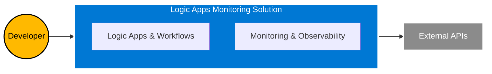
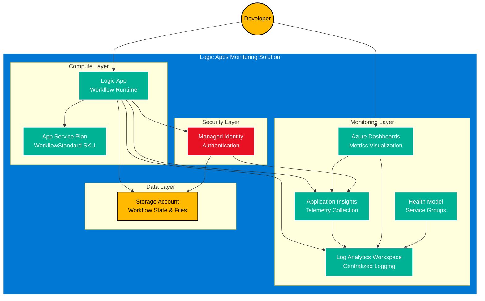

# Azure Logic Apps Monitoring

A comprehensive Infrastructure as Code (IaC) solution demonstrating best practices for monitoring and observability of Azure Logic Apps using Azure Monitor. This project provides a production-ready template for developers and cloud architects to implement enterprise-grade monitoring, logging, and dashboards for Azure Logic Apps and Workflows.

## Badges


## Features

### Comprehensive Monitoring

Provides end-to-end observability for Logic Apps with integrated logging, metrics, and diagnostics to help you understand application behavior and troubleshoot issues quickly.

| Feature | Description |
|---------|-------------|
| Application Insights Integration | Full telemetry collection with instrumentation key and connection string configuration |
| Log Analytics Workspace | Centralized log aggregation with 30-day retention and immutable purge settings |
| Diagnostic Settings | Automatic collection of workflow runtime logs and all metrics categories |
| Azure Monitor Health Model | Hierarchical service group organization for structured health monitoring |

### Metrics & Telemetry

Tracks critical performance indicators and workflow execution data to help you optimize Logic App performance and identify bottlenecks.

| Feature | Description |
|---------|-------------|
| Pre-configured Dashboards | Two production-ready dashboards for App Service Plan and Workflow metrics |
| Workflow Execution Metrics | Tracks runs started, completed, dispatched, and failure rates |
| Action-level Metrics | Monitors individual action failures and execution duration |
| Trigger Metrics | Tracks trigger completions and failure rates |
| Service Plan Metrics | CPU percentage, memory usage, data transfer, and HTTP queue length |

### Security & Compliance

Implements Role-Based Access Control (RBAC) and secure identity management following Azure security best practices.

| Feature | Description |
|---------|-------------|
| Managed Identity Support | System-assigned and user-assigned managed identities for secure resource access |
| RBAC Role Assignments | Automated role assignment for Storage Account, Application Insights, and monitoring |
| Secure Connection Strings | HTTPS-only traffic enforcement and secure storage account access |
| Principle of Least Privilege | Granular permissions with specific role assignments per resource type |

### Infrastructure as Code

Fully automated deployment using Azure Bicep with modular architecture and environment-specific configuration.

| Feature | Description |
|---------|-------------|
| Modular Bicep Templates | Separate modules for monitoring, storage, Logic Apps, and shared resources |
| Azure Developer CLI Support | One-command deployment using azd with parameter substitution |
| Resource Tagging Strategy | Comprehensive tagging for cost tracking, ownership, and environment identification |
| Subscription-level Deployment | Automated resource group creation with location-based resource naming |

## Prerequisites

Before deploying this solution, ensure you have the following:

- **Azure Subscription**: An active Azure subscription with Contributor or Owner permissions
- **Azure CLI**: Version 2.50.0 or later ([Install Azure CLI](https://learn.microsoft.com/cli/azure/install-azure-cli))
- **Azure Developer CLI (azd)**: Version 1.5.0 or later ([Install azd](https://learn.microsoft.com/azure/developer/azure-developer-cli/install-azd))
- **PowerShell or Bash**: For running deployment commands
- **Visual Studio Code** (recommended): With Azure Bicep extension for template editing

## Installation & Setup

### Step 1: Clone the Repository

```bash
git clone https://github.com/yourusername/Azure-LogicApps-Monitoring.git
cd Azure-LogicApps-Monitoring
```

### Step 2: Log in to Azure

Authenticate with your Azure account using the Azure Developer CLI:

```bash
azd auth login
```

### Step 3: Initialize the Environment

Create a new environment for your deployment. Replace `<environment-name>` with a meaningful name (e.g., `dev`, `prod`):

```bash
azd env new <environment-name>
```

### Step 4: Set the Deployment Location

Configure the Azure region where resources will be deployed. Replace `<location>` with your preferred region (e.g., `eastus2`, `westeurope`):

```bash
azd env set AZURE_LOCATION <location>
```

### Step 5: Deploy the Infrastructure

Deploy all resources to your Azure subscription:

```bash
azd provision
```

The deployment process will:
- Create a resource group named `contoso-tax-docs-rg`
- Deploy Log Analytics Workspace, Application Insights, and Storage Account
- Create an App Service Plan with WorkflowStandard SKU
- Deploy a Logic App with diagnostic settings enabled
- Configure RBAC role assignments
- Create pre-configured monitoring dashboards

### Step 6: Verify Deployment

After deployment completes, verify resources in the Azure Portal:

```bash
azd show
```

## Usage Examples

### Deploy the Logic App

After infrastructure provisioning, deploy your Logic App workflows by accessing the Logic App in the Azure Portal:

1. Navigate to the deployed Logic App resource
2. Open the **Workflows** blade
3. Create a new workflow or import an existing workflow definition
4. Configure triggers and actions as needed

### View Logs in Log Analytics

Query workflow execution logs using Kusto Query Language (KQL):

```bash
az monitor log-analytics query \
  --workspace <workspace-id> \
  --analytics-query "AzureDiagnostics | where ResourceType == 'WORKFLOWS' | take 100"
```

Example query to view failed workflow runs:

```kusto
AzureDiagnostics
| where Category == "WorkflowRuntime"
| where status_s == "Failed"
| project TimeGenerated, workflowName_s, status_s, error_message_s
| order by TimeGenerated desc
```

### Access Dashboards

The solution deploys two pre-configured dashboards:

1. **App Service Plan Dashboard**: Monitors CPU, memory, data transfer, and HTTP queue length
2. **Workflow Dashboard**: Tracks workflow runs, actions, triggers, and failure rates

Access dashboards in the Azure Portal:
- Navigate to **Dashboard Hub** → **Browse all dashboards**
- Select dashboards named `<solution-name>-asp-dashboard` or `<solution-name>-dashboard`

### Query Metrics

Retrieve workflow failure rate metrics using Azure CLI:

```bash
az monitor metrics list \
  --resource <logic-app-resource-id> \
  --metric WorkflowRunsFailureRate \
  --start-time 2024-01-01T00:00:00Z \
  --end-time 2024-01-31T23:59:59Z \
  --interval PT1H
```

View Application Insights telemetry:

```bash
az monitor app-insights metrics show \
  --app <app-insights-name> \
  --metric requests/count \
  --start-time 2024-01-01 \
  --end-time 2024-01-31
```

## Architecture

### Context Diagram

This diagram shows the system boundary and external actors interacting with the Logic Apps Monitoring Solution.


```mermaid
flowchart LR
    Developer((Developer))
    ExternalAPI[External APIs]
    
    Developer --> System
    System --> ExternalAPI
    
    subgraph System [Logic Apps Monitoring Solution]
        direction TB
        LogicApp[Logic Apps & Workflows]
        Monitoring[Monitoring & Observability]
    end
    
    classDef person fill:#FFB900,stroke:#000,color:#000,stroke-width:2px;
    classDef system fill:#0078D4,stroke:#fff,color:#fff,stroke-width:3px;
    classDef external fill:#8B8B8B,stroke:#fff,color:#fff,stroke-width:2px;
    
    class Developer person;
    class System system;
    class ExternalAPI external;
```

### Container Diagram

This diagram shows the internal components and their relationships within the Logic Apps Monitoring Solution.


```mermaid
flowchart TB
    Developer((Developer))
    
    Developer --> Dashboard
    Developer --> LogicApp
    
    subgraph System [Logic Apps Monitoring Solution]
        direction TB
        
        subgraph Compute [Compute Layer]
            AppServicePlan[App Service Plan<br/>WorkflowStandard SKU]
            LogicApp[Logic App<br/>Workflow Runtime]
        end
        
        subgraph Monitoring [Monitoring Layer]
            AppInsights[Application Insights<br/>Telemetry Collection]
            LogAnalytics[Log Analytics Workspace<br/>Centralized Logging]
            Dashboard[Azure Dashboards<br/>Metrics Visualization]
            HealthModel[Health Model<br/>Service Groups]
        end
        
        subgraph Data [Data Layer]
            Storage[Storage Account<br/>Workflow State & Files]
        end
        
        subgraph Security [Security Layer]
            ManagedIdentity[Managed Identity<br/>Authentication]
        end
        
        LogicApp --> AppServicePlan
        LogicApp --> AppInsights
        LogicApp --> LogAnalytics
        LogicApp --> Storage
        LogicApp --> ManagedIdentity
        
        AppInsights --> LogAnalytics
        Dashboard --> LogAnalytics
        Dashboard --> AppInsights
        HealthModel --> LogAnalytics
        
        ManagedIdentity --> Storage
        ManagedIdentity --> AppInsights
    end
    
    classDef person fill:#FFB900,stroke:#000,color:#000,stroke-width:2px;
    classDef system fill:#0078D4,stroke:#fff,color:#fff,stroke-width:3px;
    classDef container fill:#00B294,stroke:#fff,color:#fff,stroke-width:2px;
    classDef data fill:#FFB900,stroke:#000,color:#000,stroke-width:2px;
    classDef security fill:#E81123,stroke:#fff,color:#fff,stroke-width:2px;
    
    class Developer person;
    class System system;
    class AppServicePlan,LogicApp,AppInsights,LogAnalytics,Dashboard,HealthModel container;
    class Storage data;
    class ManagedIdentity security;
```

### Key Components

| Component | Description | Purpose | Key Features |
|-----------|-------------|---------|--------------|
| **Logic App** | Workflow runtime hosted on App Service Plan | Executes business logic and integrations | Stateful workflows, HTTP triggers, actions, system-assigned identity |
| **App Service Plan** | Elastic compute infrastructure for Logic Apps | Hosts Logic App runtime with auto-scaling | WorkflowStandard SKU, elastic scale (up to 20 workers), zone redundancy support |
| **Application Insights** | APM and telemetry service | Collects performance metrics, traces, and logs | Instrumentation key, connection string, workspace integration |
| **Log Analytics Workspace** | Centralized log repository | Aggregates logs from all resources | 30-day retention, KQL query support, diagnostic settings integration |
| **Storage Account** | State persistence and file storage | Stores workflow state, queue messages, and files | Standard_LRS replication, HTTPS-only, hot access tier |
| **Azure Dashboards** | Visual metrics and monitoring | Real-time visibility into Logic App performance | Pre-configured charts, 24-hour time range, metric filtering |
| **Managed Identity** | Azure AD authentication service | Passwordless authentication to Azure resources | User-assigned identity, RBAC role assignments |
| **Health Model** | Service group hierarchy | Organizes resources for health monitoring | Tenant-level service groups, parent-child relationships |

### Deployed RBAC Roles

The solution automatically assigns these RBAC (Role-Based Access Control) roles to the Managed Identity:

| Role Name | Role Description | Documentation Link |
|-----------|------------------|-------------------|
| **Storage Account Contributor** | Full management of storage accounts (excluding access keys) | [Microsoft Docs](https://learn.microsoft.com/azure/role-based-access-control/built-in-roles#storage-account-contributor) |
| **Storage Blob Data Owner** | Full access to blob containers and data, including ACL management | [Microsoft Docs](https://learn.microsoft.com/azure/role-based-access-control/built-in-roles#storage-blob-data-owner) |
| **Storage Queue Data Contributor** | Read, write, and delete queue messages | [Microsoft Docs](https://learn.microsoft.com/azure/role-based-access-control/built-in-roles#storage-queue-data-contributor) |
| **Storage Table Data Contributor** | Read, write, and delete table data | [Microsoft Docs](https://learn.microsoft.com/azure/role-based-access-control/built-in-roles#storage-table-data-contributor) |
| **Storage File Data Privileged Contributor** | Read, write, delete, and modify file share ACLs | [Microsoft Docs](https://learn.microsoft.com/azure/role-based-access-control/built-in-roles#storage-file-data-privileged-contributor) |
| **Monitoring Metrics Publisher** | Publish metrics to Azure Monitor | [Microsoft Docs](https://learn.microsoft.com/azure/role-based-access-control/built-in-roles#monitoring-metrics-publisher) |

## File Structure

```
Azure-LogicApps-Monitoring/
├── .azure/
│   ├── .gitignore
│   ├── config.json
│   └── dev/
│       ├── .env
│       └── config.json
├── infra/
│   ├── main.bicep
│   └── main.parameters.json
├── src/
│   ├── logic-app.bicep
│   ├── monitoring/
│   │   ├── app-insights.bicep
│   │   ├── azure-monitor-health-model.bicep
│   │   ├── log-analytics-workspace.bicep
│   │   └── main.bicep
│   └── shared/
│       ├── main.bicep
│       └── data/
│           └── main.bicep
├── .gitignore
├── azure.yaml
├── CODE_OF_CONDUCT.md
├── CONTRIBUTING.md
├── LICENSE.md
├── README.md
└── SECURITY.md
```

### Key Files Explained

| File | Name | File Path | Description |
|------|------|-----------|-------------|
| **Main Entry Point** | main.bicep | main.bicep | Subscription-level deployment orchestrator that creates resource group and deploys all modules |
| **Parameters File** | main.parameters.json | main.parameters.json | Deployment parameters with environment variable substitution for location |
| **Logic App Module** | logic-app.bicep | logic-app.bicep | Deploys App Service Plan, Logic App, diagnostic settings, and two monitoring dashboards |
| **Monitoring Orchestrator** | main.bicep | main.bicep | Deploys health model, Log Analytics Workspace, and Application Insights in sequence |
| **Application Insights** | app-insights.bicep | app-insights.bicep | Creates Application Insights with workspace integration and RBAC role assignment |
| **Log Analytics** | log-analytics-workspace.bicep | log-analytics-workspace.bicep | Deploys Log Analytics Workspace with PerGB2018 SKU and 30-day retention |
| **Health Model** | azure-monitor-health-model.bicep | azure-monitor-health-model.bicep | Creates hierarchical service groups for health monitoring |
| **Shared Resources** | main.bicep | main.bicep | Deploys managed identity, storage account, and monitoring infrastructure |
| **Storage Module** | main.bicep | main.bicep | Creates storage account with RBAC role assignments for managed identity |
| **Azure Developer CLI Config** | azure.yaml | azure.yaml | Defines azd project name and structure |
| **Git Ignore** | .gitignore | .gitignore | Excludes build artifacts, secrets, and environment files from version control |

## Additional Resources

- **[Azure Logic Apps Documentation](https://learn.microsoft.com/azure/logic-apps/)** - Comprehensive guide to building and deploying Logic Apps
- **[Azure Monitor Documentation](https://learn.microsoft.com/azure/azure-monitor/)** - Learn about monitoring and observability on Azure
- **[Log Analytics Workspace Overview](https://learn.microsoft.com/azure/azure-monitor/logs/log-analytics-workspace-overview)** - Centralized logging and query capabilities
- **[Application Insights for Logic Apps](https://learn.microsoft.com/azure/logic-apps/monitor-logic-apps-log-analytics)** - Telemetry and diagnostics for Logic Apps
- **[Azure Bicep Documentation](https://learn.microsoft.com/azure/azure-resource-manager/bicep/)** - Infrastructure as Code with declarative syntax
- **[Azure Developer CLI (azd)](https://learn.microsoft.com/azure/developer/azure-developer-cli/)** - Accelerated Azure deployment workflows
- **[Azure RBAC Built-in Roles](https://learn.microsoft.com/azure/role-based-access-control/built-in-roles)** - Reference for role-based access control permissions
- **[Kusto Query Language (KQL)](https://learn.microsoft.com/azure/data-explorer/kusto/query/)** - Query logs in Log Analytics Workspace

## Support

### Getting Help

If you encounter issues or have questions about this project:

- **GitHub Issues**: [Report bugs or request features](https://github.com/yourusername/Azure-LogicApps-Monitoring/issues)
- **GitHub Discussions**: [Ask questions and share ideas](https://github.com/yourusername/Azure-LogicApps-Monitoring/discussions)
- **Azure Support**: For Azure service-related issues, contact [Azure Support](https://azure.microsoft.com/support/)

### Contributing

We welcome contributions! Please see our CONTRIBUTING.md guide for details on:
- How to submit pull requests
- Code standards and conventions
- Testing requirements
- Documentation guidelines

### Code of Conduct

This project has adopted the Contributor Covenant Code of Conduct. Please read and follow these guidelines when participating in this project.

### Security

If you discover a security vulnerability, please follow the instructions in SECURITY.md to report it responsibly.

---

**License**: This project is licensed under the MIT License - see the LICENSE.md file for details.