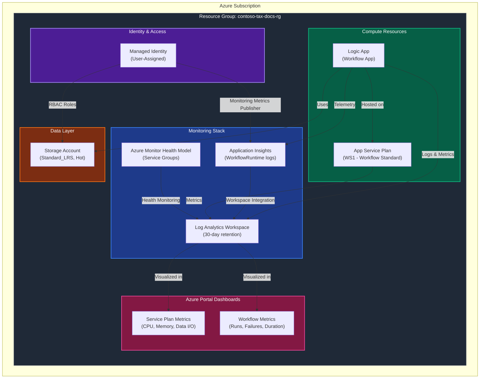

# Azure Logic Apps Monitoring

A comprehensive Infrastructure as Code (IaC) solution demonstrating Azure Monitor best practices for Logic Apps. This project provides production-ready templates for deploying Logic Apps with integrated monitoring, observability, and health tracking using Azure Bicep. Designed for developers and architects seeking to implement robust monitoring strategies for workflow automation.

---

## Badges


---

## Prerequisites

- **Azure Subscription**: Active subscription with Contributor or Owner access
- **Azure Developer CLI (azd)**: Version 1.0.0 or higher ([Installation Guide](https://learn.microsoft.com/azure/developer/azure-developer-cli/install-azd))
- **Azure CLI**: Version 2.50.0 or higher ([Installation Guide](https://learn.microsoft.com/cli/azure/install-azure-cli))
- **Bicep CLI**: Version 0.23.0 or higher (installed with Azure CLI)
- **Permissions**: Ability to create resource groups and assign RBAC (Role-Based Access Control) roles at subscription level
- **Knowledge**: Basic understanding of Azure Logic Apps, Azure Monitor, and Log Analytics

---

## File Structure

```
Azure-LogicApps-Monitoring/
├── .azure/                          # Azure Developer CLI configuration
│   ├── config.json                  # Environment configuration
│   └── dev/
│       ├── .env                     # Environment variables
│       └── config.json              # Development environment settings
├── infra/                           # Infrastructure as Code templates
│   ├── main.bicep                   # Main deployment orchestrator
│   └── main.parameters.json         # Deployment parameters
├── src/                             # Source templates
│   ├── logic-app.bicep              # Logic App and monitoring dashboards
│   ├── monitoring/                  # Monitoring infrastructure
│   │   ├── main.bicep               # Monitoring orchestrator
│   │   ├── app-insights.bicep       # Application Insights configuration
│   │   ├── azure-monitor-health-model.bicep  # Health model service groups
│   │   └── log-analytics-workspace.bicep     # Log Analytics workspace
│   └── shared/                      # Shared resources
│       ├── main.bicep               # Shared orchestrator
│       └── data/
│           └── main.bicep           # Storage account configuration
├── azure.yaml                       # Azure Developer CLI project definition
├── .gitignore                       # Git ignore rules
├── CODE_OF_CONDUCT.md               # Community guidelines
├── CONTRIBUTING.md                  # Contribution guidelines
├── LICENSE.md                       # Project license
├── README.md                        # This file
└── SECURITY.md                      # Security policies
```

---

## Architecture

### System Architecture


```mermaid
flowchart TB
    subgraph Subscription["Azure Subscription"]
        subgraph RG["Resource Group: contoso-tax-docs-rg"]
            subgraph Monitoring["Monitoring Stack"]
                LAW["Log Analytics Workspace<br/>(30-day retention)"]
                AI["Application Insights<br/>(WorkflowRuntime logs)"]
                HM["Azure Monitor Health Model<br/>(Service Groups)"]
            end
            
            subgraph Compute["Compute Resources"]
                ASP["App Service Plan<br/>(WS1 - Workflow Standard)"]
                LA["Logic App<br/>(Workflow App)"]
            end
            
            subgraph Storage["Data Layer"]
                SA["Storage Account<br/>(Standard_LRS, Hot)"]
            end
            
            subgraph Identity["Identity & Access"]
                MI["Managed Identity<br/>(User-Assigned)"]
            end
            
            subgraph Dashboards["Azure Portal Dashboards"]
                DASH_ASP["Service Plan Metrics<br/>(CPU, Memory, Data I/O)"]
                DASH_WF["Workflow Metrics<br/>(Runs, Failures, Duration)"]
            end
        end
    end
    
    MI -->|RBAC Roles| SA
    MI -->|Monitoring Metrics Publisher| AI
    LA -->|Hosted on| ASP
    LA -->|Uses| SA
    LA -->|Logs & Metrics| LAW
    LA -->|Telemetry| AI
    AI -->|Workspace Integration| LAW
    ASP -->|Metrics| LAW
    LAW -->|Visualized in| DASH_ASP
    LAW -->|Visualized in| DASH_WF
    HM -->|Health Monitoring| LAW
    
    style Monitoring fill:#1E3A8A,stroke:#3B82F6,stroke-width:2px,color:#FFFFFF
    style Compute fill:#065F46,stroke:#10B981,stroke-width:2px,color:#FFFFFF
    style Storage fill:#7C2D12,stroke:#F97316,stroke-width:2px,color:#FFFFFF
    style Identity fill:#4C1D95,stroke:#A78BFA,stroke-width:2px,color:#FFFFFF
    style Dashboards fill:#831843,stroke:#EC4899,stroke-width:2px,color:#FFFFFF
    style RG fill:#1F2937,stroke:#6B7280,stroke-width:1px,color:#FFFFFF
```

### Data Flow

```mermaid
sequenceDiagram
    participant User
    participant LA as Logic App
    participant AI as Application Insights
    participant LAW as Log Analytics Workspace
    participant Dashboard as Azure Portal Dashboard
    participant SA as Storage Account
    
    User->>LA: Trigger Workflow
    activate LA
    
    LA->>SA: Read/Write Data
    SA-->>LA: Data Response
    
    LA->>AI: Send Telemetry<br/>(InstrumentationKey)
    Note over LA,AI: Connection String:<br/>APPLICATIONINSIGHTS_CONNECTION_STRING
    
    LA->>LAW: Stream Logs<br/>(WorkflowRuntime Category)
    Note over LA,LAW: Diagnostic Settings:<br/>Logs + Metrics
    
    AI->>LAW: Forward Telemetry<br/>(Workspace Integration)
    
    LA->>LA: Execute Actions
    
    alt Workflow Success
        LA-->>User: Success Response
    else Workflow Failure
        LA->>LAW: Failure Logs
        LA->>AI: Exception Telemetry
        LA-->>User: Error Response
    end
    
    deactivate LA
    
    User->>Dashboard: View Metrics
    Dashboard->>LAW: Query Metrics<br/>(KQL)
    LAW-->>Dashboard: Return Data
    Dashboard-->>User: Display Charts<br/>(Runs, Failures, Duration)
    
    Note over Dashboard: Auto-refresh<br/>24-hour window
    
    style LA fill:#065F46,stroke:#10B981,color:#FFFFFF
    style AI fill:#1E3A8A,stroke:#3B82F6,color:#FFFFFF
    style LAW fill:#1E3A8A,stroke:#3B82F6,color:#FFFFFF
    style Dashboard fill:#831843,stroke:#EC4899,color:#FFFFFF
    style SA fill:#7C2D12,stroke:#F97316,color:#FFFFFF
```

### Key Components

| Component | Description | Purpose | Key Features |
|-----------|-------------|---------|--------------|
| **Logic App (Workflow App)** | Standard-tier Logic App hosted on App Service Plan | Execute business workflows with monitoring | WorkflowRuntime logging, System-assigned identity, App Insights integration |
| **App Service Plan (WS1)** | Workflow Standard SKU with elastic scaling | Provide compute capacity for Logic App | Elastic scale (up to 20 workers), zone-redundant capable, dedicated monitoring |
| **Application Insights** | APM (Application Performance Management) service | Collect telemetry and performance metrics | Instrumentation key injection, workspace integration, diagnostic settings |
| **Log Analytics Workspace** | Centralized log aggregation and analytics | Store and query logs across all resources | 30-day retention, PerGB2018 pricing, system-assigned identity, immediate purge on 30 days |
| **Azure Monitor Health Model** | Hierarchical service group structure | Organize monitoring resources logically | Tenant-level service groups, parent-child relationships |
| **Storage Account** | Standard LRS, Hot tier storage | Provide durable storage for Logic App state | HTTPS-only, RBAC-based access (9 roles), unique naming with truncation |
| **User-Assigned Managed Identity** | Azure AD identity for the workload | Enable secure, credential-free access | RBAC assignments to Storage, Application Insights |
| **Azure Portal Dashboards** | Pre-configured metric visualizations | Provide operational visibility | Service Plan metrics (CPU, memory, I/O), Workflow metrics (runs, failures, triggers) |

### RBAC Roles

| Role Name | Description | Documentation Link |
|-----------|-------------|-------------------|
| **Storage Account Contributor** | Manage storage accounts (excluding access to data) | [Microsoft Learn](https://learn.microsoft.com/azure/role-based-access-control/built-in-roles#storage-account-contributor) |
| **Storage Blob Data Owner** | Full access to Azure Storage blob containers and data | [Microsoft Learn](https://learn.microsoft.com/azure/role-based-access-control/built-in-roles#storage-blob-data-owner) |
| **Storage Queue Data Contributor** | Read, write, and delete Azure Storage queues and messages | [Microsoft Learn](https://learn.microsoft.com/azure/role-based-access-control/built-in-roles#storage-queue-data-contributor) |
| **Storage Table Data Contributor** | Read, write, and delete Azure Storage tables and entities | [Microsoft Learn](https://learn.microsoft.com/azure/role-based-access-control/built-in-roles#storage-table-data-contributor) |
| **Monitoring Metrics Publisher** | Publish metrics to Azure Monitor | [Microsoft Learn](https://learn.microsoft.com/azure/role-based-access-control/built-in-roles#monitoring-metrics-publisher) |
| **Storage File Data Privileged Contributor** | Full access to Azure Storage file shares via SMB/REST with elevated privileges | [Microsoft Learn](https://learn.microsoft.com/azure/role-based-access-control/built-in-roles#storage-file-data-privileged-contributor) |
| **Storage File Data SMB MI Admin** | Manage file share permissions for managed identities via SMB | [Microsoft Learn](https://learn.microsoft.com/azure/role-based-access-control/built-in-roles#storage-file-data-smb-share-elevated-contributor) |
| **Storage File Data SMB Share Contributor** | Read, write, and delete access to Azure Storage file shares via SMB | [Microsoft Learn](https://learn.microsoft.com/azure/role-based-access-control/built-in-roles#storage-file-data-smb-share-contributor) |
| **Storage File Data SMB Share Elevated Contributor** | Full access to Azure Storage file shares via SMB with elevated permissions | [Microsoft Learn](https://learn.microsoft.com/azure/role-based-access-control/built-in-roles#storage-file-data-smb-share-elevated-contributor) |

---

## Features

### Comprehensive Monitoring

**Description**: This solution implements end-to-end observability for Logic Apps using Azure Monitor, Application Insights, and Log Analytics. All resources deploy with diagnostic settings configured to capture logs and metrics, providing complete visibility into workflow execution, infrastructure health, and operational trends.

**Benefits & Best Practices Applied**:
- **Centralized Logging**: All logs stream to Log Analytics Workspace for unified querying
- **Automatic Retention Management**: 30-day retention with immediate purge reduces costs
- **Workspace Integration**: Application Insights forwards telemetry to Log Analytics for correlation
- **Diagnostic Settings**: Configured at deployment time (no post-deployment manual setup)

| Feature | Description | Implementation | Documentation |
|---------|-------------|----------------|---------------|
| **WorkflowRuntime Logs** | Capture detailed execution logs for all workflow runs | Diagnostic settings on Logic App resource (`WorkflowRuntime` category) | [Monitor Logic Apps](https://learn.microsoft.com/azure/logic-apps/monitor-logic-apps-log-analytics) |
| **Application Insights Integration** | Distributed tracing and dependency tracking | Connection string injected via `APPLICATIONINSIGHTS_CONNECTION_STRING` app setting | [Application Insights Overview](https://learn.microsoft.com/azure/azure-monitor/app/app-insights-overview) |
| **Log Analytics Workspace** | Centralized log aggregation and KQL (Kusto Query Language) querying | PerGB2018 pricing tier, 30-day retention, system-assigned identity | [Log Analytics Workspace](https://learn.microsoft.com/azure/azure-monitor/logs/log-analytics-workspace-overview) |
| **Health Model Service Groups** | Hierarchical monitoring organization | Tenant-level service groups linked to root service group | [Service Groups Preview](https://learn.microsoft.com/azure/azure-monitor/service-groups/overview) |

---

### Metrics & Telemetry

**Description**: Pre-configured dashboards and metrics collection provide real-time operational insights. Two dashboards monitor App Service Plan infrastructure and Logic App workflow execution, capturing 15+ metrics across CPU, memory, network, and workflow performance.

**Benefits & Best Practices Applied**:
- **Proactive Monitoring**: Failure rate and latency metrics enable early issue detection
- **Resource Optimization**: CPU/memory trends inform scaling decisions
- **24-Hour Time Window**: Dashboards default to past 24 hours with auto-refresh
- **Auto-Grain Selection**: Time granularity adjusts automatically for optimal visualization

| Feature | Description | Metrics Captured | Dashboard Location |
|---------|-------------|------------------|-------------------|
| **Service Plan Metrics** | Monitor infrastructure health and capacity | CPU Percentage, Memory Percentage, Data In/Out, HTTP Queue Length | logic-app.bicep (lines 56-301) |
| **Workflow Execution Metrics** | Track workflow run success, failures, and performance | Actions Failure Rate, Job Execution Duration, Runs Completed, Runs Dispatched, Runs Failure Rate, Runs Started, Triggers Completed, Triggers Failure Rate | logic-app.bicep (lines 416-715) |
| **AllMetrics Collection** | Capture all available platform metrics | All standard Logic App and App Service Plan metrics | Diagnostic settings in logic-app.bicep |
| **Monitoring Metrics Publisher** | Enable managed identity to write custom metrics | Custom metric publishing via RBAC | app-insights.bicep |

---

### Security & Compliance

**Description**: The solution follows Azure security best practices with managed identities, RBAC-based access control, and HTTPS-only communication. No credentials are stored in code or configuration files, and all resources enforce encryption in transit and at rest.

**Benefits & Best Practices Applied**:
- **Credential-Free Authentication**: Managed identities eliminate secrets management
- **Least Privilege Access**: RBAC roles grant only necessary permissions
- **Encryption by Default**: HTTPS-only storage, TLS 1.2+ for all connections
- **Audit Trail**: All access logged in Azure Activity Log

| Feature | Description | Security Mechanism | Implementation |
|---------|-------------|-------------------|----------------|
| **User-Assigned Managed Identity** | Secure, credential-free authentication | Azure AD-based authentication via managed identity | main.bicep (lines 6-11) |
| **RBAC Role Assignments** | Granular access control to storage and monitoring | 9 role assignments at resource scope | main.bicep (lines 31-43) |
| **HTTPS-Only Storage** | Enforce encrypted communication | `supportsHttpsTrafficOnly: true` property | main.bicep (line 24) |
| **System-Assigned Identity for Logs** | Log Analytics Workspace identity for secure data access | System-assigned managed identity on Log Analytics | log-analytics-workspace.bicep (lines 8-10) |

---

### Infrastructure as Code

**Description**: All resources deploy via Azure Bicep templates using modular, reusable modules. The solution follows enterprise IaC best practices with parameterization, tagging, and deterministic naming using `uniqueString()` for globally unique resource names.

**Benefits & Best Practices Applied**:
- **Modular Architecture**: Separate modules for monitoring, storage, and compute
- **Consistent Tagging**: All resources tagged for cost tracking and organization
- **Deterministic Naming**: `uniqueString()` ensures reproducible, unique names
- **Dependency Management**: Explicit `dependsOn` clauses prevent race conditions

| Feature | Description | Implementation | Files |
|---------|-------------|----------------|-------|
| **Modular Bicep Templates** | Reusable, composable infrastructure modules | 8 Bicep modules with clear separation of concerns | main.bicep, main.bicep, main.bicep |
| **Azure Developer CLI Support** | Simplified deployment workflow | azure.yaml project definition for `azd` commands | azure.yaml |
| **Parameterization** | Environment-specific configuration | main.parameters.json with token replacement | main.parameters.json |
| **Resource Tagging Strategy** | Consistent metadata across all resources | 7 standard tags: Solution, Environment, ManagedBy, CostCenter, Owner, ApplicationName, BusinessUnit | main.bicep (lines 6-14) |
| **Subscription-Level Deployment** | Automated resource group creation | `targetScope = 'subscription'` with resource group module | main.bicep (lines 1, 17-21) |

---

## Installation & Setup

### Clone the Repository

Clone the project to your local machine:

```bash
git clone https://github.com/your-org/Azure-LogicApps-Monitoring.git
cd Azure-LogicApps-Monitoring
```

### Login to Azure

Authenticate with Azure using the Azure Developer CLI:

```bash
azd auth login
```

**Expected Output**: Your default web browser will open to the Azure sign-in page. After successful authentication, you'll see a confirmation message in the terminal:

```
Logged in to Azure.
```

### Initialize Environment

Initialize the Azure Developer CLI environment (creates .azure directory with configuration):

```bash
azd init
```

**Expected Output**: You'll be prompted to select or create an environment name. The CLI will generate configuration files:

```
Initializing a new project (azd init)

? Enter a new environment name: dev
Environment 'dev' created.
```

### Provision Infrastructure

Deploy all Azure resources using the Bicep templates:

```bash
azd provision
```

**Expected Output**: The CLI will prompt for required parameters (location), then create resources:

```
Provisioning Azure resources (azd provision)
Provisioning Azure resources can take some time

  You can view detailed progress in the Azure Portal:
  https://portal.azure.com/#view/HubsExtension/DeploymentDetailsBlade/...

  (✓) Done: Resource group: contoso-tax-docs-rg
  (✓) Done: Log Analytics workspace: tax-docs-...-law
  (✓) Done: Application Insights: tax-docs-...-appinsights
  (✓) Done: Storage account: taxdocs...stg
  (✓) Done: App Service Plan: tax-docs-...-asp
  (✓) Done: Logic App: tax-docs-...-logicapp

SUCCESS: Your application was provisioned in Azure in X minutes Y seconds.
```

**Note**: Deployment typically takes 3-5 minutes. Resource names include a unique suffix generated by `uniqueString()` to ensure global uniqueness.

---

## Usage Examples

### Viewing Dashboards

**Access Pre-Configured Dashboards**:

1. Navigate to the [Azure Portal](https://portal.azure.com)
2. In the left navigation menu, select **Dashboard**
3. From the dashboard dropdown at the top, select one of the deployed dashboards:
   - **`{name}-dashboard`**: Workflow metrics (runs, failures, triggers)
   - **`{appServicePlan.name}-dashboard`**: Service plan metrics (CPU, memory, I/O)
4. Dashboards auto-refresh with a 24-hour time window

**Open Dashboard via CLI**:

```bash
# Replace {subscription-id} and {resource-group} with your values
az portal dashboard show \
  --name "tax-docs-dashboard" \
  --resource-group "contoso-tax-docs-rg" \
  --output table
```

**Expected Output**: Dashboard metadata including ID and provisioning state. Copy the dashboard ID and navigate to:

```
https://portal.azure.com/#@{tenant-id}/dashboard/arm{dashboard-id}
```

---

### Log Analytics Queries

Access Log Analytics in the Azure Portal ([Logs blade](https://portal.azure.com/#blade/Microsoft_Azure_Monitoring_Logs/LogsBlade)) and execute the following KQL (Kusto Query Language) queries.

#### Track Failed Workflows

Query all failed workflow runs in the past 24 hours:

```kql
// Query failed Logic App workflow runs
AzureDiagnostics
| where Category == "WorkflowRuntime"
| where status_s == "Failed"
| where TimeGenerated > ago(24h)
| project 
    TimeGenerated,
    workflowName_s,
    runId_s,
    status_s,
    error_message_s = coalesce(error_message_s, "No error message"),
    clientTrackingId_s
| order by TimeGenerated desc
| take 100
```

**Use Case**: Identify recurring failures and correlate with deployment or configuration changes.

---

#### Monitor Workflow Performance

Calculate average, P50, P95, and P99 execution duration by workflow:

```kql
// Analyze workflow execution duration percentiles
AzureDiagnostics
| where Category == "WorkflowRuntime"
| where status_s == "Succeeded"
| where TimeGenerated > ago(24h)
| extend durationMs = tolong(duration_d * 1000)
| summarize 
    RunCount = count(),
    AvgDuration = avg(durationMs),
    P50Duration = percentile(durationMs, 50),
    P95Duration = percentile(durationMs, 95),
    P99Duration = percentile(durationMs, 99)
    by workflowName_s
| project 
    Workflow = workflowName_s,
    RunCount,
    AvgDurationMs = round(AvgDuration, 2),
    P50DurationMs = round(P50Duration, 2),
    P95DurationMs = round(P95Duration, 2),
    P99DurationMs = round(P99Duration, 2)
| order by P99DurationMs desc
```

**Use Case**: Detect performance degradation and identify slow workflows requiring optimization.

---

#### Analyze Trigger Success Rates

Calculate trigger success rate grouped by workflow and trigger type:

```kql
// Trigger success rate by workflow
AzureDiagnostics
| where Category == "WorkflowRuntime"
| where triggerName_s != ""
| where TimeGenerated > ago(7d)
| summarize 
    TotalTriggers = count(),
    SuccessfulTriggers = countif(status_s == "Succeeded"),
    FailedTriggers = countif(status_s == "Failed")
    by workflowName_s, triggerName_s
| extend SuccessRate = round((SuccessfulTriggers * 100.0) / TotalTriggers, 2)
| project 
    Workflow = workflowName_s,
    Trigger = triggerName_s,
    TotalTriggers,
    SuccessfulTriggers,
    FailedTriggers,
    SuccessRatePercent = SuccessRate
| order by SuccessRatePercent asc, TotalTriggers desc
```

**Use Case**: Identify unreliable triggers affecting workflow execution and investigate external dependencies.

---

#### Detect Action Retry Patterns

Identify actions requiring multiple retry attempts:

```kql
// Actions with retry attempts
AzureDiagnostics
| where Category == "WorkflowRuntime"
| where actionName_s != ""
| where retryCount_d > 0
| where TimeGenerated > ago(24h)
| project 
    TimeGenerated,
    workflowName_s,
    runId_s,
    actionName_s,
    status_s,
    retryCount = toint(retryCount_d),
    error_code_s,
    error_message_s
| order by retryCount desc, TimeGenerated desc
| take 100
```

**Use Case**: Diagnose transient failures and optimize retry policies for improved reliability.

---

#### Correlate Workflow Runs Across Resources

Join workflow logs with App Service Plan metrics:

```kql
// Correlate workflow runs with infrastructure metrics
let WorkflowRuns = AzureDiagnostics
| where Category == "WorkflowRuntime"
| where TimeGenerated > ago(1h)
| summarize 
    WorkflowRunCount = count(),
    FailedRuns = countif(status_s == "Failed")
    by bin(TimeGenerated, 5m);
let PlanMetrics = AzureMetrics
| where ResourceProvider == "MICROSOFT.WEB"
| where MetricName in ("CpuPercentage", "MemoryPercentage")
| where TimeGenerated > ago(1h)
| summarize 
    AvgCpu = avg(iif(MetricName == "CpuPercentage", Average, real(null))),
    AvgMemory = avg(iif(MetricName == "MemoryPercentage", Average, real(null)))
    by bin(TimeGenerated, 5m);
WorkflowRuns
| join kind=inner (PlanMetrics) on TimeGenerated
| project 
    TimeGenerated,
    WorkflowRunCount,
    FailedRuns,
    AvgCpuPercent = round(AvgCpu, 2),
    AvgMemoryPercent = round(AvgMemory, 2)
| order by TimeGenerated desc
```

**Use Case**: Correlate workflow failures with infrastructure resource constraints (CPU/memory spikes).

---

## Additional Resources

- **Azure Logic Apps Documentation**: [Overview](https://learn.microsoft.com/azure/logic-apps/logic-apps-overview) | [Monitoring](https://learn.microsoft.com/azure/logic-apps/monitor-logic-apps-log-analytics)
- **Azure Monitor**: [Overview](https://learn.microsoft.com/azure/azure-monitor/overview) | [Best Practices](https://learn.microsoft.com/azure/azure-monitor/best-practices)
- **Application Insights**: [Overview](https://learn.microsoft.com/azure/azure-monitor/app/app-insights-overview) | [Workspace-Based Resources](https://learn.microsoft.com/azure/azure-monitor/app/create-workspace-resource)
- **Log Analytics**: [Workspace Overview](https://learn.microsoft.com/azure/azure-monitor/logs/log-analytics-workspace-overview) | [KQL Query Examples](https://learn.microsoft.com/azure/azure-monitor/logs/queries)
- **Azure Bicep**: [Documentation](https://learn.microsoft.com/azure/azure-resource-manager/bicep/) | [Best Practices](https://learn.microsoft.com/azure/azure-resource-manager/bicep/best-practices)
- **Azure Developer CLI**: [Overview](https://learn.microsoft.com/azure/developer/azure-developer-cli/overview) | [Commands Reference](https://learn.microsoft.com/azure/developer/azure-developer-cli/reference)
- **RBAC Built-in Roles**: [Complete List](https://learn.microsoft.com/azure/role-based-access-control/built-in-roles)
- **Azure Portal Dashboards**: [Create and Share](https://learn.microsoft.com/azure/azure-portal/azure-portal-dashboards)