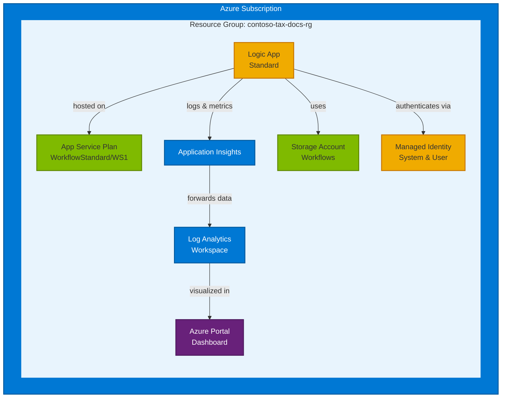

# Azure Logic Apps Monitoring POC

A comprehensive proof of concept demonstrating Azure Monitor integration and observability best practices for Azure Logic Apps workflows.

## Overview

This repository showcases a complete monitoring solution for Azure Logic Apps (Standard tier), demonstrating how to leverage Azure Monitor, Application Insights, and Log Analytics to gain deep visibility into workflow execution, performance, and health.

The project implements infrastructure-as-code using Bicep to deploy a fully monitored Logic Apps environment with a pre-configured Azure Dashboard for real-time insights.

## Features

- **Complete Monitoring Stack**: Integration with Azure Monitor, Application Insights, and Log Analytics Workspace
- **Pre-configured Dashboard**: Azure Portal dashboard with key workflow metrics and visualizations
- **Infrastructure as Code**: All resources defined in Bicep templates for reproducible deployments
- **Security Best Practices**: Managed identities and RBAC-based access control
- **Diagnostic Settings**: Comprehensive logging for all workflow events and metrics
- **Storage Integration**: Connected Azure Storage for workflow state and artifacts

### Monitored Metrics

The solution tracks critical Logic Apps metrics including:

- **Workflow Actions Failure Rate**: Monitor action-level failures across workflows
- **Workflow Runs Completed**: Track successful workflow executions
- **Workflow Runs Dispatched**: View workflow initiation rates
- **Workflow Runs Failure Rate**: Identify workflow-level failures
- **Workflow Runs Started**: Monitor workflow trigger frequency
- **Workflow Triggers Completed**: Track trigger success rates
- **Workflow Triggers Failure Rate**: Detect trigger issues
- **Workflow Job Execution Duration**: Analyze workflow performance and latency

## Architecture


```mermaid
graph TB
    subgraph Azure["Azure Subscription"]
        subgraph RG["Resource Group: contoso-tax-docs-rg"]
            LA[Logic App<br/>Standard]
            ASP[App Service Plan<br/>WorkflowStandard/WS1]
            AI[Application Insights]
            LAW[Log Analytics<br/>Workspace]
            SA[Storage Account<br/>Workflows]
            MI[Managed Identity<br/>System & User]
            DASH[Azure Portal<br/>Dashboard]
            
            LA -->|hosted on| ASP
            LA -->|logs & metrics| AI
            AI -->|forwards data| LAW
            LAW -->|visualized in| DASH
            LA -->|uses| SA
            LA -->|authenticates via| MI
        end
    end
    
    style Azure fill:#0078d4,stroke:#005a9e,stroke-width:2px,color:#fff
    style RG fill:#e8f4fd,stroke:#0078d4,stroke-width:2px
    style LA fill:#f0ab00,stroke:#c87600,stroke-width:2px
    style ASP fill:#7fba00,stroke:#5e8700,stroke-width:2px
    style AI fill:#0078d4,stroke:#005a9e,stroke-width:2px,color:#fff
    style LAW fill:#0078d4,stroke:#005a9e,stroke-width:2px,color:#fff
    style DASH fill:#68217a,stroke:#4e1a5e,stroke-width:2px,color:#fff
    style SA fill:#7fba00,stroke:#5e8700,stroke-width:2px
    style MI fill:#f0ab00,stroke:#c87600,stroke-width:2px
```

## Prerequisites

- Azure subscription with appropriate permissions
- [Azure CLI](https://docs.microsoft.com/cli/azure/install-azure-cli) (version 2.50.0 or later)
- [Azure Developer CLI (azd)](https://learn.microsoft.com/azure/developer/azure-developer-cli/install-azd) (recommended)
- [Bicep CLI](https://learn.microsoft.com/azure/azure-resource-manager/bicep/install) (if deploying manually)

## Installation & Setup

### Option 1: Using Azure Developer CLI (Recommended)

1. **Clone the repository**:
   ```bash
   git clone https://github.com/Evilazaro/Azure-LogicApps-Monitoring.git
   cd Azure-LogicApps-Monitoring
   ```

2. **Initialize the environment**:
   ```bash
   azd init
   ```

3. **Set the Azure location** (if not already configured):
   ```bash
   azd env set AZURE_LOCATION eastus
   ```

4. **Deploy the infrastructure**:
   ```bash
   azd up
   ```

   This command will:
   - Provision all Azure resources
   - Configure monitoring and diagnostics
   - Deploy the Logic Apps environment
   - Create the Azure Portal dashboard

### Option 2: Manual Deployment with Azure CLI

1. **Clone the repository**:
   ```bash
   git clone https://github.com/Evilazaro/Azure-LogicApps-Monitoring.git
   cd Azure-LogicApps-Monitoring
   ```

2. **Login to Azure**:
   ```bash
   az login
   ```

3. **Set your subscription**:
   ```bash
   az account set --subscription "your-subscription-id"
   ```

4. **Deploy the Bicep template**:
   ```bash
   az deployment sub create \
     --location eastus \
     --template-file ./infra/main.bicep \
     --parameters ./infra/main.parameters.json \
     --parameters location=eastus
   ```

## Usage

### Accessing the Dashboard

After deployment, navigate to the Azure Portal dashboard:

1. Go to [Azure Portal](https://portal.azure.com)
2. Navigate to **Dashboards**
3. Select the dashboard named **Tax-Docs-Workflows**
4. View real-time metrics for your Logic Apps workflows

### Viewing Logs in Application Insights

1. Navigate to your Application Insights resource in the portal
2. Go to **Logs** under Monitoring
3. Use KQL queries to analyze workflow behavior:

   ```kql
   // Find failed workflow runs
   traces
   | where customDimensions.Category == "WorkflowRuntime"
   | where customDimensions.Status == "Failed"
   | project timestamp, message, customDimensions
   ```

### Querying Log Analytics

Access detailed logs in Log Analytics Workspace:

1. Navigate to your Log Analytics Workspace
2. Go to **Logs**
3. Query workflow diagnostics:

   ```kql
   // Workflow performance over time
   AzureDiagnostics
   | where ResourceType == "MICROSOFT.WEB/SITES"
   | where Category == "WorkflowRuntime"
   | summarize count() by bin(TimeGenerated, 1h), OperationName
   | render timechart
   ```

### Creating Alerts

Set up alerts for critical scenarios:

1. Navigate to **Azure Monitor** > **Alerts**
2. Click **Create** > **Alert rule**
3. Select your Logic App resource
4. Configure conditions (e.g., `WorkflowRunsFailureRate > 10%`)
5. Add action groups for notifications

## Repository Structure

```
.
├── infra/                          # Infrastructure as Code
│   ├── main.bicep                  # Main deployment template
│   ├── main.parameters.json        # Deployment parameters
│   └── modules/                    # Modular Bicep templates
│       ├── logic-app.bicep         # Logic App and monitoring config
│       ├── monitoring/             # Monitoring resources
│       │   └── main.bicep          # App Insights & Log Analytics
│       └── shared/                 # Shared infrastructure
│           ├── main.bicep          # Managed identity orchestration
│           ├── data/               # Storage resources
│           │   └── main.bicep
│           └── identity/
│               └── main.bicep
├── .azure/                         # Azure Developer CLI config
├── azure.yaml                      # Azure Developer CLI manifest
├── README.md                       # This file
└── .gitignore
```

## Key Resources

The deployment creates the following Azure resources:

| Resource Type | Purpose |
|--------------|---------|
| **Logic App (Standard)** | Workflow execution engine |
| **App Service Plan (WS1)** | Hosting infrastructure for Logic Apps |
| **Application Insights** | Application performance monitoring |
| **Log Analytics Workspace** | Centralized log storage and analysis |
| **Storage Account** | Workflow state and artifacts storage |
| **Managed Identity** | Secure authentication without credentials |
| **Azure Dashboard** | Pre-configured monitoring visualizations |

## Monitoring Best Practices

### 1. Enable Comprehensive Diagnostics

This POC implements diagnostic settings for:
- **WorkflowRuntime logs**: Capture all workflow execution details
- **AllMetrics**: Collect all available performance metrics
- Automatic log forwarding to Log Analytics

### 2. Use Application Insights for Correlation

Application Insights provides:
- End-to-end transaction tracking
- Dependency monitoring
- Custom telemetry for business metrics
- Smart detection of anomalies

### 3. Leverage Managed Identities

All authentication uses managed identities to:
- Eliminate credential management
- Follow zero-trust security principles
- Simplify RBAC configuration

### 4. Monitor Key Metrics

Focus on these critical signals:
- **Availability**: Trigger and run completion rates
- **Performance**: Job execution duration
- **Reliability**: Failure rates at action and workflow levels
- **Capacity**: Resource utilization on App Service Plan

### 5. Set Up Proactive Alerts

Configure alerts for:
- Workflow failure rate exceeds threshold
- Execution duration anomalies
- Trigger failures
- Storage account issues

## Advanced Scenarios

### Custom Telemetry

Add custom tracking in workflow definitions:

```json
{
  "type": "AppendToStringVariable",
  "inputs": {
    "name": "customMetric",
    "value": "@{workflow().run.id}"
  }
}
```

### Cost Optimization

Monitor and optimize costs:
- Review Log Analytics ingestion rates
- Adjust retention policies based on compliance needs
- Use Application Insights sampling for high-volume scenarios

### Multi-Region Deployments

Extend the template for geo-redundancy:
- Deploy to multiple Azure regions
- Configure shared Application Insights with workspace-based resources
- Implement Traffic Manager for failover

## Troubleshooting

### Issue: Dashboard not showing data

**Solution**: Ensure diagnostic settings are enabled and data is flowing:

```bash
az monitor diagnostic-settings list \
  --resource <logic-app-resource-id>
```

### Issue: Missing workflow logs

**Solution**: Verify Application Insights connection:

```bash
az monitor app-insights component show \
  --resource-group contoso-tax-docs-rg \
  --app <app-insights-name>
```

### Issue: High Log Analytics costs

**Solution**: Review data ingestion and adjust retention:

```bash
az monitor log-analytics workspace update \
  --resource-group contoso-tax-docs-rg \
  --workspace-name <workspace-name> \
  --retention-time 30
```

## Contributing

Contributions are welcome! Please follow these guidelines:

1. **Fork the repository**
2. **Create a feature branch**: `git checkout -b feature/your-feature-name`
3. **Make your changes** following these principles:
   - Follow Bicep best practices
   - Add comments for complex configurations
   - Update documentation for new features
4. **Test your changes**: Deploy to a test subscription
5. **Commit with clear messages**: `git commit -m "Add feature: description"`
6. **Push to your fork**: `git push origin feature/your-feature-name`
7. **Open a Pull Request** with a detailed description

### Code Standards

- Use consistent naming conventions (kebab-case for resources)
- Follow Azure Well-Architected Framework principles
- Include inline comments for non-obvious configurations
- Update the README for any new features or changes

## Additional Resources

### Official Documentation

- [Azure Logic Apps Documentation](https://learn.microsoft.com/azure/logic-apps/)
- [Azure Monitor Documentation](https://learn.microsoft.com/azure/azure-monitor/)
- [Application Insights for Logic Apps](https://learn.microsoft.com/azure/logic-apps/monitor-logic-apps-log-analytics)
- [Logic Apps Metrics Reference](https://learn.microsoft.com/azure/azure-monitor/reference/supported-metrics/microsoft-web-sites-metrics)

### Monitoring Guides

- [Logic Apps Monitoring Best Practices](https://learn.microsoft.com/azure/logic-apps/monitor-logic-apps)
- [Diagnostic Logging for Logic Apps](https://learn.microsoft.com/azure/logic-apps/monitor-workflows-collect-diagnostic-data)
- [KQL for Logic Apps](https://learn.microsoft.com/azure/logic-apps/create-monitoring-tracking-queries)

### Azure Well-Architected Framework

- [Operational Excellence for Logic Apps](https://learn.microsoft.com/azure/well-architected/service-guides/azure-logic-apps)
- [Monitoring and Diagnostics](https://learn.microsoft.com/azure/architecture/best-practices/monitoring)

## License

This project is licensed under the MIT License - see the LICENSE file for details.

## Acknowledgments

- Azure Logic Apps product team for monitoring capabilities
- Azure Monitor team for comprehensive observability features
- Community contributors and feedback

---

**Maintained by**: Evilazaro  
**Last Updated**: November 25, 2025  
**Questions?** Open an issue or reach out to the maintainers.