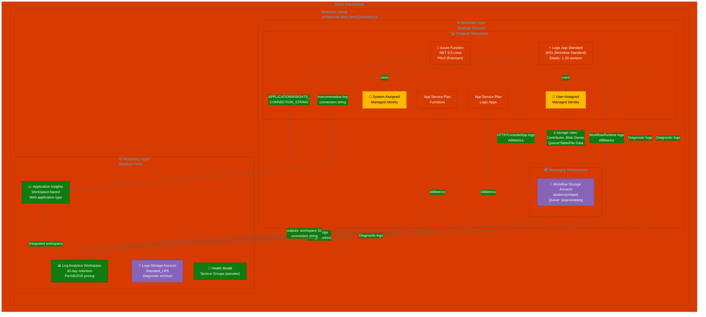
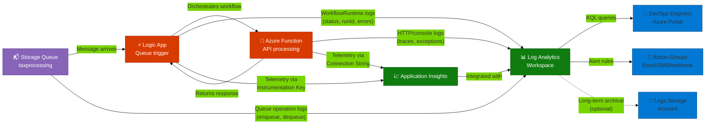

# Azure Logic Apps Standard Monitoring Solution

A production-ready Infrastructure-as-Code (IaC) solution demonstrating comprehensive monitoring best practices for Azure Logic Apps Standard using Bicep templates. This solution provides enterprise-grade observability with Application Insights, Log Analytics, and Azure Monitor integration—purpose-built for workflow orchestration scenarios.

[](LICENSE.md)
[](https://azure.microsoft.com)
[](https://learn.microsoft.com/azure/azure-resource-manager/bicep/)

---

## Table of Contents

- [Overview](#overview)
  - [Purpose](#purpose)
  - [Key Features](#key-features)
  - [Target Audience](#target-audience)
  - [Benefits](#benefits)
- [Architecture](#architecture)
  - [Architecture Diagram](#architecture-diagram)
  - [Data Flow](#data-flow)
  - [How It Works](#how-it-works)
- [Prerequisites](#prerequisites)
- [Deployment](#deployment)
  - [Quick Start (Azure Developer CLI)](#quick-start-azure-developer-cli)
  - [Manual Deployment](#manual-deployment)
  - [Troubleshooting](#troubleshooting)
- [Usage](#usage)
  - [Query Logic App Execution History](#example-1-query-logic-app-execution-history)
  - [Monitor Azure Function Performance](#example-2-monitor-azure-function-performance)
  - [Create Custom Alert Rules](#example-3-create-custom-alert-rules)
  - [Access Storage Queue Diagnostic Logs](#example-4-access-storage-queue-diagnostic-logs)
  - [Track Application Insights Telemetry](#example-5-track-application-insights-telemetry)
  - [Monitor Managed Identity Usage](#example-6-monitor-managed-identity-usage)
- [Project Structure](#project-structure)
- [Monitoring Best Practices](#monitoring-best-practices)
- [Contributing](#contributing)
- [Security](#security)
- [License](#license)
- [Additional Resources](#additional-resources)
- [Support](#support)

---

## Overview

### Purpose

Default Azure monitoring provides basic telemetry for Logic Apps, but lacks workflow-specific insights and integrated observability across dependent services. This solution addresses these gaps by implementing:

- **Unified telemetry collection** from Logic Apps, Azure Functions, and Storage queues into a single Log Analytics workspace
- **Workflow-specific diagnostics** capturing Logic App runtime events, execution failures, and orchestration metrics
- **Managed Identity authentication** eliminating credential management across all service connections
- **Pre-configured diagnostic settings** on every deployed resource for complete visibility
- **Infrastructure-as-Code repeatability** enabling consistent monitoring across dev, staging, and production environments

Built for scenarios where Logic Apps orchestrate complex workflows requiring end-to-end observability—from queue triggers to API calls to workflow execution.

---

### Key Features

Based on the deployed Bicep infrastructure, this solution provides:

✓ **Workspace-Based Application Insights**: Integrated with Log Analytics for unified KQL query experience across all telemetry  
✓ **Logic Apps Standard Monitoring**: Captures `WorkflowRuntime` diagnostic logs with execution status, run IDs, and error messages  
✓ **Azure Functions Observability**: Tracks HTTP logs, console logs, and application logs with automatic Application Insights integration  
✓ **Storage Queue Diagnostics**: Monitors queue operations, message processing metrics, and storage account health  
✓ **Managed Identity RBAC**: User-Assigned Identity for Logic Apps with five storage roles; System-Assigned Identity for Functions  
✓ **Elastic Scaling Configuration**: Logic Apps App Service Plan configured for 1-20 workers based on load  
✓ **Health Model Integration**: Azure Monitor Service Groups for hierarchical health aggregation (preview feature)  
✓ **Diagnostic Settings on All Resources**: Logs and metrics flow automatically to Log Analytics and dedicated storage account  
✓ **30-Day Log Retention**: Configurable retention policy with immediate purge capability for compliance  
✓ **Azure Developer CLI Support**: Deploy entire infrastructure with `azd up` for rapid environment provisioning

---

### Target Audience

**For Beginners**: Get a working Logic Apps monitoring setup deployed in 15 minutes with Azure Developer CLI—no deep Azure expertise required.

**For Experienced Architects**: Evaluate production-ready patterns for workflow observability, Managed Identity configuration, and modular Bicep design.

**For DevOps Engineers**: Implement repeatable IaC deployments with parameterized environments (dev/uat/prod) and CI/CD-friendly Bicep modules.

**For Platform Engineers**: Standardize Logic Apps monitoring across teams with reusable templates enforcing diagnostic settings and RBAC best practices.

---

### Benefits

**Beyond Default Application Insights**:
- Default Logic Apps deployment lacks diagnostic settings—this solution auto-configures `WorkflowRuntime` log collection
- Out-of-the-box Application Insights doesn't capture Storage queue telemetry—this solution monitors all dependencies
- Standard deployments use connection strings—this solution eliminates secrets with Managed Identities and RBAC

**Logic Apps-Specific Capabilities**:
- Query failed workflow runs with error messages using KQL queries
- Correlate Logic App executions with API Function calls via Application Insights operation IDs
- Monitor Storage queue depth triggering workflow executions
- Track Managed Identity authentication attempts and RBAC assignments

**Cost Optimization**:
- Workspace-based Application Insights consolidates billing with Log Analytics
- 30-day retention with immediate purge reduces long-term storage costs
- Diagnostic logs stored in Standard_LRS storage for cost-effective archival

**Infrastructure-as-Code Advantages**:
- Deploy identical monitoring to multiple environments with parameter files
- Version control monitoring configuration alongside application code
- Audit trail of infrastructure changes through Git history
- Automated rollback capability if deployment fails

**Well-Architected Framework Alignment**:
- **Reliability**: Diagnostic settings ensure visibility into failures for rapid remediation
- **Security**: Managed Identities and TLS 1.2 minimum on all resources
- **Cost Optimization**: Configurable retention policies and sampling strategies
- **Operational Excellence**: IaC enables repeatable deployments and disaster recovery

---

## Architecture

### Architecture Overview

This solution uses a **three-layer modular architecture** separating concerns for maintainability and reusability:

1. **Infrastructure Layer** (`infra/main.bicep`): Subscription-scoped orchestrator that creates the resource group and coordinates monitoring + workload deployments
2. **Monitoring Layer** (`src/monitoring/main.bicep`): Deploys observability infrastructure (Log Analytics, Application Insights, diagnostic storage) first to establish telemetry endpoints
3. **Workload Layer** (`src/workload/main.bicep`): Deploys application resources (Logic Apps, Functions, Storage queues) with diagnostic settings pre-configured to monitoring layer outputs

**Why this separation matters**: Workload resources require Log Analytics workspace IDs and Application Insights connection strings during deployment to enable diagnostic settings. Deploying monitoring infrastructure first ensures these values are available when workload resources provision. This dependency chain prevents deployment failures and eliminates post-deployment configuration.

**Module hierarchy supports reusability**: The monitoring layer modules (`log-analytics-workspace.bicep`, `app-insights.bicep`) can be imported into other projects requiring observability. The workload layer modules (`logic-app.bicep`, `azure-function.bicep`) demonstrate reference patterns for connecting applications to monitoring infrastructure.

---

### Architecture Diagram


```mermaid
%%{init: {'theme':'base', 'themeVariables': { 'primaryColor':'#0078D4', 'primaryTextColor':'#fff', 'primaryBorderColor':'#005A9E', 'lineColor':'#605E5C', 'secondaryColor':'#107C10', 'tertiaryColor':'#D83B01'}}}%%
graph TB
    subgraph Azure["Azure Subscription"]
        subgraph RG["Resource Group<br/>contoso-tax-docs-{env}-{location}-rg"]
            
            subgraph Monitoring["🔍 Monitoring Layer<br/>(Deploys First)"]
                LAW["📊 Log Analytics Workspace<br/>30-day retention<br/>PerGB2018 pricing"]
                AppI["📈 Application Insights<br/>Workspace-based<br/>Web application type"]
                LogStore["💾 Logs Storage Account<br/>Standard_LRS<br/>Diagnostic archival"]
                Health["🏥 Health Model<br/>Service Groups (preview)"]
            end
            
            subgraph Workload["⚙️ Workload Layer<br/>(Deploys Second)"]
                subgraph Messaging["📬 Messaging Infrastructure"]
                    WorkflowSA["💾 Workflow Storage Account<br/>taxdocs{unique}<br/>Queue: taxprocessing"]
                end
                
                subgraph Compute["💻 Compute Resources"]
                    LA["⚡ Logic App Standard<br/>WS1 (Workflow Standard)<br/>Elastic: 1-20 workers"]
                    ASP_LA["App Service Plan<br/>Logic Apps"]
                    Func["🔧 Azure Function<br/>.NET 9.0 Linux<br/>P0v3 (Premium)"]
                    ASP_Func["App Service Plan<br/>Functions"]
                    MI_User["🔐 User-Assigned<br/>Managed Identity"]
                    MI_System["🔐 System-Assigned<br/>Managed Identity"]
                end
            end
        end
    end
    
    %% Deployment dependencies
    Monitoring -.->|"outputs: workspace ID,<br/>connection string"| Workload
    
    %% Telemetry flow (diagnostic settings)
    LA -->|"WorkflowRuntime logs<br/>AllMetrics"| LAW
    Func -->|"HTTP/Console/App logs<br/>AllMetrics"| LAW
    WorkflowSA -->|"Queue logs<br/>Storage metrics"| LAW
    ASP_LA -->|"AllMetrics"| LAW
    ASP_Func -->|"AllMetrics"| LAW
    
    %% Application Insights integration
    LA -->|"Instrumentation key<br/>connection string"| AppI
    Func -->|"APPLICATIONINSIGHTS_<br/>CONNECTION_STRING"| AppI
    AppI -->|"Integrated workspace"| LAW
    
    %% Storage archival
    LA -.->|"Diagnostic logs"| LogStore
    Func -.->|"Diagnostic logs"| LogStore
    WorkflowSA -.->|"Diagnostic logs"| LogStore
    
    %% Managed Identity RBAC
    MI_User -->|"5 storage roles:<br/>Contributor, Blob Owner,<br/>Queue/Table/File Data"| WorkflowSA
    LA -.->|"uses"| MI_User
    Func -.->|"uses"| MI_System
    
    %% Styling
    classDef monitoring fill:#107C10,stroke:#0B5A08,color:#fff
    classDef workload fill:#D83B01,stroke:#A52A00,color:#fff
    classDef storage fill:#8764B8,stroke:#5E4691,color:#fff
    classDef identity fill:#FFB900,stroke:#D39400,color:#000
    
    class LAW,AppI,LogStore,Health monitoring
    class LA,Func,ASP_LA,ASP_Func workload
    class WorkflowSA,LogStore storage
    class MI_User,MI_System identity
```

> **Note**: Health Model Service Groups are a preview feature requiring tenant-level deployment. See `src/monitoring/azure-monitor-health-model.bicep` for implementation details.

---

### Data Flow


```mermaid
%%{init: {'theme':'base', 'themeVariables': { 'primaryColor':'#0078D4'}}}%%
flowchart LR
    A["📬 Storage Queue<br/>taxprocessing"] -->|"Message arrives"| B["⚡ Logic App<br/>Queue trigger"]
    B -->|"Orchestrates workflow"| C["🔧 Azure Function<br/>API processing"]
    C -->|"Returns response"| B
    
    B -->|"WorkflowRuntime logs<br/>(status, runId, errors)"| D["📊 Log Analytics<br/>Workspace"]
    C -->|"HTTP/console logs<br/>(traces, exceptions)"| D
    A -->|"Queue operation logs<br/>(enqueue, dequeue)"| D
    
    B -->|"Telemetry via<br/>Instrumentation Key"| E["📈 Application Insights"]
    C -->|"Telemetry via<br/>Connection String"| E
    
    E -->|"Integrated with"| D
    
    D -->|"KQL queries"| F["👤 DevOps Engineer<br/>Azure Portal"]
    D -->|"Alert rules"| G["🔔 Action Groups<br/>Email/SMS/webhook"]
    
    D -.->|"Long-term archival<br/>(optional)"| H["💾 Logs Storage<br/>Account"]
    
    style D fill:#107C10,stroke:#0B5A08,color:#fff
    style E fill:#107C10,stroke:#0B5A08,color:#fff
    style B fill:#D83B01,stroke:#A52A00,color:#fff
    style C fill:#D83B01,stroke:#A52A00,color:#fff
    style A fill:#8764B8,stroke:#5E4691,color:#fff
```

---

### How It Works

1. **Infrastructure Provisioning**: The main Bicep template creates a resource group at subscription scope, then deploys the monitoring layer. Log Analytics workspace, Application Insights, and logs storage account provision first, outputting resource IDs and connection strings.

2. **Workload Deployment**: Using monitoring layer outputs, the workload layer deploys messaging infrastructure (Storage account with `taxprocessing` queue), Azure Functions with Premium hosting, and Logic Apps Standard with Workflow tier App Service Plan. Each resource includes diagnostic settings pre-configured with workspace IDs.

3. **Managed Identity Configuration**: A User-Assigned Managed Identity receives five RBAC role assignments on the workflow storage account (Contributor, Blob Data Owner, Queue/Table/File Data Contributor), enabling Logic Apps to access queues and workflow state storage without connection strings. Azure Functions use System-Assigned Managed Identity.

4. **Telemetry Collection**: When Logic App workflows execute, `WorkflowRuntime` diagnostic logs flow to Log Analytics containing execution status, run IDs, timestamps, and error messages. Functions send HTTP logs, console output, and application traces. Storage queues log enqueue/dequeue operations. All metrics (request counts, durations, resource utilization) stream to Log Analytics simultaneously.

5. **Unified Query Experience**: Application Insights integrates with Log Analytics workspace (workspace-based model), allowing KQL queries to correlate Logic App workflow runs with Function API calls using operation IDs. Developers query a single workspace instead of switching between Application Insights and Log Analytics portals.

6. **Alerting & Visualization**: Azure Monitor metric alert rules trigger notifications when thresholds exceed (e.g., failed runs > 5 in 5 minutes). Custom KQL queries power Azure Dashboards and Azure Workbooks for real-time visualization. Action groups route alerts to email, SMS, webhook endpoints, or ITSM tools.

---

## Prerequisites

### Azure Requirements

- **Azure Subscription** with Contributor or Owner role (required for creating resource groups and assigning RBAC roles)
- **Resource Providers Registered**:
  - `Microsoft.Logic` (Logic Apps)
  - `Microsoft.Web` (App Service Plans, Functions)
  - `Microsoft.Insights` (Application Insights, Diagnostic Settings)
  - `Microsoft.OperationalInsights` (Log Analytics)
  - `Microsoft.Storage` (Storage Accounts)
  - `Microsoft.ManagedIdentity` (Managed Identities)
  - `Microsoft.Authorization` (Role Assignments)
  
  **Verify registration**:
  ```powershell
  az provider show --namespace Microsoft.Logic --query "registrationState"
  ```
  
  **Register if needed**:
  ```powershell
  az provider register --namespace Microsoft.Logic
  az provider register --namespace Microsoft.Web
  az provider register --namespace Microsoft.Insights
  az provider register --namespace Microsoft.OperationalInsights
  az provider register --namespace Microsoft.Storage
  az provider register --namespace Microsoft.ManagedIdentity
  az provider register --namespace Microsoft.Authorization
  ```

- **Available Quota**: Ensure subscription has quota for App Service Plans (2 plans: WS1 + P0v3), Storage accounts (2 accounts), and Log Analytics workspaces (1 workspace)

---

### Local Tools

| Tool | Minimum Version | Purpose |
|------|----------------|---------|
| **Azure CLI** | 2.50.0 or higher | Deploy Bicep templates, manage resources |
| **Bicep CLI** | 0.20.0 or higher | Compile and validate Bicep files |
| **Azure Developer CLI (azd)** | 1.0.0 or higher | Simplified deployment with `azd up` (optional but recommended) |
| **PowerShell** | 7.0 or higher | Run deployment commands (Windows users) |
| **Bash** | 5.0 or higher | Run deployment commands (Linux/macOS users) |

**Install Azure CLI**:
```powershell
# Windows (PowerShell)
winget install -e --id Microsoft.AzureCLI

# Verify installation
az version
```

**Install Bicep CLI**:
```powershell
az bicep install
az bicep version
```

**Install Azure Developer CLI** (optional):
```powershell
# Windows (PowerShell)
winget install microsoft.azd

# Verify installation
azd version
```

---

### Knowledge Prerequisites

✓ **Required**:
- Basic understanding of Azure Logic Apps Standard (triggers, actions, workflows)
- Familiarity with Azure Resource Manager deployments (resource groups, subscriptions)
- Ability to run CLI commands in PowerShell or Bash

○ **Optional** (helpful but not required):
- Experience with Bicep or ARM templates (Infrastructure-as-Code)
- Knowledge of KQL (Kusto Query Language) for Log Analytics queries
- Understanding of Azure Well-Architected Framework principles

---

### Configuration Files

Before deploying, you'll customize these files:

- **`infra/main.parameters.json`**: Environment-specific parameters (location, environment name)
- **`azure.yaml`**: Azure Developer CLI configuration (for `azd` deployment)

Default parameters use environment variables (`${AZURE_LOCATION}`, `${AZURE_ENV_NAME}`). You can set these or provide explicit values in the parameters file.

---

## Deployment

### Quick Start (Azure Developer CLI)

**Recommended for rapid environment provisioning**. Azure Developer CLI (`azd`) orchestrates resource provisioning and deployment in a single command.

**Step 1: Clone the repository**

```powershell
git clone https://github.com/Evilazaro/Azure-LogicApps-Monitoring.git
cd Azure-LogicApps-Monitoring
```

**Step 2: Login to Azure**

```powershell
azd auth login
```

This opens a browser for Azure authentication. Select your account and subscription.

**Step 3: Provision and deploy**

```powershell
azd up
```

**What this does**:
1. Prompts for environment name (`dev`, `uat`, or `prod`) and Azure region
2. Creates a resource group with naming pattern: `contoso-tax-docs-{env}-{location}-rg`
3. Deploys monitoring infrastructure (Log Analytics, Application Insights, storage)
4. Deploys workload infrastructure (Logic Apps, Azure Functions, Storage queues)
5. Configures diagnostic settings on all resources
6. Assigns RBAC roles for Managed Identity storage access
7. Outputs resource names and connection information

**Expected output**:
```
✓ Provisioning Azure resources (main.bicep)
  ✓ Resource group created: contoso-tax-docs-dev-eastus-rg
  ✓ Monitoring layer deployed (3/3 resources)
  ✓ Workload layer deployed (6/6 resources)
  
SUCCESS: Your application is deployed!

Outputs:
  RESOURCE_GROUP_NAME: contoso-tax-docs-dev-eastus-rg
  LOGIC_APP_NAME: tax-docs-abc123-logicapp
  FUNCTION_APP_NAME: tax-docs-abc123-api
  AZURE_LOG_ANALYTICS_WORKSPACE_NAME: tax-docs-abc123-law
```

**Step 4: Verify deployment**

Navigate to the Azure Portal and confirm resources are running:
```powershell
# Open resource group in browser
az group show --name contoso-tax-docs-dev-eastus-rg --query "id" -o tsv | `
  ForEach-Object { "https://portal.azure.com/#@/resource$_" }
```

---

### Manual Deployment

**For environments without Azure Developer CLI or CI/CD pipelines**.

#### Step 1: Configure Parameters

Edit `infra/main.parameters.json` to specify your deployment settings:

```json
{
  "$schema": "https://schema.management.azure.com/schemas/2015-01-01/deploymentParameters.json#",
  "contentVersion": "1.0.0.0",
  "parameters": {
    "location": {
      "value": "eastus"  // Your Azure region (eastus, westus2, westeurope, etc.)
    },
    "envName": {
      "value": "dev"  // Environment: dev, uat, or prod
    }
  }
}
```

**Required Parameters**:
- `location` (string): Azure region for all resources (e.g., `eastus`, `westeurope`)
- `envName` (string): Environment name—must be `dev`, `uat`, or `prod`

**Optional Parameters** (use defaults in `main.bicep` if omitted):
- `solutionName` (string): Base name prefix (default: `tax-docs`)
- `deploymentDate` (string): Deployment timestamp (default: current UTC date)

---

#### Step 2: Login and Set Subscription

```powershell
# Login to Azure
az login

# List available subscriptions
az account list --output table

# Set active subscription (replace with your subscription ID)
az account set --subscription "12345678-1234-1234-1234-123456789abc"

# Verify active subscription
az account show --query "{Name:name, SubscriptionId:id}" --output table
```

---

#### Step 3: Deploy Infrastructure

Deploy at subscription scope (the template creates the resource group):

```powershell
# Deploy monitoring and workload infrastructure
az deployment sub create `
  --location eastus `
  --template-file infra/main.bicep `
  --parameters infra/main.parameters.json `
  --name "logicapp-monitoring-$(Get-Date -Format 'yyyyMMdd-HHmmss')" `
  --verbose
```

**Explanation**:
- `--location eastus`: Metadata location for subscription-level deployment (does not constrain resource locations)
- `--template-file`: Path to main orchestrator Bicep file
- `--parameters`: Path to parameters file
- `--name`: Unique deployment name for tracking (includes timestamp)
- `--verbose`: Shows detailed deployment progress

**Deployment duration**: 5-8 minutes (monitoring layer: 2-3 min, workload layer: 3-5 min)

---

#### Step 4: Verify Deployment

**Check deployment status**:
```powershell
# View deployment outputs
az deployment sub show `
  --name "logicapp-monitoring-20251204-143022" `
  --query "properties.outputs" `
  --output table
```

**List deployed resources**:
```powershell
# Get resource group name from deployment output
$rgName = az deployment sub show `
  --name "logicapp-monitoring-20251204-143022" `
  --query "properties.outputs.RESOURCE_GROUP_NAME.value" `
  --output tsv

# List all resources in the group
az resource list --resource-group $rgName --output table
```

**Expected resources** (9 total):
- 1 Log Analytics workspace
- 1 Application Insights instance
- 2 Storage accounts (logs storage + workflow storage)
- 1 Logic App (Logic Apps Standard)
- 2 App Service Plans (Workflow Standard + Premium V3)
- 1 Azure Function App
- 1 User-Assigned Managed Identity

**Verify Logic App status**:
```powershell
# Get Logic App name from deployment output
$logicAppName = az deployment sub show `
  --name "logicapp-monitoring-20251204-143022" `
  --query "properties.outputs.LOGIC_APP_NAME.value" `
  --output tsv

# Check Logic App state
az logicapp show `
  --name $logicAppName `
  --resource-group $rgName `
  --query "{Name:name, State:state, DefaultHostName:defaultHostName}" `
  --output table
```

**Expected output**:
```
Name                          State      DefaultHostName
----------------------------  ---------  -------------------------------------
tax-docs-abc123-logicapp      Running    tax-docs-abc123-logicapp.azurewebsites.net
```

**Verify Application Insights connection**:
```powershell
# Get Application Insights name
$appInsightsName = az deployment sub show `
  --name "logicapp-monitoring-20251204-143022" `
  --query "properties.outputs.AZURE_APPLICATION_INSIGHTS_NAME.value" `
  --output tsv

# Check Application Insights configuration
az monitor app-insights component show `
  --app $appInsightsName `
  --resource-group $rgName `
  --query "{Name:name, ApplicationType:applicationType, WorkspaceResourceId:workspaceResourceId}" `
  --output table
```

**Verify diagnostic settings**:
```powershell
# Check Logic App diagnostic settings
az monitor diagnostic-settings list `
  --resource "/subscriptions/{sub-id}/resourceGroups/$rgName/providers/Microsoft.Web/sites/$logicAppName" `
  --query "[].{Name:name, Logs:logs[0].category, Metrics:metrics[0].category}" `
  --output table
```

**Expected output**:
```
Name                              Logs              Metrics
--------------------------------  ----------------  ----------
tax-docs-abc123-logicapp-diag     WorkflowRuntime   AllMetrics
```

---

#### Step 5: Post-Deployment Configuration

**Configure test workflow** (optional):

1. Navigate to Logic App in Azure Portal
2. Go to **Workflows** → **Add** → **Stateful workflow**
3. Create a simple HTTP trigger workflow:
   - Trigger: **When a HTTP request is received**
   - Action: **Response** (return 200 OK)
4. Save and enable the workflow
5. Test by sending an HTTP request to the callback URL

**Verify telemetry flow**:

Wait 3-5 minutes for telemetry to propagate, then query Log Analytics:

```powershell
# Get Log Analytics workspace ID
$workspaceId = az deployment sub show `
  --name "logicapp-monitoring-20251204-143022" `
  --query "properties.outputs.AZURE_LOG_ANALYTICS_WORKSPACE_ID.value" `
  --output tsv

# Query recent Logic App logs
az monitor log-analytics query `
  --workspace $workspaceId `
  --analytics-query "AzureDiagnostics | where ResourceProvider == 'MICROSOFT.LOGIC' | take 10" `
  --output table
```

---

### Troubleshooting

<details>
<summary><strong>Issue: "Resource provider not registered"</strong></summary>

**Symptom**: Deployment fails with error:
```
Code: MissingSubscriptionRegistration
Message: The subscription is not registered to use namespace 'Microsoft.Logic'
```

**Solution**:
```powershell
# Register required providers
az provider register --namespace Microsoft.Logic
az provider register --namespace Microsoft.Web
az provider register --namespace Microsoft.Insights
az provider register --namespace Microsoft.OperationalInsights
az provider register --namespace Microsoft.Storage

# Wait for registration to complete (2-3 minutes)
az provider show --namespace Microsoft.Logic --query "registrationState" --output tsv
```

Registration states: `Registering` → `Registered`. Retry deployment once all providers show `Registered`.

</details>

<details>
<summary><strong>Issue: "Insufficient permissions"</strong></summary>

**Symptom**: Deployment fails with authorization error:
```
Code: AuthorizationFailed
Message: The client 'user@domain.com' does not have authorization to perform action 'Microsoft.Authorization/roleAssignments/write'
```

**Solution**:

1. **Check current role**:
   ```powershell
   az role assignment list --assignee user@domain.com --output table
   ```

2. **Required roles**:
   - **Contributor** role (minimum) on subscription or resource group
   - **User Access Administrator** or **Owner** role to assign RBAC roles (required for Managed Identity storage access)

3. **Request access**:
   Contact subscription Owner to grant required role:
   ```powershell
   # Subscription owner runs this command
   az role assignment create `
     --assignee user@domain.com `
     --role "Owner" `
     --scope "/subscriptions/12345678-1234-1234-1234-123456789abc"
   ```

**Workaround**: If you have Contributor but not Owner, remove Managed Identity RBAC assignments from Bicep templates (comment out `storageRoleAssignments` resource in `logic-app.bicep`) and use connection string-based authentication instead (less secure).

</details>

<details>
<summary><strong>Issue: "Deployment timeout"</strong></summary>

**Symptom**: Deployment exceeds Azure timeout limits (typically 2 hours):
```
Code: DeploymentTimeout
Message: The deployment operation did not complete within 120 minutes
```

**Solution**:

Use `--no-wait` flag for long deployments and poll status separately:

```powershell
# Start deployment without waiting
az deployment sub create `
  --location eastus `
  --template-file infra/main.bicep `
  --parameters infra/main.parameters.json `
  --name "logicapp-monitoring-$(Get-Date -Format 'yyyyMMdd-HHmmss')" `
  --no-wait

# Check deployment status periodically
az deployment sub show `
  --name "logicapp-monitoring-20251204-143022" `
  --query "properties.provisioningState" `
  --output tsv
```

**Provisioning states**: `Accepted` → `Running` → `Succeeded`

If stuck in `Running` for >30 minutes, check Activity Log for specific resource failures:
```powershell
az monitor activity-log list `
  --resource-group $rgName `
  --start-time 2025-12-04T14:00:00Z `
  --query "[?contains(status.value, 'Failed')]" `
  --output table
```

</details>

<details>
<summary><strong>Issue: "Storage account name already exists"</strong></summary>

**Symptom**: Deployment fails with:
```
Code: StorageAccountAlreadyTaken
Message: The storage account named 'taxdocslogs123abc' is already taken
```

**Cause**: Storage account names must be globally unique across Azure. The `uniqueString()` function generates a hash based on resource group ID, but collisions can occur.

**Solution**:

1. **Change base name** in parameters file:
   ```json
   {
     "parameters": {
       "solutionName": {
         "value": "taxdocs-v2"  // Add suffix to change hash
       }
     }
   }
   ```

2. **Or delete existing storage account** (if you own it):
   ```powershell
   az storage account delete --name taxdocslogs123abc --resource-group old-rg-name --yes
   ```

3. **Retry deployment** with updated parameters.

</details>

<details>
<summary><strong>Issue: "Diagnostic settings already exist"</strong></summary>

**Symptom**: Redeployment fails with:
```
Code: DiagnosticSettingsAlreadyExists
Message: Diagnostic setting 'tax-docs-abc123-logicapp-diag' already exists
```

**Cause**: Bicep attempts to create diagnostic settings with the same name during redeployment.

**Solution**:

Diagnostic settings are recreated idempotently. Delete the deployment and redeploy:
```powershell
# Delete existing deployment
az deployment sub delete --name "logicapp-monitoring-20251204-143022"

# Redeploy
az deployment sub create ...
```

**Or** manually delete diagnostic settings before redeploying:
```powershell
az monitor diagnostic-settings delete `
  --name "tax-docs-abc123-logicapp-diag" `
  --resource "/subscriptions/{sub-id}/resourceGroups/$rgName/providers/Microsoft.Web/sites/$logicAppName"
```

</details>

<details>
<summary><strong>Issue: "No telemetry appearing in Log Analytics"</strong></summary>

**Symptom**: Deployment succeeds, but queries return no results.

**Solution**:

1. **Wait 5-10 minutes**: Initial telemetry ingestion has latency
2. **Verify diagnostic settings are enabled**:
   ```powershell
   az monitor diagnostic-settings list --resource {resource-id} --output table
   ```
3. **Check Application Insights connection**:
   ```powershell
   az logicapp config appsettings list `
     --name $logicAppName `
     --resource-group $rgName `
     --query "[?name=='APPLICATIONINSIGHTS_CONNECTION_STRING'].value" `
     --output tsv
   ```
   Should output a connection string starting with `InstrumentationKey=...`

4. **Generate test telemetry**: Manually execute a Logic App workflow or Function endpoint
5. **Query Application Insights directly**:
   ```powershell
   az monitor app-insights query `
     --app $appInsightsName `
     --resource-group $rgName `
     --analytics-query "requests | take 10" `
     --output table
   ```

</details>

---

## Usage

### Example 1: Query Logic App Execution History

**Scenario**: Troubleshoot failed workflow runs and identify error patterns.

**Query** (run in Log Analytics workspace):

```kql
// Failed Logic App runs in the last 24 hours with error details
AzureDiagnostics
| where ResourceProvider == "MICROSOFT.LOGIC"
| where Category == "WorkflowRuntime"
| where status_s == "Failed"
| project 
    TimeGenerated,
    WorkflowName = resource_workflowName_s,
    RunId = resource_runId_s,
    Status = status_s,
    Error = error_message_s,
    Duration = duration_d,
    Location = location_s
| order by TimeGenerated desc
| take 50
```

**How to run**:

1. Navigate to [Azure Portal](https://portal.azure.com)
2. Search for your Log Analytics workspace (name: `tax-docs-{unique}-law`)
3. Go to **Logs** section
4. Paste the query and click **Run**

**Expected output**:

| TimeGenerated | WorkflowName | RunId | Status | Error | Duration |
|---------------|--------------|-------|--------|-------|----------|
| 2025-12-04 10:23:45 | tax-processing | 08584...1ab | Failed | Connection timeout to API endpoint | 12.34 |
| 2025-12-04 09:15:22 | tax-processing | 08584...2cd | Failed | Invalid JSON schema validation | 3.45 |

<details>
<summary><strong>Advanced: Correlate Logic App runs with Function calls</strong></summary>

Use Application Insights operation IDs to trace end-to-end workflows:

```kql
// Find Logic App run, then find Function calls in same operation
let logicAppRun = AzureDiagnostics
| where ResourceProvider == "MICROSOFT.LOGIC"
| where resource_workflowName_s == "tax-processing"
| where status_s == "Failed"
| take 1
| project OperationId = operation_Id;
//
requests
| where operation_Id in (logicAppRun)
| union (dependencies | where operation_Id in (logicAppRun))
| project TimeGenerated, Type = itemType, Name = name, Success = success, Duration = duration
| order by TimeGenerated asc
```

This shows the complete call chain from Logic App trigger → Function API → external dependencies.

</details>

---

### Example 2: Monitor Azure Function Performance

**Scenario**: Track function execution counts, duration, and identify performance bottlenecks.

**Using Azure CLI to query metrics**:

```powershell
# Get Function App resource ID
$functionAppId = az deployment sub show `
  --name "logicapp-monitoring-20251204-143022" `
  --query "properties.outputs.API_FUNCTION_APP_ID.value" `
  --output tsv

# Query execution metrics for the last 24 hours
az monitor metrics list `
  --resource $functionAppId `
  --metric "FunctionExecutionCount" "FunctionExecutionUnits" "Http4xx" "Http5xx" `
  --start-time (Get-Date).AddDays(-1).ToString("yyyy-MM-ddTHH:mm:ssZ") `
  --end-time (Get-Date).ToString("yyyy-MM-ddTHH:mm:ssZ") `
  --interval PT1H `
  --aggregation Total Average `
  --output table
```

**Expected output**:

| Timestamp | FunctionExecutionCount | FunctionExecutionUnits | Http4xx | Http5xx |
|-----------|------------------------|------------------------|---------|---------|
| 2025-12-04T10:00:00 | 1234 | 3456 | 12 | 0 |
| 2025-12-04T11:00:00 | 1456 | 3789 | 8 | 2 |

**Thresholds to monitor**:
- **Execution count > 10,000/hour**: Consider scaling out (increase App Service Plan instances)
- **Execution units consistently high**: Optimize function code or move to higher tier
- **Http5xx > 1% of requests**: Investigate application errors
- **Average duration > 30 seconds**: Optimize database queries or external API calls

**Query Function logs in Log Analytics**:

```kql
// Slowest function executions in the last hour
AppServiceHTTPLogs
| where TimeGenerated > ago(1h)
| where CsHost contains "api"  // Function App hostname
| summarize 
    Count = count(),
    AvgDuration = avg(TimeTaken),
    MaxDuration = max(TimeTaken),
    P95Duration = percentile(TimeTaken, 95)
    by CsUriStem  // Function endpoint
| order by P95Duration desc
| take 10
```

---

### Example 3: Create Custom Alert Rules

**Scenario**: Get notified via email when Logic App failures exceed acceptable thresholds.

**Step 1: Create action group** (notification destination)

```powershell
# Create action group for email notifications
az monitor action-group create `
  --name "LogicAppAlerts" `
  --resource-group $rgName `
  --short-name "LA-Alert" `
  --email-receiver name="DevOpsTeam" email-address="devops@company.com" `
  --email-receiver name="OnCallEngineer" email-address="oncall@company.com"
```

**Step 2: Create metric alert** (Logic App failures)

```powershell
# Get Logic App resource ID
$logicAppId = az deployment sub show `
  --name "logicapp-monitoring-20251204-143022" `
  --query "properties.outputs.LOGIC_APP_ID.value" `
  --output tsv

# Create alert rule: trigger when >5 failures in 5 minutes
az monitor metrics alert create `
  --name "HighLogicAppFailureRate" `
  --resource-group $rgName `
  --scopes $logicAppId `
  --condition "count RunsFailed > 5" `
  --window-size 5m `
  --evaluation-frequency 1m `
  --severity 2 `
  --description "Alert when Logic App fails more than 5 times in 5 minutes" `
  --action "/subscriptions/{sub-id}/resourceGroups/$rgName/providers/microsoft.insights/actionGroups/LogicAppAlerts"
```

**How this works**:
- Azure Monitor evaluates the `RunsFailed` metric every 1 minute
- If total failed runs in the last 5 minutes exceeds 5, the alert fires
- Email notifications send to both recipients in the action group
- Severity 2 = Warning (scale: 0=Critical, 1=Error, 2=Warning, 3=Informational)

<details>
<summary><strong>View full alert configuration JSON</strong></summary>

```json
{
  "name": "HighLogicAppFailureRate",
  "type": "Microsoft.Insights/metricAlerts",
  "location": "global",
  "properties": {
    "description": "Alert when Logic App fails more than 5 times in 5 minutes",
    "severity": 2,
    "enabled": true,
    "scopes": [
      "/subscriptions/{sub-id}/resourceGroups/{rg}/providers/Microsoft.Web/sites/{logic-app}"
    ],
    "evaluationFrequency": "PT1M",
    "windowSize": "PT5M",
    "criteria": {
      "allOf": [
        {
          "criterionType": "StaticThresholdCriterion",
          "name": "FailedRuns",
          "metricName": "RunsFailed",
          "metricNamespace": "Microsoft.Web/sites",
          "operator": "GreaterThan",
          "threshold": 5,
          "timeAggregation": "Total"
        }
      ],
      "odata.type": "Microsoft.Azure.Monitor.SingleResourceMultipleMetricCriteria"
    },
    "actions": [
      {
        "actionGroupId": "/subscriptions/{sub-id}/resourceGroups/{rg}/providers/microsoft.insights/actionGroups/LogicAppAlerts"
      }
    ]
  }
}
```

</details>

**Step 3: Create log-based alert** (custom KQL query)

For more complex conditions, use log-based alerts with custom KQL:

```powershell
# Create scheduled query rule
az monitor scheduled-query create `
  --name "LogicAppConsecutiveFailures" `
  --resource-group $rgName `
  --scopes $workspaceId `
  --condition "count > 3" `
  --condition-query "AzureDiagnostics | where ResourceProvider == 'MICROSOFT.LOGIC' and status_s == 'Failed' | summarize Count = count() by bin(TimeGenerated, 1m) | where Count > 3" `
  --description "Alert when Logic App has >3 failures in any 1-minute window" `
  --evaluation-frequency 5m `
  --window-size 10m `
  --severity 1 `
  --action-groups "/subscriptions/{sub-id}/resourceGroups/$rgName/providers/microsoft.insights/actionGroups/LogicAppAlerts"
```

This queries Log Analytics every 5 minutes, checking the last 10 minutes of logs for any 1-minute window with >3 failures.

---

### Example 4: Access Storage Queue Diagnostic Logs

**Scenario**: Monitor queue operations (enqueue, dequeue, failures) for workflow triggers.

**Via Azure Portal**:

1. Navigate to Storage account (name: `taxdocs{unique}`) in Azure Portal
2. Select **Monitoring** → **Insights**
3. View **Transactions**, **Availability**, **Latency** metrics
4. For detailed logs, go to **Monitoring** → **Diagnostic settings** → Verify settings enabled

**Query queue operations in Log Analytics**:

```kql
// Storage queue operations in the last hour
StorageQueueLogs
| where TimeGenerated > ago(1h)
| where AccountName contains "taxdocs"
| where OperationName in ("PutMessage", "GetMessages", "DeleteMessage")
| summarize 
    EnqueueCount = countif(OperationName == "PutMessage"),
    DequeueCount = countif(OperationName == "GetMessages"),
    DeleteCount = countif(OperationName == "DeleteMessage"),
    FailureCount = countif(StatusCode != 200)
    by bin(TimeGenerated, 5m)
| render timechart
```

**Expected visualization**: Time series chart showing message processing rate—useful for correlating queue depth with Logic App execution volume.

**Check queue depth metric**:

```powershell
# Get storage account resource ID
$storageAccountId = az deployment sub show `
  --name "logicapp-monitoring-20251204-143022" `
  --query "properties.outputs.LOGS_STORAGE_ACCOUNT_ID.value" `
  --output tsv

# Query queue depth metric
az monitor metrics list `
  --resource $storageAccountId `
  --metric "QueueMessageCount" `
  --start-time (Get-Date).AddHours(-1).ToString("yyyy-MM-ddTHH:mm:ssZ") `
  --interval PT1M `
  --aggregation Average Maximum `
  --output table
```

**Alert on high queue depth**:

```powershell
# Alert when queue depth exceeds 1000 messages
az monitor metrics alert create `
  --name "HighQueueDepth" `
  --resource-group $rgName `
  --scopes $storageAccountId `
  --condition "avg QueueMessageCount > 1000" `
  --window-size 5m `
  --evaluation-frequency 1m `
  --severity 2 `
  --description "Alert when taxprocessing queue exceeds 1000 messages" `
  --action "/subscriptions/{sub-id}/resourceGroups/$rgName/providers/microsoft.insights/actionGroups/LogicAppAlerts"
```

---

### Example 5: Track Application Insights Telemetry

**Scenario**: View end-to-end distributed traces across Logic Apps, Functions, and external APIs.

**Query Application Insights for request telemetry**:

```kql
// All requests to Logic Apps and Functions in the last hour
requests
| where timestamp > ago(1h)
| where cloud_RoleName in ("tax-docs-abc123-logicapp", "tax-docs-abc123-api")
| summarize 
    Count = count(),
    SuccessRate = avg(todouble(success)) * 100,
    AvgDuration = avg(duration),
    P95Duration = percentile(duration, 95)
    by bin(timestamp, 5m), cloud_RoleName
| render timechart
```

**Trace individual workflow execution**:

```kql
// Get operation_Id from failed Logic App run
let operationId = "08584...1ab";
//
union requests, dependencies, traces, exceptions
| where operation_Id == operationId
| project timestamp, itemType, name, message, success, duration
| order by timestamp asc
```

**Expected output**: Complete trace showing:
1. Logic App workflow trigger (request)
2. Function API call (dependency)
3. External API calls (dependencies)
4. Any exceptions or traces
5. Final Logic App response

**View Application Insights in portal**:

1. Navigate to Application Insights resource (`tax-docs-{unique}-appinsights`)
2. Go to **Application Map** to visualize dependencies
3. Go to **Performance** to analyze slow requests
4. Go to **Failures** to investigate exceptions

---

### Example 6: Monitor Managed Identity Usage

**Scenario**: Verify Logic Apps Managed Identity is successfully authenticating to Storage without credentials.

**Query Managed Identity authentication events**:

```kql
// Managed Identity authentication to Storage
AzureDiagnostics
| where ResourceProvider == "MICROSOFT.STORAGE"
| where Category == "StorageRead" or Category == "StorageWrite"
| where AuthenticationType_s == "OAuth"  // Managed Identity uses OAuth
| summarize Count = count() by bin(TimeGenerated, 5m), Resource, AuthenticationType_s
| render timechart
```

**Verify RBAC role assignments**:

```powershell
# List role assignments for User-Assigned Managed Identity
$managedIdentityId = az identity list --resource-group $rgName --query "[0].principalId" --output tsv

az role assignment list --assignee $managedIdentityId --output table
```

**Expected output** (5 role assignments on workflow storage account):

| Role | Scope |
|------|-------|
| Storage Account Contributor | /subscriptions/.../storageAccounts/taxdocs{unique} |
| Storage Blob Data Owner | /subscriptions/.../storageAccounts/taxdocs{unique} |
| Storage Queue Data Contributor | /subscriptions/.../storageAccounts/taxdocs{unique} |
| Storage Table Data Contributor | /subscriptions/.../storageAccounts/taxdocs{unique} |
| Storage File Data Contributor | /subscriptions/.../storageAccounts/taxdocs{unique} |

**If authentication fails**, check for missing role assignments and redeploy the Logic Apps Bicep template to recreate assignments.

---

## Project Structure

```
Azure-LogicApps-Monitoring/
├── infra/                          # Infrastructure-as-Code root
│   ├── main.bicep                  # Main deployment orchestrator (subscription scope)
│   └── main.parameters.json        # Environment-specific parameters (location, envName)
│
├── src/
│   ├── monitoring/                 # Observability infrastructure layer
│   │   ├── main.bicep              # Monitoring orchestrator (Log Analytics, App Insights)
│   │   ├── app-insights.bicep      # Application Insights with workspace integration
│   │   ├── log-analytics-workspace.bicep  # Log Analytics + logs storage account
│   │   └── azure-monitor-health-model.bicep  # Health model (preview, tenant scope)
│   │
│   └── workload/                   # Application workload layer
│       ├── main.bicep              # Workload orchestrator (Logic Apps, Functions)
│       ├── logic-app.bicep         # Logic Apps Standard + User-Assigned Managed Identity
│       ├── azure-function.bicep    # Azure Functions (Premium Linux) + System-Assigned Identity
│       └── messaging/
│           └── main.bicep          # Storage account + queue (taxprocessing)
│
├── tax-docs/                       # Logic App workflow definitions
│   ├── connections.json            # Managed API connections configuration
│   ├── host.json                   # Logic App runtime configuration
│   ├── local.settings.json         # Local development settings
│   └── tax-processing/
│       └── workflow.json           # Workflow definition (stateful)
│
├── azure.yaml                      # Azure Developer CLI configuration
├── host.json                       # Functions runtime configuration
├── README.md                       # This file
├── CONTRIBUTING.md                 # Contribution guidelines
├── SECURITY.md                     # Security policies and vulnerability reporting
├── LICENSE.md                      # Project license
├── CODE_OF_CONDUCT.md              # Community code of conduct
└── .github/                        # GitHub-specific configurations (if present)
```

### Key Directories

**`infra/`**: Top-level Bicep templates for orchestrating deployments at subscription scope. The `main.bicep` file creates the resource group and deploys monitoring + workload layers in sequence with proper dependency chaining.

**`src/monitoring/`**: Observability infrastructure deploying first to provide Log Analytics workspace and Application Insights for diagnostic settings. Outputs resource IDs consumed by workload layer.

**`src/workload/`**: Application resources (Logic Apps, Functions, Storage) with diagnostic settings pre-configured using monitoring layer outputs. Managed Identities and RBAC assignments eliminate credential management.

**`tax-docs/`**: Logic App workflow definitions and configuration files. Deploy workflows after infrastructure provisioning completes.

### Module Reusability

Individual Bicep modules can be imported into other projects:

- **`log-analytics-workspace.bicep`**: Reusable Log Analytics + diagnostic storage pattern
- **`app-insights.bicep`**: Workspace-based Application Insights with diagnostic settings
- **`logic-app.bicep`**: Logic Apps Standard with Managed Identity and RBAC
- **`azure-function.bicep`**: Premium Functions with Application Insights integration

---

## Monitoring Best Practices

This solution implements patterns from the **Azure Well-Architected Framework** for operational excellence:

### Reliability

✓ **Diagnostic settings on all resources**: Ensures visibility into failures for rapid remediation—no blind spots in telemetry collection  
✓ **Workspace-based Application Insights**: Integrated with Log Analytics for unified query experience across all telemetry sources  
✓ **Elastic scaling configured**: Logic Apps App Service Plan scales from 1-20 workers automatically based on queue depth and execution count  
✓ **Health model integration**: Azure Monitor Service Groups provide hierarchical health aggregation (preview)  

**Recommendation**: Configure automatic retries with exponential backoff in Logic App workflows. Monitor `RunsFailed` metric and alert on sustained failures.

---

### Performance Efficiency

✓ **Metrics tracked**: Execution duration, throughput, resource utilization on all compute resources (Logic Apps, Functions, App Service Plans)  
✓ **Scaling triggers**: Monitor queue depth and execution count metrics to trigger horizontal scaling  
✓ **Premium Functions tier**: P0v3 provides dedicated compute with faster cold starts and predictable performance  

**Recommendation**: Use Log Analytics queries to identify P95 and P99 latency for workflow executions. Set SLOs (Service Level Objectives) and alert when performance degrades below targets.

---

### Security

✓ **Managed Identities**: User-Assigned Identity for Logic Apps, System-Assigned Identity for Functions—no connection strings or secrets in configuration  
✓ **RBAC enforcement**: Five storage roles assigned to Logic Apps Managed Identity following principle of least privilege  
✓ **TLS 1.2 minimum**: Enforced on all storage accounts, Functions, and Logic Apps  
✓ **Diagnostic logs capture authentication**: Monitor Managed Identity authentication attempts in Log Analytics  
✓ **No secrets in version control**: Application settings use Managed Identity; no credentials in Bicep templates  

**Recommendation**: Enable Azure Key Vault integration for storing API keys and third-party credentials. Reference Key Vault secrets in Logic App connections using Managed Identity.

---

### Cost Optimization

✓ **Log retention policies**: 30-day retention in Log Analytics with immediate purge capability reduces storage costs  
✓ **Standard_LRS storage**: Diagnostic logs stored in locally redundant storage (lowest cost tier) for non-critical archival  
✓ **Workspace-based Application Insights**: Consolidates billing with Log Analytics—avoids separate Application Insights ingestion charges  
✓ **Sampling strategies**: Application Insights supports adaptive sampling to reduce high-volume telemetry ingestion costs  

**Recommendation**: Configure archive tier in Log Analytics for long-term retention (90+ days) at lower cost. Use diagnostic storage account for regulatory compliance archival.

**Monitor costs**:
```powershell
# Query Log Analytics ingestion volume (GB per day)
az monitor log-analytics query `
  --workspace $workspaceId `
  --analytics-query "Usage | where TimeGenerated > ago(30d) | summarize TotalGB = sum(Quantity) / 1024 by bin(TimeGenerated, 1d) | render timechart" `
  --output table
```

Pricing: Log Analytics PerGB2018 charges $2.30/GB ingested (first 5 GB/month free per workspace). Monitor ingestion volume and adjust retention policies if costs exceed budget.

---

### Operational Excellence

✓ **Infrastructure-as-Code**: Bicep templates version-controlled in Git—enables repeatable deployments, automated testing, and disaster recovery  
✓ **Automated alerting**: Metric and log-based alerts notify teams of anomalies proactively  
✓ **Modular design**: Monitoring and workload layers separated for independent lifecycle management and reusability  
✓ **Parameterized environments**: Single template supports dev, uat, and prod with different configuration values  

**Recommendation**: Integrate Bicep deployments into CI/CD pipelines (GitHub Actions, Azure DevOps). Use pull requests for infrastructure changes with automated validation (`az bicep build`, `az deployment what-if`).

**Runbooks for common scenarios**:
- **Logic App failures**: Query `AzureDiagnostics` for `WorkflowRuntime` errors, check Function dependencies, verify API connectivity
- **Performance degradation**: Check App Service Plan metrics (`CpuPercentage`, `MemoryPercentage`), scale out if consistently >70%
- **Queue backlog**: Monitor `QueueMessageCount` metric, increase Logic App concurrency or scale out workers

---

## Contributing

We welcome contributions! Please see [CONTRIBUTING.md](CONTRIBUTING.md) for:
- Code of conduct and community guidelines
- How to submit issues and feature requests
- Pull request process and review criteria
- Development setup instructions
- Testing requirements for Bicep templates

**Quick contribution workflow**:
1. Fork the repository
2. Create a feature branch: `git checkout -b feature/your-feature-name`
3. Make changes and test locally: `az deployment sub validate ...`
4. Commit with clear messages: `git commit -m "Add: diagnostic settings for Event Grid"`
5. Push and create pull request: `git push origin feature/your-feature-name`

---

## Security

Security is critical for monitoring infrastructure handling telemetry and credential access. Please review [SECURITY.md](SECURITY.md) for:
- Reporting security vulnerabilities (use GitHub Security Advisories)
- Security best practices for Azure deployments
- Credential and secret management guidelines
- Threat model for monitoring infrastructure

### Key Security Considerations

⚠️ **Never commit secrets**: Do not include connection strings, storage account keys, Application Insights instrumentation keys, or credentials in Bicep templates, parameters files, or version control. Use Azure Key Vault references or Managed Identities.

✓ **Use Managed Identities**: This solution eliminates credential management by using User-Assigned Identity for Logic Apps and System-Assigned Identity for Functions. Prefer Managed Identities over connection strings for all Azure service authentication.

✓ **Apply least-privilege RBAC**: Logic Apps Managed Identity receives only the five storage roles required for workflow execution—no broader Contributor access. Follow this pattern for additional RBAC assignments.

✓ **Enable diagnostic logging**: All resources have diagnostic settings capturing authentication attempts, access patterns, and failures. Use Log Analytics queries to detect anomalous activity (e.g., failed authentication, unauthorized access).

✓ **Rotate access keys regularly**: If using connection string-based authentication (not recommended), rotate Storage account access keys every 90 days. Use Key Vault to manage key rotation.

✓ **Secure network access**: Default deployment uses public network access. For production, consider:
  - Azure Private Link for Logic Apps and Functions
  - Storage account firewall rules restricting access to Azure services
  - Virtual network integration for Logic Apps App Service Plan

### Security Best Practices Applied

Based on workspace analysis, this solution implements:

- **Managed Identity authentication**: User-Assigned Identity for Logic Apps with five RBAC roles on workflow storage account (Contributor, Blob Data Owner, Queue/Table/File Data Contributor)
- **TLS 1.2 minimum**: Enforced on all Storage accounts (`minimumTlsVersion: 'TLS1_2'`)
- **HTTPS only**: All Functions and Logic Apps require HTTPS (`httpsOnly: true`, `supportsHttpsTrafficOnly: true`)
- **No public blob access**: Storage accounts disable anonymous access (`allowBlobPublicAccess: false` on logs storage)
- **Diagnostic settings enabled**: Captures authentication attempts, API calls, and access patterns in Log Analytics for audit trail

**Security monitoring queries**:

```kql
// Failed authentication attempts to Storage
AzureDiagnostics
| where ResourceProvider == "MICROSOFT.STORAGE"
| where Category == "StorageRead" or Category == "StorageWrite"
| where StatusCode >= 400
| summarize Count = count() by bin(TimeGenerated, 5m), CallerIpAddress, AuthenticationType_s
| where Count > 5  // Alert on repeated failures
```

---

## License

This project is licensed under the MIT License - see [LICENSE.md](LICENSE.md) for details.

---

## Additional Resources

- **[Azure Logic Apps Documentation](https://learn.microsoft.com/azure/logic-apps/)**: Official Microsoft documentation for Logic Apps Standard and Consumption
- **[Azure Monitor Best Practices](https://learn.microsoft.com/azure/azure-monitor/best-practices)**: Comprehensive guide to monitoring Azure resources and optimizing telemetry collection
- **[Well-Architected Framework for Azure](https://learn.microsoft.com/azure/architecture/framework/)**: Architecture principles for reliability, security, cost optimization, operational excellence, and performance
- **[Bicep Documentation](https://learn.microsoft.com/azure/azure-resource-manager/bicep/)**: Language reference, best practices, and examples for Infrastructure-as-Code
- **[KQL (Kusto Query Language) Reference](https://learn.microsoft.com/azure/data-explorer/kusto/query/)**: Query syntax for Log Analytics and Application Insights
- **[Azure CLI Reference](https://learn.microsoft.com/cli/azure/)**: Command-line documentation for Azure resource management
- **[Application Insights for Logic Apps](https://learn.microsoft.com/azure/logic-apps/monitor-logic-apps-log-analytics)**: Integrate Application Insights with Logic Apps workflows
- **[Managed Identities for Azure Resources](https://learn.microsoft.com/azure/active-directory/managed-identities-azure-resources/)**: Eliminate credentials with Azure-managed identities

---

## Support

For questions, issues, or feature requests:

📝 **Create an issue**: [GitHub Issues](https://github.com/Evilazaro/Azure-LogicApps-Monitoring/issues) for bug reports and feature requests  
💬 **Review existing issues**: Search closed issues for common problems and solutions  
📧 **Contact maintainers**: For security vulnerabilities, use [GitHub Security Advisories](https://github.com/Evilazaro/Azure-LogicApps-Monitoring/security/advisories)

**Before opening an issue**:
1. Check existing issues and pull requests for duplicates
2. Review troubleshooting section in this README
3. Verify Azure resource providers are registered
4. Include deployment logs and error messages

**Issue template**:
```markdown
**Description**: Brief summary of the issue

**Steps to Reproduce**:
1. Step one
2. Step two

**Expected Behavior**: What should happen

**Actual Behavior**: What actually happens

**Environment**:
- Azure CLI version: `az version`
- Bicep version: `az bicep version`
- Azure region: (e.g., eastus)
- Deployment method: (azd / manual Bicep)

**Logs/Errors**: Paste relevant error messages or deployment logs
```

---

**Ready to deploy?** Start with [Deployment](#deployment) → [Quick Start](#quick-start-azure-developer-cli) for the fastest path to a working environment.

---

<!-- Metadata for GitHub search -->
<!-- Keywords: Azure Logic Apps, Logic Apps Standard, Infrastructure as Code, Bicep, Azure Monitor, Application Insights, Log Analytics, Managed Identity, Azure Functions, Workflow Monitoring, Observability, Diagnostic Settings, KQL Queries, Azure Well-Architected Framework -->
