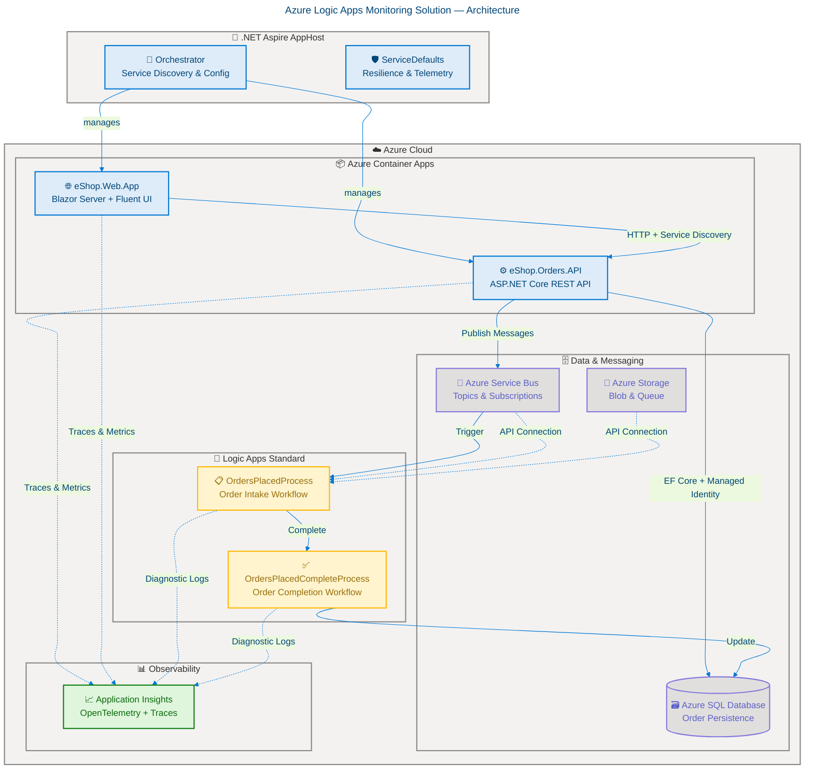

# Azure Logic Apps Monitoring Solution

[](https://opensource.org/licenses/MIT)
[](https://dotnet.microsoft.com/)
[](https://learn.microsoft.com/dotnet/aspire/)
[](https://azure.microsoft.com/)
[]()

An enterprise-grade order management and monitoring solution built with .NET Aspire, deployed to Azure Container Apps, and orchestrated with Azure Logic Apps Standard workflows. The solution demonstrates cloud-native architecture patterns including distributed tracing, event-driven messaging, and infrastructure-as-code deployment.

> 💡 **Why This Project?** This solution showcases a production-ready reference architecture for building observable, scalable microservices on Azure using .NET Aspire orchestration with Logic Apps workflow automation.

## 📖 Overview

**Overview**

This project provides a complete order management platform that combines a REST API backend, a Blazor Server frontend, and Azure Logic Apps workflows into a unified, observable system. It serves as a reference implementation for teams adopting .NET Aspire with Azure-native services.

The solution uses .NET Aspire as the orchestration layer to manage service discovery, health checks, resilience, and telemetry across all components. Azure Logic Apps Standard handles business workflow automation for order processing, while Azure Service Bus provides reliable asynchronous messaging between services.

> 📌 **Key Differentiator**: Unlike standalone samples, this solution integrates the full Azure observability stack — Application Insights, OpenTelemetry, and distributed tracing — across both application code and Logic Apps workflows, providing end-to-end visibility into order processing.

## 📑 Table of Contents

- [🏗️ Architecture](#-architecture)
- [✨ Features](#-features)
- [📋 Requirements](#-requirements)
- [⚡ Quick Start](#-quick-start)
- [⚙️ Configuration](#%EF%B8%8F-configuration)
- [🚀 Deployment](#-deployment)
- [💻 Usage](#-usage)
- [📂 Project Structure](#-project-structure)
- [🤝 Contributing](#-contributing)
- [📄 License](#-license)

## 🏗️ Architecture

**Overview**

The system follows a distributed microservices architecture orchestrated by .NET Aspire and deployed to Azure Container Apps. Components communicate via Azure Service Bus for asynchronous messaging and HTTP for synchronous requests, with Azure Logic Apps handling automated business workflows.


```mermaid
---
title: "Azure Logic Apps Monitoring Solution — Architecture"
config:
  theme: base
  look: classic
  layout: dagre
  flowchart:
    htmlLabels: true
    curve: cardinal
  themeVariables:
    primaryColor: '#DEECF9'
    primaryBorderColor: '#0078D4'
    primaryTextColor: '#004578'
    lineColor: '#0078D4'
---
flowchart TB
    accTitle: Azure Logic Apps Monitoring Solution Architecture
    accDescr: Shows the distributed architecture with Aspire orchestrator, frontend, API, Azure services, and Logic Apps workflows

    %% ═══════════════════════════════════════════════════════════════════════════
    %% AZURE / FLUENT ARCHITECTURE PATTERN v1.1
    %% (Semantic + Structural + Font + Accessibility Governance)
    %% ═══════════════════════════════════════════════════════════════════════════

    subgraph azure["☁️ Azure Cloud"]
        direction TB

        subgraph containerApps["📦 Azure Container Apps"]
            direction LR
            webApp["🌐 eShop.Web.App\nBlazor Server + Fluent UI"]:::core
            ordersApi["⚙️ eShop.Orders.API\nASP.NET Core REST API"]:::core
        end

        subgraph dataLayer["🗄️ Data & Messaging"]
            direction LR
            sqlDb[("🗃️ Azure SQL Database\nOrder Persistence")]:::data
            serviceBus["📨 Azure Service Bus\nTopics & Subscriptions"]:::data
            storage["📁 Azure Storage\nBlob & Queue"]:::data
        end

        subgraph workflows["🔄 Logic Apps Standard"]
            direction LR
            ordersPlaced["📋 OrdersPlacedProcess\nOrder Intake Workflow"]:::warning
            ordersComplete["✅ OrdersPlacedCompleteProcess\nOrder Completion Workflow"]:::warning
        end

        subgraph observability["📊 Observability"]
            direction LR
            appInsights["📈 Application Insights\nOpenTelemetry + Traces"]:::success
        end
    end

    subgraph aspire["🚀 .NET Aspire AppHost"]
        direction LR
        orchestrator["🎯 Orchestrator\nService Discovery & Config"]:::core
        serviceDefaults["🛡️ ServiceDefaults\nResilience & Telemetry"]:::core
    end

    orchestrator -->|"manages"| webApp
    orchestrator -->|"manages"| ordersApi
    webApp -->|"HTTP + Service Discovery"| ordersApi
    ordersApi -->|"EF Core + Managed Identity"| sqlDb
    ordersApi -->|"Publish Messages"| serviceBus
    serviceBus -->|"Trigger"| ordersPlaced
    ordersPlaced -->|"Complete"| ordersComplete
    ordersComplete -->|"Update"| sqlDb
    ordersApi -.->|"Traces & Metrics"| appInsights
    webApp -.->|"Traces & Metrics"| appInsights
    ordersPlaced -.->|"Diagnostic Logs"| appInsights
    ordersComplete -.->|"Diagnostic Logs"| appInsights
    serviceBus -.->|"API Connection"| ordersPlaced
    storage -.->|"API Connection"| ordersPlaced

    %% Centralized classDef palette (canonical AZURE/FLUENT v1.1)
    classDef core fill:#DEECF9,stroke:#0078D4,stroke-width:2px,color:#004578
    classDef data fill:#E1DFDD,stroke:#8378DE,stroke-width:2px,color:#5B5FC7
    classDef warning fill:#FFF4CE,stroke:#FFB900,stroke-width:2px,color:#986F0B
    classDef success fill:#DFF6DD,stroke:#107C10,stroke-width:2px,color:#0B6A0B

    %% Subgraph styling (6 subgraphs = 6 style directives, all neutral surface)
    style azure fill:#F3F2F1,stroke:#8A8886,stroke-width:2px,color:#323130
    style containerApps fill:#F3F2F1,stroke:#8A8886,stroke-width:2px,color:#323130
    style dataLayer fill:#F3F2F1,stroke:#8A8886,stroke-width:2px,color:#323130
    style workflows fill:#F3F2F1,stroke:#8A8886,stroke-width:2px,color:#323130
    style observability fill:#F3F2F1,stroke:#8A8886,stroke-width:2px,color:#323130
    style aspire fill:#F3F2F1,stroke:#8A8886,stroke-width:2px,color:#323130
```

**Component Roles:**

| Component                   | Role                                                          | Technology                    |
| --------------------------- | ------------------------------------------------------------- | ----------------------------- |
| 🎯 **Aspire AppHost**       | Orchestrates service discovery, configuration, and deployment | .NET Aspire 13.1              |
| 🌐 **eShop.Web.App**        | Order management UI with real-time updates                    | Blazor Server, Fluent UI      |
| ⚙️ **eShop.Orders.API**     | RESTful API for CRUD operations on orders                     | ASP.NET Core, EF Core         |
| 🛡️ **ServiceDefaults**      | Shared resilience, telemetry, and health check configuration  | OpenTelemetry, Azure Monitor  |
| 🗃️ **Azure SQL Database**   | Persistent storage for order and product data                 | SQL Server, Managed Identity  |
| 📨 **Azure Service Bus**    | Asynchronous event-driven messaging between services          | Topics & Subscriptions        |
| 📋 **Logic Apps Workflows** | Automated order processing and completion business logic      | Logic Apps Standard           |
| 📈 **Application Insights** | Distributed tracing, metrics, and diagnostics                 | OpenTelemetry + Azure Monitor |

## ✨ Features

**Overview**

The solution delivers a comprehensive set of capabilities for building and operating cloud-native order management systems on Azure. Each feature is designed for production readiness with observability built in from the start.

> 💡 **Why These Features Matter**: Together, these capabilities eliminate the need for custom infrastructure plumbing, allowing teams to focus on business logic while getting enterprise-grade resilience, security, and monitoring out of the box.

> 📌 **How They Work**: .NET Aspire orchestrates service discovery and configuration, while Azure-native services (Service Bus, Logic Apps, Application Insights) handle messaging, workflow automation, and observability through managed identity authentication.

| Feature                          | Description                                                                                                                     | Status    |
| -------------------------------- | ------------------------------------------------------------------------------------------------------------------------------- | --------- |
| 🚀 **.NET Aspire Orchestration** | Centralized service discovery, health checks, and configuration management across all components                                | ✅ Stable |
| 📨 **Event-Driven Messaging**    | Azure Service Bus topics and subscriptions for reliable async communication with local emulator support                         | ✅ Stable |
| 🔄 **Logic Apps Workflows**      | Automated order processing workflows (OrdersPlacedProcess, OrdersPlacedCompleteProcess) triggered by Service Bus events         | ✅ Stable |
| 📊 **Full-Stack Observability**  | OpenTelemetry distributed tracing, metrics, and logging with Azure Monitor and Application Insights integration                 | ✅ Stable |
| 🔒 **Managed Identity Auth**     | Zero-secret authentication using Azure Managed Identity for SQL, Service Bus, and Storage connections                           | ✅ Stable |
| 🛡️ **Built-In Resilience**       | HTTP retry policies with exponential backoff, circuit breaker patterns, and configurable timeouts (600s total, 60s per attempt) | ✅ Stable |
| 🏗️ **Infrastructure-as-Code**    | Complete Bicep templates with modular architecture covering networking, identity, monitoring, and workload resources            | ✅ Stable |

## 📋 Requirements

**Overview**

Before getting started, ensure your development environment meets the following prerequisites. The solution supports both local development with emulators and full Azure deployment with managed identity.

> ⚠️ **Important**: Docker is required for local development as .NET Aspire uses containers for Azure service emulation (SQL Server, Service Bus).

| Requirement                      | Minimum Version | Purpose                                           |
| -------------------------------- | --------------- | ------------------------------------------------- |
| 🛠️ **.NET SDK**                  | 10.0.100        | Runtime and build toolchain                       |
| 📦 **.NET Aspire Workload**      | 13.1.0          | Orchestration and service defaults                |
| ☁️ **Azure CLI**                 | 2.60.0          | Azure resource management                         |
| 🚀 **Azure Developer CLI (azd)** | 1.11.0          | Infrastructure provisioning and deployment        |
| 🐳 **Docker**                    | Latest          | Local development containers and emulators        |
| 🔑 **Azure Subscription**        | —               | Required for cloud deployment (not for local dev) |

## ⚡ Quick Start

**Overview**

Get the solution running locally in under 5 minutes using .NET Aspire's built-in emulators for Azure services.

### Local Development

1. **Clone the repository**

   ```bash
   git clone https://github.com/Evilazaro/Azure-LogicApps-Monitoring.git
   cd Azure-LogicApps-Monitoring
   ```

2. **Restore dependencies and build**

   ```bash
   dotnet restore
   dotnet build
   ```

3. **Run with .NET Aspire**

   ```bash
   dotnet run --project app.AppHost/app.AppHost.csproj
   ```

   The Aspire dashboard opens automatically. Access the services:

   ```text
   Aspire Dashboard:  https://localhost:15888
   Web App:           https://localhost:5001
   Orders API:        https://localhost:5002/swagger
   ```

> 💡 **Tip**: In local development mode, .NET Aspire automatically starts SQL Server and Service Bus emulator containers. No Azure subscription is needed for local development.

### Deploy to Azure

```bash
azd auth login
azd env new my-environment
azd up
```

Expected output:

```text
Provisioning Azure resources (azd provision)
 ✓ Creating resource group
 ✓ Deploying shared infrastructure (identity, monitoring, networking)
 ✓ Deploying workload resources (Container Apps, Logic Apps, Service Bus)
Deploying services (azd deploy)
 ✓ Deploying app (from app.AppHost)
SUCCESS: Your application was provisioned and deployed to Azure.
```

## ⚙️ Configuration

**Overview**

The solution uses a layered configuration approach with .NET Aspire managing service discovery and Azure resource connections. Local development uses emulators by default, while Azure deployment uses managed identity for all service-to-service authentication.

> 📌 **How Configuration Works**: The `AppHost.cs` orchestrator detects the runtime environment (local vs. Azure) and automatically selects between emulators and Azure resources. Configuration flows from `appsettings.json` and user secrets into the Aspire resource builder.

### Azure Resource Configuration

Configure Azure service connections in `appsettings.json` or user secrets:

```json
{
  "Azure": {
    "ResourceGroup": "rg-orders-dev",
    "TenantId": "<your-tenant-id>",
    "ClientId": "<your-client-id>",
    "ServiceBus": {
      "HostName": "sb-orders.servicebus.windows.net",
      "TopicName": "ordersplaced",
      "SubscriptionName": "orderprocessingsub"
    },
    "SqlServer": {
      "Name": "sql-orders",
      "DatabaseName": "OrderDb"
    },
    "ApplicationInsights": {
      "Name": "appi-orders"
    }
  }
}
```

### Environment-Specific Behavior

| Setting               | Local Development                     | Azure Deployment                           |
| --------------------- | ------------------------------------- | ------------------------------------------ |
| 🗃️ **SQL Database**   | SQL Server container with data volume | Azure SQL with Managed Identity + Entra ID |
| 📨 **Service Bus**    | Service Bus emulator (localhost)      | Azure Service Bus with Managed Identity    |
| 📈 **App Insights**   | Optional (console logging)            | Application Insights with OpenTelemetry    |
| 🔑 **Authentication** | Dev credentials from user secrets     | Managed Identity (automatic)               |

### Resilience Configuration

The `ServiceDefaults` library configures HTTP resilience policies applied to all outbound HTTP calls:

```csharp
// Configured in app.ServiceDefaults/Extensions.cs
// Total request timeout: 600 seconds
// Per-attempt timeout: 60 seconds
// Retry: 3 attempts with exponential backoff
// Circuit breaker: 120-second sampling duration
```

## 🚀 Deployment

**Overview**

The solution uses Azure Developer CLI (`azd`) for streamlined provisioning and deployment. Infrastructure is defined as Bicep templates organized into shared and workload modules.

### Infrastructure Layout

```text
infra/
├── main.bicep                  # Entry point orchestrator
├── main.parameters.json        # Environment parameters
├── types.bicep                 # Shared type definitions
├── shared/                     # Cross-cutting resources
│   ├── identity/               # Managed Identity
│   ├── monitoring/             # Log Analytics + App Insights
│   ├── network/                # Virtual Network
│   └── data/                   # Azure SQL Server
└── workload/                   # Application resources
    ├── messaging/              # Service Bus
    ├── services/               # Container Registry + Container Apps
    └── logic-app.bicep         # Logic Apps Standard
```

### Deployment Steps

1. **Authenticate with Azure**

   ```bash
   azd auth login
   ```

2. **Create a new environment**

   ```bash
   azd env new <environment-name>
   ```

3. **Provision infrastructure and deploy**

   ```bash
   azd up
   ```

> ⚠️ **Note**: The `preprovision` hook automatically builds the solution, runs tests, and validates your workstation before provisioning Azure resources. This prevents failed deployments due to build errors.

### Lifecycle Hooks

The deployment pipeline executes automated hooks at key stages:

| Hook                   | Stage                 | Actions                                           |
| ---------------------- | --------------------- | ------------------------------------------------- |
| 🔍 **preprovision**    | Before infrastructure | Build, test, workstation validation               |
| ⚙️ **postprovision**   | After infrastructure  | Configure secrets, generate test data             |
| 🚀 **predeploy**       | Before app deployment | Deploy Logic Apps workflows, validate connections |
| 🧹 **postinfradelete** | After teardown        | Clean up secrets and local state                  |

### CI/CD Pipeline

The project uses GitHub Actions for automated deployments. Configure the pipeline with:

```bash
azd pipeline config --provider github
```

## 💻 Usage

### Orders API

The Orders API provides RESTful endpoints for order management with OpenAPI documentation:

```bash
# List all orders
curl https://<orders-api-url>/api/orders

# Create a new order
curl -X POST https://<orders-api-url>/api/orders \
  -H "Content-Type: application/json" \
  -d '{
    "customerId": "CUST-001",
    "deliveryAddress": "123 Main St, Redmond, WA",
    "products": [
      {
        "productId": "PROD-001",
        "productDescription": "Widget A",
        "quantity": 2,
        "price": 29.99
      }
    ]
  }'
```

Expected output:

```json
{
  "id": 1,
  "customerId": "CUST-001",
  "date": "2026-03-03T00:00:00Z",
  "deliveryAddress": "123 Main St, Redmond, WA",
  "total": 59.98,
  "products": [
    {
      "id": 1,
      "productId": "PROD-001",
      "productDescription": "Widget A",
      "quantity": 2,
      "price": 29.99
    }
  ]
}
```

### Web Application

The Blazor Server frontend provides an interactive UI for:

- 📋 Viewing all orders with real-time data
- 🛒 Placing individual orders
- 📦 Submitting batch orders
- 🔍 Viewing order details

Access the web application at the URL provided by the Aspire dashboard after running the solution.

### Logic Apps Workflows

Two Logic Apps Standard workflows automate order processing:

| Workflow                           | Trigger                   | Purpose                                       |
| ---------------------------------- | ------------------------- | --------------------------------------------- |
| 📋 **OrdersPlacedProcess**         | Service Bus topic message | Processes newly placed orders                 |
| ✅ **OrdersPlacedCompleteProcess** | Workflow completion       | Finalizes order processing and updates status |

### Health Checks

The solution exposes Kubernetes-compatible health endpoints:

```bash
# Readiness check (includes database and Service Bus)
curl https://<service-url>/health

# Liveness check
curl https://<service-url>/alive
```

## 📂 Project Structure

```text
📦 Azure-LogicApps-Monitoring/
├── 🎯 app.AppHost/                    # .NET Aspire orchestrator
│   ├── 📄 AppHost.cs                  # Service configuration and Azure resource wiring
│   └── 📄 app.AppHost.csproj          # Aspire SDK and hosting packages
├── 🛡️ app.ServiceDefaults/            # Shared cross-cutting concerns
│   ├── 📄 Extensions.cs               # OpenTelemetry, resilience, health checks, Service Bus
│   └── 📄 CommonTypes.cs              # Shared domain models (Order, OrderProduct)
├── 💻 src/
│   ├── ⚙️ eShop.Orders.API/           # REST API service
│   │   ├── 🎮 Controllers/            # OrdersController, WeatherForecastController
│   │   ├── 🔧 Services/               # OrderService business logic
│   │   ├── 🗃️ Repositories/           # OrderRepository (EF Core)
│   │   ├── 📨 Handlers/               # Service Bus message handlers
│   │   ├── 💚 HealthChecks/           # Database and Service Bus health checks
│   │   ├── 🗄️ data/                   # DbContext, entities, mappers
│   │   └── 🔄 Migrations/             # EF Core database migrations
│   ├── 🌐 eShop.Web.App/              # Blazor Server frontend
│   │   ├── 📄 Components/Pages/       # Home, PlaceOrder, ListAllOrders, ViewOrder
│   │   ├── 🎨 Components/Layout/      # MainLayout, NavMenu (Fluent UI)
│   │   └── 🔌 Components/Services/    # OrdersAPIService (typed HTTP client)
│   └── 🧪 tests/                      # Test projects
│       ├── 🧪 app.AppHost.Tests/
│       ├── 🧪 app.ServiceDefaults.Tests/
│       ├── 🧪 eShop.Orders.API.Tests/
│       └── 🧪 eShop.Web.App.Tests/
├── 🔄 workflows/OrdersManagement/     # Logic Apps workflow definitions
│   └── 📋 OrdersManagementLogicApp/
│       ├── 📋 OrdersPlacedProcess/    # Order intake workflow
│       └── ✅ OrdersPlacedCompleteProcess/  # Order completion workflow
├── 🏗️ infra/                          # Bicep infrastructure-as-code
│   ├── 📄 main.bicep                  # Deployment orchestrator
│   ├── 🔗 shared/                     # Identity, monitoring, networking, data
│   └── 📦 workload/                   # Container Apps, Service Bus, Logic Apps
├── 🪝 hooks/                          # azd lifecycle scripts (PS1 + SH)
└── ☁️ azure.yaml                      # Azure Developer CLI configuration
```

## 🤝 Contributing

**Overview**

Contributions are welcome and help improve this reference architecture for the community. Whether you are fixing a bug, improving documentation, or adding a new feature, your input is valued.

> 💡 **Tip**: The project uses .NET 10.0 and .NET Aspire 13.1. Ensure your development environment meets the [Requirements](#requirements) before contributing.

### How to Contribute

1. **Fork** the repository
2. **Create** a feature branch

   ```bash
   git checkout -b feature/your-feature-name
   ```

3. **Make** your changes and ensure all tests pass

   ```bash
   dotnet test
   ```

4. **Commit** with a descriptive message

   ```bash
   git commit -m "feat: add your feature description"
   ```

5. **Push** to your fork and open a **Pull Request**

### Development Guidelines

- Follow existing code conventions and project structure
- Add tests for new functionality in the corresponding `tests/` project
- Update documentation for any configuration or API changes
- Ensure `dotnet build` completes without warnings

## 📄 License

This project is licensed under the **MIT License**. See the [LICENSE](LICENSE) file for details.

Copyright © 2025 Evilázaro Alves.
