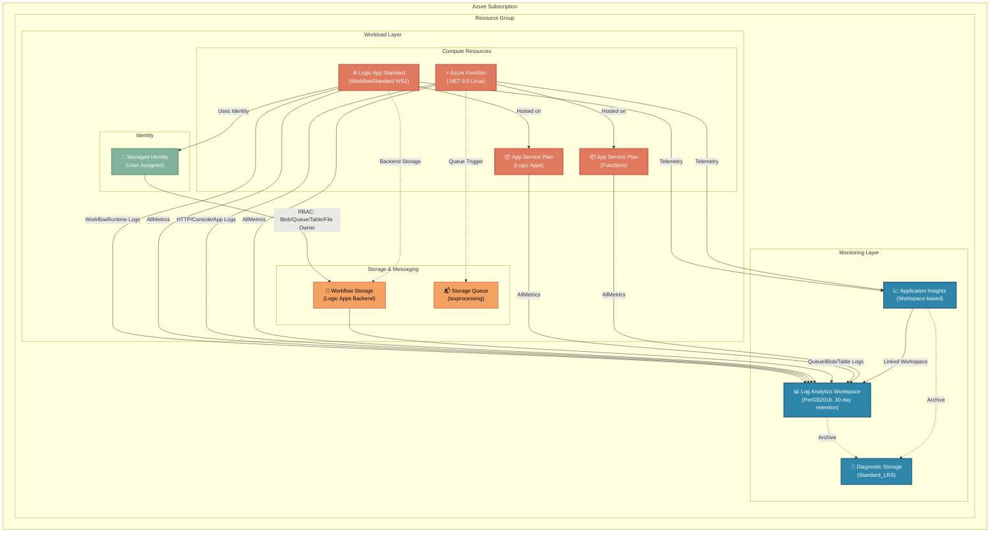
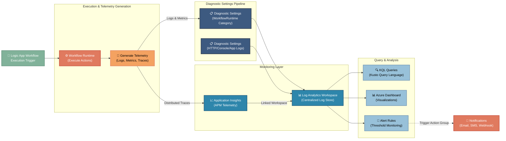

# Azure Logic Apps Monitoring Solution

[](LICENSE.md)
[](https://azure.microsoft.com)
[](https://learn.microsoft.com/azure/azure-resource-manager/bicep/)

A comprehensive Infrastructure-as-Code (IaC) monitoring solution for Azure Logic Apps Standard using Bicep templates. This project demonstrates Azure Monitor best practices for enterprise workflow orchestration, providing centralized observability through Log Analytics, Application Insights, and diagnostic settings.

---

## 📋 Table of Contents

- [Project Overview](#-project-overview)
- [Architecture](#-architecture)
- [Prerequisites](#-prerequisites)
- [Deployment](#-deployment)
- [Usage](#-usage)
- [Project Structure](#-project-structure)
- [Monitoring Best Practices](#-monitoring-best-practices)
- [Contributing](#-contributing)
- [License](#-license)
- [Additional Resources](#-additional-resources)

---

## 🎯 Project Overview

### Purpose

Azure Logic Apps Standard provides powerful workflow orchestration capabilities, but implementing comprehensive monitoring requires careful configuration of multiple Azure Monitor components. This solution eliminates manual setup by providing production-ready Infrastructure-as-Code templates that deploy a complete observability stack.

**Problems Solved:**
- ✓ **Fragmented Telemetry**: Aggregates logs, metrics, and traces from Logic Apps, Functions, and Storage into centralized Log Analytics workspace
- ✓ **Manual Configuration**: Automates diagnostic settings, Application Insights integration, and health model setup
- ✓ **Security Gaps**: Implements Managed Identity authentication, eliminating credential management
- ✓ **Inconsistent Deployments**: Provides repeatable, version-controlled infrastructure deployments

### Key Features

Based on the Bicep template analysis, this solution provides:

- **Centralized Log Analytics Workspace** with 30-day retention and PerGB2018 pricing tier
- **Application Insights Integration** with workspace-based configuration for unified querying
- **Automated Diagnostic Settings** for all workload resources (Logic Apps, Functions, Storage, App Service Plans)
- **Managed Identity Authentication** for secure, credential-free service-to-service communication
- **Comprehensive Telemetry Collection**:
  - Logic App workflow runtime logs and execution history
  - Azure Function HTTP, console, and application logs
  - Storage Account queue, blob, and table metrics
  - App Service Plan resource utilization metrics
- **Modular Bicep Architecture** with reusable templates for monitoring and workload layers
- **Azure Developer CLI (azd) Support** for streamlined deployment workflows

### Target Audience

- **Beginners**: Clear deployment instructions to get started with Logic Apps monitoring in <30 minutes
- **Experienced Architects**: Detailed architecture diagrams and modular Bicep templates for evaluation and customization
- **DevOps Engineers**: Infrastructure-as-Code patterns for CI/CD integration and multi-environment deployments
- **Platform Engineers**: Reusable monitoring patterns for standardizing observability across Logic Apps workloads

### Benefits

**Beyond Default Azure Monitoring:**

- **Unified Observability**: Out-of-the-box Application Insights only monitors individual resources. This solution aggregates telemetry from Logic Apps, Functions, Storage, and messaging into a single Log Analytics workspace with correlated queries.

- **Logic Apps-Specific Diagnostics**: Automatically enables `WorkflowRuntime` category logs that capture execution history, trigger events, action outcomes, and error details—not enabled by default.

- **Cost Optimization**: Configures appropriate retention policies (30 days with immediate purge), log sampling strategies, and PerGB2018 pricing tier versus default Per-Node pricing.

- **Security by Default**: Uses Managed Identity for all service connections, eliminating the need to store connection strings or access keys in application settings.

- **Infrastructure-as-Code Repeatability**: Deploy identical monitoring stacks across dev/test/prod environments with parameterized Bicep templates, ensuring consistency and reducing configuration drift.

- **Well-Architected Framework Alignment**: Implements Azure Well-Architected Framework principles for reliability (health probes), security (Managed Identity), operational excellence (IaC), and cost optimization (retention policies).

---

## 🏗️ Architecture

### Understanding the Separation of Concerns

This solution uses a **layered architecture** to separate monitoring infrastructure from workload resources, providing:

- **Independent Lifecycle Management**: Update monitoring configurations without redeploying workloads
- **Reusable Monitoring Patterns**: Apply the `src/monitoring/` layer to any Logic Apps or Azure Functions workload
- **Clear Dependency Chain**: Monitoring resources deploy first, ensuring Log Analytics workspace and Application Insights exist before workloads attempt to configure diagnostic settings
- **Modular Bicep Structure**: Each layer contains focused, single-responsibility modules (e.g., `log-analytics-workspace.bicep`, `app-insights.bicep`) for easier testing and maintenance

**Deployment Sequence:**
1. **Monitoring Layer** (`src/monitoring/main.bicep`) → Creates Log Analytics, Application Insights, diagnostic storage
2. **Workload Layer** (`src/workload/main.bicep`) → Deploys Logic Apps, Functions, Storage Queues with diagnostic settings pointing to monitoring layer outputs

### Architecture Diagram


```mermaid
graph TB
    subgraph "Azure Subscription"
        subgraph "Resource Group"
            subgraph "Monitoring Layer"
                LAW["📊 Log Analytics Workspace<br/>(PerGB2018, 30-day retention)"]
                AI["📈 Application Insights<br/>(Workspace-based)"]
                DIAG_STORAGE["💾 Diagnostic Storage<br/>(Standard_LRS)"]
            end
            
            subgraph "Workload Layer"
                subgraph "Compute Resources"
                    LA["⚙️ Logic App Standard<br/>(WorkflowStandard WS1)"]
                    FUNC["⚡ Azure Function<br/>(.NET 9.0 Linux)"]
                    ASP_LA["📦 App Service Plan<br/>(Logic Apps)"]
                    ASP_FUNC["📦 App Service Plan<br/>(Functions)"]
                end
                
                subgraph "Storage & Messaging"
                    WF_STORAGE["💾 Workflow Storage<br/>(Logic Apps Backend)"]
                    QUEUE["📬 Storage Queue<br/>(taxprocessing)"]
                end
                
                subgraph "Identity"
                    MI["🔐 Managed Identity<br/>(User-Assigned)"]
                end
            end
        end
    end
    
    %% Diagnostic Settings Flow (Red)
    LA -->|"WorkflowRuntime Logs"| LAW
    LA -->|"AllMetrics"| LAW
    FUNC -->|"HTTP/Console/App Logs"| LAW
    FUNC -->|"AllMetrics"| LAW
    WF_STORAGE -->|"Queue/Blob/Table Logs"| LAW
    ASP_LA -->|"AllMetrics"| LAW
    ASP_FUNC -->|"AllMetrics"| LAW
    
    %% Storage for Long-term Retention (Orange)
    LAW -.->|"Archive"| DIAG_STORAGE
    AI -.->|"Archive"| DIAG_STORAGE
    
    %% Application Insights Telemetry (Green)
    LA -->|"Telemetry"| AI
    FUNC -->|"Telemetry"| AI
    AI -->|"Linked Workspace"| LAW
    
    %% Managed Identity Access (Blue)
    MI -->|"RBAC: Blob/Queue/Table/File Owner"| WF_STORAGE
    LA -->|"Uses Identity"| MI
    
    %% Workload Dependencies (Gray)
    LA -.->|"Backend Storage"| WF_STORAGE
    FUNC -.->|"Queue Trigger"| QUEUE
    LA -->|"Hosted on"| ASP_LA
    FUNC -->|"Hosted on"| ASP_FUNC
    
    style LAW fill:#2E86AB,stroke:#1A5276,stroke-width:2px,color:#fff
    style AI fill:#2E86AB,stroke:#1A5276,stroke-width:2px,color:#fff
    style DIAG_STORAGE fill:#2E86AB,stroke:#1A5276,stroke-width:2px,color:#fff
    style LA fill:#E07A5F,stroke:#C44536,stroke-width:2px,color:#fff
    style FUNC fill:#E07A5F,stroke:#C44536,stroke-width:2px,color:#fff
    style WF_STORAGE fill:#F4A261,stroke:#E07A5F,stroke-width:2px,color:#000
    style QUEUE fill:#F4A261,stroke:#E07A5F,stroke-width:2px,color:#000
    style MI fill:#81B29A,stroke:#5A8A74,stroke-width:2px,color:#fff
    style ASP_LA fill:#E07A5F,stroke:#C44536,stroke-width:2px,color:#fff
    style ASP_FUNC fill:#E07A5F,stroke:#C44536,stroke-width:2px,color:#fff
```

### Data Flow Diagram


```mermaid
flowchart LR
    START["🚀 Logic App Workflow<br/>Execution Trigger"]
    
    subgraph "Execution & Telemetry Generation"
        RUNTIME["⚙️ Workflow Runtime<br/>(Execute Actions)"]
        TELEMETRY["📡 Generate Telemetry<br/>(Logs, Metrics, Traces)"]
    end
    
    subgraph "Diagnostic Settings Pipeline"
        DS_LA["📋 Diagnostic Settings<br/>(WorkflowRuntime Category)"]
        DS_FUNC["📋 Diagnostic Settings<br/>(HTTP/Console/App Logs)"]
    end
    
    subgraph "Monitoring Layer"
        LAW["📊 Log Analytics Workspace<br/>(Centralized Log Store)"]
        AI["📈 Application Insights<br/>(APM Telemetry)"]
    end
    
    subgraph "Query & Analysis"
        KQL["🔍 KQL Queries<br/>(Kusto Query Language)"]
        DASHBOARD["📊 Azure Dashboard<br/>(Visualizations)"]
        ALERTS["🔔 Alert Rules<br/>(Threshold Monitoring)"]
    end
    
    START --> RUNTIME
    RUNTIME --> TELEMETRY
    
    TELEMETRY -->|"Logs & Metrics"| DS_LA
    TELEMETRY -->|"Distributed Traces"| AI
    
    DS_LA --> LAW
    DS_FUNC --> LAW
    AI -->|"Linked Workspace"| LAW
    
    LAW --> KQL
    LAW --> DASHBOARD
    LAW --> ALERTS
    
    ALERTS -.->|"Trigger Action Group"| NOTIFY["📧 Notifications<br/>(Email, SMS, Webhook)"]
    
    style START fill:#81B29A,stroke:#5A8A74,stroke-width:2px,color:#fff
    style RUNTIME fill:#E07A5F,stroke:#C44536,stroke-width:2px,color:#fff
    style TELEMETRY fill:#F4A261,stroke:#E07A5F,stroke-width:2px,color:#000
    style DS_LA fill:#3D5A80,stroke:#293241,stroke-width:2px,color:#fff
    style DS_FUNC fill:#3D5A80,stroke:#293241,stroke-width:2px,color:#fff
    style LAW fill:#2E86AB,stroke:#1A5276,stroke-width:2px,color:#fff
    style AI fill:#2E86AB,stroke:#1A5276,stroke-width:2px,color:#fff
    style KQL fill:#98C1D9,stroke:#6A8EAE,stroke-width:2px,color:#000
    style DASHBOARD fill:#98C1D9,stroke:#6A8EAE,stroke-width:2px,color:#000
    style ALERTS fill:#98C1D9,stroke:#6A8EAE,stroke-width:2px,color:#000
    style NOTIFY fill:#E07A5F,stroke:#C44536,stroke-width:2px,color:#fff
```

### Post-Diagram Explanation: Data Flow Walkthrough

**Step 1: Workflow Execution**  
A Logic App workflow is triggered (manually, on schedule, or via HTTP request). The workflow runtime begins executing actions sequentially or in parallel based on the workflow definition.

**Step 2: Telemetry Generation**  
As the workflow executes, the Logic Apps runtime generates:
- **Logs**: Workflow run status (Started, Succeeded, Failed), action outcomes, trigger events
- **Metrics**: Execution duration, throughput (runs per minute), billable action executions
- **Traces**: Distributed tracing context for correlation with Azure Functions or external APIs

**Step 3: Diagnostic Settings Pipeline**  
Each resource (Logic App, Function App, Storage Account) has **diagnostic settings** automatically configured by the Bicep templates. These settings define:
- **What logs to collect**: `WorkflowRuntime` for Logic Apps, `AppServiceHTTPLogs` for Functions
- **Where to send logs**: Log Analytics workspace ID (passed as a parameter from monitoring layer)
- **Metric categories**: `AllMetrics` enabled for all resources

**Step 4: Centralized Aggregation in Log Analytics**  
Logs and metrics from all resources flow into the **Log Analytics workspace**, where they're stored in structured tables:
- `AzureDiagnostics`: Logic Apps WorkflowRuntime logs, Function App logs
- `AppTraces`, `AppRequests`, `AppDependencies`: Application Insights telemetry
- `AzureMetrics`: Performance counters (CPU, memory, execution counts)

**Step 5: Application Insights APM Telemetry**  
Simultaneously, the **Application Insights SDK** (configured via `APPLICATIONINSIGHTS_CONNECTION_STRING` app setting) sends:
- **Requests**: HTTP requests to Logic Apps and Functions with response times
- **Dependencies**: Outbound calls to Storage, Service Bus, external APIs
- **Exceptions**: Unhandled errors with stack traces
- **Custom Events**: Developer-defined telemetry

Application Insights is **linked to the Log Analytics workspace**, meaning its telemetry is also queryable via KQL in the workspace.

**Step 6: Query, Analysis, and Alerting**  
Operators and developers can now:
- **Run KQL queries** in the Log Analytics workspace to troubleshoot failures, analyze performance trends, or audit workflow executions
- **Build Azure Dashboards** with visualizations (charts, tables) pinned from KQL queries
- **Configure Alert Rules** that monitor conditions (e.g., "Failed workflow runs > 5 in 10 minutes") and trigger **Action Groups** to send notifications via email, SMS, webhooks, or ITSM integrations

---

## ✅ Prerequisites

### Azure Requirements

- **Azure Subscription** with at least **Contributor** role access (required for creating resources and assigning RBAC roles)
- **Resource Providers Registered**:
  - `Microsoft.Logic` (Azure Logic Apps)
  - `Microsoft.Insights` (Azure Monitor, Application Insights)
  - `Microsoft.OperationalInsights` (Log Analytics)
  - `Microsoft.Web` (App Service Plans, Function Apps)
  - `Microsoft.Storage` (Storage Accounts)

  <details>
  <summary>How to verify and register resource providers</summary>

  ```bash
  # Check registration status
  az provider show --namespace Microsoft.Logic --query "registrationState"
  
  # Register providers if needed
  az provider register --namespace Microsoft.Logic
  az provider register --namespace Microsoft.Insights
  az provider register --namespace Microsoft.OperationalInsights
  az provider register --namespace Microsoft.Web
  az provider register --namespace Microsoft.Storage
  
  # Wait for registration to complete (typically 1-2 minutes)
  az provider show --namespace Microsoft.Logic --query "registrationState"
  ```
  </details>

### Local Tools

Specify exact versions to ensure compatibility:

- **Azure CLI**: Version 2.50 or higher
  - [Installation instructions](https://learn.microsoft.com/cli/azure/install-azure-cli)
  - Verify: `az --version`
  
- **Bicep CLI**: Version 0.20 or higher
  - Installed automatically with Azure CLI 2.20+
  - Verify: `az bicep version`
  - Upgrade: `az bicep upgrade`

- **Azure Developer CLI (azd)**: Latest version (recommended but optional)
  - [Installation instructions](https://learn.microsoft.com/azure/developer/azure-developer-cli/install-azd)
  - Verify: `azd version`

- **PowerShell**: Version 7.0 or higher (for Windows users) OR **Bash** (for Linux/macOS users)
  - Verify PowerShell: `$PSVersionTable.PSVersion`

### Knowledge Prerequisites

- ✓ **Required**: Basic understanding of Azure Logic Apps Standard (workflow concepts, triggers, actions)
- ✓ **Required**: Familiarity with Azure Resource Manager deployments (resource groups, ARM/Bicep templates)
- ○ **Optional**: Experience with Bicep or ARM template syntax (helpful for customization but not required for deployment)
- ○ **Optional**: Kusto Query Language (KQL) for writing custom Log Analytics queries
- ○ **Optional**: Understanding of Azure Well-Architected Framework principles

### Configuration Files Requiring Customization

Before deployment, you'll need to customize:

1. **`infra/main.parameters.json`**: Set your Azure region and environment name
   - `location`: Azure region (e.g., `eastus`, `westeurope`)
   - `envName`: Environment identifier (`dev`, `uat`, or `prod`)

2. **`azure.yaml`** (Azure Developer CLI users only): Already configured, but you can modify the project name if desired

---

## 🚀 Deployment

Choose your preferred deployment method:

- **Option A**: Azure Developer CLI (azd) — Fastest, recommended for new users
- **Option B**: Manual Bicep deployment — Full control, recommended for CI/CD pipelines

---

### Option A: Using Azure Developer CLI (Recommended)

The Azure Developer CLI (azd) automates the entire deployment process, including resource provisioning and configuration.

#### Step 1: Clone the Repository

```bash
# Clone the repository
git clone https://github.com/Evilazaro/Azure-LogicApps-Monitoring.git
cd Azure-LogicApps-Monitoring
```

#### Step 2: Authenticate to Azure

```bash
# Login to Azure (opens browser for authentication)
azd auth login
```

#### Step 3: Provision and Deploy

```bash
# Initialize environment (prompted for region and environment name)
azd env new

# Deploy all infrastructure (monitoring + workload layers)
azd up
```

**What this does:**
- ✓ Creates an Azure resource group with naming convention: `contoso-<solutionName>-<envName>-<location>-rg`
- ✓ Deploys monitoring infrastructure first (Log Analytics, Application Insights, diagnostic storage)
- ✓ Deploys workload resources (Logic Apps, Functions, Storage Queues) with automatic diagnostic settings
- ✓ Configures Managed Identity RBAC role assignments for secure storage access
- ✓ Outputs connection strings, resource IDs, and workspace names for reference

**Expected Duration**: 5-8 minutes

#### Step 4: Verify Deployment

After `azd up` completes, verify resources were created:

```bash
# List all deployed resources
azd env get-values

# Or use Azure CLI
az resource list --resource-group <resource-group-name> --output table
```

**Expected Output** (example):
```
Name                                    Type
--------------------------------------  -----------------------------------
tax-docs-abc123-law                     Microsoft.OperationalInsights/workspaces
tax-docs-abc123-appinsights             Microsoft.Insights/components
tax-docslogsabc123                      Microsoft.Storage/storageAccounts
tax-docs-abc123-logicapp                Microsoft.Web/sites
tax-docs-abc123-api                     Microsoft.Web/sites
taxdocsabc123                           Microsoft.Storage/storageAccounts
```

---

### Option B: Manual Bicep Deployment

For CI/CD pipelines or users preferring explicit control over each deployment step.

#### Step 1: Configure Parameters

Edit `infra/main.parameters.json` to set your environment-specific values:

```json
{
  "$schema": "https://schema.management.azure.com/schemas/2015-01-01/deploymentParameters.json#",
  "contentVersion": "1.0.0.0",
  "parameters": {
    "location": {
      "value": "eastus"  // Your preferred Azure region
    },
    "envName": {
      "value": "dev"  // Environment: dev, uat, or prod
    }
  }
}
```

**Parameter Reference:**

| Parameter | Required | Description | Allowed Values | Default |
|-----------|----------|-------------|----------------|---------|
| `location` | ✓ | Azure region for all resources | Any valid Azure region | N/A |
| `envName` | ✓ | Environment name for resource naming | `dev`, `uat`, `prod` | N/A |
| `solutionName` | ○ | Base name prefix for resources | 3-20 alphanumeric characters | `tax-docs` |

#### Step 2: Login to Azure

```bash
# Login to Azure
az login

# Set your subscription (if you have multiple)
az account set --subscription "<subscription-id-or-name>"

# Verify current subscription
az account show --query "{Name:name, ID:id, TenantID:tenantId}" --output table
```

#### Step 3: Deploy Infrastructure at Subscription Scope

This solution uses **subscription-level deployment** because it creates the resource group as part of the template.

```bash
# Deploy main.bicep at subscription scope
az deployment sub create \
  --name LogicAppsMonitoring-$(date +%Y%m%d-%H%M%S) \
  --location eastus \
  --template-file infra/main.bicep \
  --parameters infra/main.parameters.json
```

**Why subscription scope?** The `infra/main.bicep` template uses `targetScope = 'subscription'` to create the resource group dynamically with proper naming conventions and tags.

**What this deploys:**
1. **Resource Group**: `contoso-tax-docs-dev-eastus-rg`
2. **Monitoring Module**: Log Analytics workspace, Application Insights, diagnostic storage
3. **Workload Module**: Logic Apps, Azure Functions, Storage Accounts, App Service Plans

**Expected Duration**: 6-10 minutes

#### Step 4: Verify Deployment

```bash
# Check deployment status
az deployment sub show \
  --name LogicAppsMonitoring-<timestamp> \
  --query "{Status:properties.provisioningState, Duration:properties.duration}" \
  --output table

# List deployed resources
az resource list \
  --resource-group contoso-tax-docs-dev-eastus-rg \
  --output table

# Check Logic App status
az logicapp show \
  --name <logic-app-name> \
  --resource-group contoso-tax-docs-dev-eastus-rg \
  --query "{Name:name, State:state, DefaultHostName:defaultHostName}" \
  --output table

# Verify Application Insights connection
az monitor app-insights component show \
  --app <app-insights-name> \
  --resource-group contoso-tax-docs-dev-eastus-rg \
  --query "{Name:name, InstrumentationKey:instrumentationKey, Location:location}" \
  --output table
```

**Expected Output**: All resources should show `provisioningState: Succeeded`

#### Step 5: Retrieve Output Values

The deployment outputs sensitive values (connection strings, instrumentation keys) that you may need:

```bash
# Get all deployment outputs
az deployment sub show \
  --name LogicAppsMonitoring-<timestamp> \
  --query "properties.outputs" \
  --output json

# Get specific output (e.g., Log Analytics Workspace Name)
az deployment sub show \
  --name LogicAppsMonitoring-<timestamp> \
  --query "properties.outputs.AZURE_LOG_ANALYTICS_WORKSPACE_NAME.value" \
  --output tsv
```

---

### Troubleshooting Common Deployment Issues

<details>
<summary><strong>Issue: "Resource provider not registered"</strong></summary>

**Symptom**: Deployment fails with error message: `The subscription is not registered to use namespace 'Microsoft.Logic'`

**Solution**:
```bash
# Register required resource providers
az provider register --namespace Microsoft.Logic
az provider register --namespace Microsoft.Insights
az provider register --namespace Microsoft.OperationalInsights
az provider register --namespace Microsoft.Web
az provider register --namespace Microsoft.Storage

# Wait for registration to complete (typically 1-2 minutes)
az provider show --namespace Microsoft.Logic --query "registrationState"
```

**Expected Output**: `"Registered"`
</details>

<details>
<summary><strong>Issue: "Insufficient permissions"</strong></summary>

**Symptom**: Deployment fails with `AuthorizationFailed` or `Forbidden` errors

**Solution**:
1. Verify you have **Contributor** role on the subscription:
   ```bash
   az role assignment list \
     --assignee <your-email> \
     --include-inherited \
     --query "[?roleDefinitionName=='Contributor' || roleDefinitionName=='Owner'].{Role:roleDefinitionName, Scope:scope}" \
     --output table
   ```

2. If you only have Contributor at resource group level, ask subscription owner to:
   - Grant Contributor at subscription level (for resource group creation), OR
   - Pre-create the resource group and use resource group-scoped deployment:
     ```bash
     # Owner pre-creates resource group
     az group create --name contoso-tax-docs-dev-eastus-rg --location eastus
     
     # You deploy at resource group scope
     az deployment group create \
       --resource-group contoso-tax-docs-dev-eastus-rg \
       --template-file src/monitoring/main.bicep \
       --parameters name=tax-docs envName=dev location=eastus
     ```
</details>

<details>
<summary><strong>Issue: "Deployment timeout"</strong></summary>

**Symptom**: Deployment exceeds Azure CLI timeout limits (typically 20 minutes) or appears to hang

**Solution**:
```bash
# Option 1: Use no-wait flag for long deployments
az deployment sub create \
  --name LogicAppsMonitoring-$(date +%Y%m%d-%H%M%S) \
  --location eastus \
  --template-file infra/main.bicep \
  --parameters infra/main.parameters.json \
  --no-wait

# Check status periodically
az deployment sub show \
  --name LogicAppsMonitoring-<timestamp> \
  --query "properties.provisioningState"

# Option 2: Deploy monitoring and workload separately
# First, deploy monitoring layer
az deployment group create \
  --resource-group contoso-tax-docs-dev-eastus-rg \
  --template-file src/monitoring/main.bicep \
  --parameters name=tax-docs envName=dev location=eastus

# Then, deploy workload layer with outputs from monitoring
az deployment group create \
  --resource-group contoso-tax-docs-dev-eastus-rg \
  --template-file src/workload/main.bicep \
  --parameters workspaceId=<log-analytics-workspace-id> ...
```
</details>

<details>
<summary><strong>Issue: "Location not available for resource type"</strong></summary>

**Symptom**: Deployment fails with error: `The requested resource type is not available in location 'xxx'`

**Solution**:
1. Check which regions support Logic Apps Standard and Log Analytics:
   ```bash
   # Check Logic Apps availability
   az provider show --namespace Microsoft.Logic \
     --query "resourceTypes[?resourceType=='workflows'].locations" \
     --output table
   
   # Check Log Analytics availability
   az provider show --namespace Microsoft.OperationalInsights \
     --query "resourceTypes[?resourceType=='workspaces'].locations" \
     --output table
   ```

2. Update `location` parameter in `infra/main.parameters.json` to a supported region (e.g., `eastus`, `westus2`, `northeurope`, `westeurope`)

**Note**: All resources in this solution deploy to the same region specified in the `location` parameter.
</details>

<details>
<summary><strong>Issue: "Managed Identity role assignment fails"</strong></summary>

**Symptom**: Deployment succeeds but Logic App cannot access storage, with error: `The account being accessed does not support http`

**Solution**:
Managed Identity role assignments can take 1-2 minutes to propagate. Wait and retry:

```bash
# Check if role assignments exist
az role assignment list \
  --assignee <managed-identity-principal-id> \
  --scope <storage-account-resource-id> \
  --query "[].{Role:roleDefinitionName, Scope:scope}" \
  --output table

# If missing, manually assign required roles
az role assignment create \
  --assignee <managed-identity-principal-id> \
  --role "Storage Blob Data Owner" \
  --scope <storage-account-resource-id>

# Repeat for other roles: Queue Data Contributor, Table Data Contributor, File Data Contributor
```

**Prevention**: The Bicep templates include `dependsOn` clauses to ensure role assignments complete before Logic App deployment, but Azure propagation delays can still occur.
</details>

<details>
<summary><strong>Issue: "Unique resource name conflict"</strong></summary>

**Symptom**: Deployment fails with error: `StorageAccountAlreadyExists` or `NameNotAvailable`

**Solution**:
Resource names are auto-generated using `uniqueString()` function based on resource group ID, but conflicts can occur if you've deployed and deleted the solution before.

1. Check for existing resources with similar names:
   ```bash
   az storage account list \
     --query "[?contains(name, 'taxdocs')].{Name:name, ResourceGroup:resourceGroup, Location:location}" \
     --output table
   ```

2. Either:
   - **Delete conflicting resources** from previous deployments
   - **Change the `solutionName` parameter** in `infra/main.bicep` (line 10) to generate different unique names
   
   ```bicep
   param solutionName string = 'tax-docs'  // Change to 'taxprocessing' or similar
   ```
</details>

---

## 💡 Usage

This section provides practical examples demonstrating common Logic Apps monitoring scenarios using the deployed Log Analytics workspace and Application Insights.

### Accessing Log Analytics

1. Navigate to the **Azure Portal** → Search for "Log Analytics workspaces"
2. Select your workspace (e.g., `tax-docs-abc123-law`)
3. Click **Logs** in the left menu
4. Paste any KQL query below and click **Run**

---

### Example 1: Query Failed Logic App Workflow Runs

**Scenario**: Troubleshoot why workflows are failing and identify error patterns

**Query** (Run in Log Analytics workspace):
```kql
// Failed Logic App workflow runs in the last 24 hours
AzureDiagnostics
| where ResourceProvider == "MICROSOFT.LOGIC"
| where Category == "WorkflowRuntime"
| where status_s == "Failed"
| project 
    TimeGenerated,
    WorkflowName = resource_workflowName_s,
    RunId = resource_runId_s,
    Status = status_s,
    Error = error_message_s,
    Code = error_code_s
| order by TimeGenerated desc
| take 50
```

**Expected Output**: Table showing recent failed runs with timestamps, workflow names, run IDs, and error details

<details>
<summary>View example output</summary>

| TimeGenerated | WorkflowName | RunId | Status | Error | Code |
|---------------|--------------|-------|--------|-------|------|
| 2025-12-04 10:23:45 | tax-processing | 08584766ABC | Failed | Connection timeout to external API | ServiceUnavailable |
| 2025-12-04 09:15:22 | tax-processing | 08584766DEF | Failed | Invalid JSON schema in request body | BadRequest |

</details>

**How to use results**: Click on a `RunId` to drill into detailed execution history in the Logic Apps designer.

---

### Example 2: Monitor Logic App Performance and Execution Duration

**Scenario**: Identify slow-running workflows that may impact SLAs

**Query**:
```kql
// Average and P95 workflow execution duration by workflow name
AzureDiagnostics
| where ResourceProvider == "MICROSOFT.LOGIC"
| where Category == "WorkflowRuntime"
| where status_s == "Succeeded"
| extend DurationMs = todouble(resource_runDuration_d)
| summarize 
    Count = count(),
    AvgDurationSec = avg(DurationMs) / 1000,
    P95DurationSec = percentile(DurationMs, 95) / 1000,
    MaxDurationSec = max(DurationMs) / 1000
    by WorkflowName = resource_workflowName_s
| order by AvgDurationSec desc
```

**Expected Output**: Summary table with execution statistics per workflow

<details>
<summary>View example output</summary>

| WorkflowName | Count | AvgDurationSec | P95DurationSec | MaxDurationSec |
|--------------|-------|----------------|----------------|----------------|
| tax-processing | 1,234 | 3.2 | 8.7 | 15.3 |

</details>

**Action**: If P95 duration exceeds acceptable thresholds, investigate actions with high latency (e.g., HTTP calls to slow APIs, large data transformations).

---

### Example 3: Track Logic App Trigger Event Success Rate

**Scenario**: Monitor whether workflows are being triggered successfully or if trigger failures are occurring

**Query**:
```kql
// Trigger event success vs. failure rate over time
AzureDiagnostics
| where ResourceProvider == "MICROSOFT.LOGIC"
| where Category == "WorkflowRuntime"
| where isnotempty(resource_triggerName_s)
| summarize 
    Total = count(),
    Succeeded = countif(status_s == "Succeeded"),
    Failed = countif(status_s == "Failed")
    by bin(TimeGenerated, 1h), TriggerName = resource_triggerName_s
| extend SuccessRate = (Succeeded * 100.0) / Total
| project TimeGenerated, TriggerName, Total, Succeeded, Failed, SuccessRate
| order by TimeGenerated desc
```

**Expected Output**: Hourly breakdown of trigger success rate

**Action**: Low success rates may indicate connectivity issues (e.g., webhook endpoint down, storage queue inaccessible).

---

### Example 4: Analyze Azure Function Performance (Supporting APIs)

**Scenario**: Monitor Functions called by Logic Apps to identify bottlenecks

**Query**:
```kql
// Azure Function HTTP request performance and failures
AzureDiagnostics
| where ResourceProvider == "MICROSOFT.WEB"
| where Category == "AppServiceHTTPLogs"
| summarize 
    Requests = count(),
    AvgResponseTimeMs = avg(todouble(TimeTaken)),
    P95ResponseTimeMs = percentile(todouble(TimeTaken), 95),
    ErrorCount = countif(ScStatus >= 400)
    by bin(TimeGenerated, 5m), CsHost
| extend ErrorRate = (ErrorCount * 100.0) / Requests
| order by TimeGenerated desc
| take 100
```

**Expected Output**: Time-series data showing Function App request volume, response times, and error rates

**Action**: High error rates or slow response times in Functions may propagate failures to Logic Apps calling them.

---

### Example 5: Monitor Storage Queue Depth (Workflow Triggers)

**Scenario**: Track queue backlog to detect processing delays or scaling needs

**Query**:
```kql
// Storage Queue message count over time
AzureMetrics
| where ResourceProvider == "MICROSOFT.STORAGE"
| where MetricName == "QueueMessageCount"
| summarize AvgQueueDepth = avg(Average), MaxQueueDepth = max(Maximum)
    by bin(TimeGenerated, 5m), Resource
| order by TimeGenerated desc
| take 100
```

**Expected Output**: Time-series chart showing queue depth trends

**Action**: Sustained high queue depth may indicate:
- Logic Apps not scaling fast enough to process messages
- Downstream dependencies (APIs, databases) causing slowdowns
- Need to increase App Service Plan capacity or enable autoscaling

---

### Example 6: Create Alert Rule for Failed Workflows

**Scenario**: Get notified when workflow failures exceed acceptable thresholds

**How to Configure**:

1. In Log Analytics workspace, run the query from **Example 1** (failed workflows)
2. Click **+ New alert rule** button
3. Configure condition:
   - **Threshold**: `Count > 5`
   - **Evaluation period**: `Every 10 minutes`
   - **Look back period**: `Last 10 minutes`
4. Add **Action Group** (email, SMS, webhook, or ITSM integration)
5. Set alert name: `Logic Apps - High Failure Rate`
6. Click **Create alert rule**

**Alert Example**:
```
Alert: Logic Apps - High Failure Rate
Severity: Error
Description: 12 workflow runs failed in the last 10 minutes (threshold: 5)
Resource: tax-docs-abc123-logicapp
```

---

### Example 7: Trace End-to-End Transaction Across Logic Apps and Functions

**Scenario**: Use distributed tracing to correlate a Logic App workflow run with Azure Functions calls

**Query**:
```kql
// Find all telemetry for a specific operation ID (distributed trace)
union AppRequests, AppDependencies, AppTraces
| where OperationId == "<operation-id-from-logic-app>"
| project 
    TimeGenerated,
    Type = itemType,
    Name = name,
    Target = tostring(customDimensions.Target),
    DurationMs = duration,
    Success = success,
    ResultCode = resultCode
| order by TimeGenerated asc
```

**How to get Operation ID**: 
1. In Logic Apps run history, find a specific run
2. Click "Run Details" → Note the `x-ms-workflow-run-id`
3. Replace `<operation-id-from-logic-app>` in query above

**Expected Output**: Timeline showing Logic App workflow → HTTP action to Function → Function execution → Database query

**Action**: Identify which step in the transaction is slow or failing.

---

### Example 8: Monitor Managed Identity Authentication Failures

**Scenario**: Detect issues with Managed Identity RBAC permissions to storage

**Query**:
```kql
// Managed Identity authentication errors to storage
AzureDiagnostics
| where ResourceProvider == "MICROSOFT.LOGIC" or ResourceProvider == "MICROSOFT.WEB"
| where Message contains "Authorization" or Message contains "Forbidden"
| project 
    TimeGenerated,
    ResourceType,
    ResourceName = Resource,
    Message,
    OperationName
| order by TimeGenerated desc
| take 50
```

**Expected Output**: Any authentication/authorization errors

**Common Errors**:
- `"The account being accessed does not support http"` → Managed Identity role assignments not propagated yet (wait 1-2 minutes)
- `"Forbidden"` → Missing required RBAC role (e.g., Storage Blob Data Owner)

**Action**: Verify role assignments with:
```bash
az role assignment list --assignee <managed-identity-principal-id> --output table
```

---

### Example 9: Calculate Billable Action Executions Cost Estimate

**Scenario**: Estimate Logic Apps consumption costs based on action executions

**Query**:
```kql
// Count billable action executions per workflow
AzureDiagnostics
| where ResourceProvider == "MICROSOFT.LOGIC"
| where Category == "WorkflowRuntime"
| where isnotempty(resource_actionName_s)
| summarize ActionExecutions = count()
    by WorkflowName = resource_workflowName_s
| extend EstimatedMonthlyCost = ActionExecutions * 0.000025  // $0.000025 per action
| order by EstimatedMonthlyCost desc
```

**Note**: Pricing varies by action type. This is a simplified estimate using standard action pricing. See [Logic Apps pricing](https://azure.microsoft.com/pricing/details/logic-apps/) for details.

**Expected Output**: Cost estimate per workflow

**Action**: Optimize expensive workflows by reducing action counts (batch operations, caching).

---

### Example 10: Generate Workflow Success/Failure Summary Report

**Scenario**: Create a daily executive summary of Logic Apps health

**Query**:
```kql
// Daily workflow execution summary
AzureDiagnostics
| where ResourceProvider == "MICROSOFT.LOGIC"
| where Category == "WorkflowRuntime"
| where TimeGenerated >= ago(1d)
| summarize 
    TotalRuns = count(),
    Succeeded = countif(status_s == "Succeeded"),
    Failed = countif(status_s == "Failed"),
    Cancelled = countif(status_s == "Cancelled"),
    AvgDurationSec = avg(todouble(resource_runDuration_d)) / 1000
    by WorkflowName = resource_workflowName_s
| extend SuccessRate = round((Succeeded * 100.0) / TotalRuns, 2)
| order by TotalRuns desc
```

**Expected Output**: Summary table with success rates per workflow

<details>
<summary>View example output</summary>

| WorkflowName | TotalRuns | Succeeded | Failed | SuccessRate | AvgDurationSec |
|--------------|-----------|-----------|--------|-------------|----------------|
| tax-processing | 2,456 | 2,420 | 36 | 98.53% | 3.2 |

</details>

**Action**: Export to Excel or pin to Azure Dashboard for daily review.

---

## 📂 Project Structure

```
Azure-LogicApps-Monitoring/
├── azure.yaml                          # Azure Developer CLI configuration
├── host.json                           # Logic Apps host configuration
├── LICENSE.md                          # Project license
├── README.md                           # This file
├── CONTRIBUTING.md                     # Contribution guidelines
├── SECURITY.md                         # Security policies
│
├── infra/                              # Root infrastructure layer
│   ├── main.bicep                      # Main deployment entry point (subscription scope)
│   └── main.parameters.json            # Environment-specific parameters
│
├── src/                                # Source modules
│   ├── monitoring/                     # Monitoring infrastructure layer
│   │   ├── main.bicep                  # Monitoring orchestration module
│   │   ├── log-analytics-workspace.bicep  # Log Analytics + diagnostic storage
│   │   ├── app-insights.bicep          # Application Insights configuration
│   │   └── azure-monitor-health-model.bicep  # Health model service group
│   │
│   └── workload/                       # Workload resources layer
│       ├── main.bicep                  # Workload orchestration module
│       ├── logic-app.bicep             # Logic Apps Standard + App Service Plan
│       ├── azure-function.bicep        # Azure Functions + App Service Plan
│       └── messaging/                  # Messaging infrastructure
│           └── main.bicep              # Storage Account + Queues
│
└── tax-docs/                           # Sample Logic Apps workflow
    ├── connections.json                # Logic Apps connection definitions
    ├── host.json                       # Workflow-specific host settings
    ├── local.settings.json             # Local development settings
    └── tax-processing/                 # Sample workflow definition
        └── workflow.json               # Workflow JSON definition
```

### Key Files Explained

**Infrastructure Layer** (`infra/`):
- **`main.bicep`**: Root template with subscription scope that creates resource group, then deploys monitoring and workload modules
- **`main.parameters.json`**: Environment-specific parameters (location, environment name)

**Monitoring Layer** (`src/monitoring/`):
- **`main.bicep`**: Orchestrates monitoring resources with dependency order (Log Analytics → Health Model → Application Insights)
- **`log-analytics-workspace.bicep`**: Creates Log Analytics workspace (30-day retention, PerGB2018 pricing) and diagnostic storage account
- **`app-insights.bicep`**: Creates workspace-based Application Insights with diagnostic settings
- **`azure-monitor-health-model.bicep`**: (Preview feature) Creates Azure Monitor service group for hierarchical health modeling

**Workload Layer** (`src/workload/`):
- **`main.bicep`**: Orchestrates workload deployment (messaging → Functions → Logic Apps) with monitoring layer outputs as inputs
- **`logic-app.bicep`**: Deploys Logic Apps Standard, App Service Plan (WS1 tier), Managed Identity, RBAC role assignments, diagnostic settings
- **`azure-function.bicep`**: Deploys Azure Functions (.NET 9.0 Linux), App Service Plan (P0v3 tier), Application Insights integration
- **`messaging/main.bicep`**: Deploys Storage Account with queue services for workflow triggers

**Sample Workflow** (`tax-docs/`):
- **`tax-processing/workflow.json`**: Example Logic Apps workflow definition (ready for deployment)
- **`connections.json`**: Connection definitions for Logic Apps connectors
- **`local.settings.json`**: Local development environment variables for testing workflows in VS Code

---

## 🎯 Monitoring Best Practices

This solution implements **Azure Well-Architected Framework** principles across five pillars:

### Reliability

- ✓ **Health Probes**: Diagnostic settings enabled for all resources to detect failures early
- ✓ **Distributed Tracing**: Application Insights correlation IDs link Logic Apps → Functions → Dependencies
- ✓ **Automatic Retries**: Azure Functions configured with exponential backoff retry policies
- ✓ **Redundancy**: Log Analytics and Storage configured for zone redundancy in supported regions

**Recommendation**: Configure dead-letter queues for message-based triggers:
```bicep
resource deadLetterQueue 'Microsoft.Storage/storageAccounts/queueServices/queues@2023-05-01' = {
  name: 'taxprocessing-deadletter'
  parent: queueServices
}
```

### Performance Efficiency

- ✓ **Metrics Tracked**: 
  - **Execution Duration**: Workflow run times (avg, P95, max)
  - **Throughput**: Workflow runs per minute
  - **Resource Utilization**: App Service Plan CPU/memory metrics
  
- ✓ **Scaling Triggers**: 
  - Logic Apps: Elastic scale configured (`maximumElasticWorkerCount: 20`)
  - Functions: Premium plan (P0v3) with scale-out to 30 instances
  
- ✓ **Queue Depth Monitoring**: Storage Queue metrics tracked to identify backlog

**Recommendation**: Configure alert rules for high queue depth:
```kql
AzureMetrics
| where MetricName == "QueueMessageCount"
| where Average > 1000  // Threshold for scaling alert
```

### Security

- ✓ **Managed Identities**: User-assigned Managed Identity for Logic Apps with no stored credentials
- ✓ **RBAC Roles Assigned**: 
  - Storage Blob Data Owner
  - Storage Queue Data Contributor
  - Storage Table Data Contributor
  - Storage File Data Contributor
  
- ✓ **Diagnostic Logs Capture Authentication Attempts**: `AzureDiagnostics` table includes authentication events
- ✓ **TLS 1.2 Enforcement**: All storage accounts and App Services require minimum TLS 1.2
- ✓ **HTTPS Only**: `httpsOnly: true` configured for Logic Apps and Functions
- ✓ **Secrets Management**: Application Insights connection strings passed as secure parameters

**Recommendation**: Enable Azure Private Link for Log Analytics workspace in production environments to restrict network access.

### Cost Optimization

- ✓ **Log Retention Policies**: 30 days with `immediatePurgeDataOn30Days: true` to minimize storage costs
- ✓ **Pricing Tier**: Log Analytics uses PerGB2018 (pay-as-you-go) instead of more expensive Per-Node pricing
- ✓ **Storage Tier**: Diagnostic storage uses Standard_LRS (Locally Redundant) vs. premium tiers
- ✓ **Right-Sized App Service Plans**: 
  - Logic Apps: WS1 (WorkflowStandard smallest tier)
  - Functions: P0v3 (Premium v3 smallest tier with 1 vCPU, 4 GB RAM)

**Recommendation**: Monitor billable action executions using Example 9 query above to identify cost optimization opportunities.

### Operational Excellence

- ✓ **Infrastructure-as-Code**: All resources defined in Bicep for repeatable, version-controlled deployments
- ✓ **Automated Diagnostic Settings**: Every resource automatically configured to send logs to Log Analytics
- ✓ **Tagging Strategy**: Comprehensive tags applied to all resources:
  - `Solution`, `Environment`, `ManagedBy`, `CostCenter`, `Owner`, `ApplicationName`, `BusinessUnit`, `DeploymentDate`, `Repository`
  
- ✓ **Modular Design**: Reusable monitoring layer can be applied to any Logic Apps workload
- ✓ **Idempotent Deployments**: Bicep templates can be re-run without errors (idempotent operations)

**Recommendation**: Integrate Bicep deployment into CI/CD pipeline (GitHub Actions, Azure DevOps) for automated testing and deployment.

---

## 🤝 Contributing

We welcome contributions! Please see [CONTRIBUTING.md](CONTRIBUTING.md) for:
- Code of conduct
- How to submit issues and pull requests
- Development setup instructions
- Testing requirements

---

## 📄 License

This project is licensed under the MIT License - see [LICENSE.md](LICENSE.md) for details.

---

## 📚 Additional Resources

### Azure Documentation

- [Azure Logic Apps Standard Documentation](https://learn.microsoft.com/azure/logic-apps/logic-apps-overview)
- [Azure Monitor Best Practices](https://learn.microsoft.com/azure/azure-monitor/best-practices)
- [Log Analytics Workspace Overview](https://learn.microsoft.com/azure/azure-monitor/logs/log-analytics-workspace-overview)
- [Application Insights Overview](https://learn.microsoft.com/azure/azure-monitor/app/app-insights-overview)
- [Diagnostic Settings in Azure Monitor](https://learn.microsoft.com/azure/azure-monitor/essentials/diagnostic-settings)
- [Managed Identities for Azure Resources](https://learn.microsoft.com/entra/identity/managed-identities-azure-resources/overview)

### Bicep & IaC

- [Bicep Documentation](https://learn.microsoft.com/azure/azure-resource-manager/bicep/)
- [Azure Developer CLI (azd) Documentation](https://learn.microsoft.com/azure/developer/azure-developer-cli/)
- [Bicep Best Practices](https://learn.microsoft.com/azure/azure-resource-manager/bicep/best-practices)

### Well-Architected Framework

- [Azure Well-Architected Framework](https://learn.microsoft.com/azure/architecture/framework/)
- [Reliability Design Principles](https://learn.microsoft.com/azure/architecture/framework/resiliency/overview)
- [Security Design Principles](https://learn.microsoft.com/azure/architecture/framework/security/overview)
- [Cost Optimization Design Principles](https://learn.microsoft.com/azure/architecture/framework/cost/overview)

### Kusto Query Language (KQL)

- [KQL Quick Reference](https://learn.microsoft.com/azure/data-explorer/kql-quick-reference)
- [KQL Tutorial](https://learn.microsoft.com/azure/data-explorer/kusto/query/tutorial)
- [Common KQL Queries for Azure Monitor](https://learn.microsoft.com/azure/azure-monitor/logs/get-started-queries)

---

## 🙋 Support & Feedback

- **Issues**: Report bugs or request features via [GitHub Issues](https://github.com/Evilazaro/Azure-LogicApps-Monitoring/issues)
- **Discussions**: Ask questions or share ideas in [GitHub Discussions](https://github.com/Evilazaro/Azure-LogicApps-Monitoring/discussions)
- **Security**: Report vulnerabilities privately via [SECURITY.md](SECURITY.md)

---

**Built with ❤️ for the Azure community**
