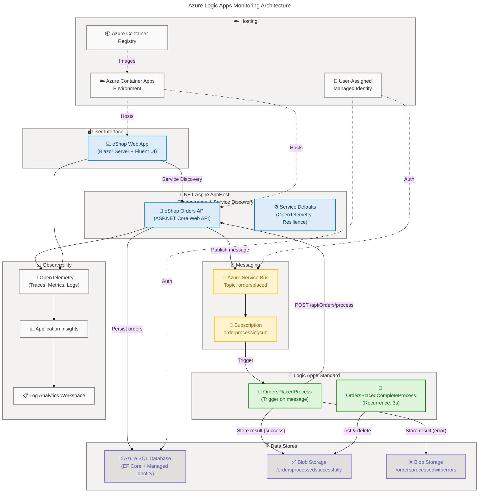

# Azure Logic Apps Monitoring Solution

[](https://github.com/Evilazaro/Azure-LogicApps-Monitoring/actions/workflows/ci-dotnet.yml)
[](https://github.com/Evilazaro/Azure-LogicApps-Monitoring/actions/workflows/azure-dev.yml)
[](LICENSE)
[](global.json)
[](app.AppHost/app.AppHost.csproj)
[]()

An enterprise-grade monitoring solution for **Azure Logic Apps Standard** built with **.NET Aspire** orchestration. This solution implements an eShop microservices application with an Orders REST API, a Blazor Server frontend, and Logic Apps Standard workflows for automated order processing — all fully observable through **OpenTelemetry** and **Application Insights**.

## Overview

This project enables end-to-end monitoring and automated processing of Azure Logic Apps Standard workflows, designed for platform engineers and cloud architects who need production-grade observability across event-driven microservices. It bridges the gap between application services and workflow automation by providing a unified telemetry pipeline from order placement through Logic Apps processing.

The solution uses .NET Aspire as an orchestration layer to wire together an Orders REST API, a Blazor Server frontend, and two Logic Apps Standard workflows — all connected through Azure Service Bus topics and fully instrumented with OpenTelemetry traces, custom metrics, and Application Insights. Local development is supported via Service Bus and SQL Server emulators, while Azure deployment uses Managed Identity and Bicep IaC for zero-secret infrastructure.

> 💡 **Tip**: For the fastest path to a running deployment, skip to [Getting Started](#getting-started) and run `azd up` — the single command handles provisioning, configuration, and deployment.

## Table of Contents

- [Overview](#overview)
- [Architecture](#architecture)
- [Features](#features)
- [Technology Stack](#technology-stack)
- [Requirements](#requirements)
- [Getting Started](#getting-started)
- [Deployment](#deployment)
- [Usage](#usage)
- [Project Structure](#project-structure)
- [Application Components](#application-components)
- [Logic Apps Workflows](#logic-apps-workflows)
- [Infrastructure](#infrastructure)
- [CI/CD Pipelines](#cicd-pipelines)
- [Testing](#testing)
- [Configuration](#configuration)
- [Contributing](#contributing)
- [License](#license)

## Architecture


```mermaid
---
title: Azure Logic Apps Monitoring Architecture
config:
  theme: base
  look: classic
  layout: dagre
  themeVariables:
    fontSize: '16px'
  flowchart:
    htmlLabels: true
---
flowchart TB
    accTitle: Azure Logic Apps Monitoring Architecture
    accDescr: End-to-end architecture showing eShop web app, orders API, Service Bus messaging, Logic Apps workflows, data stores, observability, and hosting with data flow relationships

    %% ═══════════════════════════════════════════════════════════════════════════
    %% AZURE / FLUENT ARCHITECTURE PATTERN v1.1
    %% (Semantic + Structural + Font + Accessibility Governance)
    %% ═══════════════════════════════════════════════════════════════════════════
    %% PHASE 1 - STRUCTURAL: Direction explicit, flat topology, nesting ≤ 3
    %% PHASE 2 - SEMANTIC: Colors justified, max 5 semantic classes, neutral-first
    %% PHASE 3 - FONT: Dark text on light backgrounds, contrast ≥ 4.5:1
    %% PHASE 4 - ACCESSIBILITY: accTitle/accDescr present, icons on all nodes
    %% PHASE 5 - STANDARD: Governance block present, classDefs centralized
    %% ═══════════════════════════════════════════════════════════════════════════

    subgraph UserInterface["🖥️ User Interface"]
        WebApp["💻 eShop Web App<br/>(Blazor Server + Fluent UI)"]
    end

    subgraph AspireHost["🎯 .NET Aspire AppHost<br/>Orchestration & Service Discovery"]
        direction LR
        OrdersAPI["🔌 eShop Orders API<br/>(ASP.NET Core Web API)"]
        ServiceDefaults["⚙️ Service Defaults<br/>(OpenTelemetry, Resilience)"]
    end

    subgraph Messaging["📨 Messaging"]
        ServiceBus["📨 Azure Service Bus<br/>Topic: ordersplaced"]
        Subscription["📩 Subscription<br/>orderprocessingsub"]
    end

    subgraph WorkflowEngine["🔄 Logic Apps Standard"]
        ProcessWF["🔄 OrdersPlacedProcess<br/>(Trigger on message)"]
        CleanupWF["🧹 OrdersPlacedCompleteProcess<br/>(Recurrence: 3s)"]
    end

    subgraph DataStores["🗄️ Data Stores"]
        SQL["🗄️ Azure SQL Database<br/>(EF Core + Managed Identity)"]
        BlobSuccess["✅ Blob Storage<br/>/ordersprocessedsuccessfully"]
        BlobErrors["❌ Blob Storage<br/>/ordersprocessedwitherrors"]
    end

    subgraph Observability["📊 Observability"]
        AppInsights["📊 Application Insights"]
        LogAnalytics["📋 Log Analytics Workspace"]
        OTel["📡 OpenTelemetry<br/>(Traces, Metrics, Logs)"]
    end

    subgraph Hosting["☁️ Hosting"]
        ContainerApps["☁️ Azure Container Apps<br/>Environment"]
        ACR["📦 Azure Container Registry"]
        ManagedID["🔐 User-Assigned<br/>Managed Identity"]
    end

    WebApp -->|"Service Discovery"| OrdersAPI
    OrdersAPI -->|"Persist orders"| SQL
    OrdersAPI -->|"Publish message"| ServiceBus
    ServiceBus --> Subscription
    Subscription -->|"Trigger"| ProcessWF
    ProcessWF -->|"POST /api/Orders/process"| OrdersAPI
    ProcessWF -->|"Store result (success)"| BlobSuccess
    ProcessWF -->|"Store result (error)"| BlobErrors
    CleanupWF -->|"List & delete"| BlobSuccess
    OrdersAPI --> OTel
    WebApp --> OTel
    OTel --> AppInsights
    AppInsights --> LogAnalytics
    ContainerApps -.->|"Hosts"| OrdersAPI
    ContainerApps -.->|"Hosts"| WebApp
    ACR -.->|"Images"| ContainerApps
    ManagedID -.->|"Auth"| SQL
    ManagedID -.->|"Auth"| ServiceBus

    %% Centralized semantic classDefs (AZURE/FLUENT v1.1 approved palette)
    classDef neutral fill:#FAFAFA,stroke:#8A8886,stroke-width:2px,color:#323130
    classDef core fill:#DEECF9,stroke:#0078D4,stroke-width:2px,color:#004578
    classDef success fill:#DFF6DD,stroke:#107C10,stroke-width:2px,color:#0B6A0B
    classDef warning fill:#FFF4CE,stroke:#FFB900,stroke-width:2px,color:#986F0B
    classDef data fill:#E1DFDD,stroke:#8378DE,stroke-width:2px,color:#5B5FC7

    class WebApp,OrdersAPI,ServiceDefaults core
    class ServiceBus,Subscription warning
    class ProcessWF,CleanupWF success
    class SQL,BlobSuccess,BlobErrors data
    class AppInsights,LogAnalytics,OTel,ContainerApps,ACR,ManagedID neutral

    %% Subgraph styling — style directives (NOT class) per MRM-S001
    style UserInterface fill:#F3F2F1,stroke:#8A8886,stroke-width:2px,color:#323130
    style AspireHost fill:#F3F2F1,stroke:#8A8886,stroke-width:2px,color:#323130
    style Messaging fill:#F3F2F1,stroke:#8A8886,stroke-width:2px,color:#323130
    style WorkflowEngine fill:#F3F2F1,stroke:#8A8886,stroke-width:2px,color:#323130
    style DataStores fill:#F3F2F1,stroke:#8A8886,stroke-width:2px,color:#323130
    style Observability fill:#F3F2F1,stroke:#8A8886,stroke-width:2px,color:#323130
    style Hosting fill:#F3F2F1,stroke:#8A8886,stroke-width:2px,color:#323130
```

### Data Flow

1. A user places an order through the **Web App** (Blazor Server with Fluent UI)
2. The Web App calls the **Orders API** via Aspire service discovery ([src/eShop.Web.App/Program.cs](src/eShop.Web.App/Program.cs#L75))
3. The Orders API persists the order to **Azure SQL** and publishes a message to **Azure Service Bus** ([src/eShop.Orders.API/Services/OrderService.cs](src/eShop.Orders.API/Services/OrderService.cs#L28))
4. The **OrdersPlacedProcess** Logic App workflow triggers on the Service Bus message, calls the Orders API `/api/Orders/process` endpoint, and stores the result in **Blob Storage** ([workflows/OrdersManagement/OrdersManagementLogicApp/OrdersPlacedProcess/workflow.json](workflows/OrdersManagement/OrdersManagementLogicApp/OrdersPlacedProcess/workflow.json#L20))
5. The **OrdersPlacedCompleteProcess** workflow runs every 3 seconds to clean up processed blobs ([workflows/OrdersManagement/OrdersManagementLogicApp/OrdersPlacedCompleteProcess/workflow.json](workflows/OrdersManagement/OrdersManagementLogicApp/OrdersPlacedCompleteProcess/workflow.json))
6. All operations are traced end-to-end via **OpenTelemetry** and **Application Insights** ([app.ServiceDefaults/Extensions.cs](app.ServiceDefaults/Extensions.cs))

## Features

The solution delivers five integrated capability areas — order management, a web frontend, event-driven workflow processing, full-stack observability, and enterprise resilience — that together form a production-ready monitoring reference architecture. Each capability is grounded in Azure-native services and instrumented for end-to-end traceability.

These features work as a cohesive system: orders flow from the Blazor UI through the REST API into Azure Service Bus, get processed by Logic Apps workflows, and every step is captured by OpenTelemetry instrumentation feeding into Application Insights. This design demonstrates how to build observable, event-driven applications on Azure with zero stored secrets.

| Feature                     | Description                                                         | Key Capabilities                                                                                                                               |
| --------------------------- | ------------------------------------------------------------------- | ---------------------------------------------------------------------------------------------------------------------------------------------- |
| 📋 Order Management         | REST API with full CRUD operations and batch processing             | Create, batch create, process, list, get by ID, delete orders; EF Core with retry-on-failure; OpenAPI/Swagger docs                             |
| 💻 Web Frontend             | Blazor Server application with Microsoft Fluent UI design system    | Interactive SSR pages for order listing, placement, batch submission, detail views; SignalR with sticky sessions                               |
| 🔄 Event-Driven Workflows   | Azure Logic Apps Standard for automated order processing            | Service Bus topic/subscription messaging; Managed Identity auth; blob storage for results                                                      |
| 📊 Full-Stack Observability | OpenTelemetry instrumentation with Application Insights integration | ASP.NET Core, HTTP, SQL, Service Bus tracing; custom metrics (`orders.placed`, `orders.processing.duration`); `/health` and `/alive` endpoints |
| 🛡️ Enterprise Resilience    | Multi-layer retry and circuit breaker patterns                      | HTTP: 600s timeout, 3 retries, circuit breaker; EF Core: 5 retries, 30s max delay; Service Bus: AMQP WebSockets, exponential retry             |

## Technology Stack

| Layer             | Technology                           | Version        |
| ----------------- | ------------------------------------ | -------------- |
| 🎯 Orchestration  | .NET Aspire                          | 13.1.0         |
| ⚙️ Runtime        | .NET                                 | 10.0           |
| 🌐 API Framework  | ASP.NET Core Web API                 | 10.0           |
| 💻 Frontend       | Blazor Server + Fluent UI            | 4.14.0         |
| 🗄️ ORM            | Entity Framework Core (SQL Server)   | 10.0.3         |
| 📨 Messaging      | Azure Service Bus                    | 7.20.1         |
| 🔄 Workflows      | Azure Logic Apps Standard            | —              |
| 📊 Observability  | OpenTelemetry + Application Insights | 1.15.0 / 1.5.0 |
| 🔐 Authentication | Azure.Identity (Managed Identity)    | 1.18.0         |
| 🏗️ Infrastructure | Bicep (IaC)                          | —              |
| 🚀 Deployment     | Azure Developer CLI (azd)            | ≥ 1.11.0       |
| ☁️ Hosting        | Azure Container Apps                 | —              |
| 🧪 Testing        | MSTest + Microsoft.Testing.Platform  | —              |

## Requirements

A complete development environment requires six tools that handle building, provisioning, containerization, scripting, and infrastructure compilation. The `preprovision` hook ([hooks/preprovision.ps1](hooks/preprovision.ps1)) validates all prerequisites automatically and can optionally auto-install missing tools via `winget`.

The toolchain is split between build-time dependencies (.NET SDK, Docker) and deployment-time dependencies (Azure CLI, azd, Bicep). For local-only development without Azure deployment, only .NET SDK and Docker are required since the Aspire AppHost uses emulators for Service Bus and SQL Server.

| Tool                                                                                                        | Minimum Version | Purpose                                    |
| ----------------------------------------------------------------------------------------------------------- | --------------- | ------------------------------------------ |
| 🛠️ [.NET SDK](https://dotnet.microsoft.com/download)                                                        | 10.0.100        | Build and run the application              |
| ☁️ [Azure CLI](https://learn.microsoft.com/cli/azure/install-azure-cli)                                     | 2.60.0          | Azure resource management                  |
| 🚀 [Azure Developer CLI (azd)](https://learn.microsoft.com/azure/developer/azure-developer-cli/install-azd) | 1.11.0          | Infrastructure provisioning and deployment |
| 🐳 [Docker](https://www.docker.com/get-started)                                                             | Latest          | Local development (emulators, containers)  |
| ⚡ [PowerShell](https://learn.microsoft.com/powershell/scripting/install/installing-powershell)             | 7.0             | Hook scripts execution                     |
| 📦 [Bicep CLI](https://learn.microsoft.com/azure/azure-resource-manager/bicep/install)                      | 0.30.0          | Infrastructure-as-Code compilation         |

Validate your environment:

```powershell
./hooks/check-dev-workstation.ps1
```

## Getting Started

### 1. Clone the Repository

```bash
git clone https://github.com/Evilazaro/Azure-LogicApps-Monitoring.git
cd Azure-LogicApps-Monitoring
```

### 2. Authenticate with Azure

```bash
azd auth login
```

### 3. Create an Environment

```bash
azd env new <environment-name>
```

### 4. Provision and Deploy

```bash
azd up
```

This single command executes the full deployment pipeline defined in [azure.yaml](azure.yaml):

1. **Pre-provision** — Validates prerequisites, restores packages, builds, and runs tests with code coverage ([azure.yaml](azure.yaml#L63))
2. **Provision** — Deploys all Azure infrastructure via Bicep ([infra/main.bicep](infra/main.bicep))
3. **Post-provision** — Configures SQL managed identity, sets user secrets, generates sample orders ([hooks/postprovision.ps1](hooks/postprovision.ps1))
4. **Pre-deploy** — Deploys Logic Apps workflows with resolved connection parameters ([hooks/deploy-workflow.ps1](hooks/deploy-workflow.ps1))
5. **Deploy** — Builds container images and deploys to Azure Container Apps

### Local Development

For local development, the Aspire AppHost automatically uses emulators and containers ([app.AppHost/AppHost.cs](app.AppHost/AppHost.cs)):

- **Service Bus** → Service Bus Emulator (line 46)
- **SQL Database** → SQL Server container with persistent volume (line 39)

```bash
dotnet run --project app.AppHost
```

The Aspire dashboard will be available at `https://localhost:17267` ([app.AppHost/Properties/launchSettings.json](app.AppHost/Properties/launchSettings.json)) providing real-time telemetry for all services.

## Deployment

The solution supports two deployment strategies: automated via `azd up` and CI/CD via GitHub Actions.

### Azure Developer CLI

The `azd up` command ([azure.yaml](azure.yaml)) executes the full deployment pipeline:

```bash
azd up
```

This single command runs 5 lifecycle hooks in sequence:

| Phase             | Hook Script                                      | Action                                                          |
| ----------------- | ------------------------------------------------ | --------------------------------------------------------------- |
| 🔍 Pre-provision  | [preprovision.ps1](hooks/preprovision.ps1)       | Validate prerequisites, restore, build, test with code coverage |
| 🏗️ Provision      | [main.bicep](infra/main.bicep)                   | Deploy all Azure infrastructure (17 Bicep modules)              |
| ⚙️ Post-provision | [postprovision.ps1](hooks/postprovision.ps1)     | Configure SQL managed identity, set user secrets, seed data     |
| 📦 Pre-deploy     | [deploy-workflow.ps1](hooks/deploy-workflow.ps1) | Deploy Logic Apps workflows with resolved connection parameters |
| 🚀 Deploy         | [azure.yaml](azure.yaml)                         | Build container images, push to ACR, deploy to Container Apps   |

### CI/CD Deployment

The CD pipeline ([.github/workflows/azure-dev.yml](.github/workflows/azure-dev.yml)) automates deployment on push to `main` using OIDC/Federated Credentials:

```bash
# Required repository variables (no stored secrets)
AZURE_CLIENT_ID
AZURE_TENANT_ID
AZURE_SUBSCRIPTION_ID
```

### Clean Up Resources

Remove all deployed Azure resources:

```bash
azd down --purge --force
```

The `postinfradelete` hook ([hooks/postinfradelete.ps1](hooks/postinfradelete.ps1)) performs additional cleanup after resource deletion.

## Usage

### API Endpoints

Access the Orders API through Aspire service discovery or directly at `https://localhost:7193` ([app.AppHost/Properties/launchSettings.json](app.AppHost/Properties/launchSettings.json)):

```bash
# Create a new order
curl -X POST https://localhost:7193/api/orders \
  -H "Content-Type: application/json" \
  -d '{"customerId":"customer-001","deliveryAddress":"123 Main St","products":[{"productId":"prod-001","productDescription":"Wireless Mouse","quantity":2,"price":29.99}]}'
```

Expected response (HTTP 201):

```json
{
  "id": 1,
  "customerId": "customer-001",
  "date": "2026-03-02T10:00:00Z",
  "deliveryAddress": "123 Main St",
  "total": 59.98,
  "products": [
    {
      "productId": "prod-001",
      "productDescription": "Wireless Mouse",
      "quantity": 2,
      "price": 29.99
    }
  ]
}
```

### Web Application

Access the Blazor Server frontend through the Aspire Dashboard at `https://localhost:17267`:

- **Place Order** — Submit individual orders with product selection
- **Place Orders Batch** — Submit multiple orders simultaneously
- **List All Orders** — Browse all orders with pagination
- **View Order** — Inspect order details by ID

### Generate Sample Data

Generate randomized sample order data (default: 2,000 orders) for testing:

```powershell
./hooks/Generate-Orders.ps1 -OrderCount 100
```

The script creates orders with 20 tech products and 20 global delivery addresses, exported to `infra/data/ordersBatch.json` ([hooks/Generate-Orders.ps1](hooks/Generate-Orders.ps1)).

### Monitoring

The Aspire Dashboard provides real-time observability across all services:

- **Traces** — Distributed tracing across API → Service Bus → Logic Apps
- **Metrics** — `orders.placed`, `orders.deleted`, `orders.processing.duration` counters and histograms
- **Logs** — Structured logging from all services with correlation IDs

> 📌 **Note**: In Azure, Application Insights replaces the Aspire Dashboard. Query traces and metrics through the Azure Portal or Log Analytics with KQL.

## Project Structure

```text
Azure-LogicApps-Monitoring/
├── 🎯 app.AppHost/                       # .NET Aspire orchestration host
│   ├── AppHost.cs                        # Service registration & Azure resource configuration
│   └── 📁 infra/                         # Container Apps manifest templates
│       ├── orders-api.tmpl.yaml          # Orders API container config (10 min replicas)
│       └── web-app.tmpl.yaml             # Web App container config (5 min replicas, sticky sessions)
├── ⚙️ app.ServiceDefaults/               # Shared cross-cutting concerns
│   ├── Extensions.cs                     # OpenTelemetry, resilience, health checks, Service Bus client
│   └── CommonTypes.cs                    # Shared domain models (Order, OrderProduct)
├── 📦 src/
│   ├── 🌐 eShop.Orders.API/              # REST API for order management
│   │   ├── 🎮 Controllers/               # API endpoints (OrdersController)
│   │   ├── 🔧 Services/                  # Business logic with metrics (OrderService)
│   │   ├── 🗄️ Repositories/              # EF Core data access (OrderRepository)
│   │   ├── 📨 Handlers/                  # Service Bus message publishing
│   │   ├── 💚 HealthChecks/              # Database & Service Bus health checks
│   │   ├── 💾 data/                      # EF Core DbContext & entity mappings
│   │   └── 📋 Migrations/                # SQL database migrations
│   ├── 💻 eShop.Web.App/                 # Blazor Server frontend
│   │   ├── 📄 Components/Pages/          # Blazor pages (Home, ListAllOrders, PlaceOrder, etc.)
│   │   ├── 🔗 Components/Services/       # Typed HTTP client for Orders API
│   │   └── 🎨 Components/Layout/         # Main layout and navigation
│   └── 🧪 tests/                         # Test projects (4 projects, 30+ test files)
│       ├── app.AppHost.Tests/            # Aspire host integration tests
│       ├── app.ServiceDefaults.Tests/    # Service defaults & model tests
│       ├── eShop.Orders.API.Tests/       # API controller, service, repository tests
│       └── eShop.Web.App.Tests/          # Web app service & component tests
├── 🔄 workflows/OrdersManagement/        # Azure Logic Apps Standard workflows
│   └── OrdersManagementLogicApp/
│       ├── OrdersPlacedProcess/          # Service Bus trigger → process order → store blob
│       └── OrdersPlacedCompleteProcess/  # Recurrence trigger → cleanup processed blobs
├── 🏗️ infra/                             # Bicep infrastructure-as-code (17 modules)
│   ├── main.bicep                        # Entry point (subscription scope)
│   ├── shared/                           # Network, identity, monitoring, data resources
│   └── workload/                         # Service Bus, Container Apps, Logic Apps
├── 🪝 hooks/                             # Lifecycle scripts (PowerShell + Bash)
└── 🚀 .github/workflows/                 # CI/CD pipelines (GitHub Actions)
```

## Application Components

### Orders API

The Orders API is an ASP.NET Core Web API providing RESTful endpoints for order management ([src/eShop.Orders.API/](src/eShop.Orders.API/)).

| Endpoint                 | Method   | Description                                |
| ------------------------ | -------- | ------------------------------------------ |
| 📋 `/api/orders`         | `POST`   | Place a new order                          |
| 📦 `/api/orders/batch`   | `POST`   | Place multiple orders in batch             |
| ⚙️ `/api/orders/process` | `POST`   | Process an order (used by Logic Apps)      |
| 📄 `/api/orders`         | `GET`    | List all orders (paginated, split queries) |
| 🔍 `/api/orders/{id}`    | `GET`    | Get order by ID                            |
| 🗑️ `/api/orders`         | `DELETE` | Delete all orders                          |
| ❌ `/api/orders/{id}`    | `DELETE` | Delete order by ID                         |
| 💚 `/health`             | `GET`    | Health check (DB + Service Bus)            |
| 💓 `/alive`              | `GET`    | Liveness probe                             |

**Key capabilities:**

- **Distributed tracing** with `ActivitySource` on every operation ([OrdersController.cs](src/eShop.Orders.API/Controllers/OrdersController.cs#L24))
- **Custom metrics** via `System.Diagnostics.Metrics`: order counters, processing duration histogram, error counters ([OrderService.cs](src/eShop.Orders.API/Services/OrderService.cs#L28))
- **Message publishing** to Azure Service Bus with retry and batch support ([OrdersMessageHandler](src/eShop.Orders.API/Handlers/OrdersMessageHandler.cs))
- **No-op message handler** for local development without Service Bus ([NoOpOrdersMessageHandler](src/eShop.Orders.API/Handlers/NoOpOrdersMessageHandler.cs))

### Web Application

The Web App is a Blazor Server application with Microsoft Fluent UI providing the order management frontend ([src/eShop.Web.App/](src/eShop.Web.App/)).

**Pages:**

- **Home** — Landing page ([Home.razor](src/eShop.Web.App/Components/Pages/Home.razor))
- **List All Orders** — Browse all orders ([ListAllOrders.razor](src/eShop.Web.App/Components/Pages/ListAllOrders.razor))
- **Place Order** — Submit a single order ([PlaceOrder.razor](src/eShop.Web.App/Components/Pages/PlaceOrder.razor))
- **Place Orders Batch** — Submit multiple orders at once ([PlaceOrdersBatch.razor](src/eShop.Web.App/Components/Pages/PlaceOrdersBatch.razor))
- **View Order** — Order detail view ([ViewOrder.razor](src/eShop.Web.App/Components/Pages/ViewOrder.razor))

**Configuration highlights:**

- Session management with 30-minute idle timeout and secure cookies ([Program.cs](src/eShop.Web.App/Program.cs#L20))
- SignalR with 32 KB max message size, 2-minute handshake timeout, 5-minute client timeout ([Program.cs](src/eShop.Web.App/Program.cs#L44))
- Typed HTTP client `OrdersAPIService` with Aspire service discovery ([Program.cs](src/eShop.Web.App/Program.cs#L72))

### Service Defaults

Shared infrastructure registered by all services via `AddServiceDefaults()` ([app.ServiceDefaults/Extensions.cs](app.ServiceDefaults/Extensions.cs)):

- **OpenTelemetry** — Traces (ASP.NET Core, HTTP, SQL Client, Service Bus), metrics (runtime, HTTP, ASP.NET Core), and logging
- **Health checks** — Mapped to `/health` (all checks) and `/alive` (liveness)
- **Service discovery** — Automatic endpoint resolution between services
- **HTTP resilience** — Global retry, timeout, and circuit breaker policies
- **Azure Service Bus client** — Singleton registration with managed identity or connection string

### Domain Models

Shared models defined in [CommonTypes.cs](app.ServiceDefaults/CommonTypes.cs):

- **`Order`** — Record with `Id`, `CustomerId`, `Date`, `DeliveryAddress`, `Total`, and `Products` list (all properties validated with data annotations)
- **`OrderProduct`** — Record with `Id`, `OrderId`, `ProductId`, `ProductDescription`, `Quantity`, and `Price`

## Logic Apps Workflows

Two Logic Apps Standard workflows automate order processing ([workflows/OrdersManagement/OrdersManagementLogicApp/](workflows/OrdersManagement/OrdersManagementLogicApp/)):

### OrdersPlacedProcess

**Trigger:** Azure Service Bus topic `ordersplaced`, subscription `orderprocessingsub` (1-second polling)

**Flow:**

1. Receives message from Service Bus
2. Validates content type is `application/json`
3. Calls Orders API `POST /api/Orders/process` with the decoded message body
4. On HTTP 201 success → stores result blob in `/ordersprocessedsuccessfully`
5. On failure → stores result blob in `/ordersprocessedwitherrors`

Source: [OrdersPlacedProcess/workflow.json](workflows/OrdersManagement/OrdersManagementLogicApp/OrdersPlacedProcess/workflow.json)

### OrdersPlacedCompleteProcess

**Trigger:** Recurrence (every 3 seconds)

**Flow:**

1. Lists all blobs in `/ordersprocessedsuccessfully`
2. For each blob (up to 20 in parallel): reads metadata, then deletes the blob

Source: [OrdersPlacedCompleteProcess/workflow.json](workflows/OrdersManagement/OrdersManagementLogicApp/OrdersPlacedCompleteProcess/workflow.json)

### Workflow Connections

Both workflows authenticate using **User-Assigned Managed Identity** for:

- **Azure Service Bus** — Topic message consumption
- **Azure Blob Storage** — Result blob creation and cleanup

Connection configuration: [connections.json](workflows/OrdersManagement/OrdersManagementLogicApp/connections.json)

## Infrastructure

All infrastructure is defined as **Bicep** modules deployed at subscription scope ([infra/main.bicep](infra/main.bicep)):

### Deployment Topology

| Phase | Module                                                      | Resources                                                                                   |
| ----- | ----------------------------------------------------------- | ------------------------------------------------------------------------------------------- |
| 🏗️ 1  | Resource Group                                              | `rg-{solution}-{env}-{location}`                                                            |
| 🌐 2  | [Shared / Network](infra/shared/network/main.bicep)         | VNet with subnets (Container Apps, Logic Apps, data services)                               |
| 🔐 3  | [Shared / Identity](infra/shared/identity/main.bicep)       | User-Assigned Managed Identity with role assignments                                        |
| 📊 4  | [Shared / Monitoring](infra/shared/monitoring/)             | Log Analytics Workspace + Application Insights                                              |
| 🗄️ 5  | [Shared / Data](infra/shared/data/main.bicep)               | Storage accounts (logs + workflow), Azure SQL Server/Database, private endpoints            |
| 📨 6  | [Workload / Messaging](infra/workload/messaging/main.bicep) | Service Bus namespace, topic `ordersplaced`, subscription `orderprocessingsub`              |
| ☁️ 7  | [Workload / Services](infra/workload/services/main.bicep)   | Azure Container Registry, Container Apps Environment, Aspire Dashboard                      |
| 🔄 8  | [Workload / Logic App](infra/workload/logic-app.bicep)      | Logic App Standard (WorkflowStandard tier), Service Bus + Blob API connections, diagnostics |

### Security

- **Managed Identity** for all service-to-service authentication (no stored secrets)
- **OIDC/Federated Credentials** for CI/CD pipeline authentication ([.github/workflows/azure-dev.yml](.github/workflows/azure-dev.yml))
- **VNet integration** with private endpoints for data services ([infra/shared/network/main.bicep](infra/shared/network/main.bicep))
- **Azure SQL** with Active Directory authentication and managed identity db_owner role ([hooks/postprovision.ps1](hooks/postprovision.ps1))

## CI/CD Pipelines

Three GitHub Actions workflows provide continuous integration and delivery:

### CI Pipeline

**File:** [.github/workflows/ci-dotnet.yml](.github/workflows/ci-dotnet.yml) (calls [ci-dotnet-reusable.yml](.github/workflows/ci-dotnet-reusable.yml))

| Job        | Description                                       | Platforms              |
| ---------- | ------------------------------------------------- | ---------------------- |
| 🔨 Build   | Compile the solution                              | Ubuntu, Windows, macOS |
| 🧪 Test    | Run tests with Cobertura code coverage            | Ubuntu, Windows, macOS |
| 🔍 Analyze | Verify code formatting (.editorconfig compliance) | Ubuntu                 |
| 🛡️ CodeQL  | Security vulnerability scanning                   | Ubuntu                 |
| 📋 Summary | Aggregate results from all jobs                   | Ubuntu                 |

**Triggers:** Push to `main`, `feature/*`, `bugfix/*`, `hotfix/*`, `release/*`, `chore/*`, `docs/*` branches; PRs targeting `main`; manual dispatch.

### CD Pipeline

**File:** [.github/workflows/azure-dev.yml](.github/workflows/azure-dev.yml)

| Phase         | Description                                                              |
| ------------- | ------------------------------------------------------------------------ |
| 🧪 CI         | Runs the full CI pipeline                                                |
| 🚀 Deploy Dev | OIDC auth → `azd provision` → SQL managed identity config → `azd deploy` |
| 📋 Summary    | Deployment report                                                        |
| ⚠️ On Failure | Error reporting with rollback instructions                               |

**Authentication:** OIDC/Federated Credentials — no stored secrets. Requires `AZURE_CLIENT_ID`, `AZURE_TENANT_ID`, and `AZURE_SUBSCRIPTION_ID` as repository variables.

## Testing

The solution includes 4 test projects with 30+ test files using MSTest and `Microsoft.Testing.Platform` ([global.json](global.json)):

| Project                        | Scope                                                                               |
| ------------------------------ | ----------------------------------------------------------------------------------- |
| 🏗️ `app.AppHost.Tests`         | Aspire host integration, Azure credentials, resource naming, Service Bus/SQL config |
| ⚙️ `app.ServiceDefaults.Tests` | Extensions, OpenTelemetry config, domain model validation                           |
| 🌐 `eShop.Orders.API.Tests`    | Controllers, services, repositories, message handlers, health checks                |
| 💻 `eShop.Web.App.Tests`       | Orders API service client, Fluent UI design system, model validation                |

Run all tests locally:

```bash
dotnet test app.sln
```

Run with code coverage:

```bash
dotnet test app.sln --collect:"XPlat Code Coverage" --results-directory ./TestResults
```

## Configuration

The application supports two operational modes — local development with emulators and Azure deployment with managed identity — controlled entirely through configuration. The Aspire AppHost detects the environment automatically and selects the appropriate service bindings, eliminating manual environment switching.

Configuration flows through three layers: `appsettings.json` for base settings ([app.AppHost/appsettings.json](app.AppHost/appsettings.json)), .NET user secrets for Azure credentials (managed by the `postprovision` hook), and `azd` environment variables for deployment parameters. This layered approach keeps secrets out of source control while supporting both interactive development and CI/CD pipelines.

> ⚠️ **Important**: Never commit Azure connection strings or credentials to source control. The `postprovision` hook ([hooks/postprovision.ps1](hooks/postprovision.ps1)) stores all sensitive values in .NET user secrets automatically. Run `./hooks/clean-secrets.ps1` to clear secrets when switching environments.

### Local Development

The Aspire AppHost automatically configures local emulators when Azure resources are not configured ([app.AppHost/AppHost.cs](app.AppHost/AppHost.cs)):

| Service                 | Local Mode                              | Azure Mode                              |
| ----------------------- | --------------------------------------- | --------------------------------------- |
| 📨 Service Bus          | Emulator via `RunAsEmulator()`          | Existing namespace via managed identity |
| 🗄️ SQL Database         | SQL Server container with data volume   | Azure SQL via managed identity          |
| 📊 Application Insights | Skipped (uses OTLP to Aspire Dashboard) | Existing resource via managed identity  |

### Environment Variables

Key configuration values managed by `azd` and hook scripts:

| Variable                                | Description                    | Set By               |
| --------------------------------------- | ------------------------------ | -------------------- |
| ☁️ `AZURE_SUBSCRIPTION_ID`              | Target Azure subscription      | `azd env`            |
| 🏗️ `AZURE_RESOURCE_GROUP`               | Resource group name            | `azd provision`      |
| 🌍 `AZURE_LOCATION`                     | Azure region                   | `azd env`            |
| 📨 `Azure:ServiceBus:HostName`          | Service Bus namespace FQDN     | User secrets / `azd` |
| 🗄️ `ConnectionStrings:OrderDb`          | SQL connection string          | User secrets / `azd` |
| 📊 `Azure:AppInsights:ConnectionString` | App Insights connection string | User secrets / `azd` |

### User Secrets

Post-provisioning sets up .NET user secrets for local development against Azure resources ([hooks/postprovision.ps1](hooks/postprovision.ps1)):

```powershell
# Managed automatically by postprovision hook
dotnet user-secrets set "Azure:ServiceBus:HostName" "<namespace>.servicebus.windows.net" --project app.AppHost
dotnet user-secrets set "ConnectionStrings:OrderDb" "<connection-string>" --project app.AppHost
```

## Contributing

Contributions are welcome from developers interested in Azure Logic Apps monitoring, .NET Aspire orchestration, or event-driven architecture patterns. The project uses a standard fork-and-PR workflow with automated CI validation on every pull request, including cross-platform builds, test coverage, formatting checks, and CodeQL security scanning.

All changes must pass the full CI pipeline before merge. The repository enforces `.editorconfig` formatting rules and requires tests for new functionality — see the existing test projects in `src/tests/` for patterns to follow.

1. Fork the repository
2. Create a feature branch (`git checkout -b feature/your-feature`)
3. Validate your environment: `./hooks/check-dev-workstation.ps1`
4. Make your changes and add tests
5. Run `dotnet test app.sln` to verify all tests pass
6. Submit a pull request targeting `main`

The CI pipeline will automatically run cross-platform builds, tests with code coverage, formatting analysis, and CodeQL security scanning on your PR.

## License

This project is licensed under the [MIT License](LICENSE).

Copyright (c) 2025 Evilázaro Alves
