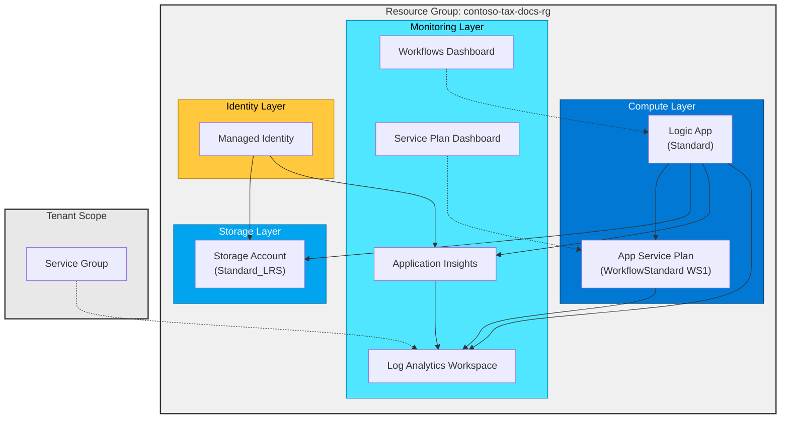

# Azure Logic Apps Monitoring

A comprehensive infrastructure-as-code solution demonstrating Azure Monitor best practices for Logic Apps Standard. This project provides production-ready Bicep templates for deploying Logic Apps with integrated observability, including Log Analytics Workspaces, Application Insights, custom dashboards, and RBAC (Role-Based Access Control) configurations. Designed for developers and architects seeking to implement enterprise-grade monitoring for Azure Logic Apps workflows.

---

## Badges


---

## Prerequisites

Before deploying this solution, ensure you have:

- **Azure Subscription** with Owner or Contributor permissions
- **Azure CLI** version 2.50.0 or later
- **Azure Developer CLI (azd)** version 1.5.0 or later
- **Bicep CLI** version 0.20.0 or later (installed with Azure CLI)
- **Visual Studio Code** (recommended) with:
  - Azure Tools extension
  - Bicep extension
- **Basic understanding of**:
  - Azure Logic Apps Standard
  - Azure Monitor and Log Analytics
  - Infrastructure as Code concepts

---

## File Structure

```
Azure-LogicApps-Monitoring/
│
├── .azure/                          # Azure Developer CLI configuration
│   ├── .gitignore
│   └── config.json
│
├── infra/                           # Infrastructure deployment templates
│   ├── main.bicep                   # Root deployment template
│   └── main.parameters.json         # Deployment parameters
│
├── src/
│   ├── logic-app.bicep              # Logic App and App Service Plan
│   │
│   ├── monitoring/                  # Monitoring infrastructure
│   │   ├── main.bicep               # Monitoring orchestration
│   │   ├── app-insights.bicep       # Application Insights
│   │   ├── log-analytics-workspace.bicep
│   │   └── azure-monitor-health-model.bicep
│   │
│   └── shared/                      # Shared resources
│       ├── main.bicep               # Shared orchestration
│       └── data/
│           └── main.bicep           # Storage Account deployment
│
├── azure.yaml                       # Azure Developer CLI metadata
├── .gitignore
├── CODE_OF_CONDUCT.md
├── CONTRIBUTING.md
├── LICENSE.md
├── README.md
└── SECURITY.md
```

---

## Architecture

### System Architecture


```mermaid
flowchart TB
    subgraph RG["Resource Group: contoso-tax-docs-rg"]
        subgraph Compute["Compute Layer"]
            ASP["App Service Plan<br/>(WorkflowStandard WS1)"]
            LA["Logic App<br/>(Standard)"]
        end
        
        subgraph Storage["Storage Layer"]
            SA["Storage Account<br/>(Standard_LRS)"]
        end
        
        subgraph Monitoring["Monitoring Layer"]
            LAW["Log Analytics Workspace"]
            AI["Application Insights"]
            DASH1["Workflows Dashboard"]
            DASH2["Service Plan Dashboard"]
        end
        
        subgraph Identity["Identity Layer"]
            MI["Managed Identity"]
        end
    end
    
    subgraph Tenant["Tenant Scope"]
        SG["Service Group"]
    end
    
    LA --> ASP
    LA --> SA
    LA --> AI
    MI --> SA
    MI --> AI
    ASP --> LAW
    LA --> LAW
    AI --> LAW
    DASH1 -.-> LA
    DASH2 -.-> ASP
    SG -.-> LAW
    
    style Compute fill:#0078D4,stroke:#004578,color:#fff
    style Storage fill:#00A4EF,stroke:#006BA1,color:#fff
    style Monitoring fill:#50E6FF,stroke:#007BA6,color:#000
    style Identity fill:#FFC83D,stroke:#B8860B,color:#000
    style RG fill:#f0f0f0,stroke:#333,stroke-width:2px
    style Tenant fill:#e8e8e8,stroke:#333,stroke-width:2px
```

### Data Flow

```mermaid
sequenceDiagram
    participant User
    participant LA as Logic App
    participant ASP as App Service Plan
    participant SA as Storage Account
    participant AI as Application Insights
    participant LAW as Log Analytics Workspace
    participant Portal as Azure Portal Dashboards
    
    User->>LA: Trigger Workflow
    activate LA
    
    LA->>SA: Read/Write Workflow State
    SA-->>LA: State Data
    
    LA->>AI: Send Telemetry (Instrumentation Key)
    LA->>LAW: Stream Diagnostic Logs (WorkflowRuntime)
    ASP->>LAW: Stream Metrics (CPU, Memory, Data In/Out)
    
    AI->>LAW: Forward Application Telemetry
    
    deactivate LA
    
    User->>Portal: View Dashboards
    Portal->>LAW: Query Metrics & Logs (KQL)
    LAW-->>Portal: Aggregated Data
    Portal-->>User: Visualizations (Charts & Graphs)
    
    style LA fill:#0078D4,stroke:#004578,color:#fff
    style ASP fill:#0078D4,stroke:#004578,color:#fff
    style SA fill:#00A4EF,stroke:#006BA1,color:#fff
    style AI fill:#50E6FF,stroke:#007BA6,color:#000
    style LAW fill:#50E6FF,stroke:#007BA6,color:#000
    style Portal fill:#7FBA00,stroke:#5A8700,color:#fff
```

### Key Components

| Component | Description | Purpose | Key Features |
|-----------|-------------|---------|--------------|
| **Logic App (Standard)** | Stateful workflow execution engine | Execute business logic and integrations | System-assigned managed identity, Application Insights integration, diagnostic logging to Log Analytics |
| **App Service Plan (WS1)** | Elastic compute infrastructure | Host Logic App workflows with auto-scaling | Elastic scale (1-20 workers), per-site scaling disabled, zone-redundancy configurable |
| **Storage Account** | Durable state and workflow data persistence | Store workflow runtime state, triggers, and artifacts | Hot access tier, HTTPS-only, LRS replication, file/blob/queue/table support |
| **Log Analytics Workspace** | Centralized log aggregation and querying | Collect and analyze diagnostic logs and metrics | 30-day retention, PerGB2018 pricing tier, KQL query support, immediate purge on 30 days |
| **Application Insights** | Application performance monitoring (APM) | Track telemetry, dependencies, and exceptions | Workspace-based configuration, instrumentation key, connection string for SDKs |
| **Managed Identity** | Keyless authentication to Azure resources | Eliminate credential management | System-assigned to Logic App, RBAC assignments to Storage and Application Insights |
| **Azure Monitor Dashboards** | Visual metric and log representation | Real-time operational insights | Workflow metrics (runs, triggers, failures), Service Plan metrics (CPU, memory, queue length) |
| **Service Group (Health Model)** | Hierarchical health monitoring structure | Organize monitoring resources logically | Tenant-scoped, parent-child relationships for service hierarchy |

### RBAC Roles

| Role Name | Description | Documentation Link |
|-----------|-------------|-------------------|
| **Storage Account Contributor** | Manage storage accounts including access keys | [Microsoft Learn](https://learn.microsoft.com/azure/role-based-access-control/built-in-roles#storage-account-contributor) |
| **Storage Blob Data Owner** | Full access to blob containers and data | [Microsoft Learn](https://learn.microsoft.com/azure/role-based-access-control/built-in-roles#storage-blob-data-owner) |
| **Storage Queue Data Contributor** | Read, write, and delete queue messages | [Microsoft Learn](https://learn.microsoft.com/azure/role-based-access-control/built-in-roles#storage-queue-data-contributor) |
| **Storage Table Data Contributor** | Read, write, and delete table data | [Microsoft Learn](https://learn.microsoft.com/azure/role-based-access-control/built-in-roles#storage-table-data-contributor) |
| **Monitoring Metrics Publisher** | Publish metrics to Azure Monitor | [Microsoft Learn](https://learn.microsoft.com/azure/role-based-access-control/built-in-roles#monitoring-metrics-publisher) |
| **Storage File Data Privileged Contributor** | Full access to file shares via SMB/REST | [Microsoft Learn](https://learn.microsoft.com/azure/role-based-access-control/built-in-roles#storage-file-data-privileged-contributor) |
| **Storage File Data SMB MI Admin** | Full access via SMB for managed identities | [Microsoft Learn](https://learn.microsoft.com/azure/role-based-access-control/built-in-roles#storage-file-data-smb-share-elevated-contributor) |
| **Storage File Data SMB Share Contributor** | Read, write, delete access via SMB | [Microsoft Learn](https://learn.microsoft.com/azure/role-based-access-control/built-in-roles#storage-file-data-smb-share-contributor) |
| **Storage File Data SMB Share Elevated Contributor** | Elevated SMB access including permissions management | [Microsoft Learn](https://learn.microsoft.com/azure/role-based-access-control/built-in-roles#storage-file-data-smb-share-elevated-contributor) |

---

## Features

### Comprehensive Monitoring

**Description**: Enterprise-grade observability infrastructure capturing all layers of the Logic Apps solution—from workflow execution details to underlying compute metrics. This feature group ensures complete visibility into application behavior, performance, and health.

**Benefits and Best Practices Applied**:
- **Unified Observability**: Single pane of glass for logs, metrics, and traces
- **Correlation Across Layers**: Connect workflow failures to infrastructure bottlenecks
- **Compliance-Ready**: 30-day retention with immediate purge support for GDPR/CCPA
- **Cost Optimization**: PerGB2018 pricing tier with diagnostic settings filtering

| Feature | Description | Configuration | Outputs |
|---------|-------------|---------------|---------|
| **Log Analytics Workspace** | Centralized log collection and KQL querying | PerGB2018 SKU, 30-day retention, system-assigned identity | `AZURE_LOG_ANALYTICS_WORKSPACE_ID` |
| **Diagnostic Settings (Logic App)** | Streams WorkflowRuntime logs and AllMetrics | Category: `WorkflowRuntime`, enabled metrics | Logs in Log Analytics |
| **Diagnostic Settings (App Service Plan)** | Captures compute-layer metrics (CPU, memory) | Category: `AllMetrics` | Metrics in Log Analytics |
| **Diagnostic Settings (App Insights)** | Forwards telemetry to Log Analytics | Category groups: `allLogs`, `AllMetrics` | Centralized telemetry storage |

### Metrics & Telemetry

**Description**: Pre-configured dashboards and Application Insights integration providing real-time and historical performance analytics. Focuses on actionable metrics aligned with SLIs (Service Level Indicators) for Logic Apps.

**Benefits and Best Practices Applied**:
- **Proactive Alerting**: Dashboards designed for anomaly detection (failure rates, queue length)
- **Developer Productivity**: Pre-built charts eliminate custom query creation time
- **Performance Baselines**: 24-hour time windows for trend analysis
- **APM Best Practices**: Instrumentation key and connection string for SDK integration

| Feature | Description | Metrics Tracked | Time Window |
|---------|-------------|-----------------|-------------|
| **Workflows Dashboard** | 9 charts covering workflow health and execution | Actions failure rate, job execution duration, runs completed/dispatched/started, triggers completed/failure rate | Past 24 hours (configurable) |
| **Service Plan Dashboard** | 6 charts monitoring compute resources | CPU percentage, memory percentage, data in/out, HTTP queue length | Past 24 hours (configurable) |
| **Application Insights** | APM with distributed tracing and dependency tracking | Custom events, exceptions, request telemetry, dependency calls | Real-time + historical |
| **Workspace-Based Config** | Links Application Insights to Log Analytics | All telemetry forwarded to Log Analytics for cross-resource queries | N/A |

### Security & Compliance

**Description**: Zero-credential architecture using managed identities and least-privilege RBAC roles. Ensures secure communication between Logic Apps, Storage, and monitoring services without storing secrets.

**Benefits and Best Practices Applied**:
- **Keyless Authentication**: No secrets in code, App Settings, or Key Vault
- **Principle of Least Privilege**: Granular RBAC roles (e.g., Queue Data Contributor vs. Account Contributor)
- **Audit Trail**: All RBAC assignments use GUIDs for deterministic deployment
- **Secure Transport**: HTTPS-only enforced on Storage Account

| Feature | Description | Assigned Roles | Scope |
|---------|-------------|----------------|-------|
| **Managed Identity (Logic App)** | System-assigned identity for Logic App | N/A (principal for RBAC assignments) | Logic App resource |
| **Managed Identity (Workload MI)** | User-assigned identity for cross-resource access | 9 Storage roles + Monitoring Metrics Publisher | Storage Account, Application Insights |
| **Storage RBAC** | Comprehensive data plane access | Blob/Queue/Table/File Data roles | Storage Account |
| **HTTPS-Only Enforcement** | Blocks insecure HTTP connections | Property: `supportsHttpsTrafficOnly: true` | Storage Account |

### Infrastructure as Code

**Description**: Fully declarative Bicep templates with modular design, parameterization, and Azure Developer CLI integration. Enables repeatable deployments across environments with minimal configuration drift.

**Benefits and Best Practices Applied**:
- **GitOps-Ready**: All infrastructure in version control
- **Environment Parity**: Dev/staging/prod from same templates with parameter files
- **Resource Uniqueness**: `uniqueString()` function prevents naming conflicts
- **Dependency Management**: Explicit `dependsOn` ensures correct provisioning order

| Feature | Description | Files | Commands |
|---------|-------------|-------|----------|
| **Modular Bicep Architecture** | Separation of concerns (compute, storage, monitoring) | main.bicep, main.bicep, main.bicep | `az deployment sub create` |
| **Azure Developer CLI Support** | Simplified deployment workflow | azure.yaml, main.parameters.json | `azd provision` |
| **Tag-Based Governance** | Consistent tagging for cost allocation and compliance | 7 tags: Solution, Environment, ManagedBy, CostCenter, Owner, ApplicationName, BusinessUnit | Applied via `tags` parameter |
| **Output Propagation** | Passes resource IDs between modules | Outputs: workspace ID, storage account name, instrumentation key, connection string | Referenced in dependent modules |

---

## Installation & Setup

### 1. Clone the Repository

Clone this repository to your local machine:

```bash
git clone https://github.com/yourusername/azure-logicapps-monitoring.git
cd azure-logicapps-monitoring
```

### 2. Authenticate with Azure

Login to Azure using the Azure Developer CLI:

```bash
azd auth login
```

**Expected Output**: A browser window opens for Azure authentication. After successful login, you'll see:
```
Logged in to Azure.
```

### 3. Initialize the Environment

Initialize the Azure Developer CLI environment. You'll be prompted to select a subscription and location:

```bash
azd init
```

**Prompts**:
- **Environment Name**: Enter a name (e.g., `dev`, `prod`)
- **Azure Subscription**: Select from available subscriptions
- **Azure Location**: Choose a region (e.g., `eastus2`, `westus2`)

**Expected Output**:
```
Initialized environment 'dev' in subscription 'Your Subscription Name'
```

### 4. Provision Infrastructure

Deploy all Azure resources defined in the Bicep templates:

```bash
azd provision
```

**Expected Output**:
```
Provisioning Azure resources...
✓ Resource group created: contoso-tax-docs-rg
✓ Storage account deployed: taxdocs[unique]stg
✓ Log Analytics Workspace deployed: tax-docs-[unique]-law
✓ Application Insights deployed: tax-docs-[unique]-appinsights
✓ Logic App deployed: tax-docs-[unique]-logicapp
✓ Dashboards deployed: tax-docs-dashboard, [asp-name]-dashboard

Deployment complete. Resources are ready.
```

**Deployment Time**: Approximately 5-8 minutes.

---

## Usage Examples

### Viewing Dashboards

#### Option A: Azure Portal Navigation

1. Navigate to the [Azure Portal](https://portal.azure.com)
2. Search for **"Dashboards"** in the top search bar
3. Select **"Dashboards"** from the services list
4. Locate the dashboards:
   - **`tax-docs-dashboard`**: Workflow metrics
   - **`[asp-name]-dashboard`**: Service Plan metrics
5. Click on a dashboard name to view metrics

#### Option B: CLI Command

Open the Workflows Dashboard directly in your browser:

```bash
az portal dashboard show \
  --name "tax-docs-dashboard" \
  --resource-group "contoso-tax-docs-rg" \
  --query "id" -o tsv | xargs -I {} az rest --method GET --uri {} | jq -r '.properties.dashboardLink' | xargs open
```

### Log Analytics Queries

#### 1. Monitor Workflow Runs

Query all workflow runs in the past 24 hours:

```kql
AzureDiagnostics
| where ResourceType == "MICROSOFT.WEB/SITES"
| where Category == "WorkflowRuntime"
| where TimeGenerated > ago(24h)
| where OperationName == "Microsoft.Logic/workflows/workflowRunCompleted"
| project TimeGenerated, 
          workflowName = workflow_name_s, 
          status = status_s, 
          runId = run_id_s,
          duration = toreal(duration_s)
| summarize 
    TotalRuns = count(),
    SuccessfulRuns = countif(status == "Succeeded"),
    FailedRuns = countif(status == "Failed"),
    AvgDuration = avg(duration)
  by workflowName
| order by FailedRuns desc
```

**Purpose**: Identify workflows with high failure rates and average execution times.

#### 2. Track Performance Metrics

Analyze Logic App execution duration percentiles:

```kql
AzureMetrics
| where ResourceId contains "LOGICAPP"
| where MetricName == "WorkflowJobExecutionDuration"
| where TimeGenerated > ago(7d)
| summarize 
    P50 = percentile(Average, 50),
    P90 = percentile(Average, 90),
    P99 = percentile(Average, 99),
    MaxDuration = max(Average)
  by bin(TimeGenerated, 1h)
| render timechart
```

**Purpose**: Detect performance degradation over time and identify outliers.

#### 3. Investigate Action Failures

Drill into specific action failures within workflows:

```kql
AzureDiagnostics
| where ResourceType == "MICROSOFT.WEB/SITES"
| where Category == "WorkflowRuntime"
| where OperationName == "Microsoft.Logic/workflows/workflowActionCompleted"
| where status_s == "Failed"
| where TimeGenerated > ago(24h)
| project TimeGenerated,
          workflowName = workflow_name_s,
          actionName = action_name_s,
          error = error_message_s,
          runId = run_id_s
| order by TimeGenerated desc
| take 50
```

**Purpose**: Quickly identify which actions are causing workflow failures and error messages for troubleshooting.

#### 4. Monitor App Service Plan Health

Track CPU and memory usage patterns:

```kql
AzureMetrics
| where ResourceId contains "SERVERFARMS"
| where MetricName in ("CpuPercentage", "MemoryPercentage")
| where TimeGenerated > ago(24h)
| summarize AvgValue = avg(Average), MaxValue = max(Maximum)
  by MetricName, bin(TimeGenerated, 5m)
| render timechart
```

**Purpose**: Correlate workflow failures with infrastructure resource constraints.

---

## Additional Resources

### Official Documentation
- [Azure Logic Apps Overview](https://learn.microsoft.com/azure/logic-apps/logic-apps-overview)
- [Monitor Logic Apps with Azure Monitor](https://learn.microsoft.com/azure/logic-apps/monitor-logic-apps-overview)
- [Create Diagnostic Settings for Logic Apps](https://learn.microsoft.com/azure/logic-apps/monitor-logic-apps#set-up-diagnostic-logging)
- [Azure Monitor KQL Reference](https://learn.microsoft.com/azure/data-explorer/kusto/query/)
- [Bicep Language Specification](https://learn.microsoft.com/azure/azure-resource-manager/bicep/)

### Best Practices Guides
- [Azure Well-Architected Framework - Operational Excellence](https://learn.microsoft.com/azure/well-architected/operational-excellence/)
- [Managed Identities Best Practices](https://learn.microsoft.com/azure/active-directory/managed-identities-azure-resources/managed-identity-best-practice-recommendations)
- [Application Insights Best Practices](https://learn.microsoft.com/azure/azure-monitor/app/app-insights-overview)

### Community Resources
- [Azure Logic Apps GitHub](https://github.com/Azure/logicapps)
- [Azure Samples - Logic Apps IaC](https://github.com/Azure-Samples/azure-logic-apps-deployment-samples)

### Related Projects
- [Azure Monitor Baseline Alerts](https://azure.github.io/azure-monitor-baseline-alerts/)
- [Azure Bicep Registry Modules](https://github.com/Azure/bicep-registry-modules)

