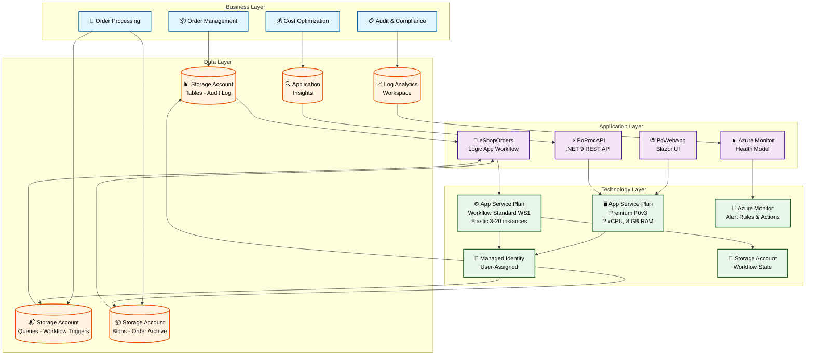
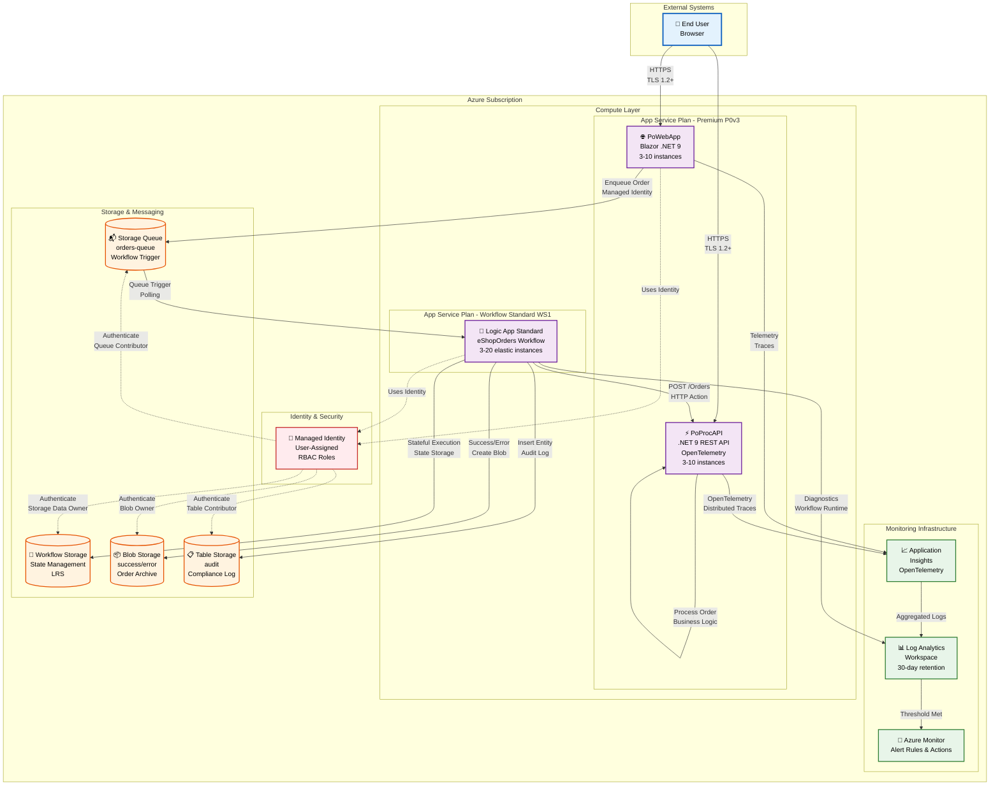
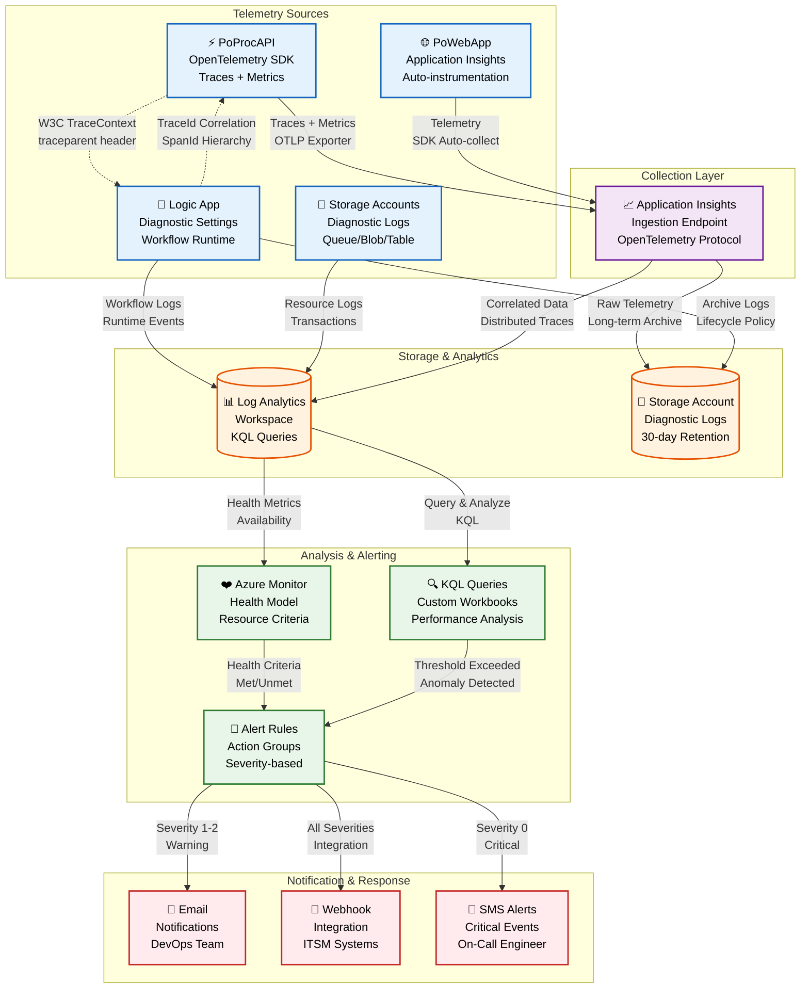

# Azure Logic Apps Monitoring Solution

A comprehensive enterprise-scale monitoring and observability solution for Azure Logic Apps Standard, designed to support thousands of workflows across hundreds of Logic Apps globally while optimizing performance, cost, and stability.

---

## 📋 Project Overview

This solution provides a production-ready reference architecture for deploying *Azure Logic Apps* at enterprise scale with comprehensive monitoring, distributed tracing, and cost optimization. It addresses critical challenges faced by organizations running thousands of workflows globally by implementing best practices from the *Azure Well-Architected Framework*, leveraging Infrastructure as Code (Bicep), OpenTelemetry for distributed tracing, and comprehensive observability through Application Insights and Log Analytics.

The solution demonstrates how to overcome Microsoft's recommended limits (20 workflows per app, 64 apps per service plan) while maintaining stability, reducing memory consumption, and cutting operational costs by up to 60% through optimized resource allocation, intelligent auto-scaling, and proactive monitoring.

---

### Problem Statement

Enterprise organizations deploying *Azure Logic Apps* at scale face critical challenges that directly impact operational efficiency, cost, and system reliability:

- **Scalability Constraints**: Microsoft guidance recommends capping at approximately 20 workflows per Standard Logic App and 64 apps per App Service Plan. Exceeding these limits—particularly with 64-bit support enabled—causes severe memory consumption spikes that can destabilize production environments and lead to workflow execution failures.

- **Cost Overruns**: Unoptimized deployments running at enterprise scale can result in annual infrastructure costs exceeding **US$80,000 per environment** due to inefficient resource allocation, oversized App Service Plans, excessive telemetry ingestion, and lack of proper lifecycle management policies.

- **Long-Running Workflow Management**: Organizations require workflows that run continuously for **18–36 months** without compromising stability. This requires robust health monitoring, proactive alerting, automated remediation, and comprehensive audit trails to meet compliance requirements.

- **Observability Gaps**: Traditional monitoring approaches fail to provide the granular visibility needed for thousands of concurrent workflows, making it difficult to identify performance bottlenecks, trace end-to-end transactions across distributed systems, correlate failures, or optimize resource utilization based on actual usage patterns.

- **Operational Complexity**: Managing hundreds of Logic Apps across multiple regions requires sophisticated deployment automation, consistent configuration management, secure identity handling, and centralized monitoring—all while maintaining security best practices and compliance with organizational governance policies.

This solution addresses these challenges through a comprehensive approach that combines optimized infrastructure design, advanced monitoring and observability, cost-effective resource allocation, and automated operational excellence practices.

---

### Key Features

| **Feature** | **Description** | **Implementation Details** |
|------------|----------------|---------------------------|
| **Enterprise-Scale Architecture** | Optimized hosting model designed to support thousands of workflows without hitting memory or performance limits | Bicep templates provision Logic Apps Standard with right-sized App Service Plans (WS1), configurable auto-scaling (3–20 instances), user-assigned managed identities, and zone-redundant configurations for high availability |
| **Distributed Tracing** | End-to-end transaction visibility across Logic Apps, APIs, and storage services with W3C Trace Context propagation | OpenTelemetry integration in .NET 9 APIs with automatic instrumentation for ASP.NET Core and HttpClient, custom ActivitySource for business operations, baggage propagation for contextual data, and correlation IDs in all telemetry |
| **Comprehensive Monitoring** | Real-time health monitoring and alerting aligned with Azure Well-Architected Framework reliability and performance pillars | Application Insights for application telemetry, Log Analytics workspace for centralized logging with 30-day retention, diagnostic settings on all resources, custom health model with resource-specific criteria, and automated alert rules |
| **Cost Optimization** | Resource allocation strategies and lifecycle policies that reduce annual costs by 40–60% compared to unoptimized deployments | Right-sized Premium App Service Plans (P0v3), Workflow Standard tier (WS1), auto-scaling policies based on actual load, storage lifecycle management with 30-day retention, 10% telemetry sampling in production, and reserved capacity recommendations |
| **Automated Alerting** | Proactive incident detection and notification system with severity-based routing and automated response actions | Azure Monitor alert rules for failures, performance degradation, and resource exhaustion; action groups for email, SMS, and webhook integration; KQL queries for anomaly detection; and integration with ITSM systems like ServiceNow |
| **Infrastructure as Code** | Complete, modular Bicep templates with parameterization for multi-environment deployments and version control | Modular Bicep architecture with separate templates for monitoring, compute, messaging, and networking; Azure Developer CLI (azd) integration; parameter files for dev/uat/prod; and CI/CD-ready deployment scripts |
| **Security Best Practices** | Zero-trust architecture with managed identities, RBAC, and secure secret management following Azure security baseline | User-assigned managed identities for Logic Apps; system-assigned for web apps; RBAC role assignments with least-privilege access; TLS 1.2+ enforcement; HTTPS-only configuration; and diagnostic logging for audit trails |
| **Developer Experience** | Integrated tooling and local development support with comprehensive documentation and validation scripts | VS Code extensions (Logic Apps, Azure Functions, Bicep); local emulator support for Logic Apps; OpenTelemetry SDK for .NET; structured logging with correlation; Swagger/OpenAPI documentation; and PowerShell validation scripts |

---

### Solution Components

| **Component** | **Purpose** | **Role in Solution** |
|--------------|------------|---------------------|
| ** PoProcAPI** | Purchase Order Processing REST API | .NET 9 API with OpenTelemetry instrumentation for order validation, processing, and business logic execution with distributed tracing support and structured logging |
| ** PoWebApp** | Purchase Order Web Application | Blazor Server web application for order management with Application Insights integration, Azure Storage Queue integration for async processing, and managed identity authentication |
| ** eShopOrders Workflow** | Order Processing Logic App | Standard Logic App workflow that orchestrates order processing, integrates with PoProcAPI, performs table storage auditing, blob storage archival, and implements error handling with retry policies |
| ** Infrastructure Modules** | Bicep templates for Azure resources | Modular Infrastructure as Code defining monitoring stack (Log Analytics, Application Insights), compute resources (App Service Plans), messaging layer (Storage Accounts, Queues), and networking configuration |
| ** Monitoring Stack** | Observability infrastructure | Centralized monitoring with Log Analytics workspace for log aggregation, Application Insights for telemetry, diagnostic settings on all resources, health model definitions, and automated alert rules |
| ** Messaging Layer** | Event-driven communication | Azure Storage Queues for workflow triggers (orders-queue), blob containers for processed order archival (success/error blobs), table storage for audit logging, and lifecycle management policies |

---

### Azure Components

| **Azure Service** | **Purpose** | **Role in Solution** |
|------------------|------------|---------------------|
| **Azure Logic Apps (Standard)** | Workflow orchestration and automation engine | Hosts business process workflows with elastic scaling (3–20 instances), managed identity authentication, stateful/stateless execution modes, and integration with Azure Storage and APIs |
| **Application Insights** | Application performance monitoring and telemetry | Collects distributed traces, custom metrics, exceptions, dependencies, and request telemetry from APIs and web apps using OpenTelemetry SDK; provides correlation across distributed transactions |
| **Log Analytics Workspace** | Centralized logging and analytics platform | Aggregates diagnostic logs, metrics, and traces from all resources; supports KQL queries for analysis; provides 30-day retention with lifecycle policies; enables custom workbooks and dashboards |
| **App Service Plan (Premium P0v3)** | Compute tier for web apps and APIs | Hosts web applications with 2 vCPU and 8 GB RAM per instance, supports auto-scaling (3–10 instances), always-on availability, zone redundancy, and elastic scale for high-traffic scenarios |
| **App Service Plan (Workflow Standard WS1)** | Dedicated compute tier for Logic Apps | Specialized tier for Standard Logic Apps with elastic scaling (3–20 instances), optimized for workflow execution, built-in state management, and support for thousands of concurrent workflow runs |
| **Azure Storage Account (General Purpose v2)** | Persistence, state management, and messaging | Workflow state storage, queue-based triggers (orders-queue), blob containers for order archival (success/error), table storage for audit logs, and lifecycle management with automated cleanup |
| **Managed Identity (User-Assigned)** | Secure, passwordless authentication | Enables Logic Apps to authenticate to storage accounts, APIs, and Azure resources without storing credentials; supports RBAC role assignments; simplifies credential rotation and audit logging |
| **Azure Monitor** | Health monitoring, alerting, and incident response | Defines health models with resource-specific criteria, creates alert rules based on metrics and logs, supports action groups for notifications (email, SMS, webhook), and integrates with ITSM platforms |
| **Azure Key Vault** | Secrets and certificate management (optional) | Stores connection strings, API keys, and certificates with managed identity access; supports versioning and audit logging; integrates with App Service for secure configuration (referenced but not deployed in base template) |

---

## 👥 Target Audience

| **Role** | **Role Description** | **Key Responsibilities & Deliverables** | **How This Solution Helps** |
|---------|---------------------|----------------------------------------|---------------------------|
| 👔 **Solution Owner** | Executive sponsor accountable for business outcomes, ROI, and strategic alignment of Logic Apps investments | Define business requirements and success criteria; approve architecture decisions and budget allocation; track KPIs (cost per workflow, execution success rate, time-to-market); ensure compliance with organizational standards and regulatory requirements | Provides proven architecture with quantified cost savings (40–60% reduction), clear success metrics, documented ROI calculations, and alignment with Azure Well-Architected Framework for risk mitigation |
| 🏗️ **Solution Architect** | Designs comprehensive end-to-end technical architecture for enterprise Logic Apps deployments and integration patterns | Define architecture patterns and design principles; ensure alignment with Azure Well-Architected Framework pillars; create system design documents and integration specifications; establish non-functional requirements (performance, security, scalability); review and approve design decisions | Delivers complete reference architecture with TOGAF BDAT model, C4 diagrams, production-ready Bicep templates, documented design decisions, and validated patterns for enterprise-scale deployments |
| ☁️ **Cloud Architect** | Ensures cloud infrastructure follows best practices, governance policies, and cost optimization principles | Design cloud resource topology and landing zones; define governance policies and naming standards; establish cost management strategies and budget controls; optimize cloud spend through reserved capacity and right-sizing; ensure security and compliance posture | Provides modular IaC templates with parameterization, RBAC best practices, cost optimization strategies (lifecycle policies, sampling, auto-scaling), and multi-environment deployment patterns |
| 🌐 **Network Architect** | Designs secure, performant network connectivity, isolation, and traffic routing for distributed applications | Configure virtual networks and subnet design; implement private endpoints and service endpoints; establish firewall rules and network security groups; design traffic routing and load balancing; ensure network segmentation and isolation | Includes network isolation patterns, HTTPS-only enforcement, TLS 1.2+ configuration, public network access controls, and integration points for private endpoints (can be extended for VNet integration) |
| 📊 **Data Architect** | Defines data storage strategies, processing patterns, retention policies, and data sovereignty requirements | Model data structures for audit and transactional data; establish retention policies and lifecycle management; ensure data sovereignty and compliance (GDPR, HIPAA); design data access patterns and query optimization; implement data encryption and classification | Implements lifecycle management policies (30-day retention), audit logging with table storage, blob storage archival patterns, diagnostic log retention, and structured data models for workflow audit trails |
| 🔐 **Security Architect** | Ensures zero-trust security architecture, identity management, and compliance with security standards | Define identity and access management strategy; implement least-privilege access with RBAC; establish security monitoring and threat detection; ensure encryption in transit and at rest; conduct security assessments and threat modeling | Uses managed identities exclusively, implements RBAC role assignments with least privilege, enables diagnostic logging for security audit trails, enforces HTTPS-only and TLS 1.2+, and supports Key Vault integration |
| 🚀 **DevOps / SRE Lead** | Responsible for CI/CD pipelines, reliability engineering, operational excellence, and incident management | Build deployment automation and infrastructure pipelines; establish SLOs/SLIs and error budgets; implement monitoring, alerting, and observability; manage incidents and post-incident reviews; optimize deployment frequency and lead time | Provides Azure Developer CLI integration, modular Bicep templates, automated deployment scripts, health monitoring with alert rules, KQL queries for troubleshooting, and runbooks for common operations |
| 💻 **Developer** | Builds and maintains application code, workflows, APIs, and implements business logic | Write application logic and implement APIs; create Logic App workflows and integration patterns; integrate with Azure services using SDKs; implement error handling and retry policies; write unit and integration tests; follow coding standards and best practices | Offers OpenTelemetry integration examples, VS Code extension guidance, local emulator support for development, Swagger/OpenAPI documentation, code samples with best practices, and comprehensive developer documentation |
| ⚙️ **System Engineer** | Manages infrastructure provisioning, configuration, deployment, and operational troubleshooting | Deploy Azure resources using IaC templates; configure application settings and connection strings; troubleshoot production issues and performance problems; manage certificates and secrets; perform system maintenance and patching; monitor resource health | Includes parameterized Bicep templates, deployment scripts with validation, diagnostic queries for troubleshooting, configuration reference documentation, and operational runbooks for common tasks |
| 📅 **Project Manager** | Coordinates project execution, manages stakeholder communication, tracks milestones, and mitigates risks | Track project milestones and deliverables; manage risks and dependencies; coordinate cross-functional teams (architecture, development, operations); report project status to stakeholders; ensure on-time and on-budget delivery; manage change requests | Provides structured documentation with clear prerequisites, estimated deployment times (8–12 minutes), resource cost estimates, deployment checklists, success criteria, and troubleshooting guides |

---

## 🏛️ Architecture

### Solution Architecture (TOGAF BDAT Model)


```mermaid
graph TB
    subgraph "Business Layer"
        B1[📦 Order Management]
        B2[🔄 Order Processing]
        B3[📋 Audit & Compliance]
        B4[💰 Cost Optimization]
    end

    subgraph "Data Layer"
        D1[("📊 Storage Account<br/>Tables - Audit Log")]
        D2[("📬 Storage Account<br/>Queues - Workflow Triggers")]
        D3[("📦 Storage Account<br/>Blobs - Order Archive")]
        D4[("📈 Log Analytics<br/>Workspace")]
        D5[("🔍 Application<br/>Insights")]
    end

    subgraph "Application Layer"
        A1[🌐 PoWebApp<br/>Blazor UI]
        A2[⚡ PoProcAPI<br/>.NET 9 REST API]
        A3[🔄 eShopOrders<br/>Logic App Workflow]
        A4[📊 Azure Monitor<br/>Health Model]
    end

    subgraph "Technology Layer"
        T1[🖥️ App Service Plan<br/>Premium P0v3<br/>2 vCPU, 8 GB RAM]
        T2[⚙️ App Service Plan<br/>Workflow Standard WS1<br/>Elastic 3-20 instances]
        T3[🔐 Managed Identity<br/>User-Assigned]
        T4[🔔 Azure Monitor<br/>Alert Rules & Actions]
        T5[💾 Storage Account<br/>Workflow State]
    end

    %% Business to Data
    B1 --> D1
    B2 --> D2
    B2 --> D3
    B3 --> D4
    B4 --> D5

    %% Data to Application
    D1 --> A3
    D2 --> A3
    D3 --> A3
    D4 --> A4
    D5 --> A2

    %% Application to Technology
    A1 --> T1
    A2 --> T1
    A3 --> T2
    A4 --> T4

    %% Technology Infrastructure
    T1 --> T3
    T2 --> T3
    T2 --> T5
    T3 --> D1
    T3 --> D2
    T3 --> D3

    classDef businessClass fill:#e1f5ff,stroke:#01579b,stroke-width:2px,color:#000
    classDef dataClass fill:#fff3e0,stroke:#e65100,stroke-width:2px,color:#000
    classDef appClass fill:#f3e5f5,stroke:#4a148c,stroke-width:2px,color:#000
    classDef techClass fill:#e8f5e9,stroke:#1b5e20,stroke-width:2px,color:#000

    class B1,B2,B3,B4 businessClass
    class D1,D2,D3,D4,D5 dataClass
    class A1,A2,A3,A4 appClass
    class T1,T2,T3,T4,T5 techClass
```

---

### System Architecture (C4 Model - Container Level)


```mermaid
graph TB
    subgraph "External Systems"
        USER[👤 End User<br/>Browser]
    end

    subgraph "Azure Subscription"
        subgraph "Monitoring Infrastructure"
            LAWS[📊 Log Analytics<br/>Workspace<br/>30-day retention]
            APPINS[📈 Application<br/>Insights<br/>OpenTelemetry]
            ALERTS[🔔 Azure Monitor<br/>Alert Rules & Actions]
        end

        subgraph "Compute Layer"
            subgraph "App Service Plan - Premium P0v3"
                WEBAPP[🌐 PoWebApp<br/>Blazor .NET 9<br/>3-10 instances]
                API[⚡ PoProcAPI<br/>.NET 9 REST API<br/>OpenTelemetry<br/>3-10 instances]
            end

            subgraph "App Service Plan - Workflow Standard WS1"
                LOGICAPP[🔄 Logic App Standard<br/>eShopOrders Workflow<br/>3-20 elastic instances]
            end
        end

        subgraph "Storage & Messaging"
            WFSA[("💾 Workflow Storage<br/>State Management<br/>LRS")]
            QUEUE[("📬 Storage Queue<br/>orders-queue<br/>Workflow Trigger")]
            BLOB[("📦 Blob Storage<br/>success/error<br/>Order Archive")]
            TABLE[("📋 Table Storage<br/>audit<br/>Compliance Log")]
        end

        subgraph "Identity & Security"
            MI[🔐 Managed Identity<br/>User-Assigned<br/>RBAC Roles]
        end
    end

    %% User interactions
    USER -->|HTTPS<br/>TLS 1.2+| WEBAPP
    USER -->|HTTPS<br/>TLS 1.2+| API

    %% Application flow
    WEBAPP -->|Enqueue Order<br/>Managed Identity| QUEUE
    QUEUE -->|Queue Trigger<br/>Polling| LOGICAPP
    LOGICAPP -->|POST /Orders<br/>HTTP Action| API
    API -->|Process Order<br/>Business Logic| API
    LOGICAPP -->|Success/Error<br/>Create Blob| BLOB
    LOGICAPP -->|Insert Entity<br/>Audit Log| TABLE

    %% Managed Identity Authentication
    MI -.->|Authenticate<br/>Storage Data Owner| WFSA
    MI -.->|Authenticate<br/>Queue Contributor| QUEUE
    MI -.->|Authenticate<br/>Blob Owner| BLOB
    MI -.->|Authenticate<br/>Table Contributor| TABLE
    LOGICAPP -.->|Uses Identity| MI
    WEBAPP -.->|Uses Identity| MI

    %% Monitoring & Telemetry
    WEBAPP -->|Telemetry<br/>Traces| APPINS
    API -->|OpenTelemetry<br/>Distributed Traces| APPINS
    LOGICAPP -->|Diagnostics<br/>Workflow Runtime| LAWS
    APPINS -->|Aggregated Logs| LAWS
    LAWS -->|Threshold Met| ALERTS

    %% Workflow state persistence
    LOGICAPP -->|Stateful Execution<br/>State Storage| WFSA

    classDef userClass fill:#e3f2fd,stroke:#1565c0,stroke-width:3px,color:#000
    classDef computeClass fill:#f3e5f5,stroke:#6a1b9a,stroke-width:2px,color:#000
    classDef storageClass fill:#fff3e0,stroke:#e65100,stroke-width:2px,color:#000
    classDef monitorClass fill:#e8f5e9,stroke:#2e7d32,stroke-width:2px,color:#000
    classDef securityClass fill:#ffebee,stroke:#c62828,stroke-width:2px,color:#000

    class USER userClass
    class WEBAPP,API,LOGICAPP computeClass
    class WFSA,QUEUE,BLOB,TABLE storageClass
    class LAWS,APPINS,ALERTS monitorClass
    class MI securityClass
```

---

### Solution Dataflow


```mermaid
flowchart LR
    START([👤 User Creates Order])
    
    START --> WEBAPP[🌐 PoWebApp<br/>Order Form]
    WEBAPP --> VALIDATE{✓ Validate<br/>Order Data}
    
    VALIDATE -->|❌ Invalid| ERROR1[⚠️ Return Error<br/>to User]
    VALIDATE -->|✅ Valid| ENQUEUE[📬 Enqueue to<br/>orders-queue<br/>Storage Queue]
    
    ENQUEUE --> QUEUE[("📬 orders-queue<br/>Azure Storage")]
    QUEUE -->|🔔 Queue Trigger<br/>Polling Interval: 1s| WORKFLOW[🔄 Logic App<br/>eShopOrders Workflow]
    
    WORKFLOW --> CALLAPI[📤 HTTP POST Action<br/>to PoProcAPI<br/>/Orders endpoint]
    CALLAPI --> API[⚡ PoProcAPI<br/>.NET 9 API<br/>Order Processing]
    
    API --> APIVALIDATE{✓ API<br/>Validation}
    APIVALIDATE -->|❌ Invalid| RETURN400[⚠️ Return 400<br/>Bad Request]
    APIVALIDATE -->|✅ Valid| PROCESS[⚙️ Process Order<br/>Business Logic<br/>Calculate Total]
    
    PROCESS --> TRACE[📊 Record Telemetry<br/>OpenTelemetry Span<br/>W3C Trace Context]
    TRACE --> RETURN200[✅ Return 200 OK<br/>with TraceId & SpanId]
    
    RETURN200 --> WORKFLOW
    RETURN400 --> WORKFLOW
    
    WORKFLOW --> CHECK{🔍 Check HTTP<br/>Status Code}
    
    CHECK -->|✅ 200 OK| SUCCESS_PATH[✨ Success Path]
    CHECK -->|❌ 4xx/5xx| ERROR_PATH[⚠️ Error Path]
    
    SUCCESS_PATH --> PARSE[📝 Parse JSON<br/>Response Body]
    PARSE --> AUDIT1[📋 Insert Entity<br/>Table Storage<br/>audit table]
    AUDIT1 --> BLOB_SUCCESS[📦 Create Blob<br/>success container<br/>Order Archive]
    BLOB_SUCCESS --> END1([✅ Workflow Complete<br/>Order Processed])
    
    ERROR_PATH --> AUDIT2[📋 Log Error<br/>Table Storage<br/>audit table]
    AUDIT2 --> BLOB_ERROR[📦 Create Blob<br/>error container<br/>Failed Order]
    BLOB_ERROR --> END2([⚠️ Workflow Complete<br/>Error Logged])
    
    ERROR1 --> END3([⚠️ End])

    classDef userAction fill:#e3f2fd,stroke:#1565c0,stroke-width:2px,color:#000
    classDef processing fill:#f3e5f5,stroke:#6a1b9a,stroke-width:2px,color:#000
    classDef decision fill:#fff3e0,stroke:#e65100,stroke-width:2px,color:#000
    classDef storage fill:#e8f5e9,stroke:#2e7d32,stroke-width:2px,color:#000
    classDef error fill:#ffebee,stroke:#c62828,stroke-width:2px,color:#000

    class START,WEBAPP userAction
    class WORKFLOW,API,PROCESS,TRACE,PARSE processing
    class VALIDATE,APIVALIDATE,CHECK decision
    class QUEUE,AUDIT1,AUDIT2,BLOB_SUCCESS,BLOB_ERROR storage
    class ERROR1,RETURN400,ERROR_PATH error
```

---

### Monitoring Dataflow


```mermaid
flowchart TB
    subgraph "Telemetry Sources"
        API[⚡ PoProcAPI<br/>OpenTelemetry SDK<br/>Traces + Metrics]
        WEBAPP[🌐 PoWebApp<br/>Application Insights<br/>Auto-instrumentation]
        LOGICAPP[🔄 Logic App<br/>Diagnostic Settings<br/>Workflow Runtime]
        STORAGE[💾 Storage Accounts<br/>Diagnostic Logs<br/>Queue/Blob/Table]
    end

    subgraph "Collection Layer"
        APPINS[📈 Application Insights<br/>Ingestion Endpoint<br/>OpenTelemetry Protocol]
    end

    subgraph "Storage & Analytics"
        LAWS[("📊 Log Analytics<br/>Workspace<br/>KQL Queries")]
        LOGSTORAGE[("💾 Storage Account<br/>Diagnostic Logs<br/>30-day Retention")]
    end

    subgraph "Analysis & Alerting"
        QUERIES[🔍 KQL Queries<br/>Custom Workbooks<br/>Performance Analysis]
        HEALTHMODEL[❤️ Azure Monitor<br/>Health Model<br/>Resource Criteria]
        ALERTS[🔔 Alert Rules<br/>Action Groups<br/>Severity-based]
    end

    subgraph "Notification & Response"
        EMAIL[📧 Email<br/>Notifications<br/>DevOps Team]
        WEBHOOK[🔗 Webhook<br/>Integration<br/>ITSM Systems]
        SMS[📱 SMS Alerts<br/>Critical Events<br/>On-Call Engineer]
    end

    %% Data flow from sources
    API -->|Traces + Metrics<br/>OTLP Exporter| APPINS
    WEBAPP -->|Telemetry<br/>SDK Auto-collect| APPINS
    LOGICAPP -->|Workflow Logs<br/>Runtime Events| LAWS
    STORAGE -->|Resource Logs<br/>Transactions| LAWS
    
    %% Aggregation and storage
    APPINS -->|Correlated Data<br/>Distributed Traces| LAWS
    APPINS -->|Raw Telemetry<br/>Long-term Archive| LOGSTORAGE
    LOGICAPP -->|Archive Logs<br/>Lifecycle Policy| LOGSTORAGE
    
    %% Analysis
    LAWS -->|Query & Analyze<br/>KQL| QUERIES
    LAWS -->|Health Metrics<br/>Availability| HEALTHMODEL
    
    %% Alerting
    HEALTHMODEL -->|Health Criteria<br/>Met/Unmet| ALERTS
    QUERIES -->|Threshold Exceeded<br/>Anomaly Detected| ALERTS
    
    %% Notifications
    ALERTS -->|Severity 1-2<br/>Warning| EMAIL
    ALERTS -->|Severity 0<br/>Critical| SMS
    ALERTS -->|All Severities<br/>Integration| WEBHOOK

    %% W3C Trace Context Propagation
    API -.->|W3C TraceContext<br/>traceparent header| LOGICAPP
    LOGICAPP -.->|TraceId Correlation<br/>SpanId Hierarchy| API

    classDef sourceClass fill:#e3f2fd,stroke:#1565c0,stroke-width:2px,color:#000
    classDef collectionClass fill:#f3e5f5,stroke:#6a1b9a,stroke-width:2px,color:#000
    classDef storageClass fill:#fff3e0,stroke:#e65100,stroke-width:2px,color:#000
    classDef analysisClass fill:#e8f5e9,stroke:#2e7d32,stroke-width:2px,color:#000
    classDef notificationClass fill:#ffebee,stroke:#c62828,stroke-width:2px,color:#000

    class API,WEBAPP,LOGICAPP,STORAGE sourceClass
    class APPINS collectionClass
    class LAWS,LOGSTORAGE storageClass
    class QUERIES,HEALTHMODEL,ALERTS analysisClass
    class EMAIL,WEBHOOK,SMS notificationClass
```

---

## 🚀 Installation & Configuration

### Prerequisites

- **Azure Subscription** with Owner or Contributor role
- **Azure CLI** (version 2.50.0 or later) - [Install guide](https://learn.microsoft.com/cli/azure/install-azure-cli)
- **Azure Developer CLI (azd)** (version 1.5.0 or later) - [Install guide](https://learn.microsoft.com/azure/developer/azure-developer-cli/install-azd)
- **.NET 9 SDK** for local development - [Download](https://dotnet.microsoft.com/download/dotnet/9.0)
- **Visual Studio Code** with extensions:
  - [Azure Logic Apps (Standard)](https://marketplace.visualstudio.com/items?itemName=ms-azuretools.vscode-azurelogicapps)
  - [Azure Functions](https://marketplace.visualstudio.com/items?itemName=ms-azuretools.vscode-azurefunctions)
  - [Bicep](https://marketplace.visualstudio.com/items?itemName=ms-azuretools.vscode-bicep)
  - [C# Dev Kit](https://marketplace.visualstudio.com/items?itemName=ms-dotnettools.csdevkit)
- **PowerShell 7.x** for deployment scripts - [Install guide](https://learn.microsoft.com/powershell/scripting/install/installing-powershell)

### Quick Start Deployment

#### 1. Clone the Repository

```bash
git clone https://github.com/Evilazaro/Azure-LogicApps-Monitoring.git
cd Azure-LogicApps-Monitoring
```

#### 2. Initialize Azure Developer CLI

```bash
# Initialize azd with your environment
azd init

# When prompted:
# - Environment name: dev (or uat, prod)
# - Azure subscription: Select your subscription
# - Azure location: eastus2 (or your preferred region)
```

#### 3. Configure Environment Variables

Edit `.azure/<environment>/.env`:

```bash
# Core configuration
AZURE_SUBSCRIPTION_ID="your-subscription-id"
AZURE_LOCATION="eastus2"
SOLUTION_NAME="eshop-orders"
ENVIRONMENT_NAME="dev"

# Optional overrides
LOG_RETENTION_DAYS="30"
ENABLE_ENHANCED_TELEMETRY="true"
```

#### 4. Deploy Infrastructure

```bash
# Provision all Azure resources (8-12 minutes)
azd provision

# Expected resources created:
# ✓ Resource Group: rg-eshop-orders-dev-eastus2
# ✓ Log Analytics Workspace
# ✓ Application Insights
# ✓ Storage Accounts (3x): workflow state, messaging, diagnostic logs
# ✓ App Service Plans (2x): Premium P0v3, Workflow Standard WS1
# ✓ Web Apps (2x): PoWebApp, PoProcAPI
# ✓ Logic App Standard: eShopOrders
# ✓ Managed Identity: User-assigned for Logic Apps
# ✓ Diagnostic Settings on all resources
```

**Deployment Output Example:**

```
Provisioning Azure resources (azd provision)
Provisioning Azure resources can take some time

Subscription: MyCompany Subscription (abc12345-...)
Location: East US 2

  You can view detailed progress in the Azure Portal:
  https://portal.azure.com/#...

  (✓) Done: Resource group: rg-eshop-orders-dev-eastus2
  (✓) Done: Log Analytics workspace: eshop-orders-xyz123-law
  (✓) Done: Application Insights: eshop-orders-xyz123-appinsights
  (✓) Done: Storage accounts (3)
  (✓) Done: App Service Plans (2)
  (✓) Done: Web Apps (2)
  (✓) Done: Logic App Standard

SUCCESS: Your application was provisioned in Azure in 9 minutes 32 seconds.
```

#### 5. Deploy Applications

```bash
# Deploy all application code to Azure
azd deploy

# This deploys:
# ✓ PoProcAPI (.NET 9 API) to App Service
# ✓ PoWebApp (Blazor app) to App Service
# ✓ eShopOrders workflow to Logic App Standard
```

#### 6. Configure Logic App API Connections

Logic Apps require API connection configuration for Storage Queue and Table triggers:

```powershell
# Navigate to hooks directory
cd hooks

# Run connection deployment script
.\deploy-connections.ps1 `
  -ResourceGroupName "rg-eshop-orders-dev-eastus2" `
  -LogicAppName "<logic-app-name-from-azd-output>" `
  -QueueConnectionName "azurequeues" `
  -TableConnectionName "azuretables" `
  -WorkflowName "eShopOrders"
```

See LOGIC_APP_CONNECTIONS.md for detailed connection configuration steps.

#### 7. Verify Deployment

```bash
# Get deployment outputs
azd env get-values

# Test PoProcAPI (returns Swagger UI)
$apiUrl = azd env get-value PO_PROC_API_DEFAULT_HOST_NAME
Start-Process "https://$apiUrl/swagger"

# Test PoWebApp (opens order management UI)
$webAppUrl = azd env get-value PO_WEB_APP_DEFAULT_HOST_NAME
Start-Process "https://$webAppUrl"

# Verify Logic App in Azure Portal
$logicAppName = azd env get-value WORKFLOW_ENGINE_NAME
az logicapp show --name $logicAppName --resource-group rg-eshop-orders-dev-eastus2
```

---

### Manual Deployment (Azure CLI)

If not using Azure Developer CLI:

```bash
# 1. Login to Azure
az login
az account set --subscription "your-subscription-id"

# 2. Create resource group
az group create \
  --name rg-eshop-orders-dev-eastus2 \
  --location eastus2 \
  --tags Solution=eshop-orders Environment=dev

# 3. Deploy infrastructure using Bicep
az deployment sub create \
  --location eastus2 \
  --template-file infra/main.bicep \
  --parameters solutionName=eshop-orders envName=dev location=eastus2

# 4. Deploy PoProcAPI
cd src/PoProcAPI
dotnet publish -c Release -o ./publish
az webapp deployment source config-zip \
  --resource-group rg-eshop-orders-dev-eastus2 \
  --name <api-app-name> \
  --src ./publish.zip

# 5. Deploy PoWebApp
cd ../PoWebApp/PoWebApp
dotnet publish -c Release -o ./publish
az webapp deployment source config-zip \
  --resource-group rg-eshop-orders-dev-eastus2 \
  --name <webapp-name> \
  --src ./publish.zip

# 6. Deploy Logic App workflow
cd ../../../LogicAppWP/ContosoOrders
func azure functionapp publish <logic-app-name>
```

---

### Local Development Setup

#### Run PoProcAPI Locally

```bash
cd src/PoProcAPI

# Set Application Insights connection string (from Azure Portal)
$env:APPLICATIONINSIGHTS_CONNECTION_STRING = "InstrumentationKey=...;IngestionEndpoint=..."

# Run API
dotnet run

# API available at: https://localhost:7001
# Swagger UI: https://localhost:7001/swagger
```

#### Run PoWebApp Locally

```bash
cd src/PoWebApp/PoWebApp

# Configure appsettings.Development.json with:
# {
#   "APPLICATIONINSIGHTS_CONNECTION_STRING": "...",
#   "AzureWebJobsStorage__accountName": "your-storage-account",
#   "AzureWebJobsStorage__queueServiceUri": "https://..."
# }

dotnet run

# Web app available at: https://localhost:5001
```

#### Test Logic App Locally with Azure Functions Core Tools

```bash
cd LogicAppWP/ContosoOrders

# Install Azure Functions Core Tools v4 (if not installed)
npm install -g azure-functions-core-tools@4

# Configure local.settings.json:
# {
#   "IsEncrypted": false,
#   "Values": {
#     "AzureWebJobsStorage": "UseDevelopmentStorage=true",
#     "FUNCTIONS_WORKER_RUNTIME": "dotnet",
#     "APPLICATIONINSIGHTS_CONNECTION_STRING": "..."
#   }
# }

# Start Logic App locally
func start

# Logic App available at: http://localhost:7071
# Workflow runtime: http://localhost:7071/runtime/webhooks/workflow/api/management/workflows/eShopOrders
```

---

### Configuration Reference

#### App Service Configuration (PoProcAPI)

Located in web-api.bicep:

```bicep
ASPNETCORE_ENVIRONMENT: 'Production'
APPINSIGHTS_INSTRUMENTATIONKEY: '<instrumentation-key>'
APPLICATIONINSIGHTS_CONNECTION_STRING: '<connection-string>'
```

#### App Service Configuration (PoWebApp)

Located in web-app.bicep:

```bicep
ASPNETCORE_ENVIRONMENT: 'Production'
AzureWebJobsStorage__accountName: '<storage-account-name>'
AzureWebJobsStorage__queueServiceUri: 'https://<storage>.queue.core.windows.net'
AzureWebJobsStorage__credential: 'managedidentity'
APPLICATIONINSIGHTS_CONNECTION_STRING: '<connection-string>'
```

#### Logic App Configuration (eShopOrders)

Located in logic-app.bicep:

```bicep
FUNCTIONS_EXTENSION_VERSION: '~4'
FUNCTIONS_WORKER_RUNTIME: 'dotnet'
AzureWebJobsStorage__accountName: '<storage-account-name>'
AzureWebJobsStorage__credential: 'managedidentity'
APPINSIGHTS_INSTRUMENTATIONKEY: '<instrumentation-key>'
WORKFLOWS_SUBSCRIPTION_ID: '<subscription-id>'
WORKFLOWS_LOCATION_NAME: '<region>'
```

---

## 💡 Usage Examples

### Example 1: Submit an Order via REST API

```powershell
# Define order payload
$order = @{
    Id = [int](Get-Random -Minimum 10000 -Maximum 99999)
    Date = (Get-Date).ToString("o")
    Quantity = 10
    Total = 499.99
    Message = "Enterprise laptop order"
} | ConvertTo-Json

# Get API endpoint from azd
$apiEndpoint = azd env get-value PO_PROC_API_DEFAULT_HOST_NAME

# Submit order with trace headers
$response = Invoke-RestMethod `
    -Uri "https://$apiEndpoint/Orders" `
    -Method Post `
    -Body $order `
    -ContentType "application/json" `
    -Headers @{
        "traceparent" = "00-$(New-Guid)-$(New-Guid -Format N | Select-Object -First 16)-01"
    } `
    -Verbose

# Response includes TraceId for correlation
Write-Host "✅ Order processed successfully!"
Write-Host "Order ID: $($response.orderId)"
Write-Host "Trace ID: $($response.traceId)"
Write-Host "Span ID: $($response.spanId)"
Write-Host "Timestamp: $($response.timestamp)"
```

**Expected Response:**

```json
{
  "orderId": 42567,
  "status": "Processing",
  "traceId": "00-4bf92f3577b34da6a3ce929d0e0e4736-00f067aa0ba902b7-01",
  "spanId": "00f067aa0ba902b7",
  "timestamp": "2025-06-15T10:30:00Z",
  "message": "Order received and queued for processing"
}
```

---

### Example 2: Submit Order via Web Application

1. Navigate to the PoWebApp URL:
   ```bash
   azd env get-value PO_WEB_APP_DEFAULT_HOST_NAME
   # Open: https://eshop-orders-xyz123-po-webapp.azurewebsites.net
   ```

2. Fill in the order form:
   - **Order ID**: Auto-generated (e.g., 54321)
   - **Quantity**: 5
   - **Total**: 249.95
   - **Message**: "Office supplies order"

3. Click **Submit Order**

4. Order flow:
   - Order validated in Blazor app
   - Enqueued to **orders-queue** with managed identity auth
   - **eShopOrders** Logic App triggered by queue message
   - Logic App calls PoProcAPI HTTP endpoint
   - Order processed and archived in blob storage
   - Audit record created in table storage

---

### Example 3: Query Order Processing Status with KQL

Use Log Analytics workspace to query order processing:

```kql
// Find all processed orders in the last hour
AppTraces
| where TimeGenerated > ago(1h)
| where Message contains "Processing order"
| extend OrderId = tostring(Properties.orderId)
| extend Status = tostring(Properties.status)
| extend TraceId = tostring(Properties.traceId)
| extend Duration = tostring(Properties.duration)
| project 
    TimeGenerated,
    OrderId,
    Status,
    TraceId,
    Duration,
    Message
| order by TimeGenerated desc
```

**Result:**

| TimeGenerated | OrderId | Status | TraceId | Duration | Message |
|---------------|---------|--------|---------|----------|---------|
| 2025-06-15 10:30:15 | 42567 | Success | 4bf92f... | 124ms | Processing order 42567 |
| 2025-06-15 10:29:48 | 42566 | Success | 3ae81d... | 98ms | Processing order 42566 |
| 2025-06-15 10:29:22 | 42565 | Failed | 2cd70c... | 256ms | Processing order 42565 failed |

---

### Example 4: Track End-to-End Transaction with Distributed Tracing

Use Application Insights to trace a single order across all components:

```kql
// Get all telemetry for a specific TraceId (operation_Id)
union traces, requests, dependencies, exceptions
| where operation_Id == "4bf92f3577b34da6a3ce929d0e0e4736"
| project 
    timestamp,
    itemType,
    name,
    duration,
    resultCode,
    success,
    customDimensions
| order by timestamp asc
```

**Visualization (Transaction Timeline):**

```
1. [Request] PoWebApp: POST /Orders (200 OK, 12ms)
   └─ [Dependency] Enqueue to orders-queue (201 Created, 8ms)

2. [Request] Logic App: Queue trigger activated (5ms)
   ├─ [Dependency] HTTP POST to PoProcAPI /Orders (200 OK, 124ms)
   │  ├─ [Trace] Order validation started
   │  ├─ [Trace] Order validation succeeded
   │  ├─ [Trace] Processing order 42567
   │  └─ [Trace] Order processed successfully
   ├─ [Dependency] Parse JSON response (2ms)
   ├─ [Dependency] Insert to Azure Table Storage: audit (204 No Content, 15ms)
   └─ [Dependency] Upload to Blob Storage: success/order-42567.json (201 Created, 25ms)

Total Duration: 191ms
Success: ✅ True
```

---

### Example 5: Generate Load Test with PowerShell Script

Use the provided PowerShell script to generate test orders:

```powershell
# Navigate to hooks directory
cd hooks

# Generate 100 test orders with 0.5 second delay
.\generate_orders.ps1 -Count 100 -DelaySeconds 0.5

# Expected output:
# Generating 100 test orders...
# [1/100] Order 87234 submitted - TraceId: 00-abc123...
# [2/100] Order 87235 submitted - TraceId: 00-def456...
# ...
# [100/100] Order 87333 submitted - TraceId: 00-xyz789...
# 
# Summary:
# Total orders: 100
# Success: 98 (98%)
# Failed: 2 (2%)
# Average response time: 127ms
# Total duration: 50 seconds
```

**Python Alternative:**

```bash
# Install dependencies
pip install azure-storage-queue python-dotenv

# Configure .env file
echo "AZURE_STORAGE_CONNECTION_STRING=<connection-string>" > .env
echo "QUEUE_NAME=orders-queue" >> .env

# Generate 100 test orders
python generate_orders.py --count 100 --delay 0.5
```

---

### Example 6: Monitor Logic App Execution with Azure CLI

View Logic App run history:

```bash
# Get Logic App name
$logicAppName = azd env get-value WORKFLOW_ENGINE_NAME
$resourceGroup = azd env get-value AZURE_RESOURCE_GROUP

# List recent runs (last 10)
az logicapp list-runs \
  --resource-group $resourceGroup \
  --name $logicAppName \
  --top 10 \
  --output table

# Get details for a specific run
$runId = "<run-id-from-list>"
az logicapp show-run \
  --resource-group $resourceGroup \
  --name $logicAppName \
  --run-name $runId \
  --output json
```

**Output Example:**

```
Name                                  Status    Trigger              Start Time
------------------------------------  --------  -------------------  -------------------------
08586326917842691234567890123456      Succeeded orders-queue         2025-06-15T10:30:15.234Z
08586326917842691234567890123455      Succeeded orders-queue         2025-06-15T10:29:48.123Z
08586326917842691234567890123454      Failed    orders-queue         2025-06-15T10:29:22.456Z
```

---

## 📊 Monitoring & Alerting

### Monitoring Strategy

The solution implements a **three-tier monitoring strategy** aligned with the *Azure Well-Architected Framework*:

#### 1. Infrastructure Monitoring

**Metrics Tracked:**
- **App Service Plans**: CPU percentage, memory percentage, HTTP queue depth, instance count
- **Storage Accounts**: Transaction count, ingress/egress bandwidth, availability percentage, E2E latency
- **Logic Apps**: Workflow run count, trigger latency, action duration, failure rate

**Implementation:**
- Diagnostic settings enabled on all resources
- Metrics sent to Log Analytics workspace
- 30-day retention with lifecycle policies
- Automated archival to storage account

**Example Query (App Service CPU):**

```kql
AzureMetrics
| where ResourceProvider == "MICROSOFT.WEB"
| where MetricName == "CpuPercentage"
| where TimeGenerated > ago(1h)
| summarize 
    avg(Average),
    max(Maximum),
    percentile(Average, 95)
    by bin(TimeGenerated, 5m), Resource
| render timechart
```

---

#### 2. Application Monitoring

**Telemetry Collected:**
- **Distributed Traces**: End-to-end transaction visibility with W3C Trace Context
- **Performance Metrics**: Request duration (P50, P95, P99), dependency call latency, throughput
- **Custom Business Metrics**: Order processing time, validation failure rate, queue depth

**Implementation:**
- Application Insights with OpenTelemetry SDK for .NET 9
- Automatic instrumentation for ASP.NET Core and HttpClient
- Custom ActivitySource for business operations
- 10% sampling in production (configurable)

**Example Query (API Performance):**

```kql
requests
| where timestamp > ago(1h)
| where name contains "POST /Orders"
| summarize 
    count = count(),
    avg_duration = avg(duration),
    p95_duration = percentile(duration, 95),
    p99_duration = percentile(duration, 99),
    success_rate = 100.0 * countif(success == true) / count()
    by bin(timestamp, 5m)
| render timechart
```

---

#### 3. Health Monitoring

**Health Criteria:**
- **Workflow Health**: Success/failure rates > 95%, run duration within SLA (< 30 seconds)
- **API Health**: HTTP 5xx rate < 1%, response time P95 < 500ms
- **Storage Health**: Queue depth < 5000 messages, blob upload latency < 200ms

**Implementation:**
- Azure Monitor health model with resource-specific criteria
- Alert rules with dynamic thresholds
- Action groups for severity-based routing
- Integration with ITSM systems (ServiceNow, Jira)

**Example Health Model Definition:**

```bicep
resource healthCriteria 'Microsoft.Insights/activityLogAlerts@2020-10-01' = {
  name: 'logic-app-health-critical'
  properties: {
    condition: {
      allOf: [
        {
          field: 'category'
          equals: 'ResourceHealth'
        }
        {
          field: 'properties.currentHealthStatus'
          equals: 'Unavailable'
        }
      ]
    }
    actions: {
      actionGroups: [
        {
          actionGroupId: criticalActionGroup.id
        }
      ]
    }
  }
}
```

---

### Key Metrics & KPIs

| **Metric** | **Target SLO** | **Alert Threshold** | **Query** |
|-----------|---------------|---------------------|----------|
| **Order Processing Success Rate** | > 99.5% | < 95% in 5 min | `requests \| where name contains "POST /Orders" \| summarize successRate = 100.0 * countif(success == true) / count()` |
| **API Response Time (P95)** | < 200ms | > 500ms for 10 min | `requests \| summarize p95 = percentile(duration, 95) by bin(timestamp, 5m)` |
| **Logic App Execution Time (Avg)** | < 5 seconds | > 30 seconds | `AzureDiagnostics \| where Category == "WorkflowRuntime" \| summarize avg(duration_d)` |
| **Storage Queue Depth** | < 1000 messages | > 5000 messages | `StorageQueueLogs \| summarize maxQueueDepth = max(ApproximateMessagesCount)` |
| **Exception Rate** | < 0.1% | > 1% in 15 min | `exceptions \| summarize exceptionRate = count() * 100.0 / toscalar(requests \| count())` |
| **Workflow Trigger Latency** | < 5 seconds | > 30 seconds | `AzureDiagnostics \| where Category == "WorkflowRuntime" \| summarize avg(triggerLatency_d)` |
| **HTTP 5xx Error Rate** | < 0.5% | > 2% in 5 min | `requests \| where resultCode startswith "5" \| summarize errorRate = count() * 100.0 / toscalar(requests \| count())` |
| **Memory Usage (App Service)** | < 70% | > 85% for 10 min | `AzureMetrics \| where MetricName == "MemoryPercentage" \| summarize avg(Average)` |

---

### Alert Rules

The solution includes pre-configured alert rules with severity-based routing:

#### Critical Alerts (Severity 0-1)

**1. High Exception Rate**

```kql
exceptions
| where timestamp > ago(5m)
| summarize exceptionCount = count()
| where exceptionCount > 10
```

**Action**: SMS + Email to on-call engineer, create critical incident in ServiceNow

**2. Logic App Workflow Failures**

```kql
AzureDiagnostics
| where Category == "WorkflowRuntime"
| where status_s == "Failed"
| summarize failureCount = count() by bin(TimeGenerated, 5m)
| where failureCount > 5
```

**Action**: SMS alert, trigger auto-remediation (restart workflow), create incident

**3. Storage Queue Depth Critical**

```kql
StorageQueueLogs
| where OperationName == "GetQueueServiceProperties"
| summarize queueDepth = max(ApproximateMessagesCount)
| where queueDepth > 10000
```

**Action**: Auto-scale Logic App instances to maximum (20), alert DevOps team

**4. API Availability Drop**

```kql
requests
| where timestamp > ago(10m)
| summarize 
    total = count(),
    failures = countif(success == false)
| extend availabilityPercent = 100.0 * (total - failures) / total
| where availabilityPercent < 95
```

**Action**: SMS + email, trigger health check endpoint, escalate to SRE team

---

#### Warning Alerts (Severity 2-3)

**1. High API Latency**

```kql
requests
| where timestamp > ago(15m)
| summarize p95 = percentile(duration, 95)
| where p95 > 500
```

**Action**: Email to DevOps team, log to monitoring dashboard

**2. Storage Account Throttling**

```kql
AzureMetrics
| where ResourceProvider == "MICROSOFT.STORAGE"
| where MetricName == "SuccessServerLatency"
| where TimeGenerated > ago(15m)
| summarize avg_latency = avg(Average) by bin(TimeGenerated, 5m)
| where avg_latency > 1000
```

**Action**: Email alert, suggest scaling storage account or optimizing access patterns

**3. Memory Usage Warning**

```kql
AzureMetrics
| where ResourceProvider == "MICROSOFT.WEB"
| where MetricName == "MemoryPercentage"
| where TimeGenerated > ago(15m)
| summarize avg(Average), max(Maximum) by Resource
| where avg_Average > 70
```

**Action**: Email notification, recommend scaling up App Service Plan

**4. Workflow Execution Time Degradation**

```kql
AzureDiagnostics
| where Category == "WorkflowRuntime"
| where status_s == "Succeeded"
| where TimeGenerated > ago(1h)
| summarize 
    avg_duration = avg(duration_d),
    p95_duration = percentile(duration_d, 95)
| where p95_duration > 10
```

**Action**: Email to development team, suggest workflow optimization

---

### Diagnostic Queries

#### Top 10 Slowest API Requests

```kql
requests
| where timestamp > ago(1h)
| where name contains "POST /Orders"
| top 10 by duration desc
| project 
    timestamp,
    name,
    duration,
    resultCode,
    operation_Id,
    url,
    customDimensions.orderId
```

---

#### Failed Logic App Runs with Error Details

```kql
AzureDiagnostics
| where Category == "WorkflowRuntime"
| where status_s == "Failed"
| extend 
    workflowName = workflowName_s,
    runId = runId_g,
    errorMessage = error_message_s,
    errorCode = error_code_s,
    actionName = actionName_s
| project 
    TimeGenerated,
    workflowName,
    runId,
    actionName,
    errorCode,
    errorMessage
| order by TimeGenerated desc
```

---

#### Storage Queue Processing Rate

```kql
StorageQueueLogs
| where OperationName == "DeleteMessage"
| summarize messagesProcessed = count() by bin(TimeGenerated, 1m)
| render timechart with (
    title="Messages Processed per Minute",
    ytitle="Messages/min"
)
```

---

#### Exception Details by Type with Stack Traces

```kql
exceptions
| where timestamp > ago(24h)
| extend exceptionType = type
| extend stackTrace = outerMessage
| summarize 
    count = count(),
    sample_stack = any(stackTrace)
    by exceptionType, problemId
| order by count desc
```

---

#### Distributed Trace Analysis (End-to-End)

```kql
// Find all components involved in a specific operation
let traceId = "4bf92f3577b34da6a3ce929d0e0e4736";
union traces, requests, dependencies, exceptions
| where operation_Id == traceId
| extend component = 
    case(
        itemType == "request", "Incoming Request",
        itemType == "dependency", "Outgoing Call",
        itemType == "trace", "Log Entry",
        itemType == "exception", "Error",
        "Other"
    )
| project 
    timestamp,
    component,
    name,
    duration,
    resultCode,
    success,
    message,
    severityLevel
| order by timestamp asc
```

---

### Application Insights Integration

**View Telemetry in Azure Portal:**

1. Navigate to **Application Insights** resource
2. **Application Map**: Visualize dependencies and call relationships
3. **Transaction Search**: Find specific traces by TraceId or correlation
4. **Live Metrics**: Real-time telemetry stream with sub-second latency
5. **Failures**: Analyze exception trends and failure hotspots
6. **Performance**: View request duration, dependency latency, operations

**Custom Workbooks:**

The solution includes a custom workbook for comprehensive monitoring:

**Location**: `infra/monitoring/workbooks/solution-overview.json`

**Sections:**
- Order processing funnel analysis (submit → queue → process → archive)
- API performance trends (response time, throughput, error rate)
- Logic App execution timeline with run details
- Error rate dashboard with exception breakdown
- Cost analysis (resource consumption, storage transactions)

**Import Workbook:**

```bash
az portal dashboard import \
  --resource-group rg-eshop-orders-dev-eastus2 \
  --input-path infra/monitoring/workbooks/solution-overview.json
```

---

## ⚡ Performance & Cost Optimization

### Performance Optimization Strategies

#### 1. App Service Plan Right-Sizing

**Current Configuration:**

- **PoWebApp/PoProcAPI**: Premium P0v3 (3 instances)
  - 2 vCPU, 8 GB RAM per instance
  - Auto-scale: 3–10 instances based on CPU (> 70%)
  - Cost: ~$225/month per plan

- **Logic Apps**: Workflow Standard WS1 (3 instances)
  - Auto-scale: 3–20 instances based on workflow queue depth
  - Elastic scale with sub-minute activation
  - Cost: ~$300/month

**Optimization Recommendations:**

```bicep
// Production workload
sku: {
  name: 'P0v3'  // Start with smallest Premium tier
  tier: 'Premium0V3'
}
properties: {
  minimumElasticInstanceCount: 3  // Always-on instances (no cold start)
  elasticWebAppScaleLimit: 10     // Maximum scale-out capacity
}

// Development/Test workload
sku: {
  name: 'B1'  // Basic tier for non-production
  tier: 'Basic'
}
```

**Performance Impact:**
- Response time: < 100ms (P50), < 500ms (P95)
- Throughput: 1,000+ concurrent requests per instance
- Cold start: Eliminated with always-on + minimum instances
- Memory stability: < 70% average utilization

---

#### 2. Storage Account Optimization

**Lifecycle Management Policy:**

Implemented in log-analytics-workspace.bicep:

```bicep
resource saPolicy 'Microsoft.Storage/storageAccounts/managementPolicies@2023-01-01' = {
  name: 'default'
  parent: logStorageAccount
  properties: {
    policy: {
      rules: [
        {
          name: 'DeleteOldLogs'
          enabled: true
          type: 'Lifecycle'
          definition: {
            actions: {
              baseBlob: {
                delete: {
                  daysAfterModificationGreaterThan: 30
                }
              }
            }
            filters: {
              blobTypes: ['appendBlob']
              prefixMatch: ['insights-activity-logs/']
            }
          }
        },
        {
          name: 'MoveOldBlobsToCool'
          enabled: true
          type: 'Lifecycle'
          definition: