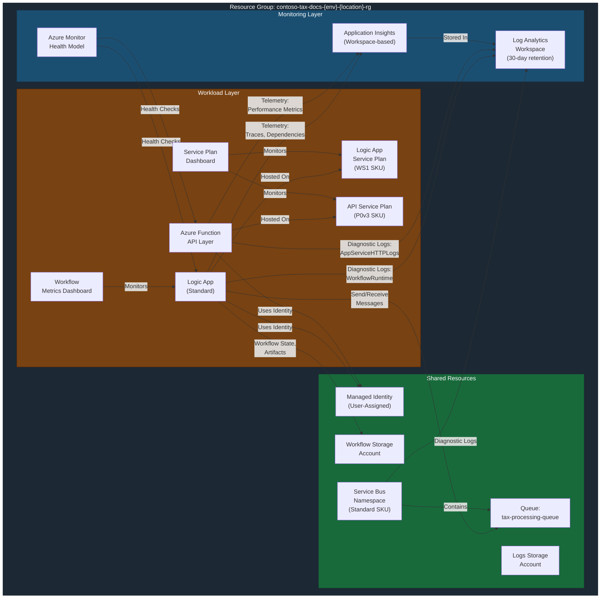
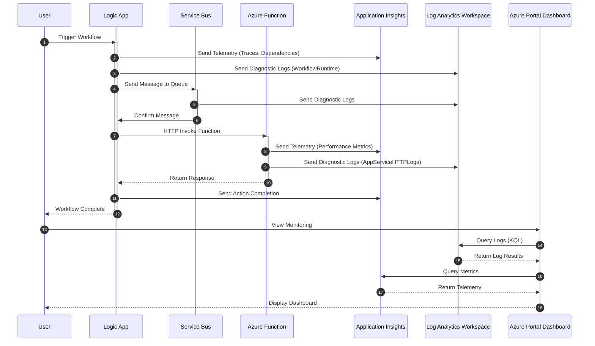

# Azure Logic Apps Monitoring

This project demonstrates Azure Monitor best practices for Logic Apps Standard using Infrastructure as Code (IaC) with Bicep templates. It provides a comprehensive monitoring solution for beginner-to-intermediate developers and architects who want to implement observability patterns for enterprise workflow orchestration.


## Prerequisites

Before deploying this solution, ensure you have the following:

- **Azure Subscription** with permissions to create resources and assign RBAC (Role-Based Access Control) roles
- **Azure Developer CLI (azd)** version 1.5.0 or later - [Installation Guide](https://learn.microsoft.com/azure/developer/azure-developer-cli/install-azd)
- **Azure CLI** version 2.50.0 or later - [Installation Guide](https://learn.microsoft.com/cli/azure/install-azure-cli)
- **Bicep CLI** version 0.20.0 or later (installed with Azure CLI)
- **VS Code** (recommended) with the following extensions:
  - Azure Logic Apps (Standard) extension
  - Bicep extension
  - Azure Account extension

## File Structure

```
Azure-LogicApps-Monitoring/
├── .azure/                          # Azure Developer CLI configuration
│   ├── config.json                  # Environment configuration
│   └── {env}/                       # Environment-specific settings (dev/uat/prod)
├── infra/                           # Infrastructure as Code (Bicep templates)
│   ├── main.bicep                   # Root orchestrator (subscription-level deployment)
│   └── main.parameters.json         # Deployment parameters
├── src/                             # Modular Bicep infrastructure
│   ├── monitoring/                  # Monitoring infrastructure
│   │   ├── main.bicep              # Monitoring orchestrator
│   │   ├── log-analytics-workspace.bicep
│   │   ├── app-insights.bicep
│   │   └── azure-monitor-health-model.bicep
│   ├── shared/                      # Shared resources
│   │   ├── main.bicep              # Shared resources orchestrator
│   │   ├── data/                   # Storage account module
│   │   │   └── main.bicep
│   │   └── messaging/              # Service Bus module
│   │       └── main.bicep
│   └── workload/                    # Application workload
│       ├── main.bicep              # Workload orchestrator
│       ├── logic-app.bicep         # Logic App (Standard) + dashboards
│       └── azure-function.bicep    # Azure Functions API layer
├── tax-docs/                        # Sample Logic App workflow
│   ├── tax-processing/             # Tax processing workflow
│   │   └── workflow.json           # Workflow definition (stateful)
│   ├── Artifacts/                  # Integration artifacts (maps, schemas, rules)
│   ├── connections.json            # Managed API connections
│   └── host.json                   # Runtime configuration
├── azure.yaml                       # Azure Developer CLI project definition
├── host.json                        # Default host configuration
└── README.md                        # This file
```

## Architecture

### System Architecture

The following diagram illustrates the high-level architecture of the monitoring solution deployed across Azure resource groups:


```mermaid
flowchart TB
    subgraph rg["Resource Group: contoso-tax-docs-{env}-{location}-rg"]
        subgraph monitoring["Monitoring Layer"]
            law["Log Analytics<br/>Workspace<br/>(30-day retention)"]
            ai["Application Insights<br/>(Workspace-based)"]
            ahm["Azure Monitor<br/>Health Model"]
        end
        
        subgraph shared["Shared Resources"]
            mi["Managed Identity<br/>(User-Assigned)"]
            wsa["Workflow Storage<br/>Account"]
            lsa["Logs Storage<br/>Account"]
            sb["Service Bus<br/>Namespace<br/>(Standard SKU)"]
            sbq["Queue:<br/>tax-processing-queue"]
        end
        
        subgraph workload["Workload Layer"]
            lasp["Logic App<br/>Service Plan<br/>(WS1 SKU)"]
            la["Logic App<br/>(Standard)"]
            afsp["API Service Plan<br/>(P0v3 SKU)"]
            af["Azure Function<br/>API Layer"]
            dash1["Service Plan<br/>Dashboard"]
            dash2["Workflow<br/>Metrics Dashboard"]
        end
    end
    
    la -->|Diagnostic Logs:<br/>WorkflowRuntime| law
    la -->|Telemetry:<br/>Traces, Dependencies| ai
    af -->|Diagnostic Logs:<br/>AppServiceHTTPLogs| law
    af -->|Telemetry:<br/>Performance Metrics| ai
    la -->|Uses Identity| mi
    af -->|Uses Identity| mi
    la -->|Workflow State,<br/>Artifacts| wsa
    la -->|Send/Receive<br/>Messages| sbq
    sb -->|Contains| sbq
    sb -->|Diagnostic Logs| law
    ai -->|Stored In| law
    ahm -->|Health Checks| la
    ahm -->|Health Checks| af
    la -->|Hosted On| lasp
    af -->|Hosted On| afsp
    dash1 -->|Monitors| lasp
    dash1 -->|Monitors| afsp
    dash2 -->|Monitors| la
    
    style monitoring fill:#1B4F72,stroke:#154360,color:#FFFFFF
    style shared fill:#186A3B,stroke:#145A32,color:#FFFFFF
    style workload fill:#784212,stroke:#6E2C00,color:#FFFFFF
    style rg fill:#1C2833,stroke:#17202A,color:#FFFFFF
```

### Data Flow

This sequence diagram shows how monitoring data flows through the system during workflow execution:


```mermaid
sequenceDiagram
    autonumber
    participant User
    participant LA as Logic App
    participant SB as Service Bus
    participant AF as Azure Function
    participant AI as Application Insights
    participant LAW as Log Analytics Workspace
    participant Portal as Azure Portal Dashboard
    
    User->>LA: Trigger Workflow
    activate LA
    LA->>AI: Send Telemetry (Traces, Dependencies)
    LA->>LAW: Send Diagnostic Logs (WorkflowRuntime)
    LA->>SB: Send Message to Queue
    activate SB
    SB->>LAW: Send Diagnostic Logs
    SB->>LA: Confirm Message
    deactivate SB
    LA->>AF: HTTP Invoke Function
    activate AF
    AF->>AI: Send Telemetry (Performance Metrics)
    AF->>LAW: Send Diagnostic Logs (AppServiceHTTPLogs)
    AF-->>LA: Return Response
    deactivate AF
    LA->>AI: Send Action Completion
    LA-->>User: Workflow Complete
    deactivate LA
    
    User->>Portal: View Monitoring
    Portal->>LAW: Query Logs (KQL)
    LAW-->>Portal: Return Log Results
    Portal->>AI: Query Metrics
    AI-->>Portal: Return Telemetry
    Portal-->>User: Display Dashboard
```

### Key Components

| Component | Description | Purpose | Key Features |
|-----------|-------------|---------|--------------|
| **Log Analytics Workspace** | Centralized log aggregation service using Kusto Query Language (KQL) | Collects and analyzes diagnostic logs and metrics from all Azure resources | 30-day retention, PerGB2018 pricing tier, immediate purge, system-assigned managed identity |
| **Application Insights** | Application Performance Management (APM) service for distributed tracing | Monitors workflow performance, dependencies, and execution telemetry | Workspace-based architecture, distributed tracing, live metrics, custom properties |
| **Azure Monitor Health Model** | Hierarchical health monitoring service groups | Tracks resource health status and availability across tenant | Tenant-level deployment, parent-child hierarchy, health rollup |
| **Logic App (Standard)** | Workflow orchestration engine with stateful execution | Executes business process workflows with durable state management | WS1 (Workflow Standard) SKU, elastic scaling (up to 20 workers), system-assigned managed identity, DOTNET runtime |
| **Azure Function App** | Serverless compute platform for API layer | Executes event-driven code triggered by HTTP requests | P0v3 (Premium v3) SKU, Linux platform, .NET Core 9.0 runtime, always-on enabled |
| **Managed Identity** | Azure AD (Entra ID) identity for keyless authentication | Enables secure authentication to Azure services without credentials | User-assigned identity, RBAC role assignments, eliminates connection string storage |
| **Workflow Storage Account** | Blob, Queue, Table, and File storage for Logic Apps runtime | Stores workflow definitions, run history, checkpoints, and artifacts | Standard_LRS SKU, Hot tier, TLS 1.2 minimum, HTTPS-only enforced |
| **Logs Storage Account** | Separate storage account for diagnostic logs | Stores diagnostic logs independently from workflow data | Standard_LRS SKU, Hot tier, separate lifecycle management |
| **Service Bus Namespace** | Enterprise messaging service with queues and topics | Enables reliable message-based communication between services | Standard SKU, managed identity authentication (disableLocalAuth: true), 14-day message TTL (Time To Live) |
| **Azure Portal Dashboards** | Pre-configured monitoring dashboards for metrics visualization | Provides real-time visibility into resource performance and health | Service Plan metrics (CPU, Memory, Data I/O), Workflow metrics (Runs, Failures, Duration), 24-hour time range |

### RBAC Roles

| Role Name | Description | Documentation Link |
|-----------|-------------|--------------------|
| **Storage Blob Data Owner** | Full control over blob containers and data (read, write, delete, manage ACLs) | [Learn More](https://learn.microsoft.com/azure/role-based-access-control/built-in-roles#storage-blob-data-owner) |
| **Storage Queue Data Contributor** | Read, write, and delete queue messages | [Learn More](https://learn.microsoft.com/azure/role-based-access-control/built-in-roles#storage-queue-data-contributor) |
| **Storage Table Data Contributor** | Read, write, and delete table entities | [Learn More](https://learn.microsoft.com/azure/role-based-access-control/built-in-roles#storage-table-data-contributor) |
| **Storage File Data Privileged Contributor** | Read, write, delete, and modify ACLs on files and directories | [Learn More](https://learn.microsoft.com/azure/role-based-access-control/built-in-roles#storage-file-data-privileged-contributor) |
| **Storage Account Contributor** | Manage storage account configuration and properties | [Learn More](https://learn.microsoft.com/azure/role-based-access-control/built-in-roles#storage-account-contributor) |
| **Monitoring Metrics Publisher** | Publish metrics to Azure Monitor | [Learn More](https://learn.microsoft.com/azure/role-based-access-control/built-in-roles#monitoring-metrics-publisher) |
| **Azure Service Bus Data Owner** | Full control over Service Bus resources (send, receive, manage entities) | [Learn More](https://learn.microsoft.com/azure/role-based-access-control/built-in-roles#azure-service-bus-data-owner) |
| **Azure Service Bus Data Sender** | Send messages to Service Bus queues and topics | [Learn More](https://learn.microsoft.com/azure/role-based-access-control/built-in-roles#azure-service-bus-data-sender) |
| **Azure Service Bus Data Receiver** | Receive and delete messages from Service Bus queues and subscriptions | [Learn More](https://learn.microsoft.com/azure/role-based-access-control/built-in-roles#azure-service-bus-data-receiver) |

## Features

### Comprehensive Monitoring

This solution implements a full-stack observability approach that captures metrics, logs, and traces across all workflow components. The monitoring infrastructure provides real-time visibility into workflow execution, performance bottlenecks, and system health through centralized log aggregation and analytics.

**Benefits and Best Practices Applied:**

- **Centralized Logging**: All diagnostic logs flow into a single Log Analytics Workspace, enabling cross-resource correlation and unified querying with KQL (Kusto Query Language)
- **Workspace-based Application Insights**: Modern architecture that stores telemetry data in Log Analytics, eliminating data duplication and enabling cross-resource queries
- **Retention Management**: Configurable 30-day log retention with immediate purge policy balances cost optimization and compliance requirements
- **Diagnostic Settings Automation**: Bicep templates automatically configure diagnostic settings for all resources, ensuring consistent log collection without manual portal configuration
- **Health Model Integration**: Hierarchical service groups enable proactive health monitoring with parent-child health rollup

| Feature | Description | Implementation | Configuration |
|---------|-------------|----------------|---------------|
| **Log Analytics Workspace** | Centralized repository for all logs and metrics with KQL query engine | Deployed via log-analytics-workspace.bicep | PerGB2018 SKU, 30-day retention, system-assigned managed identity |
| **Application Insights** | APM (Application Performance Management) solution for workflow telemetry and distributed tracing | Deployed via app-insights.bicep | Workspace-based model, web application type, integrated with Log Analytics |
| **Diagnostic Settings** | Automated log forwarding configuration for all Azure resources | Configured in logic-app.bicep, azure-function.bicep, main.bicep | WorkflowRuntime logs, AppServiceHTTPLogs, Service Bus diagnostic logs, AllMetrics category |
| **Azure Monitor Health Model** | Hierarchical service group for proactive resource health monitoring | Deployed via azure-monitor-health-model.bicep | Tenant-level scope, parent-child hierarchy, health status tracking |
| **Azure Portal Dashboards** | Pre-configured monitoring dashboards with key performance indicators | Deployed in logic-app.bicep and azure-function.bicep | Service Plan metrics (CPU, Memory, Data I/O, HTTP Queue), Workflow metrics (Runs, Failures, Duration, Triggers), 24-hour time range with auto-refresh |

### Metrics & Telemetry

The solution captures comprehensive performance metrics and execution telemetry to enable data-driven optimization and proactive issue detection. Real-time metrics streams help identify performance degradation before it impacts end users.

**Benefits and Best Practices Applied:**

- **End-to-End Tracing**: Distributed tracing across Logic Apps and Azure Functions provides complete request visibility with correlation IDs
- **Action-Level Telemetry**: Granular metrics for each workflow action enable precise performance bottleneck identification
- **Dependency Tracking**: Automatic tracking of HTTP calls, Service Bus operations, and Storage operations with latency measurements
- **Live Metrics Stream**: Real-time metric visualization supports operational troubleshooting and incident response
- **Custom Properties**: Extensible telemetry framework supports business-specific metrics and custom dimensions

| Feature | Description | Metrics Captured | Query Location |
|---------|-------------|------------------|----------------|
| **Workflow Execution Metrics** | Track workflow runs, completion rates, and execution durations | WorkflowRunsStarted, WorkflowRunsCompleted, WorkflowRunsDispatched, WorkflowRunsFailureRate, WorkflowJobExecutionDuration | Application Insights > Metrics, Log Analytics > AzureDiagnostics table |
| **Action-Level Telemetry** | Monitor individual action performance and failure rates | WorkflowActionsFailureRate, ActionStarted, ActionCompleted, ActionFailed, ActionDuration | Log Analytics > Logs (WorkflowRuntime category) |
| **Trigger Monitoring** | Track workflow trigger execution and failure rates | WorkflowTriggersCompleted, WorkflowTriggersFailureRate, TriggerLatency | Application Insights > Metrics, Logic App dashboards |
| **Service Bus Metrics** | Monitor message processing and queue depth | ActiveMessages, DeadLetterMessages, IncomingMessages, OutgoingMessages, ServerErrors | Service Bus Namespace > Metrics |
| **App Service Plan Metrics** | Track compute resource utilization | CpuPercentage, MemoryPercentage, BytesReceived, BytesSent, HttpQueueLength | App Service Plan dashboards, Azure Monitor |
| **Dependency Tracking** | Monitor external service calls with latency and success rates | HTTP request duration, Service Bus send/receive operations, Storage operations | Application Insights > Application Map, Dependencies view |

### Security & Compliance

The solution implements defense-in-depth security patterns with managed identities, RBAC, and network isolation capabilities. All authentication uses Azure AD (Entra ID) identities without storing credentials in configuration or code.

**Benefits and Best Practices Applied:**

- **Zero Credentials**: Managed identities eliminate the need for connection strings, SAS (Shared Access Signature) keys, or passwords in configuration
- **Least Privilege Access**: RBAC role assignments grant only required permissions to each resource, following the principle of least privilege
- **Keyless Authentication**: Service Bus namespace enforces managed identity authentication (disableLocalAuth: true), preventing connection string usage
- **Audit Trail**: All access and operations are logged to Log Analytics for compliance auditing and forensic investigation
- **Secure by Default**: Bicep templates enforce TLS 1.2+ minimum version, HTTPS-only traffic, and secure storage configurations
- **Network Isolation (Planned)**: Architecture supports future private endpoint integration for VNet (Virtual Network) isolation

| Feature | Description | Implementation | Security Benefit |
|---------|-------------|----------------|------------------|
| **Managed Identity** | User-assigned managed identity for keyless authentication to Azure services | Deployed via logic-app.bicep (variable `mi`) | Eliminates credential storage, automatic rotation, no secret management overhead |
| **RBAC Role Assignments** | Fine-grained access control with built-in Azure roles | Configured in logic-app.bicep (variables `storageRBAC`, `appInsightsRBAC`, `sbRBAC`) | Enforces least-privilege access, prevents over-permissioned identities, auditable permissions |
| **Service Bus Authentication** | Managed identity-only authentication (connection strings disabled) | Configured in main.bicep (property `disableLocalAuth: true`) | Prevents credential theft, enforces Azure AD authentication, no shared access keys |
| **Storage Account Security** | TLS 1.2 minimum, HTTPS-only enforcement, shared key access enabled for Logic Apps file share requirement | Configured in main.bicep | Protects data in transit, prevents downgrade attacks, secure file share creation |
| **Diagnostic Log Encryption** | At-rest encryption for all logs stored in Log Analytics and Storage Account | Enabled by default in Azure services | Protects sensitive telemetry data, meets compliance requirements (GDPR, HIPAA) |
| **User-level RBAC (Development)** | RBAC role assignments for deployment user to enable local development | Configured in logic-app.bicep (resources `storageRoleAssignmentsUser`, `appInsightsRoleAssignmentsUser`, `sbRoleAssignmentsUser`) | Enables developers to test workflows locally with Azure resources |

### Infrastructure as Code

The entire solution deploys through modular Bicep templates, enabling repeatable, version-controlled infrastructure deployments across multiple environments. The architecture supports environment-specific configurations and parameter-driven customization.

**Benefits and Best Practices Applied:**

- **Modular Design**: Reusable Bicep modules organized by concern (monitoring, shared, workload) enable component-level testing and deployment
- **Parameter-Driven Configuration**: Environment-specific values externalized to parameter files support dev/uat/prod deployment workflows
- **Idempotent Deployments**: Bicep's declarative syntax ensures safe re-deployment without resource duplication or state drift
- **Type Safety**: Bicep's strongly-typed language prevents common configuration errors with compile-time validation
- **Dependency Management**: Explicit `dependsOn` declarations ensure correct resource deployment order without manual orchestration
- **Output Propagation**: Consistent output patterns enable cross-module reference and Azure DevOps integration

| Feature | Description | Location | Deployment Scope |
|---------|-------------|----------|------------------|
| **Subscription-Level Orchestration** | Root deployment creates resource group and orchestrates all modules | main.bicep | Subscription (targetScope: 'subscription') |
| **Monitoring Module** | Self-contained module for Log Analytics, Application Insights, and Health Model | main.bicep | Resource group |
| **Shared Resources Module** | Deploys storage accounts, Service Bus, and managed identities | main.bicep | Resource group |
| **Workload Module** | Orchestrates Logic App, Azure Functions, dashboards, and RBAC assignments | main.bicep | Resource group |
| **Azure Developer CLI Support** | Simplified deployment workflow with `azd` commands and environment management | azure.yaml | Project level |
| **Parameter Files** | Environment-specific configuration with token replacement | main.parameters.json | Multi-environment (dev/uat/prod) |
| **Unique Naming** | Deterministic unique naming with `uniqueString()` ensures global uniqueness | All Bicep modules | Cross-region, cross-subscription |
| **Tagging Strategy** | Consistent resource tagging for cost tracking, governance, and automation | main.bicep (variable `tags`) | All resources |

## Installation & Setup

### Clone the Repository

Clone this repository to your local development environment:

```bash
git clone https://github.com/your-org/Azure-LogicApps-Monitoring.git
cd Azure-LogicApps-Monitoring
```

**Expected Output**: The repository will be cloned to your current directory, and your terminal prompt will change to the project folder.

### Login to Azure

Authenticate with Azure using the Azure Developer CLI:

```bash
azd auth login
```

**Expected Output**: A browser window will open for Azure authentication. After successful login, you'll see a confirmation message in the terminal: `Logged in to Azure as <your-email@domain.com>`.

### Initialize Environment

Initialize a new environment for your deployment:

```bash
azd init
```

**Expected Output**: You'll be prompted to:
1. Enter an environment name (e.g., "dev", "uat", "prod") - this creates a configuration folder at `.azure/{environment-name}`
2. Confirm environment creation

The CLI displays: `Environment '{environment-name}' initialized successfully`.

### Provision Infrastructure

Deploy all Azure resources to your subscription:

```bash
azd provision
```

**Expected Output**: The CLI will:
1. Prompt you to select an Azure subscription from your available subscriptions
2. Prompt you to select an Azure region (e.g., "eastus2", "westeurope")
3. Display a deployment plan showing resources to be created
4. Begin deployment with real-time progress updates
5. Display the resource group name and deployed resources upon completion

The deployment typically takes 5-10 minutes. You can monitor detailed progress in the Azure Portal under **Resource Groups > {your-rg-name} > Deployments**. Upon successful completion, you'll see output variables including:
- `RESOURCE_GROUP_NAME`
- `LOGIC_APP_NAME`
- `API_FUNCTION_APP_NAME`
- `AZURE_LOG_ANALYTICS_WORKSPACE_NAME`
- `AZURE_APPLICATION_INSIGHTS_NAME`

## Usage Examples

### Viewing Dashboards

#### Azure Portal Navigation

1. Navigate to the [Azure Portal](https://portal.azure.com)
2. Select **Resource Groups** from the left navigation menu or search for "Resource Groups" in the top search bar
3. Click on your resource group (name format: `contoso-tax-docs-{env}-{location}-rg`)
4. In the resource list, locate the **Logic App** resource (name ends with `-logicapp`)
5. Click **Monitoring** in the left menu, then select **Metrics** to view real-time workflow metrics
6. To view pre-configured dashboards, click **Overview** in the left menu, then scroll to the **Monitoring** tab
7. For Log Analytics queries, locate the **Log Analytics Workspace** resource in the resource group
8. Click **Logs** in the left menu to open the KQL (Kusto Query Language) query editor

#### CLI Command

Open the Azure Portal directly to your resource group:

```bash
az group show --name $(azd env get-values | grep RESOURCE_GROUP_NAME | cut -d'=' -f2 | tr -d '"') --output json | jq -r '.id' | xargs -I {} az portal dashboard show --resource-group {}
```

Alternatively, open the Logic App directly:

```bash
az resource show --ids $(azd env get-values | grep LOGIC_APP_ID | cut -d'=' -f2 | tr -d '"') --query id -o tsv | xargs -I {} echo "https://portal.azure.com/#@/resource{}/overview"
```

### Log Analytics Queries

#### Track Workflow Execution Status

This query retrieves the status of all workflow runs in the last 24 hours, including run duration and final status:

```kql
AzureDiagnostics
| where ResourceProvider == "MICROSOFT.WEB"
| where Category == "WorkflowRuntime"
| where OperationName == "Microsoft.Logic/workflows/workflowRunCompleted"
| extend workflowName = tostring(split(resource_workflowName_s, '/')[1])
| extend status = tostring(status_s)
| extend startTime = todatetime(startTime_t)
| extend endTime = todatetime(endTime_t)
| extend duration = datetime_diff('second', endTime, startTime)
| where startTime >= ago(24h)
| project 
    TimeGenerated,
    workflowName,
    status,
    duration,
    resource_runId_s,
    CorrelationId = correlation_clientTrackingId_s
| order by TimeGenerated desc
```

**Purpose**: Identify failed workflows, track completion rates, analyze execution patterns, and investigate specific workflow runs using the run ID or correlation ID.

**Common Filters**:
- Failed runs only: Add `| where status == "Failed"`
- Slow executions: Add `| where duration > 30` (runs longer than 30 seconds)
- Specific workflow: Add `| where workflowName == "tax-processing"`

#### Track Performance Metrics

This query analyzes workflow action durations to identify performance bottlenecks and slow-running actions:

```kql
AzureDiagnostics
| where ResourceProvider == "MICROSOFT.WEB"
| where Category == "WorkflowRuntime"
| where OperationName has "ActionCompleted"
| extend workflowName = tostring(split(resource_workflowName_s, '/')[1])
| extend actionName = resource_actionName_s
| extend duration = todouble(resource_duration_d)
| where TimeGenerated >= ago(24h)
| summarize 
    AvgDuration = avg(duration),
    MaxDuration = max(duration),
    MinDuration = min(duration),
    P50Duration = percentile(duration, 50),
    P95Duration = percentile(duration, 95),
    ExecutionCount = count()
    by workflowName, actionName
| where AvgDuration > 1000  // Actions taking more than 1 second on average
| order by AvgDuration desc
```

**Purpose**: Optimize workflow performance by identifying slow actions, setting performance baselines, and detecting performance regressions. The P50 and P95 percentiles help distinguish typical performance from outliers.

**Performance Tuning**:
- For HTTP actions: Check P95Duration to identify network latency issues
- For database actions: Analyze MaxDuration to find slow queries
- For transformation actions: Compare ExecutionCount to identify high-volume bottlenecks

#### Monitor Failed Actions with Error Details

This query provides detailed error information for failed workflow actions, including error codes and messages:

```kql
AzureDiagnostics
| where ResourceProvider == "MICROSOFT.WEB"
| where Category == "WorkflowRuntime"
| where status_s == "Failed"
| extend workflowName = tostring(split(resource_workflowName_s, '/')[1])
| extend actionName = resource_actionName_s
| extend errorCode = error_code_s
| extend errorMessage = error_message_s
| extend runId = resource_runId_s
| extend correlationId = correlation_clientTrackingId_s
| where TimeGenerated >= ago(7d)
| project 
    TimeGenerated,
    workflowName,
    actionName,
    errorCode,
    errorMessage,
    runId,
    correlationId
| order by TimeGenerated desc
```

**Purpose**: Troubleshoot workflow failures by examining error patterns, identifying root causes, and correlating errors across multiple workflow runs.

**Error Analysis**:
- Group by error code: Add `| summarize count() by errorCode | order by count_ desc`
- Find recurring errors: Add `| summarize ErrorCount = count() by errorMessage | where ErrorCount > 5`
- Track error trends: Add `| summarize ErrorCount = count() by bin(TimeGenerated, 1h) | render timechart`

#### Monitor Service Bus Queue Depth and Processing Rate

This query tracks Service Bus queue metrics to ensure messages are being processed efficiently:

```kql
AzureMetrics
| where ResourceProvider == "MICROSOFT.SERVICEBUS"
| where MetricName in ("ActiveMessages", "DeadLetterMessages", "IncomingMessages", "OutgoingMessages")
| where TimeGenerated >= ago(24h)
| summarize 
    AvgValue = avg(Total),
    MaxValue = max(Total)
    by MetricName, bin(TimeGenerated, 5m)
| render timechart
```

**Purpose**: Monitor message backlog, detect processing delays, and identify dead-letter message accumulation that indicates systematic failures.

## Additional Resources

- **Azure Logic Apps Documentation**: [https://learn.microsoft.com/azure/logic-apps/](https://learn.microsoft.com/azure/logic-apps/)
- **Monitor Logic Apps Overview**: [https://learn.microsoft.com/azure/logic-apps/monitor-logic-apps-overview](https://learn.microsoft.com/azure/logic-apps/monitor-logic-apps-overview)
- **Azure Monitor Documentation**: [https://learn.microsoft.com/azure/azure-monitor/](https://learn.microsoft.com/azure/azure-monitor/)
- **Application Insights for Logic Apps**: [https://learn.microsoft.com/azure/logic-apps/monitor-workflows-collect-diagnostic-data](https://learn.microsoft.com/azure/logic-apps/monitor-workflows-collect-diagnostic-data)
- **Bicep Documentation**: [https://learn.microsoft.com/azure/azure-resource-manager/bicep/](https://learn.microsoft.com/azure/azure-resource-manager/bicep/)
- **Azure Developer CLI**: [https://learn.microsoft.com/azure/developer/azure-developer-cli/](https://learn.microsoft.com/azure/developer/azure-developer-cli/)
- **Kusto Query Language (KQL)**: [https://learn.microsoft.com/azure/data-explorer/kusto/query/](https://learn.microsoft.com/azure/data-explorer/kusto/query/)
- **Logic Apps Monitoring Best Practices**: [https://learn.microsoft.com/azure/logic-apps/monitor-logic-apps](https://learn.microsoft.com/azure/logic-apps/monitor-logic-apps)
- **Azure RBAC Built-in Roles**: [https://learn.microsoft.com/azure/role-based-access-control/built-in-roles](https://learn.microsoft.com/azure/role-based-access-control/built-in-roles)
- **Azure Service Bus Documentation**: [https://learn.microsoft.com/azure/service-bus-messaging/](https://learn.microsoft.com/azure/service-bus-messaging/)

---

**License**: This project is licensed under the MIT License - see the LICENSE.md file for details.

**Contributing**: Contributions are welcome! Please read CONTRIBUTING.md for details on our code of conduct and the process for submitting pull requests.

**Security**: For security concerns, please review our SECURITY.md policy.